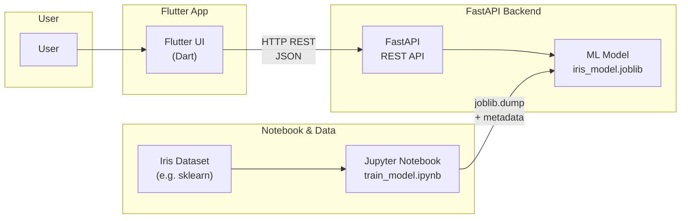
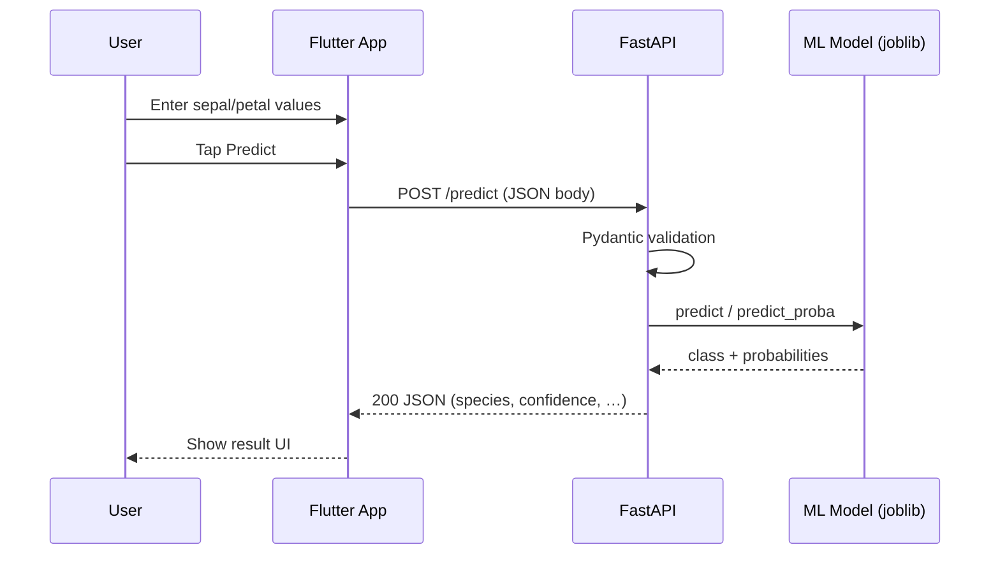

<a id="top"></a>

# Full-Stack Application Architecture for Machine Learning — Flutter + FastAPI + Jupyter Notebook

> **Project**: Iris flower species classification (demonstration stack)  
> **Stack**: Flutter (Dart) · FastAPI (Python) · Jupyter Notebook · scikit-learn · joblib

---

## Table of Contents

| # | Section |
|---|---------|
| 1 | [Introduction — Why a Full-Stack Architecture for ML?](#section-1) |
| 2 | [Architecture Overview](#section-2) |
| 3 | [The Role of Jupyter Notebook](#section-3) |
| 4 | [The Role of the FastAPI Backend](#section-4) |
| 5 | [The Role of the Flutter Frontend](#section-5) |
| 6 | [Project Structure](#section-6) |
| 7 | [End-to-End Data Flow](#section-7) |
| 8 | [Frontend ↔ Backend Communication](#section-8) |
| 9 | [Python Virtual Environment — Why and How](#section-9) |
| 10 | [Deployment and Perspectives](#section-10) |
| 11 | [Conclusion and Summary](#section-11) |

---

<a id="section-1"></a>

<details>
<summary>1 - Introduction — Why a Full-Stack Architecture for ML?</summary>

### From experiment to product

Machine learning often starts in a **notebook**: you load data, train a model, and inspect metrics. To turn that work into something others can use, you typically add:

1. A **serving layer** that loads the trained artifact and answers prediction requests.
2. A **client application** that collects inputs, calls the API, and presents results.

A **full-stack** layout separates these concerns cleanly: the notebook owns *how* the model is built; the API owns *how* it is served; the Flutter app owns *how* users interact.

### Why split frontend, backend, and training?

| Concern | Owned by | Benefit |
|---------|----------|---------|
| Data exploration & training | Jupyter | Fast iteration, rich visuals, reproducible cells |
| Model persistence & inference | FastAPI | Stable contract (REST + JSON), security boundary |
| UX & deployment to devices | Flutter | Native-feel UI, Material Design 3, multi-platform |

### Typical pain points this architecture addresses

- **Coupling UI to training code** — Hard to change the model without breaking the app; a REST API defines a stable interface.
- **No clear deployment path** — A notebook is not a production server; FastAPI + Uvicorn (or containers) scales that story.
- **Limited reach of a browser-only demo** — Flutter targets mobile, desktop, and web from one codebase while still talking to the same API.

### When is this stack a good fit?

| Scenario | Fit |
|----------|-----|
| Teaching full-stack ML with a real mobile/web UI | Strong |
| Demos where the UI must feel like a “real app” | Strong |
| Heavy custom visualization inside Python only | Consider Streamlit or notebooks only |
| Largest-scale production ML (feature stores, online learning) | Extend with MLOps, queues, auth, monitoring |

</details>

<p align="right"><a href="#top">↑ Back to top</a></p>

---

<a id="section-2"></a>

<details>
<summary>2 - Architecture Overview</summary>

### High-level diagram

The user interacts with a **Flutter** client. The client talks to **FastAPI** over **HTTP REST**. FastAPI loads a **scikit-learn** model serialized with **joblib**. The **Jupyter** notebook trains that model and writes the `.joblib` file (and metadata). The classic **Iris** dataset (for example via scikit-learn) feeds the notebook pipeline.



### Layer responsibilities (short)

| Layer | Technology | Responsibility |
|-------|------------|----------------|
| Presentation | Flutter | Forms, validation UX, API calls, result screens |
| Application / API | FastAPI | Routing, validation, CORS, error handling, inference |
| Model artifact | joblib + JSON | Trained estimator and metadata on disk |
| Research / training | Jupyter | EDA, training, evaluation, export |

### Design principle: contract-first

The **REST API** is the contract between Dart and Python. As long as request/response JSON shapes stay compatible, you can retrain the model or refactor the notebook without rewriting the Flutter layer—beyond optional UI updates for new fields.

</details>

<p align="right"><a href="#top">↑ Back to top</a></p>

---

<a id="section-3"></a>

<details>
<summary>3 - The Role of Jupyter Notebook</summary>

### ML pipeline in the notebook

A typical **end-to-end ML pipeline** in `notebook/train_model.ipynb` follows this flow:

1. **Load data** — Import the Iris dataset (or a CSV), build a pandas `DataFrame` if needed.
2. **Explore** — Summary statistics, plots, class balance, correlation checks.
3. **Train** — Choose an algorithm (e.g. Random Forest), fit on features and labels.
4. **Evaluate** — Hold-out split or cross-validation; accuracy, confusion matrix, classification report.
5. **Export model** — `joblib.dump(model, ...)` to `backend/models/iris_model.joblib` and write `model_metadata.json` (feature names, accuracy, label mapping, etc.).

### Why keep training in a notebook?

| Reason | Explanation |
|--------|-------------|
| Narrative + code | Cells document *why* each step exists |
| Visual feedback | Inline charts support EDA and debugging |
| Low ceremony | No need to deploy training as a service for learning projects |

### Handoff to the backend

After export, **FastAPI** does not retrain; it **loads** the artifact at startup. If the model file is missing, the API should fail fast with a clear message pointing back to the notebook.

### Example: conceptual export snippet (Python)

```python
import joblib
import json
from pathlib import Path

model_dir = Path("../backend/models")
model_dir.mkdir(parents=True, exist_ok=True)

joblib.dump(model, model_dir / "iris_model.joblib")

metadata = {
    "model_type": "RandomForestClassifier",
    "feature_names": ["sepal_length", "sepal_width", "petal_length", "petal_width"],
    "accuracy": float(test_accuracy),
}
(model_dir / "model_metadata.json").write_text(json.dumps(metadata, indent=2))
```

Paths may differ on your machine; the important idea is a **single canonical location** the API reads from.

</details>

<p align="right"><a href="#top">↑ Back to top</a></p>

---

<a id="section-4"></a>

<details>
<summary>4 - The Role of the FastAPI Backend</summary>

### Core responsibilities

1. **Load the model** once at startup (e.g. `@app.on_event("startup")` or lifespan) using `joblib.load`.
2. **Expose REST endpoints** such as health, model info, and **POST `/predict`** (or equivalent) returning JSON.
3. **Enable CORS** so a Flutter app (or browser build) on another origin can call the API during development.
4. **Validate payloads** with **Pydantic** models: types, ranges, and documentation for OpenAPI/Swagger.

### CORS in development

Flutter web and separate ports (e.g. app on one port, API on `localhost:8000`) trigger browser **same-origin** rules. **CORSMiddleware** allows the frontend origin to send `POST` requests with JSON bodies.

```python
from fastapi import FastAPI
from fastapi.middleware.cors import CORSMiddleware

app = FastAPI(title="Iris Prediction API")

app.add_middleware(
    CORSMiddleware,
    allow_origins=["*"],  # tighten in production
    allow_credentials=True,
    allow_methods=["*"],
    allow_headers=["*"],
)
```

### Pydantic request/response models

Validation catches bad inputs *before* inference—wrong types, negative lengths, etc.

```python
from pydantic import BaseModel, Field

class PredictionRequest(BaseModel):
    sepal_length: float = Field(..., ge=0, le=10)
    sepal_width: float = Field(..., ge=0, le=10)
    petal_length: float = Field(..., ge=0, le=10)
    petal_width: float = Field(..., ge=0, le=10)

class PredictionResponse(BaseModel):
    species: str
    confidence: float
    probabilities: dict[str, float]
```

### Typical endpoint flow

| Step | Action |
|------|--------|
| 1 | Parse JSON body into `PredictionRequest` |
| 2 | `numpy` array shaped `(1, 4)` for feature vector |
| 3 | `model.predict` / `predict_proba` |
| 4 | Map class index to species name using metadata |
| 5 | Return `PredictionResponse` as JSON |

FastAPI automatically generates **OpenAPI** docs at `/docs`, which is invaluable for debugging alongside Flutter.

</details>

<p align="right"><a href="#top">↑ Back to top</a></p>

---

<a id="section-5"></a>

<details>
<summary>5 - The Role of the Flutter Frontend</summary>

### What Flutter does in this stack

- **Collects** sepal/petal measurements via text fields, sliders, or other widgets.
- **Serializes** them to JSON matching the FastAPI `PredictionRequest` schema.
- **Sends** an HTTP `POST` to the backend base URL (e.g. `http://localhost:8000/predict`).
- **Parses** the JSON response and **displays** predicted species, confidence, and optional probability bars.
- Applies **Material Design 3** theming for a consistent, accessible UI.

### Suggested project layout (Dart)

| Area | Role |
|------|------|
| `lib/screens/` | Full screens (home, result) |
| `lib/widgets/` | Reusable UI pieces |
| `lib/services/` | `http` / `dio` client, base URL configuration |
| `lib/models/` | Dart classes mirroring JSON (e.g. `fromJson`) |

### Example: HTTP call shape (Dart, illustrative)

```dart
import 'dart:convert';
import 'package:http/http.dart' as http;

Future<Map<String, dynamic>> predictIris({
  required String baseUrl,
  required double sepalLength,
  required double sepalWidth,
  required double petalLength,
  required double petalWidth,
}) async {
  final uri = Uri.parse('$baseUrl/predict');
  final response = await http.post(
    uri,
    headers: {'Content-Type': 'application/json; charset=utf-8'},
    body: jsonEncode({
      'sepal_length': sepalLength,
      'sepal_width': sepalWidth,
      'petal_length': petalLength,
      'petal_width': petalWidth,
    }),
  );
  if (response.statusCode != 200) {
    throw Exception('API error: ${response.statusCode} ${response.body}');
  }
  return jsonDecode(response.body) as Map<String, dynamic>;
}
```

### Material Design 3

Use **Material 3** color schemes, typography, and components (`ThemeData.useMaterial3: true`) so the app aligns with current Android guidelines and feels modern on iOS and web as well.

</details>

<p align="right"><a href="#top">↑ Back to top</a></p>

---

<a id="section-6"></a>

<details>
<summary>6 - Project Structure</summary>

### Directory tree (core teaching layout)

The repository is organized so **one Python virtual environment** and **one `requirements.txt`** support both the notebook and FastAPI. Flutter lives in its own subtree with Dart tooling.

```
full-app-pandas/
├── venv/                              # Python virtual environment (shared)
├── requirements.txt                   # All Python deps: FastAPI, uvicorn, jupyter, sklearn, …
│
├── notebook/                          # Jupyter — train & export model
│   └── train_model.ipynb
│
├── backend/                           # FastAPI — REST API
│   ├── main.py
│   └── models/
│       ├── iris_model.joblib          # Produced by the notebook
│       └── model_metadata.json        # Produced by the notebook
│
├── frontend-flutter/                  # Flutter (Dart) client
│   ├── pubspec.yaml
│   └── lib/
│       ├── main.dart
│       ├── models/
│       ├── services/
│       ├── screens/
│       └── widgets/
│
├── cours-flutter-eng/                 # English course modules (this track)
│   └── 00-Full-Stack-Application-Architecture.md
│
├── README.md
└── …                                  # Optional: Streamlit frontend, French courses, etc.
```

### What each root item is for

| Path | Purpose |
|------|---------|
| `venv/` | Isolated Python interpreter and packages |
| `requirements.txt` | Single source of truth for Python dependencies |
| `notebook/` | Authoritative training and export workflow |
| `backend/` | Serves the model; no training in request path |
| `frontend-flutter/` | User-facing app; consumes REST only |
| `cours-flutter-eng/` | Written curriculum aligned with the codebase |

</details>

<p align="right"><a href="#top">↑ Back to top</a></p>

---

<a id="section-7"></a>

<details>
<summary>7 - End-to-End Data Flow</summary>

### Sequence: from user input to on-screen result



### Data shape at each hop

| Stage | Format |
|-------|--------|
| UI state | Dart `double` / controllers |
| HTTP body | JSON keys like `sepal_length` (snake_case matches Python) |
| Inference | `numpy` float vector length 4 |
| Response | JSON: species name, confidence, per-class probabilities |

### Error paths (conceptual)

- **4xx** — Validation errors (bad JSON, out-of-range floats); Flutter should show a friendly message.
- **5xx** — Server or missing model file; check notebook export and server logs.
- **Network** — Wrong base URL, firewall, or device not reaching `localhost` (use machine LAN IP for physical devices).

</details>

<p align="right"><a href="#top">↑ Back to top</a></p>

---

<a id="section-8"></a>

<details>
<summary>8 - Frontend ↔ Backend Communication</summary>

### HTTP and JSON

- **HTTP** carries the request/response; **JSON** is the payload encoding both sides agree on.
- Flutter’s `http` or `dio` package sends `Content-Type: application/json`.
- FastAPI parses JSON into **Pydantic** models and returns serializable dicts or response models.

### CORS recap

| Context | Note |
|---------|------|
| Flutter **mobile** | CORS is a browser concern; native apps talk to the server directly |
| Flutter **web** | Browser enforces CORS; backend must allow the dev origin |
| **Production** | Replace `allow_origins=["*"]` with explicit frontend URLs |

### Base URL: `localhost:8000`

During local development, FastAPI often runs with **Uvicorn** on port **8000**:

```bash
uvicorn main:app --reload --host 0.0.0.0 --port 8000
```

| Client | Typical base URL |
|--------|------------------|
| Emulator / same machine | `http://127.0.0.1:8000` or `http://localhost:8000` |
| Physical phone | `http://<your-LAN-IP>:8000` (firewall permitting) |

### OpenAPI as the single contract

Visit `http://localhost:8000/docs` to inspect schemas. Align Dart `fromJson` / `toJson` with those field names and types to avoid silent mismatches.

</details>

<p align="right"><a href="#top">↑ Back to top</a></p>

---

<a id="section-9"></a>

<details>
<summary>9 - Python Virtual Environment — Why and How</summary>

### Why one venv at the project root?

| Benefit | Explanation |
|---------|-------------|
| Reproducibility | Same library versions for notebook and API |
| Simplicity | One activation, one `pip install -r requirements.txt` |
| Teaching clarity | Mirrors how small teams ship ML services |

### Create and activate (Windows PowerShell)

```powershell
cd full-app-pandas
python -m venv venv
.\venv\Scripts\Activate.ps1
pip install -r requirements.txt
```

### Create and activate (Linux / macOS)

```bash
cd full-app-pandas
python3 -m venv venv
source venv/bin/activate
pip install -r requirements.txt
```

### What lives in `requirements.txt`

Everything needed for:

- **Jupyter** (notebook UI, IPython kernel)
- **FastAPI** + **Uvicorn**
- **scikit-learn**, **pandas**, **numpy**, **joblib**
- Any shared utilities you import from both notebook and backend

Keeping **all dependencies in one file** avoids “works in notebook, breaks in API” drift.

### Jupyter kernel

After installing into `venv`, register or select the **same** interpreter as the Jupyter kernel so `import sklearn` resolves identically to `uvicorn`’s environment.

</details>

<p align="right"><a href="#top">↑ Back to top</a></p>

---

<a id="section-10"></a>

<details>
<summary>10 - Deployment and Perspectives</summary>

### From laptop to something others can use

| Approach | Idea |
|----------|------|
| **Docker** | One image for API (Python + Uvicorn); optional second stage for Flutter build artifacts or nginx for web |
| **Cloud VM / PaaS** | Deploy FastAPI to a managed host; point Flutter to HTTPS URL via config |
| **CI/CD** | Notebook export as an artifact or trained model from a pipeline; API deploy on tag |

### Example: multi-stage thinking (conceptual)

```dockerfile
# Illustrative only — tune for your repo
FROM python:3.11-slim
WORKDIR /app
COPY requirements.txt .
RUN pip install --no-cache-dir -r requirements.txt
COPY backend ./backend
ENV MODEL_DIR=/app/backend/models
CMD ["uvicorn", "backend.main:app", "--host", "0.0.0.0", "--port", "8000"]
```

### Production checklist (non-exhaustive)

| Topic | Practice |
|-------|----------|
| CORS | Explicit allowlist of frontend origins |
| HTTPS | Terminate TLS at reverse proxy or platform |
| Secrets | No keys in repo; use env vars / secret manager |
| Observability | Structured logs, metrics, health checks |
| Model updates | Version artifacts; backward-compatible JSON or versioned endpoints |

### Flutter distribution

- **Mobile stores** — Release builds, signing, store policies.
- **Web** — Host static build; ensure API is on HTTPS and CORS matches.

This course focuses on **architecture**; each bullet above is a whole topic for later modules.

</details>

<p align="right"><a href="#top">↑ Back to top</a></p>

---

<a id="section-11"></a>

<details>
<summary>11 - Conclusion and Summary</summary>

### What you should remember

1. **Jupyter** is where the **Iris** data is explored and the **Random Forest** (or similar) is trained and **exported** to `joblib` plus metadata.
2. **FastAPI** **loads** that artifact, validates JSON with **Pydantic**, runs inference, and returns structured responses; **CORS** matters for Flutter **web**.
3. **Flutter** implements the **Material Design 3** experience and **consumes the REST API** over HTTP/JSON—ideally driven by the OpenAPI contract.
4. A **single root `venv`** and **`requirements.txt`** keep Python dependencies aligned for notebook and backend.
5. **End-to-end flow**: user input → Flutter `POST /predict` → FastAPI → model → JSON → UI feedback.

### Mental model in one line

> **Train in the notebook, serve in FastAPI, experience in Flutter** — connected by a stable REST + JSON contract.

### Next steps in the learning path

- Deeper dive into the Iris dataset and pandas exploration.
- Training and evaluation details (metrics, overfitting, model choice).
- FastAPI route design, error handling, and OpenAPI documentation.
- Flutter state management, forms, and robust API error UX.

</details>

<p align="right"><a href="#top">↑ Back to top</a></p>

---
