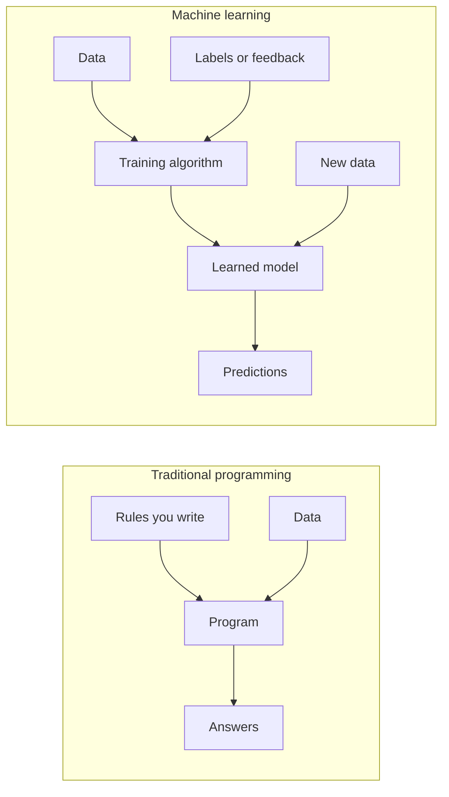
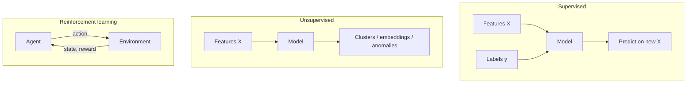
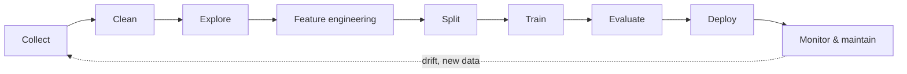

<a id="top"></a>

# Introduction to Artificial Intelligence and Machine Learning

A beginner-friendly, end-to-end overview of core concepts, workflows, tools, and a hands-on path from training to deployment.

---

## Table of Contents

| # | Section | Anchor |
|---|---------|--------|
| 1 | [What is Artificial Intelligence?](#what-is-artificial-intelligence) | `#what-is-artificial-intelligence` |
| 2 | [What is Machine Learning?](#what-is-machine-learning) | `#what-is-machine-learning` |
| 3 | [Types of Learning](#types-of-learning) | `#types-of-learning` |
| 4 | [Classic ML Algorithms](#classic-machine-learning-algorithms) | `#classic-machine-learning-algorithms` |
| 5 | [The ML Pipeline from A to Z](#the-ml-pipeline-from-a-to-z) | `#the-ml-pipeline-from-a-to-z` |
| 6 | [Evaluation Metrics](#evaluation-metrics) | `#evaluation-metrics` |
| 7 | [Overfitting vs Underfitting](#overfitting-vs-underfitting) | `#overfitting-vs-underfitting` |
| 8 | [Python Libraries for ML](#python-libraries-for-machine-learning) | `#python-libraries-for-machine-learning` |
| 9 | [Concrete Example: Iris Classification](#concrete-example-iris-classification) | `#concrete-example-iris-classification` |
| 10 | [From Model to Deployment](#from-model-to-deployment) | `#from-model-to-deployment` |
| 11 | [ML Glossary](#ml-glossary) | `#ml-glossary` |
| 12 | [Conclusion and Next Steps](#conclusion-and-next-steps) | `#conclusion-and-next-steps` |

[↑ Back to top](#top)

---

<a id="what-is-artificial-intelligence"></a>

## 1. What is Artificial Intelligence?

**Artificial Intelligence (AI)** is the field of computer science focused on building systems that can perform tasks that typically require human-like intelligence—such as perception, reasoning, learning, planning, and language understanding.

<details>
<summary><strong>Expand: Formal intuition</strong></summary>

AI is not a single technique. It spans **rules and search** (early expert systems), **statistical learning** (modern ML), and **large-scale pattern models** (e.g., deep learning and foundation models). What they share is the goal: **use data and computation to automate decisions or predictions** under uncertainty.

</details>

### Brief history (high level)

| Era | Focus | Representative ideas |
|-----|--------|----------------------|
| 1950s–60s | Symbolic AI, logic | Early chess programs, theorem proving |
| 1970s–80s | Knowledge systems | Expert systems, rule bases |
| 1990s–2000s | Statistical ML gains | SVMs, random forests, kernel methods |
| 2010s–today | Deep learning at scale | CNNs, Transformers, generative models |

### Narrow AI vs General AI

| Type | Definition | Examples |
|------|------------|----------|
| **Narrow (weak) AI** | Optimized for **one task or domain** | Spam filters, face unlock, recommendation feeds, chess engines |
| **General (strong) AI** | Hypothetical systems with **human-level competence across many tasks** | Not achieved in practice; research and science fiction discuss this frontier |

Today, nearly all deployed systems are **narrow AI**: highly capable within a defined problem, not “conscious” or universally intelligent.

### Everyday examples

- **Voice assistants** (speech recognition + language models)  
- **Navigation apps** (route optimization, traffic prediction)  
- **Fraud detection** in banking  
- **Medical imaging** assist tools (pattern detection)  
- **Translation** and **summarization** apps  

[↑ Back to top](#top)

---

<a id="what-is-machine-learning"></a>

## 2. What is Machine Learning?

**Machine Learning (ML)** is a **subset of AI** where systems **learn patterns from data** instead of being fully hand-coded with explicit rules for every case.

### Traditional programming vs machine learning

| Aspect | Traditional programming | Machine learning |
|--------|-------------------------|------------------|
| Input | Rules + data | Data + answers (labels) or signals |
| Output | Answers | **Rules (a model)** inferred from data |
| Change | Edit code manually | Retrain or fine-tune with new data |



<details>
<summary><strong>Expand: When ML is (and is not) the right tool</strong></summary>

**ML shines** when the mapping from inputs to outputs is **complex**, **high-dimensional**, or **hard to specify** as explicit rules—but you have **enough representative data**.

**Simple deterministic logic** (e.g., tax brackets with fixed tables) is often clearer and safer with **traditional code**, not ML.

</details>

[↑ Back to top](#top)

---

<a id="types-of-learning"></a>

## 3. Types of Learning

### Supervised learning

You have **input features** $X$ and **known outputs** $y$ (labels). The model learns $f$ such that $f(X) \approx y$.

- **Examples**: spam vs not spam, house price prediction, disease diagnosis from tests.

### Unsupervised learning

You have **only inputs** $X$. The model finds **structure**: clusters, low-dimensional representations, anomalies.

- **Examples**: customer segmentation, topic discovery, anomaly detection in logs.

### Reinforcement learning

An **agent** acts in an **environment**, receives **rewards/penalties**, and learns a **policy** (what action to take in each state) to maximize cumulative reward.

- **Examples**: game-playing agents, robotics control, recommendation systems with long-term engagement signals.



### Comparison table

| Paradigm | Typical data | Goal | Example task |
|----------|--------------|------|----------------|
| **Supervised** | $(X, y)$ pairs | Predict $y$ or estimate distribution | Classify emails |
| **Unsupervised** | $X$ only | Discover structure | Group users by behavior |
| **Reinforcement** | Transitions + rewards | Maximize return | Train a game bot |

<details>
<summary><strong>Expand: Semi-supervised and self-supervised</strong></summary>

- **Semi-supervised**: mix of labeled and unlabeled data (common when labels are expensive).  
- **Self-supervised** (common in deep learning): construct supervisory signals from the data itself (e.g., predict masked words or patches), then fine-tune on a downstream task.

</details>

[↑ Back to top](#top)

---

<a id="classic-machine-learning-algorithms"></a>

## 4. Classic Machine Learning Algorithms

The table below summarizes **classic** algorithms you will see in courses and production baselines. Deep learning is included as a **family**; details vary widely by architecture.

| Algorithm | Type | Idea | Typical use |
|-----------|------|------|-------------|
| **Linear regression** | Supervised / regression | Fit a linear relationship $y \approx w^\top x + b$ | Trends, simple forecasting |
| **Logistic regression** | Supervised / classification | Model class probabilities with a sigmoid on a linear score | Binary/multiclass baseline |
| **Decision tree** | Supervised | Recursive splits on features to isolate classes or reduce error | Interpretable rules, mixed data types |
| **Random forest** | Supervised | Ensemble of trees with bagging + random feature subsets | Strong default for tabular data |
| **k-NN (k nearest neighbors)** | Supervised | Label by majority vote of nearest training points | Simple, non-parametric baseline |
| **SVM** | Supervised | Find a margin-maximizing boundary (often with kernels) | Text/small/medium tabular (historically popular) |
| **Neural networks** | Supervised (often) | Stacked nonlinear transformations (layers) | Images, text, audio, complex patterns |

<details>
<summary><strong>Expand: “No free lunch”</strong></summary>

No single algorithm wins on every dataset. Practice usually involves **trying sensible baselines** (e.g., logistic regression, random forest), **proper validation**, and **error analysis** rather than chasing complexity first.

</details>

[↑ Back to top](#top)

---

<a id="the-ml-pipeline-from-a-to-z"></a>

## 5. The ML Pipeline from A to Z

End-to-end ML is more than “train a model.” A robust pipeline covers **data**, **modeling**, and **operations**.



| Stage | What you do | Why it matters |
|-------|-------------|----------------|
| **Collect** | Gather raw data from DBs, APIs, sensors, logs | Bad or biased data limits everything downstream |
| **Clean** | Handle missing values, outliers, duplicates, schema issues | Prevents silent bugs and misleading metrics |
| **Explore** | EDA, visualizations, simple stats | Builds intuition and catches leakage early |
| **Feature engineering** | Scaling, encoding, derived features | Many models need numeric, well-scaled inputs |
| **Split** | Train / validation / test (and cross-validation) | Estimates generalization honestly |
| **Train** | Fit model(s), tune hyperparameters | Learns patterns—can overfit if unchecked |
| **Evaluate** | Metrics, error analysis, fairness checks | Tells you if the model is useful and safe |
| **Deploy** | Package model, API, batch job, edge device | Delivers value to users/systems |

<details>
<summary><strong>Expand: Data leakage warning</strong></summary>

**Leakage** happens when information from the test set (or future) improperly influences training. Classic mistake: fitting preprocessors (e.g., scaler) on the **full dataset** before splitting. Always **fit on training only**, then transform validation/test.

</details>

[↑ Back to top](#top)

---

<a id="evaluation-metrics"></a>

## 6. Evaluation Metrics

For **binary classification**, define:

| | Predicted positive | Predicted negative |
|--|-------------------|-------------------|
| **Actual positive** | True Positive (TP) | False Negative (FN) |
| **Actual negative** | False Positive (FP) | True Negative (TN) |

### Confusion matrix

The **confusion matrix** tabulates TP, FP, TN, FN. For multiclass problems, it generalizes to a square matrix counting predictions vs true labels per class.

### Accuracy

Proportion of correct predictions:

$$
\text{Accuracy} = \frac{TP + TN}{TP + TN + FP + FN}
$$

Use with care when **classes are imbalanced** (a naive “always majority class” model can look accurate).

### Precision

Of all **predicted positives**, how many were correct:

$$
\text{Precision} = \frac{TP}{TP + FP}
$$

### Recall (sensitivity)

Of all **actual positives**, how many you caught:

$$
\text{Recall} = \frac{TP}{TP + FN}
$$

### F1-score

Harmonic mean of precision and recall (balances both):

$$
F_1 = \frac{2 \cdot \text{Precision} \cdot \text{Recall}}{\text{Precision} + \text{Recall}}
$$

<details>
<summary><strong>Expand: Multiclass metrics</strong></summary>

Common approaches: **macro** (average per class with equal weight), **weighted** (average weighted by support), or **micro** (pool all TP/FP/FN globally). Which to use depends on whether you care about **rare classes** equally.

</details>

[↑ Back to top](#top)

---

<a id="overfitting-vs-underfitting"></a>

## 7. Overfitting vs Underfitting

| Concept | What it means | Typical signal |
|---------|---------------|----------------|
| **Underfitting** | Model too simple to capture patterns | Poor performance on **train** and **test** |
| **Overfitting** | Model memorizes train noise | Great on **train**, worse on **test** |

### Mitigations (overview)

| Problem | Directions that often help |
|---------|----------------------------|
| **Underfitting** | Richer features, more expressive model, train longer (if optimization-limited), reduce excessive regularization |
| **Overfitting** | More data, stronger regularization, simpler model, dropout (deep nets), early stopping, better validation, reduce noisy/irrelevant features |

<details>
<summary><strong>Expand: Bias–variance intuition</strong></summary>

**Bias** ≈ systematic error from wrong assumptions (underfitting). **Variance** ≈ sensitivity to training sample noise (overfitting). The goal is a **bias–variance tradeoff** that generalizes.

</details>

[↑ Back to top](#top)

---

<a id="python-libraries-for-machine-learning"></a>

## 8. Python Libraries for Machine Learning

| Library | Role | Typical usage |
|---------|------|----------------|
| **NumPy** | N-dimensional arrays, linear algebra | Fast numeric tensors, model input buffers |
| **pandas** | Tables, time series, I/O | Cleaning, joins, aggregations, CSV/Parquet |
| **matplotlib** (often with **seaborn**) | Plotting | EDA, learning curves, confusion matrices |
| **scikit-learn** | Classical ML + pipelines + metrics | Baselines through production-grade tabular workflows |
| **TensorFlow** | Deep learning framework (Keras API) | Production deployment, TF ecosystem |
| **PyTorch** | Deep learning framework | Research-friendly dynamic graphs, popular in academia |

<details>
<summary><strong>Expand: Ecosystem helpers</strong></summary>

- **Jupyter**: interactive notebooks for exploration.  
- **joblib** / **pickle**: serialize trained models (careful with security for untrusted pickles).  
- **FastAPI** / **Flask**: serve models over HTTP.

</details>

[↑ Back to top](#top)

---

<a id="concrete-example-iris-classification"></a>

## 9. Concrete Example: Iris Classification

The **Iris** dataset is a classic **supervised multiclass classification** benchmark.

| Property | Detail |
|----------|--------|
| **Samples** | 150 flowers |
| **Features (4)** | Sepal length, sepal width, petal length, petal width (cm) |
| **Classes (3)** | *setosa*, *versicolor*, *virginica* |

### sklearn training example

```python
from sklearn.datasets import load_iris
from sklearn.model_selection import train_test_split
from sklearn.preprocessing import StandardScaler
from sklearn.pipeline import Pipeline
from sklearn.ensemble import RandomForestClassifier
from sklearn.metrics import classification_report, accuracy_score

iris = load_iris()
X, y = iris.data, iris.target
feature_names = iris.feature_names
target_names = iris.target_names

X_train, X_test, y_train, y_test = train_test_split(
    X, y, test_size=0.2, random_state=42, stratify=y
)

clf = Pipeline(
    steps=[
        ("scaler", StandardScaler()),
        ("model", RandomForestClassifier(n_estimators=100, random_state=42)),
    ]
)

clf.fit(X_train, y_train)
y_pred = clf.predict(X_test)

print("Accuracy:", accuracy_score(y_test, y_pred))
print(classification_report(y_test, y_pred, target_names=target_names))
```

<details>
<summary><strong>Expand: Why scale + forest?</strong></summary>

Tree ensembles are **less sensitive** to monotonic feature scaling than distance-based models, but a **Pipeline** still keeps preprocessing and training **atomic** (great for serialization and deployment). For **k-NN** or **SVM**, scaling is usually **essential**.

</details>

[↑ Back to top](#top)

---

<a id="from-model-to-deployment"></a>

## 10. From Model to Deployment

### Save the trained model with joblib

```python
import joblib

joblib.dump(clf, "iris_model.joblib")
```

Save **metadata** (feature order, class names, version) alongside the model so the serving layer stays consistent.

### Load in FastAPI and serve predictions

The pattern: load once at **startup**, validate requests with **Pydantic**, run `predict` / `predict_proba` on a NumPy array shaped like training inputs.

```python
from fastapi import FastAPI, HTTPException
from pydantic import BaseModel, Field
import joblib
import numpy as np

app = FastAPI(title="Iris Prediction API")

model = joblib.load("iris_model.joblib")


class PredictionRequest(BaseModel):
    sepal_length: float = Field(..., ge=0, le=10)
    sepal_width: float = Field(..., ge=0, le=10)
    petal_length: float = Field(..., ge=0, le=10)
    petal_width: float = Field(..., ge=0, le=10)


@app.on_event("startup")
def load_resources():
    global model
    model = joblib.load("iris_model.joblib")


@app.post("/predict")
def predict(req: PredictionRequest):
    if model is None:
        raise HTTPException(status_code=503, detail="Model not loaded")
    X = np.array(
        [[req.sepal_length, req.sepal_width, req.petal_length, req.petal_width]]
    )
    pred = model.predict(X)[0]
    proba = model.predict_proba(X)[0]
    return {"predicted_class_index": int(pred), "probabilities": proba.tolist()}
```

Run locally:

```bash
uvicorn main:app --reload --host 0.0.0.0 --port 8000
```

<details>
<summary><strong>Expand: Production checklist</strong></summary>

- **Version** models and datasets; track experiments.  
- **Validate** inputs (ranges, types) and handle **errors** gracefully.  
- **Monitor** latency, throughput, and **data drift**.  
- **Security**: avoid unpickling untrusted files; authenticate endpoints if exposed.

</details>

[↑ Back to top](#top)

---

<a id="ml-glossary"></a>

## 11. ML Glossary

| Term | Meaning |
|------|---------|
| **Feature** | An input variable used by the model (column, pixel, sensor reading). |
| **Label / target** | The quantity to predict in supervised learning. |
| **Training set** | Data used to fit model parameters. |
| **Validation set** | Data used to tune hyperparameters and compare candidates. |
| **Test set** | Held-out data for a final, unbiased estimate of generalization. |
| **Epoch** | One full pass over the training dataset (common in iterative/deep learning training). |
| **Batch** | A subset of training examples processed together in one optimization step. |
| **Hyperparameter** | A setting chosen **before** training (e.g., learning rate, tree depth), not learned from gradients alone in classical setups. |
| **Parameter** | Learned values internal to the model (e.g., weights). |
| **Loss / cost** | A function measuring how wrong predictions are; training minimizes it. |
| **Inference** | Using a trained model to make predictions on new data. |
| **Generalization** | Performance on unseen data, not memorization of the training set. |
| **Regularization** | Penalties or constraints to reduce overfitting (e.g., L2 weight decay). |
| **Cross-validation** | Repeated train/validate splits to estimate performance more reliably. |
| **Embedding** | A learned low-dimensional vector representation of an entity (word, user, image). |

<details>
<summary><strong>Expand: Train vs validation vs test—why three?</strong></summary>

If you tune using the **test** set, you **fit to it indirectly** and metrics become optimistic. Use **validation** (or cross-validation) for decisions; keep **test** truly final.

</details>

[↑ Back to top](#top)

---

<a id="conclusion-and-next-steps"></a>

## 12. Conclusion and Next Steps

You now have a **map of the territory**: what AI and ML are, how learning paradigms differ, which classical algorithms exist, how an end-to-end pipeline flows, how models are measured, how overfitting appears, which Python tools practitioners use, and how a small **Iris** project connects training to a **FastAPI** service.

### Suggested next steps

| Step | Activity |
|------|----------|
| 1 | Reproduce the Iris example and plot a **confusion matrix**. |
| 2 | Swap algorithms (e.g., **logistic regression** vs **random forest**) and compare metrics. |
| 3 | Study **pipelines** and **ColumnTransformer** for mixed numeric/categorical data. |
| 4 | Learn **cross-validation** and **hyperparameter search** (`GridSearchCV` / `RandomizedSearchCV`). |
| 5 | If interested in deep learning, follow a structured course on **PyTorch** or **TensorFlow** with a concrete project. |

[↑ Back to top](#top)

---

*Document version: introductory overview for beginners. Terminology and APIs may evolve; always refer to official library documentation for the latest APIs.*
