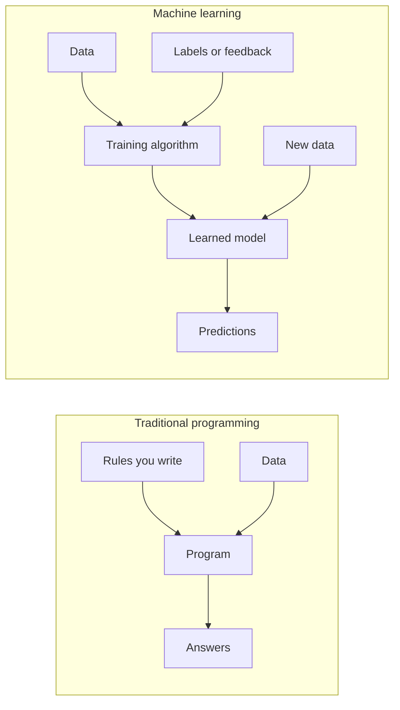
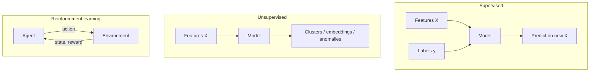
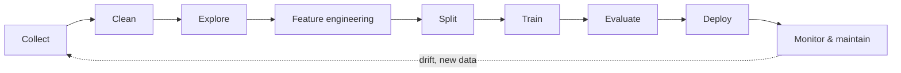

<a id="top"></a>

# Introduction to Artificial Intelligence and Machine Learning

A beginner-friendly, end-to-end overview of core concepts, workflows, tools, and a hands-on path from training to deployment.

---

## Table of Contents

| # | Section | Anchor |
|---|---------|--------|
| 1 | [What is Artificial Intelligence?](#what-is-artificial-intelligence) | `#what-is-artificial-intelligence` |
| 2 | [What is Machine Learning?](#what-is-machine-learning) | `#what-is-machine-learning` |
| 3 | [Types of Learning](#types-of-learning) | `#types-of-learning` |
| 4 | [Classic ML Algorithms](#classic-machine-learning-algorithms) | `#classic-machine-learning-algorithms` |
| 5 | [The ML Pipeline from A to Z](#the-ml-pipeline-from-a-to-z) | `#the-ml-pipeline-from-a-to-z` |
| 6 | [Evaluation Metrics](#evaluation-metrics) | `#evaluation-metrics` |
| 7 | [Overfitting vs Underfitting](#overfitting-vs-underfitting) | `#overfitting-vs-underfitting` |
| 8 | [Python Libraries for ML](#python-libraries-for-machine-learning) | `#python-libraries-for-machine-learning` |
| 9 | [Concrete Example: Iris Classification](#concrete-example-iris-classification) | `#concrete-example-iris-classification` |
| 10 | [From Model to Deployment](#from-model-to-deployment) | `#from-model-to-deployment` |
| 11 | [ML Glossary](#ml-glossary) | `#ml-glossary` |
| 12 | [Conclusion and Next Steps](#conclusion-and-next-steps) | `#conclusion-and-next-steps` |

[↑ Back to top](#top)

---

<a id="what-is-artificial-intelligence"></a>

## 1. What is Artificial Intelligence?

**Artificial Intelligence (AI)** is the field of computer science focused on building systems that can perform tasks that typically require human-like intelligence—such as perception, reasoning, learning, planning, and language understanding.

<details>
<summary><strong>Expand: Formal intuition</strong></summary>

AI is not a single technique. It spans **rules and search** (early expert systems), **statistical learning** (modern ML), and **large-scale pattern models** (e.g., deep learning and foundation models). What they share is the goal: **use data and computation to automate decisions or predictions** under uncertainty.

</details>

### Brief history (high level)

| Era | Focus | Representative ideas |
|-----|--------|----------------------|
| 1950s–60s | Symbolic AI, logic | Early chess programs, theorem proving |
| 1970s–80s | Knowledge systems | Expert systems, rule bases |
| 1990s–2000s | Statistical ML gains | SVMs, random forests, kernel methods |
| 2010s–today | Deep learning at scale | CNNs, Transformers, generative models |

### Narrow AI vs General AI

| Type | Definition | Examples |
|------|------------|----------|
| **Narrow (weak) AI** | Optimized for **one task or domain** | Spam filters, face unlock, recommendation feeds, chess engines |
| **General (strong) AI** | Hypothetical systems with **human-level competence across many tasks** | Not achieved in practice; research and science fiction discuss this frontier |

Today, nearly all deployed systems are **narrow AI**: highly capable within a defined problem, not “conscious” or universally intelligent.

### Everyday examples

- **Voice assistants** (speech recognition + language models)  
- **Navigation apps** (route optimization, traffic prediction)  
- **Fraud detection** in banking  
- **Medical imaging** assist tools (pattern detection)  
- **Translation** and **summarization** apps  

[↑ Back to top](#top)

---

<a id="what-is-machine-learning"></a>

## 2. What is Machine Learning?

**Machine Learning (ML)** is a **subset of AI** where systems **learn patterns from data** instead of being fully hand-coded with explicit rules for every case.

### Traditional programming vs machine learning

| Aspect | Traditional programming | Machine learning |
|--------|-------------------------|------------------|
| Input | Rules + data | Data + answers (labels) or signals |
| Output | Answers | **Rules (a model)** inferred from data |
| Change | Edit code manually | Retrain or fine-tune with new data |



<details>
<summary><strong>Expand: When ML is (and is not) the right tool</strong></summary>

**ML shines** when the mapping from inputs to outputs is **complex**, **high-dimensional**, or **hard to specify** as explicit rules—but you have **enough representative data**.

**Simple deterministic logic** (e.g., tax brackets with fixed tables) is often clearer and safer with **traditional code**, not ML.

</details>

[↑ Back to top](#top)

---

<a id="types-of-learning"></a>

## 3. Types of Learning

### Supervised learning

You have **input features** $X$ and **known outputs** $y$ (labels). The model learns $f$ such that $f(X) \approx y$.

- **Examples**: spam vs not spam, house price prediction, disease diagnosis from tests.

### Unsupervised learning

You have **only inputs** $X$. The model finds **structure**: clusters, low-dimensional representations, anomalies.

- **Examples**: customer segmentation, topic discovery, anomaly detection in logs.

### Reinforcement learning

An **agent** acts in an **environment**, receives **rewards/penalties**, and learns a **policy** (what action to take in each state) to maximize cumulative reward.

- **Examples**: game-playing agents, robotics control, recommendation systems with long-term engagement signals.



### Comparison table

| Paradigm | Typical data | Goal | Example task |
|----------|--------------|------|----------------|
| **Supervised** | $(X, y)$ pairs | Predict $y$ or estimate distribution | Classify emails |
| **Unsupervised** | $X$ only | Discover structure | Group users by behavior |
| **Reinforcement** | Transitions + rewards | Maximize return | Train a game bot |

<details>
<summary><strong>Expand: Semi-supervised and self-supervised</strong></summary>

- **Semi-supervised**: mix of labeled and unlabeled data (common when labels are expensive).  
- **Self-supervised** (common in deep learning): construct supervisory signals from the data itself (e.g., predict masked words or patches), then fine-tune on a downstream task.

</details>

[↑ Back to top](#top)

---

<a id="classic-machine-learning-algorithms"></a>

## 4. Classic Machine Learning Algorithms

The table below summarizes **classic** algorithms you will see in courses and production baselines. Deep learning is included as a **family**; details vary widely by architecture.

| Algorithm | Type | Idea | Typical use |
|-----------|------|------|-------------|
| **Linear regression** | Supervised / regression | Fit a linear relationship $y \approx w^\top x + b$ | Trends, simple forecasting |
| **Logistic regression** | Supervised / classification | Model class probabilities with a sigmoid on a linear score | Binary/multiclass baseline |
| **Decision tree** | Supervised | Recursive splits on features to isolate classes or reduce error | Interpretable rules, mixed data types |
| **Random forest** | Supervised | Ensemble of trees with bagging + random feature subsets | Strong default for tabular data |
| **k-NN (k nearest neighbors)** | Supervised | Label by majority vote of nearest training points | Simple, non-parametric baseline |
| **SVM** | Supervised | Find a margin-maximizing boundary (often with kernels) | Text/small/medium tabular (historically popular) |
| **Neural networks** | Supervised (often) | Stacked nonlinear transformations (layers) | Images, text, audio, complex patterns |

<details>
<summary><strong>Expand: What is "Supervised Learning"? (beginner-friendly)</strong></summary>

Imagine you are a child learning to recognize animals. Your parent **shows you pictures** and tells you: "this is a cat", "this is a dog". Over time, you learn to recognize them on your own. That is **supervised learning** &mdash; the model learns from **labeled examples** (data with known answers).

**Analogy**: A student studying with an answer key. They see the question, check the answer, and adjust their understanding.

The opposite &mdash; **unsupervised learning** &mdash; is like sorting a pile of random toys into groups without anyone telling you what the groups should be. The model discovers patterns on its own.

</details>

<details>
<summary><strong>Expand: Each algorithm explained like you're 10 years old</strong></summary>

#### Linear regression &mdash; Drawing the best straight line

You're at a fair. You notice: the taller the person, the more they weigh (roughly). **Linear regression** draws the **best straight line** through those points so you can guess someone's weight just by knowing their height.

> Real life: Predict apartment price from square meters, estimate electricity bill from consumption.

#### Logistic regression &mdash; Yes or no?

Despite the word "regression", this one **answers yes/no questions**. Should this email go to spam or not? Is this tumor benign or malignant?

It gives you a **probability** (e.g., 87 % chance it's spam) and then picks a side.

> Real life: Credit card approval (yes/no), disease screening (positive/negative).

#### Decision tree &mdash; Playing 20 questions

Remember the game "20 questions"? You ask yes/no questions to narrow down the answer. A decision tree does exactly that:

- Is the petal longer than 2.5 cm? &rarr; **No** &rarr; It's a **Setosa**
- **Yes** &rarr; Is the petal longer than 4.8 cm? &rarr; **Yes** &rarr; It's **Virginica**, etc.

> Real life: A doctor's diagnostic flowchart, a bank's loan approval process.

#### Random forest &mdash; Asking 100 friends and taking a vote

One friend might give you bad advice. But if you ask **100 friends** the same question and take the **majority vote**, you'll almost always get the right answer. A **random forest** is just that: many decision trees voting together.

> Real life: Fraud detection, recommendation systems, medical diagnosis.

#### k-NN (k-Nearest Neighbors) &mdash; Look at your neighbors

You move to a new neighborhood. You don't know if it's a quiet area. So you **look at the 5 nearest houses** &mdash; if 4 out of 5 are quiet families, you conclude it's probably a quiet area. k-NN does the same: it classifies new data by looking at the **k closest known examples**.

> Real life: "Customers who bought this also bought&hellip;", handwriting recognition.

#### SVM (Support Vector Machine) &mdash; Drawing the widest possible road

Imagine red dots and blue dots on a table. You want to draw a line separating them. SVM draws the line that leaves the **widest gap** (margin) between the two groups, making it the most robust separator.

> Real life: Text classification (positive vs negative reviews), image classification.

#### Neural networks &mdash; A brain made of math

Inspired by the human brain. Thousands of tiny "neurons" connected in **layers**. Each neuron does a simple calculation, but together they can learn incredibly complex things: recognize faces, translate languages, drive cars.

> Real life: Voice assistants (Siri, Alexa), self-driving cars, ChatGPT.

</details>

<details>
<summary><strong>Expand: “No free lunch”</strong></summary>

No single algorithm wins on every dataset. Practice usually involves **trying sensible baselines** (e.g., logistic regression, random forest), **proper validation**, and **error analysis** rather than chasing complexity first.

</details>

[↑ Back to top](#top)

---

<a id="the-ml-pipeline-from-a-to-z"></a>

## 5. The ML Pipeline from A to Z

End-to-end ML is more than “train a model.” A robust pipeline covers **data**, **modeling**, and **operations**.



| Stage | What you do | Why it matters |
|-------|-------------|----------------|
| **Collect** | Gather raw data from DBs, APIs, sensors, logs | Bad or biased data limits everything downstream |
| **Clean** | Handle missing values, outliers, duplicates, schema issues | Prevents silent bugs and misleading metrics |
| **Explore** | EDA, visualizations, simple stats | Builds intuition and catches leakage early |
| **Feature engineering** | Scaling, encoding, derived features | Many models need numeric, well-scaled inputs |
| **Split** | Train / validation / test (and cross-validation) | Estimates generalization honestly |
| **Train** | Fit model(s), tune hyperparameters | Learns patterns—can overfit if unchecked |
| **Evaluate** | Metrics, error analysis, fairness checks | Tells you if the model is useful and safe |
| **Deploy** | Package model, API, batch job, edge device | Delivers value to users/systems |

<details>
<summary><strong>Expand: Data leakage warning</strong></summary>

**Leakage** happens when information from the test set (or future) improperly influences training. Classic mistake: fitting preprocessors (e.g., scaler) on the **full dataset** before splitting. Always **fit on training only**, then transform validation/test.

</details>

[↑ Back to top](#top)

---

<a id="evaluation-metrics"></a>

## 6. Evaluation Metrics

For **binary classification**, define:

| | Predicted positive | Predicted negative |
|--|-------------------|-------------------|
| **Actual positive** | True Positive (TP) | False Negative (FN) |
| **Actual negative** | False Positive (FP) | True Negative (TN) |

### Confusion matrix

The **confusion matrix** tabulates TP, FP, TN, FN. For multiclass problems, it generalizes to a square matrix counting predictions vs true labels per class.

### Accuracy

Proportion of correct predictions:

$$
\text{Accuracy} = \frac{TP + TN}{TP + TN + FP + FN}
$$

Use with care when **classes are imbalanced** (a naive “always majority class” model can look accurate).

### Precision

Of all **predicted positives**, how many were correct:

$$
\text{Precision} = \frac{TP}{TP + FP}
$$

### Recall (sensitivity)

Of all **actual positives**, how many you caught:

$$
\text{Recall} = \frac{TP}{TP + FN}
$$

### F1-score

Harmonic mean of precision and recall (balances both):

$$
F_1 = \frac{2 \cdot \text{Precision} \cdot \text{Recall}}{\text{Precision} + \text{Recall}}
$$

<details>
<summary><strong>Expand: Understanding metrics with a real-life COVID testing example</strong></summary>

Imagine a clinic tests **8 people** for COVID. Here's the reality and what the test says:

| Person | Actually has COVID? | Test result |
|--------|-------------------|-------------|
| Alice | **Yes** | **Positive** &#x2714; |
| Bob | **Yes** | **Positive** &#x2714; |
| Carol | **Yes** | **Negative** &#x2718; |
| Dave | No | Negative &#x2714; |
| Eve | No | Negative &#x2714; |
| Frank | No | Negative &#x2714; |
| Grace | No | **Positive** &#x2718; |
| Hank | No | Negative &#x2714; |

From these 8 results:

| | Predicted Positive | Predicted Negative |
|--|---|---|
| **Actually Positive** | **TP = 2** (Alice, Bob) | **FN = 1** (Carol) |
| **Actually Negative** | **FP = 1** (Grace) | **TN = 4** (Dave, Eve, Frank, Hank) |

**What does each cell mean in plain English?**

- **TP (True Positive) = 2** &mdash; Alice and Bob really have COVID and the test correctly says "positive". The test **got it right**.
- **TN (True Negative) = 4** &mdash; Dave, Eve, Frank, and Hank don't have COVID and the test correctly says "negative". The test **got it right** again.
- **FP (False Positive) = 1** &mdash; Grace does **NOT** have COVID, but the test wrongly says "positive". This is a **false alarm**. Think of it like a pregnancy test saying "pregnant" when the woman is **not** pregnant. Scary and stressful for nothing!
- **FN (False Negative) = 1** &mdash; Carol **DOES** have COVID, but the test wrongly says "negative". This is the **most dangerous** error: Carol thinks she's healthy, goes out, and infects others.

**Now let's compute the metrics:**

- **Accuracy** = (2 + 4) / 8 = **75 %** &mdash; 6 out of 8 results are correct. Sounds OK, but is it good enough?
- **Precision** = 2 / (2 + 1) = **66.7 %** &mdash; Of the 3 people the test flagged as positive, only 2 actually had COVID. 1 in 3 positive results is a false alarm.
- **Recall** = 2 / (2 + 1) = **66.7 %** &mdash; Of the 3 people who actually had COVID, the test only caught 2. It **missed** Carol.
- **F1-score** = 2 &times; (0.667 &times; 0.667) / (0.667 + 0.667) = **66.7 %** &mdash; The balance between precision and recall.

**Why does this matter?**

| Situation | What's worse? | Which metric to watch? |
|-----------|--------------|----------------------|
| **COVID / disease screening** | Missing a sick person (FN) | **Recall** must be very high |
| **Spam filter** | Sending important email to spam (FP) | **Precision** must be high |
| **Pregnancy test** | Saying "pregnant" when not (FP) = anxiety; Saying "not pregnant" when pregnant (FN) = missed care | Both matter, use **F1** |
| **Airport security** | Letting a threat through (FN) | **Recall** is critical |

> **Key insight**: A model with 99 % accuracy can still be terrible. If only 1 % of people have a disease and your model always says "healthy", it's 99 % accurate but **catches zero sick people** (recall = 0 %).

</details>

<details>
<summary><strong>Expand: Multiclass metrics</strong></summary>

Common approaches: **macro** (average per class with equal weight), **weighted** (average weighted by support), or **micro** (pool all TP/FP/FN globally). Which to use depends on whether you care about **rare classes** equally.

</details>

[↑ Back to top](#top)

---

<a id="overfitting-vs-underfitting"></a>

## 7. Overfitting vs Underfitting

| Concept | What it means | Typical signal |
|---------|---------------|----------------|
| **Underfitting** | Model too simple to capture patterns | Poor performance on **train** and **test** |
| **Overfitting** | Model memorizes train noise | Great on **train**, worse on **test** |

### Mitigations (overview)

| Problem | Directions that often help |
|---------|----------------------------|
| **Underfitting** | Richer features, more expressive model, train longer (if optimization-limited), reduce excessive regularization |
| **Overfitting** | More data, stronger regularization, simpler model, dropout (deep nets), early stopping, better validation, reduce noisy/irrelevant features |

<details>
<summary><strong>Expand: Overfitting &amp; Underfitting explained for complete beginners</strong></summary>

Think of a **student studying for an exam**.

#### Underfitting &mdash; The student who barely opened the book

They glanced at the chapter titles but never read the content. On exam day, they can't answer **anything** &mdash; neither the questions from the textbook nor the new ones.

> **In ML terms**: the model is too simple. It hasn't learned the patterns in the training data, so it performs badly on everything.

#### Overfitting &mdash; The student who memorized the answer key

They memorized every single answer from past exams **word for word**, including the typos. When the professor changes even a small detail, they're lost.

> **In ML terms**: the model is too complex. It memorized the training data (including the noise and outliers), so it scores perfectly on training data but fails on new data.

#### The sweet spot &mdash; The student who truly understands

They studied the concepts and can answer questions they've **never seen before**, because they learned the underlying logic, not just the examples.

**Real-world analogy**:

| Situation | Underfitting | Overfitting | Good fit |
|-----------|-------------|-------------|----------|
| **Learning to cook** | Only knows "heat food" | Memorized one exact recipe to the gram &mdash; can't adapt if an ingredient is missing | Understands cooking principles &mdash; can improvise |
| **GPS navigation** | Always says "go straight" | Memorized one exact route &mdash; crashes if there's a detour | Knows the road network &mdash; finds alternatives |
| **Spam filter** | Lets all emails through | Blocks everything that has the word "free" (even legitimate emails) | Detects real spam patterns without blocking normal emails |

</details>

<details>
<summary><strong>Expand: Bias–variance intuition</strong></summary>

**Bias** ≈ systematic error from wrong assumptions (underfitting). **Variance** ≈ sensitivity to training sample noise (overfitting). The goal is a **bias–variance tradeoff** that generalizes.

</details>

[↑ Back to top](#top)

---

<a id="python-libraries-for-machine-learning"></a>

## 8. Python Libraries for Machine Learning

| Library | Role | Typical usage |
|---------|------|----------------|
| **NumPy** | N-dimensional arrays, linear algebra | Fast numeric tensors, model input buffers |
| **pandas** | Tables, time series, I/O | Cleaning, joins, aggregations, CSV/Parquet |
| **matplotlib** (often with **seaborn**) | Plotting | EDA, learning curves, confusion matrices |
| **scikit-learn** | Classical ML + pipelines + metrics | Baselines through production-grade tabular workflows |
| **TensorFlow** | Deep learning framework (Keras API) | Production deployment, TF ecosystem |
| **PyTorch** | Deep learning framework | Research-friendly dynamic graphs, popular in academia |

<details>
<summary><strong>Expand: Ecosystem helpers</strong></summary>

- **Jupyter**: interactive notebooks for exploration.  
- **joblib** / **pickle**: serialize trained models (careful with security for untrusted pickles).  
- **FastAPI** / **Flask**: serve models over HTTP.

</details>

<details>
<summary><strong>Expand: Model saving formats &mdash; joblib, pickle, .h5, .keras, ONNX, SavedModel, safetensors, PMML</strong></summary>

After training a model, you need to **save it to disk** so you can reload it later for predictions without retraining. There are many formats &mdash; here's a complete comparison for 2026:

### Quick comparison table

| Format | Extension | Framework | Best for | Still relevant in 2026? |
|--------|-----------|-----------|----------|------------------------|
| **joblib** | `.joblib` `.pkl` | scikit-learn | Small/medium sklearn models | **Yes** &mdash; standard for sklearn |
| **pickle** | `.pkl` `.pickle` | Python (any) | Any Python object | Yes, but security risks |
| **ONNX** | `.onnx` | Cross-framework | Production, multi-language deployment | **Yes** &mdash; growing fast |
| **HDF5 (legacy Keras)** | `.h5` | Old Keras/TF1 | Legacy projects | **Deprecated** &mdash; avoid for new projects |
| **.keras** | `.keras` | Keras 3+ / TF 2.16+ | Keras models (new standard) | **Yes** &mdash; official Keras format |
| **SavedModel** | folder | TensorFlow | TF Serving, TFLite, TF.js | **Yes** &mdash; TF ecosystem standard |
| **safetensors** | `.safetensors` | Hugging Face / PyTorch | LLMs, large models, safe loading | **Yes** &mdash; rapidly becoming the standard for LLMs |
| **TorchScript** | `.pt` `.pth` | PyTorch | PyTorch production | **Yes** &mdash; PyTorch standard |
| **PMML** | `.pmml` | Cross-platform (XML) | Enterprise / Java systems | Niche &mdash; mostly legacy enterprise |

### Detailed breakdown

#### joblib &mdash; The sklearn standard

```python
import joblib

# Save
joblib.dump(model, "model.joblib")

# Load
model = joblib.load("model.joblib")
```

| Pros | Cons |
|------|------|
| Extremely simple (2 lines) | Python-only (can't load in Java, C++, etc.) |
| Efficient with large NumPy arrays | Not secure with untrusted files (arbitrary code execution) |
| De facto standard for scikit-learn | No cross-framework support |

#### pickle &mdash; Python's built-in serialization

```python
import pickle

with open("model.pkl", "wb") as f:
    pickle.dump(model, f)
```

| Pros | Cons |
|------|------|
| Built into Python, no extra dependency | **Security risk**: loading a pickle can execute arbitrary code |
| Works with any Python object | Not portable across Python versions |
| | Slower than joblib for large arrays |

> **Warning**: Never load a pickle file from an untrusted source. It can run malicious code on your machine.

#### .h5 (HDF5) &mdash; Legacy Keras format

```python
# OLD way (Keras < 3 / TF < 2.16)
model.save("model.h5")
model = keras.models.load_model("model.h5")
```

| Pros | Cons |
|------|------|
| Was the standard for years | **Deprecated since Keras 3** (2024) |
| Widely documented in tutorials | Doesn't support all new Keras features |
| | Large file sizes for big models |

> **In 2026**: Only use `.h5` if you're maintaining a legacy project. For new projects, use `.keras`.

#### .keras &mdash; The new Keras 3 standard

```python
# NEW way (Keras 3+ / TF 2.16+)
model.save("model.keras")
model = keras.models.load_model("model.keras")
```

| Pros | Cons |
|------|------|
| Official format since Keras 3 | Relatively new, fewer tutorials |
| Supports all Keras 3 features | Keras-specific |
| ZIP-based, includes config + weights | |

#### ONNX &mdash; The universal translator

```python
# Convert sklearn model to ONNX
from skl2onnx import convert_sklearn
from skl2onnx.common.data_types import FloatTensorType

initial_type = [("input", FloatTensorType([None, 4]))]
onnx_model = convert_sklearn(model, initial_types=initial_type)

with open("model.onnx", "wb") as f:
    f.write(onnx_model.SerializeToString())
```

| Pros | Cons |
|------|------|
| **Cross-language**: load in Python, C++, Java, C#, JavaScript | Conversion step needed |
| **Cross-framework**: from sklearn, PyTorch, TF, etc. | Not all operations supported |
| Optimized inference (ONNX Runtime) | Less flexible than native formats |
| Hardware acceleration (GPU, edge devices) | |

> **In 2026**: ONNX is the go-to choice for production deployment across different languages and platforms.

#### SavedModel &mdash; TensorFlow's ecosystem format

```python
# TensorFlow
model.save("saved_model_dir")  # saves a folder
model = tf.keras.models.load_model("saved_model_dir")
```

| Pros | Cons |
|------|------|
| TF Serving, TFLite, TF.js integration | TensorFlow-only |
| Supports signatures for serving | Saves a folder, not a single file |
| Production-grade | Large for small models |

#### safetensors &mdash; The safe and fast format for large models

```python
from safetensors.torch import save_file, load_file

# Save
save_file(model.state_dict(), "model.safetensors")

# Load
state_dict = load_file("model.safetensors")
model.load_state_dict(state_dict)
```

| Pros | Cons |
|------|------|
| **Secure**: no arbitrary code execution (unlike pickle) | Stores only tensors (not full model architecture) |
| **Fast**: memory-mapped, zero-copy loading | Need to reconstruct model architecture separately |
| Standard for Hugging Face models / LLMs | Newer, less universal |

> **In 2026**: safetensors has become the default for LLMs and Hugging Face models.

### What should YOU use?

| Your situation | Recommended format |
|---------------|-------------------|
| scikit-learn model (our Iris project) | **joblib** |
| Keras / TensorFlow model | **.keras** (not .h5!) |
| PyTorch model | **safetensors** or `.pt` |
| Deploy to production (multi-language) | **ONNX** |
| Hugging Face / LLM | **safetensors** |
| Legacy project with .h5 files | Keep .h5, migrate when possible |

</details>


[↑ Back to top](#top)

---

<a id="concrete-example-iris-classification"></a>

## 9. Concrete Example: Iris Classification

The **Iris** dataset is a classic **supervised multiclass classification** benchmark.

| Property | Detail |
|----------|--------|
| **Samples** | 150 flowers |
| **Features (4)** | Sepal length, sepal width, petal length, petal width (cm) |
| **Classes (3)** | *setosa*, *versicolor*, *virginica* |

### sklearn training example

```python
from sklearn.datasets import load_iris
from sklearn.model_selection import train_test_split
from sklearn.preprocessing import StandardScaler
from sklearn.pipeline import Pipeline
from sklearn.ensemble import RandomForestClassifier
from sklearn.metrics import classification_report, accuracy_score

iris = load_iris()
X, y = iris.data, iris.target
feature_names = iris.feature_names
target_names = iris.target_names

X_train, X_test, y_train, y_test = train_test_split(
    X, y, test_size=0.2, random_state=42, stratify=y
)

clf = Pipeline(
    steps=[
        ("scaler", StandardScaler()),
        ("model", RandomForestClassifier(n_estimators=100, random_state=42)),
    ]
)

clf.fit(X_train, y_train)
y_pred = clf.predict(X_test)

print("Accuracy:", accuracy_score(y_test, y_pred))
print(classification_report(y_test, y_pred, target_names=target_names))
```

<details>
<summary><strong>Expand: Every line of this code explained for absolute beginners</strong></summary>

If you've never written a line of machine learning code, this section is for you. We'll go through **every single concept** step by step, with real-life analogies.

---

#### Step 1: The imports &mdash; Hiring your team of specialists

```python
from sklearn.datasets import load_iris
from sklearn.model_selection import train_test_split
from sklearn.preprocessing import StandardScaler
from sklearn.pipeline import Pipeline
from sklearn.metrics import classification_report, confusion_matrix
```

Think of each `import` as **hiring an expert** for a specific job:

| Import | Role | Real-life analogy |
|--------|------|-------------------|
| `load_iris` | Loads the Iris flower dataset | The **filing clerk** who brings the data folder |
| `train_test_split` | Splits data into training and testing | The **exam administrator** who separates practice exercises from the real exam |
| `StandardScaler` | Rescales numbers to the same range | The **translator** who converts everything to the same unit system |
| `Pipeline` | Chains multiple steps into one | The **assembly line** manager who organizes the workflow |
| `classification_report` | Generates a performance summary | The **report card** generator |
| `confusion_matrix` | Shows what the model got right and wrong | The **detailed answer sheet** showing each mistake |

---

#### Step 2: Loading the data &mdash; Opening the textbook

```python
X, y = load_iris(return_X_y=True)
```

- **`X`** = the **features** (inputs). For Iris, these are 4 measurements per flower: sepal length, sepal width, petal length, petal width. Think of `X` as **the exam questions**.
- **`y`** = the **labels** (correct answers). For Iris: 0 = Setosa, 1 = Versicolor, 2 = Virginica. Think of `y` as **the answer key**.
- We have **150 rows** (flowers) and **4 columns** (measurements).

> **Analogy**: `X` is like a spreadsheet of patient symptoms. `y` is the diagnosis the doctor wrote for each patient.

---

#### Step 3: Train/Test Split &mdash; The exam you can't cheat on

```python
X_train, X_test, y_train, y_test = train_test_split(
    X, y, test_size=0.2, random_state=42, stratify=y
)
```

**Why split?** Imagine a student who only studies from the answer key. On the exact same questions, they score 100%. But give them NEW questions and they fail. That's **overfitting**.

To test fairly, we **hide 20% of the data** (like a surprise exam):

| Variable | What it is | How many rows? | Analogy |
|----------|-----------|---------------|---------|
| `X_train` | Features for training | 120 (80%) | **Practice exercises** the student can study |
| `y_train` | Correct answers for training | 120 (80%) | **Answer key** for the practice exercises |
| `X_test` | Features for testing | 30 (20%) | **Final exam** questions (student has NEVER seen these) |
| `y_test` | Correct answers for testing | 30 (20%) | **Answer key** the teacher keeps sealed until after the exam |

**Parameters explained:**
- `test_size=0.2` &rarr; 20% for testing, 80% for training
- `random_state=42` &rarr; The "seed" for randomness. Using the same number guarantees the **same split every time** (reproducibility). The number 42 is just a convention (it's the "answer to everything" from Hitchhiker's Guide!).
- `stratify=y` &rarr; Makes sure each species is **equally represented** in train and test. Without this, you might accidentally get all Setosa in training and none in testing.

---

#### Step 4: StandardScaler &mdash; The unit converter

```python
StandardScaler()
```

**Problem**: Imagine comparing heights in **centimeters** (150-190) with ages in **years** (20-70). The model might think height matters more simply because the numbers are bigger!

**Solution**: `StandardScaler` transforms each feature so that:
- The **average** becomes **0**
- The **standard deviation** becomes **1**

| Before scaling | After scaling |
|---------------|--------------|
| Petal length: 1.0 - 6.9 cm | Petal length: -1.5 to 1.8 |
| Sepal width: 2.0 - 4.4 cm | Sepal width: -2.4 to 3.1 |

> **Analogy**: It's like converting all currencies to a single currency before comparing prices. You wouldn't compare 5 euros to 500 yen directly!

**Important**: We compute the scaling formula (mean and std) from **training data ONLY**, then apply it to test data. Why? Because in real life, you don't know the test data in advance!

---

#### Step 5: Pipeline &mdash; The assembly line

```python
clf = Pipeline(
    steps=[
        ("scaler", StandardScaler()),
        ("model", LogisticRegression(max_iter=200)),
    ]
)
```

A `Pipeline` chains multiple steps **in order**:

```text
Raw data ──► [Step 1: Scale] ──► [Step 2: Train model] ──► Predictions
```

**Why use a Pipeline instead of doing steps separately?**
1. **No data leakage**: The scaler only sees training data during `fit`
2. **Convenience**: One `fit()` call does everything
3. **Deployment**: Save the whole pipeline as one file with `joblib`

> **Analogy**: A sandwich shop assembly line. Step 1: slice the bread. Step 2: add the filling. You don't skip or reorder steps.

---

#### Step 6: `.fit()` &mdash; The learning phase

```python
clf.fit(X_train, y_train)
```

**This is THE most important line.** This is where the model **actually learns**.

`fit()` means: "Here are 120 flowers with their measurements (`X_train`) and their correct species (`y_train`). **Study them and learn the patterns.**"

Behind the scenes, the model:
1. Looks at **thousands of combinations** of features
2. Finds **rules** like: "If petal length > 2.5 and petal width > 1.7, it's probably Virginica"
3. **Adjusts its internal parameters** to minimize errors

> **Analogy**: `fit` = a student **studying for the exam**. They read the questions and answers, and build understanding.

| Method | What it does | When it runs |
|--------|-------------|-------------|
| `fit(X, y)` | Learn patterns from data | Once (during training) |
| `predict(X)` | Apply learned patterns to new data | Many times (during deployment) |

---

#### Step 7: `.predict()` &mdash; Taking the exam

```python
y_pred = clf.predict(X_test)
```

Now the model faces the **30 flowers it has NEVER seen** (`X_test`). For each one, it uses the rules it learned to guess the species.

- `y_pred` = the model's **guesses** (predicted answers)
- `y_test` = the **real answers** (that we kept hidden)

> **Analogy**: The student takes the final exam. Their answers are `y_pred`. The teacher's answer key is `y_test`. Now we compare them!

---

#### Step 8: `confusion_matrix` &mdash; The detailed report card

```python
confusion_matrix(y_test, y_pred)
```

This produces a table showing **exactly** what the model got right and wrong:

```text
              Predicted:
              Setosa  Versicolor  Virginica
Actual:
  Setosa        10        0          0        ← all 10 Setosa were correctly identified
  Versicolor     0        9          1        ← 9 correct, 1 Versicolor mistaken for Virginica
  Virginica      0        0         10        ← all 10 correct
```

**How to read it:**
- **Diagonal** (top-left to bottom-right) = **correct predictions** &#x2714;
- **Off-diagonal** = **mistakes** &#x2718;
- If all numbers are on the diagonal, the model is **perfect**

> **Analogy**: A teacher grades an exam and makes a table: "For each real answer, what did the student write?" It shows patterns like "the student always confuses Versicolor and Virginica."

---

#### Step 9: `classification_report` &mdash; The summary

```python
classification_report(y_test, y_pred)
```

Prints something like:

```text
              precision    recall  f1-score   support
     setosa       1.00      1.00      1.00        10
 versicolor       1.00      0.90      0.95        10
  virginica       0.91      1.00      0.95        10
   accuracy                           0.97        30
```

| Column | Meaning | Layman's explanation |
|--------|---------|---------------------|
| **precision** | Of those predicted as X, how many really were X? | "When the model says Setosa, can I trust it?" |
| **recall** | Of those that really were X, how many did the model find? | "Does the model catch ALL Setosa flowers?" |
| **f1-score** | Balance of precision and recall | "Overall quality per class" |
| **support** | Number of real samples per class | How many Setosa, Versicolor, Virginica were in the test set |

---

#### The complete picture

```text
┌─────────────────────────────────────────────────────┐
│  150 flowers (X, y)                                 │
│                                                     │
│  ┌──── train_test_split ────┐                       │
│  │                          │                       │
│  ▼                          ▼                       │
│  120 flowers (train)     30 flowers (test)          │
│  │                          │                       │
│  ▼                          │                       │
│  StandardScaler.fit()       │ (learns mean/std)     │
│  │                          │                       │
│  ▼                          ▼                       │
│  Scale train data        Scale test data            │
│  │                       (using train's mean/std)   │
│  ▼                          │                       │
│  model.fit()                │ (learns patterns)     │
│  │                          │                       │
│  │                          ▼                       │
│  │                       model.predict() → y_pred   │
│  │                          │                       │
│  │                          ▼                       │
│  │                       Compare y_pred vs y_test   │
│  │                          │                       │
│  │                          ▼                       │
│  │                       confusion_matrix + report  │
│  │                          │                       │
│  │                          ▼                       │
│  │                       "97% accuracy!" 🎉         │
│  └──────────────────────────┘                       │
└─────────────────────────────────────────────────────┘
```

</details>

<details>
<summary><strong>Expand: Why scale + forest?</strong></summary>

Tree ensembles are **less sensitive** to monotonic feature scaling than distance-based models, but a **Pipeline** still keeps preprocessing and training **atomic** (great for serialization and deployment). For **k-NN** or **SVM**, scaling is usually **essential**.

</details>

[↑ Back to top](#top)

---

<a id="from-model-to-deployment"></a>

## 10. From Model to Deployment

### Save the trained model with joblib

```python
import joblib

joblib.dump(clf, "iris_model.joblib")
```

Save **metadata** (feature order, class names, version) alongside the model so the serving layer stays consistent.

### Load in FastAPI and serve predictions

The pattern: load once at **startup**, validate requests with **Pydantic**, run `predict` / `predict_proba` on a NumPy array shaped like training inputs.

```python
from fastapi import FastAPI, HTTPException
from pydantic import BaseModel, Field
import joblib
import numpy as np

app = FastAPI(title="Iris Prediction API")

model = joblib.load("iris_model.joblib")


class PredictionRequest(BaseModel):
    sepal_length: float = Field(..., ge=0, le=10)
    sepal_width: float = Field(..., ge=0, le=10)
    petal_length: float = Field(..., ge=0, le=10)
    petal_width: float = Field(..., ge=0, le=10)


@app.on_event("startup")
def load_resources():
    global model
    model = joblib.load("iris_model.joblib")


@app.post("/predict")
def predict(req: PredictionRequest):
    if model is None:
        raise HTTPException(status_code=503, detail="Model not loaded")
    X = np.array(
        [[req.sepal_length, req.sepal_width, req.petal_length, req.petal_width]]
    )
    pred = model.predict(X)[0]
    proba = model.predict_proba(X)[0]
    return {"predicted_class_index": int(pred), "probabilities": proba.tolist()}
```

Run locally:

```bash
uvicorn main:app --reload --host 0.0.0.0 --port 8000
```

<details>
<summary><strong>Expand: Production checklist</strong></summary>

- **Version** models and datasets; track experiments.  
- **Validate** inputs (ranges, types) and handle **errors** gracefully.  
- **Monitor** latency, throughput, and **data drift**.  
- **Security**: avoid unpickling untrusted files; authenticate endpoints if exposed.

</details>

[↑ Back to top](#top)

---

<a id="ml-glossary"></a>

## 11. ML Glossary

| Term | Meaning |
|------|---------|
| **Feature** | An input variable used by the model (column, pixel, sensor reading). |
| **Label / target** | The quantity to predict in supervised learning. |
| **Training set** | Data used to fit model parameters. |
| **Validation set** | Data used to tune hyperparameters and compare candidates. |
| **Test set** | Held-out data for a final, unbiased estimate of generalization. |
| **Epoch** | One full pass over the training dataset (common in iterative/deep learning training). |
| **Batch** | A subset of training examples processed together in one optimization step. |
| **Hyperparameter** | A setting chosen **before** training (e.g., learning rate, tree depth), not learned from gradients alone in classical setups. |
| **Parameter** | Learned values internal to the model (e.g., weights). |
| **Loss / cost** | A function measuring how wrong predictions are; training minimizes it. |
| **Inference** | Using a trained model to make predictions on new data. |
| **Generalization** | Performance on unseen data, not memorization of the training set. |
| **Regularization** | Penalties or constraints to reduce overfitting (e.g., L2 weight decay). |
| **Cross-validation** | Repeated train/validate splits to estimate performance more reliably. |
| **Embedding** | A learned low-dimensional vector representation of an entity (word, user, image). |

<details>
<summary><strong>Expand: Train vs validation vs test—why three?</strong></summary>

If you tune using the **test** set, you **fit to it indirectly** and metrics become optimistic. Use **validation** (or cross-validation) for decisions; keep **test** truly final.

</details>

<details>
<summary><strong>Expand: Every glossary term explained like you're 5</strong></summary>

Here is every ML term you'll encounter, explained with **real-life analogies** so that anyone &mdash; even without a tech background &mdash; can understand.

---

#### Algorithm

**Technical**: A step-by-step procedure to train a model.

**In plain English**: A **recipe**. Just like a cooking recipe tells you "add flour, then eggs, then bake at 180 &deg;C", an algorithm tells the computer "look at the data this way, adjust these numbers, repeat."

> Example: "Random Forest" is a recipe. "Logistic Regression" is a different recipe. Same kitchen (Python), different dishes.

---

#### Batch

**Technical**: A subset of training data processed in one step.

**In plain English**: Imagine you're a teacher grading **500 exam papers**. You don't grade all 500, then give feedback. Instead, you grade them in **batches of 50**, adjusting your grading rubric slightly after each batch.

> Batch size = 50 means the model processes 50 examples, learns a bit, then moves to the next 50.

---

#### Batch inference

**Technical**: Running the model on many inputs at once (offline).

**In plain English**: Instead of translating emails **one by one**, you dump a **folder of 10,000 emails** into Google Translate and come back later for the results. That's batch inference.

---

#### Classification

**Technical**: Predicting a discrete category.

**In plain English**: Looking at a fruit and saying **"apple"**, **"banana"**, or **"orange"**. You're putting things into **boxes** (categories), not measuring a number.

> Opposite of regression (which predicts a number like "3.7 kg").

---

#### Cross-validation

**Technical**: Repeated train/validate splits.

**In plain English**: Imagine you're studying for 5 exams. Each time, you study with 4 chapters and test yourself on the 5th. Then you rotate which chapter is the "test". After 5 rounds, you have a much better idea of your **real level** than testing once.

---

#### Dataset

**Technical**: The complete collection of data.

**In plain English**: The **entire filing cabinet**. It contains all the patient records, all the flower measurements, all the emails. It's the raw material the model will learn from.

---

#### Deep Learning

**Technical**: ML using deep neural networks.

**In plain English**: Regular ML is like a **pocket calculator** &mdash; powerful but limited. Deep Learning is like a **brain simulator** with millions of connected neurons. It can learn incredibly complex things (recognize faces, understand speech, generate text) but needs **a LOT of data and computing power**.

---

#### Embedding

**Technical**: A learned low-dimensional vector representation.

**In plain English**: Imagine representing every country in the world with just **3 numbers** that capture its essence (GDP, population, climate score). An embedding does the same for words, images, or users &mdash; it compresses complex things into a **short list of numbers** that preserves meaning.

> "King" and "Queen" would have similar embeddings, while "King" and "Refrigerator" would be far apart.

---

#### Epoch

**Technical**: One full pass through the training data.

**In plain English**: Reading your textbook **cover to cover once** = 1 epoch. Reading it **3 times** = 3 epochs. Each time you read it, you understand a little better (hopefully!).

---

#### Feature

**Technical**: An input variable used by the model.

**In plain English**: A **characteristic** you can measure. For a person: height, weight, age. For a flower: petal length, sepal width. For a house: number of rooms, square meters, neighborhood.

> The model uses features to make decisions, just like a doctor uses symptoms (features) to make a diagnosis.

---

#### Feature Engineering

**Technical**: Creating and transforming features.

**In plain English**: A chef doesn't just use raw ingredients &mdash; they **chop, season, marinate**. Feature engineering is the same: you take raw data and **transform it** to make it more useful. Example: instead of a birth date, create an "age" column. Instead of "address", create a "distance to city center" feature.

---

#### Generalization

**Technical**: Performance on unseen data.

**In plain English**: A student who **understands the concepts** can answer new questions they've never seen. That's generalization. A student who **memorized answers** can only repeat what they've seen. That's overfitting.

---

#### GPU

**Technical**: Graphics Processing Unit used to accelerate training.

**In plain English**: Imagine you need to paint **1,000 identical walls**. A CPU is like **one very skilled painter** who paints walls one by one. A GPU is like **1,000 average painters** working simultaneously. For repetitive tasks (like neural network math), the GPU wins by a landslide.

---

#### Gradient Descent

**Technical**: Optimization algorithm that adjusts parameters to minimize error.

**In plain English**: You're **blindfolded on a mountain** and you want to reach the valley (lowest point). Strategy: feel the ground around you, take a step in the **steepest downhill direction**, repeat. Eventually you reach the bottom. That's gradient descent &mdash; the model takes small steps to reduce its error.

> The **learning rate** is how big your steps are. Too big = you overshoot the valley. Too small = you'll get there in 1,000 years.

---

#### Hyperparameter

**Technical**: A setting chosen BEFORE training.

**In plain English**: When cooking, you choose the **oven temperature** before baking. You don't change it while the cake is inside. Hyperparameters are the same: `n_estimators=100` (how many trees), `max_depth=5` (how deep each tree), `learning_rate=0.01` (step size). You set them, then train.

> Parameters = what the model LEARNS. Hyperparameters = what YOU choose.

---

#### Inference

**Technical**: Using a trained model to make predictions.

**In plain English**: Training = studying. Inference = **taking the exam**. The model is done learning; now it's using what it learned to answer new questions.

> In production, inference is what happens when a user sends a request to your API and gets back a prediction.

---

#### Label / Target

**Technical**: The value to predict.

**In plain English**: The **correct answer** on the answer key. For each flower, the label is its species (Setosa, Versicolor, Virginica). For each email, the label is "spam" or "not spam". The model's job is to **guess this label** from the features.

---

#### Learning Rate

**Technical**: Controls how fast the model adjusts its weights.

**In plain English**: You're learning to park a car.
- **High learning rate** = you turn the steering wheel aggressively &rarr; fast but you might crash into the wall
- **Low learning rate** = you turn very gently &rarr; safe but it takes 45 minutes to park
- **Good learning rate** = smooth, efficient parking

---

#### Loss Function / Cost Function

**Technical**: Measures how wrong predictions are.

**In plain English**: Your **score on a test, but reversed**: the higher the loss, the worse you did. The model's goal is to make the loss **as small as possible**.

> Loss = 0 means the model is perfect. Loss = 10 means it's making big mistakes.

---

#### Model

**Technical**: A learned mapping from inputs to outputs.

**In plain English**: A model is a **magic box**. You feed it inputs (4 flower measurements) and it outputs a prediction (species name). Inside the box are numbers (parameters) that were adjusted during training to make good predictions.

---

#### Normalization / Standardization

**Technical**: Rescaling features to a common range.

**In plain English**: Imagine comparing students from different countries. One has a grade out of **20** (French system), another out of **100** (US system), another out of **4.0** (GPA). You can't compare 15/20 with 80/100 directly. You need to **convert to the same scale** first. That's what StandardScaler does for the model.

---

#### Overfitting

**Technical**: Model memorizes training data, fails on new data.

**In plain English**: A student who **memorized the answer key word for word**. On the exact same questions: perfect score. On new questions: fails miserably. The student didn't learn the concepts, they memorized the answers.

---

#### Parameter

**Technical**: Values learned during training (e.g., weights).

**In plain English**: When you learn to ride a bike, your **balance, muscle memory, reflexes** are "parameters" that your brain adjusts automatically. You don't choose them &mdash; your brain learns them through practice. In ML, parameters are numbers inside the model that adjust during training.

---

#### Pipeline

**Technical**: Chained preprocessing + model steps.

**In plain English**: A **car assembly line**: Step 1 = weld the frame, Step 2 = paint it, Step 3 = install the engine, Step 4 = quality check. A Pipeline chains ML steps: Step 1 = scale the data, Step 2 = train the model, Step 3 = predict.

---

#### Prediction

**Technical**: The model's output for new data.

**In plain English**: The model's **guess**. "I think this flower is a Setosa." "I think this email is spam." "I think this house is worth $350,000." It can be right or wrong.

---

#### Regularization

**Technical**: Penalty to prevent overly complex models.

**In plain English**: Imagine a student who wants to memorize every single detail. Their teacher says: "For every extra fact you memorize, I'll **subtract points**." This forces the student to focus on the **big ideas** instead of tiny details. That's regularization &mdash; it punishes the model for being too complex.

---

#### Regression

**Technical**: Predicting a continuous numeric value.

**In plain English**: Instead of putting things in boxes (classification), you're **measuring with a ruler**. "This house is worth $347,250." "Tomorrow's temperature will be 22.3 &deg;C." The answer is a number, not a category.

---

#### Train / Validation / Test Sets

**Technical**: Three data splits for fitting, tuning, and final evaluation.

**In plain English**:

| Set | Analogy | Purpose |
|-----|---------|---------|
| **Training set** | Your **textbook** | Study material the model learns from |
| **Validation set** | Your **practice exams** | Used to decide which study strategy (hyperparameters) works best |
| **Test set** | The **final sealed exam** | Opened ONLY at the end to get an honest grade |

Why three? If you peek at the final exam while studying, your grade is dishonest. The test set must stay **untouched** until you're completely done training.

---

#### Underfitting

**Technical**: Model too simple to capture patterns.

**In plain English**: A student who **barely opened the book**. They fail practice exercises AND the real exam because they haven't learned anything.

---

#### Variance (in bias-variance tradeoff)

**Technical**: Error due to sensitivity to training data fluctuations.

**In plain English**: A student who changes their entire understanding every time they see a **new practice question**. They're too reactive. One minute they think the answer is A, the next it's Z. High variance = the model is **unstable** and gives wildly different results depending on which training data it sees.

</details>


[↑ Back to top](#top)

---

<a id="conclusion-and-next-steps"></a>

## 12. Conclusion and Next Steps

You now have a **map of the territory**: what AI and ML are, how learning paradigms differ, which classical algorithms exist, how an end-to-end pipeline flows, how models are measured, how overfitting appears, which Python tools practitioners use, and how a small **Iris** project connects training to a **FastAPI** service.

### Suggested next steps

| Step | Activity |
|------|----------|
| 1 | Reproduce the Iris example and plot a **confusion matrix**. |
| 2 | Swap algorithms (e.g., **logistic regression** vs **random forest**) and compare metrics. |
| 3 | Study **pipelines** and **ColumnTransformer** for mixed numeric/categorical data. |
| 4 | Learn **cross-validation** and **hyperparameter search** (`GridSearchCV` / `RandomizedSearchCV`). |
| 5 | If interested in deep learning, follow a structured course on **PyTorch** or **TensorFlow** with a concrete project. |

[↑ Back to top](#top)

---

*Document version: introductory overview for beginners. Terminology and APIs may evolve; always refer to official library documentation for the latest APIs.*
