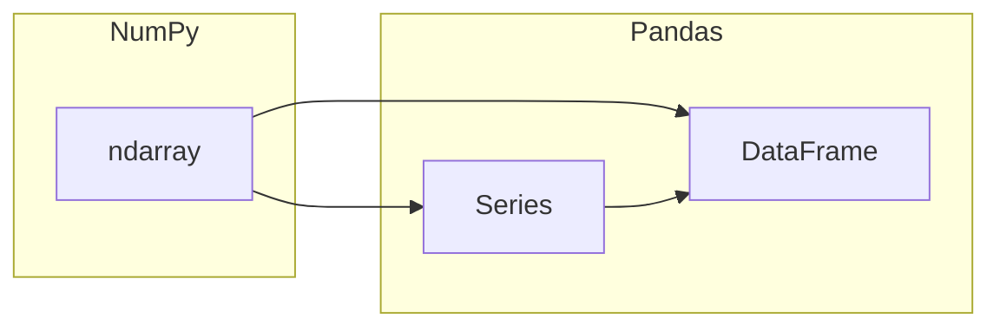
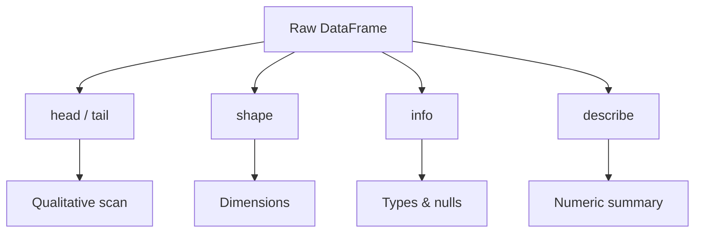
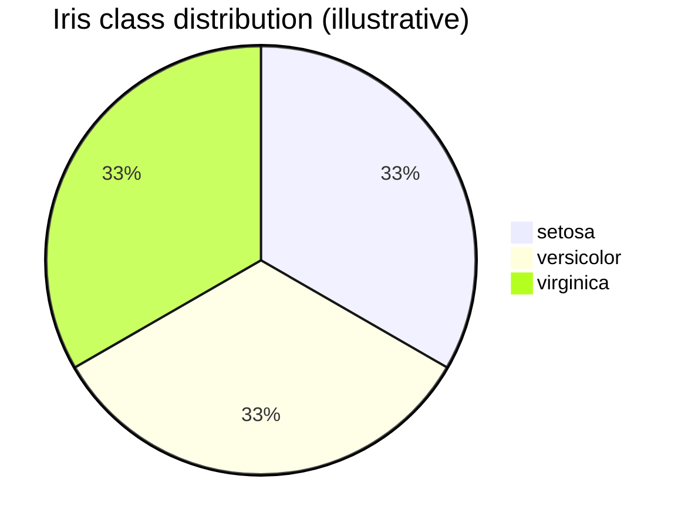
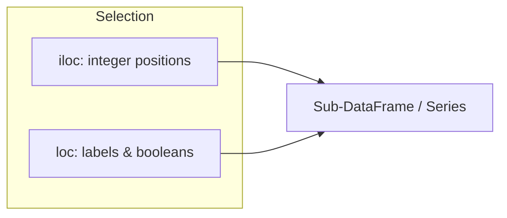
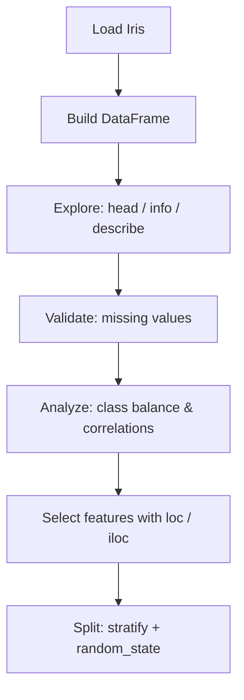

<a id="top"></a>

# Iris Dataset Exploration with Pandas and NumPy

A hands-on guide to loading, exploring, and preprocessing the classic Iris dataset using **Pandas** for tabular workflows and **NumPy** for underlying numeric arrays.

---

## Table of Contents

| # | Section | Anchor |
|---|---------|--------|
| 1 | [Introduction to Pandas and NumPy](#1-introduction-to-pandas-and-numpy) | `#1-introduction-to-pandas-and-numpy` |
| 2 | [Loading the Iris Dataset](#2-loading-the-iris-dataset-load_iris-dataframe) | `#2-loading-the-iris-dataset-load_iris-dataframe` |
| 3 | [Exploring the Data](#3-exploring-the-data-head-shape-info-describe) | `#3-exploring-the-data-head-shape-info-describe` |
| 4 | [Understanding Features and Target](#4-understanding-features-and-target) | `#4-understanding-features-and-target` |
| 5 | [Descriptive Statistics](#5-descriptive-statistics-mean-std-min-max-quartiles) | `#5-descriptive-statistics-mean-std-min-max-quartiles` |
| 6 | [Checking for Missing Values](#6-checking-for-missing-values) | `#6-checking-for-missing-values` |
| 7 | [Class Distribution](#7-class-distribution-value_counts-balanced-dataset-50-per-class) | `#7-class-distribution-value_counts-balanced-dataset-50-per-class` |
| 8 | [Feature Correlations](#8-feature-correlations-dfcorr-petal-lengthwidth-highly-correlated) | `#8-feature-correlations-dfcorr-petal-lengthwidth-highly-correlated` |
| 9 | [Selection and Filtering with Pandas](#9-selection-and-filtering-with-pandas-loc-iloc-conditions) | `#9-selection-and-filtering-with-pandas-loc-iloc-conditions` |
| 10 | [Preparing for Training](#10-preparing-for-training-train_test_split-stratify-random_state42) | `#10-preparing-for-training-train_test_split-stratify-random_state42` |
| 11 | [Summary and Best Practices](#11-summary-and-best-practices) | `#11-summary-and-best-practices` |

[↑ Back to top](#top)

---

<a id="1-introduction-to-pandas-and-numpy"></a>

## 1. Introduction to Pandas and NumPy

**NumPy** provides fast, memory-efficient **n-dimensional arrays** (`ndarray`) and vectorized operations—ideal for numerical computing. **Pandas** builds on NumPy and offers **labeled axes**, **heterogeneous columns**, and rich **indexing** via `Series` (1D) and `DataFrame` (2D).

<details>
<summary>Why both libraries matter for the Iris dataset</summary>

- **NumPy**: Under the hood, many Pandas columns are backed by NumPy arrays; you may use `.values` or `to_numpy()` when you need raw arrays for other libraries.
- **Pandas**: `DataFrame` makes it easy to attach **feature names**, **target labels**, and perform **group-wise** or **row/column** operations without manual index bookkeeping.

</details>

### Mental model



### Typical imports

```python
import numpy as np
import pandas as pd
```

<details>
<summary>Optional: versions in a notebook</summary>

```python
print("NumPy:", np.__version__)
print("Pandas:", pd.__version__)
```

</details>

[↑ Back to top](#top)

---

<a id="2-loading-the-iris-dataset-load_iris-dataframe"></a>

## 2. Loading the Iris Dataset (`load_iris`, `DataFrame`)

The Iris dataset is bundled in **scikit-learn** as `sklearn.datasets.load_iris`. It returns a **Bunch** with `data`, `target`, `feature_names`, and `target_names`.

```python
from sklearn.datasets import load_iris

iris = load_iris()
X = iris.data
y = iris.target
feature_names = iris.feature_names
target_names = iris.target_names
```

### Building a `DataFrame`

```python
df = pd.DataFrame(X, columns=feature_names)
df["target"] = y
df["species"] = df["target"].map(lambda i: target_names[i])
```

| Object | Role |
|--------|------|
| `iris.data` | Feature matrix, shape `(150, 4)` |
| `iris.target` | Integer labels `0, 1, 2` |
| `iris.feature_names` | Column names for measurements |
| `iris.target_names` | `array(['setosa', 'versicolor', 'virginica'])` |

[↑ Back to top](#top)

---

<a id="3-exploring-the-data-head-shape-info-describe"></a>

## 3. Exploring the Data (`head`, `shape`, `info`, `describe`)

After building `df`, use Pandas’ inspection tools to understand structure and dtypes.

```python
df.head()
df.shape          # (150, 6) if you added target + species
df.info()
df.describe()
```

| Method | What it shows |
|--------|----------------|
| `head()` / `tail()` | First/last rows |
| `shape` | `(rows, columns)` |
| `info()` | dtypes, non-null counts, memory |
| `describe()` | Summary stats for numeric columns |

<details>
<summary>Quick read of `describe()` output</summary>

- **count**: number of non-null values per column.
- **mean / std**: central tendency and spread.
- **min / 25% / 50% / 75% / max**: five-number summary (quartiles and extremes).

</details>



[↑ Back to top](#top)

---

<a id="4-understanding-features-and-target"></a>

## 4. Understanding Features and Target

The Iris task is **multiclass classification**: predict **species** from four **morphometric** measurements (all in **centimeters**).

### Features and target

| Name | Description | Unit | Typical range (dataset) |
|------|-------------|------|-------------------------|
| `sepal length (cm)` | Length of the sepal | cm | ~4.3–7.9 |
| `sepal width (cm)` | Width of the sepal | cm | ~2.0–4.4 |
| `petal length (cm)` | Length of the petal | cm | ~1.0–6.9 |
| `petal width (cm)` | Width of the petal | cm | ~0.1–2.5 |
| `target` | Encoded class index | — | `0`, `1`, `2` |
| `species` | Human-readable label | — | setosa, versicolor, virginica |

<details>
<summary>Note on “typical range”</summary>

Exact min/max depend on the loaded copy of Iris; always verify with `df.describe()` or `df[feature].agg(["min", "max"])`.

</details>

[↑ Back to top](#top)

---

<a id="5-descriptive-statistics-mean-std-min-max-quartiles"></a>

## 5. Descriptive Statistics (mean, std, min, max, quartiles)

### Column-wise with `describe`

```python
stats = df[iris.feature_names].describe()
```

### Explicit aggregations

```python
numeric = df[iris.feature_names]
numeric.mean()
numeric.std()
numeric.min()
numeric.max()
numeric.quantile([0.25, 0.5, 0.75])
```

### Per-class summaries (optional but insightful)

```python
df.groupby("species")[iris.feature_names].mean()
```

| Statistic | Meaning |
|-----------|---------|
| **mean** | Average measurement |
| **std** | Spread around the mean |
| **min / max** | Smallest / largest observed values |
| **25% / 50% / 75%** | First, second (median), third quartiles |

[↑ Back to top](#top)

---

<a id="6-checking-for-missing-values"></a>

## 6. Checking for Missing Values

Real-world data often has gaps; Iris is clean, but you should **always** verify.

```python
df.isna().sum()
df.isnull().sum()          # equivalent for NaN
```

### Quick checks

```python
assert df[iris.feature_names].isna().sum().sum() == 0
```

<details>
<summary>If you had missing values</summary>

Common strategies: `dropna()`, `fillna()` (mean/median/mode), or model-specific imputation. For Iris, expect **zero** missing values in the sklearn bundle.

</details>

[↑ Back to top](#top)

---

<a id="7-class-distribution-value_counts-balanced-dataset-50-per-class"></a>

## 7. Class Distribution (`value_counts`, balanced dataset: 50 per class)

```python
df["species"].value_counts()
df["target"].value_counts().sort_index()
```

| Class | Expected count (Iris) |
|-------|------------------------|
| setosa | 50 |
| versicolor | 50 |
| virginica | 50 |

The Iris dataset is **perfectly balanced**: **50 samples per class**, 150 total. This simplifies metrics interpretation but is **not** representative of many real problems.



[↑ Back to top](#top)

---

<a id="8-feature-correlations-dfcorr-petal-lengthwidth-highly-correlated"></a>

## 8. Feature Correlations (`df.corr()`, petal length/width highly correlated)

Pearson correlation measures **linear** association between numeric columns (excluding `target` as ordinal if you prefer strict interpretation).

```python
corr = df[iris.feature_names].corr()
corr
```

### Observations on Iris

- **Petal length** and **petal width** are typically **strongly positively correlated** (often **above ~0.96**), reflecting that longer petals tend to be wider.
- **Sepal** measurements are often **less strongly** correlated with each other and with petals than the petal pair is internally.

<details>
<summary>Heatmap (optional, requires matplotlib/seaborn)</summary>

```python
import matplotlib.pyplot as plt
import seaborn as sns

sns.heatmap(corr, annot=True, cmap="vlag", vmin=-1, vmax=1)
plt.title("Iris feature correlations (Pearson)")
plt.tight_layout()
plt.show()
```

</details>

| Pair (typical Iris) | Expected trend |
|---------------------|----------------|
| petal length ↔ petal width | **High** positive correlation |
| sepal length ↔ petal length | Moderate to strong positive |
| sepal width ↔ others | Weaker or mixed |

[↑ Back to top](#top)

---

<a id="9-selection-and-filtering-with-pandas-loc-iloc-conditions"></a>

## 9. Selection and Filtering with Pandas (`loc`, `iloc`, conditions)

### `iloc`: position-based

```python
df.iloc[0:5, 0:2]          # first 5 rows, first 2 columns
df.iloc[[0, 10, 20], :]    # specific row positions
```

### `loc`: label-based (column names / index labels)

```python
df.loc[0:4, ["sepal length (cm)", "species"]]
```

### Boolean filtering (conditions)

```python
df[df["petal length (cm)"] > 4]
df.query("`petal length (cm)` > 4 and species == 'versicolor'")
```



<details>
<summary>Feature matrix vs. labels for ML</summary>

```python
X_df = df[iris.feature_names]
y_series = df["target"]
```

</details>

[↑ Back to top](#top)

---

<a id="10-preparing-for-training-train_test_split-stratify-random_state42"></a>

## 10. Preparing for Training (`train_test_split`, `stratify`, `random_state=42`)

Split **features** and **target** before training a model. Use **`stratify=y`** so each split preserves **class proportions** (especially important for **imbalanced** data; for Iris it still yields **equal** representation per class).

```python
from sklearn.model_selection import train_test_split

X = df[iris.feature_names]
y = df["target"]

X_train, X_test, y_train, y_test = train_test_split(
    X,
    y,
    test_size=0.2,
    random_state=42,
    stratify=y,
)
```

| Parameter | Purpose |
|-----------|---------|
| `test_size` | Fraction (or count) held out for evaluation |
| `random_state=42` | Reproducible shuffle |
| `stratify=y` | Preserve class ratios in train and test |

<details>
<summary>Why `random_state=42`?</summary>

Any fixed integer works; **42** is a common convention for **reproducibility** in tutorials and benchmarks. Change it if you need multiple random splits for stability checks.

</details>

[↑ Back to top](#top)

---

<a id="11-summary-and-best-practices"></a>

## 11. Summary and Best Practices



### Best practices checklist

| Practice | Recommendation |
|----------|------------------|
| Reproducibility | Set `random_state` in splits and models where applicable |
| Leakage | Fit scalers/imputers on **training** data only |
| Class balance | Use `value_counts`; use `stratify` when splitting |
| Documentation | Keep feature names attached via `DataFrame` until you export arrays |
| Correlations | Remember correlation ≠ causation; check linear vs. nonlinear relationships separately if needed |

You now have a standard workflow: **load → inspect → verify → summarize → filter → split**—ready for modeling with scikit-learn or other libraries.

[↑ Back to top](#top)
