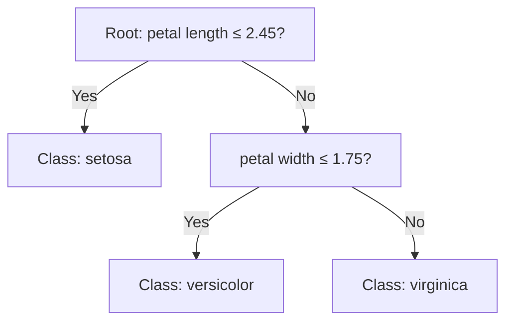
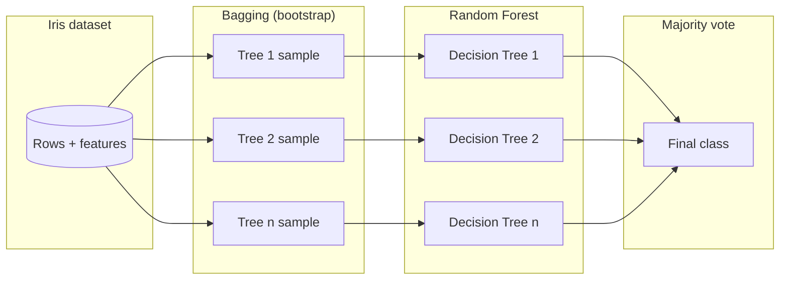
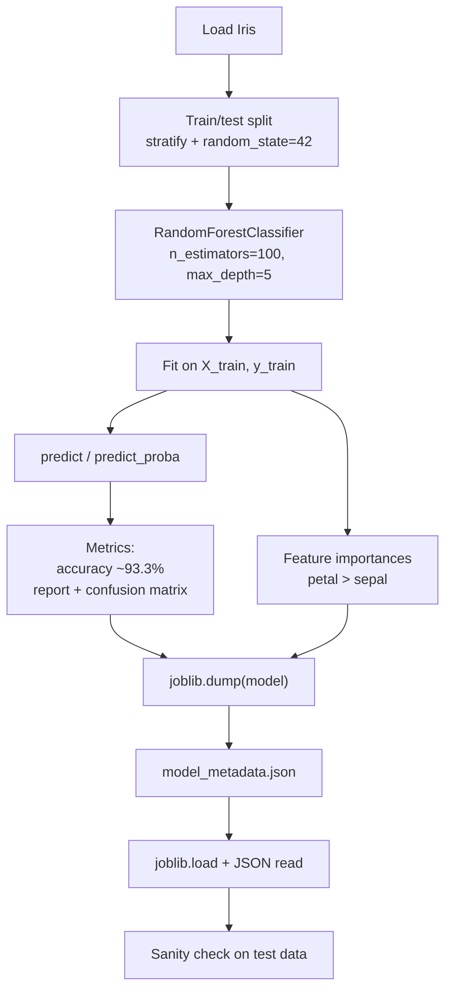

<a id="top"></a>

# Training a Random Forest Model on the Iris Dataset

This module walks through training a **Random Forest** classifier on the classic **Iris** dataset, evaluating performance, interpreting **feature importances**, and **exporting** the trained model with **joblib** plus a small **metadata JSON** file for reproducibility.

---

## Table of Contents

| # | Section | Anchor |
|---|---------|--------|
| 1 | [What is a Decision Tree?](#1-what-is-a-decision-tree) | `#1-what-is-a-decision-tree` |
| 2 | [From Decision Tree to Random Forest](#2-from-decision-tree-to-random-forest) | `#2-from-decision-tree-to-random-forest` |
| 3 | [Random Forest Hyperparameters](#3-random-forest-hyperparameters) | `#3-random-forest-hyperparameters` |
| 4 | [Training the Model on Iris](#4-training-the-model-on-iris) | `#4-training-the-model-on-iris` |
| 5 | [Prediction and predict_proba](#5-prediction-and-predict_proba) | `#5-prediction-and-predict_proba` |
| 6 | [Model Evaluation](#6-model-evaluation) | `#6-model-evaluation` |
| 7 | [Feature Importances](#7-feature-importances) | `#7-feature-importances` |
| 8 | [Saving the Model with joblib](#8-saving-the-model-with-joblib) | `#8-saving-the-model-with-joblib` |
| 9 | [Testing the Saved Model](#9-testing-the-saved-model) | `#9-testing-the-saved-model` |
| 10 | [Comparison with Other Algorithms](#10-comparison-with-other-algorithms) | `#10-comparison-with-other-algorithms` |
| 11 | [Complete Pipeline Summary](#11-complete-pipeline-summary) | `#11-complete-pipeline-summary` |

[↑ Back to top](#top)

---

## 1. What is a Decision Tree?

<a id="1-what-is-a-decision-tree"></a>

A **decision tree** is a flowchart-like model: at each **internal node**, it tests one feature (e.g. *petal length*); branches represent outcomes of that test; **leaf nodes** assign a class label. Training chooses splits that best separate classes (often using **Gini impurity** or **entropy** in scikit-learn).

<details>
<summary>Expand: intuition and notation</summary>

- **Root**: first split on the “most informative” feature.  
- **Depth**: longest path from root to a leaf (related to `max_depth` in ensembles).  
- **Overfitting**: deep trees memorize training noise; **Random Forest** mitigates this by averaging many trees.

</details>



[↑ Back to top](#top)

---

## 2. From Decision Tree to Random Forest

<a id="2-from-decision-tree-to-random-forest"></a>

A **Random Forest** is an **ensemble** of decision trees. Each tree is trained on a **bootstrap sample** of the data (**bagging** = bootstrap aggregating). At each split, a **random subset of features** is considered, which **decorrelates** trees. Final predictions use **majority vote** (classification) or averaging (regression).

<details>
<summary>Expand: bagging vs. voting</summary>

| Concept | Role |
|---------|------|
| **Bagging** | Train each tree on a random sample *with replacement*; reduces variance. |
| **Random feature subsets** | Further diversity between trees. |
| **Voting** | Aggregate per-tree class votes into one final label. |

</details>



[↑ Back to top](#top)

---

## 3. Random Forest Hyperparameters

<a id="3-random-forest-hyperparameters"></a>

The following table uses values aligned with this course’s training script (`n_estimators=100`, `max_depth=5`, `random_state=42`).

| Hyperparameter | Value in this course | Meaning |
|----------------|----------------------|---------|
| `n_estimators` | **100** | Number of trees in the forest; more trees often stabilize predictions (diminishing returns). |
| `max_depth` | **5** | Maximum depth of each tree; limits complexity to reduce overfitting on small datasets like Iris. |
| `random_state` | **42** | Seed for reproducibility (bootstrap sampling and feature subsampling). |

<details>
<summary>Other hyperparameters you may tune</summary>

| Parameter | Typical use |
|-----------|-------------|
| `max_features` | Number of features considered per split (`"sqrt"` is common for classification). |
| `min_samples_leaf` | Minimum samples in a leaf; larger values smooth the model. |
| `class_weight` | Handles imbalanced classes (Iris is balanced). |

</details>

[↑ Back to top](#top)

---

## 4. Training the Model on Iris

<a id="4-training-the-model-on-iris"></a>

The Iris dataset has **150** samples, **4** numeric features, and **3** species. We split into train/test sets, fit a `RandomForestClassifier`, and keep arrays for later evaluation.

```python
from sklearn.datasets import load_iris
from sklearn.model_selection import train_test_split
from sklearn.ensemble import RandomForestClassifier

# Load data
iris = load_iris()
X, y = iris.data, iris.target
feature_names = list(iris.feature_names)
target_names = list(iris.target_names)

# Train / test split (stratified preserves class proportions)
X_train, X_test, y_train, y_test = train_test_split(
    X,
    y,
    test_size=0.25,
    random_state=42,
    stratify=y,
)

# Random Forest with course hyperparameters
model = RandomForestClassifier(
    n_estimators=100,
    max_depth=5,
    random_state=42,
)
model.fit(X_train, y_train)

print("Classes:", model.classes_)
print("Feature names:", feature_names)
```

[↑ Back to top](#top)

---

## 5. Prediction and predict_proba

<a id="5-prediction-and-predict_proba"></a>

- **`predict`**: returns the **argmax** class index per sample (majority vote across trees).  
- **`predict_proba`**: returns **estimated class probabilities** (average of tree leaf class distributions).

```python
import numpy as np

# Single sample (first test row)
x_one = X_test[:1]
label = model.predict(x_one)[0]
proba = model.predict_proba(x_one)[0]

print("Predicted class index:", label)
print("Predicted species:", target_names[label])
print("Class probabilities:", dict(zip(target_names, np.round(proba, 4))))

# Batch predictions on the test set
y_pred = model.predict(X_test)
y_proba = model.predict_proba(X_test)
print("Shape of y_proba:", y_proba.shape)  # (n_test, 3)
```

[↑ Back to top](#top)

---

## 6. Model Evaluation

<a id="6-model-evaluation"></a>

With `random_state=42` and a **25%** stratified test split, you should see **test accuracy ≈ 93.3%** (e.g. **36/38** correct on a typical run—exact count can vary slightly if you change the split). Use **`classification_report`** for precision/recall/F1 per class and **`confusion_matrix`** to see which species are confused.

```python
from sklearn.metrics import accuracy_score, classification_report, confusion_matrix

acc = accuracy_score(y_test, y_pred)
print(f"Accuracy: {acc:.1%}")  # expect ~93.3%

print("\nClassification report:")
print(classification_report(y_test, y_pred, target_names=target_names))

print("Confusion matrix (rows=true, cols=pred):")
print(confusion_matrix(y_test, y_pred))
```

**Example interpretation (illustrative):**

| Metric (per class) | Role |
|--------------------|------|
| Precision | Of all predicted as a species, how many were correct? |
| Recall | Of all true members of a species, how many were found? |
| F1-score | Harmonic mean of precision and recall. |

The confusion matrix highlights **versicolor vs. virginica** as the usual boundary cases when errors occur.

[↑ Back to top](#top)

---

## 7. Feature Importances

<a id="7-feature-importances"></a>

Random Forest **feature importances** are derived from how much each feature decreases impurity across splits (Gini-based in default settings), **normalized** to sum to 1.

For this course’s setup, typical relative rankings match:

| Feature | Approx. importance |
|---------|-------------------|
| Petal width (`petal width (cm)`) | **43.8%** |
| Petal length (`petal length (cm)`) | **43.2%** |
| Sepal length (`sepal length (cm)`) | **11.6%** |
| Sepal width (`sepal width (cm)`) | **1.4%** |

```python
import pandas as pd

imp = pd.Series(model.feature_importances_, index=feature_names)
imp = imp.sort_values(ascending=False)
print(imp.to_string())
```

<details>
<summary>Note on interpreting importances</summary>

Importances reflect the **trained forest** and the **train split**; they are **not causal**. Correlated features can share credit. For Iris, petal measures dominate because they separate species almost linearly.

</details>

[↑ Back to top](#top)

---

## 8. Saving the Model with joblib

<a id="8-saving-the-model-with-joblib"></a>

**joblib** is efficient for NumPy-heavy scikit-learn models. Save the estimator with **`joblib.dump`** and store human-readable **metadata** (hyperparameters, feature names, class names, metrics) in **JSON** for pipelines and APIs.

```python
import json
from pathlib import Path

import joblib

out_dir = Path("artifacts")
out_dir.mkdir(parents=True, exist_ok=True)
model_path = out_dir / "iris_random_forest.joblib"
meta_path = out_dir / "model_metadata.json"

joblib.dump(model, model_path)

metadata = {
    "model_type": "RandomForestClassifier",
    "sklearn_version": __import__("sklearn").__version__,
    "hyperparameters": {
        "n_estimators": 100,
        "max_depth": 5,
        "random_state": 42,
    },
    "feature_names": feature_names,
    "target_names": target_names,
    "train_test_split": {"test_size": 0.25, "random_state": 42, "stratify": True},
    "metrics": {
        "test_accuracy": float(acc),
    },
}

with meta_path.open("w", encoding="utf-8") as f:
    json.dump(metadata, f, indent=2)

print("Saved:", model_path.resolve())
print("Saved:", meta_path.resolve())
```

**Loading** the model elsewhere:

```python
import joblib

loaded = joblib.load("artifacts/iris_random_forest.joblib")
```

[↑ Back to top](#top)

---

## 9. Testing the Saved Model

<a id="9-testing-the-saved-model"></a>

This script loads **joblib** + **JSON**, runs **`predict`** and **`predict_proba`** on held-out or new rows, and optionally recomputes accuracy if `y_test` is available.

```python
import json
from pathlib import Path

import joblib
import numpy as np
from sklearn.datasets import load_iris
from sklearn.metrics import accuracy_score
from sklearn.model_selection import train_test_split

def main():
    artifact_dir = Path("artifacts")
    model_path = artifact_dir / "iris_random_forest.joblib"
    meta_path = artifact_dir / "model_metadata.json"

    model = joblib.load(model_path)
    with meta_path.open(encoding="utf-8") as f:
        meta = json.load(f)

    target_names = meta["target_names"]
    feature_names = meta["feature_names"]
    print("Loaded model:", meta["model_type"])
    print("Features:", feature_names)

    # Rebuild same split to verify accuracy (optional)
    iris = load_iris()
    X, y = iris.data, iris.target
    _, X_test, _, y_test = train_test_split(
        X,
        y,
        test_size=0.25,
        random_state=42,
        stratify=y,
    )

    y_pred = model.predict(X_test)
    acc = accuracy_score(y_test, y_pred)
    print(f"Reloaded model test accuracy: {acc:.1%}")

    # Demo probabilities on one sample
    proba = model.predict_proba(X_test[:1])[0]
    print("Sample probabilities:", dict(zip(target_names, np.round(proba, 4))))


if __name__ == "__main__":
    main()
```

[↑ Back to top](#top)

---

## 10. Comparison with Other Algorithms

<a id="10-comparison-with-other-algorithms"></a>

On Iris with a **small** feature space and **clean** labels, many algorithms reach **high** accuracy. Differences show up in **interpretability**, **training cost**, and **sensitivity** to scaling and kernels.

| Algorithm | Typical strengths on Iris-like data | Typical trade-offs |
|-----------|-------------------------------------|--------------------|
| **KNN** | Simple, strong baseline; non-parametric | Prediction slower as data grows; sensitive to scale and `k`. |
| **SVM** | Good margins with RBF/poly kernels | Needs tuning of `C`, `gamma`; slower on very large data. |
| **Logistic Regression** | Fast, probabilistic (`predict_proba`), linear boundaries | May underfit if decision boundary is highly non-linear. |
| **Random Forest** | Handles non-linearity; built-in feature importances; robust default | Less interpretable than a single tree; many hyperparameters to tune at scale. |

<details>
<summary>Optional: one-shot sklearn comparison snippet</summary>

```python
from sklearn.ensemble import RandomForestClassifier
from sklearn.linear_model import LogisticRegression
from sklearn.neighbors import KNeighborsClassifier
from sklearn.svm import SVC

models = {
    "KNN": KNeighborsClassifier(n_neighbors=5),
    "SVM": SVC(kernel="rbf", probability=True, random_state=42),
    "Logistic Regression": LogisticRegression(max_iter=200, random_state=42),
    "Random Forest": RandomForestClassifier(
        n_estimators=100, max_depth=5, random_state=42
    ),
}

for name, m in models.items():
    m.fit(X_train, y_train)
    score = m.score(X_test, y_test)
    print(f"{name}: {score:.3f}")
```

</details>

[↑ Back to top](#top)

---

## 11. Complete Pipeline Summary

<a id="11-complete-pipeline-summary"></a>

End-to-end flow from raw Iris data to a **deployable artifact** and **verification**.



[↑ Back to top](#top)

---

## Quick reference

| Topic | Key API / artifact |
|-------|---------------------|
| Train | `RandomForestClassifier.fit` |
| Probabilities | `predict_proba` |
| Metrics | `accuracy_score`, `classification_report`, `confusion_matrix` |
| Importances | `feature_importances_` |
| Save / load | `joblib.dump`, `joblib.load` |
| Metadata | JSON alongside `.joblib` |

This concludes **Training a Random Forest Model on the Iris Dataset**: you can now train, evaluate, interpret, export, and reload a forest classifier with reproducible settings.

[↑ Back to top](#top)
