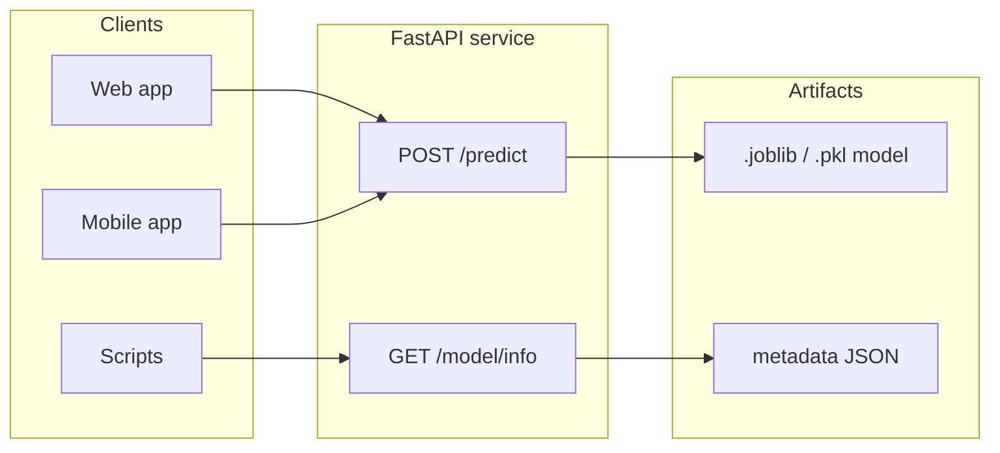
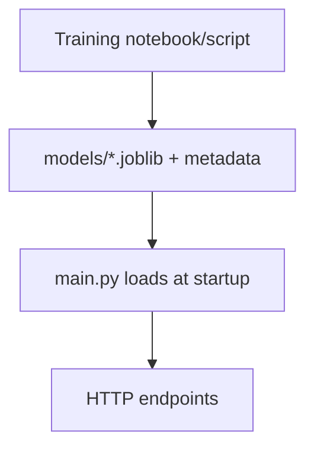
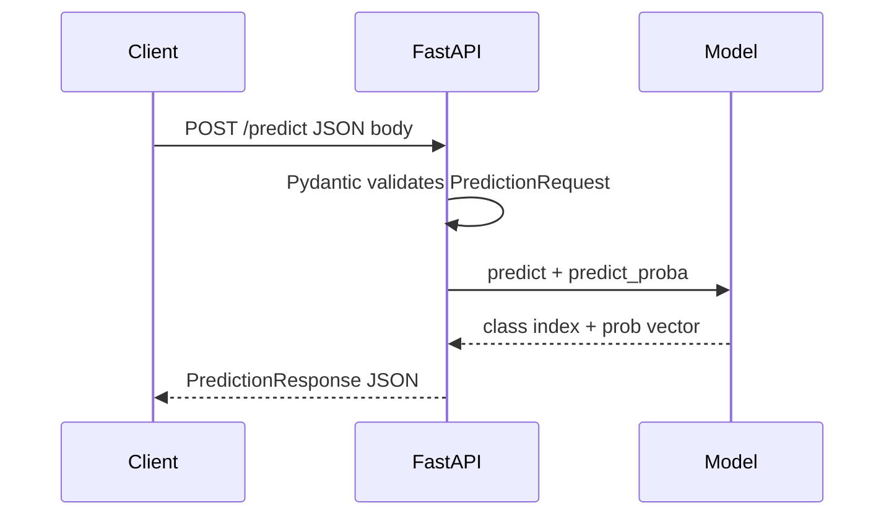
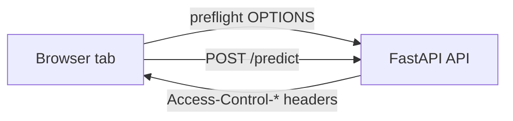
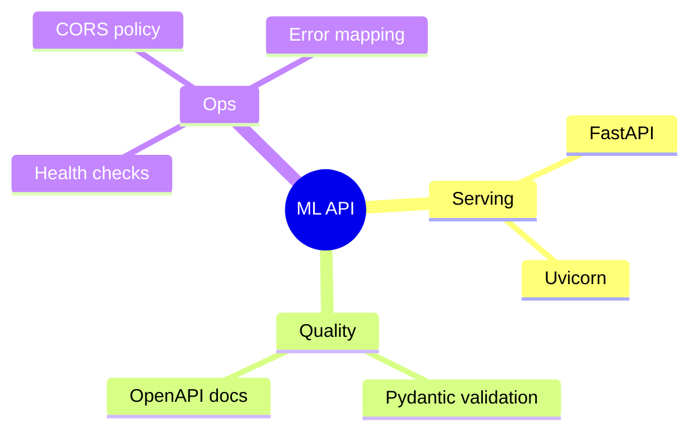

<a id="top"></a>

# Deploying a Trained ML Model with FastAPI

This module explains how to **expose a trained machine learning model** through a **REST API** built with **FastAPI**: loading artifacts at startup, validating inputs with **Pydantic**, documenting endpoints automatically, enabling **CORS** for web and mobile clients, and testing with **curl** and **PowerShell**.

---

## Table of contents

| # | Section | Anchor |
|---|---------|--------|
| 1 | [Introduction — Why Expose an ML Model via an API?](#sec-1-introduction) | `#sec-1-introduction` |
| 2 | [FastAPI in 5 Minutes](#sec-2-fastapi) | `#sec-2-fastapi` |
| 3 | [Backend Structure](#sec-3-structure) | `#sec-3-structure` |
| 4 | [Loading the Model at Startup](#sec-4-startup-load) | `#sec-4-startup-load` |
| 5 | [Input Validation with Pydantic](#sec-5-pydantic) | `#sec-5-pydantic` |
| 6 | [The POST /predict Endpoint in Detail](#sec-6-predict) | `#sec-6-predict` |
| 7 | [Informational Endpoints](#sec-7-info-endpoints) | `#sec-7-info-endpoints` |
| 8 | [CORS — Cross-Origin Resource Sharing](#sec-8-cors) | `#sec-8-cors` |
| 9 | [Swagger UI — Automatic Documentation](#sec-9-swagger) | `#sec-9-swagger` |
| 10 | [Testing the API with curl and PowerShell](#sec-10-curl-powershell) | `#sec-10-curl-powershell` |
| 11 | [Error Handling](#sec-11-errors) | `#sec-11-errors` |
| 12 | [Summary and Best Practices](#sec-12-summary) | `#sec-12-summary` |

---

<a id="sec-1-introduction"></a>

## 1. Introduction — Why Expose an ML Model via an API?

Machine learning models are often trained in **notebooks** or **batch jobs**, but **production systems** (web apps, mobile apps, microservices) need a **stable contract**: send features, receive a prediction. An **HTTP API** provides that contract.

| Benefit | Explanation |
|---------|-------------|
| **Decoupling** | Clients do not embed Python or the model file; they only call HTTP endpoints. |
| **Single source of truth** | One deployed model version serves many apps and users. |
| **Scalability** | You can scale the API layer independently (containers, load balancers). |
| **Security & governance** | Authentication, rate limiting, and logging can be applied at the API boundary. |
| **Versioning** | You can expose `/v1/predict` and `/v2/predict` while migrating models. |

<details>
<summary>When an API is not the right first step</summary>

For **ultra-low latency** or **offline** scenarios, you might ship the model on-device (TensorFlow Lite, Core ML) or use **batch scoring** in a data pipeline instead of synchronous HTTP. APIs shine when **many clients** need **on-demand** predictions with acceptable network latency.
</details>

**Endpoints covered in this course** (typical ML serving layout):

| Method | Path | Role |
|--------|------|------|
| `GET` | `/` | Liveness: API is up |
| `GET` | `/health` | Readiness: model loaded, dependencies OK |
| `POST` | `/predict` | Run inference on validated input |
| `GET` | `/model/info` | Model type, metrics, feature names |
| `GET` | `/dataset/samples` | Example rows for UI/testing |
| `GET` | `/dataset/stats` | Aggregates (counts, distributions, feature stats) |



[↑ Back to top](#top)

---

<a id="sec-2-fastapi"></a>

## 2. FastAPI in 5 Minutes

**FastAPI** is a modern Python web framework for building APIs. It is built on **Starlette** (ASGI) and uses **Pydantic** for data validation.

| Feature | Why it matters for ML |
|---------|------------------------|
| **Type hints** | Request/response shapes are documented and validated automatically. |
| **Async support** | You can use `async def` for I/O-bound work (databases, remote calls). |
| **OpenAPI** | Interactive docs (`/docs`) are generated from your code. |
| **Performance** | ASGI servers like **Uvicorn** handle concurrent requests efficiently. |

Minimal app skeleton:

```python
from fastapi import FastAPI

app = FastAPI(title="ML Serving API", version="1.0.0")


@app.get("/")
async def root():
    return {"status": "ok"}
```

Run locally (development):

```bash
uvicorn main:app --reload --host 0.0.0.0 --port 8000
```

<details>
<summary>ASGI vs WSGI (one-minute mental model)</summary>

**WSGI** (e.g., Flask with Gunicorn) is synchronous per worker unless you add complexity. **ASGI** (Starlette/FastAPI + Uvicorn) is designed for **async** I/O and WebSockets. For many ML APIs, inference is still **CPU-bound** in the request path; async helps most when you also await external services.
</details>

[↑ Back to top](#top)

---

<a id="sec-3-structure"></a>

## 3. Backend Structure

A clear layout keeps **training code**, **artifacts**, and **serving code** separate.

**Example layout** (aligned with a typical small project):

| Path | Purpose |
|------|---------|
| `backend/main.py` | FastAPI app, routes, startup loading |
| `backend/models/iris_model.joblib` | Serialized model (`joblib` or `pickle`) |
| `backend/models/model_metadata.json` | Human-readable metadata (accuracy, feature names, class names) |
| `train_model.ipynb` (or `train.py`) | Training pipeline that writes artifacts |



<details>
<summary>Tip: never commit huge binaries by accident</summary>

Use **`.gitignore`** for large `.joblib` / `.pkl` files if your team stores artifacts in object storage (S3, GCS) or an artifact registry instead of Git. For learning repos, a small model file is often acceptable.
</details>

[↑ Back to top](#top)

---

<a id="sec-4-startup-load"></a>

## 4. Loading the Model at Startup (`startup` event, `joblib.load`)

Serving should **fail fast** if the model is missing, and load **once** when the process starts—not on every request.

**Pattern:**

1. Define module-level variables (e.g., `model = None`, `metadata = None`).
2. Implement `load_model()` that reads paths relative to `__file__`.
3. Register a **startup** hook that calls `load_model()`.

```python
import json
import os
import joblib
from fastapi import FastAPI

app = FastAPI()

MODEL_DIR = os.path.join(os.path.dirname(__file__), "models")
MODEL_PATH = os.path.join(MODEL_DIR, "iris_model.joblib")
METADATA_PATH = os.path.join(MODEL_DIR, "model_metadata.json")

model = None
metadata = None


def load_model():
    global model, metadata
    if not os.path.exists(MODEL_PATH):
        raise RuntimeError(f"Model not found at {MODEL_PATH}")
    model = joblib.load(MODEL_PATH)
    with open(METADATA_PATH, "r", encoding="utf-8") as f:
        metadata = json.load(f)


@app.on_event("startup")
async def startup_event():
    load_model()
```

| Library | Typical use |
|---------|-------------|
| **`joblib`** | NumPy/scikit-learn models (efficient for large arrays) |
| **`pickle`** | Generic Python objects (security caution: only load trusted files) |

<details>
<summary>Security note: unpickling untrusted data</summary>

`pickle` and `joblib.load` can execute code during deserialization. **Only load artifacts you created** or that come from a **trusted** supply chain. For stricter deployments, consider **ONNX**, **TensorFlow SavedModel**, or vendor-specific runtimes.
</details>

**Note:** FastAPI has introduced **`lifespan`** context managers as the modern alternative to `@app.on_event("startup")`. Both patterns are widely seen in tutorials; choose one style consistently in your codebase.

[↑ Back to top](#top)

---

<a id="sec-5-pydantic"></a>

## 5. Input Validation with Pydantic (`PredictionRequest`, `Field` constraints)

**Pydantic** models define the **JSON body** for `POST /predict`. **`Field`** adds constraints and documentation.

```python
from pydantic import BaseModel, Field


class PredictionRequest(BaseModel):
    sepal_length: float = Field(..., ge=0, le=10, description="Sepal length (cm)")
    sepal_width: float = Field(..., ge=0, le=10, description="Sepal width (cm)")
    petal_length: float = Field(..., ge=0, le=10, description="Petal length (cm)")
    petal_width: float = Field(..., ge=0, le=10, description="Petal width (cm)")

    model_config = {
        "json_schema_extra": {
            "examples": [
                {
                    "sepal_length": 5.1,
                    "sepal_width": 3.5,
                    "petal_length": 1.4,
                    "petal_width": 0.2,
                }
            ]
        }
    }
```

| Pydantic piece | Meaning |
|----------------|---------|
| `Field(...)` | Required field (`...` is Ellipsis) |
| `ge`, `le` | Greater-or-equal / less-or-equal numeric bounds |
| `json_schema_extra` | Example payload shown in **Swagger UI** |

FastAPI returns **422 Unprocessable Entity** when validation fails, with a structured error body—ideal for client developers.

<details>
<summary>Optional: shared constraints with `confloat`</summary>

For repeated rules you can use constrained types (`confloat`, etc.) or custom validators (`field_validator` in Pydantic v2). Prefer the smallest change that keeps schemas readable.
</details>

[↑ Back to top](#top)

---

<a id="sec-6-predict"></a>

## 6. The POST `/predict` Endpoint in Detail

The prediction route:

1. Ensures the model is loaded.
2. Builds a **feature vector** (often a NumPy array with shape `(1, n_features)`).
3. Calls `predict` and, for classifiers, **`predict_proba`** for probabilities.
4. Maps class indices to **human-readable labels** using metadata.

```python
import numpy as np
from fastapi import FastAPI, HTTPException
from pydantic import BaseModel

app = FastAPI()


class PredictionResponse(BaseModel):
    species: str
    confidence: float
    probabilities: dict[str, float]


@app.post("/predict", response_model=PredictionResponse)
async def predict(request: PredictionRequest):
    if model is None:
        raise HTTPException(status_code=503, detail="Model is not loaded")

    features = np.array(
        [[request.sepal_length, request.sepal_width, request.petal_length, request.petal_width]]
    )

    y = model.predict(features)[0]
    probs = model.predict_proba(features)[0]

    target_names = metadata["target_names"]
    species = target_names[int(y)]
    confidence = float(probs[int(y)])
    prob_dict = {name: round(float(p), 4) for name, p in zip(target_names, probs)}

    return PredictionResponse(
        species=species,
        confidence=round(confidence, 4),
        probabilities=prob_dict,
    )
```

| Step | Detail |
|------|--------|
| **Shape** | `[[...]]` makes a batch of size 1; many sklearn estimators expect 2D input. |
| **Labels** | Store `target_names` in metadata so the API returns `"setosa"` not `0`. |
| **Probabilities** | Expose full `probabilities` for transparency and UI charts. |



[↑ Back to top](#top)

---

<a id="sec-7-info-endpoints"></a>

## 7. Informational Endpoints (`/model/info`, `/dataset/samples`, `/dataset/stats`)

Beyond predictions, APIs often expose **metadata** and **dataset insights** for dashboards, debugging, and client-side forms.

### GET `/model/info`

Returns structured model metadata (type, accuracy, feature importances, sample counts). Define a **response model** so OpenAPI stays accurate.

```python
from pydantic import BaseModel


class ModelInfoResponse(BaseModel):
    model_config = {"protected_namespaces": ()}

    model_type: str
    accuracy: float
    feature_names: list[str]
    target_names: list[str]
    feature_importances: dict[str, float]
    training_samples: int
    test_samples: int


@app.get("/model/info", response_model=ModelInfoResponse)
async def model_info():
    if metadata is None:
        raise HTTPException(status_code=503, detail="Metadata not loaded")
    return ModelInfoResponse(**metadata)
```

### GET `/dataset/samples`

Useful for **quick tests** and **UI placeholders** (e.g., “fill with random Iris row”). Implementation often loads sklearn’s Iris dataset, samples rows, and returns JSON-friendly records.

### GET `/dataset/stats`

Returns aggregates: total rows, feature count, species distribution, per-feature `min` / `max` / `mean` / `std`.

| Endpoint | Typical consumer |
|----------|------------------|
| `/model/info` | Admin UI, documentation, monitoring |
| `/dataset/samples` | Developers, demo apps |
| `/dataset/stats` | Exploratory panels, data quality checks |

<details>
<summary>Production twist: stats from your real production table</summary>

Tutorial APIs compute stats from **sklearn’s built-in Iris**. In production, you might compute stats from your **warehouse** or **feature store** on a schedule, not on every request, to avoid heavy work in the hot path.
</details>

[↑ Back to top](#top)

---

<a id="sec-8-cors"></a>

## 8. CORS — Cross-Origin Resource Sharing

Browsers block frontend pages on `https://app.example.com` from calling `http://localhost:8000` unless the API sends **CORS** headers. Mobile apps are less affected, but **web clients** need this.

```python
from fastapi.middleware.cors import CORSMiddleware

app.add_middleware(
    CORSMiddleware,
    allow_origins=["*"],  # tighten in production
    allow_credentials=True,
    allow_methods=["*"],
    allow_headers=["*"],
)
```

| Setting | Guidance |
|---------|----------|
| `allow_origins` | Use explicit origins in production (your Flutter web host, portal domain). |
| `allow_credentials` | If `True`, **do not** use `["*"]` for origins in strict browser rules—list real origins. |
| `allow_methods` / `allow_headers` | Restrict to what your app actually needs. |



[↑ Back to top](#top)

---

<a id="sec-9-swagger"></a>

## 9. Swagger UI — Automatic Documentation

FastAPI generates **OpenAPI** metadata. With the app running, open:

| URL | What you get |
|-----|----------------|
| `/docs` | **Swagger UI** — try endpoints interactively |
| `/redoc` | **ReDoc** — readable reference docs |
| `/openapi.json` | Raw schema for codegen and gateways |

**Why it matters for ML teams:**

- Data scientists can **try `/predict`** without writing a client.
- Frontend/mobile devs can copy **exact request/response shapes**.
- Examples from Pydantic appear as **sample payloads**.

<details>
<summary>Disable docs in production?</summary>

Some teams disable `/docs` in production via environment flags. Others keep it behind **authentication** or an internal VPN. Pick a policy that matches your security model.
</details>

[↑ Back to top](#top)

---

<a id="sec-10-curl-powershell"></a>

## 10. Testing the API with curl and PowerShell

Assume the server listens on `http://127.0.0.1:8000`.

### Health and root

```bash
curl -s http://127.0.0.1:8000/
curl -s http://127.0.0.1:8000/health
```

**PowerShell (`Invoke-RestMethod`):**

```powershell
Invoke-RestMethod -Uri "http://127.0.0.1:8000/health" -Method Get
```

### POST `/predict`

```bash
curl -s -X POST "http://127.0.0.1:8000/predict" ^
  -H "Content-Type: application/json" ^
  -d "{\"sepal_length\":5.1,\"sepal_width\":3.5,\"petal_length\":1.4,\"petal_width\":0.2}"
```

**PowerShell:**

```powershell
$body = @{
  sepal_length = 5.1
  sepal_width  = 3.5
  petal_length = 1.4
  petal_width  = 0.2
} | ConvertTo-Json

Invoke-RestMethod -Uri "http://127.0.0.1:8000/predict" -Method Post -Body $body -ContentType "application/json"
```

### Informational GETs

```bash
curl -s http://127.0.0.1:8000/model/info
curl -s http://127.0.0.1:8000/dataset/samples
curl -s http://127.0.0.1:8000/dataset/stats
```

| Tool | Strength |
|------|----------|
| **curl** | Universal, scriptable, great for CI smoke tests |
| **PowerShell** | Native on Windows; `Invoke-RestMethod` parses JSON into objects |

[↑ Back to top](#top)

---

<a id="sec-11-errors"></a>

## 11. Error Handling (`HTTPException`, 404, 503)

**Operational errors** should map to clear HTTP status codes.

| Status | When to use | Example |
|--------|-------------|---------|
| **422** | Invalid JSON or failed Pydantic validation | Missing `petal_width` |
| **404** | Unknown route or missing sub-resource | `/v99/predict` |
| **503** | Service unavailable: model not loaded, upstream failure | Model file missing at startup (if you catch and degrade) |

```python
from fastapi import HTTPException

if model is None:
    raise HTTPException(status_code=503, detail="Model is not loaded")
```

<details>
<summary>404 for missing routes vs custom resources</summary>

Unknown paths return **404** automatically. For domain-specific “not found” (e.g., `GET /users/{id}`), raise `HTTPException(404, detail="User not found")` inside the route.
</details>

**Startup failures:** If `load_model()` raises during startup, the process should exit with an error in development so you notice immediately. In orchestrated deployments, failing startup prevents routing traffic to a broken pod.

[↑ Back to top](#top)

---

<a id="sec-12-summary"></a>

## 12. Summary and Best Practices

| Practice | Recommendation |
|----------|----------------|
| **Load once** | Load model + metadata at startup; avoid disk I/O per request. |
| **Validate input** | Use Pydantic models and `Field` constraints for every prediction payload. |
| **Return structured errors** | Prefer consistent `detail` messages; log server-side context separately. |
| **Document** | Rely on OpenAPI; add examples to schemas for faster integration. |
| **CORS** | Start permissive for local dev; **tighten origins** for production web apps. |
| **Security** | Treat model files as trusted; plan authentication (API keys, OAuth2 proxy) for public exposure. |
| **Observability** | Add request IDs, latency metrics, and optional prediction logging (mind privacy). |

**Endpoint checklist:**

| Method | Path | Purpose |
|--------|------|---------|
| `GET` | `/` | Basic liveness |
| `GET` | `/health` | Readiness (model loaded) |
| `POST` | `/predict` | Inference |
| `GET` | `/model/info` | Model and training metadata |
| `GET` | `/dataset/samples` | Sample rows |
| `GET` | `/dataset/stats` | Dataset aggregates |



[↑ Back to top](#top)
