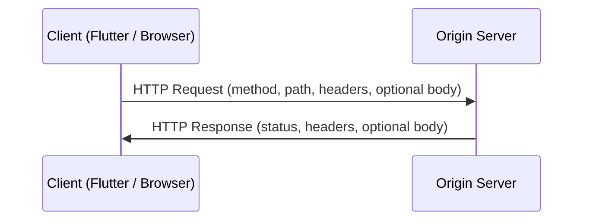
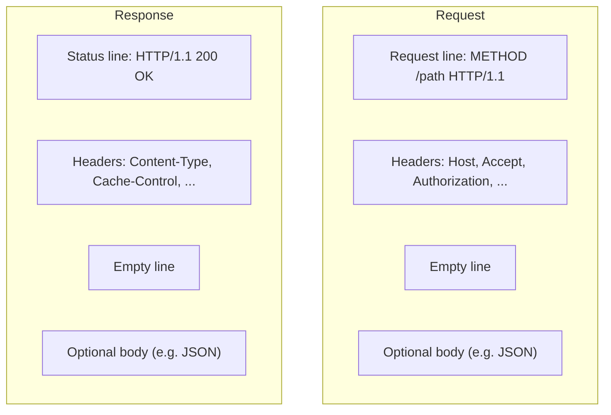
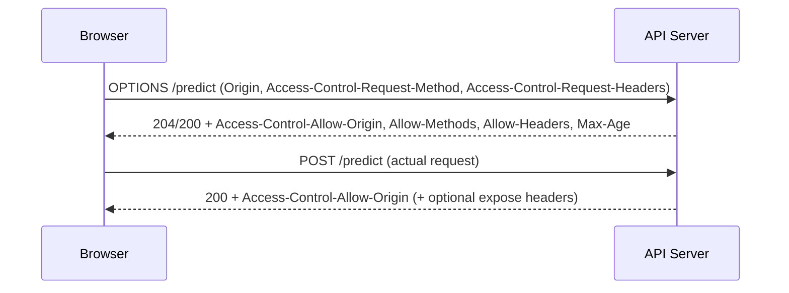
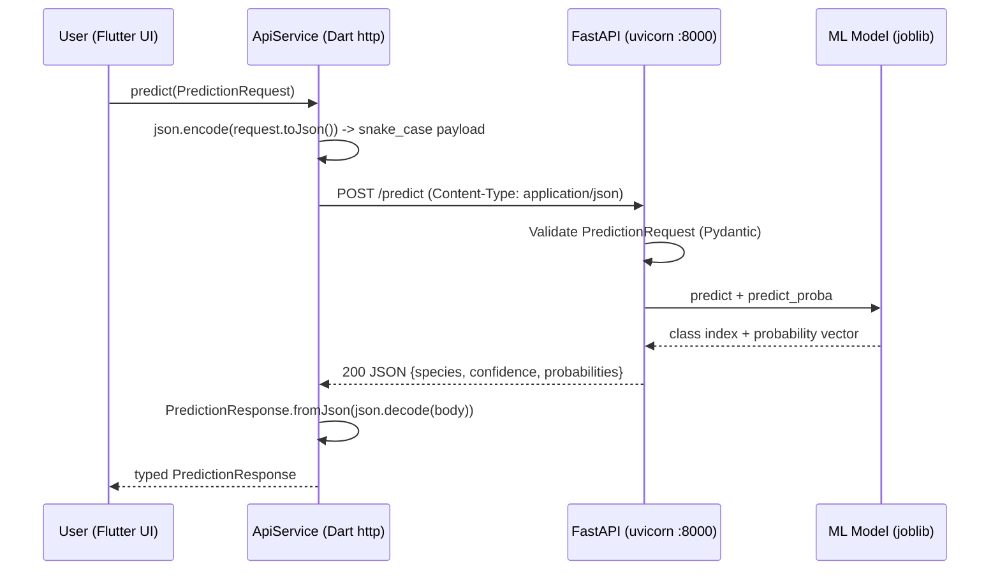

<a id="top"></a>

# REST Web Services Consumption — A Comprehensive Course (Flutter & Dart Focus)

This course explains **RESTful web services** from first principles to production-minded consumption patterns, with emphasis on **Dart and Flutter** using the official `http` package. It also compares other ecosystems (Python, JavaScript, curl/Postman) so you can reason about APIs regardless of client stack.

---

## Table of Contents

| # | Topic | Jump |
|---|--------|------|
| 1 | [What is a Web Service?](#1-what-is-a-web-service) | [→](#1-what-is-a-web-service) |
| &nbsp;&nbsp;&nbsp;↳ | [SOAP vs REST at a glance](#11-soap-vs-rest-at-a-glance) | [→](#11-soap-vs-rest-at-a-glance) |
| &nbsp;&nbsp;&nbsp;↳ | [Brief history and industry adoption](#12-brief-history-and-industry-adoption) | [→](#12-brief-history-and-industry-adoption) |
| &nbsp;&nbsp;&nbsp;↳ | [SOAP envelope vs REST resource](#1-3-soap-envelope-vs-rest-resource) | [→](#1-3-soap-envelope-vs-rest-resource) |
| 2 | [REST Architecture in Depth](#2-rest-architecture-in-depth) | [→](#2-rest-architecture-in-depth) |
| &nbsp;&nbsp;&nbsp;↳ | [The six constraints (Fielding)](#21-the-six-constraints-fielding) | [→](#21-the-six-constraints-fielding) |
| 3 | [The HTTP Protocol](#3-the-http-protocol) | [→](#3-the-http-protocol) |
| 4 | [HTTP Methods](#4-http-methods) | [→](#4-http-methods) |
| 5 | [HTTP Status Codes](#5-http-status-codes) | [→](#5-http-status-codes) |
| 6 | [Data Formats](#6-data-formats-json-vs-xml-vs-yaml) | [→](#6-data-formats-json-vs-xml-vs-yaml) |
| 7 | [Consuming an API with Python](#7-consuming-an-api-with-python-requests) | [→](#7-consuming-an-api-with-python-requests) |
| 8 | [Consuming an API with Dart / Flutter](#8-consuming-an-api-with-dart--flutter) | [→](#8-consuming-an-api-with-dart--flutter) |
| 9 | [Consuming an API with JavaScript](#9-consuming-an-api-with-javascript) | [→](#9-consuming-an-api-with-javascript) |
| 10 | [curl and Postman](#10-consuming-an-api-with-curl-and-postman) | [→](#10-consuming-an-api-with-curl-and-postman) |
| 11 | [Authentication in REST APIs](#11-authentication-in-rest-apis) | [→](#11-authentication-in-rest-apis) |
| 12 | [CORS](#12-cors--cross-origin-resource-sharing) | [→](#12-cors--cross-origin-resource-sharing) |
| 13 | [REST API Design Best Practices](#13-rest-api-design-best-practices) | [→](#13-rest-api-design-best-practices) |
| 14 | [Testing an API](#14-testing-an-api) | [→](#14-testing-an-api) |
| 15 | [Case Study: Iris Application](#15-case-study-our-iris-application) | [→](#15-case-study-our-iris-application) |
| 16 | [Glossary](#16-glossary-40-terms) | [→](#16-glossary-40-terms) |
| 17 | [Conclusion and Resources](#17-conclusion-and-resources) | [→](#17-conclusion-and-resources) |

---

<a id="1-what-is-a-web-service"></a>

## 1. What is a Web Service?

A **web service** is a software component exposed over a network (typically the Internet or an intranet) using standard protocols, so different applications—possibly written in different languages, running on different operating systems—can **interoperate** by exchanging structured messages.

In practice, “web service” usually means one of:

- A **machine-readable interface** over **HTTP(S)** returning data (often JSON) for clients such as mobile apps, SPAs, or backend jobs.
- Historically, an **XML-centric** service stack (SOAP, WSDL) designed for enterprise integration.

Modern mobile and web development overwhelmingly favors **REST over HTTP + JSON**, but SOAP remains in regulated industries and legacy enterprise systems.

<details>
<summary><strong>Expand: Why “web” and why “service”?</strong></summary>

- **Web**: the dominant transfer mechanism is HTTP (or HTTPS), the same protocol that powers browsers—making it easy to route through proxies, CDNs, load balancers, and firewalls.
- **Service**: the provider exposes a **contract** (endpoints, payloads, error semantics) that clients depend on. Good services are **versioned**, **documented**, and **stable** within compatibility guarantees.

</details>

<a id="11-soap-vs-rest-at-a-glance"></a>

### 1.1 SOAP vs REST at a glance

| Dimension | SOAP | REST (common style) |
|-----------|------|---------------------|
| **Protocol mindset** | Often seen as a **protocol** with strict rules (envelope, bindings) | An **architectural style** applied to HTTP, not a single standard |
| **Message format** | XML (SOAP envelope) | JSON most common; also XML, plain text, binary |
| **Contract** | WSDL (machine-readable) | OpenAPI/Swagger, RAML, or ad-hoc docs |
| **Transport** | Commonly HTTP; can use others | Almost always HTTP/HTTPS |
| **Verbs usage** | Frequently POST-heavy (operations in body) | Uses HTTP methods meaningfully (GET/POST/PUT/PATCH/DELETE) |
| **Errors** | SOAP faults | HTTP status + optional problem details (RFC 7807 style) |
| **Tooling** | Strong in Java/.NET enterprise stacks | Ubiquitous in web/mobile ecosystems |

**Takeaway:** SOAP optimizes for **formal contracts** and **enterprise middleware** features (WS-*). REST optimizes for **simplicity**, **caching**, and **browser/mobile friendliness**.

<a id="12-brief-history-and-industry-adoption"></a>

### 1.2 Brief history and industry adoption

- **2000s — SOAP ascendancy:** Large enterprises standardized on SOAP for B2B and internal integration (ESB patterns).
- **Roy Fielding’s dissertation (2000):** Formally defined **REST** as an architectural style derived from the design of the Web.
- **2010s — JSON + mobile:** Smartphone apps and JavaScript-heavy front ends pushed APIs toward **lightweight JSON** and **resource-oriented URLs**.
- **Today:** Public APIs, microservices, and BFF (Backend-for-Frontend) layers commonly expose **REST** or **GraphQL**; **gRPC** is popular for internal service-to-service calls; **SOAP** persists in finance, healthcare (HL7 integrations), and legacy systems.

<details>
<summary><strong>Expand: REST vs “REST-ish” APIs</strong></summary>

Many production APIs are **pragmatically RESTful**: they use JSON and resources, but may bend purity (e.g., POST for complex queries, non-cacheable GETs with side effects). That is common and acceptable if **documented** and **consistent**.

</details>

<a id="1-3-soap-envelope-vs-rest-resource"></a>

### 1.3 SOAP envelope vs REST resource (conceptual)

**SOAP (typical shape):** a single endpoint receives an **envelope** describing an operation and payload; transport may still be HTTP, but the **meaning** is inside XML.

```xml
<!-- Illustrative only — not project-specific -->
<soap:Envelope xmlns:soap="http://schemas.xmlsoap.org/soap/envelope/">
  <soap:Body>
    <GetUser xmlns="urn:example">
      <UserId>42</UserId>
    </GetUser>
  </soap:Body>
</soap:Envelope>
```

**REST (typical shape):** the **URI** names the resource; the **method** names the action; the **body** carries a representation.

```http
GET /v1/users/42 HTTP/1.1
Host: api.example.com
Accept: application/json
```

This difference drives tooling: SOAP stacks generate clients from **WSDL**; REST stacks often use **OpenAPI** generators or hand-written thin clients (as in Flutter).

---

<a id="2-rest-architecture-in-depth"></a>

## 2. REST Architecture in Depth

**REST** (Representational State Transfer) describes constraints that yield desirable properties: scalability, simplicity, evolvability, and interoperability—when applied thoughtfully.

<a id="21-the-six-constraints-fielding"></a>

### 2.1 The six constraints (Fielding)

Below is a **detailed** reading of each constraint and what it implies for API consumers and providers.

#### (1) Client–Server

- **Idea:** Separate **user interface concerns** from **data storage/processing**.
- **Why it matters:** Clients (Flutter app, web SPA) can evolve independently from servers; multiple clients can share one API.
- **Consumer impact:** You depend on a **stable contract** (URLs, schemas, status codes), not on server internals.

#### (2) Stateless

- **Idea:** Each request from client to server must contain **all information** needed to understand and process it. Server does not store **session state** between requests (in the pure model).
- **Why it matters:** Easier horizontal scaling; failures are less coupled to specific server instances.
- **Reality check:** “Stateless server” often means **no server-side session**; state may live in **tokens** (JWT), **databases**, or **client storage**. The key is: **don’t rely on hidden server memory** between requests unless you understand the tradeoffs.

#### (3) Cache

- **Idea:** Responses must be **labelled as cacheable or not** (via HTTP cache headers).
- **Why it matters:** Reduces load and latency; CDNs can serve static or semi-static representations.
- **Consumer impact:** Aggressive caching can show **stale data**; for real-time needs, use **Cache-Control: no-store** patterns or bypass caches.

#### (4) Uniform Interface

This is the most visible constraint in day-to-day REST consumption. Sub-principles include:

- **Resource identification:** Resources are identified by **URIs** (e.g., `/users/42`).
- **Representations:** Clients manipulate **representations** (JSON), not the resource directly.
- **Self-descriptive messages:** Standard methods, media types, and headers describe intent.
- **HATEOAS (Hypermedia as the Engine of Application State):** Responses can include **links** to valid next actions. Many JSON APIs partially skip this; hypermedia formats (HAL, JSON-LD) exist but are less common in mobile stacks.

#### (5) Layered System

- **Idea:** Architecture can include **intermediaries** (proxies, gateways, load balancers) without clients knowing how many hops occurred.
- **Consumer impact:** Headers like `Authorization` may be stripped or rewritten; TLS terminates at gateways; **timeouts** and **retries** must be designed with layers in mind.

#### (6) Code on Demand (optional)

- **Idea:** Server can extend client functionality by transferring executable code (historically Java applets; today rarely emphasized in REST JSON APIs).
- **Modern analogy:** Not central to typical REST JSON services; more relevant to plugin architectures.

<details>
<summary><strong>Expand: Maturity model for REST consumers</strong></summary>

1. **Level 0:** HTTP as tunnel (single endpoint, everything POST).
2. **Level 1:** Multiple resources (URLs) appear.
3. **Level 2:** Correct HTTP verbs and status codes (most “REST” APIs aim here).
4. **Level 3:** Hypermedia controls (HATEOAS) guide clients dynamically.

Many mobile apps integrate at **Level 2**, which is fine if documentation and versioning are strong.

</details>

---

<a id="3-the-http-protocol"></a>

## 3. The HTTP Protocol

HTTP is an **application-layer** protocol for exchanging messages between clients and servers. For REST consumption, you live inside **requests**, **responses**, **headers**, **bodies**, and **URLs**.

### 3.1 Request / response lifecycle (conceptual)



### 3.2 Anatomy of a URL

A **URL** identifies a resource and how to reach it:

`https://api.example.com:443/v1/users/42?expand=orders#section`

| Part | Example fragment | Role |
|------|------------------|------|
| Scheme | `https` | Protocol (TLS-wrapped HTTP) |
| Authority | `api.example.com:443` | Host (+ optional port) |
| Path | `/v1/users/42` | Hierarchical resource location |
| Query | `expand=orders` | Non-hierarchical parameters (`key=value`) |
| Fragment | `#section` | Client-side hint (typically **not** sent to server) |

<details>
<summary><strong>Expand: URI vs URL vs URN</strong></summary>

- **URI**: Identifier (superset).
- **URL**: Locator (where/how to fetch).
- **URN**: Name (persistent identifier scheme), e.g. `urn:isbn:...`.

In practice, developers say “URL” for API endpoints.

</details>

### 3.3 HTTP message structure



### 3.4 Common headers (consumer perspective)

| Header | Typical use |
|--------|-------------|
| `Host` | Required in HTTP/1.1; identifies target host |
| `Content-Type` | Describes body format (`application/json`) |
| `Accept` | What representation types the client prefers |
| `Authorization` | Credentials (Bearer token, Basic, etc.) |
| `User-Agent` | Client identification (analytics, debugging) |
| `Accept-Language` | Locale negotiation |
| `If-None-Match` / `If-Modified-Since` | Conditional requests / caching |

### 3.5 Bodies and safe methods

- **GET** and **HEAD** usually have **no** meaningful body (technically possible in HTTP, but discouraged and often rejected).
- **POST/PUT/PATCH** commonly send JSON bodies.
- **DELETE** may or may not include a body depending on API design (many APIs avoid DELETE bodies).

---

<a id="4-http-methods"></a>

## 4. HTTP Methods

Methods express **intent**. Correct usage improves **caching**, **intermediary behavior**, and **developer mental models**.

### 4.1 Comprehensive method reference

| Method | Safe? | Idempotent? | Typical purpose | Request body | Cache-friendly? |
|--------|-------|-------------|-----------------|--------------|-----------------|
| **GET** | Yes | Yes | Read a resource/representation | Usually absent | Yes (with headers) |
| **HEAD** | Yes | Yes | Same as GET but **no body** (metadata only) | Absent | Similar to GET |
| **POST** | No | **No** (usually) | Create resource, trigger action, non-idempotent ops | Often yes | Generally **no** |
| **PUT** | No | Yes | Replace resource at known URI (full replacement) | Often yes | Usually no |
| **PATCH** | No | **Not guaranteed** | Partial update (depends on implementation) | Often yes | Usually no |
| **DELETE** | No | Yes | Delete resource | Rare | Usually no |
| **OPTIONS** | Yes | Yes | Discover allowed methods / CORS preflight | Rare | Depends |

**Definitions:**

- **Safe:** Should not change server state (read-only semantics).
- **Idempotent:** Repeating the request has the same **effect** as doing it once (e.g., PUT same payload, DELETE same resource).

<details>
<summary><strong>Expand: Practical idempotency notes</strong></summary>

- Network retries can duplicate POSTs; APIs use **idempotency keys** (header like `Idempotency-Key`) for payments and orders.
- PATCH idempotency varies: patching `{ "count": 1 }` as “increment” is not idempotent; patching `{ "name": "Ada" }` can be.

</details>

### 4.2 Flutter/Dart mapping

| Intent | Prefer |
|--------|--------|
| Fetch JSON | `http.get` |
| Create / action | `http.post` |
| Replace | `http.put` |
| Partial update | `http.patch` |
| Remove | `http.delete` |

---

<a id="5-http-status-codes"></a>

## 5. HTTP Status Codes

Status codes are **three-digit** numbers grouped by the first digit. They communicate **outcome** independent of payload (though many APIs also return structured error JSON).

### 5.1 Families

| Class | Range | Meaning (high level) |
|-------|-------|----------------------|
| **1xx** | 100–199 | Informational (rare in many JSON APIs) |
| **2xx** | 200–299 | Success |
| **3xx** | 300–399 | Redirection |
| **4xx** | 400–499 | Client error |
| **5xx** | 500–599 | Server error |

### 5.2 Detailed reference table (commonly encountered)

| Code | Name | When it happens | Consumer guidance |
|------|------|-----------------|-------------------|
| **100** | Continue | Early hint in chunked uploads | Rare in mobile REST |
| **101** | Switching Protocols | WebSocket upgrade | Not typical REST JSON |
| **200** | OK | Generic success (GET/PUT/PATCH often) | Parse body |
| **201** | Created | POST created a resource | Read `Location` header if present |
| **202** | Accepted | Async processing started | Poll status endpoint if documented |
| **204** | No Content | Success with **empty** body | Common for DELETE |
| **206** | Partial Content | Range requests | Media streaming |
| **301** | Moved Permanently | Resource moved forever | Update stored URL |
| **302** | Found | Temporary redirect (historically messy) | Follow redirect carefully |
| **303** | See Other | Redirect after POST (GET elsewhere) | Follow with GET |
| **304** | Not Modified | Conditional GET: cache still valid | Use cached representation |
| **307** | Temporary Redirect | Temporary; keep method | Retain POST vs GET semantics |
| **308** | Permanent Redirect | Permanent; keep method | Prefer over 301 when method must persist |
| **400** | Bad Request | Malformed syntax / validation | Fix payload; show field errors if provided |
| **401** | Unauthorized | **Not authenticated** | Obtain/refresh credentials |
| **403** | Forbidden | Authenticated but **not allowed** | Do not retry blindly |
| **404** | Not Found | Unknown resource | Check URL/version |
| **405** | Method Not Allowed | Wrong HTTP verb | Read `Allow` header |
| **406** | Not Acceptable | Cannot satisfy `Accept` | Adjust headers |
| **409** | Conflict | State conflict (duplicate, versioning) | Merge/retry strategy |
| **410** | Gone | Permanently removed | Remove links |
| **412** | Precondition Failed | ETag/version mismatch | Refresh and retry |
| **415** | Unsupported Media Type | Bad `Content-Type` | Send JSON with correct type |
| **422** | Unprocessable Entity | Validation failed (common in APIs) | Show validation errors |
| **429** | Too Many Requests | Rate limited | Backoff; honor `Retry-After` |
| **500** | Internal Server Error | Server bug | Retry with caution |
| **502** | Bad Gateway | Upstream bad response | Retry/transient |
| **503** | Service Unavailable | Overload/maintenance | Retry with backoff |
| **504** | Gateway Timeout | Upstream too slow | Retry with backoff |

<details>
<summary><strong>Expand: 401 vs 403 — the classic confusion</strong></summary>

- **401 Unauthorized** historically misnamed; means **authentication required or failed** (“who are you?”).
- **403 Forbidden** means **authorization denied** (“I know who you are, but you can’t do this”).

Some APIs misuse these; client code should still treat them distinctly when possible.

</details>

### 5.3 Supplementary status codes (quick reference)

| Code | Typical meaning |
|------|-----------------|
| **205** | Reset Content — instructs client to reset document view |
| **300** | Multiple Choices — ambiguous resource; client must disambiguate |
| **402** | Payment Required — reserved / rarely used consistently |
| **407** | Proxy Authentication Required |
| **408** | Request Timeout — server gave up waiting for full request |
| **411** | Length Required — server demands `Content-Length` |
| **413** | Payload Too Large |
| **414** | URI Too Long |
| **416** | Range Not Satisfiable |
| **417** | Expectation Failed |
| **421** | Misdirected Request (HTTP/2) |
| **423** | Locked (WebDAV semantics; sometimes reused) |
| **424** | Failed Dependency |
| **426** | Upgrade Required |
| **428** | Precondition Required |
| **431** | Request Header Fields Too Large |
| **451** | Unavailable For Legal Reasons |
| **505** | HTTP Version Not Supported |
| **507** | Insufficient Storage (WebDAV) |
| **511** | Network Authentication Required (captive portals) |

<details>
<summary><strong>Expand: how clients should handle classes 4xx vs 5xx</strong></summary>

- **4xx:** Usually **do not** blindly retry unless documented (429 with `Retry-After` is an exception; 409 may be recoverable).
- **5xx:** Often **transient**; retry with **exponential backoff** and **jitter**, cap attempts, and ensure POST safety (idempotency keys).

</details>

---

<a id="6-data-formats-json-vs-xml-vs-yaml"></a>

## 6. Data Formats (JSON vs XML vs YAML)

### 6.1 Comparison matrix

| Aspect | JSON | XML | YAML |
|--------|------|-----|------|
| **Verbosity** | Compact | Verbose | Moderate (indentation-based) |
| **Types** | null, bool, number, string, array, object | Text-first; schemas add typing | Rich scalars, maps, lists |
| **Browser native** | `JSON.parse` / `JSON.stringify` | DOM parsers | Not native |
| **Dart/Flutter** | `json.encode` / `json.decode` | Packages available | Rare for wire format |
| **Schema tooling** | JSON Schema | XSD | JSON Schema / YAML schemas |
| **Human editing** | Good | Moderate | Excellent for config |
| **Security on parse** | Safer than YAML for untrusted input | XXE risks if misconfigured parsers | **Unsafe** if parsing untrusted YAML (code execution features in some loaders) |

### 6.2 When each wins

- **JSON:** Default for REST APIs consumed by mobile/web.
- **XML:** Legacy enterprise, SOAP, certain document-centric domains.
- **YAML:** **Configuration files** (Kubernetes, CI), not recommended as an **untrusted wire format**.

### 6.3 JSON patterns in strongly typed clients

- Parse to `Map<String, dynamic>` then map to models (Flutter).
- Prefer **explicit model classes** with `fromJson`/`toJson` for maintainability (as in this project’s Iris models).

---

<a id="7-consuming-an-api-with-python-requests"></a>

## 7. Consuming an API with Python (`requests`)

Install:

```bash
pip install requests
```

Below examples target a typical local FastAPI Iris service at `http://localhost:8000` (adjust host/port as needed).

### 7.1 GET — health and model metadata

```python
import requests

BASE = "http://localhost:8000"

r = requests.get(f"{BASE}/health", timeout=10)
r.raise_for_status()
print(r.json())

info = requests.get(f"{BASE}/model/info", timeout=10)
info.raise_for_status()
print(info.json())
```

### 7.2 POST — create/trigger processing with JSON body

```python
import requests

BASE = "http://localhost:8000"

payload = {
    "sepal_length": 5.1,
    "sepal_width": 3.5,
    "petal_length": 1.4,
    "petal_width": 0.2,
}

r = requests.post(
    f"{BASE}/predict",
    json=payload,
    headers={"Content-Type": "application/json"},
    timeout=10,
)
r.raise_for_status()
print(r.json())
```

### 7.3 PUT — full replacement (illustrative generic API)

Many public APIs use PUT for upserts or full updates:

```python
import requests

r = requests.put(
    "https://api.example.com/v1/users/42",
    json={"name": "Ada Lovelace", "email": "ada@example.com"},
    timeout=10,
)
r.raise_for_status()
```

### 7.4 DELETE — remove a resource (illustrative)

```python
import requests

r = requests.delete("https://api.example.com/v1/users/42", timeout=10)
if r.status_code not in (200, 204):
    r.raise_for_status()
```

### 7.5 PATCH — partial update (illustrative)

```python
import requests

r = requests.patch(
    "https://api.example.com/v1/users/42",
    json={"display_name": "A. Lovelace"},
    headers={"Content-Type": "application/json"},
    timeout=10,
)
r.raise_for_status()
print(r.json())
```

<details>
<summary><strong>Expand: sessions, retries, and auth with requests</strong></summary>

```python
import requests
from requests.adapters import HTTPAdapter
from urllib3.util.retry import Retry

session = requests.Session()
retries = Retry(total=3, backoff_factor=0.5, status_forcelist=[502, 503, 504])
session.mount("http://", HTTPAdapter(max_retries=retries))
session.mount("https://", HTTPAdapter(max_retries=retries))

session.headers.update({"Authorization": "Bearer YOUR_TOKEN_HERE"})
r = session.get("https://api.example.com/v1/me", timeout=10)
r.raise_for_status()
```

</details>

---

<a id="8-consuming-an-api-with-dart--flutter"></a>

## 8. Consuming an API with Dart / Flutter (`http`)

Add dependency in `pubspec.yaml`:

```yaml
dependencies:
  http: ^1.2.0
```

### 8.1 Core ideas

- **`Uri.parse`** builds URLs safely.
- **`http.get` / `http.post`** return a **`Response`** with `statusCode` and `body` (String).
- **`json.decode`** parses JSON strings into Dart objects (`Map`, `List`, primitives).
- **`json.encode`** serializes Dart maps/lists to JSON strings for request bodies.
- **`async` / `await`** keeps UI threads responsive; perform network IO off the UI thread (Flutter handles much of this when you await async calls from event handlers).

### 8.2 Patterns taken from this project’s `api_service.dart`

The following excerpts show **realistic production-style** structure: a dedicated service class, JSON headers for POST, and typed parsing via model factories.

**Health check (GET + decode + defensive catch):**

```8:18:frontend-flutter/lib/services/api_service.dart
  Future<bool> healthCheck() async {
    try {
      final response = await http.get(Uri.parse('$baseUrl/health'));
      if (response.statusCode == 200) {
        final data = json.decode(response.body);
        return data['status'] == 'healthy';
      }
      return false;
    } catch (e) {
      return false;
    }
  }
```

**Prediction (POST + `Content-Type` + `json.encode` + `fromJson`):**

```21:33:frontend-flutter/lib/services/api_service.dart
  Future<PredictionResponse> predict(PredictionRequest request) async {
    final response = await http.post(
      Uri.parse('$baseUrl/predict'),
      headers: {'Content-Type': 'application/json'},
      body: json.encode(request.toJson()),
    );

    if (response.statusCode == 200) {
      return PredictionResponse.fromJson(json.decode(response.body));
    } else {
      throw Exception('Erreur de prédiction: ${response.statusCode}');
    }
  }
```

**GET returning a list (decode to `List<dynamic>` then map):**

```45:54:frontend-flutter/lib/services/api_service.dart
  Future<List<DatasetSample>> getDatasetSamples() async {
    final response = await http.get(Uri.parse('$baseUrl/dataset/samples'));

    if (response.statusCode == 200) {
      final List<dynamic> data = json.decode(response.body);
      return data.map((e) => DatasetSample.fromJson(e)).toList();
    } else {
      throw Exception('Erreur: ${response.statusCode}');
    }
  }
```

### 8.3 Mapping JSON field names to Dart models

Your Flutter models use `camelCase` fields but the API expects **`snake_case` keys** (common in Python/FastAPI/Pydantic). The project’s `PredictionRequest.toJson()` performs that mapping:

```14:19:frontend-flutter/lib/models/iris_models.dart
  Map<String, dynamic> toJson() => {
        'sepal_length': sepalLength,
        'sepal_width': sepalWidth,
        'petal_length': petalLength,
        'petal_width': petalWidth,
      };
```

### 8.4 Error handling improvements (patterns)

<details>
<summary><strong>Expand: richer errors than generic Exception</strong></summary>

- Parse error bodies from APIs (`{"detail": ...}` in FastAPI).
- Distinguish **network** failures (socket, DNS) from **HTTP** errors (4xx/5xx).
- Surface **actionable** UI messages; log diagnostics separately.

Example sketch:

```dart
class ApiException implements Exception {
  final int? statusCode;
  final String message;
  ApiException(this.message, {this.statusCode});
}

Future<void> throwIfBad(http.Response r) async {
  if (r.statusCode >= 400) {
    throw ApiException('HTTP ${r.statusCode}: ${r.body}', statusCode: r.statusCode);
  }
}
```

</details>

### 8.5 PUT, PATCH, DELETE with `package:http` (illustrative)

The Iris backend in this repo primarily uses **GET** and **POST**, but production apps routinely need full CRUD. Patterns mirror `predict()`:

```dart
import 'dart:convert';
import 'package:http/http.dart' as http;

Future<void> updateUserFull(String baseUrl, String id, Map<String, dynamic> user) async {
  final uri = Uri.parse('$baseUrl/v1/users/$id');
  final response = await http.put(
    uri,
    headers: {'Content-Type': 'application/json'},
    body: json.encode(user),
  );
  if (response.statusCode != 200) {
    throw Exception('PUT failed: ${response.statusCode} ${response.body}');
  }
}

Future<void> updateUserPartial(String baseUrl, String id, Map<String, dynamic> patch) async {
  final uri = Uri.parse('$baseUrl/v1/users/$id');
  final response = await http.patch(
    uri,
    headers: {'Content-Type': 'application/json'},
    body: json.encode(patch),
  );
  if (response.statusCode != 200) {
    throw Exception('PATCH failed: ${response.statusCode} ${response.body}');
  }
}

Future<void> deleteUser(String baseUrl, String id) async {
  final uri = Uri.parse('$baseUrl/v1/users/$id');
  final response = await http.delete(uri);
  if (response.statusCode != 200 && response.statusCode != 204) {
    throw Exception('DELETE failed: ${response.statusCode} ${response.body}');
  }
}
```

**Notes:**

- Some APIs return **201** on PUT upserts; always align checks with your server contract.
- DELETE may return **204** with an empty body—do not assume JSON is always present.

### 8.6 Alternatives to `http` (when you outgrow basics)

| Package | Strengths |
|---------|-----------|
| [`http`](https://pub.dev/packages/http) | Simple, official-ish baseline |
| [`dio`](https://pub.dev/packages/dio) | Interceptors, cancellation, multipart, download progress |
| [`chopper`](https://pub.dev/packages/chopper) | Code generation, typed clients |

---

<a id="9-consuming-an-api-with-javascript"></a>

## 9. Consuming an API with JavaScript (fetch, axios)

### 9.1 `fetch` (browser and modern Node)

```javascript
const res = await fetch("http://localhost:8000/predict", {
  method: "POST",
  headers: { "Content-Type": "application/json" },
  body: JSON.stringify({
    sepal_length: 5.1,
    sepal_width: 3.5,
    petal_length: 1.4,
    petal_width: 0.2,
  }),
});

if (!res.ok) throw new Error(`HTTP ${res.status}`);
const data = await res.json();
console.log(data);
```

**Notes:**

- `fetch` resolves for many **4xx/5xx** responses; always check `res.ok`.
- CORS applies in browsers (see Section 12).

### 9.2 axios (brief)

```javascript
import axios from "axios";

const { data } = await axios.post("http://localhost:8000/predict", {
  sepal_length: 5.1,
  sepal_width: 3.5,
  petal_length: 1.4,
  petal_width: 0.2,
});
console.log(data);
```

Axios throws on non-2xx by default (configurable), centralizes interceptors, and simplifies JSON handling.

---

<a id="10-consuming-an-api-with-curl-and-postman"></a>

## 10. Consuming an API with curl and Postman

### 10.1 curl examples

**GET:**

```bash
curl -sS "http://localhost:8000/health"
```

**POST JSON:**

```bash
curl -sS -X POST "http://localhost:8000/predict" \
  -H "Content-Type: application/json" \
  -d "{\"sepal_length\":5.1,\"sepal_width\":3.5,\"petal_length\":1.4,\"petal_width\":0.2}"
```

**Verbose headers (debugging):**

```bash
curl -v "http://localhost:8000/model/info"
```

**Bearer token (illustrative):**

```bash
curl -sS "https://api.example.com/v1/me" \
  -H "Authorization: Bearer YOUR_TOKEN_HERE"
```

### 10.2 Postman workflow

1. Create a **Collection** per API surface.
2. Use **Environments** for `baseUrl`, tokens, tenant IDs.
3. Store credentials in **secrets**; avoid committing tokens.
4. Add **tests** (assert status code, JSON schema checks).
5. Export collection for team sharing / CI (optional Newman runner).

<details>
<summary><strong>Expand: curl vs Postman tradeoffs</strong></summary>

- **curl** is scriptable, CI-friendly, and precise for reproducing bugs.
- **Postman** accelerates exploration, documentation, and collaborative testing.

</details>

---

<a id="11-authentication-in-rest-apis"></a>

## 11. Authentication in REST APIs

### 11.1 Comparison table

| Mechanism | What it is | Strengths | Risks / costs | Typical header |
|-----------|------------|-----------|---------------|----------------|
| **API Keys** | Shared secret per client/project | Simple rollout | Key leakage = broad access; rotation discipline required | `X-API-Key: ...` or query param (discouraged) |
| **Basic Auth** | Base64(`user:password`) | Easy | Must use **HTTPS**; vulnerable if stored poorly | `Authorization: Basic ...` |
| **Bearer JWT** | Signed/encrypted token with claims | Stateless-ish; mobile-friendly | Expiry/revocation complexity; key management | `Authorization: Bearer <jwt>` |
| **OAuth 2.0** | Delegated authorization framework | Third-party consent; scoped access | Complex flows; implementation pitfalls | `Authorization: Bearer <access_token>` |
| **mTLS** | Mutual TLS client certificates | Strong service-to-service trust | Operational overhead | Transport-layer |
| **HMAC signatures** | Signed requests (AWS SigV4 style) | Replay resistance with timestamps | Clock skew; SDK support | Custom `Authorization` schemes |

### 11.2 Practical guidance for Flutter apps

- **Never** embed long-lived secrets in client binaries for untrusted devices; prefer **OAuth** with PKCE for user delegation, or **short-lived tokens** from your backend.
- Prefer **`Authorization` header** over query parameters for tokens (logs, referrer leakage).
- Refresh tokens carefully; use secure storage (`flutter_secure_storage`) when required.

<details>
<summary><strong>Expand: OAuth2 flows at a glance</strong></summary>

- **Authorization Code + PKCE:** Mobile/public clients (recommended).
- **Client Credentials:** Server-to-server.
- **Device Code:** Input-constrained devices.

</details>

---

<a id="12-cors--cross-origin-resource-sharing"></a>

## 12. CORS — Cross-Origin Resource Sharing

### 12.1 What and why

Browsers enforce the **Same-Origin Policy** for JavaScript: by default, a page served from `https://app.example.com` cannot read responses from `https://api.other.com` unless the API opts in via **CORS headers**.

**Important:** CORS is primarily a **browser** security model. Many **non-browser** clients (Flutter mobile apps using `http`, server-side Python) are **not** restricted by CORS the same way. **Flutter Web** is browser-based and **is** subject to CORS.

### 12.2 Simple vs preflight

- **Simple requests** (narrow method/header/content-type rules) may proceed without preflight.
- Many JSON APIs use `Content-Type: application/json`, which triggers a **preflight** `OPTIONS` request.

### 12.3 Preflight sequence (mermaid)



### 12.4 Server configuration example (this project)

The Iris FastAPI backend enables permissive CORS for local development:

```16:22:backend/main.py
app.add_middleware(
    CORSMiddleware,
    allow_origins=["*"],
    allow_credentials=True,
    allow_methods=["*"],
    allow_headers=["*"],
)
```

**Production guidance:** replace `allow_origins=["*"]` with explicit origins; tighten methods/headers; understand interaction between `allow_credentials` and wildcard origins.

---

<a id="13-rest-api-design-best-practices"></a>

## 13. REST API Design Best Practices

### 13.1 Naming resources

- Use **nouns** for resources (`/users`, `/orders`), not verbs (`/getUsers`).
- Use **plural** collections (`/users`) with consistent style.
- Prefer **hierarchical relationships** (`/users/42/orders`) when natural.

### 13.2 Versioning

Common strategies:

- **URL prefix:** `/v1/users` (very common; easy to route)
- **Header:** `Accept: application/vnd.example.v2+json` (clean URLs; harder to discover)
- **Query parameter:** rare; generally discouraged

### 13.3 Pagination

| Style | Example | Pros | Cons |
|-------|---------|------|------|
| **Offset/limit** | `?offset=40&limit=20` | Simple | Inconsistent under inserts |
| **Cursor** | `?cursor=abc` | Stable for live datasets | More complex |

Return **total counts** optionally; include **next** links if hypermedia-friendly.

### 13.4 Filtering, sorting, searching

- **Filtering:** `?status=open&minPrice=10`
- **Sorting:** `?sort=created_at:desc`
- **Field selection:** `?fields=id,name` (reduces payload)
- **Full-text search:** sometimes a dedicated `/search` resource or POST if queries are too complex for query strings

### 13.5 Error model consistency

- Use correct **HTTP status**.
- Return structured errors (`detail`, `errors[]`, RFC 7807 `application/problem+json`).

### 13.6 Idempotency and safety

- Document which operations are safe/idempotent.
- Use **idempotency keys** for critical POST operations.

---

<a id="14-testing-an-api"></a>

## 14. Testing an API

### 14.1 Swagger UI / OpenAPI

FastAPI auto-generates OpenAPI; visit `/docs` for interactive testing during development.

**Benefits:** quick experimentation, schema visibility, shareable with frontend teams.

### 14.2 REST Client (VS Code / editor extensions)

- Store `.http` files with requests in-repo (without secrets).
- Great for repeatable manual checks close to code.

### 14.3 Postman / Newman

- Collections become **executable** in CI via **Newman**.
- Useful for smoke tests after deploy.

### 14.4 pytest (Python)

```python
from fastapi.testclient import TestClient
from main import app

client = TestClient(app)

def test_health():
    r = client.get("/health")
    assert r.status_code == 200
    assert r.json()["status"] == "healthy"
```

<details>
<summary><strong>Expand: contract testing and consumer-driven tests</strong></summary>

- **Contract tests** verify client/server agreement on schemas.
- **Pact** (ecosystem tool) supports consumer-driven contracts for evolving APIs.

</details>

---

<a id="15-case-study-our-iris-application"></a>

## 15. Case Study: Our Iris Application

This repository contains:

- **Backend:** FastAPI service exposing `/health`, `/predict`, `/model/info`, `/dataset/samples`, `/dataset/stats`.
- **Frontend:** Flutter app using `ApiService` with `baseUrl = http://localhost:8000`.

### 15.1 End-to-end sequence: prediction from Flutter to FastAPI



### 15.2 What to notice as a learner

- **Contract alignment:** Dart `toJson` keys must match FastAPI model fields (`sepal_length`, etc.).
- **Status codes:** Flutter checks `200` before parsing; server may return `503` if model not loaded.
- **Types:** JSON numbers become `num` in Dart; cast carefully (`toDouble()`).
- **Local development:** Android emulator may need `10.0.2.2` instead of `localhost`; iOS simulator often can use `localhost`; real devices need LAN IP or tunneled URL.

### 15.3 Related server routes (reference)

| Route | Method | Purpose |
|-------|--------|---------|
| `/health` | GET | Liveness / model loaded flag |
| `/predict` | POST | Iris species prediction |
| `/model/info` | GET | Model metadata |
| `/dataset/samples` | GET | Random sample rows |
| `/dataset/stats` | GET | Aggregated statistics |

---

<a id="16-glossary-40-terms"></a>

## 16. Glossary (40+ terms)

<details>
<summary><strong>Open glossary (40+ definitions)</strong></summary>

1. **API (Application Programming Interface):** A defined surface for programs to call other software.
2. **REST:** Architectural style for distributed hypermedia systems; commonly implemented with HTTP + resources.
3. **Resource:** An abstraction addressed by a URI (e.g., a user, an order).
4. **Representation:** A concrete serialization of a resource (often JSON).
5. **URI / URL:** Identifiers/locators for resources on the network.
6. **HTTP:** Application protocol for request/response messaging.
7. **HTTPS:** HTTP over TLS for encryption and integrity.
8. **Method (verb):** HTTP operation indicating intent (GET, POST, etc.).
9. **Status code:** Numeric HTTP outcome indicator.
10. **Header:** Metadata attached to HTTP messages.
11. **Body:** Payload of an HTTP message.
12. **JSON:** Lightweight data interchange text format.
13. **Serialization:** Converting runtime objects to a transmittable format.
14. **Deserialization:** Parsing a transmitted format into runtime objects.
15. **OpenAPI (Swagger):** Specification for describing HTTP APIs.
16. **Client:** Program initiating requests (Flutter app, browser JS).
17. **Server:** Program accepting requests and returning responses.
18. **Origin:** Scheme + host + port tuple used in browser security (CORS).
19. **CORS:** Mechanism allowing browsers to relax same-origin reads with server headers.
20. **Preflight:** OPTIONS request validating cross-origin permission before the real request.
21. **Idempotent:** Repeating a request does not change outcome beyond the first successful application.
22. **Safe method:** Intended not to mutate server state (GET/HEAD).
23. **Cache-Control:** Header directing caching behavior along the chain.
24. **Content-Type:** Declares representation format of a body.
25. **Accept:** Declares acceptable response formats.
26. **Bearer token:** Authorization scheme carrying an opaque or structured token.
27. **JWT:** Compact, commonly signed token format with claims.
28. **OAuth 2.0:** Authorization framework for delegated access.
29. **API key:** Shared secret identifying a project/client.
30. **Rate limit:** Policy throttling request volume (often 429).
31. **Backoff:** Retry strategy increasing delay between attempts.
32. **Pagination:** Splitting large collections across multiple responses.
33. **Cursor pagination:** Page using an opaque pointer to the next segment.
34. **HATEOAS:** Hypermedia-driven state transitions via links in responses.
35. **DTO (Data Transfer Object):** Shape of data crossing boundaries (often JSON models).
36. **Pydantic:** Python data validation library used by FastAPI models.
37. **FastAPI:** Modern Python web framework for APIs with automatic OpenAPI docs.
38. **Middleware:** Intercepts requests/responses (logging, CORS, auth).
39. **Reverse proxy:** Gateway in front of servers (TLS termination, routing).
40. **CDN:** Distributed caching layer for static assets and cacheable responses.
41. **Idempotency key:** Client-provided key enabling safe retries for POST-like operations.
42. **Webhook:** Server-to-server callback via HTTP POST on events.
43. **SOAP:** XML protocol style often associated with WSDL services.
44. **WSDL:** XML contract format for SOAP services.
45. **gRPC:** RPC framework using HTTP/2 and protobuf (often internal APIs).
46. **GraphQL:** Query language for APIs; alternative to REST resource modeling.
47. **RFC:** Request for Comments; Internet standards documents (e.g., HTTP semantics).
48. **TLS:** Transport Layer Security; encrypts HTTP traffic (HTTPS).

</details>

---

<a id="17-conclusion-and-resources"></a>

## 17. Conclusion and Resources

You should now be able to:

- Explain **what REST implies** beyond “JSON over HTTP”.
- Read and issue **HTTP requests** with appropriate **methods**, **headers**, and **status codes**.
- Consume APIs using **Python `requests`**, **Dart `http`**, and **JavaScript `fetch`/axios**.
- Debug cross-browser issues involving **CORS**, especially for **Flutter Web**.
- Design tests around **OpenAPI docs**, **Postman/Newman**, and **`pytest`**.

### Recommended reading and references

- Roy Fielding, *Architectural Styles and the Design of Network-based Software Architectures* (REST dissertation).
- IETF **HTTP semantics** and method definitions (HTTP/1.1 and HTTP/2 ecosystem).
- **OpenAPI Specification** (API description standard).
- MDN Web Docs: **HTTP**, **fetch**, **CORS** (practical, high quality).
- Dart documentation: **`dart:convert`**, **`package:http`**.

### Practical next steps for Flutter developers

- Harden `ApiService` error handling (typed exceptions, parsing FastAPI `detail`).
- Externalize `baseUrl` via `--dart-define` or flavors (dev/stage/prod).
- Add **timeouts** and **retry** policies (consider `dio` when complexity grows).
- If targeting **Flutter Web**, validate CORS against your deployment origins.

---

[Back to top](#top)
