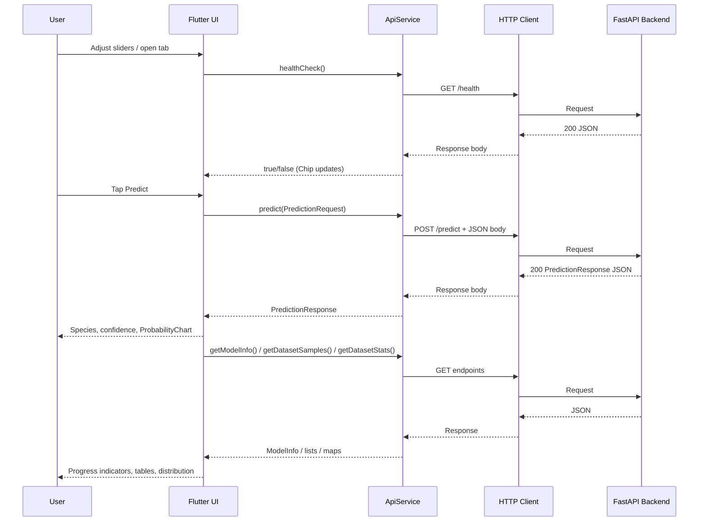
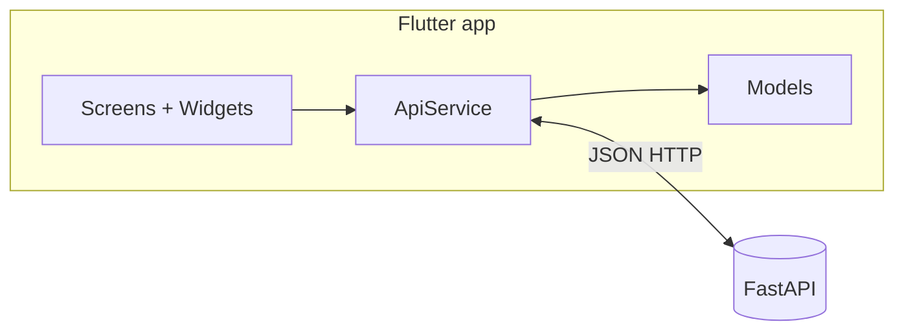

<a id="top"></a>

# Flutter: Consuming a FastAPI REST API

This course walks you through building a **Flutter** client that talks to a **FastAPI** backend (Iris flower classification). You will structure a small app with typed Dart models, an HTTP service layer, three feature screens, reusable UI, Material 3 navigation, connection status, and robust loading/error handling.

---

## Table of contents

| # | Section | Anchor |
|---|---------|--------|
| 1 | [Introduction — Flutter and API Consumption](#1-introduction--flutter-and-api-consumption) | `#1-introduction--flutter-and-api-consumption` |
| 2 | [Flutter Project Structure](#2-flutter-project-structure) | `#2-flutter-project-structure` |
| 3 | [Dart Data Models](#3-dart-data-models) | `#3-dart-data-models` |
| 4 | [The API Service](#4-the-api-service) | `#4-the-api-service` |
| 5 | [Prediction Screen](#5-prediction-screen) | `#5-prediction-screen` |
| 6 | [Model Info Screen](#6-model-info-screen) | `#6-model-info-screen` |
| 7 | [Dataset Screen](#7-dataset-screen) | `#7-dataset-screen` |
| 8 | [Reusable Widgets](#8-reusable-widgets-probability_chartdart) | `#8-reusable-widgets-probability_chartdart` |
| 9 | [Navigation with NavigationBar](#9-navigation-with-navigationbar-material-3) | `#9-navigation-with-navigationbar-material-3` |
| 10 | [API Connection Indicator](#10-api-connection-indicator) | `#10-api-connection-indicator` |
| 11 | [Error Handling on the Frontend](#11-error-handling-on-the-frontend) | `#11-error-handling-on-the-frontend` |
| 12 | [Flutter Best Practices](#12-flutter-best-practices) | `#12-flutter-best-practices` |
| 13 | [Conclusion — The Complete Flow](#13-conclusion--the-complete-flow) | `#13-conclusion--the-complete-flow` |

[↑ Back to top](#top)

---

<a id="1-introduction--flutter-and-api-consumption"></a>

## 1. Introduction — Flutter and API Consumption

**Flutter** is a UI toolkit for building natively compiled apps from a single **Dart** codebase. When your data and business logic live on a **REST API** (here, **FastAPI** on Python), the mobile or desktop app becomes a *client*: it serializes requests as JSON, awaits HTTP responses, and maps JSON into strongly typed Dart objects.

**Why this matters:**

| Concern | Flutter’s role |
|--------|----------------|
| **Networking** | `http` package: `get`, `post`, headers, body |
| **JSON** | `dart:convert` — `json.encode` / `json.decode` |
| **Asynchrony** | `async` / `await`, `Future` |
| **UI feedback** | Loading indicators, error banners, retry buttons |
| **Structure** | Models, services, screens, small reusable widgets |

The companion API in this project exposes endpoints such as `/health`, `/predict`, `/model/info`, `/dataset/samples`, and `/dataset/stats`. The Flutter app mirrors those contracts with Dart classes and a single `ApiService`.

<details>
<summary>Prerequisites (expand)</summary>

- Flutter SDK installed; `flutter doctor` clean for your target platform.
- FastAPI backend running (e.g. `http://localhost:8000`).
- For **Android emulator**, `localhost` on the host is often reached as `http://10.0.2.2:8000` — adjust `baseUrl` accordingly.
- **iOS simulator** can use `http://localhost:8000` for a server on the same Mac.

</details>

[↑ Back to top](#top)

---

<a id="2-flutter-project-structure"></a>

## 2. Flutter Project Structure

Organize code so that **models**, **HTTP logic**, and **screens** stay separate. A layout that scales well for a small ML demo:

```text
lib/
├── main.dart                 # App entry, theme, home shell + NavigationBar
├── models/
│   └── iris_models.dart      # PredictionRequest, PredictionResponse, ModelInfo, DatasetSample
├── services/
│   └── api_service.dart      # baseUrl, GET/POST, JSON encode/decode
├── screens/
│   ├── prediction_screen.dart
│   ├── model_info_screen.dart
│   └── dataset_screen.dart
└── widgets/
    └── probability_chart.dart
```

### `pubspec.yaml` dependencies

Add packages for HTTP, charts, and typography:

```yaml
dependencies:
  flutter:
    sdk: flutter
  cupertino_icons: ^1.0.8
  http: ^1.2.0
  fl_chart: ^0.70.0
  google_fonts: ^6.2.1
```

| Package | Purpose |
|---------|---------|
| `http` | Simple async HTTP client (`get`, `post`). |
| `fl_chart` | Optional rich charts (bar/line/pie) for probabilities or metrics. |
| `google_fonts` | Load Google Fonts at runtime for consistent typography. |

Run:

```bash
flutter pub get
```

[↑ Back to top](#top)

---

<a id="3-dart-data-models"></a>

## 3. Dart Data Models (PredictionRequest, PredictionResponse, ModelInfo, DatasetSample)

JSON field names from FastAPI use **snake_case** (`sepal_length`). Dart fields often use **lowerCamelCase** (`sepalLength`). Bridge the two in `toJson` / `fromJson`.

**Design rules:**

- Use `factory` constructors for `fromJson` when parsing maps.
- Cast JSON numbers with `(json['x'] as num).toDouble()` when the API returns doubles.
- For nested maps (e.g. `probabilities`), iterate and convert values safely.

```dart
class PredictionRequest {
  final double sepalLength;
  final double sepalWidth;
  final double petalLength;
  final double petalWidth;

  PredictionRequest({
    required this.sepalLength,
    required this.sepalWidth,
    required this.petalLength,
    required this.petalWidth,
  });

  Map<String, dynamic> toJson() => {
        'sepal_length': sepalLength,
        'sepal_width': sepalWidth,
        'petal_length': petalLength,
        'petal_width': petalWidth,
      };
}

class PredictionResponse {
  final String species;
  final double confidence;
  final Map<String, double> probabilities;

  PredictionResponse({
    required this.species,
    required this.confidence,
    required this.probabilities,
  });

  factory PredictionResponse.fromJson(Map<String, dynamic> json) {
    return PredictionResponse(
      species: json['species'] as String,
      confidence: (json['confidence'] as num).toDouble(),
      probabilities: (json['probabilities'] as Map<String, dynamic>)
          .map((k, v) => MapEntry(k, (v as num).toDouble())),
    );
  }
}

class ModelInfo {
  final String modelType;
  final double accuracy;
  final List<String> featureNames;
  final List<String> targetNames;
  final Map<String, double> featureImportances;
  final int trainingSamples;
  final int testSamples;

  ModelInfo({
    required this.modelType,
    required this.accuracy,
    required this.featureNames,
    required this.targetNames,
    required this.featureImportances,
    required this.trainingSamples,
    required this.testSamples,
  });

  factory ModelInfo.fromJson(Map<String, dynamic> json) {
    return ModelInfo(
      modelType: json['model_type'] as String,
      accuracy: (json['accuracy'] as num).toDouble(),
      featureNames: List<String>.from(json['feature_names'] as List),
      targetNames: List<String>.from(json['target_names'] as List),
      featureImportances: (json['feature_importances'] as Map<String, dynamic>)
          .map((k, v) => MapEntry(k, (v as num).toDouble())),
      trainingSamples: json['training_samples'] as int,
      testSamples: json['test_samples'] as int,
    );
  }
}

class DatasetSample {
  final double sepalLength;
  final double sepalWidth;
  final double petalLength;
  final double petalWidth;
  final String species;

  DatasetSample({
    required this.sepalLength,
    required this.sepalWidth,
    required this.petalLength,
    required this.petalWidth,
    required this.species,
  });

  factory DatasetSample.fromJson(Map<String, dynamic> json) {
    return DatasetSample(
      sepalLength: (json['sepal_length'] as num).toDouble(),
      sepalWidth: (json['sepal_width'] as num).toDouble(),
      petalLength: (json['petal_length'] as num).toDouble(),
      petalWidth: (json['petal_width'] as num).toDouble(),
      species: json['species'] as String,
    );
  }
}
```

[↑ Back to top](#top)

---

<a id="4-the-api-service"></a>

## 4. The API Service (`api_service.dart`)

Centralize URLs and HTTP calls in one class. Benefits: easier testing, a single place to change `baseUrl`, and consistent error handling.

**Patterns:**

- `static const String baseUrl = 'http://localhost:8000';`
- `Uri.parse('$baseUrl/predict')` for endpoints.
- **POST** with `headers: {'Content-Type': 'application/json'}` and `body: json.encode(request.toJson())`.
- **GET** with `await http.get(...)` then `json.decode(response.body)`.
- Check `response.statusCode` before parsing; throw or return a result type your UI understands.

```dart
import 'dart:convert';
import 'package:http/http.dart' as http;
import '../models/iris_models.dart';

class ApiService {
  static const String baseUrl = 'http://localhost:8000';

  Future<bool> healthCheck() async {
    try {
      final response = await http.get(Uri.parse('$baseUrl/health'));
      if (response.statusCode == 200) {
        final data = json.decode(response.body) as Map<String, dynamic>;
        return data['status'] == 'healthy';
      }
      return false;
    } catch (_) {
      return false;
    }
  }

  Future<PredictionResponse> predict(PredictionRequest request) async {
    final response = await http.post(
      Uri.parse('$baseUrl/predict'),
      headers: {'Content-Type': 'application/json'},
      body: json.encode(request.toJson()),
    );

    if (response.statusCode == 200) {
      final map = json.decode(response.body) as Map<String, dynamic>;
      return PredictionResponse.fromJson(map);
    }
    throw Exception('Prediction failed: ${response.statusCode}');
  }

  Future<ModelInfo> getModelInfo() async {
    final response = await http.get(Uri.parse('$baseUrl/model/info'));
    if (response.statusCode == 200) {
      return ModelInfo.fromJson(
        json.decode(response.body) as Map<String, dynamic>,
      );
    }
    throw Exception('Model info failed: ${response.statusCode}');
  }

  Future<List<DatasetSample>> getDatasetSamples() async {
    final response = await http.get(Uri.parse('$baseUrl/dataset/samples'));
    if (response.statusCode == 200) {
      final list = json.decode(response.body) as List<dynamic>;
      return list
          .map((e) => DatasetSample.fromJson(e as Map<String, dynamic>))
          .toList();
    }
    throw Exception('Dataset samples failed: ${response.statusCode}');
  }

  Future<Map<String, dynamic>> getDatasetStats() async {
    final response = await http.get(Uri.parse('$baseUrl/dataset/stats'));
    if (response.statusCode == 200) {
      return json.decode(response.body) as Map<String, dynamic>;
    }
    throw Exception('Dataset stats failed: ${response.statusCode}');
  }
}
```

| Method | HTTP | Endpoint | Returns |
|--------|------|----------|---------|
| `healthCheck` | GET | `/health` | `bool` |
| `predict` | POST | `/predict` | `PredictionResponse` |
| `getModelInfo` | GET | `/model/info` | `ModelInfo` |
| `getDatasetSamples` | GET | `/dataset/samples` | `List<DatasetSample>` |
| `getDatasetStats` | GET | `/dataset/stats` | `Map<String, dynamic>` |

[↑ Back to top](#top)

---

<a id="5-prediction-screen"></a>

## 5. Prediction Screen

The prediction flow:

1. **Sliders** (or text fields) hold `sepal_length`, `sepal_width`, `petal_length`, `petal_width`.
2. A **button** triggers an `async` method that builds `PredictionRequest` and calls `ApiService.predict`.
3. While waiting, show **`CircularProgressIndicator`** and disable the button.
4. On success, show **species**, **confidence**, and **per-class probabilities** (e.g. a card + `ProbabilityChart` widget).

```dart
Future<void> _predict() async {
  setState(() {
    _isLoading = true;
    _error = null;
  });

  try {
    final request = PredictionRequest(
      sepalLength: _sepalLength,
      sepalWidth: _sepalWidth,
      petalLength: _petalLength,
      petalWidth: _petalWidth,
    );
    final response = await _apiService.predict(request);
    setState(() {
      _prediction = response;
      _isLoading = false;
    });
  } catch (e) {
    setState(() {
      _error = e.toString();
      _isLoading = false;
    });
  }
}
```

**UI sketch:** `Column` with sliders → `ElevatedButton.icon` → if loading, `CircularProgressIndicator`; if error, error card; if `_prediction != null`, result card showing species and confidence percentage, then `ProbabilityChart(probabilities: _prediction!.probabilities)`.

[↑ Back to top](#top)

---

<a id="6-model-info-screen"></a>

## 6. Model Info Screen

Load metadata in `initState` via `_loadModelInfo()`.

**Loading:** full-screen `Center(child: CircularProgressIndicator())`.

**Accuracy visualization:** `CircularProgressIndicator` with `value: modelInfo.accuracy` (0.0–1.0) inside a `Stack` with a centered percentage `Text`.

**Feature importances:** sort entries by value; for each row, show label + `LinearProgressIndicator(value: importance)` for a quick visual ranking.

**Info rows:** reusable `_buildInfoRow(icon, label, value)` for training samples, test samples, class names, and feature count.

```dart
@override
void initState() {
  super.initState();
  _loadModelInfo();
}

// In build: if (_isLoading) return const Center(child: CircularProgressIndicator());
```

[↑ Back to top](#top)

---

<a id="7-dataset-screen"></a>

## 7. Dataset Screen

**Parallel loads:** use `Future.wait` to fetch samples and stats together, then one `setState`.

```dart
Future<void> _loadData() async {
  try {
    final results = await Future.wait([
      _apiService.getDatasetSamples(),
      _apiService.getDatasetStats(),
    ]);
    setState(() {
      _samples = results[0] as List<DatasetSample>;
      _stats = results[1] as Map<String, dynamic>;
      _isLoading = false;
    });
  } catch (e) {
    setState(() {
      _error = e.toString();
      _isLoading = false;
    });
  }
}
```

**Stat chips:** read `total_samples`, `features_count`, `species_count` from `_stats` and display three compact “chip” or card columns with icons.

**Distribution:** use `species_distribution` map; show each species with count and percentage of total.

**Table:** `DataTable` inside `SingleChildScrollView(scrollDirection: Axis.horizontal)` so wide tables scroll on small phones.

**Refresh:** button sets `_isLoading = true` and calls `_loadData()` again (new random samples from the API).

[↑ Back to top](#top)

---

<a id="8-reusable-widgets-probability_chartdart"></a>

## 8. Reusable Widgets (`probability_chart.dart`)

Extract repeated UI into a **stateless** widget with a `const` constructor when possible. The chart widget takes `Map<String, double> probabilities` and renders labeled bars.

**Implementation A — progress bars (no extra chart package):**

```dart
import 'package:flutter/material.dart';

class ProbabilityChart extends StatelessWidget {
  final Map<String, double> probabilities;

  const ProbabilityChart({super.key, required this.probabilities});

  @override
  Widget build(BuildContext context) {
    return Card(
      child: Padding(
        padding: const EdgeInsets.all(20),
        child: Column(
          crossAxisAlignment: CrossAxisAlignment.start,
          children: [
            const Text('Probabilities by species',
                style: TextStyle(fontSize: 18, fontWeight: FontWeight.w600)),
            const SizedBox(height: 16),
            ...probabilities.entries.map((entry) {
              return Padding(
                padding: const EdgeInsets.only(bottom: 12),
                child: Column(
                  crossAxisAlignment: CrossAxisAlignment.start,
                  children: [
                    Row(
                      mainAxisAlignment: MainAxisAlignment.spaceBetween,
                      children: [
                        Text(entry.key,
                            style: const TextStyle(fontWeight: FontWeight.w600)),
                        Text('${(entry.value * 100).toStringAsFixed(1)}%',
                            style: const TextStyle(fontWeight: FontWeight.bold)),
                      ],
                    ),
                    const SizedBox(height: 6),
                    ClipRRect(
                      borderRadius: BorderRadius.circular(8),
                      child: LinearProgressIndicator(
                        value: entry.value,
                        minHeight: 12,
                      ),
                    ),
                  ],
                ),
              );
            }),
          ],
        ),
      ),
    );
  }
}
```

<details>
<summary>Optional: `fl_chart` bar chart (expand)</summary>

With `fl_chart` in `pubspec.yaml`, you can replace or complement the widget above with a `BarChart` using `BarChartGroupData` built from `probabilities.entries`. That gives touch tooltips and animations at the cost of more setup (axis labels, `FlTitlesData`, max Y value 1.0).

</details>

[↑ Back to top](#top)

---

<a id="9-navigation-with-navigationbar-material-3"></a>

## 9. Navigation with NavigationBar (Material 3 bottom navigation)

**Material 3** provides `NavigationBar` (not the older `BottomNavigationBar` by default in new designs). Keep an index in state and swap the body.

```dart
int _currentIndex = 0;

final _screens = const [
  PredictionScreen(),
  ModelInfoScreen(),
  DatasetScreen(),
];

// body: _screens[_currentIndex],
bottomNavigationBar: NavigationBar(
  selectedIndex: _currentIndex,
  onDestinationSelected: (index) => setState(() => _currentIndex = index),
  destinations: const [
    NavigationDestination(
      icon: Icon(Icons.science_outlined),
      selectedIcon: Icon(Icons.science),
      label: 'Predict',
    ),
    NavigationDestination(
      icon: Icon(Icons.psychology_outlined),
      selectedIcon: Icon(Icons.psychology),
      label: 'Model',
    ),
    NavigationDestination(
      icon: Icon(Icons.dataset_outlined),
      selectedIcon: Icon(Icons.dataset),
      label: 'Dataset',
    ),
  ],
),
```

Enable Material 3 in `ThemeData`: `useMaterial3: true`.

[↑ Back to top](#top)

---

<a id="10-api-connection-indicator"></a>

## 10. API Connection Indicator (health check, Chip widget)

Call `healthCheck()` once when the shell loads (`initState`), and optionally expose a manual refresh. Show status in the `AppBar` with a **`Chip`**: avatar icon (`cloud_done` / `cloud_off`) and a short label.

```dart
@override
void initState() {
  super.initState();
  _checkApi();
}

Future<void> _checkApi() async {
  final connected = await _apiService.healthCheck();
  if (mounted) setState(() => _apiConnected = connected);
}
```

```dart
Chip(
  avatar: Icon(
    _apiConnected ? Icons.cloud_done : Icons.cloud_off,
    size: 18,
    color: _apiConnected ? Colors.green : Colors.red,
  ),
  label: Text(_apiConnected ? 'API online' : 'API offline'),
)
```

The `/health` endpoint returns JSON such as `status` and `model_loaded`; your indicator can require `status == 'healthy'` for a green state.

[↑ Back to top](#top)

---

<a id="11-error-handling-on-the-frontend"></a>

## 11. Error Handling on the Frontend

| Technique | When to use |
|-----------|-------------|
| **`try` / `catch`** | Around every `await` that can throw (network, decode, your `Exception`). |
| **Error state variable** | `String? _error` — set to `null` on retry, show a red card when non-null. |
| **Retry** | `ElevatedButton` resets loading + error and re-invokes the load method. |
| **Loading** | `bool _isLoading` — true before await, false in both success and failure branches. |
| **`mounted` check** | After any `await` before `setState`, use `if (!mounted) return;` to avoid disposing context issues. |

```dart
if (_error != null) {
  return Center(
    child: Column(
      mainAxisAlignment: MainAxisAlignment.center,
      children: [
        const Icon(Icons.error_outline, size: 64, color: Colors.red),
        Text(_error!),
        ElevatedButton(
          onPressed: () {
            setState(() {
              _isLoading = true;
              _error = null;
            });
            _loadData();
          },
          child: const Text('Retry'),
        ),
      ],
    ),
  );
}
```

For production apps, consider parsing API error bodies, using `SnackBar` for transient failures, or a small `Result<T, E>` type — but the pattern above is clear and sufficient for learning.

[↑ Back to top](#top)

---

<a id="12-flutter-best-practices"></a>

## 12. Flutter Best Practices

1. **Separation of concerns** — Models in `lib/models/`, HTTP in `lib/services/`, UI in `lib/screens/` and `lib/widgets/`. Screens orchestrate; services do not hold `BuildContext`.
2. **`const` constructors** — Use `const` on widgets and constructors when all arguments are compile-time constants. This reduces rebuild work.
3. **Keys** — Pass `key` when Flutter must distinguish widgets in lists or preserve state across reordering (`ValueKey`, `ObjectKey`). For simple static trees, default keys are often enough.
4. **Immutability in models** — Prefer `final` fields; rebuild UI via `setState` or state management packages when data changes.
5. **Single responsibility** — One screen file per route tab; extract cards and charts to widgets under `widgets/`.
6. **Avoid logic in `build`** — Do not start futures inside `build`; use `initState`, callbacks, or `FutureBuilder`/`StreamBuilder` intentionally.

[↑ Back to top](#top)

---

<a id="13-conclusion--the-complete-flow"></a>

## 13. Conclusion — The Complete Flow

You now have an end-to-end path: **user input → JSON POST → FastAPI model → JSON response → Dart models → Flutter UI**, plus **GET** flows for metadata and dataset exploration, **Material 3** navigation, and **health** awareness in the app bar.

### Sequence diagram (Mermaid)



### Mental model



**Summary:** Keep API shapes explicit in Dart, isolate networking, reflect async work in the UI with loading and error states, and compose the app with small reusable widgets and Material 3 navigation. That is the complete flow for consuming your FastAPI backend from Flutter.

[↑ Back to top](#top)
