<a id="top"></a>

# Architecture d'une Application Full-Stack ML — Flutter + FastAPI + Jupyter Notebook

> **Projet** : Iris ML Demo — Classification de fleurs Iris  
> **Stack** : Flutter (Dart) · FastAPI (Python) · scikit-learn · Jupyter Notebook  
> **Auteur** : Cours d'architecture logicielle Full-Stack orienté Machine Learning

---

## Table des matières

| N°  | Section                                                        | Lien                        |
|-----|----------------------------------------------------------------|-----------------------------|
| 1   | Introduction — Pourquoi une architecture Full-Stack pour le ML ? | [Aller →](#section-1)      |
| 2   | Vue d'ensemble de l'architecture                               | [Aller →](#section-2)      |
| 3   | Le rôle du Notebook Jupyter                                    | [Aller →](#section-3)      |
| 4   | Le rôle du Backend FastAPI                                     | [Aller →](#section-4)      |
| 5   | Le rôle du Frontend Flutter                                    | [Aller →](#section-5)      |
| 6   | Structure du projet                                            | [Aller →](#section-6)      |
| 7   | Flux de données de bout en bout                                | [Aller →](#section-7)      |
| 8   | Communication Frontend ↔ Backend                               | [Aller →](#section-8)      |
| 9   | L'environnement virtuel Python — Pourquoi et comment           | [Aller →](#section-9)      |
| 10  | Déploiement et perspectives                                    | [Aller →](#section-10)     |
| 11  | Conclusion et résumé                                           | [Aller →](#section-11)     |

---

<a id="section-1"></a>

<details>
<summary><strong>1 — Introduction — Pourquoi une architecture Full-Stack pour le ML ?</strong></summary>

### Le problème classique

Un data scientist entraîne un modèle dans un Jupyter Notebook. Le modèle fonctionne très bien… **dans le notebook**. Mais comment le rendre accessible à un utilisateur final qui ne connaît ni Python, ni pandas, ni scikit-learn ?

### La solution : une architecture en couches

L'idée est de **séparer les responsabilités** en trois couches indépendantes :

| Couche        | Technologie     | Responsabilité                             |
|---------------|----------------|--------------------------------------------|
| **ML / Data** | Jupyter Notebook | Exploration, entraînement, export du modèle |
| **Backend**   | FastAPI (Python) | Charger le modèle, exposer une API REST     |
| **Frontend**  | Flutter (Dart)   | Interface utilisateur, consommation de l'API |

### Pourquoi cette séparation ?

1. **Indépendance** : chaque couche peut évoluer sans impacter les autres
2. **Scalabilité** : le backend peut être déployé indépendamment du frontend
3. **Réutilisabilité** : l'API peut servir une app mobile, web, ou un autre service
4. **Collaboration** : un data scientist travaille sur le notebook, un développeur backend sur l'API, un développeur frontend sur l'interface

### Analogie concrète

Pensez à un **restaurant** :

```
🧑‍🍳 Le Chef (Notebook)     → Crée la recette (entraîne le modèle)
🍽️ Le Serveur (FastAPI)     → Prend la commande et apporte le plat (API REST)
👤 Le Client (Flutter)      → Passe commande et déguste (interface utilisateur)
```

Le chef n'a pas besoin de parler directement au client. Le serveur fait le lien entre les deux. C'est exactement le rôle du backend dans notre architecture.

</details>

<p align="right"><a href="#top">↑ Retour en haut</a></p>

---

<a id="section-2"></a>

<details>
<summary><strong>2 — Vue d'ensemble de l'architecture</strong></summary>

### Diagramme d'architecture globale

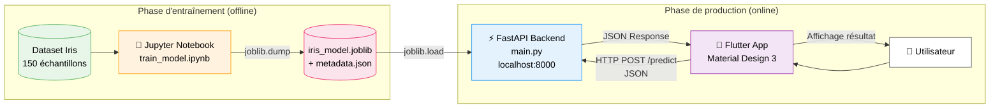

### Les deux phases distinctes

Notre architecture se divise en **deux phases** :

#### Phase 1 — Entraînement (offline)

Le Jupyter Notebook charge le dataset Iris, entraîne un modèle Random Forest, et **exporte** le modèle entraîné sous forme de fichier `.joblib`. Cette phase est exécutée une seule fois (ou à chaque re-entraînement).

#### Phase 2 — Production (online)

Le backend FastAPI **charge** le modèle exporté au démarrage, et expose des endpoints REST. Le frontend Flutter envoie les données de l'utilisateur via HTTP, reçoit la prédiction en JSON, et l'affiche dans une interface moderne.

### Les technologies et leur rôle

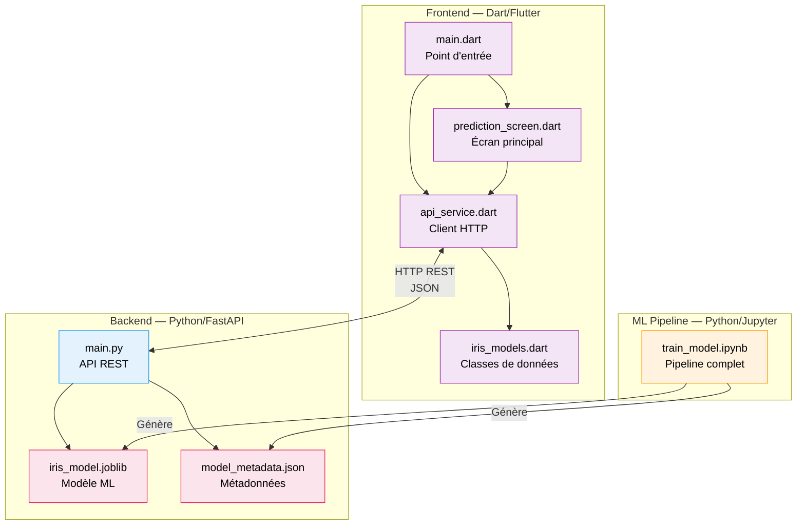

</details>

<p align="right"><a href="#top">↑ Retour en haut</a></p>

---

<a id="section-3"></a>

<details>
<summary><strong>3 — Le rôle du Notebook Jupyter</strong></summary>

### Qu'est-ce qu'un Jupyter Notebook ?

Un Jupyter Notebook (`.ipynb`) est un document interactif qui mélange :
- **Du code Python** exécutable cellule par cellule
- **Du texte Markdown** pour les explications
- **Des visualisations** (graphiques, tableaux)

C'est l'outil de prédilection des data scientists pour l'exploration et l'expérimentation.

### Le pipeline ML complet

Notre notebook `train_model.ipynb` suit un pipeline classique en 5 étapes :

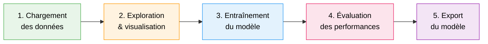

### Étape 1 — Chargement des données

Le dataset Iris est intégré directement dans scikit-learn :

```python
from sklearn.datasets import load_iris
import pandas as pd

iris = load_iris()
df = pd.DataFrame(data=iris.data, columns=iris.feature_names)
df['species'] = [iris.target_names[t] for t in iris.target]
```

Le dataset Iris contient **150 échantillons** répartis en **3 classes** :

| Espèce       | Nombre | Description                           |
|-------------|--------|---------------------------------------|
| **Setosa**      | 50     | Petits pétales, facilement séparable  |
| **Versicolor**  | 50     | Taille moyenne                        |
| **Virginica**   | 50     | Grands pétales                        |

Les **4 features** (caractéristiques mesurées) :

| Feature                | Min  | Max  | Moyenne | Unité |
|-----------------------|------|------|---------|-------|
| Longueur du sépale    | 4.3  | 7.9  | 5.84    | cm    |
| Largeur du sépale     | 2.0  | 4.4  | 3.06    | cm    |
| Longueur du pétale    | 1.0  | 6.9  | 3.76    | cm    |
| Largeur du pétale     | 0.1  | 2.5  | 1.20    | cm    |

### Étape 2 — Exploration et visualisation

L'exploration permet de comprendre les distributions et les corrélations :

```python
df.describe()
df.groupby('species').mean()
```

On observe que les **dimensions des pétales** sont les features les plus discriminantes entre les espèces, ce qui sera confirmé par l'importance des features après entraînement.

### Étape 3 — Entraînement du modèle

On utilise un **Random Forest Classifier** avec séparation train/test :

```python
from sklearn.model_selection import train_test_split
from sklearn.ensemble import RandomForestClassifier

X_train, X_test, y_train, y_test = train_test_split(
    iris.data, iris.target, test_size=0.2, random_state=42
)

model = RandomForestClassifier(n_estimators=100, max_depth=5, random_state=42)
model.fit(X_train, y_train)
```

| Paramètre       | Valeur | Signification                              |
|-----------------|--------|--------------------------------------------|
| `n_estimators`  | 100    | 100 arbres de décision dans la forêt       |
| `max_depth`     | 5      | Profondeur maximale de chaque arbre         |
| `test_size`     | 0.2    | 20% des données pour le test (30 échantillons) |
| `random_state`  | 42     | Graine aléatoire pour la reproductibilité   |

### Étape 4 — Évaluation des performances

```python
from sklearn.metrics import accuracy_score

y_pred = model.predict(X_test)
accuracy = accuracy_score(y_test, y_pred)
print(f"Accuracy: {accuracy:.2%}")  # 93.33%
```

L'importance de chaque feature dans la décision du modèle :

| Feature              | Importance |
|---------------------|------------|
| Largeur du pétale   | **43.8%**  |
| Longueur du pétale  | **43.2%**  |
| Longueur du sépale  | 11.6%      |
| Largeur du sépale   | 1.4%       |

Les pétales représentent **87% de l'importance** dans la décision — c'est la partie la plus discriminante de la fleur Iris.

### Étape 5 — Export du modèle

Le modèle est sérialisé avec `joblib` et les métadonnées sont sauvegardées en JSON :

```python
import joblib
import json

# Sauvegarder le modèle entraîné
joblib.dump(model, '../backend/models/iris_model.joblib')

# Sauvegarder les métadonnées
metadata = {
    "model_type": "RandomForestClassifier",
    "n_estimators": 100,
    "max_depth": 5,
    "accuracy": accuracy,
    "feature_names": list(iris.feature_names),
    "target_names": list(iris.target_names),
    "feature_importances": dict(zip(iris.feature_names,
                                     model.feature_importances_.tolist())),
    "training_samples": len(X_train),
    "test_samples": len(X_test)
}

with open('../backend/models/model_metadata.json', 'w') as f:
    json.dump(metadata, f, indent=2)
```

Le notebook exporte **deux fichiers** dans `backend/models/` :

| Fichier                  | Format  | Contenu                                    |
|--------------------------|---------|-------------------------------------------|
| `iris_model.joblib`      | Binaire | Le modèle Random Forest sérialisé          |
| `model_metadata.json`    | JSON    | Accuracy, features, importances, etc.      |

### Pourquoi `joblib` et pas `pickle` ?

`joblib` est optimisé pour les objets contenant de grands tableaux NumPy (comme les modèles scikit-learn). Il est plus rapide et produit des fichiers plus compacts que `pickle` pour ce cas d'usage.

</details>

<p align="right"><a href="#top">↑ Retour en haut</a></p>

---

<a id="section-4"></a>

<details>
<summary><strong>4 — Le rôle du Backend FastAPI</strong></summary>

### Qu'est-ce que FastAPI ?

FastAPI est un framework Python moderne pour construire des APIs REST. Ses avantages :

- **Rapide** : performances proches de Node.js et Go grâce à l'asynchrone (ASGI)
- **Validation automatique** : grâce à Pydantic, les données entrantes sont validées automatiquement
- **Documentation auto-générée** : Swagger UI disponible à `/docs`
- **Typage natif** : utilisation des type hints Python

### Architecture du backend

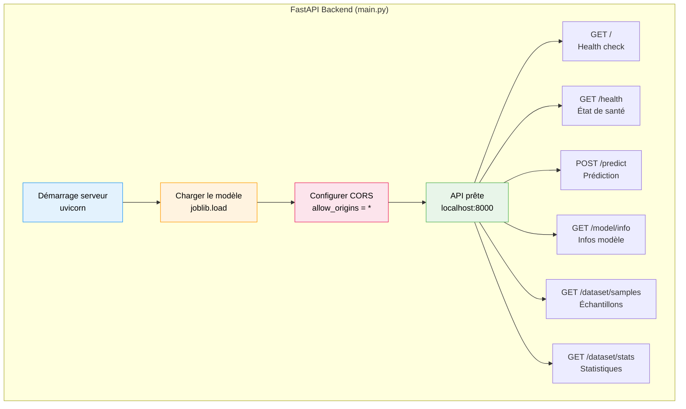

### Chargement du modèle au démarrage

Le modèle est chargé **une seule fois** au démarrage du serveur via l'événement `startup` :

```python
model = None
metadata = None

def load_model():
    global model, metadata
    model = joblib.load(MODEL_PATH)
    with open(METADATA_PATH, "r") as f:
        metadata = json.load(f)

@app.on_event("startup")
async def startup_event():
    load_model()
```

Le modèle reste en mémoire tant que le serveur tourne. Chaque requête de prédiction utilise le même objet `model` sans le recharger — ce qui rend les prédictions très rapides.

### Validation des données avec Pydantic

Pydantic valide automatiquement les données reçues :

```python
class PredictionRequest(BaseModel):
    sepal_length: float = Field(..., ge=0, le=10, description="Longueur du sépale (cm)")
    sepal_width: float  = Field(..., ge=0, le=10, description="Largeur du sépale (cm)")
    petal_length: float = Field(..., ge=0, le=10, description="Longueur du pétale (cm)")
    petal_width: float  = Field(..., ge=0, le=10, description="Largeur du pétale (cm)")
```

| Contrainte | Signification                                    |
|-----------|--------------------------------------------------|
| `...`     | Champ obligatoire (pas de valeur par défaut)      |
| `ge=0`    | Greater or Equal — valeur ≥ 0                     |
| `le=10`   | Less or Equal — valeur ≤ 10                       |
| `float`   | Le type doit être un nombre décimal               |

Si un utilisateur envoie `"sepal_length": "abc"`, FastAPI retourne automatiquement une erreur 422 avec un message explicatif.

### Les endpoints REST

#### `POST /predict` — L'endpoint principal

```python
@app.post("/predict", response_model=PredictionResponse)
async def predict(request: PredictionRequest):
    features = np.array([[
        request.sepal_length, request.sepal_width,
        request.petal_length, request.petal_width
    ]])

    prediction = model.predict(features)[0]
    probabilities = model.predict_proba(features)[0]

    target_names = metadata["target_names"]
    species = target_names[prediction]
    confidence = float(probabilities[prediction])

    prob_dict = {name: round(float(p), 4)
                 for name, p in zip(target_names, probabilities)}

    return PredictionResponse(
        species=species,
        confidence=round(confidence, 4),
        probabilities=prob_dict,
    )
```

**Exemple de requête :**

```json
{
  "sepal_length": 5.1,
  "sepal_width": 3.5,
  "petal_length": 1.4,
  "petal_width": 0.2
}
```

**Exemple de réponse :**

```json
{
  "species": "setosa",
  "confidence": 1.0,
  "probabilities": {
    "setosa": 1.0,
    "versicolor": 0.0,
    "virginica": 0.0
  }
}
```

#### Tableau récapitulatif des endpoints

| Méthode | Endpoint            | Description                        | Paramètres          |
|---------|--------------------|------------------------------------|---------------------|
| GET     | `/`                | Health check basique               | Aucun               |
| GET     | `/health`          | État de santé + statut du modèle   | Aucun               |
| POST    | `/predict`         | Prédire l'espèce d'une fleur      | 4 mesures (JSON)    |
| GET     | `/model/info`      | Informations sur le modèle         | Aucun               |
| GET     | `/dataset/samples` | 10 échantillons aléatoires         | Aucun               |
| GET     | `/dataset/stats`   | Statistiques du dataset            | Aucun               |

### Configuration CORS

Le middleware CORS permet au frontend (qui tourne sur un port différent) de communiquer avec le backend :

```python
app.add_middleware(
    CORSMiddleware,
    allow_origins=["*"],         # Accepte toutes les origines
    allow_credentials=True,
    allow_methods=["*"],         # Accepte toutes les méthodes HTTP
    allow_headers=["*"],         # Accepte tous les headers
)
```

> **Note** : `allow_origins=["*"]` est acceptable en développement, mais en production il faudrait restreindre aux domaines autorisés (ex: `["https://mon-app.com"]`).

### Lancement du serveur

```python
if __name__ == "__main__":
    import uvicorn
    uvicorn.run("main:app", host="0.0.0.0", port=8000, reload=True)
```

| Paramètre  | Valeur       | Signification                              |
|-----------|-------------|--------------------------------------------|
| `host`    | `0.0.0.0`  | Accessible depuis toutes les interfaces     |
| `port`    | `8000`      | Port d'écoute                               |
| `reload`  | `True`      | Rechargement automatique lors des modifications |

Documentation Swagger automatique : **http://localhost:8000/docs**

</details>

<p align="right"><a href="#top">↑ Retour en haut</a></p>

---

<a id="section-5"></a>

<details>
<summary><strong>5 — Le rôle du Frontend Flutter</strong></summary>

### Qu'est-ce que Flutter ?

Flutter est un framework de Google pour créer des interfaces multiplateformes (mobile, web, desktop) à partir d'un seul codebase en **Dart**. Dans notre projet, Flutter sert d'interface utilisateur pour interagir avec le modèle ML via l'API REST.

### Architecture du frontend

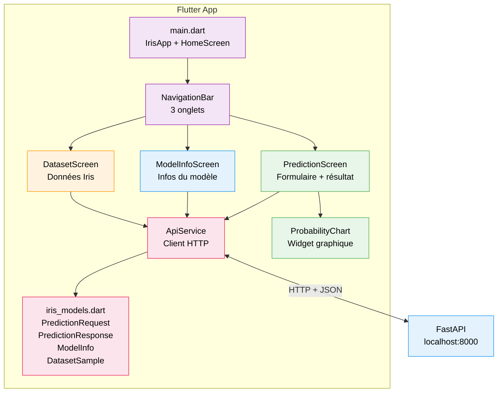

### Material Design 3

L'application utilise **Material Design 3** (Material You), le dernier système de design de Google :

```dart
theme: ThemeData(
  colorSchemeSeed: const Color(0xFF667eea),
  useMaterial3: true,
  brightness: Brightness.light,
),
```

La propriété `colorSchemeSeed` génère automatiquement une palette de couleurs harmonieuse à partir d'une couleur de base.

### Le service API (`api_service.dart`)

Ce fichier centralise toute la communication avec le backend :

```dart
class ApiService {
  static const String baseUrl = 'http://localhost:8000';

  Future<PredictionResponse> predict(PredictionRequest request) async {
    final response = await http.post(
      Uri.parse('$baseUrl/predict'),
      headers: {'Content-Type': 'application/json'},
      body: json.encode(request.toJson()),
    );

    if (response.statusCode == 200) {
      return PredictionResponse.fromJson(json.decode(response.body));
    } else {
      throw Exception('Erreur de prédiction: ${response.statusCode}');
    }
  }
}
```

| Méthode           | Endpoint            | Retour                     |
|-------------------|--------------------|-----------------------------|
| `healthCheck()`   | `GET /health`      | `bool`                      |
| `predict()`       | `POST /predict`    | `PredictionResponse`        |
| `getModelInfo()`  | `GET /model/info`  | `ModelInfo`                 |
| `getDatasetSamples()` | `GET /dataset/samples` | `List<DatasetSample>` |
| `getDatasetStats()` | `GET /dataset/stats` | `Map<String, dynamic>`   |

### Les modèles de données (`iris_models.dart`)

Les classes Dart correspondent aux schémas Pydantic du backend :

```dart
class PredictionRequest {
  final double sepalLength;
  final double sepalWidth;
  final double petalLength;
  final double petalWidth;

  Map<String, dynamic> toJson() => {
    'sepal_length': sepalLength,
    'sepal_width': sepalWidth,
    'petal_length': petalLength,
    'petal_width': petalWidth,
  };
}

class PredictionResponse {
  final String species;
  final double confidence;
  final Map<String, double> probabilities;

  factory PredictionResponse.fromJson(Map<String, dynamic> json) {
    return PredictionResponse(
      species: json['species'],
      confidence: (json['confidence'] as num).toDouble(),
      probabilities: (json['probabilities'] as Map<String, dynamic>)
          .map((k, v) => MapEntry(k, (v as num).toDouble())),
    );
  }
}
```

### Correspondance des modèles Dart ↔ Python

| Python (Pydantic)       | Dart                   | JSON                  |
|------------------------|------------------------|-----------------------|
| `sepal_length: float`  | `sepalLength: double`  | `"sepal_length": 5.1` |
| `species: str`         | `species: String`      | `"species": "setosa"` |
| `probabilities: dict`  | `Map<String, double>`  | `{"setosa": 1.0, …}`  |
| `confidence: float`    | `confidence: double`   | `"confidence": 1.0`   |

> **Convention** : Python utilise le `snake_case`, Dart utilise le `camelCase`. La conversion se fait dans les méthodes `toJson()` et `fromJson()`.

### L'écran de prédiction

L'écran principal permet à l'utilisateur de :
1. Ajuster 4 sliders pour les mesures de la fleur
2. Appuyer sur "Prédire l'espèce"
3. Voir le résultat avec l'espèce, le niveau de confiance, et un graphique des probabilités

Chaque espèce a sa propre couleur et son emoji :

| Espèce       | Couleur | Emoji |
|-------------|---------|-------|
| Setosa      | Vert    | 🌸    |
| Versicolor  | Bleu    | 🌺    |
| Virginica   | Violet  | 🌷    |

### Indicateur de connexion API

La barre d'application affiche en temps réel l'état de la connexion au backend :

```
✅ API connectée      → Le backend répond correctement
❌ API hors ligne     → Le backend n'est pas accessible
```

Ce statut est vérifié au démarrage via `GET /health`.

</details>

<p align="right"><a href="#top">↑ Retour en haut</a></p>

---

<a id="section-6"></a>

<details>
<summary><strong>6 — Structure du projet</strong></summary>

### Arborescence complète

```
full-app-pandas/
├── venv/                              # Environnement virtuel Python (partagé)
├── requirements.txt                   # Dépendances Python (backend + notebook)
├── .gitignore                         # Fichiers exclus du versioning
├── README.md                          # Documentation du projet
│
├── notebook/                          # 🔬 Pipeline Machine Learning
│   └── train_model.ipynb              #    Notebook d'entraînement complet
│
├── backend/                           # ⚡ API REST FastAPI
│   ├── main.py                        #    Point d'entrée de l'API
│   └── models/                        #    Artefacts du modèle ML
│       ├── iris_model.joblib          #    Modèle sérialisé (généré par le notebook)
│       └── model_metadata.json        #    Métadonnées (accuracy, features, etc.)
│
├── frontend/                          # 📱 Application Flutter
│   ├── pubspec.yaml                   #    Dépendances Dart/Flutter
│   └── lib/                           #    Code source Dart
│       ├── main.dart                  #    Point d'entrée + navigation
│       ├── models/                    #    Classes de données
│       │   └── iris_models.dart       #    PredictionRequest, PredictionResponse, etc.
│       ├── services/                  #    Couche réseau
│       │   └── api_service.dart       #    Client HTTP centralisé
│       ├── screens/                   #    Écrans de l'application
│       │   ├── prediction_screen.dart #    Formulaire de prédiction
│       │   ├── model_info_screen.dart #    Informations sur le modèle
│       │   └── dataset_screen.dart    #    Exploration du dataset
│       └── widgets/                   #    Widgets réutilisables
│           └── probability_chart.dart #    Graphique des probabilités
│
└── cours/                             # 📚 Documentation et cours
    └── 00-Architecture-Application-Full-Stack.md
```

### Rôle de chaque dossier

| Dossier      | Langage | Rôle                                    | Quand l'exécuter ?               |
|-------------|---------|------------------------------------------|----------------------------------|
| `notebook/` | Python  | Entraîner et exporter le modèle ML       | Une fois (ou pour re-entraîner)  |
| `backend/`  | Python  | Servir le modèle via API REST            | À chaque utilisation             |
| `frontend/` | Dart    | Interface utilisateur                     | À chaque utilisation             |
| `cours/`    | —       | Documentation pédagogique                 | Référence                        |

### Rôle de chaque fichier clé

| Fichier                    | Lignes | Description                                        |
|---------------------------|--------|----------------------------------------------------|
| `main.py`                 | ~195   | API FastAPI avec 6 endpoints                       |
| `main.dart`               | ~118   | App Flutter avec navigation 3 onglets              |
| `api_service.dart`        | ~65    | Client HTTP pour communiquer avec FastAPI           |
| `iris_models.dart`        | ~101   | 4 classes de données (Request, Response, etc.)      |
| `prediction_screen.dart`  | ~312   | Formulaire avec sliders + affichage résultat        |
| `model_metadata.json`     | ~25    | Accuracy, features, importances du modèle           |
| `requirements.txt`        | ~15    | Toutes les dépendances Python du projet             |

### Le lien entre le notebook et le backend

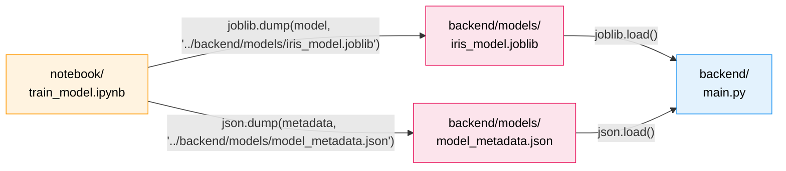

Le notebook utilise des **chemins relatifs** (`../backend/models/`) pour écrire directement dans le dossier du backend. C'est ce qui crée le **pont** entre la phase d'entraînement et la phase de production.

</details>

<p align="right"><a href="#top">↑ Retour en haut</a></p>

---

<a id="section-7"></a>

<details>
<summary><strong>7 — Flux de données de bout en bout</strong></summary>

### Diagramme de séquence complet

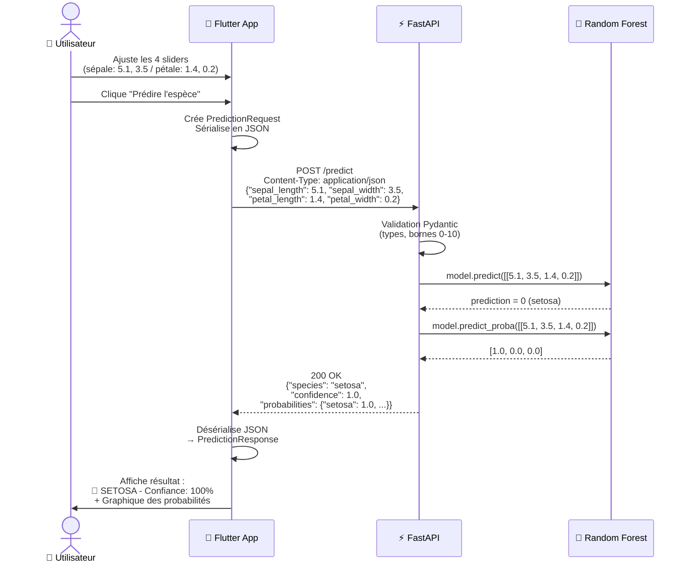

### Détail étape par étape

#### 1. L'utilisateur saisit les valeurs

L'utilisateur ajuste les 4 sliders dans l'interface Flutter :

| Slider                  | Valeur | Plage     |
|------------------------|--------|-----------|
| Longueur sépale (cm)   | 5.1    | 4.0 – 8.0 |
| Largeur sépale (cm)    | 3.5    | 2.0 – 4.5 |
| Longueur pétale (cm)   | 1.4    | 1.0 – 7.0 |
| Largeur pétale (cm)    | 0.2    | 0.1 – 2.5 |

#### 2. Flutter construit la requête

```dart
final request = PredictionRequest(
  sepalLength: 5.1,
  sepalWidth: 3.5,
  petalLength: 1.4,
  petalWidth: 0.2,
);

// Sérialisation en JSON
final body = json.encode(request.toJson());
// → {"sepal_length": 5.1, "sepal_width": 3.5, "petal_length": 1.4, "petal_width": 0.2}
```

#### 3. Requête HTTP envoyée

```
POST http://localhost:8000/predict
Content-Type: application/json

{"sepal_length": 5.1, "sepal_width": 3.5, "petal_length": 1.4, "petal_width": 0.2}
```

#### 4. FastAPI valide et prédit

```python
# Validation automatique par Pydantic ✓
# Conversion en array NumPy
features = np.array([[5.1, 3.5, 1.4, 0.2]])

# Prédiction
prediction = model.predict(features)[0]        # → 0 (index de "setosa")
probabilities = model.predict_proba(features)[0] # → [1.0, 0.0, 0.0]
```

#### 5. Réponse JSON renvoyée

```json
{
  "species": "setosa",
  "confidence": 1.0,
  "probabilities": {
    "setosa": 1.0,
    "versicolor": 0.0,
    "virginica": 0.0
  }
}
```

#### 6. Flutter affiche le résultat

Le `PredictionResponse` est désérialisé et affiché avec :
- L'emoji et la couleur de l'espèce
- Le pourcentage de confiance
- Un graphique des probabilités pour les 3 espèces

### Temps de réponse typique

| Étape                              | Temps approximatif |
|------------------------------------|--------------------|
| Sérialisation JSON (Flutter)       | < 1 ms             |
| Requête HTTP (localhost)           | ~ 1-5 ms           |
| Validation Pydantic (FastAPI)      | < 1 ms             |
| Prédiction du modèle (scikit-learn)| < 1 ms             |
| Désérialisation JSON (Flutter)     | < 1 ms             |
| **Total**                          | **< 10 ms**        |

</details>

<p align="right"><a href="#top">↑ Retour en haut</a></p>

---

<a id="section-8"></a>

<details>
<summary><strong>8 — Communication Frontend ↔ Backend</strong></summary>

### Le protocole HTTP REST

La communication entre Flutter et FastAPI repose sur le protocole **HTTP** avec une architecture **REST** (Representational State Transfer).

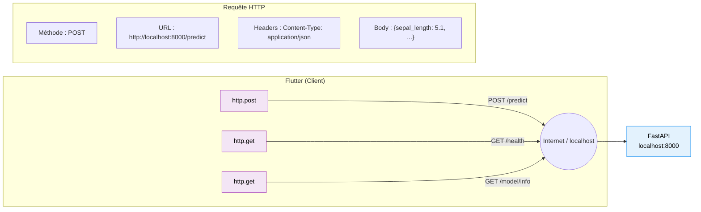

### Le format JSON

**JSON** (JavaScript Object Notation) est le format d'échange de données entre le frontend et le backend. C'est un format texte, lisible par l'humain et facilement parsable par les machines.

Exemple de flux complet :

```
Dart Object                  →  JSON String                    →  Python Object
─────────────────────────────────────────────────────────────────────────────────
PredictionRequest(            →  {"sepal_length": 5.1,          →  PredictionRequest(
  sepalLength: 5.1,                "sepal_width": 3.5,               sepal_length=5.1,
  sepalWidth: 3.5,                 "petal_length": 1.4,              sepal_width=3.5,
  petalLength: 1.4,                "petal_width": 0.2}               petal_length=1.4,
  petalWidth: 0.2)                                                    petal_width=0.2)
```

### Le problème CORS et sa solution

#### Qu'est-ce que CORS ?

**CORS** (Cross-Origin Resource Sharing) est une politique de sécurité des navigateurs web. Par défaut, un navigateur **bloque** les requêtes vers un domaine différent de celui de la page.

#### Le problème dans notre cas

```
Flutter Web (http://localhost:XXXX)  →  FastAPI (http://localhost:8000)
                                         ❌ BLOQUÉ par le navigateur !
                                         (origines différentes = ports différents)
```

#### La solution : middleware CORS

```python
app.add_middleware(
    CORSMiddleware,
    allow_origins=["*"],
    allow_credentials=True,
    allow_methods=["*"],
    allow_headers=["*"],
)
```

Le serveur FastAPI renvoie des **headers CORS** qui indiquent au navigateur : "J'autorise cette origine à me contacter."

```
HTTP/1.1 200 OK
access-control-allow-origin: *
access-control-allow-methods: *
access-control-allow-headers: *
content-type: application/json
```

#### Sécurité en production

| Environnement  | Configuration CORS recommandée                      |
|----------------|-----------------------------------------------------|
| Développement  | `allow_origins=["*"]` (tout accepter)               |
| Production     | `allow_origins=["https://mon-app.com"]` (restrictif)|

### Les codes de statut HTTP utilisés

| Code | Signification           | Quand ?                                  |
|------|------------------------|------------------------------------------|
| 200  | OK                     | Requête réussie                          |
| 422  | Unprocessable Entity   | Données invalides (validation Pydantic)  |
| 503  | Service Unavailable    | Le modèle n'est pas chargé               |

### Gestion des erreurs

Côté **FastAPI** (Python) :

```python
if model is None:
    raise HTTPException(status_code=503, detail="Le modèle n'est pas chargé")
```

Côté **Flutter** (Dart) :

```dart
if (response.statusCode == 200) {
  return PredictionResponse.fromJson(json.decode(response.body));
} else {
  throw Exception('Erreur de prédiction: ${response.statusCode}');
}
```

Le frontend affiche un message d'erreur rouge si la requête échoue, permettant à l'utilisateur de comprendre le problème.

### Résumé de la communication

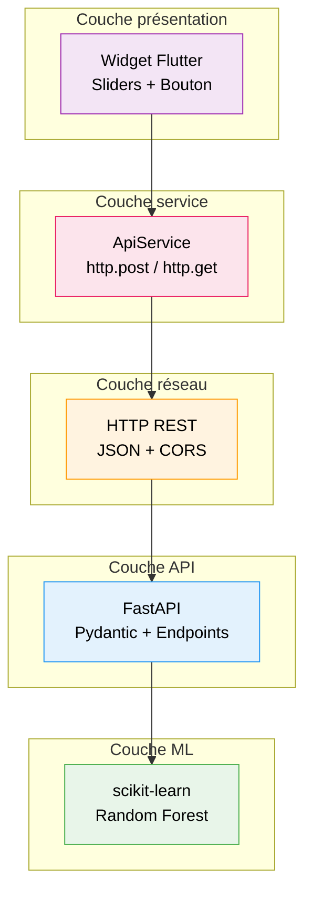

</details>

<p align="right"><a href="#top">↑ Retour en haut</a></p>

---

<a id="section-9"></a>

<details>
<summary><strong>9 — L'environnement virtuel Python — Pourquoi et comment</strong></summary>

### Le problème sans environnement virtuel

Sans `venv`, toutes les bibliothèques Python sont installées **globalement** sur votre système. Cela crée des conflits :

```
Projet A : scikit-learn==1.3.0
Projet B : scikit-learn==1.5.2    ← ❌ Conflit ! Lequel installer ?
```

### La solution : `venv`

Un environnement virtuel crée un **dossier isolé** contenant sa propre copie de Python et ses propres packages. Chaque projet a son propre "monde" Python.

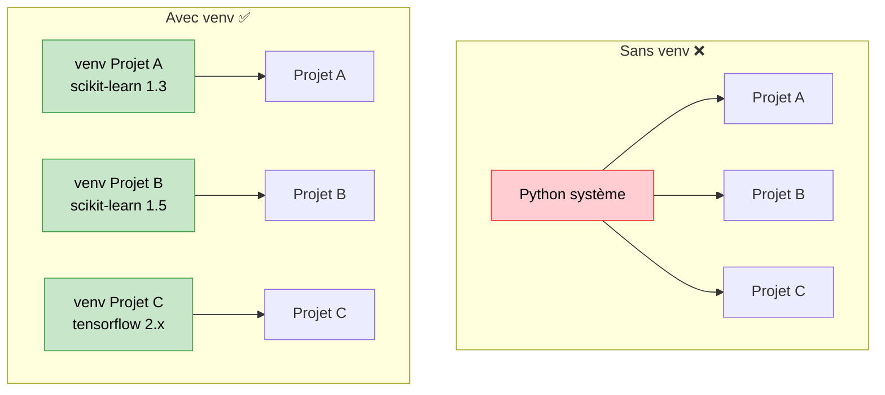

### Pourquoi le `venv` est à la racine du projet ?

Dans notre projet, le `venv` est **partagé** entre le notebook et le backend :

```
full-app-pandas/
├── venv/                    ← Un seul venv pour tout le projet Python
├── requirements.txt         ← Un seul fichier de dépendances
├── notebook/                ← Utilise le venv
│   └── train_model.ipynb
├── backend/                 ← Utilise le même venv
│   └── main.py
└── frontend/                ← N'utilise PAS le venv (c'est du Dart)
```

**Pourquoi ce choix ?**

1. **Cohérence** : le notebook et le backend utilisent les mêmes versions de scikit-learn, NumPy, etc.
2. **Simplicité** : un seul `requirements.txt` à maintenir
3. **Compatibilité modèle** : le modèle exporté par le notebook (scikit-learn 1.5.2) est garanti compatible avec le backend (même version)

### Commandes essentielles

#### Créer le venv

```bash
python -m venv venv
```

#### Activer le venv

```bash
# Windows (PowerShell)
.\venv\Scripts\Activate.ps1

# Windows (CMD)
.\venv\Scripts\activate.bat

# Linux / macOS
source venv/bin/activate
```

Quand le venv est actif, votre prompt affiche `(venv)` :

```
(venv) PS C:\Users\...\full-app-pandas>
```

#### Installer les dépendances

```bash
pip install -r requirements.txt
```

#### Contenu du `requirements.txt`

```
# Backend (FastAPI)
fastapi==0.115.0
uvicorn==0.30.6
pydantic==2.9.2
python-multipart==0.0.12

# Machine Learning
scikit-learn==1.5.2
pandas==2.2.3
numpy==1.26.4
joblib==1.4.2

# Jupyter Notebook
jupyter==1.1.1
```

| Catégorie      | Packages                              | Utilisé par       |
|---------------|---------------------------------------|-------------------|
| Backend       | fastapi, uvicorn, pydantic            | `backend/main.py` |
| ML            | scikit-learn, pandas, numpy, joblib   | notebook + backend |
| Notebook      | jupyter                               | `notebook/`        |

#### Désactiver le venv

```bash
deactivate
```

### Le `.gitignore` et le venv

Le dossier `venv/` ne doit **jamais** être commité dans Git (il peut peser plusieurs centaines de Mo). Il est listé dans le `.gitignore` :

```
venv/
```

Pour recréer l'environnement sur un autre poste, il suffit de :

```bash
python -m venv venv
.\venv\Scripts\Activate.ps1    # ou source venv/bin/activate
pip install -r requirements.txt
```

Le `requirements.txt` garantit que les **mêmes versions** seront installées partout.

</details>

<p align="right"><a href="#top">↑ Retour en haut</a></p>

---

<a id="section-10"></a>

<details>
<summary><strong>10 — Déploiement et perspectives</strong></summary>

### Architecture actuelle (développement)

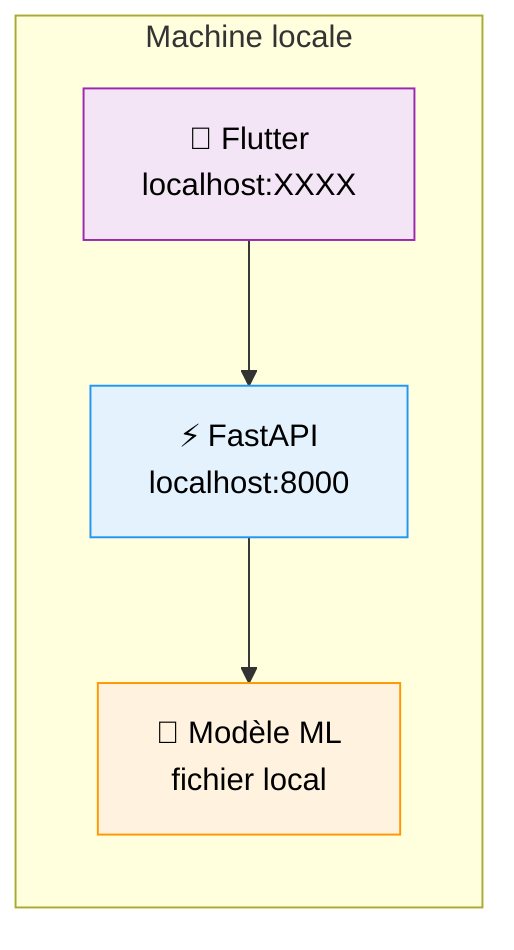

En développement, tout tourne en local. C'est rapide à mettre en place mais ne permet pas l'accès externe.

### Architecture cible (production)

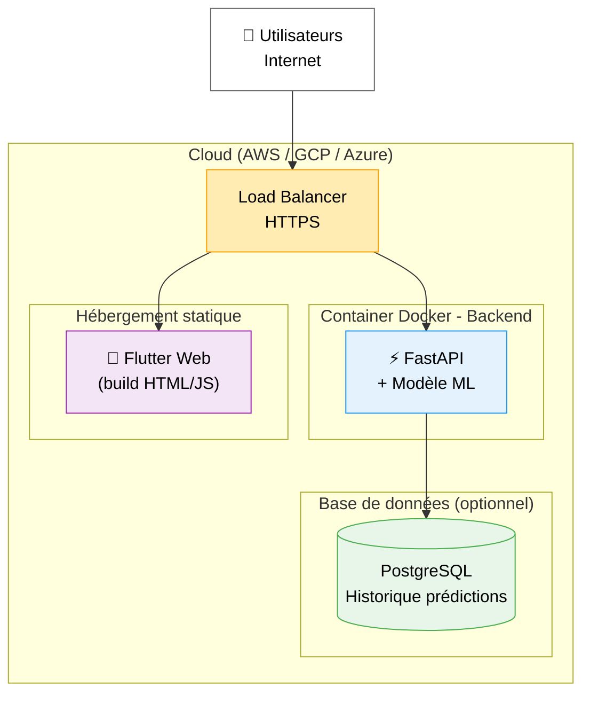

### Étape 1 — Containeriser avec Docker

#### Dockerfile pour le backend

```dockerfile
FROM python:3.11-slim

WORKDIR /app

COPY requirements.txt .
RUN pip install --no-cache-dir -r requirements.txt

COPY backend/ ./backend/

WORKDIR /app/backend
CMD ["uvicorn", "main:app", "--host", "0.0.0.0", "--port", "8000"]
```

#### docker-compose.yml

```yaml
version: "3.8"
services:
  backend:
    build: .
    ports:
      - "8000:8000"
    environment:
      - MODEL_PATH=/app/backend/models/iris_model.joblib

  frontend:
    build:
      context: ./frontend
    ports:
      - "80:80"
```

### Étape 2 — Construire le frontend Flutter pour le web

```bash
cd frontend
flutter build web --release
```

Le résultat est un ensemble de fichiers statiques (HTML, CSS, JS) dans `frontend/build/web/` qui peuvent être servis par n'importe quel serveur web (Nginx, Apache, CDN).

### Étape 3 — Déployer sur le cloud

| Service cloud          | Backend FastAPI         | Frontend Flutter       |
|------------------------|------------------------|------------------------|
| **AWS**                | ECS / Lambda           | S3 + CloudFront        |
| **Google Cloud**       | Cloud Run              | Firebase Hosting       |
| **Azure**              | Container Apps         | Static Web Apps        |
| **Alternatives simples** | Railway, Render     | Vercel, Netlify        |

### Améliorations possibles

| Amélioration                    | Difficulté | Bénéfice                               |
|--------------------------------|-----------|----------------------------------------|
| Ajouter une base de données    | Moyenne   | Historique des prédictions              |
| Authentification utilisateur   | Moyenne   | Sécuriser l'accès à l'API              |
| Pipeline CI/CD                 | Moyenne   | Déploiement automatique                |
| Monitoring (Prometheus/Grafana)| Avancée   | Surveiller les performances             |
| A/B testing de modèles         | Avancée   | Comparer plusieurs modèles en production|
| Re-entraînement automatique    | Avancée   | Mise à jour du modèle avec nouvelles données |
| Tests automatisés              | Moyenne   | Garantir la stabilité à chaque changement |

### Pipeline MLOps idéal

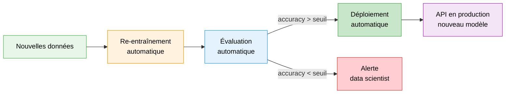

</details>

<p align="right"><a href="#top">↑ Retour en haut</a></p>

---

<a id="section-11"></a>

<details>
<summary><strong>11 — Conclusion et résumé</strong></summary>

### Ce que nous avons appris

Ce cours a présenté l'architecture complète d'une application Full-Stack ML, de l'entraînement du modèle jusqu'à l'interface utilisateur.

### Résumé de l'architecture en une image

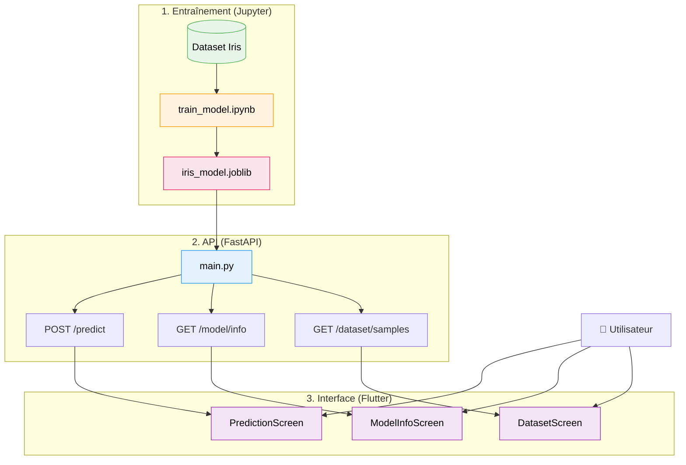

### Les points clés à retenir

| #  | Point clé                                                                 |
|----|---------------------------------------------------------------------------|
| 1  | **Séparation des responsabilités** : notebook, backend et frontend sont indépendants |
| 2  | **Le notebook entraîne**, le backend **sert**, le frontend **affiche**    |
| 3  | **joblib** sérialise le modèle, **JSON** transporte les données           |
| 4  | **FastAPI** valide automatiquement les données grâce à **Pydantic**       |
| 5  | **Flutter** consomme l'API REST via le package `http` et le format JSON   |
| 6  | **CORS** autorise la communication entre origines différentes             |
| 7  | Un seul **venv** partagé assure la cohérence des versions Python          |
| 8  | **Docker** permet de containeriser et déployer l'application              |
| 9  | L'architecture est **extensible** : nouvelles features, nouveaux modèles  |
| 10 | Le passage en production nécessite HTTPS, CORS restrictif et monitoring   |

### Stack technique complète

| Composant          | Technologie               | Version  |
|-------------------|---------------------------|----------|
| Langage ML        | Python                    | 3.9+     |
| Framework ML      | scikit-learn              | 1.5.2    |
| Manipulation données | pandas                 | 2.2.3    |
| Calcul numérique  | NumPy                     | 1.26.4   |
| Sérialisation     | joblib                    | 1.4.2    |
| Framework API     | FastAPI                   | 0.115.0  |
| Serveur ASGI      | Uvicorn                   | 0.30.6   |
| Validation        | Pydantic                  | 2.9.2    |
| Notebook          | Jupyter                   | 1.1.1    |
| Framework UI      | Flutter                   | 3.x+     |
| Langage UI        | Dart                      | —        |
| Design System     | Material Design 3         | —        |
| Dataset           | Iris (scikit-learn)       | 150 échantillons |
| Modèle ML         | Random Forest Classifier  | 100 arbres |
| Accuracy          | 93.33%                    | —        |

### Commandes pour lancer le projet complet

```bash
# 1. Créer et activer le venv (une seule fois)
python -m venv venv
.\venv\Scripts\Activate.ps1          # Windows PowerShell

# 2. Installer les dépendances (une seule fois)
pip install -r requirements.txt

# 3. (Optionnel) Entraîner le modèle
cd notebook && jupyter notebook train_model.ipynb

# 4. Lancer le backend (Terminal 1)
cd backend && python main.py         # → http://localhost:8000

# 5. Lancer le frontend (Terminal 2)
cd frontend && flutter run -d chrome  # → Flutter Web
```

</details>

<p align="right"><a href="#top">↑ Retour en haut</a></p>

---

> **Fin du cours** — Architecture d'une Application Full-Stack ML  
> Flutter + FastAPI + Jupyter Notebook
