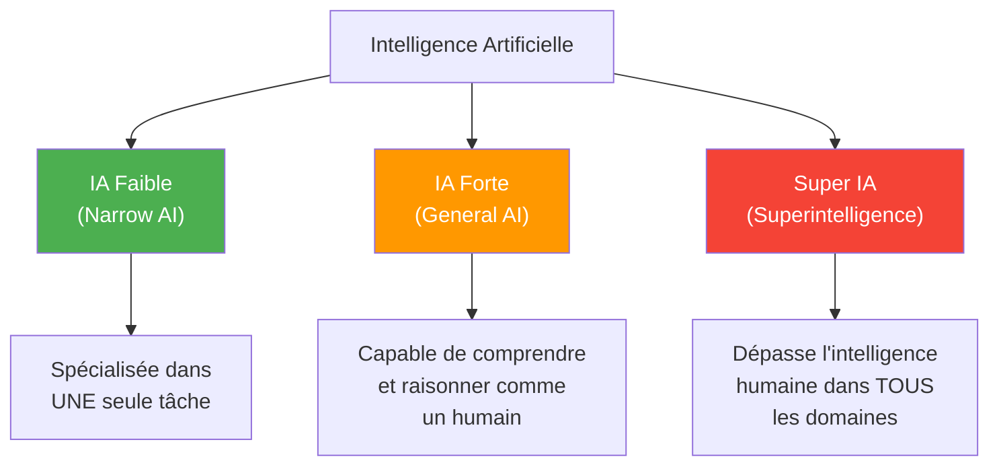
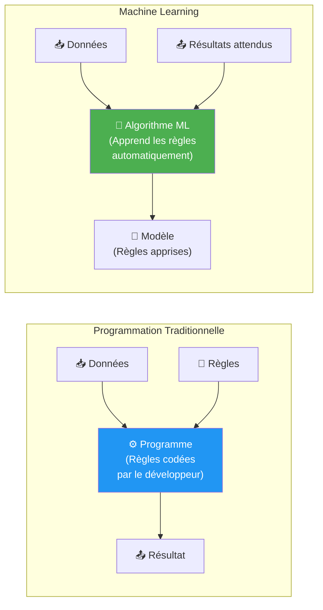
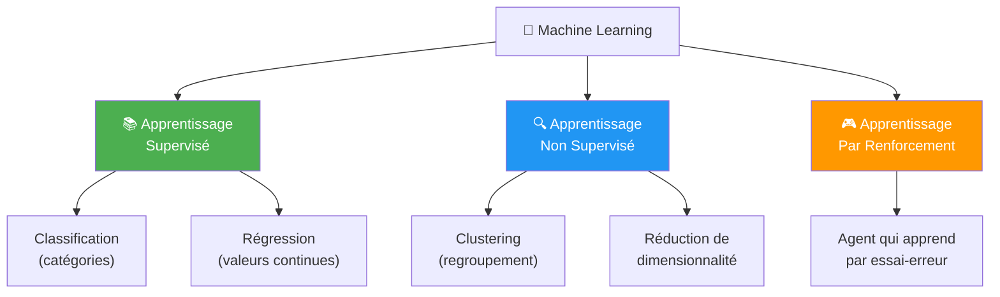
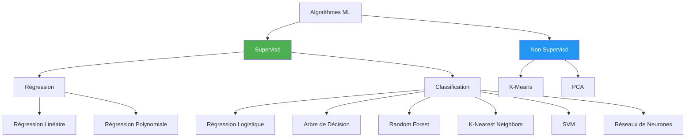
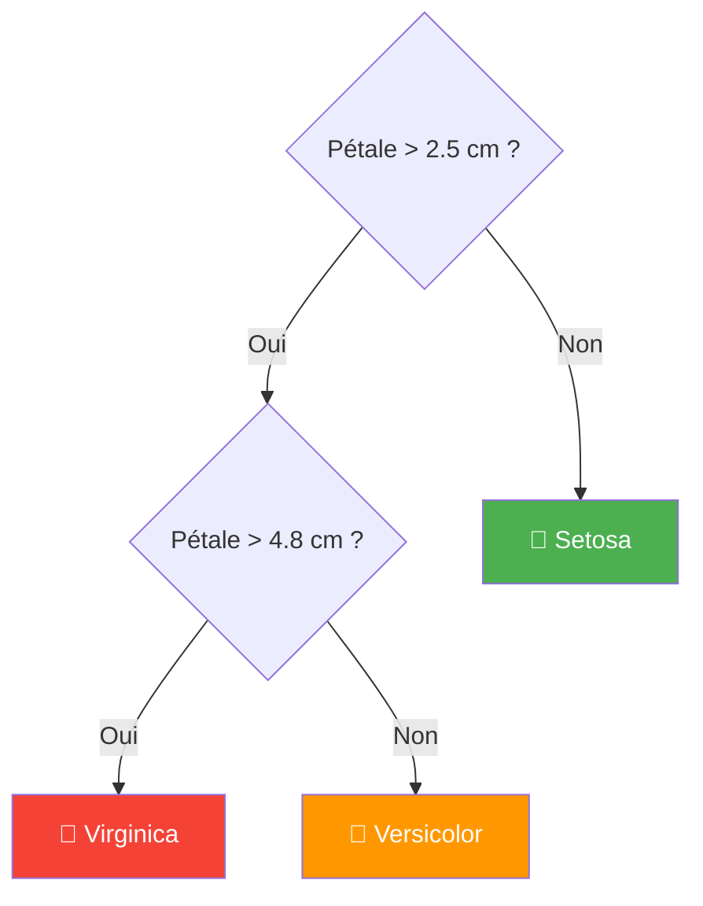
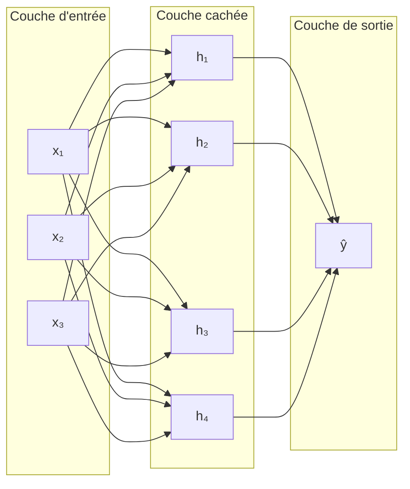
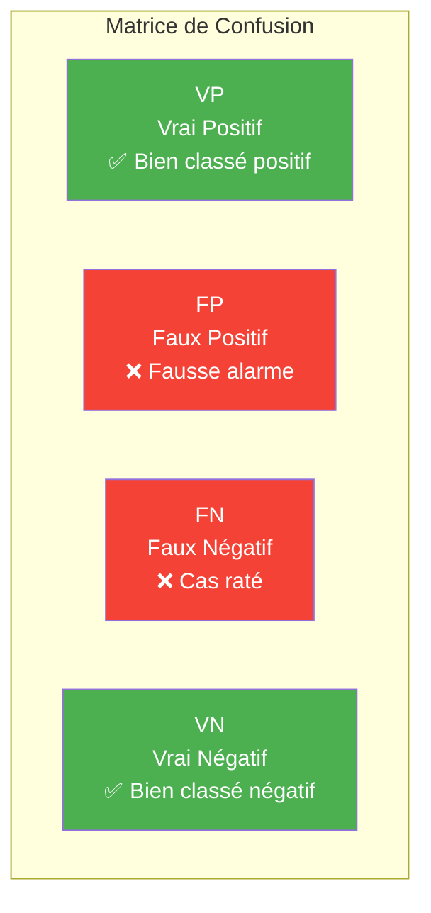
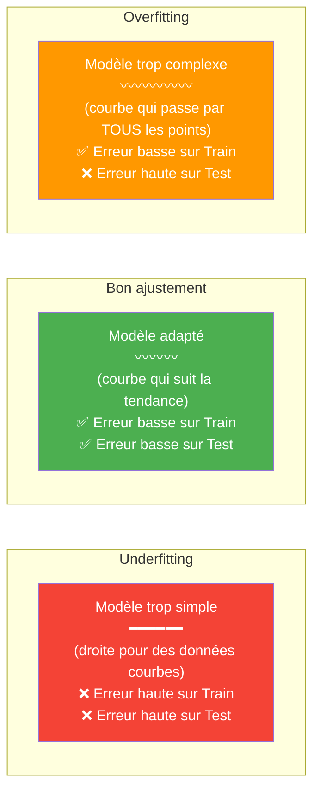
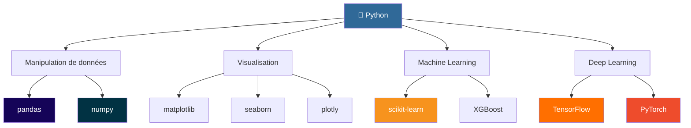
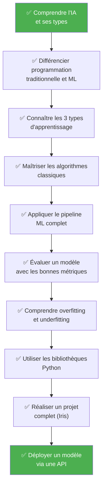

<a id="top"></a>

# Introduction à l'Intelligence Artificielle et au Machine Learning — De A à Z

> **Objectif** : Ce cours vous accompagne pas à pas dans la découverte de l'IA et du Machine Learning, depuis les concepts fondamentaux jusqu'au déploiement d'un modèle. Aucun prérequis avancé n'est nécessaire — juste de la curiosité.

---

## Table des matières

| N°  | Section | Lien |
|:---:|---------|:----:|
| 1   | Qu'est-ce que l'Intelligence Artificielle ? | [Aller →](#section-1) |
| 2   | Qu'est-ce que le Machine Learning ? | [Aller →](#section-2) |
| 3   | Les types d'apprentissage | [Aller →](#section-3) |
| 4   | Les algorithmes classiques du ML | [Aller →](#section-4) |
| 5   | Le pipeline Machine Learning de A à Z | [Aller →](#section-5) |
| 6   | Les métriques d'évaluation | [Aller →](#section-6) |
| 7   | Overfitting vs Underfitting | [Aller →](#section-7) |
| 8   | Les bibliothèques Python pour le ML | [Aller →](#section-8) |
| 9   | Exemple concret : Classification Iris | [Aller →](#section-9) |
| 10  | Du modèle au déploiement | [Aller →](#section-10) |
| 11  | Glossaire des termes ML | [Aller →](#section-11) |
| 12  | Conclusion et prochaines étapes | [Aller →](#section-12) |

---

<a id="section-1"></a>

<details>
<summary><strong>1 — Qu'est-ce que l'Intelligence Artificielle ?</strong></summary>

### 1.1 Définition

L'**Intelligence Artificielle (IA)** est un domaine de l'informatique qui vise à créer des systèmes capables de réaliser des tâches qui nécessitent normalement l'intelligence humaine : comprendre le langage, reconnaître des images, prendre des décisions, jouer à des jeux, etc.

> 💡 En résumé : l'IA permet aux machines d'**imiter** des capacités cognitives humaines.

### 1.2 Brève histoire de l'IA

| Année | Événement clé |
|-------|--------------|
| 1950  | Alan Turing publie *« Computing Machinery and Intelligence »* et propose le **Test de Turing** |
| 1956  | Conférence de Dartmouth — le terme **« Intelligence Artificielle »** est officiellement inventé |
| 1966  | **ELIZA**, le premier chatbot, est créé au MIT |
| 1997  | **Deep Blue** (IBM) bat le champion du monde d'échecs Garry Kasparov |
| 2011  | **Watson** (IBM) gagne au jeu télévisé Jeopardy! |
| 2012  | **AlexNet** révolutionne la vision par ordinateur (deep learning) |
| 2016  | **AlphaGo** (DeepMind) bat le champion du monde de Go |
| 2022  | **ChatGPT** (OpenAI) popularise les grands modèles de langage (LLM) |

### 1.3 Les types d'IA



| Type | Description | Existe aujourd'hui ? | Exemple |
|------|------------|:-------------------:|---------|
| **IA Faible** (Narrow AI) | Excellente dans une seule tâche précise | ✅ Oui | Siri, reconnaissance faciale, filtres anti-spam |
| **IA Forte** (General AI) | Capable de raisonner comme un humain sur n'importe quel sujet | ❌ Non (recherche active) | — |
| **Super IA** | Dépasse les capacités humaines dans tous les domaines | ❌ Non (théorique) | — |

### 1.4 L'IA dans la vie quotidienne

Vous utilisez l'IA sans même vous en rendre compte :

- **Netflix / YouTube** → Recommandation de contenu
- **Google Maps** → Estimation du trafic et itinéraire optimal
- **Smartphones** → Reconnaissance faciale, assistant vocal
- **Email** → Filtre anti-spam, suggestions de réponses
- **Banque** → Détection de fraude en temps réel
- **Médecine** → Aide au diagnostic (imagerie médicale)
- **Voitures** → Pilotage automatique (Tesla Autopilot)

</details>

<p align="right"><a href="#top">↑ Retour en haut</a></p>

---

<a id="section-2"></a>

<details>
<summary><strong>2 — Qu'est-ce que le Machine Learning ?</strong></summary>

### 2.1 Définition

Le **Machine Learning (ML)**, ou **apprentissage automatique**, est une branche de l'IA qui permet aux machines d'**apprendre à partir de données** sans être explicitement programmées pour chaque situation.

> « Un programme informatique apprend de l'expérience **E** par rapport à une tâche **T** et une mesure de performance **P**, si sa performance sur **T**, mesurée par **P**, s'améliore avec l'expérience **E**. »
> — *Tom Mitchell, 1997*

### 2.2 Programmation traditionnelle vs Machine Learning

C'est la différence fondamentale à comprendre :



| Aspect | Programmation traditionnelle | Machine Learning |
|--------|------------------------------|-----------------|
| **Entrées** | Données + Règles | Données + Résultats attendus |
| **Sortie** | Résultat | Règles (modèle) |
| **Qui écrit les règles ?** | Le développeur | L'algorithme les découvre |
| **Exemple** | `if température > 30: print("chaud")` | Le modèle apprend seul à classifier chaud/froid |

### 2.3 Exemple concret

**Problème** : Détecter si un email est un spam ou non.

| Approche | Comment ça marche |
|----------|-------------------|
| **Traditionnelle** | Le développeur écrit des règles : *si l'email contient "gagné" ET "cliquez ici" → spam* |
| **Machine Learning** | On donne au modèle **des milliers d'emails** étiquetés (spam / pas spam) et il apprend **seul** les patterns |

L'avantage du ML : il peut détecter des patterns que le développeur n'aurait jamais imaginés, et il s'**améliore** avec plus de données.

### 2.4 Quand utiliser le ML ?

Le Machine Learning est pertinent quand :

1. La tâche est **trop complexe** pour écrire des règles manuelles (ex. : reconnaissance d'images)
2. Les règles **changent fréquemment** (ex. : détection de fraude)
3. Il y a **beaucoup de données** disponibles
4. On veut des **prédictions** sur des données jamais vues

</details>

<p align="right"><a href="#top">↑ Retour en haut</a></p>

---

<a id="section-3"></a>

<details>
<summary><strong>3 — Les types d'apprentissage</strong></summary>

### 3.1 Vue d'ensemble



### 3.2 Apprentissage supervisé

On fournit au modèle des **données étiquetées** (chaque entrée a une réponse connue). Le modèle apprend la correspondance entre les entrées et les sorties.

**Analogie** : Un élève apprend avec un professeur qui lui donne les réponses (labels) pour qu'il puisse vérifier ses réponses.

#### Classification

Le modèle prédit une **catégorie**.

- Email → **spam** ou **pas spam**
- Image → **chat** ou **chien**
- Patient → **malade** ou **sain**

#### Régression

Le modèle prédit une **valeur numérique continue**.

- Maison → **prix** (250 000 €)
- Étudiant → **note** (15.5/20)
- Ville → **température** demain (22.3°C)

### 3.3 Apprentissage non supervisé

On fournit des **données sans étiquettes**. Le modèle cherche des **structures cachées** dans les données.

**Analogie** : On donne à un enfant un tas de pièces de monnaie mélangées. Sans qu'on lui dise quoi que ce soit, il va naturellement les trier par couleur, taille ou forme.

**Exemples** :
- **Segmentation clients** : regrouper des clients par comportement d'achat similaire
- **Détection d'anomalies** : trouver des transactions bancaires suspectes
- **Compression de données** : réduire la complexité d'un jeu de données

### 3.4 Apprentissage par renforcement

Un **agent** interagit avec un **environnement**. Il reçoit des **récompenses** (positives ou négatives) selon ses actions et apprend à maximiser sa récompense totale.

**Analogie** : Apprendre à un chien à s'asseoir en lui donnant des friandises quand il réussit.


**Exemples** :
- **AlphaGo** : apprend à jouer au Go en jouant des millions de parties
- **Robots** : apprennent à marcher par essai-erreur
- **Voitures autonomes** : apprennent à conduire en simulation

### 3.5 Tableau comparatif

| Critère | Supervisé | Non supervisé | Par renforcement |
|---------|-----------|---------------|-----------------|
| **Données** | Étiquetées | Non étiquetées | Interactions avec l'environnement |
| **Objectif** | Prédire un label/valeur | Trouver des structures | Maximiser une récompense |
| **Exemples d'algos** | Régression, SVM, Random Forest | K-Means, PCA, DBSCAN | Q-Learning, Policy Gradient |
| **Cas d'usage** | Prédiction de prix, classification d'images | Segmentation clients, détection d'anomalies | Jeux, robotique, conduite autonome |
| **Feedback** | Direct (label connu) | Aucun | Récompense différée |
| **Difficulté** | ⭐⭐ Modérée | ⭐⭐⭐ Difficile | ⭐⭐⭐⭐ Très difficile |

</details>

<p align="right"><a href="#top">↑ Retour en haut</a></p>

---

<a id="section-4"></a>

<details>
<summary><strong>4 — Les algorithmes classiques du Machine Learning</strong></summary>

### 4.1 Panorama des algorithmes



### 4.2 Tableau récapitulatif des algorithmes

| Algorithme | Type | Cas d'usage | Complexité | Interprétabilité |
|-----------|------|------------|:----------:|:----------------:|
| **Régression Linéaire** | Supervisé — Régression | Prédire un prix, une température | ⭐ Faible | ⭐⭐⭐⭐⭐ Très haute |
| **Régression Logistique** | Supervisé — Classification | Spam/pas spam, malade/sain | ⭐ Faible | ⭐⭐⭐⭐ Haute |
| **Arbre de Décision** | Supervisé — Les deux | Diagnostic, scoring client | ⭐⭐ Moyenne | ⭐⭐⭐⭐⭐ Très haute |
| **Random Forest** | Supervisé — Les deux | Prédiction robuste, détection de fraude | ⭐⭐⭐ Élevée | ⭐⭐ Faible |
| **K-Nearest Neighbors (KNN)** | Supervisé — Classification | Recommandation, classification d'images simples | ⭐⭐ Moyenne | ⭐⭐⭐ Moyenne |
| **SVM (Support Vector Machine)** | Supervisé — Classification | Classification texte, images, données linéairement séparables | ⭐⭐⭐ Élevée | ⭐⭐ Faible |
| **Réseaux de Neurones** | Supervisé — Les deux | Vision, NLP, tâches complexes | ⭐⭐⭐⭐⭐ Très élevée | ⭐ Très faible |
| **K-Means** | Non supervisé — Clustering | Segmentation clients, compression | ⭐⭐ Moyenne | ⭐⭐⭐ Moyenne |
| **PCA** | Non supervisé — Réduction | Visualisation, réduction de bruit | ⭐⭐ Moyenne | ⭐⭐ Faible |

<details>
<summary><strong>C'est quoi l'apprentissage supervisé ? (explication pour débutants)</strong></summary>

Imaginez un enfant qui apprend à reconnaître les animaux. Son parent lui **montre des photos** et lui dit : « ça c'est un chat », « ça c'est un chien ». Avec le temps, l'enfant apprend à les reconnaître tout seul. C'est exactement ça l'**apprentissage supervisé** &mdash; la machine apprend à partir d'**exemples étiquetés** (des données dont on connaît déjà la réponse).

**Analogie** : Un étudiant qui révise avec un corrigé. Il voit la question, vérifie la réponse, et ajuste sa compréhension.

Le contraire &mdash; l'**apprentissage non supervisé** &mdash; c'est comme trier un tas de jouets en groupes sans que personne ne vous dise quels groupes faire. La machine découvre les patterns toute seule.

</details>

<details>
<summary><strong>Chaque algorithme expliqué comme si vous aviez 10 ans</strong></summary>

#### Régression Linéaire &mdash; Tracer la meilleure droite

Vous êtes dans une foire. Vous remarquez : plus une personne est grande, plus elle pèse (en gros). La **régression linéaire** trace la **meilleure droite** à travers ces points pour deviner le poids de quelqu'un juste en connaissant sa taille.

> Vie réelle : Prédire le prix d'un appartement selon les mètres carrés, estimer une facture d'électricité selon la consommation.

#### Régression Logistique &mdash; Oui ou non ?

Malgré le mot « régression », cet algorithme **répond à des questions oui/non**. Cet email est-il un spam ou pas ? Cette tumeur est-elle bénigne ou maligne ?

Il donne une **probabilité** (ex : 87 % de chance que c'est un spam) puis choisit un camp.

> Vie réelle : Approbation de carte de crédit (oui/non), dépistage de maladie (positif/négatif).

#### Arbre de Décision &mdash; Jouer aux 20 questions

Vous connaissez le jeu des « 20 questions » ? On pose des questions oui/non pour trouver la réponse. Un arbre de décision fait exactement ça :

- Le pétale fait-il plus de 2,5 cm ? &rarr; **Non** &rarr; C'est une **Setosa**
- **Oui** &rarr; Le pétale fait-il plus de 4,8 cm ? &rarr; **Oui** &rarr; C'est une **Virginica**, etc.

> Vie réelle : L'arbre diagnostique d'un médecin, le processus d'approbation de prêt d'une banque.

#### Random Forest &mdash; Demander à 100 amis et voter

Un seul ami peut vous donner un mauvais conseil. Mais si vous demandez à **100 amis** la même question et prenez le **vote majoritaire**, vous aurez presque toujours la bonne réponse. Un **Random Forest** c'est exactement ça : plusieurs arbres de décision qui votent ensemble.

> Vie réelle : Détection de fraude, systèmes de recommandation, diagnostic médical.

#### KNN (K-Nearest Neighbors) &mdash; Regarder ses voisins

Vous déménagez dans un nouveau quartier. Vous ne savez pas si c'est calme. Alors vous **regardez les 5 maisons les plus proches** &mdash; si 4 sur 5 sont des familles tranquilles, vous concluez que c'est probablement un quartier calme. KNN fait pareil : il classe les nouvelles données en regardant les **K exemples connus les plus proches**.

> Vie réelle : « Les clients qui ont acheté ceci ont aussi acheté&hellip; », reconnaissance d'écriture manuscrite.

#### SVM (Support Vector Machine) &mdash; Tracer la route la plus large possible

Imaginez des points rouges et des points bleus sur une table. Vous voulez tracer une ligne pour les séparer. SVM trace la ligne qui laisse le **plus grand espace** (marge) entre les deux groupes, ce qui en fait le séparateur le plus robuste.

> Vie réelle : Classification de texte (avis positifs vs négatifs), classification d'images.

#### Réseaux de Neurones &mdash; Un cerveau fait de maths

Inspirés du cerveau humain. Des milliers de petits « neurones » connectés en **couches**. Chaque neurone fait un calcul simple, mais ensemble ils peuvent apprendre des choses incroyablement complexes : reconnaître des visages, traduire des langues, conduire des voitures.

> Vie réelle : Assistants vocaux (Siri, Alexa), voitures autonomes, ChatGPT.

</details>

### 4.3 Détails des algorithmes clés

#### Régression Linéaire

Trouve la **droite** (ou l'hyperplan) qui décrit au mieux la relation entre les variables.

**Formule** :

$$y = w_0 + w_1 \cdot x_1 + w_2 \cdot x_2 + \ldots + w_n \cdot x_n$$

```python
from sklearn.linear_model import LinearRegression

model = LinearRegression()
model.fit(X_train, y_train)
predictions = model.predict(X_test)
```

#### Régression Logistique

Malgré son nom, c'est un algorithme de **classification**. Il utilise la fonction **sigmoïde** pour prédire une probabilité entre 0 et 1.

**Formule sigmoïde** :

$$\sigma(z) = \frac{1}{1 + e^{-z}}$$

```python
from sklearn.linear_model import LogisticRegression

model = LogisticRegression()
model.fit(X_train, y_train)
predictions = model.predict(X_test)
```

#### Arbre de Décision

Pose une série de **questions binaires** (oui/non) sur les données pour arriver à une décision.



```python
from sklearn.tree import DecisionTreeClassifier

model = DecisionTreeClassifier(max_depth=3)
model.fit(X_train, y_train)
predictions = model.predict(X_test)
```

#### Random Forest

Combine **plusieurs arbres de décision** (une « forêt ») et fait voter chaque arbre. Le résultat final est le vote majoritaire.

> Principe clé : **l'union fait la force**. Un seul arbre peut se tromper, mais la majorité a souvent raison.

```python
from sklearn.ensemble import RandomForestClassifier

model = RandomForestClassifier(n_estimators=100, random_state=42)
model.fit(X_train, y_train)
predictions = model.predict(X_test)
```

#### KNN (K-Nearest Neighbors)

Pour classifier un nouveau point, on regarde ses **K voisins les plus proches** et on attribue la classe majoritaire parmi ces voisins.

```python
from sklearn.neighbors import KNeighborsClassifier

model = KNeighborsClassifier(n_neighbors=5)
model.fit(X_train, y_train)
predictions = model.predict(X_test)
```

#### SVM (Support Vector Machine)

Trouve l'**hyperplan** qui sépare au mieux les classes en maximisant la **marge** entre les points les plus proches de chaque classe (les « vecteurs de support »).

```python
from sklearn.svm import SVC

model = SVC(kernel='rbf', C=1.0)
model.fit(X_train, y_train)
predictions = model.predict(X_test)
```

#### Réseaux de Neurones

S'inspirent du fonctionnement du **cerveau humain**. Composés de couches de neurones interconnectés qui transforment progressivement les données d'entrée en prédictions.



```python
from sklearn.neural_network import MLPClassifier

model = MLPClassifier(hidden_layer_sizes=(64, 32), max_iter=500)
model.fit(X_train, y_train)
predictions = model.predict(X_test)
```

</details>

<p align="right"><a href="#top">↑ Retour en haut</a></p>

---

<a id="section-5"></a>

<details>
<summary><strong>5 — Le pipeline Machine Learning de A à Z</strong></summary>

### 5.1 Le flux complet


### 5.2 Détail de chaque étape

#### Étape 1 — Collecte des données

Les données peuvent venir de multiples sources :
- Bases de données (SQL, NoSQL)
- Fichiers CSV / Excel
- APIs externes
- Web scraping
- Capteurs IoT

```python
import pandas as pd

df = pd.read_csv("donnees_clients.csv")
print(f"Shape : {df.shape}")
print(df.head())
```

#### Étape 2 — Nettoyage des données

Les données réelles sont souvent « sales ». Il faut :

| Problème | Solution |
|----------|---------|
| Valeurs manquantes | Remplir (moyenne, médiane) ou supprimer |
| Doublons | `df.drop_duplicates()` |
| Valeurs aberrantes (outliers) | Détection statistique (IQR, Z-score) |
| Types incorrects | Conversion (`astype()`) |
| Encodage texte | Label Encoding ou One-Hot Encoding |

```python
df.dropna(inplace=True)
df.drop_duplicates(inplace=True)

df['categorie'] = df['categorie'].astype('category')
print(f"Valeurs manquantes restantes : {df.isnull().sum().sum()}")
```

#### Étape 3 — Exploration (EDA — Exploratory Data Analysis)

Comprendre les données avant de modéliser :

```python
import matplotlib.pyplot as plt
import seaborn as sns

print(df.describe())

sns.heatmap(df.corr(), annot=True, cmap='coolwarm')
plt.title("Matrice de corrélation")
plt.show()

df['target'].value_counts().plot(kind='bar')
plt.title("Distribution de la variable cible")
plt.show()
```

#### Étape 4 — Feature Engineering

Transformer et créer des variables pour améliorer le modèle :

```python
from sklearn.preprocessing import StandardScaler, LabelEncoder

scaler = StandardScaler()
X_scaled = scaler.fit_transform(X)

le = LabelEncoder()
df['ville_encoded'] = le.fit_transform(df['ville'])
```

Techniques courantes :
- **Normalisation / Standardisation** des features numériques
- **One-Hot Encoding** des features catégorielles
- **Création de nouvelles features** (ex. : `age_squared = age ** 2`)
- **Sélection de features** (suppression des colonnes non pertinentes)

#### Étape 5 — Split Train / Test

Séparer les données pour pouvoir évaluer le modèle de manière honnête :

```python
from sklearn.model_selection import train_test_split

X_train, X_test, y_train, y_test = train_test_split(
    X, y, test_size=0.2, random_state=42
)

print(f"Entraînement : {X_train.shape[0]} échantillons")
print(f"Test :          {X_test.shape[0]} échantillons")
```

> ⚠️ **Règle d'or** : le modèle ne doit **JAMAIS** voir les données de test pendant l'entraînement.

#### Étape 6 — Entraînement du modèle

```python
from sklearn.ensemble import RandomForestClassifier

model = RandomForestClassifier(n_estimators=100, random_state=42)
model.fit(X_train, y_train)

print("Modèle entraîné !")
```

#### Étape 7 — Évaluation

```python
from sklearn.metrics import accuracy_score, classification_report

y_pred = model.predict(X_test)

print(f"Accuracy : {accuracy_score(y_test, y_pred):.2%}")
print(classification_report(y_test, y_pred))
```

#### Étape 8 — Déploiement

Sauvegarder le modèle et le rendre accessible via une API (détaillé en section 10).

```python
import joblib

joblib.dump(model, "model.joblib")
print("Modèle sauvegardé !")
```

</details>

<p align="right"><a href="#top">↑ Retour en haut</a></p>

---

<a id="section-6"></a>

<details>
<summary><strong>6 — Les métriques d'évaluation</strong></summary>

### 6.1 Pourquoi évaluer un modèle ?

Un modèle qui a 95 % d'accuracy n'est pas forcément bon. Imaginez un jeu de données avec 95 % de « non-fraude » et 5 % de « fraude » : un modèle qui prédit toujours « non-fraude » aura 95 % d'accuracy mais sera **totalement inutile**.

### 6.2 La matrice de confusion

C'est le point de départ de toute évaluation en classification :

|  | **Prédit : Positif** | **Prédit : Négatif** |
|--|:-------------------:|:-------------------:|
| **Réel : Positif** | ✅ VP (Vrai Positif) | ❌ FN (Faux Négatif) |
| **Réel : Négatif** | ❌ FP (Faux Positif) | ✅ VN (Vrai Négatif) |



```python
from sklearn.metrics import confusion_matrix, ConfusionMatrixDisplay
import matplotlib.pyplot as plt

cm = confusion_matrix(y_test, y_pred)
disp = ConfusionMatrixDisplay(confusion_matrix=cm)
disp.plot(cmap='Blues')
plt.title("Matrice de confusion")
plt.show()
```

<details>
<summary><strong>Comprendre les métriques avec un exemple concret : test COVID sur 8 personnes</strong></summary>

Imaginez une clinique qui teste **8 personnes** pour le COVID. Voici la réalité et ce que dit le test :

| Personne | A vraiment le COVID ? | Résultat du test |
|----------|----------------------|------------------|
| Alice | **Oui** | **Positif** &check; |
| Bob | **Oui** | **Positif** &check; |
| Carole | **Oui** | **Négatif** &cross; |
| David | Non | Négatif &check; |
| Emma | Non | Négatif &check; |
| François | Non | Négatif &check; |
| Gisèle | Non | **Positif** &cross; |
| Hugo | Non | Négatif &check; |

À partir de ces 8 résultats :

| | Prédit Positif | Prédit Négatif |
|--|---|---|
| **Réellement Positif** | **VP = 2** (Alice, Bob) | **FN = 1** (Carole) |
| **Réellement Négatif** | **FP = 1** (Gisèle) | **VN = 4** (David, Emma, François, Hugo) |

**Que signifie chaque case en langage simple ?**

- **VP (Vrai Positif) = 2** &mdash; Alice et Bob ont vraiment le COVID et le test dit correctement « positif ». Le test **a bien fonctionné**.
- **VN (Vrai Négatif) = 4** &mdash; David, Emma, François et Hugo n'ont pas le COVID et le test dit correctement « négatif ». Le test **a encore bien fonctionné**.
- **FP (Faux Positif) = 1** &mdash; Gisèle n'a **PAS** le COVID, mais le test dit « positif » à tort. C'est une **fausse alarme**. C'est comme un test de grossesse qui dit « enceinte » alors que la femme **n'est pas** enceinte. Stressant pour rien !
- **FN (Faux Négatif) = 1** &mdash; Carole **A** le COVID, mais le test dit « négatif » à tort. C'est l'erreur **la plus dangereuse** : Carole pense qu'elle est en bonne santé, sort, et contamine les autres.

**Calculons maintenant les métriques :**

- **Accuracy** = (2 + 4) / 8 = **75 %** &mdash; 6 résultats sur 8 sont corrects. Ça semble OK, mais est-ce suffisant ?
- **Precision** = 2 / (2 + 1) = **66,7 %** &mdash; Sur les 3 personnes déclarées positives par le test, seulement 2 avaient vraiment le COVID. 1 résultat positif sur 3 est une fausse alarme.
- **Recall** = 2 / (2 + 1) = **66,7 %** &mdash; Sur les 3 personnes qui avaient vraiment le COVID, le test n'en a détecté que 2. Il a **raté** Carole.
- **F1-Score** = 2 &times; (0,667 &times; 0,667) / (0,667 + 0,667) = **66,7 %** &mdash; L'équilibre entre precision et recall.

**Pourquoi c'est important ?**

| Situation | Qu'est-ce qui est pire ? | Quelle métrique surveiller ? |
|-----------|--------------------------|------------------------------|
| **COVID / dépistage maladie** | Rater un malade (FN) | Le **Recall** doit être très élevé |
| **Filtre anti-spam** | Envoyer un email important dans les spams (FP) | La **Precision** doit être élevée |
| **Test de grossesse** | Dire « enceinte » alors que non (FP) = angoisse ; Dire « pas enceinte » alors que oui (FN) = suivi raté | Les deux comptent, utiliser le **F1** |
| **Sécurité aéroport** | Laisser passer une menace (FN) | Le **Recall** est critique |

> **Point clé** : Un modèle avec 99 % d'accuracy peut quand même être terrible. Si seulement 1 % des gens ont une maladie et que votre modèle dit toujours « sain », il est exact à 99 % mais **ne détecte aucun malade** (recall = 0 %).

</details>

### 6.3 Les métriques principales

| Métrique | Formule | Question à laquelle elle répond | Quand la privilégier |
|----------|---------|-------------------------------|---------------------|
| **Accuracy** | $\frac{VP + VN}{VP + VN + FP + FN}$ | Quel pourcentage de prédictions est correct ? | Classes équilibrées |
| **Precision** | $\frac{VP}{VP + FP}$ | Parmi les prédictions positives, combien sont vraiment positives ? | Coût élevé des faux positifs (ex. : spam) |
| **Recall (Sensibilité)** | $\frac{VP}{VP + FN}$ | Parmi les vrais positifs, combien ont été détectés ? | Coût élevé des faux négatifs (ex. : maladie) |
| **F1-Score** | $2 \times \frac{Precision \times Recall}{Precision + Recall}$ | Quel est l'équilibre entre Precision et Recall ? | Classes déséquilibrées |

### 6.4 Comprendre avec un exemple concret

**Contexte** : détection de cancer (positif = cancer, négatif = sain).

| | Prédit Cancer | Prédit Sain |
|---|:---:|:---:|
| **Réellement Cancer** | VP = 80 | FN = 20 |
| **Réellement Sain** | FP = 10 | VN = 890 |

Calculs :

- **Accuracy** = (80 + 890) / (80 + 890 + 10 + 20) = **97 %**
- **Precision** = 80 / (80 + 10) = **88.9 %**
- **Recall** = 80 / (80 + 20) = **80 %**
- **F1-Score** = 2 × (0.889 × 0.80) / (0.889 + 0.80) = **84.2 %**

> 🔑 Ici, **le Recall est crucial** : on ne veut pas rater un patient malade (faux négatif = danger).

```python
from sklearn.metrics import accuracy_score, precision_score, recall_score, f1_score

print(f"Accuracy  : {accuracy_score(y_test, y_pred):.2%}")
print(f"Precision : {precision_score(y_test, y_pred, average='weighted'):.2%}")
print(f"Recall    : {recall_score(y_test, y_pred, average='weighted'):.2%}")
print(f"F1-Score  : {f1_score(y_test, y_pred, average='weighted'):.2%}")
```

</details>

<p align="right"><a href="#top">↑ Retour en haut</a></p>

---

<a id="section-7"></a>

<details>
<summary><strong>7 — Overfitting vs Underfitting</strong></summary>

### 7.1 Définitions

| Concept | Définition | Analogie |
|---------|-----------|---------|
| **Underfitting** | Le modèle est **trop simple** ; il ne capture pas les patterns des données | Un étudiant qui n'a pas assez étudié → échoue à l'examen |
| **Bon ajustement** | Le modèle capture les **vrais patterns** sans mémoriser le bruit | Un étudiant qui a bien compris le cours → réussit l'examen ET les exercices nouveaux |
| **Overfitting** | Le modèle est **trop complexe** ; il mémorise les données d'entraînement (y compris le bruit) | Un étudiant qui a appris les réponses par cœur → échoue devant de nouvelles questions |

<details>
<summary><strong>Overfitting et Underfitting expliqués pour les débutants complets</strong></summary>

Pensez à un **étudiant qui prépare un examen**.

#### Underfitting &mdash; L'étudiant qui a à peine ouvert le livre

Il a survolé les titres des chapitres mais n'a jamais lu le contenu. Le jour de l'examen, il ne peut répondre à **rien** &mdash; ni aux questions du manuel, ni aux nouvelles.

> **En termes ML** : le modèle est trop simple. Il n'a pas appris les patterns des données d'entraînement, donc il est mauvais partout.

#### Overfitting &mdash; L'étudiant qui a mémorisé le corrigé

Il a mémorisé chaque réponse des anciens examens **mot pour mot**, y compris les coquilles. Quand le prof change même un petit détail, il est perdu.

> **En termes ML** : le modèle est trop complexe. Il a mémorisé les données d'entraînement (y compris le bruit et les valeurs aberrantes), donc il score parfaitement sur les données d'entraînement mais échoue sur les nouvelles données.

#### Le bon équilibre &mdash; L'étudiant qui comprend vraiment

Il a étudié les concepts et peut répondre à des questions qu'il n'a **jamais vues**, car il a appris la logique sous-jacente, pas juste les exemples.

**Analogies de la vie quotidienne** :

| Situation | Underfitting | Overfitting | Bon ajustement |
|-----------|-------------|-------------|----------------|
| **Apprendre à cuisiner** | Ne connaît que « chauffer la nourriture » | A mémorisé une seule recette au gramme près &mdash; ne peut pas s'adapter s'il manque un ingrédient | Comprend les principes de cuisine &mdash; peut improviser |
| **GPS navigation** | Dit toujours « tout droit » | A mémorisé un seul trajet exact &mdash; plante s'il y a une déviation | Connaît le réseau routier &mdash; trouve des alternatives |
| **Filtre anti-spam** | Laisse passer tous les emails | Bloque tout ce qui contient le mot « gratuit » (même les emails légitimes) | Détecte les vrais patterns de spam sans bloquer les emails normaux |

</details>

### 7.2 Visualisation conceptuelle



### 7.3 Comment détecter ?

| Situation | Erreur entraînement | Erreur test | Diagnostic |
|-----------|:------------------:|:-----------:|:----------:|
| Underfitting | ↗️ Haute | ↗️ Haute | Modèle trop simple |
| Bon ajustement | ↘️ Basse | ↘️ Basse | Parfait |
| Overfitting | ↘️ Basse | ↗️ Haute | Modèle trop complexe |

```python
from sklearn.model_selection import learning_curve
import matplotlib.pyplot as plt
import numpy as np

train_sizes, train_scores, test_scores = learning_curve(
    model, X, y, cv=5, scoring='accuracy',
    train_sizes=np.linspace(0.1, 1.0, 10)
)

plt.plot(train_sizes, train_scores.mean(axis=1), label='Train')
plt.plot(train_sizes, test_scores.mean(axis=1), label='Test')
plt.xlabel('Taille des données d\'entraînement')
plt.ylabel('Accuracy')
plt.title('Courbe d\'apprentissage')
plt.legend()
plt.show()
```

### 7.4 Solutions

#### Contre l'overfitting (trop complexe)

| Solution | Description |
|----------|------------|
| **Plus de données** | Plus le modèle a de données, moins il peut mémoriser |
| **Cross-validation** | Valider sur plusieurs sous-ensembles (K-Fold) |
| **Régularisation** | Pénaliser les coefficients trop grands (L1 Lasso, L2 Ridge) |
| **Réduire la complexité** | Moins de features, arbre moins profond |
| **Dropout** (réseaux de neurones) | Désactiver aléatoirement des neurones pendant l'entraînement |
| **Early stopping** | Arrêter l'entraînement quand l'erreur de validation remonte |

```python
from sklearn.model_selection import cross_val_score

scores = cross_val_score(model, X, y, cv=5, scoring='accuracy')
print(f"Accuracy moyenne (5-fold CV) : {scores.mean():.2%} ± {scores.std():.2%}")
```

```python
from sklearn.linear_model import Ridge, Lasso

model_ridge = Ridge(alpha=1.0)
model_lasso = Lasso(alpha=0.1)
```

#### Contre l'underfitting (trop simple)

| Solution | Description |
|----------|------------|
| **Modèle plus complexe** | Passer d'une régression linéaire à un Random Forest |
| **Plus de features** | Ajouter des variables pertinentes |
| **Feature Engineering** | Créer des features dérivées (polynomiales, interactions) |
| **Réduire la régularisation** | Diminuer le paramètre alpha |
| **Entraîner plus longtemps** | Plus d'epochs (réseaux de neurones) |

</details>

<p align="right"><a href="#top">↑ Retour en haut</a></p>

---

<a id="section-8"></a>

<details>
<summary><strong>8 — Les bibliothèques Python pour le ML</strong></summary>

### 8.1 L'écosystème Python pour le ML

Python est le langage **n°1** pour le Machine Learning grâce à son écosystème riche et sa simplicité.



### 8.2 Tableau récapitulatif

| Bibliothèque | Rôle | Description | Installation |
|-------------|------|------------|-------------|
| **NumPy** | Calcul numérique | Tableaux multidimensionnels, opérations mathématiques rapides | `pip install numpy` |
| **Pandas** | Manipulation de données | DataFrames, lecture CSV/Excel, nettoyage, transformation | `pip install pandas` |
| **Matplotlib** | Visualisation de base | Graphiques (lignes, barres, histogrammes, scatter) | `pip install matplotlib` |
| **Seaborn** | Visualisation statistique | Graphiques élégants basés sur Matplotlib | `pip install seaborn` |
| **Scikit-learn** | Machine Learning classique | Algorithmes ML, prétraitement, métriques, pipelines | `pip install scikit-learn` |
| **XGBoost** | Boosting | Gradient Boosting très performant (compétitions Kaggle) | `pip install xgboost` |
| **TensorFlow** | Deep Learning | Réseaux de neurones, GPU, production (Google) | `pip install tensorflow` |
| **PyTorch** | Deep Learning | Réseaux de neurones, recherche (Meta) | `pip install torch` |
| **Joblib** | Sérialisation | Sauvegarder et charger des modèles ML | `pip install joblib` |

<details>
<summary><strong>Les formats de sauvegarde de modèles ML &mdash; joblib, pickle, .h5, .keras, ONNX, SavedModel, safetensors, PMML</strong></summary>

Après avoir entraîné un modèle, il faut le **sauvegarder sur le disque** pour pouvoir le recharger plus tard sans tout réentraîner. Il existe de nombreux formats &mdash; voici une comparaison complète pour 2026 :

### Tableau comparatif rapide

| Format | Extension | Framework | Idéal pour | Encore pertinent en 2026 ? |
|--------|-----------|-----------|------------|---------------------------|
| **joblib** | `.joblib` `.pkl` | scikit-learn | Modèles sklearn petit/moyen | **Oui** &mdash; le standard pour sklearn |
| **pickle** | `.pkl` `.pickle` | Python (tout) | N'importe quel objet Python | Oui, mais risques de sécurité |
| **ONNX** | `.onnx` | Multi-framework | Production, déploiement multi-langage | **Oui** &mdash; en forte croissance |
| **HDF5 (ancien Keras)** | `.h5` | Ancien Keras/TF1 | Projets legacy | **Déprécié** &mdash; éviter pour les nouveaux projets |
| **.keras** | `.keras` | Keras 3+ / TF 2.16+ | Modèles Keras (nouveau standard) | **Oui** &mdash; format officiel Keras |
| **SavedModel** | dossier | TensorFlow | TF Serving, TFLite, TF.js | **Oui** &mdash; standard écosystème TF |
| **safetensors** | `.safetensors` | Hugging Face / PyTorch | LLMs, grands modèles, chargement sécurisé | **Oui** &mdash; en train de devenir le standard pour les LLMs |
| **TorchScript** | `.pt` `.pth` | PyTorch | PyTorch en production | **Oui** &mdash; standard PyTorch |
| **PMML** | `.pmml` | Multi-plateforme (XML) | Systèmes enterprise / Java | Niche &mdash; surtout legacy enterprise |

### Détail de chaque format

#### joblib &mdash; Le standard scikit-learn

```python
import joblib

# Sauvegarder
joblib.dump(model, "model.joblib")

# Charger
model = joblib.load("model.joblib")
```

| Avantages | Inconvénients |
|-----------|--------------|
| Extrêmement simple (2 lignes) | Python uniquement (pas de chargement en Java, C++, etc.) |
| Efficace avec les grands tableaux NumPy | Pas sécurisé avec des fichiers non fiables (exécution de code arbitraire) |
| Standard de fait pour scikit-learn | Pas de support multi-framework |

#### pickle &mdash; La sérialisation native de Python

```python
import pickle

with open("model.pkl", "wb") as f:
    pickle.dump(model, f)
```

| Avantages | Inconvénients |
|-----------|--------------|
| Intégré à Python, aucune dépendance | **Risque de sécurité** : charger un pickle peut exécuter du code arbitraire |
| Fonctionne avec n'importe quel objet Python | Pas portable entre versions de Python |
| | Plus lent que joblib pour les grands tableaux |

> **Attention** : Ne chargez JAMAIS un fichier pickle provenant d'une source non fiable. Il peut exécuter du code malveillant sur votre machine.

#### .h5 (HDF5) &mdash; L'ancien format Keras

```python
# ANCIENNE façon (Keras < 3 / TF < 2.16)
model.save("model.h5")
model = keras.models.load_model("model.h5")
```

| Avantages | Inconvénients |
|-----------|--------------|
| A été le standard pendant des années | **Déprécié depuis Keras 3** (2024) |
| Très documenté dans les tutoriels | Ne supporte pas toutes les nouvelles fonctionnalités Keras |
| | Fichiers volumineux pour les gros modèles |

> **En 2026** : Utilisez `.h5` uniquement si vous maintenez un projet legacy. Pour les nouveaux projets, utilisez `.keras`.

#### .keras &mdash; Le nouveau standard Keras 3

```python
# NOUVELLE façon (Keras 3+ / TF 2.16+)
model.save("model.keras")
model = keras.models.load_model("model.keras")
```

| Avantages | Inconvénients |
|-----------|--------------|
| Format officiel depuis Keras 3 | Relativement nouveau, moins de tutoriels |
| Supporte toutes les fonctionnalités Keras 3 | Spécifique à Keras |
| Basé ZIP, inclut config + poids | |

#### ONNX &mdash; Le traducteur universel

```python
# Convertir un modèle sklearn en ONNX
from skl2onnx import convert_sklearn
from skl2onnx.common.data_types import FloatTensorType

initial_type = [("input", FloatTensorType([None, 4]))]
onnx_model = convert_sklearn(model, initial_types=initial_type)

with open("model.onnx", "wb") as f:
    f.write(onnx_model.SerializeToString())
```

| Avantages | Inconvénients |
|-----------|--------------|
| **Multi-langage** : chargeable en Python, C++, Java, C#, JavaScript | Étape de conversion nécessaire |
| **Multi-framework** : depuis sklearn, PyTorch, TF, etc. | Toutes les opérations ne sont pas supportées |
| Inférence optimisée (ONNX Runtime) | Moins flexible que les formats natifs |
| Accélération matérielle (GPU, edge) | |

> **En 2026** : ONNX est LE choix pour le déploiement en production multi-langage et multi-plateforme.

#### SavedModel &mdash; Le format écosystème TensorFlow

```python
# TensorFlow
model.save("saved_model_dir")  # sauvegarde un dossier
model = tf.keras.models.load_model("saved_model_dir")
```

| Avantages | Inconvénients |
|-----------|--------------|
| Intégration TF Serving, TFLite, TF.js | TensorFlow uniquement |
| Supporte les signatures pour le serving | Sauvegarde un dossier, pas un fichier unique |
| Production-grade | Lourd pour les petits modèles |

#### safetensors &mdash; Le format sûr et rapide pour les grands modèles

```python
from safetensors.torch import save_file, load_file

# Sauvegarder
save_file(model.state_dict(), "model.safetensors")

# Charger
state_dict = load_file("model.safetensors")
model.load_state_dict(state_dict)
```

| Avantages | Inconvénients |
|-----------|--------------|
| **Sécurisé** : pas d'exécution de code arbitraire (contrairement à pickle) | Ne stocke que les tenseurs (pas l'architecture complète) |
| **Rapide** : chargement memory-mapped, zero-copy | Il faut reconstruire l'architecture du modèle séparément |
| Standard pour les modèles Hugging Face / LLMs | Plus récent, moins universel |

> **En 2026** : safetensors est devenu le format par défaut pour les LLMs et les modèles Hugging Face.

### Que devez-VOUS utiliser ?

| Votre situation | Format recommandé |
|----------------|-------------------|
| Modèle scikit-learn (notre projet Iris) | **joblib** |
| Modèle Keras / TensorFlow | **.keras** (pas .h5 !) |
| Modèle PyTorch | **safetensors** ou `.pt` |
| Déploiement en production (multi-langage) | **ONNX** |
| Hugging Face / LLM | **safetensors** |
| Projet legacy avec des fichiers .h5 | Garder .h5, migrer quand possible |

</details>


### 8.3 Exemples rapides

#### NumPy — Calculs vectorisés

```python
import numpy as np

a = np.array([1, 2, 3, 4, 5])
print(f"Moyenne : {a.mean()}")
print(f"Écart-type : {a.std()}")
print(f"Produit scalaire : {np.dot(a, a)}")
```

#### Pandas — Manipulation de données

```python
import pandas as pd

df = pd.DataFrame({
    'nom': ['Alice', 'Bob', 'Charlie'],
    'age': [25, 30, 35],
    'salaire': [45000, 55000, 65000]
})

print(df.describe())
print(df[df['age'] > 28])
```

#### Matplotlib — Visualisation

```python
import matplotlib.pyplot as plt

x = [1, 2, 3, 4, 5]
y = [2, 4, 5, 4, 5]

plt.plot(x, y, marker='o')
plt.title("Mon premier graphique")
plt.xlabel("X")
plt.ylabel("Y")
plt.grid(True)
plt.show()
```

#### Scikit-learn — Pipeline complet

```python
from sklearn.datasets import load_iris
from sklearn.model_selection import train_test_split
from sklearn.ensemble import RandomForestClassifier
from sklearn.metrics import accuracy_score

X, y = load_iris(return_X_y=True)
X_train, X_test, y_train, y_test = train_test_split(X, y, test_size=0.2)

model = RandomForestClassifier(n_estimators=100)
model.fit(X_train, y_train)

print(f"Accuracy : {accuracy_score(y_test, model.predict(X_test)):.2%}")
```

</details>

<p align="right"><a href="#top">↑ Retour en haut</a></p>

---

<a id="section-9"></a>

<details>
<summary><strong>9 — Exemple concret : Classification Iris</strong></summary>

### 9.1 Pourquoi le dataset Iris ?

Le jeu de données **Iris** est le **« Hello World »** du Machine Learning. Créé par le statisticien Ronald Fisher en 1936, c'est le dataset le plus utilisé pour débuter car il est :

- ✅ **Petit** (150 échantillons seulement)
- ✅ **Propre** (aucune valeur manquante)
- ✅ **Bien équilibré** (50 échantillons par classe)
- ✅ **Facile à visualiser** (4 features numériques)

### 9.2 Description du dataset

Le dataset contient des **mesures de fleurs d'iris** de 3 espèces différentes :

| Feature (caractéristique) | Description | Unité |
|--------------------------|------------|:-----:|
| `sepal_length` | Longueur du sépale | cm |
| `sepal_width` | Largeur du sépale | cm |
| `petal_length` | Longueur du pétale | cm |
| `petal_width` | Largeur du pétale | cm |

**Les 3 classes (espèces) à prédire :**

| Classe | Code | Nombre d'échantillons |
|--------|:----:|:--------------------:|
| 🌸 Iris Setosa | 0 | 50 |
| 🌼 Iris Versicolor | 1 | 50 |
| 🌺 Iris Virginica | 2 | 50 |

### 9.3 Code complet — De A à Z

```python
# ============================================================
# Exemple complet : Classification Iris avec scikit-learn
# ============================================================

# --- 1. Imports ---
import numpy as np
import pandas as pd
import matplotlib.pyplot as plt
import seaborn as sns
from sklearn.datasets import load_iris
from sklearn.model_selection import train_test_split
from sklearn.preprocessing import StandardScaler
from sklearn.ensemble import RandomForestClassifier
from sklearn.metrics import (
    accuracy_score,
    classification_report,
    confusion_matrix,
    ConfusionMatrixDisplay,
)

# --- 2. Chargement des données ---
iris = load_iris()
X = pd.DataFrame(iris.data, columns=iris.feature_names)
y = pd.Series(iris.target, name='species')

print("Aperçu des données :")
print(X.head())
print(f"\nShape : {X.shape}")
print(f"Classes : {iris.target_names}")

# --- 3. Exploration rapide ---
print("\nStatistiques descriptives :")
print(X.describe())

# Visualisation : scatter plot des 2 features principales
plt.figure(figsize=(10, 6))
scatter = plt.scatter(
    X['petal length (cm)'],
    X['petal width (cm)'],
    c=y,
    cmap='viridis',
    edgecolors='black',
    alpha=0.7
)
plt.xlabel('Longueur du pétale (cm)')
plt.ylabel('Largeur du pétale (cm)')
plt.title('Iris : Longueur vs Largeur du pétale')
plt.colorbar(scatter, label='Espèce')
plt.show()

# --- 4. Séparation Train / Test ---
X_train, X_test, y_train, y_test = train_test_split(
    X, y, test_size=0.2, random_state=42, stratify=y
)
print(f"\nTrain : {X_train.shape[0]} échantillons")
print(f"Test  : {X_test.shape[0]} échantillons")

# --- 5. Normalisation ---
scaler = StandardScaler()
X_train_scaled = scaler.fit_transform(X_train)
X_test_scaled = scaler.transform(X_test)

# --- 6. Entraînement ---
model = RandomForestClassifier(n_estimators=100, random_state=42)
model.fit(X_train_scaled, y_train)

# --- 7. Prédictions ---
y_pred = model.predict(X_test_scaled)

# --- 8. Évaluation ---
print(f"\n{'='*50}")
print(f"RÉSULTATS")
print(f"{'='*50}")
print(f"Accuracy : {accuracy_score(y_test, y_pred):.2%}")
print(f"\nRapport de classification :")
print(classification_report(
    y_test, y_pred,
    target_names=iris.target_names
))

# --- 9. Matrice de confusion ---
cm = confusion_matrix(y_test, y_pred)
disp = ConfusionMatrixDisplay(
    confusion_matrix=cm,
    display_labels=iris.target_names
)
disp.plot(cmap='Blues')
plt.title('Matrice de confusion — Iris')
plt.show()

# --- 10. Importance des features ---
importances = model.feature_importances_
features_df = pd.DataFrame({
    'Feature': iris.feature_names,
    'Importance': importances
}).sort_values('Importance', ascending=True)

plt.figure(figsize=(8, 4))
plt.barh(features_df['Feature'], features_df['Importance'], color='steelblue')
plt.xlabel('Importance')
plt.title('Importance des features — Random Forest')
plt.tight_layout()
plt.show()

# --- 11. Prédiction sur de nouvelles données ---
nouvelle_fleur = np.array([[5.1, 3.5, 1.4, 0.2]])
nouvelle_fleur_scaled = scaler.transform(nouvelle_fleur)
prediction = model.predict(nouvelle_fleur_scaled)
proba = model.predict_proba(nouvelle_fleur_scaled)

print(f"\nNouvelle fleur : {nouvelle_fleur[0]}")
print(f"Prédiction     : {iris.target_names[prediction[0]]}")
print(f"Probabilités   : {dict(zip(iris.target_names, proba[0].round(3)))}")
```

### 9.4 Résultat attendu

```
Accuracy : 100.00%

Rapport de classification :
              precision    recall  f1-score   support

      setosa       1.00      1.00      1.00        10
  versicolor       1.00      1.00      1.00        10
   virginica       1.00      1.00      1.00        10

    accuracy                           1.00        30

Nouvelle fleur : [5.1 3.5 1.4 0.2]
Prédiction     : setosa
Probabilités   : {'setosa': 1.0, 'versicolor': 0.0, 'virginica': 0.0}
```

> 💡 Le dataset Iris est tellement « propre » qu'un Random Forest atteint souvent 100 % d'accuracy. Dans la vie réelle, les résultats sont rarement aussi parfaits !

</details>

<p align="right"><a href="#top">↑ Retour en haut</a></p>

---

<a id="section-10"></a>

<details>
<summary><strong>10 — Du modèle au déploiement</strong></summary>

### 10.1 Le problème

Vous avez entraîné un super modèle dans un notebook Jupyter. Maintenant, comment le rendre **utilisable par d'autres** (une application web, un collègue, un client) ?


### 10.2 Étape 1 — Sauvegarder le modèle

```python
import joblib
from sklearn.ensemble import RandomForestClassifier
from sklearn.datasets import load_iris
from sklearn.model_selection import train_test_split
from sklearn.preprocessing import StandardScaler

# Entraînement
X, y = load_iris(return_X_y=True)
X_train, X_test, y_train, y_test = train_test_split(X, y, test_size=0.2)

scaler = StandardScaler()
X_train_scaled = scaler.fit_transform(X_train)

model = RandomForestClassifier(n_estimators=100, random_state=42)
model.fit(X_train_scaled, y_train)

# Sauvegarde du modèle ET du scaler
joblib.dump(model, "model.joblib")
joblib.dump(scaler, "scaler.joblib")

print("Modèle et scaler sauvegardés !")
```

> ⚠️ **Important** : Il faut sauvegarder **aussi le scaler** (et tout prétraitement). Les données entrantes en production doivent subir les mêmes transformations qu'à l'entraînement.

### 10.3 Étape 2 — Charger dans une API FastAPI

```python
from fastapi import FastAPI
from pydantic import BaseModel
import joblib
import numpy as np

app = FastAPI(title="Iris Prediction API")

# Charger le modèle et le scaler au démarrage
model = joblib.load("model.joblib")
scaler = joblib.load("scaler.joblib")

CLASSES = ["setosa", "versicolor", "virginica"]


class IrisInput(BaseModel):
    sepal_length: float
    sepal_width: float
    petal_length: float
    petal_width: float


class IrisOutput(BaseModel):
    prediction: str
    confidence: float
    probabilities: dict


@app.post("/predict", response_model=IrisOutput)
def predict(data: IrisInput):
    features = np.array([[
        data.sepal_length,
        data.sepal_width,
        data.petal_length,
        data.petal_width,
    ]])

    features_scaled = scaler.transform(features)
    prediction = model.predict(features_scaled)[0]
    probas = model.predict_proba(features_scaled)[0]

    return IrisOutput(
        prediction=CLASSES[prediction],
        confidence=float(probas.max()),
        probabilities=dict(zip(CLASSES, probas.round(4).tolist())),
    )
```

### 10.4 Étape 3 — Tester l'API

```bash
# Lancer l'API
uvicorn main:app --reload

# Tester avec curl
curl -X POST "http://localhost:8000/predict" \
  -H "Content-Type: application/json" \
  -d '{"sepal_length": 5.1, "sepal_width": 3.5, "petal_length": 1.4, "petal_width": 0.2}'
```

**Réponse attendue :**

```json
{
  "prediction": "setosa",
  "confidence": 1.0,
  "probabilities": {
    "setosa": 1.0,
    "versicolor": 0.0,
    "virginica": 0.0
  }
}
```

### 10.5 Résumé du flux complet

| Étape | Outil | Action |
|-------|-------|--------|
| 1. Entraîner | scikit-learn | `model.fit(X_train, y_train)` |
| 2. Sauvegarder | joblib | `joblib.dump(model, "model.joblib")` |
| 3. Charger | joblib | `joblib.load("model.joblib")` |
| 4. Servir | FastAPI | Endpoint `POST /predict` |
| 5. Consommer | Frontend / curl | Requête HTTP avec les features |

</details>

<p align="right"><a href="#top">↑ Retour en haut</a></p>

---

<a id="section-11"></a>

<details>
<summary><strong>11 — Glossaire des termes ML</strong></summary>

| Terme | Définition |
|-------|-----------|
| **Feature** (caractéristique) | Variable d'entrée utilisée pour faire une prédiction. Ex. : taille, poids, âge. |
| **Label** (étiquette) | La valeur à prédire (variable cible). Ex. : « spam » ou « pas spam ». |
| **Dataset** | L'ensemble complet des données. |
| **Training Set** (jeu d'entraînement) | Sous-ensemble des données utilisé pour entraîner le modèle (typiquement 70-80 %). |
| **Test Set** (jeu de test) | Sous-ensemble des données utilisé pour évaluer le modèle (typiquement 20-30 %). |
| **Validation Set** | Sous-ensemble utilisé pour ajuster les hyperparamètres (entre entraînement et test). |
| **Modèle** | La représentation mathématique apprise à partir des données. |
| **Entraînement (Training)** | Le processus par lequel le modèle ajuste ses paramètres à partir des données. |
| **Prédiction (Inference)** | Utiliser le modèle entraîné sur de nouvelles données pour obtenir un résultat. |
| **Epoch** | Un passage complet de toutes les données d'entraînement à travers le modèle. |
| **Batch** | Un sous-ensemble de données traité en une seule itération pendant l'entraînement. |
| **Batch Size** | Le nombre d'échantillons dans un batch. |
| **Learning Rate** (taux d'apprentissage) | Contrôle la vitesse à laquelle le modèle ajuste ses poids. Trop haut = instable, trop bas = lent. |
| **Hyperparamètre** | Paramètre défini **avant** l'entraînement (ex. : nombre d'arbres, learning rate, profondeur max). |
| **Paramètre** | Valeur apprise **pendant** l'entraînement (ex. : poids d'un neurone, coefficient d'une régression). |
| **Overfitting** (surapprentissage) | Le modèle mémorise les données d'entraînement au lieu de généraliser. |
| **Underfitting** (sous-apprentissage) | Le modèle est trop simple pour capturer les patterns des données. |
| **Cross-Validation** | Technique d'évaluation qui divise les données en K sous-ensembles et entraîne K fois. |
| **Régularisation** | Technique pour pénaliser les modèles trop complexes (L1, L2, Dropout). |
| **Gradient Descent** (descente de gradient) | Algorithme d'optimisation qui ajuste les paramètres pour minimiser l'erreur. |
| **Loss Function** (fonction de perte) | Mesure l'écart entre la prédiction du modèle et la valeur réelle. L'objectif est de la minimiser. |
| **Classification** | Prédire une catégorie (classe discrète). Ex. : chat, chien, oiseau. |
| **Régression** | Prédire une valeur numérique continue. Ex. : prix, température. |
| **Clustering** | Regrouper des données similaires sans labels prédéfinis. |
| **Dimensionality Reduction** | Réduire le nombre de features tout en conservant l'essentiel de l'information. |
| **Pipeline** | Chaîne automatisée d'étapes ML (prétraitement → entraînement → évaluation). |
| **One-Hot Encoding** | Convertir une variable catégorielle en colonnes binaires (0/1). |
| **Feature Engineering** | Processus de création, transformation et sélection de features pertinentes. |
| **Ensemble Learning** | Combiner plusieurs modèles pour obtenir de meilleures prédictions (Random Forest, Boosting). |
| **Transfer Learning** | Réutiliser un modèle pré-entraîné sur un nouveau problème similaire. |
| **GPU** | Processeur graphique utilisé pour accélérer l'entraînement des réseaux de neurones. |
| **API** | Interface permettant à d'autres applications d'utiliser le modèle via des requêtes HTTP. |

</details>

<p align="right"><a href="#top">↑ Retour en haut</a></p>

---

<a id="section-12"></a>

<details>
<summary><strong>12 — Conclusion et prochaines étapes</strong></summary>

### 12.1 Ce que vous avez appris

En parcourant ce cours, vous avez acquis les bases solides de l'IA et du Machine Learning :



### 12.2 Prochaines étapes recommandées

| Étape | Sujet | Description |
|:-----:|-------|------------|
| 1 | **Pratiquer avec des datasets réels** | Kaggle, UCI ML Repository, data.gouv.fr |
| 2 | **Approfondir Pandas et NumPy** | Maîtriser la manipulation de données est essentiel |
| 3 | **Explorer le Deep Learning** | Réseaux de neurones, CNN, RNN avec TensorFlow ou PyTorch |
| 4 | **Apprendre le NLP** | Traitement du langage naturel (chatbots, analyse de sentiments) |
| 5 | **Maîtriser MLOps** | Industrialiser le ML (CI/CD, monitoring, versioning de modèles) |
| 6 | **Participer à des compétitions** | Kaggle Competitions pour se mesurer à la communauté |
| 7 | **Construire un portfolio** | Projets concrets sur GitHub qui démontrent vos compétences |

### 12.3 Ressources utiles

| Ressource | Type | Lien |
|-----------|------|------|
| Scikit-learn Documentation | Documentation officielle | [scikit-learn.org](https://scikit-learn.org/stable/) |
| Kaggle Learn | Cours gratuits interactifs | [kaggle.com/learn](https://www.kaggle.com/learn) |
| Fast.ai | Cours Deep Learning gratuit | [fast.ai](https://www.fast.ai/) |
| Coursera — Andrew Ng | Cours ML référence | [coursera.org](https://www.coursera.org/learn/machine-learning) |
| Papers With Code | Dernières recherches | [paperswithcode.com](https://paperswithcode.com/) |
| Hugging Face | Modèles pré-entraînés NLP | [huggingface.co](https://huggingface.co/) |

### 12.4 Mot de la fin

> « Le Machine Learning n'est pas de la magie — c'est des **mathématiques** appliquées à des **données** pour en extraire des **patterns**. Avec de la pratique et de la curiosité, n'importe qui peut le maîtriser. »

Le voyage ne fait que commencer. Chaque projet vous rendra plus confiant et plus compétent. Bonne continuation ! 🚀

</details>

<p align="right"><a href="#top">↑ Retour en haut</a></p>

---

> **Auteur** : Cours généré pour le projet `full-app-pandas`
> **Dernière mise à jour** : Avril 2026
