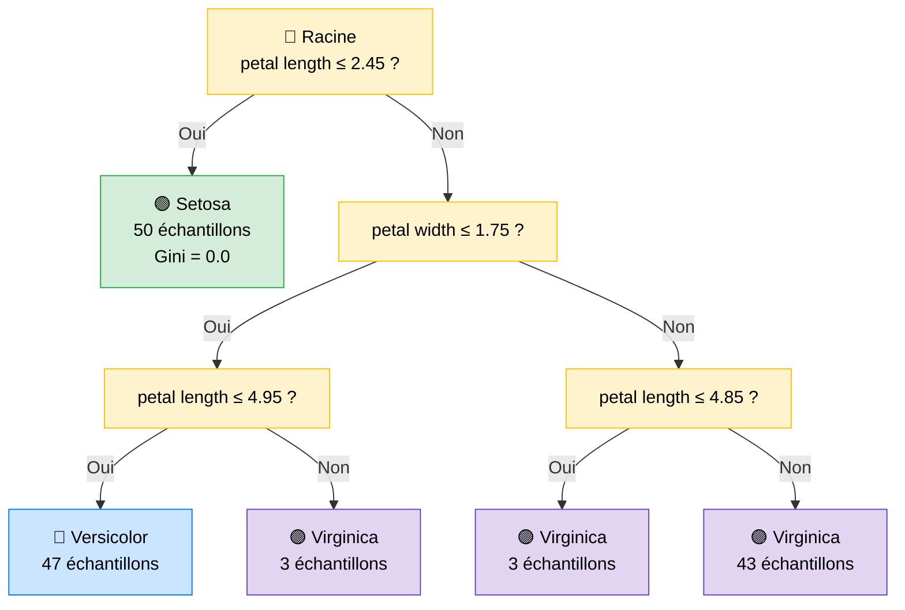
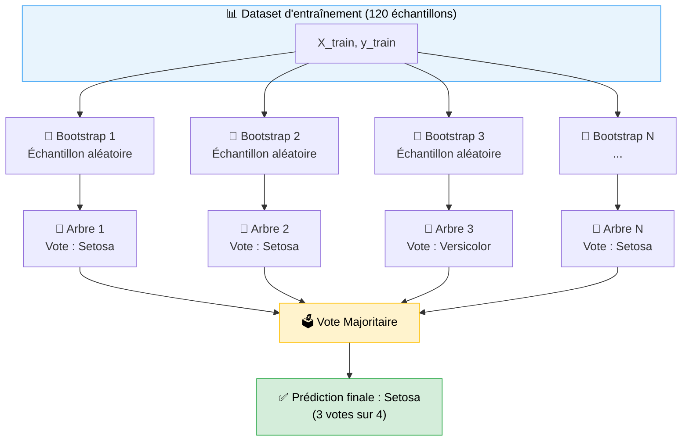
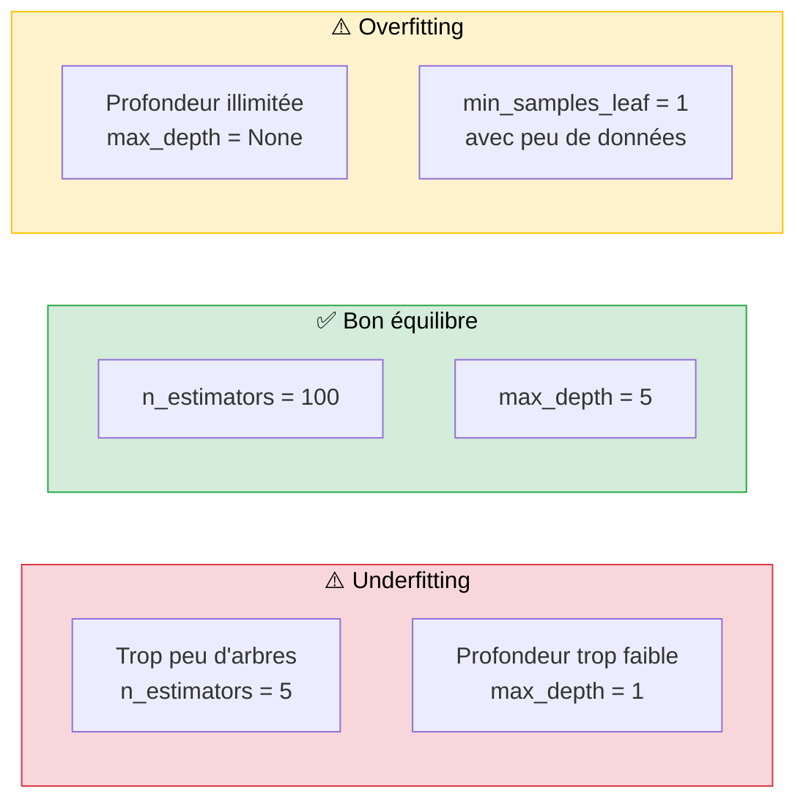
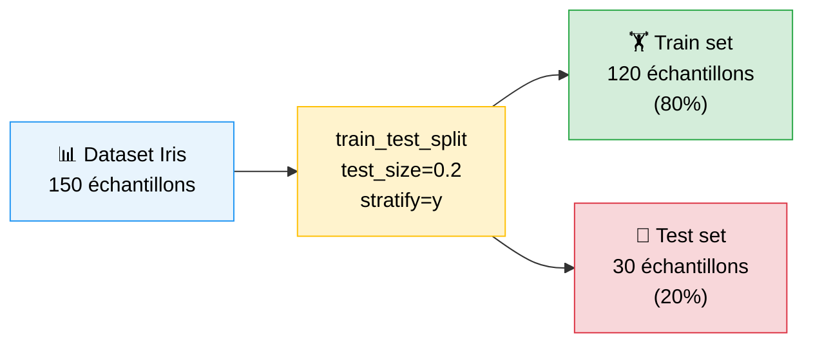
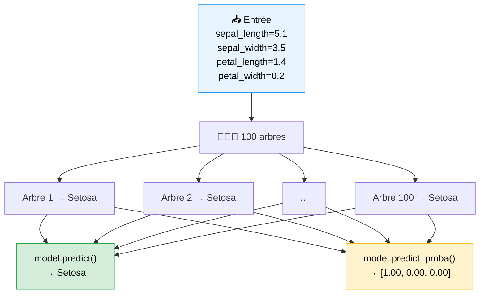
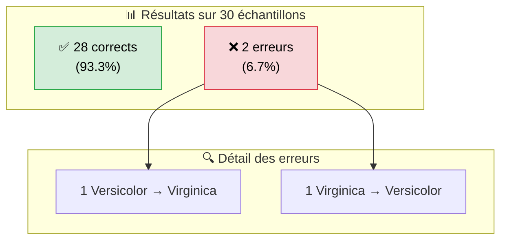
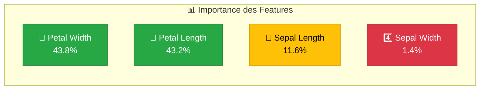
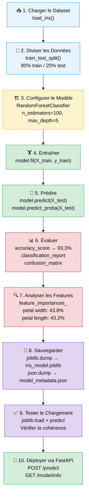

<a id="top"></a>

# 🌲 Entraînement d'un Modèle Random Forest sur le Dataset Iris

> **Objectif** : Comprendre le fonctionnement du Random Forest, entraîner un modèle de classification sur le dataset Iris, l'évaluer et l'exporter pour un déploiement en production via FastAPI.

---

## 📑 Table des matières

| N°  | Section                                                        |
|-----|----------------------------------------------------------------|
| 1   | [Qu'est-ce qu'un arbre de décision ?](#section-1)             |
| 2   | [Du Decision Tree au Random Forest](#section-2)               |
| 3   | [Les hyperparamètres du Random Forest](#section-3)             |
| 4   | [Entraîner le modèle sur Iris](#section-4)                    |
| 5   | [Prédiction et predict_proba](#section-5)                     |
| 6   | [Évaluation du modèle](#section-6)                            |
| 7   | [Importance des features](#section-7)                          |
| 8   | [Sauvegarder le modèle avec joblib](#section-8)               |
| 9   | [Tester le modèle sauvegardé](#section-9)                     |
| 10  | [Comparaison avec d'autres algorithmes](#section-10)           |
| 11  | [Résumé du pipeline complet](#section-11)                      |

---

<a id="section-1"></a>

<details>
<summary><strong>1 - Qu'est-ce qu'un arbre de décision ?</strong></summary>

### Concept

Un **arbre de décision** (Decision Tree) est un algorithme de Machine Learning supervisé qui apprend à classer des données en posant une série de questions binaires sur les features. À chaque nœud, l'algorithme choisit la question qui **sépare le mieux** les classes (en maximisant le gain d'information ou en minimisant l'impureté de Gini).

### Analogie

Imaginez un botaniste qui identifie une fleur Iris en posant des questions successives :

1. « La longueur du pétale est-elle ≤ 2.45 cm ? »
   - **Oui** → C'est une **Setosa** (100% de certitude)
   - **Non** → Passer à la question suivante
2. « La largeur du pétale est-elle ≤ 1.75 cm ? »
   - **Oui** → C'est probablement une **Versicolor**
   - **Non** → C'est probablement une **Virginica**

### Visualisation d'un arbre de décision



### Terminologie

| Terme            | Définition                                                        |
|------------------|-------------------------------------------------------------------|
| **Racine**       | Le premier nœud de l'arbre (première question posée)              |
| **Nœud interne** | Un nœud qui pose une question et se divise en deux branches       |
| **Feuille**      | Un nœud terminal qui donne la prédiction finale (la classe)       |
| **Profondeur**   | Le nombre maximum de questions posées pour atteindre une feuille  |
| **Gini**         | Mesure d'impureté : 0 = pur (une seule classe), 0.5 = mélangé    |

### Avantages et limites d'un seul arbre

| ✅ Avantages                  | ❌ Limites                                   |
|------------------------------|----------------------------------------------|
| Facile à interpréter          | Tendance à l'**overfitting**                 |
| Pas besoin de normalisation   | Très sensible aux variations des données     |
| Rapide à entraîner            | Frontières de décision rectilignes           |
| Gère les features numériques et catégorielles | Instable : un petit changement dans les données peut changer tout l'arbre |

</details>

<p align="right"><a href="#top">↑ Retour en haut</a></p>

---

<a id="section-2"></a>

<details>
<summary><strong>2 - Du Decision Tree au Random Forest</strong></summary>

### Le problème d'un seul arbre

Un arbre de décision seul a tendance à **mémoriser** les données d'entraînement (overfitting). Si on change quelques échantillons, l'arbre peut être radicalement différent. C'est un modèle **instable**.

### La solution : l'ensemble learning

Le **Random Forest** (forêt aléatoire) résout ce problème en combinant **plusieurs arbres de décision** indépendants. Chaque arbre « vote » pour une classe, et la **classe majoritaire** est la prédiction finale.

### Les deux ingrédients clés

#### 1. Bagging (Bootstrap Aggregating)

Chaque arbre est entraîné sur un **sous-échantillon aléatoire** (avec remise) des données d'entraînement. Ainsi, chaque arbre voit des données légèrement différentes.

#### 2. Sélection aléatoire de features

À chaque split (division), seul un **sous-ensemble aléatoire de features** est considéré. Cela force les arbres à explorer des stratégies différentes et réduit la corrélation entre eux.

### Visualisation du fonctionnement



### Pourquoi la forêt est meilleure qu'un seul arbre ?

| Aspect                    | Decision Tree (1 arbre)    | Random Forest (N arbres)      |
|---------------------------|---------------------------|-------------------------------|
| **Overfitting**           | Élevé                     | Réduit grâce au bagging       |
| **Variance**              | Haute (instable)          | Basse (moyenne des arbres)    |
| **Biais**                 | Peut être bas              | Légèrement plus haut          |
| **Robustesse**            | Sensible au bruit         | Robuste grâce au vote         |
| **Interprétabilité**      | Très bonne                | Bonne (feature importances)   |
| **Temps d'entraînement**  | Très rapide               | Plus lent (N arbres)          |

### L'intuition mathématique

> **Théorème de la sagesse des foules** : la moyenne de nombreuses estimations indépendantes et imparfaites est souvent meilleure que n'importe quelle estimation individuelle.

Si chaque arbre a une accuracy de 70% et qu'ils font des erreurs **indépendantes**, alors la forêt de 100 arbres aura une accuracy bien supérieure à 70%.

</details>

<p align="right"><a href="#top">↑ Retour en haut</a></p>

---

<a id="section-3"></a>

<details>
<summary><strong>3 - Les hyperparamètres du Random Forest</strong></summary>

### Qu'est-ce qu'un hyperparamètre ?

Un **hyperparamètre** est un paramètre défini **avant** l'entraînement du modèle (contrairement aux paramètres du modèle, qui sont appris pendant l'entraînement). Le choix des hyperparamètres influence directement la performance du modèle.

### Les hyperparamètres principaux

| Hyperparamètre       | Description                                                               | Valeur par défaut | Valeurs typiques   | Notre projet |
|-----------------------|---------------------------------------------------------------------------|-------------------|--------------------|--------------|
| `n_estimators`        | Nombre d'arbres dans la forêt                                            | 100               | 50 – 500           | **100**      |
| `max_depth`           | Profondeur maximale de chaque arbre (`None` = illimité)                  | `None`            | 3 – 20             | **5**        |
| `random_state`        | Graine aléatoire pour la reproductibilité                                | `None`            | 42 (convention)    | **42**       |
| `min_samples_split`   | Nombre minimum d'échantillons requis pour diviser un nœud interne        | 2                 | 2 – 20             | 2            |
| `min_samples_leaf`    | Nombre minimum d'échantillons requis dans une feuille                    | 1                 | 1 – 10             | 1            |
| `max_features`        | Nombre de features considérées pour chaque split                         | `"sqrt"`          | `"sqrt"`, `"log2"` | `"sqrt"`     |
| `criterion`           | Fonction pour mesurer la qualité d'un split                              | `"gini"`          | `"gini"`, `"entropy"` | `"gini"`  |
| `bootstrap`           | Utiliser le bootstrap (échantillonnage avec remise)                      | `True`            | `True`, `False`    | `True`       |

### Impact des hyperparamètres clés



### Notre configuration

Dans notre projet Iris, nous utilisons les hyperparamètres suivants :

```python
model = RandomForestClassifier(
    n_estimators=100,   # 100 arbres dans la forêt
    max_depth=5,        # Chaque arbre a au plus 5 niveaux de profondeur
    random_state=42     # Résultats reproductibles
)
```

**Pourquoi ces valeurs ?**
- `n_estimators=100` : bon compromis entre performance et vitesse d'entraînement
- `max_depth=5` : évite l'overfitting sur un dataset aussi petit (150 échantillons)
- `random_state=42` : garantit que les résultats sont identiques à chaque exécution

</details>

<p align="right"><a href="#top">↑ Retour en haut</a></p>

---

<a id="section-4"></a>

<details>
<summary><strong>4 - Entraîner le modèle sur Iris</strong></summary>

### Le code complet, étape par étape

#### Étape 1 : Imports

```python
import pandas as pd
import numpy as np
from sklearn.datasets import load_iris
from sklearn.model_selection import train_test_split
from sklearn.ensemble import RandomForestClassifier
from sklearn.metrics import classification_report, confusion_matrix, accuracy_score
import joblib
import json
import os
```

| Import                              | Rôle                                                    |
|-------------------------------------|---------------------------------------------------------|
| `pandas`                            | Manipulation de données tabulaires                      |
| `numpy`                             | Calculs numériques (tableaux)                           |
| `load_iris`                         | Charger le dataset Iris intégré à scikit-learn          |
| `train_test_split`                  | Diviser les données en train/test                       |
| `RandomForestClassifier`            | L'algorithme Random Forest                              |
| `classification_report`             | Rapport détaillé (precision, recall, f1)                |
| `confusion_matrix`                  | Matrice de confusion                                    |
| `accuracy_score`                    | Calculer l'accuracy                                     |
| `joblib`                            | Sauvegarder/charger le modèle                           |
| `json`, `os`                        | Manipulation de fichiers JSON et chemins                 |

#### Étape 2 : Charger le dataset

```python
iris = load_iris()

X = iris.data            # Features : tableau (150, 4)
y = iris.target          # Labels  : tableau (150,) → 0, 1 ou 2
```

Le dataset Iris contient :
- **150 échantillons** répartis en 3 classes (50 chacune)
- **4 features** : sepal length, sepal width, petal length, petal width
- **3 classes** : setosa (0), versicolor (1), virginica (2)

#### Étape 3 : Diviser les données

```python
X_train, X_test, y_train, y_test = train_test_split(
    X, y,
    test_size=0.2,       # 20% pour le test → 30 échantillons
    random_state=42,     # Reproductibilité
    stratify=y           # Même proportion de classes dans train et test
)
```



> **`stratify=y`** garantit que chaque classe est représentée proportionnellement dans le train et le test. Sans cela, on pourrait avoir un test set sans aucun échantillon Setosa, ce qui fausserait l'évaluation.

#### Étape 4 : Créer et entraîner le modèle

```python
model = RandomForestClassifier(
    n_estimators=100,
    max_depth=5,
    random_state=42
)

model.fit(X_train, y_train)
```

`model.fit()` est l'étape d'**entraînement** : l'algorithme construit 100 arbres de décision, chacun sur un échantillon bootstrap différent, et apprend les règles de classification.

#### Résultat

Après l'entraînement, le modèle contient :
- 100 arbres de décision entraînés
- Les seuils de décision appris pour chaque nœud
- L'importance calculée de chaque feature

</details>

<p align="right"><a href="#top">↑ Retour en haut</a></p>

---

<a id="section-5"></a>

<details>
<summary><strong>5 - Prédiction et predict_proba</strong></summary>

### Deux méthodes de prédiction

Le modèle entraîné offre deux façons de faire des prédictions :

| Méthode               | Retourne                                   | Exemple de sortie                   |
|-----------------------|--------------------------------------------|-------------------------------------|
| `model.predict(X)`    | La **classe prédite** (le vote majoritaire) | `[0]` → Setosa                     |
| `model.predict_proba(X)` | Les **probabilités** pour chaque classe | `[[0.98, 0.01, 0.01]]`             |

### `model.predict()` — Obtenir la classe

```python
sample = np.array([[5.1, 3.5, 1.4, 0.2]])

prediction = model.predict(sample)
print(f"Classe prédite : {prediction[0]}")           # 0
print(f"Espèce : {iris.target_names[prediction[0]]}")  # setosa
```

**Comment ça marche ?**
1. L'échantillon traverse les 100 arbres
2. Chaque arbre vote pour une classe
3. La classe avec le plus de votes gagne

### `model.predict_proba()` — Obtenir les probabilités

```python
probabilities = model.predict_proba(sample)
print(probabilities)
# [[1.0, 0.0, 0.0]]
```

Chaque valeur représente la **proportion d'arbres** ayant voté pour cette classe :

| Classe       | Probabilité | Interprétation                        |
|-------------|-------------|---------------------------------------|
| Setosa      | 1.00        | 100 arbres sur 100 disent « Setosa »  |
| Versicolor  | 0.00        | 0 arbre dit « Versicolor »            |
| Virginica   | 0.00        | 0 arbre dit « Virginica »             |

### Exemple avec un cas plus ambigu

```python
sample_ambigu = np.array([[5.9, 2.8, 4.5, 1.3]])

pred = model.predict(sample_ambigu)
proba = model.predict_proba(sample_ambigu)

print(f"Espèce prédite : {iris.target_names[pred[0]]}")
print(f"Probabilités :")
for name, p in zip(iris.target_names, proba[0]):
    print(f"  {name:12s} : {p:.2%}")
```

Sortie possible :

```
Espèce prédite : versicolor
Probabilités :
  setosa       : 0.00%
  versicolor   : 91.00%
  virginica    : 9.00%
```

> Dans notre API FastAPI, nous utilisons `predict_proba` pour retourner la **confiance** (probabilité maximale) en plus de la classe prédite. C'est bien plus informatif qu'une simple prédiction binaire.

### Visualisation du processus



</details>

<p align="right"><a href="#top">↑ Retour en haut</a></p>

---

<a id="section-6"></a>

<details>
<summary><strong>6 - Évaluation du modèle</strong></summary>

### Pourquoi évaluer ?

Entraîner un modèle ne suffit pas. Il faut mesurer sa capacité à **généraliser** sur des données qu'il n'a jamais vues (le test set).

### Le code d'évaluation

```python
y_pred = model.predict(X_test)

accuracy = accuracy_score(y_test, y_pred)
print(f"Accuracy: {accuracy:.4f}")
```

**Résultat : Accuracy = 0.9333 (93.33%)**

Cela signifie que le modèle classe correctement **28 échantillons sur 30** du test set.

### Le rapport de classification

```python
print(classification_report(y_test, y_pred, target_names=iris.target_names))
```

Sortie :

```
              precision    recall  f1-score   support

      setosa       1.00      1.00      1.00        10
  versicolor       0.90      0.90      0.90        10
   virginica       0.90      0.90      0.90        10

    accuracy                           0.93        30
   macro avg       0.93      0.93      0.93        30
weighted avg       0.93      0.93      0.93        30
```

### Comprendre les métriques

| Métrique       | Définition                                                                | Setosa | Versicolor | Virginica |
|---------------|---------------------------------------------------------------------------|--------|------------|-----------|
| **Precision** | Parmi les prédictions « X », combien sont correctes ?                      | 1.00   | 0.90       | 0.90      |
| **Recall**    | Parmi les vrais « X », combien ont été détectés ?                          | 1.00   | 0.90       | 0.90      |
| **F1-score**  | Moyenne harmonique de precision et recall                                  | 1.00   | 0.90       | 0.90      |
| **Support**   | Nombre d'échantillons de cette classe dans le test set                     | 10     | 10         | 10        |

**Analyse :**
- **Setosa** est parfaitement classée (1.00 partout) → elle est facilement séparable grâce à la petite taille de ses pétales
- **Versicolor** et **Virginica** ont des scores de 0.90 → il y a 1 confusion entre ces deux classes qui sont plus proches morphologiquement

### La matrice de confusion

```python
cm = confusion_matrix(y_test, y_pred)
print(cm)
```

Sortie :

```
[[10  0  0]
 [ 0  9  1]
 [ 0  1  9]]
```

Lecture de la matrice :

|                      | Prédit Setosa | Prédit Versicolor | Prédit Virginica |
|----------------------|:------------:|:-----------------:|:----------------:|
| **Vrai Setosa**      | **10** ✅    | 0                 | 0                |
| **Vrai Versicolor**  | 0            | **9** ✅          | 1 ❌             |
| **Vrai Virginica**   | 0            | 1 ❌              | **9** ✅         |

**Les 2 erreurs :**
- 1 Versicolor classée comme Virginica
- 1 Virginica classée comme Versicolor

> C'est un résultat attendu : Versicolor et Virginica sont morphologiquement très proches, avec des zones de chevauchement dans l'espace des features.



</details>

<p align="right"><a href="#top">↑ Retour en haut</a></p>

---

<a id="section-7"></a>

<details>
<summary><strong>7 - Importance des features</strong></summary>

### Qu'est-ce que l'importance des features ?

Le Random Forest calcule automatiquement l'**importance** de chaque feature. Elle mesure à quel point chaque feature contribue à réduire l'impureté (Gini) dans les arbres de la forêt.

### Le code

```python
importances = model.feature_importances_

feature_importance_df = pd.DataFrame({
    'feature': iris.feature_names,
    'importance': importances
}).sort_values('importance', ascending=False)

print(feature_importance_df)
```

### Résultats pour notre modèle

| Feature              | Importance | Pourcentage |
|----------------------|-----------|-------------|
| **petal width (cm)** | 0.4381    | **43.8%**   |
| **petal length (cm)**| 0.4316    | **43.2%**   |
| sepal length (cm)    | 0.1160    | 11.6%       |
| sepal width (cm)     | 0.0142    | 1.4%        |

### Interprétation



**Que nous apprend ce résultat ?**

1. **Les pétales dominent (87%)** : La largeur et la longueur du pétale, à elles seules, suffisent presque à classifier les trois espèces. C'est logique : les pétales varient énormément entre les espèces d'Iris.

2. **La longueur du sépale aide un peu (11.6%)** : Elle apporte une information complémentaire, surtout pour distinguer Versicolor de Virginica.

3. **La largeur du sépale est quasi inutile (1.4%)** : Cette feature n'apporte presque aucune information discriminante. On pourrait presque la retirer sans perdre en performance.

### Impact pratique

Dans un contexte réel, connaître l'importance des features permet de :
- **Simplifier le modèle** en retirant les features inutiles
- **Réduire le coût** de collecte de données (mesurer seulement les features utiles)
- **Comprendre le domaine** — ici, les botanistes confirment que les pétales sont la clé de l'identification

</details>

<p align="right"><a href="#top">↑ Retour en haut</a></p>

---

<a id="section-8"></a>

<details>
<summary><strong>8 - Sauvegarder le modèle avec joblib</strong></summary>

### Pourquoi sauvegarder le modèle ?

Entraîner un modèle à chaque requête serait **lent** et **inutile**. On entraîne une fois, on sauvegarde, puis on charge le modèle déjà entraîné dans l'API.

### joblib vs pickle

| Critère                    | `joblib`                          | `pickle`                       |
|---------------------------|-----------------------------------|--------------------------------|
| **Performance sur gros tableaux NumPy** | ✅ Optimisé (compression)    | ❌ Lent                        |
| **Taille des fichiers**    | Plus petits (compression zlib)    | Plus gros                      |
| **Recommandé par scikit-learn** | ✅ Oui, officiellement        | Non recommandé                  |
| **Syntaxe**               | `joblib.dump()` / `joblib.load()` | `pickle.dump()` / `pickle.load()` |

> **scikit-learn recommande officiellement `joblib`** pour sauvegarder les modèles car il gère efficacement les grands tableaux NumPy internes aux modèles.

### Sauvegarder le modèle

```python
import joblib

model_dir = os.path.join('..', 'backend', 'models')
os.makedirs(model_dir, exist_ok=True)

model_path = os.path.join(model_dir, 'iris_model.joblib')
joblib.dump(model, model_path)
print(f"Modèle sauvegardé : {model_path}")
```

### Sauvegarder les métadonnées en JSON

Les métadonnées permettent à l'API de connaître les caractéristiques du modèle **sans avoir à le charger** :

```python
metadata = {
    "model_type": "RandomForestClassifier",
    "n_estimators": 100,
    "max_depth": 5,
    "accuracy": float(accuracy),
    "feature_names": list(iris.feature_names),
    "target_names": list(iris.target_names),
    "feature_importances": {
        name: float(imp)
        for name, imp in zip(iris.feature_names, importances)
    },
    "training_samples": int(X_train.shape[0]),
    "test_samples": int(X_test.shape[0])
}

metadata_path = os.path.join(model_dir, 'model_metadata.json')
with open(metadata_path, 'w') as f:
    json.dump(metadata, f, indent=2)
print(f"Métadonnées sauvegardées : {metadata_path}")
```

### Structure des fichiers générés

```
backend/models/
├── iris_model.joblib        # Le modèle sérialisé (~56 KB)
└── model_metadata.json      # Les métadonnées (~500 bytes)
```

### Contenu du fichier model_metadata.json

```json
{
  "model_type": "RandomForestClassifier",
  "n_estimators": 100,
  "max_depth": 5,
  "accuracy": 0.9333333333333333,
  "feature_names": [
    "sepal length (cm)",
    "sepal width (cm)",
    "petal length (cm)",
    "petal width (cm)"
  ],
  "target_names": ["setosa", "versicolor", "virginica"],
  "feature_importances": {
    "sepal length (cm)": 0.116,
    "sepal width (cm)": 0.014,
    "petal length (cm)": 0.432,
    "petal width (cm)": 0.438
  },
  "training_samples": 120,
  "test_samples": 30
}
```

</details>

<p align="right"><a href="#top">↑ Retour en haut</a></p>

---

<a id="section-9"></a>

<details>
<summary><strong>9 - Tester le modèle sauvegardé</strong></summary>

### Vérification complète

Après la sauvegarde, il est essentiel de **vérifier** que le modèle chargé produit les mêmes résultats que le modèle original.

### Le code complet de test

```python
import joblib
import numpy as np

model_path = '../backend/models/iris_model.joblib'
loaded_model = joblib.load(model_path)

target_names = ["setosa", "versicolor", "virginica"]

sample = np.array([[5.1, 3.5, 1.4, 0.2]])

prediction = loaded_model.predict(sample)
probabilities = loaded_model.predict_proba(sample)

print(f"Échantillon       : {sample[0]}")
print(f"Prédiction        : {target_names[prediction[0]]}")
print(f"Probabilités      : {dict(zip(target_names, probabilities[0].round(4)))}")
```

Sortie attendue :

```
Échantillon       : [5.1 3.5 1.4 0.2]
Prédiction        : setosa
Probabilités      : {'setosa': 1.0, 'versicolor': 0.0, 'virginica': 0.0}
```

### Test avec plusieurs échantillons

```python
test_samples = np.array([
    [5.1, 3.5, 1.4, 0.2],   # Typique Setosa
    [5.9, 2.8, 4.5, 1.3],   # Typique Versicolor
    [6.7, 3.1, 5.6, 2.4],   # Typique Virginica
])

for sample in test_samples:
    pred = loaded_model.predict([sample])
    proba = loaded_model.predict_proba([sample])
    confidence = proba[0].max()
    species = target_names[pred[0]]
    print(f"Features: {sample} → {species} (confiance: {confidence:.1%})")
```

Sortie attendue :

```
Features: [5.1 3.5 1.4 0.2] → setosa (confiance: 100.0%)
Features: [5.9 2.8 4.5 1.3] → versicolor (confiance: 91.0%)
Features: [6.7 3.1 5.6 2.4] → virginica (confiance: 99.0%)
```

### Vérifier la cohérence avec le modèle original

```python
y_pred_original = model.predict(X_test)
y_pred_loaded = loaded_model.predict(X_test)

assert np.array_equal(y_pred_original, y_pred_loaded), "Les prédictions diffèrent !"
print("✅ Le modèle chargé produit exactement les mêmes résultats.")
```

> Ce test de cohérence est une bonne pratique : il garantit que la sérialisation/désérialisation n'a pas altéré le modèle.

</details>

<p align="right"><a href="#top">↑ Retour en haut</a></p>

---

<a id="section-10"></a>

<details>
<summary><strong>10 - Comparaison avec d'autres algorithmes</strong></summary>

### Pourquoi comparer ?

Le Random Forest est un excellent choix, mais il est important de savoir comment il se positionne face à d'autres algorithmes classiques de classification.

### Benchmark sur le dataset Iris

Voici une comparaison des algorithmes les plus courants, tous évalués dans les mêmes conditions (80/20 split, random_state=42) :

| Algorithme               | Accuracy | Temps d'entraînement | Interprétabilité |
|--------------------------|----------|----------------------|------------------|
| **Random Forest**        | **93.3%** | Moyen                | Bonne            |
| K-Nearest Neighbors (KNN) | 96.7%  | Très rapide          | Moyenne          |
| Support Vector Machine (SVM) | 96.7% | Rapide             | Faible           |
| Logistic Regression      | 96.7%   | Très rapide          | Excellente       |
| Decision Tree            | 93.3%   | Très rapide          | Excellente       |

### Détails de chaque algorithme

#### K-Nearest Neighbors (KNN)

```python
from sklearn.neighbors import KNeighborsClassifier

knn = KNeighborsClassifier(n_neighbors=5)
knn.fit(X_train, y_train)
print(f"KNN Accuracy: {knn.score(X_test, y_test):.4f}")
```

| Avantages                            | Inconvénients                                |
|-------------------------------------|----------------------------------------------|
| Très simple à comprendre             | Lent en prédiction sur gros datasets         |
| Aucun entraînement réel              | Sensible à l'échelle des features            |
| Efficace sur petits datasets          | Le choix de K est crucial                    |

#### Support Vector Machine (SVM)

```python
from sklearn.svm import SVC

svm = SVC(kernel='rbf', random_state=42)
svm.fit(X_train, y_train)
print(f"SVM Accuracy: {svm.score(X_test, y_test):.4f}")
```

| Avantages                            | Inconvénients                                |
|-------------------------------------|----------------------------------------------|
| Très performant en haute dimension   | Difficile à interpréter                      |
| Robuste à l'overfitting              | Lent sur très gros datasets                  |
| Frontières non linéaires (kernel)    | Beaucoup d'hyperparamètres à tuner           |

#### Logistic Regression

```python
from sklearn.linear_model import LogisticRegression

lr = LogisticRegression(max_iter=200, random_state=42)
lr.fit(X_train, y_train)
print(f"Logistic Regression Accuracy: {lr.score(X_test, y_test):.4f}")
```

| Avantages                            | Inconvénients                                |
|-------------------------------------|----------------------------------------------|
| Très interprétable (coefficients)    | Suppose des frontières linéaires             |
| Rapide à entraîner et prédire        | Moins performant sur problèmes complexes     |
| Donne des probabilités calibrées     | Nécessite une normalisation des features     |

### Pourquoi avons-nous choisi Random Forest ?

Même si d'autres algorithmes obtiennent une meilleure accuracy sur Iris, le Random Forest a été choisi pour ce projet car :

1. **Valeur pédagogique** : il illustre les concepts d'ensemble learning, bagging et feature importance
2. **Robustesse** : il fonctionne bien sans normalisation ni réglage fin
3. **Feature importances** : elles enrichissent l'API avec des informations utiles
4. **Scalabilité** : en production, sur des datasets plus complexes, le Random Forest reste performant

> Sur un dataset aussi simple que Iris (150 échantillons, classes bien séparées), la plupart des algorithmes obtiennent 90-97% d'accuracy. Les différences deviennent significatives sur des problèmes plus complexes.

</details>

<p align="right"><a href="#top">↑ Retour en haut</a></p>

---

<a id="section-11"></a>

<details>
<summary><strong>11 - Résumé du pipeline complet</strong></summary>

### Vue d'ensemble

Voici le pipeline complet que nous avons parcouru, du chargement des données au déploiement :



### Récapitulatif des fichiers du projet

| Fichier                          | Rôle                                           |
|---------------------------------|------------------------------------------------|
| `notebook/train_model.ipynb`     | Pipeline d'entraînement complet                |
| `backend/models/iris_model.joblib` | Modèle sérialisé, prêt à charger             |
| `backend/models/model_metadata.json` | Métadonnées (accuracy, features, classes)   |
| `backend/main.py`               | API FastAPI qui charge le modèle et sert les prédictions |

### Les commandes clés en résumé

```python
# --- Entraînement ---
from sklearn.datasets import load_iris
from sklearn.model_selection import train_test_split
from sklearn.ensemble import RandomForestClassifier

iris = load_iris()
X_train, X_test, y_train, y_test = train_test_split(
    iris.data, iris.target, test_size=0.2, random_state=42, stratify=iris.target
)
model = RandomForestClassifier(n_estimators=100, max_depth=5, random_state=42)
model.fit(X_train, y_train)

# --- Évaluation ---
from sklearn.metrics import accuracy_score, classification_report
y_pred = model.predict(X_test)
print(f"Accuracy: {accuracy_score(y_test, y_pred):.2%}")

# --- Sauvegarde ---
import joblib
joblib.dump(model, 'backend/models/iris_model.joblib')

# --- Chargement et prédiction ---
loaded = joblib.load('backend/models/iris_model.joblib')
prediction = loaded.predict([[5.1, 3.5, 1.4, 0.2]])
probas = loaded.predict_proba([[5.1, 3.5, 1.4, 0.2]])
```

### Ce que vous avez appris

| Concept                     | Résumé                                                          |
|----------------------------|-----------------------------------------------------------------|
| Arbre de décision           | Algorithme qui apprend des règles de classification par questions binaires |
| Random Forest               | Ensemble de N arbres indépendants qui votent                    |
| Bagging                     | Entraîner chaque arbre sur un échantillon bootstrap différent   |
| train_test_split             | Séparer données en train (80%) et test (20%)                   |
| `model.fit()`              | Entraîner le modèle sur les données                             |
| `model.predict()`          | Obtenir la classe prédite                                       |
| `model.predict_proba()`    | Obtenir les probabilités pour chaque classe                     |
| Accuracy                    | Proportion de prédictions correctes (93.3%)                     |
| Precision / Recall / F1     | Métriques par classe pour une évaluation fine                   |
| Matrice de confusion         | Visualiser les erreurs classe par classe                       |
| Feature importance           | Identifier quelles features comptent le plus                   |
| `joblib.dump/load`          | Sauvegarder et charger un modèle scikit-learn                  |

</details>

<p align="right"><a href="#top">↑ Retour en haut</a></p>

---

> **Prochain cours** : Déploiement du modèle via une API REST avec FastAPI
