<a id="top"></a>

# Exposer un Modèle de Machine Learning via FastAPI

> **Projet** : Iris Flower Prediction API  
> **Stack** : Python · scikit-learn · joblib · FastAPI · Uvicorn  
> **Niveau** : Intermédiaire  

---

## Table des matières

| #  | Section | Lien |
|----|---------|------|
| 1  | Introduction — Pourquoi exposer un modèle ML via une API ? | [Aller →](#section-1) |
| 2  | FastAPI en 5 minutes | [Aller →](#section-2) |
| 3  | Structure du backend | [Aller →](#section-3) |
| 4  | Chargement du modèle au démarrage | [Aller →](#section-4) |
| 5  | Validation des entrées avec Pydantic | [Aller →](#section-5) |
| 6  | L'endpoint POST /predict en détail | [Aller →](#section-6) |
| 7  | Les endpoints informatifs | [Aller →](#section-7) |
| 8  | CORS — Cross-Origin Resource Sharing | [Aller →](#section-8) |
| 9  | Swagger UI — Documentation automatique | [Aller →](#section-9) |
| 10 | Tester l'API avec curl et PowerShell | [Aller →](#section-10) |
| 11 | Gestion des erreurs | [Aller →](#section-11) |
| 12 | Résumé et bonnes pratiques | [Aller →](#section-12) |

---

<a id="section-1"></a>

<details>
<summary>1 - Introduction — Pourquoi exposer un modèle ML via une API ?</summary>

### Le problème

Un modèle entraîné dans un notebook Jupyter n'est qu'un fichier `.joblib` sur disque.  
Il ne peut pas être utilisé directement par une application mobile, un site web ou un autre service.

### La solution : une API REST

En plaçant le modèle derrière une API HTTP, on obtient plusieurs avantages majeurs :

| Avantage | Description |
|----------|-------------|
| **Séparation des responsabilités** | Le code ML reste indépendant du code front-end |
| **Scalabilité** | On peut déployer l'API sur plusieurs serveurs |
| **Accès multi-client** | Mobile (Flutter), Web (React), Scripts Python, cURL… tout peut consommer la même API |
| **Versionnement** | On peut mettre à jour le modèle sans toucher aux clients |
| **Monitoring** | On peut logger chaque prédiction, mesurer la latence, détecter la dérive |

### Architecture globale

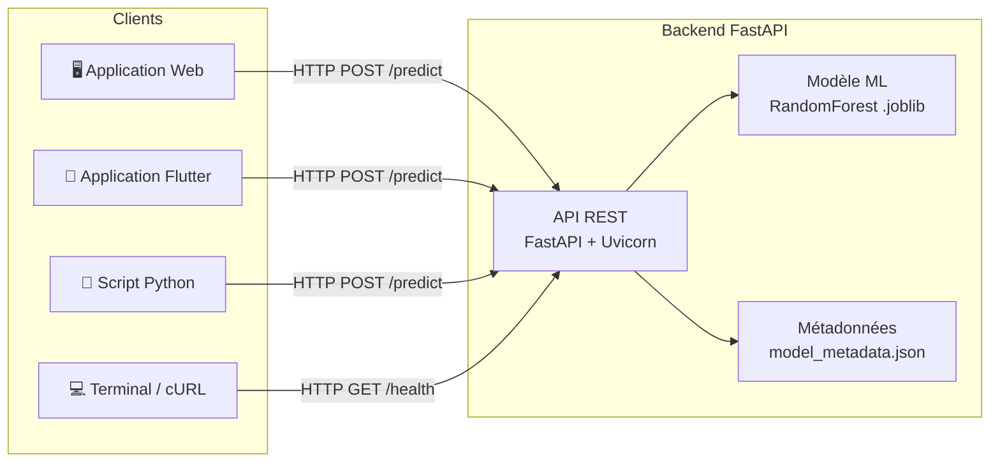

### Flux d'une prédiction

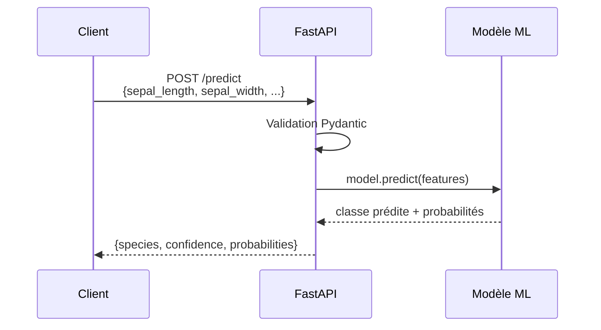

</details>

<p align="right"><a href="#top">↑ Retour en haut</a></p>

---

<a id="section-2"></a>

<details>
<summary>2 - FastAPI en 5 minutes</summary>

### Qu'est-ce que FastAPI ?

**FastAPI** est un framework web Python moderne et performant, conçu pour créer des API REST rapidement. Il se distingue par :

| Caractéristique | Description |
|-----------------|-------------|
| **Haute performance** | Basé sur Starlette (ASGI), comparable à Node.js et Go |
| **Asynchrone natif** | Support `async`/`await` intégré |
| **Documentation automatique** | Génère Swagger UI (`/docs`) et ReDoc (`/redoc`) sans configuration |
| **Validation Pydantic** | Validation automatique des données d'entrée/sortie avec des modèles typés |
| **Type hints Python** | Utilise les annotations de type standard de Python 3.10+ |

### ASGI vs WSGI

```mermaid
graph TD
    subgraph WSGI – Synchrone
        W1[Requête 1] --> W2[Traitement bloquant]
        W2 --> W3[Réponse 1]
        W4[Requête 2 attend...]
    end

    subgraph ASGI – Asynchrone
        A1[Requête 1] --> A2[Traitement non-bloquant]
        A3[Requête 2] --> A4[Traitement non-bloquant]
        A2 --> A5[Réponse 1]
        A4 --> A6[Réponse 2]
    end
```

FastAPI utilise **ASGI** (Asynchronous Server Gateway Interface) via **Uvicorn**, ce qui permet de gérer plusieurs requêtes simultanément sans bloquer le serveur.

### Installation

```bash
pip install fastapi uvicorn
```

### Hello World minimal

```python
from fastapi import FastAPI

app = FastAPI()

@app.get("/")
async def root():
    return {"message": "Bonjour le monde !"}
```

Lancement :

```bash
uvicorn main:app --reload
```

Le serveur démarre sur `http://127.0.0.1:8000` et la documentation interactive est disponible sur `http://127.0.0.1:8000/docs`.

</details>

<p align="right"><a href="#top">↑ Retour en haut</a></p>

---

<a id="section-3"></a>

<details>
<summary>3 - Structure du backend</summary>

### Arborescence du projet

```
full-app-pandas/
├── backend/
│   ├── main.py                      # Point d'entrée FastAPI
│   └── models/
│       ├── iris_model.joblib         # Modèle sérialisé (Random Forest)
│       └── model_metadata.json       # Métadonnées du modèle
├── notebooks/
│   └── train_model.ipynb             # Notebook d'entraînement
├── requirements.txt
└── README.md
```

### Rôle de chaque fichier

| Fichier | Rôle |
|---------|------|
| `main.py` | Définit l'application FastAPI, les endpoints, les modèles Pydantic, le chargement du modèle |
| `iris_model.joblib` | Fichier binaire contenant le `RandomForestClassifier` entraîné, sérialisé avec `joblib` |
| `model_metadata.json` | Informations sur le modèle : type, accuracy, noms des features, importances, nombre d'échantillons |

### Contenu de `model_metadata.json`

```json
{
  "model_type": "RandomForestClassifier",
  "n_estimators": 100,
  "max_depth": 5,
  "accuracy": 0.9333333333333333,
  "feature_names": [
    "sepal length (cm)",
    "sepal width (cm)",
    "petal length (cm)",
    "petal width (cm)"
  ],
  "target_names": ["setosa", "versicolor", "virginica"],
  "feature_importances": {
    "sepal length (cm)": 0.116,
    "sepal width (cm)": 0.014,
    "petal length (cm)": 0.432,
    "petal width (cm)": 0.438
  },
  "training_samples": 120,
  "test_samples": 30
}
```

### Diagramme des composants

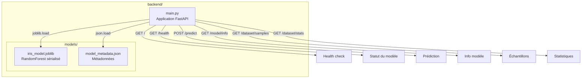

</details>

<p align="right"><a href="#top">↑ Retour en haut</a></p>

---

<a id="section-4"></a>

<details>
<summary>4 - Chargement du modèle au démarrage</summary>

### Pourquoi charger au démarrage ?

Charger un modèle ML prend du temps (lecture disque, désérialisation). Si on le charge à chaque requête, on gaspille des ressources et on augmente la latence.

La meilleure pratique est de charger le modèle **une seule fois** lors du démarrage du serveur, puis de le garder en mémoire.

### Variables globales et chemins

```python
MODEL_DIR = os.path.join(os.path.dirname(__file__), "models")
MODEL_PATH = os.path.join(MODEL_DIR, "iris_model.joblib")
METADATA_PATH = os.path.join(MODEL_DIR, "model_metadata.json")

model = None
metadata = None
```

- `MODEL_DIR` : résout le chemin vers le dossier `models/` relativement au fichier `main.py`
- `model` et `metadata` sont déclarés comme `None` puis assignés au démarrage
- Utiliser `os.path.dirname(__file__)` rend le code portable (fonctionne quel que soit le répertoire courant)

### La fonction `load_model()`

```python
def load_model():
    global model, metadata
    if not os.path.exists(MODEL_PATH):
        raise RuntimeError(
            f"Modèle non trouvé à {MODEL_PATH}. "
            "Exécutez d'abord le notebook train_model.ipynb"
        )
    model = joblib.load(MODEL_PATH)
    with open(METADATA_PATH, "r") as f:
        metadata = json.load(f)
```

| Étape | Action |
|-------|--------|
| 1 | Déclaration `global` pour modifier les variables du module |
| 2 | Vérification que le fichier `.joblib` existe |
| 3 | Si absent → `RuntimeError` avec un message clair |
| 4 | `joblib.load()` désérialise le modèle scikit-learn |
| 5 | `json.load()` charge les métadonnées depuis le fichier JSON |

### L'événement de démarrage

```python
@app.on_event("startup")
async def startup_event():
    load_model()
```

Le décorateur `@app.on_event("startup")` indique à FastAPI d'exécuter cette fonction **avant** de commencer à accepter les requêtes HTTP. Ainsi :

- Le modèle est chargé en mémoire **une seule fois**
- Si le chargement échoue, le serveur ne démarre pas (fail-fast)
- Toutes les requêtes suivantes utilisent le même objet `model` en mémoire

### Cycle de vie

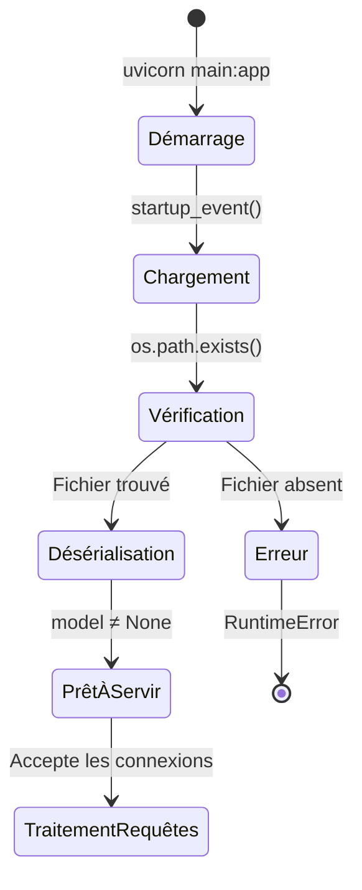

</details>

<p align="right"><a href="#top">↑ Retour en haut</a></p>

---

<a id="section-5"></a>

<details>
<summary>5 - Validation des entrées avec Pydantic</summary>

### Pourquoi valider les entrées ?

Sans validation, un utilisateur pourrait envoyer :
- Des chaînes de caractères au lieu de nombres
- Des valeurs négatives ou absurdement grandes
- Des champs manquants

Pydantic permet de définir un **schéma strict** pour les données d'entrée, avec validation automatique.

### Le modèle `PredictionRequest`

```python
class PredictionRequest(BaseModel):
    sepal_length: float = Field(..., ge=0, le=10, description="Longueur du sépale (cm)")
    sepal_width: float = Field(..., ge=0, le=10, description="Largeur du sépale (cm)")
    petal_length: float = Field(..., ge=0, le=10, description="Longueur du pétale (cm)")
    petal_width: float = Field(..., ge=0, le=10, description="Largeur du pétale (cm)")

    model_config = {
        "json_schema_extra": {
            "examples": [
                {
                    "sepal_length": 5.1,
                    "sepal_width": 3.5,
                    "petal_length": 1.4,
                    "petal_width": 0.2,
                }
            ]
        }
    }
```

### Décryptage des paramètres `Field`

| Paramètre | Signification |
|-----------|---------------|
| `...` | Le champ est **obligatoire** (pas de valeur par défaut) |
| `ge=0` | *Greater than or equal* — valeur minimale de 0 |
| `le=10` | *Less than or equal* — valeur maximale de 10 |
| `description` | Description affichée dans la documentation Swagger |

### Le `model_config`

```python
model_config = {
    "json_schema_extra": {
        "examples": [
            {
                "sepal_length": 5.1,
                "sepal_width": 3.5,
                "petal_length": 1.4,
                "petal_width": 0.2,
            }
        ]
    }
}
```

Cette configuration ajoute un **exemple pré-rempli** dans la documentation Swagger. Quand un développeur ouvre `/docs`, il voit immédiatement des valeurs réalistes pour tester l'API.

### Le modèle de réponse `PredictionResponse`

```python
class PredictionResponse(BaseModel):
    species: str
    confidence: float
    probabilities: dict[str, float]
```

| Champ | Type | Description |
|-------|------|-------------|
| `species` | `str` | Nom de l'espèce prédite (setosa, versicolor, virginica) |
| `confidence` | `float` | Probabilité de la classe prédite (entre 0 et 1) |
| `probabilities` | `dict[str, float]` | Probabilités pour chaque espèce |

### Que se passe-t-il si la validation échoue ?

FastAPI renvoie automatiquement une **erreur 422 Unprocessable Entity** avec un message détaillé :

```json
{
  "detail": [
    {
      "type": "greater_than_equal",
      "loc": ["body", "sepal_length"],
      "msg": "Input should be greater than or equal to 0",
      "input": -5.0,
      "ctx": {"ge": 0}
    }
  ]
}
```

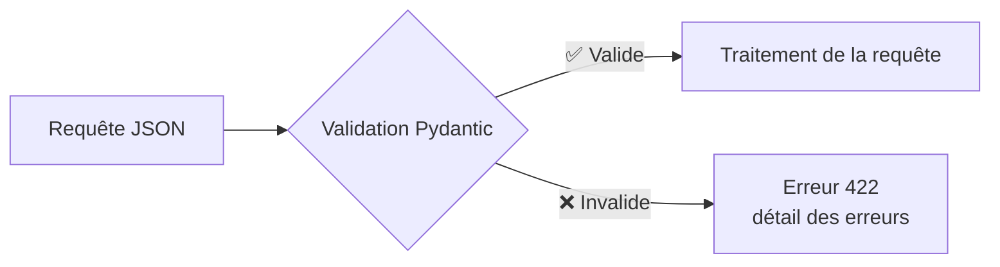

</details>

<p align="right"><a href="#top">↑ Retour en haut</a></p>

---

<a id="section-6"></a>

<details>
<summary>6 - L'endpoint POST /predict en détail</summary>

### Le code complet

```python
@app.post("/predict", response_model=PredictionResponse, tags=["Prediction"])
async def predict(request: PredictionRequest):
    if model is None:
        raise HTTPException(status_code=503, detail="Le modèle n'est pas chargé")

    features = np.array(
        [[request.sepal_length, request.sepal_width, request.petal_length, request.petal_width]]
    )

    prediction = model.predict(features)[0]
    probabilities = model.predict_proba(features)[0]

    target_names = metadata["target_names"]
    species = target_names[prediction]
    confidence = float(probabilities[prediction])

    prob_dict = {name: round(float(p), 4) for name, p in zip(target_names, probabilities)}

    return PredictionResponse(
        species=species,
        confidence=round(confidence, 4),
        probabilities=prob_dict,
    )
```

### Décomposition étape par étape

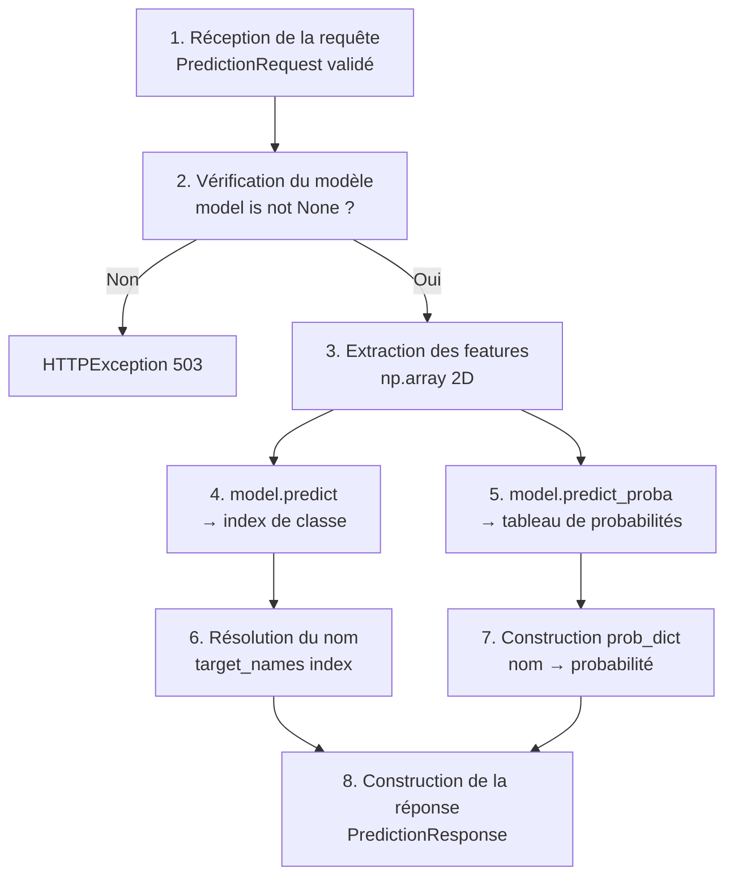

### Étape 1 : Réception et validation

```python
async def predict(request: PredictionRequest):
```

FastAPI parse automatiquement le body JSON et le valide selon le schéma `PredictionRequest`. Si la validation échoue, une erreur 422 est renvoyée avant même que le code de la fonction ne s'exécute.

### Étape 2 : Vérification de sécurité

```python
if model is None:
    raise HTTPException(status_code=503, detail="Le modèle n'est pas chargé")
```

Le code **503 Service Unavailable** signale que le serveur est temporairement incapable de traiter la requête.

### Étape 3 : Construction du vecteur de features

```python
features = np.array(
    [[request.sepal_length, request.sepal_width, request.petal_length, request.petal_width]]
)
```

scikit-learn attend un tableau NumPy 2D de forme `(n_samples, n_features)`. Ici, on prédit pour un seul échantillon, donc la forme est `(1, 4)`.

### Étape 4-5 : Prédiction

```python
prediction = model.predict(features)[0]        # → int (index de classe, ex: 0)
probabilities = model.predict_proba(features)[0] # → array [0.97, 0.02, 0.01]
```

| Méthode | Retour | Exemple |
|---------|--------|---------|
| `predict()` | Index de la classe prédite | `0` (setosa) |
| `predict_proba()` | Tableau de probabilités pour chaque classe | `[0.97, 0.02, 0.01]` |

### Étape 6-7 : Résolution et formatage

```python
target_names = metadata["target_names"]     # ["setosa", "versicolor", "virginica"]
species = target_names[prediction]           # "setosa"
confidence = float(probabilities[prediction]) # 0.97

prob_dict = {name: round(float(p), 4) for name, p in zip(target_names, probabilities)}
# {"setosa": 0.97, "versicolor": 0.02, "virginica": 0.01}
```

### Étape 8 : Réponse structurée

```python
return PredictionResponse(
    species=species,
    confidence=round(confidence, 4),
    probabilities=prob_dict,
)
```

Exemple de réponse JSON :

```json
{
  "species": "setosa",
  "confidence": 0.97,
  "probabilities": {
    "setosa": 0.97,
    "versicolor": 0.02,
    "virginica": 0.01
  }
}
```

</details>

<p align="right"><a href="#top">↑ Retour en haut</a></p>

---

<a id="section-7"></a>

<details>
<summary>7 - Les endpoints informatifs</summary>

### Vue d'ensemble

| Endpoint | Méthode | Description |
|----------|---------|-------------|
| `/model/info` | GET | Métadonnées du modèle (type, accuracy, features, importances) |
| `/dataset/samples` | GET | 10 échantillons aléatoires du dataset Iris |
| `/dataset/stats` | GET | Statistiques descriptives du dataset |

### GET /model/info

```python
class ModelInfoResponse(BaseModel):
    model_config = {"protected_namespaces": ()}

    model_type: str
    accuracy: float
    feature_names: list[str]
    target_names: list[str]
    feature_importances: dict[str, float]
    training_samples: int
    test_samples: int


@app.get("/model/info", response_model=ModelInfoResponse, tags=["Model"])
async def model_info():
    if metadata is None:
        raise HTTPException(status_code=503, detail="Les métadonnées ne sont pas chargées")
    return ModelInfoResponse(**metadata)
```

**Points clés :**
- `protected_namespaces = ()` est nécessaire car Pydantic v2 réserve le préfixe `model_` par défaut. Sans cette configuration, un champ `model_type` provoquerait un avertissement.
- `**metadata` décompresse le dictionnaire JSON directement dans le constructeur Pydantic.

**Exemple de réponse :**

```json
{
  "model_type": "RandomForestClassifier",
  "accuracy": 0.9333,
  "feature_names": ["sepal length (cm)", "sepal width (cm)", "petal length (cm)", "petal width (cm)"],
  "target_names": ["setosa", "versicolor", "virginica"],
  "feature_importances": {
    "sepal length (cm)": 0.116,
    "sepal width (cm)": 0.014,
    "petal length (cm)": 0.432,
    "petal width (cm)": 0.438
  },
  "training_samples": 120,
  "test_samples": 30
}
```

### GET /dataset/samples

```python
class DatasetSample(BaseModel):
    sepal_length: float
    sepal_width: float
    petal_length: float
    petal_width: float
    species: str


@app.get("/dataset/samples", response_model=list[DatasetSample], tags=["Dataset"])
async def dataset_samples():
    from sklearn.datasets import load_iris
    import pandas as pd

    iris = load_iris()
    df = pd.DataFrame(data=iris.data, columns=iris.feature_names)
    df["species"] = [iris.target_names[t] for t in iris.target]

    samples = df.sample(n=10, random_state=None).reset_index(drop=True)

    return [
        DatasetSample(
            sepal_length=row["sepal length (cm)"],
            sepal_width=row["sepal width (cm)"],
            petal_length=row["petal length (cm)"],
            petal_width=row["petal width (cm)"],
            species=row["species"],
        )
        for _, row in samples.iterrows()
    ]
```

**Points clés :**
- `random_state=None` → les échantillons sont **différents** à chaque appel
- Le dataset Iris est chargé à la volée depuis scikit-learn (pas besoin de fichier CSV)
- `response_model=list[DatasetSample]` assure la validation de la réponse

### GET /dataset/stats

```python
@app.get("/dataset/stats", tags=["Dataset"])
async def dataset_stats():
    from sklearn.datasets import load_iris
    import pandas as pd

    iris = load_iris()
    df = pd.DataFrame(data=iris.data, columns=iris.feature_names)
    df["species"] = [iris.target_names[t] for t in iris.target]

    stats = {
        "total_samples": len(df),
        "features_count": len(iris.feature_names),
        "species_count": len(iris.target_names),
        "species_distribution": df["species"].value_counts().to_dict(),
        "feature_stats": {},
    }

    for col in iris.feature_names:
        stats["feature_stats"][col] = {
            "min": round(float(df[col].min()), 2),
            "max": round(float(df[col].max()), 2),
            "mean": round(float(df[col].mean()), 2),
            "std": round(float(df[col].std()), 2),
        }

    return stats
```

**Exemple de réponse :**

```json
{
  "total_samples": 150,
  "features_count": 4,
  "species_count": 3,
  "species_distribution": {
    "setosa": 50,
    "versicolor": 50,
    "virginica": 50
  },
  "feature_stats": {
    "sepal length (cm)": {"min": 4.3, "max": 7.9, "mean": 5.84, "std": 0.83},
    "sepal width (cm)":  {"min": 2.0, "max": 4.4, "mean": 3.06, "std": 0.44},
    "petal length (cm)": {"min": 1.0, "max": 6.9, "mean": 3.76, "std": 1.77},
    "petal width (cm)":  {"min": 0.1, "max": 2.5, "mean": 1.2,  "std": 0.76}
  }
}
```

### Récapitulatif des endpoints

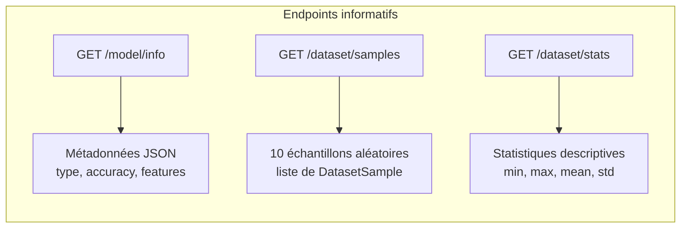

</details>

<p align="right"><a href="#top">↑ Retour en haut</a></p>

---

<a id="section-8"></a>

<details>
<summary>8 - CORS — Cross-Origin Resource Sharing</summary>

### Le problème

Par défaut, un navigateur web **bloque** les requêtes HTTP envoyées depuis un domaine différent de celui du serveur. C'est la **Same-Origin Policy**.

Par exemple :
- Votre front-end Flutter Web tourne sur `http://localhost:3000`
- Votre API FastAPI tourne sur `http://localhost:8000`

Le navigateur considère ces deux adresses comme des **origines différentes** et bloque la requête.

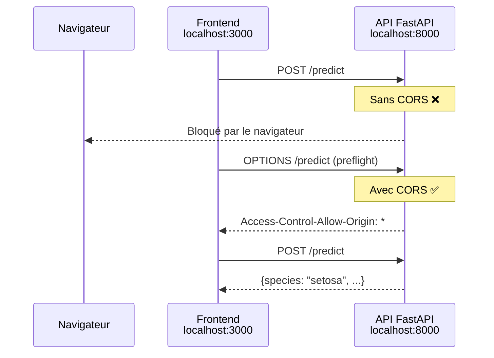

### La solution : CORSMiddleware

```python
app.add_middleware(
    CORSMiddleware,
    allow_origins=["*"],
    allow_credentials=True,
    allow_methods=["*"],
    allow_headers=["*"],
)
```

### Explication des paramètres

| Paramètre | Valeur | Signification |
|-----------|--------|---------------|
| `allow_origins` | `["*"]` | Accepte les requêtes depuis **n'importe quelle** origine |
| `allow_credentials` | `True` | Autorise l'envoi de cookies et d'en-têtes d'authentification |
| `allow_methods` | `["*"]` | Autorise tous les verbes HTTP (GET, POST, PUT, DELETE…) |
| `allow_headers` | `["*"]` | Autorise tous les en-têtes personnalisés |

### En production

> **Attention** : `allow_origins=["*"]` est pratique en développement mais **dangereux en production**. Il faut restreindre à vos domaines spécifiques :

```python
allow_origins=[
    "https://mon-app.com",
    "https://admin.mon-app.com",
]
```

</details>

<p align="right"><a href="#top">↑ Retour en haut</a></p>

---

<a id="section-9"></a>

<details>
<summary>9 - Swagger UI — Documentation automatique</summary>

### Génération automatique

FastAPI génère **automatiquement** une documentation interactive basée sur le standard **OpenAPI**. Il suffit d'ouvrir votre navigateur.

| URL | Interface | Description |
|-----|-----------|-------------|
| `http://localhost:8000/docs` | **Swagger UI** | Interface interactive pour tester les endpoints |
| `http://localhost:8000/redoc` | **ReDoc** | Documentation alternative en lecture seule |
| `http://localhost:8000/openapi.json` | **OpenAPI JSON** | Spécification brute au format JSON |

### Comment c'est possible ?

FastAPI analyse automatiquement :

1. **Les décorateurs** (`@app.get`, `@app.post`) → détermine les routes et méthodes
2. **Les type hints** (`request: PredictionRequest`) → schéma du body
3. **Les `response_model`** → schéma de la réponse
4. **Les `Field()`** → contraintes et descriptions
5. **Les `model_config`** → exemples pré-remplis
6. **Les `tags`** → regroupement des endpoints par catégorie

### Utilisation de Swagger UI

Dans Swagger UI (`/docs`), vous pouvez :

1. **Explorer** — voir tous les endpoints groupés par tags (Health, Prediction, Model, Dataset)
2. **Tester** — cliquer sur "Try it out", modifier le JSON, puis "Execute"
3. **Voir les schémas** — en bas de page, tous les modèles Pydantic sont documentés
4. **Copier les commandes curl** — Swagger affiche la commande curl correspondante

### Configuration dans notre projet

```python
app = FastAPI(
    title="Iris Flower Prediction API",
    description="API de prédiction d'espèces de fleurs Iris basée sur un modèle Random Forest",
    version="1.0.0",
)
```

Ces trois paramètres apparaissent directement dans l'en-tête de la page Swagger :
- **title** → titre principal affiché
- **description** → paragraphe descriptif sous le titre
- **version** → numéro de version affiché

</details>

<p align="right"><a href="#top">↑ Retour en haut</a></p>

---

<a id="section-10"></a>

<details>
<summary>10 - Tester l'API avec curl et PowerShell</summary>

### Prérequis

Assurez-vous que le serveur est lancé :

```bash
cd backend
uvicorn main:app --reload --host 0.0.0.0 --port 8000
```

---

### Avec `curl` (Linux / macOS / Git Bash)

#### Health check

```bash
curl http://localhost:8000/
```

```json
{"status":"ok","message":"Iris Prediction API is running"}
```

#### Vérifier l'état du modèle

```bash
curl http://localhost:8000/health
```

```json
{"status":"healthy","model_loaded":true}
```

#### Faire une prédiction

```bash
curl -X POST http://localhost:8000/predict \
  -H "Content-Type: application/json" \
  -d '{"sepal_length":5.1,"sepal_width":3.5,"petal_length":1.4,"petal_width":0.2}'
```

```json
{"species":"setosa","confidence":0.97,"probabilities":{"setosa":0.97,"versicolor":0.02,"virginica":0.01}}
```

#### Informations du modèle

```bash
curl http://localhost:8000/model/info
```

#### Échantillons du dataset

```bash
curl http://localhost:8000/dataset/samples
```

#### Statistiques du dataset

```bash
curl http://localhost:8000/dataset/stats
```

---

### Avec PowerShell (Windows)

#### Health check

```powershell
Invoke-RestMethod -Uri http://localhost:8000/
```

#### Vérifier l'état du modèle

```powershell
Invoke-RestMethod -Uri http://localhost:8000/health
```

#### Faire une prédiction

```powershell
$body = @{
    sepal_length = 5.1
    sepal_width  = 3.5
    petal_length = 1.4
    petal_width  = 0.2
} | ConvertTo-Json

Invoke-RestMethod -Uri http://localhost:8000/predict `
    -Method POST `
    -ContentType "application/json" `
    -Body $body
```

#### Informations du modèle

```powershell
Invoke-RestMethod -Uri http://localhost:8000/model/info
```

#### Échantillons du dataset

```powershell
Invoke-RestMethod -Uri http://localhost:8000/dataset/samples
```

#### Statistiques du dataset

```powershell
Invoke-RestMethod -Uri http://localhost:8000/dataset/stats
```

---

### Tableau récapitulatif des endpoints

| Endpoint | Méthode | Body requis | Code succès |
|----------|---------|-------------|-------------|
| `/` | GET | Non | 200 |
| `/health` | GET | Non | 200 |
| `/predict` | POST | Oui (JSON) | 200 |
| `/model/info` | GET | Non | 200 |
| `/dataset/samples` | GET | Non | 200 |
| `/dataset/stats` | GET | Non | 200 |

</details>

<p align="right"><a href="#top">↑ Retour en haut</a></p>

---

<a id="section-11"></a>

<details>
<summary>11 - Gestion des erreurs</summary>

### Les erreurs gérées dans notre API

Notre API gère trois types d'erreurs principales :

| Code HTTP | Situation | Message |
|-----------|-----------|---------|
| **422** | Validation Pydantic échouée | Détail automatique des champs invalides |
| **503** | Modèle non chargé | `"Le modèle n'est pas chargé"` |
| **503** | Métadonnées non chargées | `"Les métadonnées ne sont pas chargées"` |

### HTTPException

FastAPI fournit la classe `HTTPException` pour lever des erreurs HTTP propres :

```python
from fastapi import HTTPException

if model is None:
    raise HTTPException(status_code=503, detail="Le modèle n'est pas chargé")
```

La réponse renvoyée au client :

```json
{
  "detail": "Le modèle n'est pas chargé"
}
```

### Erreur 422 — Validation Pydantic

Cette erreur est gérée **automatiquement** par FastAPI. Pas besoin d'écrire du code.

Exemple — envoi d'une valeur hors limites :

```json
{
  "sepal_length": 50.0,
  "sepal_width": 3.5,
  "petal_length": 1.4,
  "petal_width": 0.2
}
```

Réponse :

```json
{
  "detail": [
    {
      "type": "less_than_equal",
      "loc": ["body", "sepal_length"],
      "msg": "Input should be less than or equal to 10",
      "input": 50.0,
      "ctx": {"le": 10}
    }
  ]
}
```

### Erreur 503 — Service Unavailable

Cette erreur survient si le modèle n'a pas pu être chargé au démarrage (fichier manquant, corruption…) mais que le serveur a quand même démarré par un autre mécanisme.

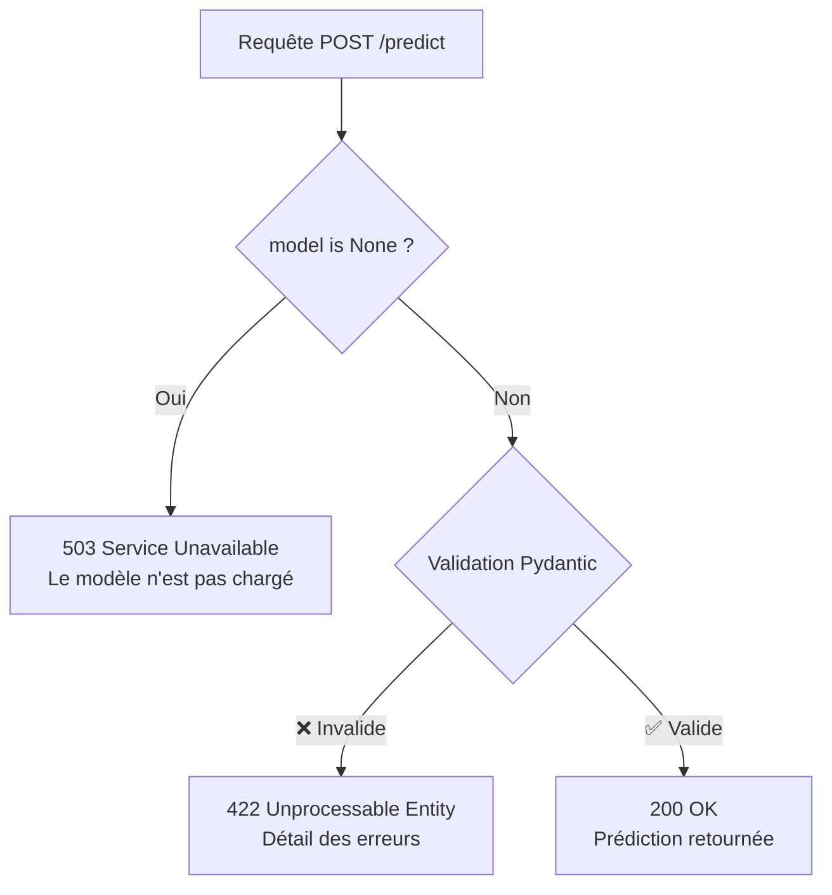

### Que se passe-t-il si le fichier modèle est absent au démarrage ?

La fonction `load_model()` lève une `RuntimeError` :

```python
raise RuntimeError(
    f"Modèle non trouvé à {MODEL_PATH}. "
    "Exécutez d'abord le notebook train_model.ipynb"
)
```

Comme cette erreur survient dans le `startup_event`, **le serveur ne démarre pas du tout** — c'est le comportement souhaité (fail-fast).

</details>

<p align="right"><a href="#top">↑ Retour en haut</a></p>

---

<a id="section-12"></a>

<details>
<summary>12 - Résumé et bonnes pratiques</summary>

### Ce que nous avons couvert

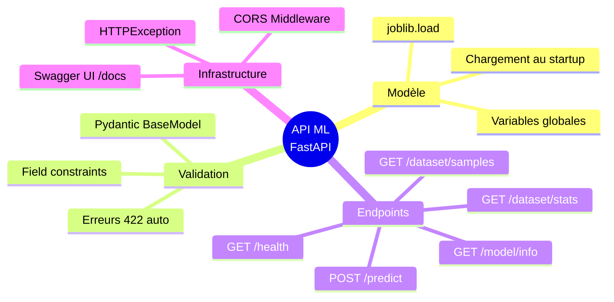

### Bonnes pratiques

#### 1. Gestion des erreurs

| Pratique | Pourquoi |
|----------|----------|
| Toujours vérifier `model is not None` avant de prédire | Évite les `NoneType` errors |
| Utiliser `HTTPException` avec des codes HTTP appropriés | Le client peut réagir correctement |
| Valider les entrées avec Pydantic `Field` | Empêche les données aberrantes |
| Fail-fast au démarrage si le modèle est absent | Mieux vaut ne pas démarrer qu'un serveur cassé |

#### 2. Logging

En production, ajoutez du logging pour tracer les prédictions :

```python
import logging

logger = logging.getLogger(__name__)

@app.post("/predict")
async def predict(request: PredictionRequest):
    logger.info(f"Prédiction demandée : {request.model_dump()}")
    # ... prédiction ...
    logger.info(f"Résultat : {species} (confiance: {confidence})")
    return response
```

#### 3. Versionnement du modèle

| Stratégie | Implémentation |
|-----------|----------------|
| Version dans les métadonnées | Ajouter `"version": "1.0.0"` dans `model_metadata.json` |
| Prefix de route | `/v1/predict`, `/v2/predict` |
| Header personnalisé | `X-Model-Version: 1.0.0` dans la réponse |

#### 4. Checklist de déploiement

- [ ] Restreindre `allow_origins` aux domaines autorisés
- [ ] Activer le logging structuré
- [ ] Configurer un health check pour le load balancer
- [ ] Monter le modèle `.joblib` en volume (Docker)
- [ ] Versionner les métadonnées du modèle
- [ ] Ajouter des tests unitaires pour chaque endpoint
- [ ] Configurer les timeouts Uvicorn
- [ ] Mettre en place un monitoring des performances

### Architecture cible en production

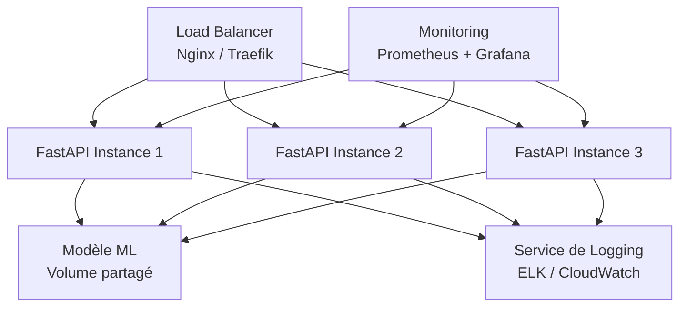

### Commande finale pour lancer le projet

```bash
cd backend
uvicorn main:app --reload --host 0.0.0.0 --port 8000
```

Puis ouvrez `http://localhost:8000/docs` pour explorer votre API.

</details>

<p align="right"><a href="#top">↑ Retour en haut</a></p>

---

> **Auteur** : Cours généré pour le projet *Full App Pandas — Iris Prediction*  
> **Dernière mise à jour** : Avril 2026
