<a id="top"></a>

# Flutter — Consommer une API REST (FastAPI Backend)

> **Projet** : Iris ML Demo — Une application Flutter complète qui consomme une API REST FastAPI pour la classification de fleurs Iris avec un modèle de Machine Learning.

---

## Table des matières

| N° | Section | Description |
|----|---------|-------------|
| 1 | [Introduction — Flutter et la consommation d'API](#section-1) | Pourquoi Flutter + API REST |
| 2 | [Structure du projet Flutter](#section-2) | Arborescence et dépendances |
| 3 | [Les modèles de données Dart](#section-3) | Classes, factory constructors, sérialisation JSON |
| 4 | [Le service API](#section-4) | Client HTTP, async/await, gestion des erreurs |
| 5 | [L'écran de prédiction](#section-5) | Sliders, formulaire, appel API, affichage du résultat |
| 6 | [L'écran d'information du modèle](#section-6) | Précision, importance des features, données d'entraînement |
| 7 | [L'écran du dataset](#section-7) | Statistiques, distribution, DataTable, appels parallèles |
| 8 | [Les widgets réutilisables](#section-8) | ProbabilityChart — conception de composants modulaires |
| 9 | [Navigation avec NavigationBar](#section-9) | Material 3, navigation par onglets |
| 10 | [Indicateur de connexion API](#section-10) | Health check, Chip widget, état vert/rouge |
| 11 | [Gestion des erreurs côté frontend](#section-11) | try/catch, états d'erreur, retry, loading |
| 12 | [Bonnes pratiques Flutter](#section-12) | Séparation des responsabilités, const, key |
| 13 | [Conclusion — Le flux complet](#section-13) | Diagramme de séquence, récapitulatif |

---

<a id="section-1"></a>
<details>
<summary><strong>1 — Introduction — Flutter et la consommation d'API</strong></summary>

### Qu'est-ce que Flutter ?

Flutter est un framework open-source de Google permettant de créer des applications **nativement compilées** pour mobile, web et desktop à partir d'une **seule base de code** écrite en Dart.

### Pourquoi Flutter est excellent pour consommer des APIs

| Avantage | Détail |
|----------|--------|
| **Dart async/await** | Syntaxe claire et lisible pour les appels réseau asynchrones |
| **Sérialisation JSON native** | `dart:convert` intégré — pas de bibliothèque externe nécessaire |
| **Hot Reload** | Itération rapide lors du développement de l'interface |
| **Material Design 3** | Composants UI modernes prêts à l'emploi |
| **Multi-plateforme** | Un seul code pour Android, iOS, Web, Desktop |

### Material Design 3 dans notre projet

Notre application utilise **Material Design 3** (Material You), activé par `useMaterial3: true` dans le thème. Cela apporte :

- Des **composants modernisés** (NavigationBar, Chip, ElevatedButton)
- Un **système de couleurs dynamique** basé sur `colorSchemeSeed`
- Des **formes arrondies** et une typographie améliorée

### Architecture de l'application

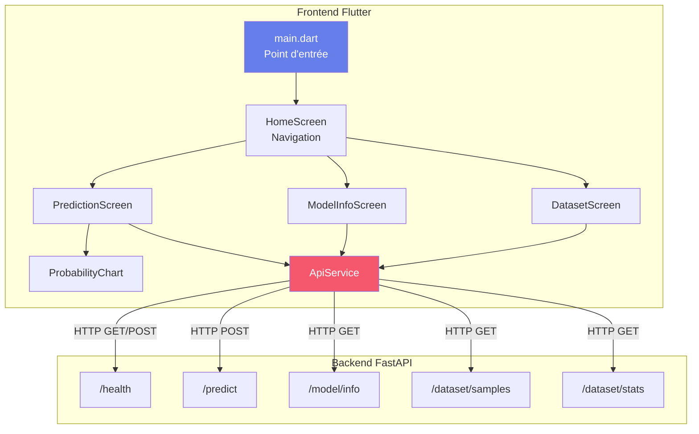

### Les 5 endpoints de notre API

| Méthode | Endpoint | Description | Utilisé par |
|---------|----------|-------------|-------------|
| `GET` | `/health` | Vérifier que l'API est en ligne | `HomeScreen` |
| `POST` | `/predict` | Prédire l'espèce d'une fleur | `PredictionScreen` |
| `GET` | `/model/info` | Informations sur le modèle ML | `ModelInfoScreen` |
| `GET` | `/dataset/samples` | Échantillons aléatoires du dataset | `DatasetScreen` |
| `GET` | `/dataset/stats` | Statistiques du dataset | `DatasetScreen` |

</details>

<p align="right"><a href="#top">↑ Back to top</a></p>

---

<a id="section-2"></a>
<details>
<summary><strong>2 — Structure du projet Flutter</strong></summary>

### Arborescence du projet

```
frontend/
├── lib/
│   ├── main.dart                  # Point d'entrée + HomeScreen + Navigation
│   ├── models/
│   │   └── iris_models.dart       # Classes de données (Request, Response, ModelInfo, Sample)
│   ├── services/
│   │   └── api_service.dart       # Client HTTP — toutes les méthodes d'appel API
│   ├── screens/
│   │   ├── prediction_screen.dart # Écran de prédiction (sliders + résultat)
│   │   ├── model_info_screen.dart # Écran d'information du modèle (précision, features)
│   │   └── dataset_screen.dart    # Écran du dataset (stats, table, distribution)
│   └── widgets/
│       └── probability_chart.dart # Widget réutilisable — barres de probabilités
├── pubspec.yaml                   # Dépendances du projet
└── test/
```

### Organisation en couches

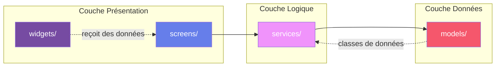

### Le fichier `pubspec.yaml` — Dépendances

```yaml
name: frontend
description: "A new Flutter project."
publish_to: 'none'
version: 1.0.0+1

environment:
  sdk: ^3.8.0

dependencies:
  flutter:
    sdk: flutter
  cupertino_icons: ^1.0.8
  http: ^1.2.0
  fl_chart: ^0.70.0
  google_fonts: ^6.2.1
```

### Détail des dépendances

| Package | Version | Rôle |
|---------|---------|------|
| `http` | ^1.2.0 | Client HTTP pour les requêtes GET/POST vers l'API |
| `fl_chart` | ^0.70.0 | Bibliothèque de graphiques (barres, lignes, camemberts) |
| `google_fonts` | ^6.2.1 | Polices Google typographiques pour l'UI |
| `cupertino_icons` | ^1.0.8 | Icônes style iOS |

> **Note** : Le package `http` est le client HTTP officiel recommandé par l'équipe Dart. Il est léger, simple d'utilisation et couvre la majorité des besoins.

### Installation des dépendances

```bash
cd frontend
flutter pub get
```

</details>

<p align="right"><a href="#top">↑ Back to top</a></p>

---

<a id="section-3"></a>
<details>
<summary><strong>3 — Les modèles de données Dart</strong></summary>

### Pourquoi des classes de données ?

En Dart, les modèles de données servent à :
- **Typer fortement** les données échangées avec l'API
- **Sérialiser** (Dart → JSON) et **désérialiser** (JSON → Dart) les réponses
- **Documenter** la structure attendue des données
- **Détecter les erreurs** à la compilation plutôt qu'à l'exécution

### Le pattern fromJson / toJson

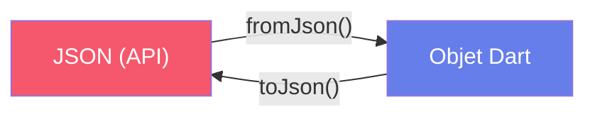

### Fichier complet : `iris_models.dart`

```dart
class PredictionRequest {
  final double sepalLength;
  final double sepalWidth;
  final double petalLength;
  final double petalWidth;

  PredictionRequest({
    required this.sepalLength,
    required this.sepalWidth,
    required this.petalLength,
    required this.petalWidth,
  });

  Map<String, dynamic> toJson() => {
        'sepal_length': sepalLength,
        'sepal_width': sepalWidth,
        'petal_length': petalLength,
        'petal_width': petalWidth,
      };
}

class PredictionResponse {
  final String species;
  final double confidence;
  final Map<String, double> probabilities;

  PredictionResponse({
    required this.species,
    required this.confidence,
    required this.probabilities,
  });

  factory PredictionResponse.fromJson(Map<String, dynamic> json) {
    return PredictionResponse(
      species: json['species'],
      confidence: (json['confidence'] as num).toDouble(),
      probabilities: (json['probabilities'] as Map<String, dynamic>)
          .map((k, v) => MapEntry(k, (v as num).toDouble())),
    );
  }
}

class ModelInfo {
  final String modelType;
  final double accuracy;
  final List<String> featureNames;
  final List<String> targetNames;
  final Map<String, double> featureImportances;
  final int trainingSamples;
  final int testSamples;

  ModelInfo({
    required this.modelType,
    required this.accuracy,
    required this.featureNames,
    required this.targetNames,
    required this.featureImportances,
    required this.trainingSamples,
    required this.testSamples,
  });

  factory ModelInfo.fromJson(Map<String, dynamic> json) {
    return ModelInfo(
      modelType: json['model_type'],
      accuracy: (json['accuracy'] as num).toDouble(),
      featureNames: List<String>.from(json['feature_names']),
      targetNames: List<String>.from(json['target_names']),
      featureImportances: (json['feature_importances'] as Map<String, dynamic>)
          .map((k, v) => MapEntry(k, (v as num).toDouble())),
      trainingSamples: json['training_samples'],
      testSamples: json['test_samples'],
    );
  }
}

class DatasetSample {
  final double sepalLength;
  final double sepalWidth;
  final double petalLength;
  final double petalWidth;
  final String species;

  DatasetSample({
    required this.sepalLength,
    required this.sepalWidth,
    required this.petalLength,
    required this.petalWidth,
    required this.species,
  });

  factory DatasetSample.fromJson(Map<String, dynamic> json) {
    return DatasetSample(
      sepalLength: (json['sepal_length'] as num).toDouble(),
      sepalWidth: (json['sepal_width'] as num).toDouble(),
      petalLength: (json['petal_length'] as num).toDouble(),
      petalWidth: (json['petal_width'] as num).toDouble(),
      species: json['species'],
    );
  }
}
```

### Analyse détaillée des 4 classes

#### 1. `PredictionRequest` — Données envoyées à l'API

Cette classe a **uniquement** `toJson()` car on envoie des données vers l'API (sérialisation).

```dart
Map<String, dynamic> toJson() => {
      'sepal_length': sepalLength,
      'sepal_width': sepalWidth,
      'petal_length': petalLength,
      'petal_width': petalWidth,
    };
```

> **Remarque** : Les noms des clés JSON (`sepal_length`) utilisent le **snake_case** (convention Python/API) tandis que les propriétés Dart (`sepalLength`) utilisent le **camelCase** (convention Dart). La méthode `toJson()` effectue cette traduction.

#### 2. `PredictionResponse` — Données reçues de l'API

Cette classe a **uniquement** `fromJson()` car on reçoit des données de l'API (désérialisation).

```dart
factory PredictionResponse.fromJson(Map<String, dynamic> json) {
  return PredictionResponse(
    species: json['species'],
    confidence: (json['confidence'] as num).toDouble(),
    probabilities: (json['probabilities'] as Map<String, dynamic>)
        .map((k, v) => MapEntry(k, (v as num).toDouble())),
  );
}
```

**Points clés :**
- Le mot-clé `factory` permet de créer un constructeur qui ne crée pas toujours une nouvelle instance
- `(json['confidence'] as num).toDouble()` — Convertit en `double` de manière sûre, que la valeur JSON soit un `int` ou un `double`
- `.map((k, v) => MapEntry(k, (v as num).toDouble()))` — Transforme une `Map<String, dynamic>` en `Map<String, double>`

#### 3. `ModelInfo` — Informations complètes du modèle

La classe la plus riche, démontrant la désérialisation de types variés :

| Propriété | Type Dart | Conversion |
|-----------|-----------|------------|
| `modelType` | `String` | Directe |
| `accuracy` | `double` | `(num).toDouble()` |
| `featureNames` | `List<String>` | `List<String>.from()` |
| `targetNames` | `List<String>` | `List<String>.from()` |
| `featureImportances` | `Map<String, double>` | `.map()` avec `MapEntry` |
| `trainingSamples` | `int` | Directe |
| `testSamples` | `int` | Directe |

#### 4. `DatasetSample` — Un échantillon du dataset

Combine des propriétés numériques et une chaîne de caractères. Utilise le même pattern `factory fromJson`.

### Correspondance JSON ↔ Dart

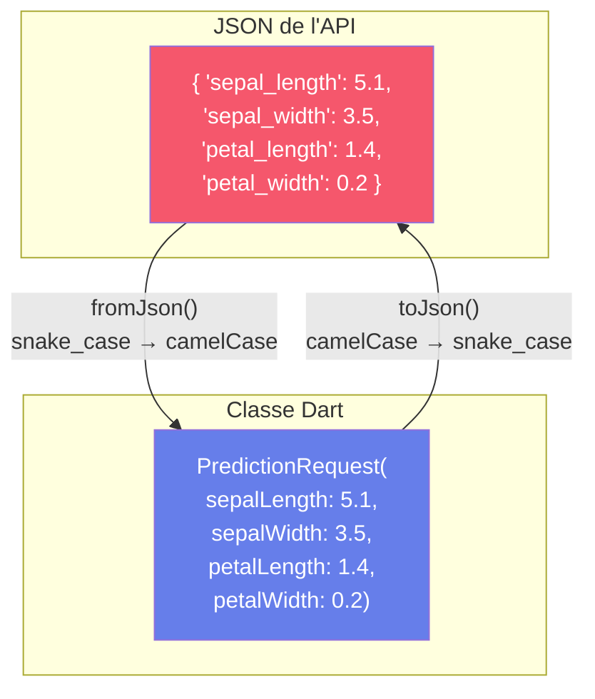

</details>

<p align="right"><a href="#top">↑ Back to top</a></p>

---

<a id="section-4"></a>
<details>
<summary><strong>4 — Le service API</strong></summary>

### Rôle du service API

Le fichier `api_service.dart` centralise **tous les appels réseau** de l'application. C'est le seul point de contact entre Flutter et le backend FastAPI.

### Principes clés

| Concept | Description |
|---------|-------------|
| **Centralisation** | Un seul fichier pour tous les appels API |
| **async/await** | Syntaxe asynchrone lisible de Dart |
| **json.encode/decode** | Sérialisation/désérialisation JSON |
| **Gestion des erreurs** | Exceptions typées selon le code HTTP |

### Code complet : `api_service.dart`

```dart
import 'dart:convert';
import 'package:http/http.dart' as http;
import '../models/iris_models.dart';

class ApiService {
  static const String baseUrl = 'http://localhost:8000';

  Future<bool> healthCheck() async {
    try {
      final response = await http.get(Uri.parse('$baseUrl/health'));
      if (response.statusCode == 200) {
        final data = json.decode(response.body);
        return data['status'] == 'healthy';
      }
      return false;
    } catch (e) {
      return false;
    }
  }

  Future<PredictionResponse> predict(PredictionRequest request) async {
    final response = await http.post(
      Uri.parse('$baseUrl/predict'),
      headers: {'Content-Type': 'application/json'},
      body: json.encode(request.toJson()),
    );

    if (response.statusCode == 200) {
      return PredictionResponse.fromJson(json.decode(response.body));
    } else {
      throw Exception('Erreur de prédiction: ${response.statusCode}');
    }
  }

  Future<ModelInfo> getModelInfo() async {
    final response = await http.get(Uri.parse('$baseUrl/model/info'));

    if (response.statusCode == 200) {
      return ModelInfo.fromJson(json.decode(response.body));
    } else {
      throw Exception('Erreur: ${response.statusCode}');
    }
  }

  Future<List<DatasetSample>> getDatasetSamples() async {
    final response = await http.get(Uri.parse('$baseUrl/dataset/samples'));

    if (response.statusCode == 200) {
      final List<dynamic> data = json.decode(response.body);
      return data.map((e) => DatasetSample.fromJson(e)).toList();
    } else {
      throw Exception('Erreur: ${response.statusCode}');
    }
  }

  Future<Map<String, dynamic>> getDatasetStats() async {
    final response = await http.get(Uri.parse('$baseUrl/dataset/stats'));

    if (response.statusCode == 200) {
      return json.decode(response.body);
    } else {
      throw Exception('Erreur: ${response.statusCode}');
    }
  }
}
```

### Analyse méthode par méthode

#### `healthCheck()` — Vérification de la connexion

```dart
Future<bool> healthCheck() async {
  try {
    final response = await http.get(Uri.parse('$baseUrl/health'));
    if (response.statusCode == 200) {
      final data = json.decode(response.body);
      return data['status'] == 'healthy';
    }
    return false;
  } catch (e) {
    return false;
  }
}
```

**Pourquoi retourner `bool` ?** Cette méthode est utilisée uniquement pour savoir si l'API est joignable. Le `try/catch` englobe tout car une exception réseau (serveur éteint, timeout) doit simplement retourner `false`, pas faire crasher l'app.

#### `predict()` — Requête POST avec un corps JSON

```dart
Future<PredictionResponse> predict(PredictionRequest request) async {
  final response = await http.post(
    Uri.parse('$baseUrl/predict'),
    headers: {'Content-Type': 'application/json'},
    body: json.encode(request.toJson()),
  );

  if (response.statusCode == 200) {
    return PredictionResponse.fromJson(json.decode(response.body));
  } else {
    throw Exception('Erreur de prédiction: ${response.statusCode}');
  }
}
```

**Flux des données :**

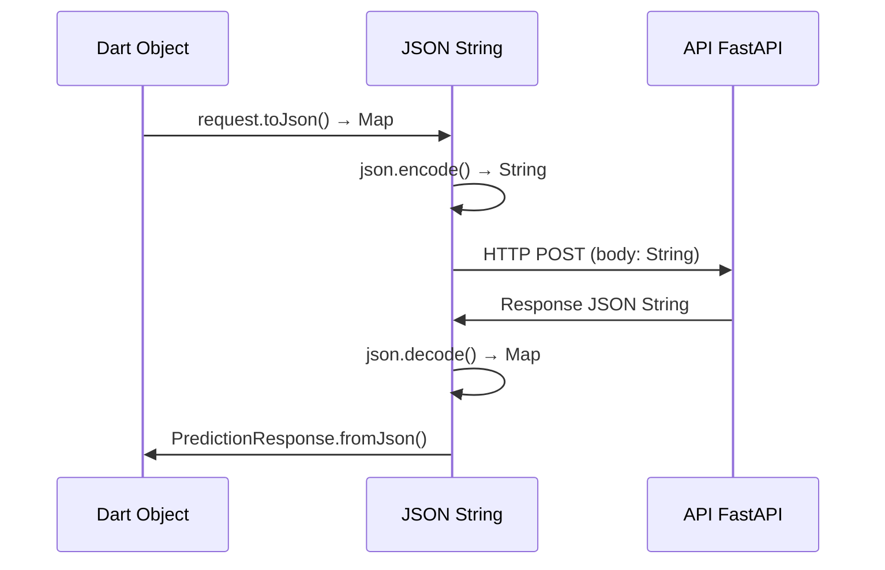

**Points importants :**
1. `headers: {'Content-Type': 'application/json'}` — Indispensable pour que FastAPI comprenne le corps de la requête
2. `json.encode(request.toJson())` — Double conversion : Dart Object → Map → JSON String
3. `json.decode(response.body)` → `PredictionResponse.fromJson()` — Double conversion inverse

#### `getDatasetSamples()` — Désérialiser une liste JSON

```dart
Future<List<DatasetSample>> getDatasetSamples() async {
  final response = await http.get(Uri.parse('$baseUrl/dataset/samples'));

  if (response.statusCode == 200) {
    final List<dynamic> data = json.decode(response.body);
    return data.map((e) => DatasetSample.fromJson(e)).toList();
  } else {
    throw Exception('Erreur: ${response.statusCode}');
  }
}
```

Quand l'API retourne un **tableau JSON** `[{...}, {...}, ...]`, on doit :
1. Décoder en `List<dynamic>`
2. Utiliser `.map()` pour convertir chaque élément en `DatasetSample`
3. Appeler `.toList()` pour matérialiser la liste

### Tableau récapitulatif des méthodes

| Méthode | Verbe HTTP | Entrée | Sortie | Gestion erreur |
|---------|-----------|--------|--------|----------------|
| `healthCheck()` | GET | — | `bool` | try/catch → `false` |
| `predict()` | POST | `PredictionRequest` | `PredictionResponse` | throw Exception |
| `getModelInfo()` | GET | — | `ModelInfo` | throw Exception |
| `getDatasetSamples()` | GET | — | `List<DatasetSample>` | throw Exception |
| `getDatasetStats()` | GET | — | `Map<String, dynamic>` | throw Exception |

</details>

<p align="right"><a href="#top">↑ Back to top</a></p>

---

<a id="section-5"></a>
<details>
<summary><strong>5 — L'écran de prédiction</strong></summary>

### Vue d'ensemble

L'écran de prédiction (`prediction_screen.dart`) est le cœur de l'application. Il permet à l'utilisateur de :
1. **Ajuster** les 4 mesures d'une fleur via des **Sliders**
2. **Lancer** une prédiction en appuyant sur un bouton
3. **Voir** le résultat avec l'espèce prédite, un emoji, la confiance et les probabilités

### Architecture de l'écran

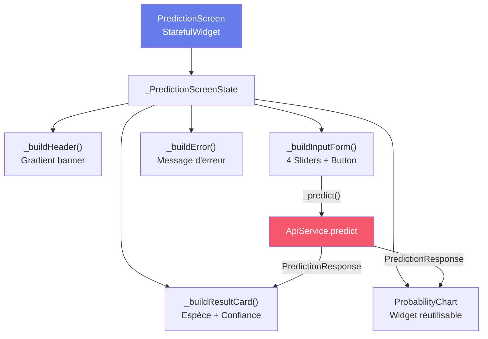

### Le cycle de vie StatefulWidget

`PredictionScreen` est un `StatefulWidget` car son contenu change au cours du temps (valeurs des sliders, résultat de la prédiction, état de chargement).

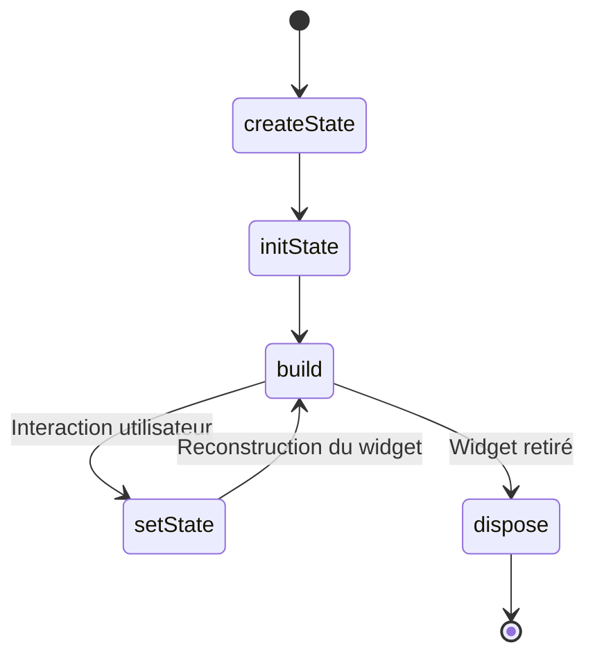

### Variables d'état

```dart
class _PredictionScreenState extends State<PredictionScreen> {
  final _apiService = ApiService();
  final _formKey = GlobalKey<FormState>();

  double _sepalLength = 5.1;
  double _sepalWidth = 3.5;
  double _petalLength = 1.4;
  double _petalWidth = 0.2;

  PredictionResponse? _prediction;
  bool _isLoading = false;
  String? _error;

  static const _speciesColors = {
    'setosa': Color(0xFF4CAF50),
    'versicolor': Color(0xFF2196F3),
    'virginica': Color(0xFF9C27B0),
  };

  static const _speciesIcons = {
    'setosa': '🌸',
    'versicolor': '🌺',
    'virginica': '🌷',
  };
```

| Variable | Type | Rôle |
|----------|------|------|
| `_apiService` | `ApiService` | Instance du client API |
| `_formKey` | `GlobalKey<FormState>` | Clé pour valider le formulaire |
| `_sepalLength/Width` | `double` | Valeurs des sliders sépales |
| `_petalLength/Width` | `double` | Valeurs des sliders pétales |
| `_prediction` | `PredictionResponse?` | Résultat (null si pas encore fait) |
| `_isLoading` | `bool` | Indicateur de chargement |
| `_error` | `String?` | Message d'erreur (null si OK) |
| `_speciesColors` | `Map` | Couleur associée à chaque espèce |
| `_speciesIcons` | `Map` | Emoji associé à chaque espèce |

### La méthode `_predict()` — Appel API

```dart
Future<void> _predict() async {
  if (!_formKey.currentState!.validate()) return;
  _formKey.currentState!.save();

  setState(() {
    _isLoading = true;
    _error = null;
  });

  try {
    final request = PredictionRequest(
      sepalLength: _sepalLength,
      sepalWidth: _sepalWidth,
      petalLength: _petalLength,
      petalWidth: _petalWidth,
    );
    final response = await _apiService.predict(request);
    setState(() {
      _prediction = response;
      _isLoading = false;
    });
  } catch (e) {
    setState(() {
      _error = e.toString();
      _isLoading = false;
    });
  }
}
```

**Flux d'exécution :**
1. Validation du formulaire
2. `setState` → loading = true (le `CircularProgressIndicator` apparaît)
3. Création de `PredictionRequest` avec les valeurs actuelles des sliders
4. Appel `_apiService.predict(request)` — **await** attend la réponse
5. `setState` → stockage du résultat et loading = false
6. En cas d'erreur : `setState` → stockage de l'erreur

### Le widget Slider personnalisé

```dart
Widget _buildSlider(
  String label,
  double value,
  double min,
  double max,
  ValueChanged<double> onChanged,
) {
  return Padding(
    padding: const EdgeInsets.only(bottom: 12),
    child: Column(
      crossAxisAlignment: CrossAxisAlignment.start,
      children: [
        Row(
          mainAxisAlignment: MainAxisAlignment.spaceBetween,
          children: [
            Text(label, style: const TextStyle(fontWeight: FontWeight.w500)),
            Container(
              padding:
                  const EdgeInsets.symmetric(horizontal: 10, vertical: 4),
              decoration: BoxDecoration(
                color: const Color(0xFF667eea).withValues(alpha: 0.1),
                borderRadius: BorderRadius.circular(8),
              ),
              child: Text(
                value.toStringAsFixed(1),
                style: const TextStyle(
                  fontWeight: FontWeight.bold,
                  color: Color(0xFF667eea),
                ),
              ),
            ),
          ],
        ),
        Slider(
          value: value,
          min: min,
          max: max,
          divisions: ((max - min) * 10).round(),
          activeColor: const Color(0xFF667eea),
          onChanged: onChanged,
        ),
      ],
    ),
  );
}
```

**Paramètres des 4 sliders :**

| Feature | Min | Max | Valeur initiale |
|---------|-----|-----|-----------------|
| Longueur sépale | 4.0 cm | 8.0 cm | 5.1 |
| Largeur sépale | 2.0 cm | 4.5 cm | 3.5 |
| Longueur pétale | 1.0 cm | 7.0 cm | 1.4 |
| Largeur pétale | 0.1 cm | 2.5 cm | 0.2 |

> `divisions: ((max - min) * 10).round()` — Permet un pas de 0.1 cm pour chaque slider.

### La carte de résultat

```dart
Widget _buildResultCard() {
  final species = _prediction!.species;
  final color = _speciesColors[species] ?? Colors.grey;
  final icon = _speciesIcons[species] ?? '🌼';
  final confidence = (_prediction!.confidence * 100).toStringAsFixed(1);

  return Card(
    elevation: 4,
    shape: RoundedRectangleBorder(borderRadius: BorderRadius.circular(16)),
    child: Container(
      padding: const EdgeInsets.all(24),
      decoration: BoxDecoration(
        borderRadius: BorderRadius.circular(16),
        gradient: LinearGradient(
          colors: [color.withValues(alpha: 0.1), color.withValues(alpha: 0.05)],
        ),
      ),
      child: Column(
        children: [
          Text(icon, style: const TextStyle(fontSize: 56)),
          const SizedBox(height: 12),
          Text(
            species.toUpperCase(),
            style: TextStyle(
              fontSize: 28,
              fontWeight: FontWeight.bold,
              color: color,
            ),
          ),
          const SizedBox(height: 8),
          Container(
            padding: const EdgeInsets.symmetric(horizontal: 16, vertical: 8),
            decoration: BoxDecoration(
              color: color.withValues(alpha: 0.2),
              borderRadius: BorderRadius.circular(20),
            ),
            child: Text(
              'Confiance: $confidence%',
              style: TextStyle(
                fontSize: 16,
                fontWeight: FontWeight.w600,
                color: color,
              ),
            ),
          ),
        ],
      ),
    ),
  );
}
```

Chaque espèce a sa propre identité visuelle :

| Espèce | Emoji | Couleur | Code couleur |
|--------|-------|---------|--------------|
| Setosa | 🌸 | Vert | `#4CAF50` |
| Versicolor | 🌺 | Bleu | `#2196F3` |
| Virginica | 🌷 | Violet | `#9C27B0` |

### La méthode `build()` — Composition conditionnelle

```dart
@override
Widget build(BuildContext context) {
  return SingleChildScrollView(
    padding: const EdgeInsets.all(20),
    child: Column(
      crossAxisAlignment: CrossAxisAlignment.stretch,
      children: [
        _buildHeader(),
        const SizedBox(height: 24),
        _buildInputForm(),
        const SizedBox(height: 24),
        if (_isLoading) const Center(child: CircularProgressIndicator()),
        if (_error != null) _buildError(),
        if (_prediction != null) ...[
          _buildResultCard(),
          const SizedBox(height: 16),
          ProbabilityChart(probabilities: _prediction!.probabilities),
        ],
      ],
    ),
  );
}
```

**Affichage conditionnel avec `if` dans une liste :**
- `if (_isLoading)` → Affiche le spinner pendant le chargement
- `if (_error != null)` → Affiche la carte d'erreur
- `if (_prediction != null) ...[...]` → Affiche le résultat **et** le graphique de probabilités
- L'opérateur **spread** `...[]` permet d'insérer plusieurs widgets conditionnellement

</details>

<p align="right"><a href="#top">↑ Back to top</a></p>

---

<a id="section-6"></a>
<details>
<summary><strong>6 — L'écran d'information du modèle</strong></summary>

### Vue d'ensemble

L'écran `ModelInfoScreen` affiche les métadonnées du modèle de Machine Learning : son type, sa précision, l'importance des features et les informations sur les données d'entraînement.

### Le pattern initState + appel API

```dart
class _ModelInfoScreenState extends State<ModelInfoScreen> {
  final _apiService = ApiService();
  ModelInfo? _modelInfo;
  bool _isLoading = true;
  String? _error;

  @override
  void initState() {
    super.initState();
    _loadModelInfo();
  }

  Future<void> _loadModelInfo() async {
    try {
      final info = await _apiService.getModelInfo();
      setState(() {
        _modelInfo = info;
        _isLoading = false;
      });
    } catch (e) {
      setState(() {
        _error = e.toString();
        _isLoading = false;
      });
    }
  }
```

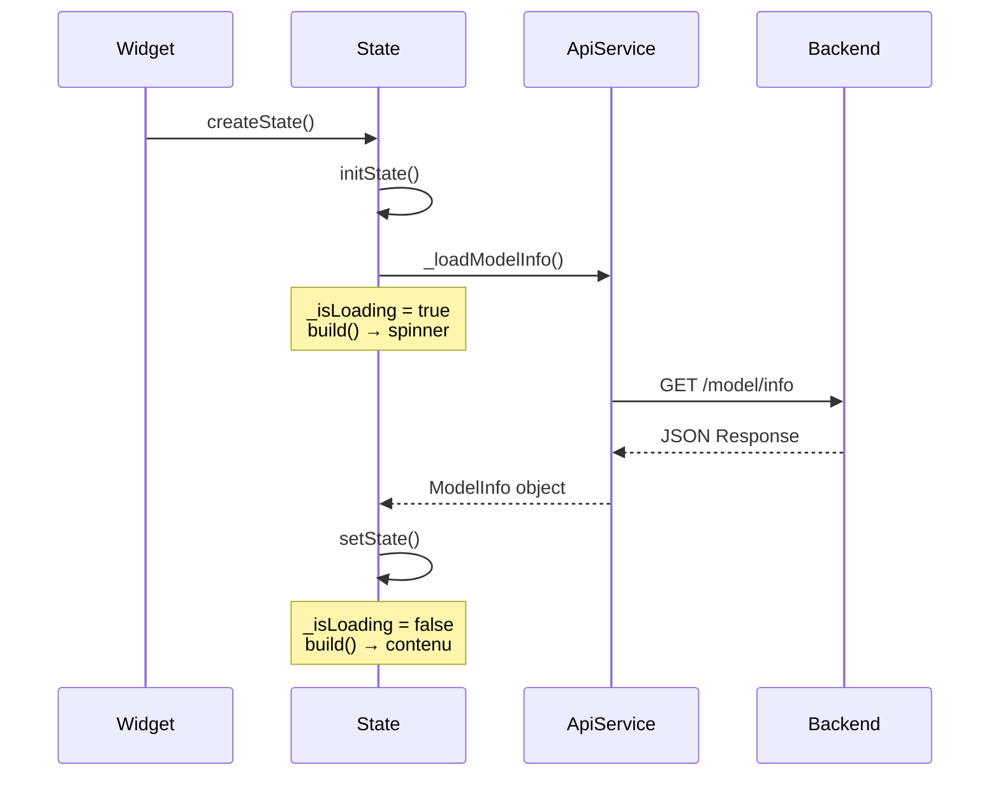

**Différence avec PredictionScreen :**
- `PredictionScreen` : L'appel API est déclenché **par l'utilisateur** (bouton)
- `ModelInfoScreen` : L'appel API est déclenché **automatiquement** dans `initState()`
- `_isLoading` démarre à `true` (pas `false` comme dans PredictionScreen)

### Le cercle de précision — `CircularProgressIndicator`

```dart
Widget _buildAccuracyCard() {
  final accuracy = (_modelInfo!.accuracy * 100).toStringAsFixed(1);
  return Card(
    elevation: 2,
    shape: RoundedRectangleBorder(borderRadius: BorderRadius.circular(16)),
    child: Padding(
      padding: const EdgeInsets.all(20),
      child: Column(
        children: [
          const Text(
            'Précision du modèle',
            style: TextStyle(fontSize: 18, fontWeight: FontWeight.w600),
          ),
          const SizedBox(height: 16),
          SizedBox(
            width: 150,
            height: 150,
            child: Stack(
              alignment: Alignment.center,
              children: [
                SizedBox(
                  width: 150,
                  height: 150,
                  child: CircularProgressIndicator(
                    value: _modelInfo!.accuracy,
                    strokeWidth: 12,
                    backgroundColor: Colors.grey.shade200,
                    valueColor: AlwaysStoppedAnimation<Color>(
                      _modelInfo!.accuracy > 0.9
                          ? Colors.green
                          : _modelInfo!.accuracy > 0.7
                              ? Colors.orange
                              : Colors.red,
                    ),
                  ),
                ),
                Text(
                  '$accuracy%',
                  style: const TextStyle(
                    fontSize: 32,
                    fontWeight: FontWeight.bold,
                  ),
                ),
              ],
            ),
          ),
        ],
      ),
    ),
  );
}
```

**Technique du `Stack` :** On superpose le `CircularProgressIndicator` et le texte du pourcentage grâce à un `Stack` centré. Le `CircularProgressIndicator` est détourné de son usage habituel (loading) pour servir de **jauge circulaire**.

**Couleur dynamique selon la précision :**

| Précision | Couleur | Signification |
|-----------|---------|---------------|
| > 90% | Vert | Excellente |
| 70-90% | Orange | Correcte |
| < 70% | Rouge | Insuffisante |

### Les barres d'importance des features

```dart
Widget _buildFeatureImportanceCard() {
  final sorted = _modelInfo!.featureImportances.entries.toList()
    ..sort((a, b) => b.value.compareTo(a.value));

  final colors = [
    const Color(0xFF667eea),
    const Color(0xFF764ba2),
    const Color(0xFFf093fb),
    const Color(0xFFf5576c),
  ];

  return Card(
    // ...
    child: Padding(
      padding: const EdgeInsets.all(20),
      child: Column(
        crossAxisAlignment: CrossAxisAlignment.start,
        children: [
          const Text(
            'Importance des features',
            style: TextStyle(fontSize: 18, fontWeight: FontWeight.w600),
          ),
          const SizedBox(height: 16),
          ...sorted.asMap().entries.map((entry) {
            final i = entry.key;
            final feature = entry.value;
            final pct = (feature.value * 100).toStringAsFixed(1);
            final color = colors[i % colors.length];

            return Padding(
              padding: const EdgeInsets.only(bottom: 12),
              child: Column(
                crossAxisAlignment: CrossAxisAlignment.start,
                children: [
                  Row(
                    mainAxisAlignment: MainAxisAlignment.spaceBetween,
                    children: [
                      Expanded(
                        child: Text(
                          feature.key,
                          style: const TextStyle(fontWeight: FontWeight.w500),
                        ),
                      ),
                      Text(
                        '$pct%',
                        style: TextStyle(
                          fontWeight: FontWeight.bold,
                          color: color,
                        ),
                      ),
                    ],
                  ),
                  const SizedBox(height: 6),
                  ClipRRect(
                    borderRadius: BorderRadius.circular(8),
                    child: LinearProgressIndicator(
                      value: feature.value,
                      minHeight: 10,
                      backgroundColor: color.withValues(alpha: 0.1),
                      valueColor: AlwaysStoppedAnimation<Color>(color),
                    ),
                  ),
                ],
              ),
            );
          }),
        ],
      ),
    ),
  );
}
```

**Points importants :**
- `..sort((a, b) => b.value.compareTo(a.value))` — Tri **décroissant** par importance (cascade operator `..`)
- `.asMap().entries.map()` — Permet d'avoir l'**index** en plus de la valeur
- `LinearProgressIndicator` détourné pour afficher une barre de proportion
- `ClipRRect` arrondit les coins de la barre

### La carte des données d'entraînement

```dart
Widget _buildInfoRow(IconData icon, String label, String value) {
  return Padding(
    padding: const EdgeInsets.only(bottom: 12),
    child: Row(
      children: [
        Icon(icon, color: Colors.indigo, size: 20),
        const SizedBox(width: 12),
        Text(label, style: const TextStyle(fontWeight: FontWeight.w500)),
        const Spacer(),
        Text(
          value,
          style: const TextStyle(fontWeight: FontWeight.bold),
        ),
      ],
    ),
  );
}
```

Ce widget utilitaire affiche une ligne clé-valeur avec icône. Le `Spacer()` pousse la valeur à droite.

| Icône | Label | Valeur |
|-------|-------|--------|
| `model_training` | Échantillons entraînement | ex: 120 |
| `quiz` | Échantillons test | ex: 30 |
| `category` | Classes | setosa, versicolor, virginica |
| `data_array` | Features | 4 |

</details>

<p align="right"><a href="#top">↑ Back to top</a></p>

---

<a id="section-7"></a>
<details>
<summary><strong>7 — L'écran du dataset</strong></summary>

### Vue d'ensemble

L'écran `DatasetScreen` affiche les statistiques du dataset Iris, la distribution par espèce et un tableau d'échantillons aléatoires. Il démontre un pattern important : **les appels API parallèles avec `Future.wait`**.

### Appels API parallèles avec `Future.wait`

```dart
Future<void> _loadData() async {
  try {
    final results = await Future.wait([
      _apiService.getDatasetSamples(),
      _apiService.getDatasetStats(),
    ]);
    setState(() {
      _samples = results[0] as List<DatasetSample>;
      _stats = results[1] as Map<String, dynamic>;
      _isLoading = false;
    });
  } catch (e) {
    setState(() {
      _error = e.toString();
      _isLoading = false;
    });
  }
}
```

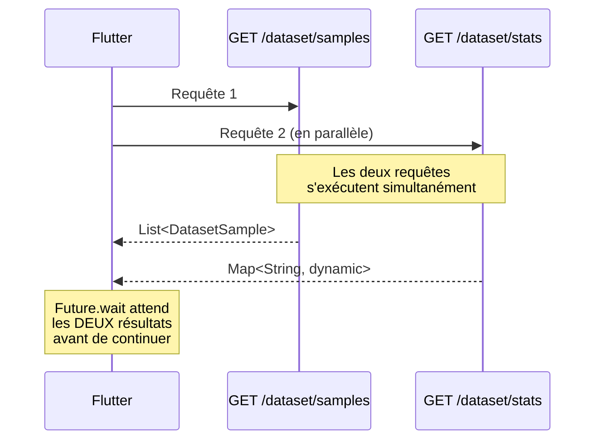

**Pourquoi `Future.wait` ?**
- Sans `Future.wait` : Les appels sont **séquentiels** → temps total = T1 + T2
- Avec `Future.wait` : Les appels sont **parallèles** → temps total = max(T1, T2)
- Sur notre écran, on a besoin des deux résultats avant d'afficher quoi que ce soit

**Attention :** Si l'une des deux requêtes échoue, `Future.wait` lance une exception et aucun résultat n'est accessible.

### Les chips de statistiques

```dart
Widget _buildStatsOverview() {
  return Card(
    elevation: 2,
    shape: RoundedRectangleBorder(borderRadius: BorderRadius.circular(16)),
    child: Padding(
      padding: const EdgeInsets.all(20),
      child: Column(
        crossAxisAlignment: CrossAxisAlignment.start,
        children: [
          const Text(
            'Vue d\'ensemble du Dataset',
            style: TextStyle(fontSize: 18, fontWeight: FontWeight.w600),
          ),
          const SizedBox(height: 16),
          Row(
            children: [
              _buildStatChip(
                Icons.data_array,
                '${_stats!['total_samples']}',
                'Échantillons',
                Colors.blue,
              ),
              const SizedBox(width: 12),
              _buildStatChip(
                Icons.tune,
                '${_stats!['features_count']}',
                'Features',
                Colors.orange,
              ),
              const SizedBox(width: 12),
              _buildStatChip(
                Icons.category,
                '${_stats!['species_count']}',
                'Espèces',
                Colors.purple,
              ),
            ],
          ),
        ],
      ),
    ),
  );
}

Widget _buildStatChip(
    IconData icon, String value, String label, Color color) {
  return Expanded(
    child: Container(
      padding: const EdgeInsets.all(16),
      decoration: BoxDecoration(
        color: color.withValues(alpha: 0.1),
        borderRadius: BorderRadius.circular(12),
      ),
      child: Column(
        children: [
          Icon(icon, color: color, size: 28),
          const SizedBox(height: 8),
          Text(
            value,
            style: TextStyle(
              fontSize: 24,
              fontWeight: FontWeight.bold,
              color: color,
            ),
          ),
          Text(
            label,
            style: TextStyle(color: color.withValues(alpha: 0.8), fontSize: 12),
          ),
        ],
      ),
    ),
  );
}
```

Chaque chip est enveloppé dans `Expanded` pour que les trois se partagent équitablement la largeur.

### La carte de distribution par espèce

```dart
Widget _buildDistributionCard() {
  final dist = _stats!['species_distribution'] as Map<String, dynamic>;
  final total = dist.values.fold<int>(0, (sum, v) => sum + (v as int));

  return Card(
    // ...
    child: Padding(
      padding: const EdgeInsets.all(20),
      child: Column(
        crossAxisAlignment: CrossAxisAlignment.start,
        children: [
          const Text(
            'Distribution par espèce',
            style: TextStyle(fontSize: 18, fontWeight: FontWeight.w600),
          ),
          const SizedBox(height: 16),
          ...dist.entries.map((entry) {
            final color = _speciesColors[entry.key] ?? Colors.grey;
            final count = entry.value as int;
            final pct = (count / total * 100).toStringAsFixed(0);

            return Padding(
              padding: const EdgeInsets.only(bottom: 10),
              child: Row(
                children: [
                  Container(
                    width: 12, height: 12,
                    decoration: BoxDecoration(
                      color: color,
                      shape: BoxShape.circle,
                    ),
                  ),
                  const SizedBox(width: 8),
                  Expanded(
                    child: Text(
                      entry.key[0].toUpperCase() + entry.key.substring(1),
                    ),
                  ),
                  Text('$count ($pct%)'),
                ],
              ),
            );
          }),
        ],
      ),
    ),
  );
}
```

La méthode `.fold<int>(0, (sum, v) => sum + (v as int))` calcule le total des échantillons pour pouvoir afficher les pourcentages.

### Le tableau de données — `DataTable`

```dart
Widget _buildSamplesTable() {
  return Card(
    elevation: 2,
    shape: RoundedRectangleBorder(borderRadius: BorderRadius.circular(16)),
    child: Padding(
      padding: const EdgeInsets.all(20),
      child: Column(
        crossAxisAlignment: CrossAxisAlignment.start,
        children: [
          const Text(
            'Échantillons aléatoires',
            style: TextStyle(fontSize: 18, fontWeight: FontWeight.w600),
          ),
          const SizedBox(height: 16),
          SingleChildScrollView(
            scrollDirection: Axis.horizontal,
            child: DataTable(
              headingRowColor: WidgetStateProperty.all(
                const Color(0xFF667eea).withValues(alpha: 0.1),
              ),
              columns: const [
                DataColumn(label: Text('Espèce')),
                DataColumn(label: Text('Sép. L'), numeric: true),
                DataColumn(label: Text('Sép. W'), numeric: true),
                DataColumn(label: Text('Pét. L'), numeric: true),
                DataColumn(label: Text('Pét. W'), numeric: true),
              ],
              rows: _samples!.map((s) {
                final color = _speciesColors[s.species] ?? Colors.grey;
                return DataRow(cells: [
                  DataCell(
                    Container(
                      padding: const EdgeInsets.symmetric(
                        horizontal: 8, vertical: 4,
                      ),
                      decoration: BoxDecoration(
                        color: color.withValues(alpha: 0.1),
                        borderRadius: BorderRadius.circular(8),
                      ),
                      child: Text(
                        s.species,
                        style: TextStyle(
                          color: color,
                          fontWeight: FontWeight.w600,
                        ),
                      ),
                    ),
                  ),
                  DataCell(Text(s.sepalLength.toStringAsFixed(1))),
                  DataCell(Text(s.sepalWidth.toStringAsFixed(1))),
                  DataCell(Text(s.petalLength.toStringAsFixed(1))),
                  DataCell(Text(s.petalWidth.toStringAsFixed(1))),
                ]);
              }).toList(),
            ),
          ),
        ],
      ),
    ),
  );
}
```

**Éléments clés du `DataTable` :**

| Élément | Rôle |
|---------|------|
| `SingleChildScrollView(scrollDirection: Axis.horizontal)` | Scroll horizontal si le tableau est trop large |
| `DataColumn(numeric: true)` | Aligne le contenu à droite (convention numérique) |
| `headingRowColor` | Couleur de fond de la ligne d'en-tête |
| `DataCell(Container(...))` | Cellule personnalisée avec badge coloré pour l'espèce |

### Le bouton rafraîchir

```dart
ElevatedButton.icon(
  onPressed: () {
    setState(() => _isLoading = true);
    _loadData();
  },
  icon: const Icon(Icons.refresh),
  label: const Text('Charger d\'autres échantillons'),
  style: ElevatedButton.styleFrom(
    backgroundColor: const Color(0xFF667eea),
    foregroundColor: Colors.white,
    shape: RoundedRectangleBorder(
      borderRadius: BorderRadius.circular(12),
    ),
  ),
),
```

Ce bouton relance `_loadData()` pour obtenir un **nouveau jeu d'échantillons aléatoires** depuis l'API.

</details>

<p align="right"><a href="#top">↑ Back to top</a></p>

---

<a id="section-8"></a>
<details>
<summary><strong>8 — Les widgets réutilisables</strong></summary>

### Pourquoi créer des widgets réutilisables ?

Les widgets réutilisables permettent de :
- **Réduire la duplication** de code
- **Isoler la logique** d'affichage
- **Faciliter les tests** unitaires
- **Améliorer la lisibilité** des écrans parents

### `ProbabilityChart` — Code complet

```dart
import 'package:flutter/material.dart';

class ProbabilityChart extends StatelessWidget {
  final Map<String, double> probabilities;

  const ProbabilityChart({super.key, required this.probabilities});

  static const _speciesColors = {
    'setosa': Color(0xFF4CAF50),
    'versicolor': Color(0xFF2196F3),
    'virginica': Color(0xFF9C27B0),
  };

  @override
  Widget build(BuildContext context) {
    return Card(
      elevation: 2,
      shape: RoundedRectangleBorder(borderRadius: BorderRadius.circular(16)),
      child: Padding(
        padding: const EdgeInsets.all(20),
        child: Column(
          crossAxisAlignment: CrossAxisAlignment.start,
          children: [
            const Text(
              'Probabilités par espèce',
              style: TextStyle(fontSize: 18, fontWeight: FontWeight.w600),
            ),
            const SizedBox(height: 16),
            ...probabilities.entries.map((entry) {
              final color = _speciesColors[entry.key] ?? Colors.grey;
              final pct = (entry.value * 100).toStringAsFixed(1);

              return Padding(
                padding: const EdgeInsets.only(bottom: 12),
                child: Column(
                  crossAxisAlignment: CrossAxisAlignment.start,
                  children: [
                    Row(
                      mainAxisAlignment: MainAxisAlignment.spaceBetween,
                      children: [
                        Text(
                          entry.key[0].toUpperCase() + entry.key.substring(1),
                          style: TextStyle(
                            fontWeight: FontWeight.w600,
                            color: color,
                          ),
                        ),
                        Text(
                          '$pct%',
                          style: TextStyle(
                            fontWeight: FontWeight.bold,
                            color: color,
                          ),
                        ),
                      ],
                    ),
                    const SizedBox(height: 6),
                    ClipRRect(
                      borderRadius: BorderRadius.circular(8),
                      child: LinearProgressIndicator(
                        value: entry.value,
                        minHeight: 12,
                        backgroundColor: color.withValues(alpha: 0.1),
                        valueColor: AlwaysStoppedAnimation<Color>(color),
                      ),
                    ),
                  ],
                ),
              );
            }),
          ],
        ),
      ),
    );
  }
}
```

### Anatomie d'un widget réutilisable

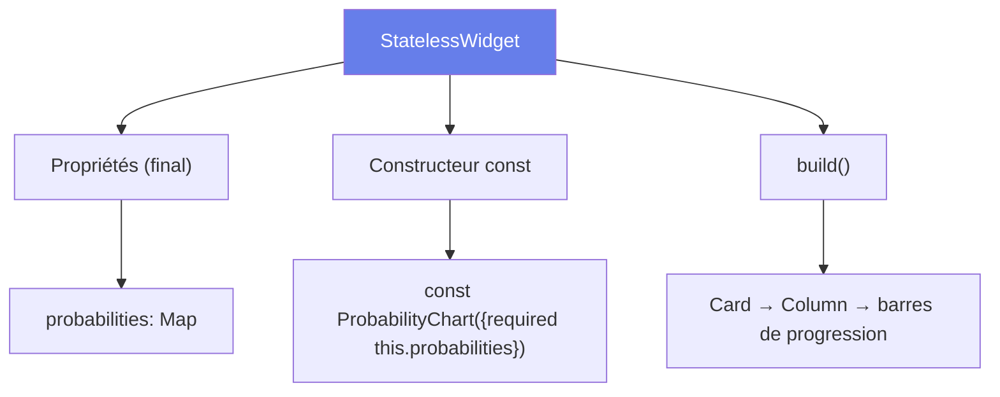

### Les 4 règles d'un bon widget réutilisable

| Règle | Application dans `ProbabilityChart` |
|-------|-------------------------------------|
| **1. Données via le constructeur** | `required this.probabilities` — le parent fournit les données |
| **2. Pas d'état interne** | `StatelessWidget` — pas de `setState`, pas de `State` |
| **3. Constructeur `const`** | `const ProbabilityChart({super.key, required this.probabilities})` |
| **4. Autonome visuellement** | Contient sa propre `Card`, son propre padding, ses propres styles |

### Utilisation depuis l'écran parent

```dart
// Dans PredictionScreen._build()
if (_prediction != null) ...[
  _buildResultCard(),
  const SizedBox(height: 16),
  ProbabilityChart(probabilities: _prediction!.probabilities),
],
```

Le parent n'a qu'à passer les données — le widget gère tout l'affichage.

### `StatelessWidget` vs `StatefulWidget`

| Critère | `StatelessWidget` | `StatefulWidget` |
|---------|-------------------|------------------|
| État interne | Non | Oui |
| `setState()` | Non disponible | Disponible |
| Reconstruction | Uniquement si le parent se reconstruit | Aussi via `setState()` |
| Quand l'utiliser | Widget d'affichage pur | Widget interactif/dynamique |
| Exemples dans le projet | `ProbabilityChart` | `PredictionScreen`, `ModelInfoScreen`, `DatasetScreen` |

</details>

<p align="right"><a href="#top">↑ Back to top</a></p>

---

<a id="section-9"></a>
<details>
<summary><strong>9 — Navigation avec NavigationBar</strong></summary>

### Material 3 — `NavigationBar`

Flutter Material 3 remplace l'ancien `BottomNavigationBar` par le nouveau `NavigationBar`, plus moderne et conforme aux dernières spécifications Material Design.

### Implémentation dans `main.dart`

```dart
class _HomeScreenState extends State<HomeScreen> {
  int _currentIndex = 0;

  final _screens = const [
    PredictionScreen(),
    ModelInfoScreen(),
    DatasetScreen(),
  ];

  @override
  Widget build(BuildContext context) {
    return Scaffold(
      body: _screens[_currentIndex],
      bottomNavigationBar: NavigationBar(
        selectedIndex: _currentIndex,
        onDestinationSelected: (index) =>
            setState(() => _currentIndex = index),
        destinations: const [
          NavigationDestination(
            icon: Icon(Icons.science_outlined),
            selectedIcon: Icon(Icons.science),
            label: 'Prédiction',
          ),
          NavigationDestination(
            icon: Icon(Icons.psychology_outlined),
            selectedIcon: Icon(Icons.psychology),
            label: 'Modèle',
          ),
          NavigationDestination(
            icon: Icon(Icons.dataset_outlined),
            selectedIcon: Icon(Icons.dataset),
            label: 'Dataset',
          ),
        ],
      ),
    );
  }
}
```

### Fonctionnement

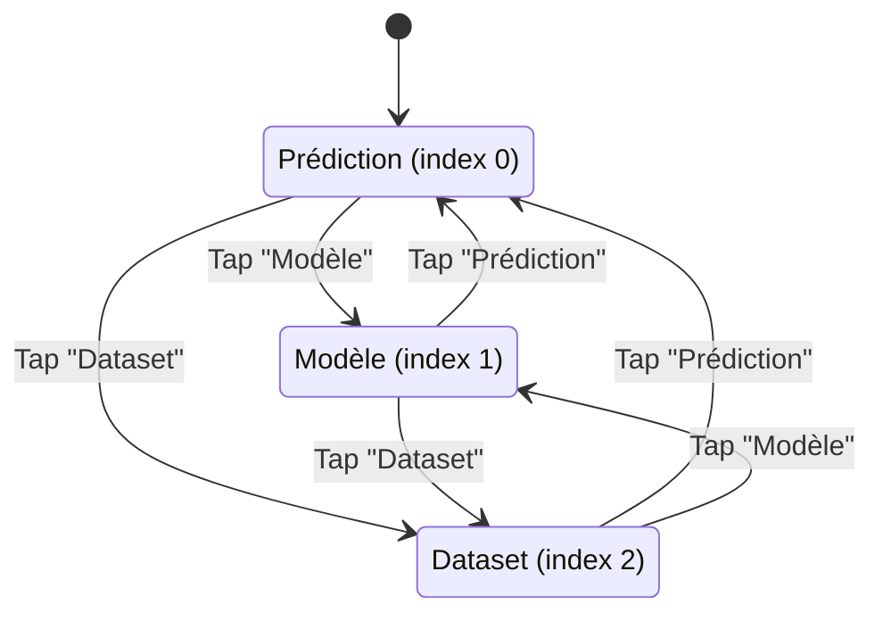

### Les éléments clés

| Élément | Rôle |
|---------|------|
| `_currentIndex` | Index de l'onglet actif (0, 1 ou 2) |
| `_screens` | Liste des 3 écrans (instances `const`) |
| `_screens[_currentIndex]` | Affiche l'écran correspondant à l'index |
| `onDestinationSelected` | Callback appelé quand l'utilisateur tape sur un onglet |
| `setState(() => _currentIndex = index)` | Met à jour l'index → reconstruit le widget → affiche le bon écran |

### Icônes `outlined` vs `filled`

Chaque `NavigationDestination` a deux icônes :
- `icon` — Icône **outlined** (non sélectionnée) : version contour
- `selectedIcon` — Icône **filled** (sélectionnée) : version pleine

| Onglet | Icône non sélectionnée | Icône sélectionnée |
|--------|----------------------|-------------------|
| Prédiction | `Icons.science_outlined` | `Icons.science` |
| Modèle | `Icons.psychology_outlined` | `Icons.psychology` |
| Dataset | `Icons.dataset_outlined` | `Icons.dataset` |

### Avantage de la liste `const`

```dart
final _screens = const [
  PredictionScreen(),
  ModelInfoScreen(),
  DatasetScreen(),
];
```

Les écrans sont créés une seule fois et réutilisés. Le `const` garantit que les instances ne sont **pas recréées** à chaque `setState()`, ce qui est bénéfique pour les performances.

</details>

<p align="right"><a href="#top">↑ Back to top</a></p>

---

<a id="section-10"></a>
<details>
<summary><strong>10 — Indicateur de connexion API</strong></summary>

### Objectif

Afficher en permanence dans l'AppBar un indicateur visuel montrant si le backend FastAPI est joignable ou non.

### Implémentation

```dart
class _HomeScreenState extends State<HomeScreen> {
  bool _apiConnected = false;
  final _apiService = ApiService();

  @override
  void initState() {
    super.initState();
    _checkApi();
  }

  Future<void> _checkApi() async {
    final connected = await _apiService.healthCheck();
    setState(() => _apiConnected = connected);
  }

  @override
  Widget build(BuildContext context) {
    return Scaffold(
      appBar: AppBar(
        title: const Row(
          children: [
            Icon(Icons.local_florist),
            SizedBox(width: 8),
            Text('Iris ML Demo'),
          ],
        ),
        actions: [
          Container(
            margin: const EdgeInsets.only(right: 16),
            child: Chip(
              avatar: Icon(
                _apiConnected ? Icons.cloud_done : Icons.cloud_off,
                size: 18,
                color: _apiConnected ? Colors.green : Colors.red,
              ),
              label: Text(
                _apiConnected ? 'API connectée' : 'API hors ligne',
                style: TextStyle(
                  fontSize: 12,
                  color: _apiConnected ? Colors.green : Colors.red,
                ),
              ),
              backgroundColor: _apiConnected
                  ? Colors.green.withValues(alpha: 0.1)
                  : Colors.red.withValues(alpha: 0.1),
            ),
          ),
        ],
      ),
      // ...
    );
  }
}
```

### Flux du health check

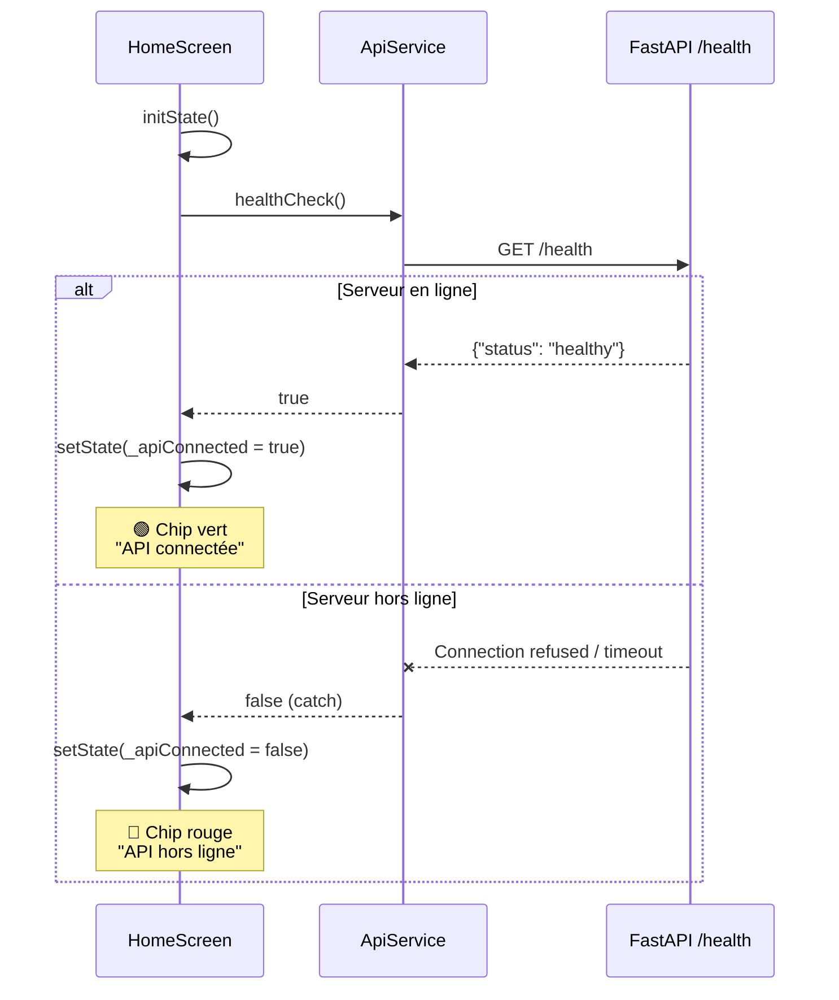

### Détail du widget `Chip`

Le `Chip` de Material est un composant compact qui affiche une information avec une icône optionnelle :

| Propriété | État connecté | État déconnecté |
|-----------|---------------|-----------------|
| `avatar` (icône) | `Icons.cloud_done` (vert) | `Icons.cloud_off` (rouge) |
| `label` (texte) | "API connectée" (vert) | "API hors ligne" (rouge) |
| `backgroundColor` | Vert à 10% d'opacité | Rouge à 10% d'opacité |

### Pourquoi dans `initState()` ?

Le health check est lancé dès que le `HomeScreen` est créé. Ainsi, l'utilisateur voit immédiatement l'état de la connexion API sans aucune action de sa part.

> **Amélioration possible** : Ajouter un `Timer.periodic` pour vérifier la connexion toutes les 30 secondes et détecter automatiquement la perte/reprise de connexion.

</details>

<p align="right"><a href="#top">↑ Back to top</a></p>

---

<a id="section-11"></a>
<details>
<summary><strong>11 — Gestion des erreurs côté frontend</strong></summary>

### Les 3 états d'un écran asynchrone

Tout écran qui effectue un appel API doit gérer **3 états** :

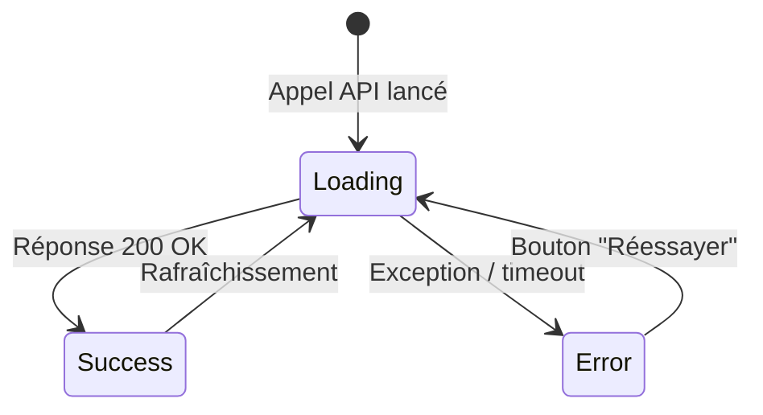

### Variables d'état communes

Chaque écran utilise le même trio de variables :

```dart
bool _isLoading = true;
String? _error;
SomeType? _data;
```

| Variable | Loading | Success | Error |
|----------|---------|---------|-------|
| `_isLoading` | `true` | `false` | `false` |
| `_error` | `null` | `null` | `"message"` |
| `_data` | `null` | `objet` | `null` |

### Pattern try/catch dans les appels API

```dart
Future<void> _loadData() async {
  try {
    final data = await _apiService.getSomething();
    setState(() {
      _data = data;
      _isLoading = false;
    });
  } catch (e) {
    setState(() {
      _error = e.toString();
      _isLoading = false;
    });
  }
}
```

### Affichage conditionnel des 3 états

**Pattern utilisé dans `ModelInfoScreen` et `DatasetScreen` :**

```dart
@override
Widget build(BuildContext context) {
  if (_isLoading) {
    return const Center(child: CircularProgressIndicator());
  }

  if (_error != null) {
    return Center(
      child: Column(
        mainAxisAlignment: MainAxisAlignment.center,
        children: [
          const Icon(Icons.error_outline, size: 64, color: Colors.red),
          const SizedBox(height: 16),
          Text(_error!, style: const TextStyle(color: Colors.red)),
          const SizedBox(height: 16),
          ElevatedButton(
            onPressed: () {
              setState(() {
                _isLoading = true;
                _error = null;
              });
              _loadData();
            },
            child: const Text('Réessayer'),
          ),
        ],
      ),
    );
  }

  // ... contenu normal
}
```

### Le bouton "Réessayer"

Le pattern du bouton retry est identique dans les deux écrans :

```dart
ElevatedButton(
  onPressed: () {
    setState(() {
      _isLoading = true;  // Réaffiche le spinner
      _error = null;       // Efface l'erreur précédente
    });
    _loadData();           // Relance l'appel API
  },
  child: const Text('Réessayer'),
),
```

**Séquence :**
1. L'utilisateur appuie sur "Réessayer"
2. `setState` → `_isLoading = true` et `_error = null` → l'écran affiche le spinner
3. `_loadData()` est relancé → en cas de succès, l'écran affiche les données

### Carte d'erreur dans `PredictionScreen`

`PredictionScreen` utilise une approche différente — une carte d'erreur inline plutôt qu'un écran plein d'erreur :

```dart
Widget _buildError() {
  return Card(
    color: Colors.red.shade50,
    shape: RoundedRectangleBorder(borderRadius: BorderRadius.circular(12)),
    child: Padding(
      padding: const EdgeInsets.all(16),
      child: Row(
        children: [
          const Icon(Icons.error_outline, color: Colors.red),
          const SizedBox(width: 12),
          Expanded(
            child: Text(
              _error!,
              style: const TextStyle(color: Colors.red),
            ),
          ),
        ],
      ),
    ),
  );
}
```

### Comparaison des deux approches d'erreur

| Approche | Utilisé dans | Quand l'utiliser |
|----------|-------------|------------------|
| **Écran plein** | `ModelInfoScreen`, `DatasetScreen` | L'écran entier dépend des données API (initState) |
| **Carte inline** | `PredictionScreen` | L'erreur est liée à une action ponctuelle (bouton) |

### Les indicateurs de chargement

| Widget | Utilisation | Écran |
|--------|------------|-------|
| `CircularProgressIndicator()` (plein écran) | Chargement initial des données | `ModelInfoScreen`, `DatasetScreen` |
| `CircularProgressIndicator()` (inline) | Pendant la prédiction | `PredictionScreen` |
| Bouton désactivé (`onPressed: null`) | Empêcher un double appel | `PredictionScreen` (`_isLoading ? null : _predict`) |

</details>

<p align="right"><a href="#top">↑ Back to top</a></p>

---

<a id="section-12"></a>
<details>
<summary><strong>12 — Bonnes pratiques Flutter</strong></summary>

### 1. Séparation des responsabilités

Notre projet suit une architecture en couches claire :

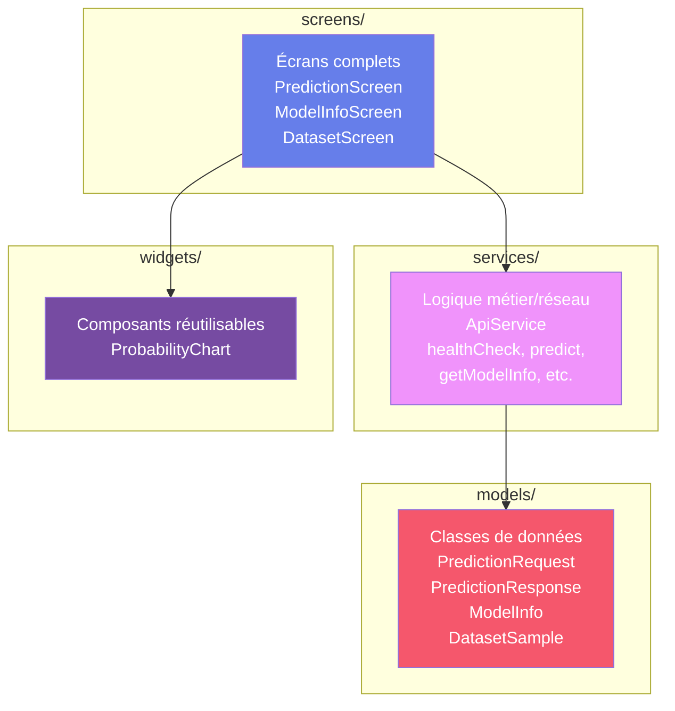

| Couche | Dossier | Responsabilité | Ne doit PAS |
|--------|---------|----------------|-------------|
| **Modèles** | `models/` | Définir les structures de données | Contenir de logique UI ou réseau |
| **Services** | `services/` | Gérer les appels API | Contenir de widgets ou de `setState` |
| **Écrans** | `screens/` | Orchestrer l'UI et les interactions | Faire des appels HTTP directement |
| **Widgets** | `widgets/` | Afficher des composants réutilisables | Gérer de la logique métier |

### 2. Constructeurs `const`

Les constructeurs `const` sont utilisés partout dans le projet :

```dart
// ✅ Bon — const constructor
const PredictionScreen({super.key});
const ProbabilityChart({super.key, required this.probabilities});

// Utilisation avec const
final _screens = const [
  PredictionScreen(),
  ModelInfoScreen(),
  DatasetScreen(),
];

// Widgets const inline
const SizedBox(height: 16),
const Center(child: CircularProgressIndicator()),
const Icon(Icons.local_florist, size: 48, color: Colors.white),
```

**Avantages de `const` :**
- Les objets `const` sont créés **une seule fois** en mémoire à la compilation
- Flutter peut **ignorer la reconstruction** d'un sous-arbre `const` lors d'un `setState`
- Meilleure performance, surtout pour les listes et les widgets répétés

### 3. Le paramètre `key`

Chaque widget de notre projet accepte `super.key` :

```dart
class PredictionScreen extends StatefulWidget {
  const PredictionScreen({super.key});
  // ...
}
```

La `key` permet à Flutter de :
- **Identifier** de manière unique un widget dans l'arbre
- **Optimiser** les reconstructions en réutilisant les widgets existants
- **Préserver l'état** lors de réorganisations (listes, animations)

### 4. Préfixe `_` pour le privé

En Dart, le préfixe `_` rend un identifiant **privé au fichier** :

```dart
// Privé — accessible uniquement dans ce fichier
double _sepalLength = 5.1;
bool _isLoading = false;
final _apiService = ApiService();

Widget _buildHeader() { ... }
Widget _buildInputForm() { ... }

static const _speciesColors = { ... };
static const _speciesIcons = { ... };
```

### 5. `static const` pour les constantes de classe

```dart
static const _speciesColors = {
  'setosa': Color(0xFF4CAF50),
  'versicolor': Color(0xFF2196F3),
  'virginica': Color(0xFF9C27B0),
};
```

- `static` : partagé entre toutes les instances de la classe
- `const` : évalué à la compilation, immuable
- Utilisé pour les maps de couleurs et d'icônes qui ne changent jamais

### 6. Typage explicite des variables Dart

```dart
// ✅ Types explicites pour les propriétés de classe
final String modelType;
final double accuracy;
final List<String> featureNames;
final Map<String, double> featureImportances;

// ✅ Type inféré (var/final) pour les variables locales quand c'est clair
final response = await http.get(Uri.parse('$baseUrl/health'));
final data = json.decode(response.body);
```

### 7. Décomposition en méthodes `_build*()`

Plutôt qu'un seul `build()` monolithique, chaque écran décompose son UI en méthodes privées :

```dart
@override
Widget build(BuildContext context) {
  return SingleChildScrollView(
    child: Column(
      children: [
        _buildHeader(),        // En-tête avec gradient
        _buildInputForm(),     // Formulaire avec sliders
        _buildResultCard(),    // Carte de résultat
        _buildError(),         // Message d'erreur
      ],
    ),
  );
}
```

**Avantages :**
- Chaque méthode fait moins de 50 lignes → facile à lire
- Le `build()` principal montre la **structure** de l'écran d'un coup d'œil
- Facilite la réorganisation (déplacer, supprimer, réordonner les sections)

### Récapitulatif des bonnes pratiques

| Pratique | Bénéfice |
|----------|----------|
| Séparation models/services/screens/widgets | Maintenabilité, testabilité |
| Constructeurs `const` | Performance |
| Paramètre `key` dans chaque widget | Optimisation du rendu |
| Préfixe `_` pour le privé | Encapsulation |
| `static const` pour les constantes | Mémoire, immutabilité |
| Décomposition en `_build*()` | Lisibilité |
| try/catch systématique | Robustesse |
| `Future.wait` pour les appels parallèles | Performance réseau |

</details>

<p align="right"><a href="#top">↑ Back to top</a></p>

---

<a id="section-13"></a>
<details>
<summary><strong>13 — Conclusion — Le flux complet</strong></summary>

### Le parcours complet d'une prédiction

Voici le diagramme de séquence complet montrant le flux de données de bout en bout, depuis l'interaction de l'utilisateur jusqu'à l'affichage du résultat :

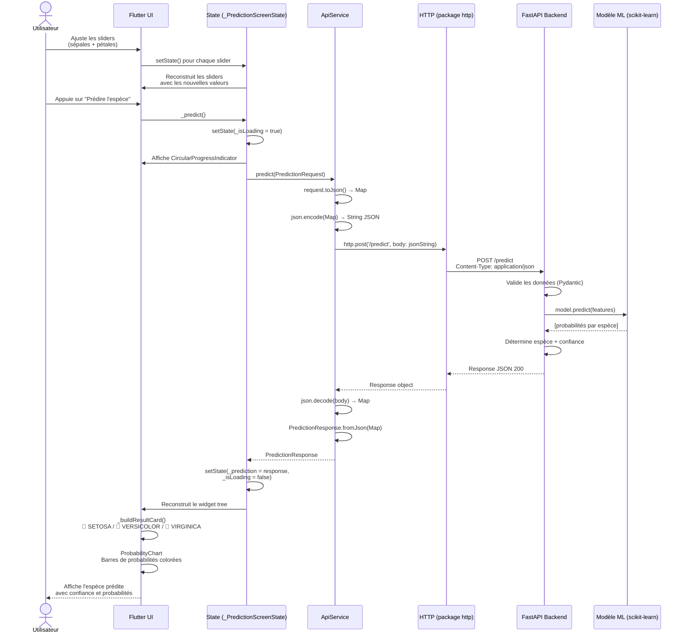

### Résumé de l'architecture

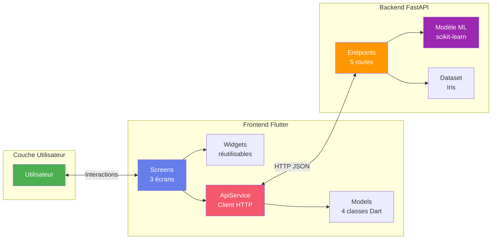

### Ce que nous avons appris

| Section | Concept clé |
|---------|-------------|
| **1. Introduction** | Flutter + API REST = combinaison puissante avec Material 3 |
| **2. Structure** | Organisation en couches : models / services / screens / widgets |
| **3. Modèles** | Pattern `fromJson` / `toJson` avec factory constructors |
| **4. Service API** | Client HTTP centralisé, async/await, gestion des erreurs |
| **5. Prédiction** | StatefulWidget, Sliders, appel API déclenché par l'utilisateur |
| **6. Modèle info** | Pattern initState + appel API automatique, CircularProgressIndicator |
| **7. Dataset** | `Future.wait` pour les appels parallèles, DataTable |
| **8. Widgets** | Composants réutilisables, passage de données via constructeur |
| **9. Navigation** | NavigationBar Material 3, switching entre écrans |
| **10. Health check** | Indicateur de connexion en temps réel dans l'AppBar |
| **11. Erreurs** | 3 états (loading/success/error), retry, affichage conditionnel |
| **12. Bonnes pratiques** | const, key, séparation des responsabilités, décomposition |

### Technologies utilisées

| Technologie | Rôle |
|-------------|------|
| **Flutter 3.x** | Framework UI multi-plateforme |
| **Dart 3.8** | Langage de programmation |
| **Material Design 3** | Système de design |
| **package:http** | Client HTTP |
| **package:fl_chart** | Graphiques |
| **package:google_fonts** | Typographie |
| **FastAPI** | Backend Python |
| **scikit-learn** | Modèle de Machine Learning |

### Pour aller plus loin

- **State Management** : Migrer vers Riverpod ou Bloc pour une gestion d'état plus robuste
- **Tests** : Ajouter des tests unitaires pour `ApiService` et des tests de widgets
- **Intercepteurs HTTP** : Ajouter des retry automatiques et du logging avec `package:dio`
- **Cache local** : Stocker les résultats avec `shared_preferences` ou `hive`
- **CI/CD** : Automatiser les builds avec GitHub Actions

</details>

<p align="right"><a href="#top">↑ Back to top</a></p>

---

> **Auteur** : Cours généré à partir du projet Iris ML Demo  
> **Stack** : Flutter + FastAPI + scikit-learn  
> **Licence** : Usage éducatif
