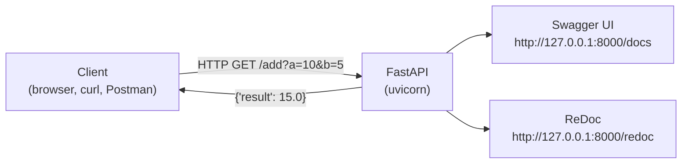
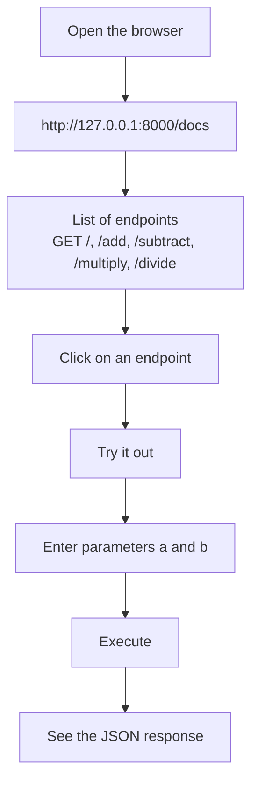

<a id="top"></a>

# FastAPI — Calculator API with Swagger UI

## Table of Contents

| #  | Section                                                                              |
| -- | ------------------------------------------------------------------------------------ |
| 1  | [Introduction to FastAPI and Swagger UI](#section-1)                                 |
| 2  | [Python Virtual Environment](#section-2)                                             |
| 2a | &nbsp;&nbsp;&nbsp;↳ [Python 3.9 Alternative](#section-2)                            |
| 3  | [Installing FastAPI and Uvicorn](#section-3)                                         |
| 4  | [Creating the `main.py` file](#section-4)                                            |
| 4a | &nbsp;&nbsp;&nbsp;↳ [Endpoints: add, subtract, multiply, divide](#section-4)        |
| 5  | [Starting the application](#section-5)                                               |
| 6  | [Swagger UI Interface](#section-6)                                                   |
| 7  | [Testing endpoints in Swagger](#section-7)                                           |
| 8  | [Appendix — Quick test URLs](#section-8)                                             |
| 9  | [Conclusion](#section-9)                                                             |

---

<a id="section-1"></a>

<details>
<summary>1 - Introduction to FastAPI and Swagger UI</summary>

<br/>

**FastAPI** is a modern Python framework for building web APIs quickly, with automatic data validation and automatically generated interactive documentation.

**Swagger UI** is this interactive documentation available at `/docs`: it allows you to test all endpoints directly in the browser, without any external tool.



In this tutorial, we create a **calculator API** with the 4 basic operations exposed as HTTP endpoints.

</details>

<p align="right"><a href="#top">↑ Back to top</a></p>

---

<a id="section-2"></a>

<details>
<summary>2 - Python Virtual Environment</summary>

<br/>

It is recommended to isolate each Python project in its own virtual environment to avoid dependency conflicts.

```bash
cd my_project
python -m venv myfastapi
myfastapi\Scripts\activate
python --version
pip install fastapi uvicorn
deactivate
```

These commands:

1. Navigate to the project folder.
2. Create the `myfastapi` virtual environment.
3. Activate the environment.
4. Install FastAPI and Uvicorn.
5. Deactivate the environment.

To reactivate the environment later:

```bash
myfastapi\Scripts\activate
```

---

### Python 3.9 Alternative

If multiple Python versions are installed on the machine:

```bash
cd my_project_2
python3.9 -m venv myfastapi
myfastapi\Scripts\activate
python --version
pip install fastapi uvicorn
deactivate
```

</details>

<p align="right"><a href="#top">↑ Back to top</a></p>

---

<a id="section-3"></a>

<details>
<summary>3 - Installing FastAPI and Uvicorn</summary>

<br/>

**FastAPI** is the web framework. **Uvicorn** is the ASGI server that runs it.

```bash
pip install fastapi
pip install "uvicorn[standard]"
```

> The `uvicorn[standard]` variant installs optional dependencies (auto-reload, WebSocket support, etc.).

</details>

<p align="right"><a href="#top">↑ Back to top</a></p>

---

<a id="section-4"></a>

<details>
<summary>4 - Creating the main.py file</summary>

<br/>

Create a `main.py` file in the project folder:

```python
from fastapi import FastAPI, HTTPException

app = FastAPI()

@app.get("/")
def read_root():
    return {"message": "Welcome to the Calculator API"}

@app.get("/add")
def add(a: float, b: float):
    return {"result": a + b}

@app.get("/subtract")
def subtract(a: float, b: float):
    return {"result": a - b}

@app.get("/multiply")
def multiply(a: float, b: float):
    return {"result": a * b}

@app.get("/divide")
def divide(a: float, b: float):
    if b == 0:
        raise HTTPException(status_code=400, detail="Division by zero is not allowed")
    return {"result": a / b}
```

---

### Endpoint Explanation

| Endpoint      | Method | Parameters     | Description                                  |
| ------------- | ------- | -------------- | -------------------------------------------- |
| `/`           | GET     | —              | Welcome message                              |
| `/add`        | GET     | `a`, `b` float | Addition of two numbers                      |
| `/subtract`   | GET     | `a`, `b` float | Subtraction                                  |
| `/multiply`   | GET     | `a`, `b` float | Multiplication                               |
| `/divide`     | GET     | `a`, `b` float | Division — raises 400 error if `b == 0`      |

</details>

<p align="right"><a href="#top">↑ Back to top</a></p>

---

<a id="section-5"></a>

<details>
<summary>5 - Starting the application</summary>

<br/>

```bash
uvicorn main:app --reload
```

The `--reload` option automatically restarts the server on every code change (useful during development).

The application is accessible at:

- **API**: [http://127.0.0.1:8000](http://127.0.0.1:8000)
- **Swagger UI**: [http://127.0.0.1:8000/docs](http://127.0.0.1:8000/docs)
- **ReDoc**: [http://127.0.0.1:8000/redoc](http://127.0.0.1:8000/redoc)

</details>

<p align="right"><a href="#top">↑ Back to top</a></p>

---

<a id="section-6"></a>

<details>
<summary>6 - Swagger UI Interface</summary>

<br/>

Swagger UI is automatically generated by FastAPI from the Python types declared in the code. It is accessible at `/docs`.



</details>

<p align="right"><a href="#top">↑ Back to top</a></p>

---

<a id="section-7"></a>

<details>
<summary>7 - Testing endpoints in Swagger</summary>

<br/>

To test each endpoint:

1. Click on the endpoint (e.g. `/add`) in Swagger UI.
2. Click **"Try it out"**.
3. Enter values for parameters `a` and `b`.
4. Click **"Execute"** to send the request.
5. The JSON response is displayed directly in the interface.

---

### Response Examples

| Endpoint    | Request                        | Response             |
| ----------- | ------------------------------ | -------------------- |
| `/`         | `GET /`                        | `{"message": "..."}` |
| `/add`      | `GET /add?a=10&b=5`            | `{"result": 15.0}`   |
| `/subtract` | `GET /subtract?a=10&b=5`       | `{"result": 5.0}`    |
| `/multiply` | `GET /multiply?a=10&b=5`       | `{"result": 50.0}`   |
| `/divide`   | `GET /divide?a=10&b=5`         | `{"result": 2.0}`    |
| `/divide`   | `GET /divide?a=10&b=0`         | HTTP 400 error       |

</details>

<p align="right"><a href="#top">↑ Back to top</a></p>

---

<a id="section-8"></a>

<details>
<summary>8 - Appendix — Quick test URLs</summary>

<br/>

These URLs can be copied directly into the browser or into a tool like Postman:

```text
http://127.0.0.1:8000/add?a=2&b=5
http://127.0.0.1:8000/subtract?a=2&b=5
http://127.0.0.1:8000/multiply?a=2&b=5
http://127.0.0.1:8000/divide?a=2&b=5
```

</details>

<p align="right"><a href="#top">↑ Back to top</a></p>

---

<a id="section-9"></a>

<details>
<summary>9 - Conclusion</summary>

<br/>

This tutorial covered the creation of a complete calculator API with FastAPI:

- Creating and activating a Python virtual environment
- Installing FastAPI and Uvicorn
- Defining 5 GET endpoints with automatic type validation
- Using Swagger UI to document and test the API

This API can easily be extended to include other operations or connected to a Streamlit frontend.

To go further, consult the [official FastAPI documentation](https://fastapi.tiangolo.com/).

</details>

<p align="right"><a href="#top">↑ Back to top</a></p>
