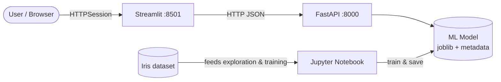
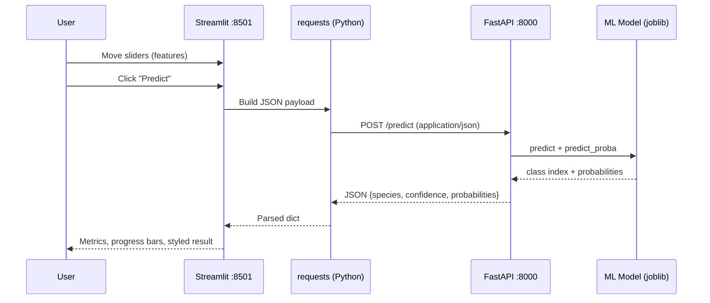

<a id="top"></a>

# Full-Stack Application Architecture: Streamlit + FastAPI + Jupyter

This module explains how an **all-Python** stack combines **Jupyter** (experimentation and training), **FastAPI** (REST API and model serving), and **Streamlit** (interactive UI) to deliver a complete machine learning demo around the classic **Iris** dataset.

---

## Table of contents

| # | Section | Anchor |
|---|---------|--------|
| 1 | [Introduction — Why an All-Python Full-Stack Architecture for ML?](#1-introduction--why-an-all-python-full-stack-architecture-for-ml) | `#1-introduction--why-an-all-python-full-stack-architecture-for-ml` |
| 2 | [Architecture Overview](#2-architecture-overview) | `#2-architecture-overview` |
| 3 | [The Role of Jupyter Notebook (ML pipeline)](#3-the-role-of-jupyter-notebook-ml-pipeline) | `#3-the-role-of-jupyter-notebook-ml-pipeline` |
| 4 | [The Role of the FastAPI Backend](#4-the-role-of-the-fastapi-backend) | `#4-the-role-of-the-fastapi-backend` |
| 5 | [The Role of the Streamlit Frontend](#5-the-role-of-the-streamlit-frontend) | `#5-the-role-of-the-streamlit-frontend` |
| 6 | [Project Structure](#6-project-structure) | `#6-project-structure` |
| 7 | [End-to-End Data Flow](#7-end-to-end-data-flow) | `#7-end-to-end-data-flow` |
| 8 | [Frontend ↔ Backend Communication](#8-frontend--backend-communication) | `#8-frontend--backend-communication` |
| 9 | [Python Virtual Environment — One venv for Everything](#9-python-virtual-environment--one-venv-for-everything) | `#9-python-virtual-environment--one-venv-for-everything` |
| 10 | [Deployment and Perspectives](#10-deployment-and-perspectives) | `#10-deployment-and-perspectives` |
| 11 | [Conclusion](#11-conclusion) | `#11-conclusion` |

[↑ Back to top](#top)

---

<a id="1-introduction--why-an-all-python-full-stack-architecture-for-ml"></a>

## 1. Introduction — Why an All-Python Full-Stack Architecture for ML?

Machine learning projects rarely stop at a trained model. Stakeholders expect **exploration**, **reproducible training**, **a stable inference surface**, and **a usable interface**. A single language—**Python**—can cover all of these layers when you combine:

| Concern | Typical tool in this stack | Outcome |
|---------|----------------------------|---------|
| Data science & training | Jupyter Notebook | Fast iteration, visual checks, export of artifacts |
| Serving & contracts | FastAPI | Typed HTTP API, automatic OpenAPI docs, easy integration |
| User experience | Streamlit | Rapid dashboards without a separate frontend framework |

**Why this matters for learners and teams**

- **Lower cognitive load**: One runtime, one package story, shared libraries (`pandas`, `scikit-learn`, `requests`).
- **Clear boundaries**: Notebook produces **artifacts**; FastAPI **loads** them and exposes **JSON**; Streamlit **calls** HTTP and renders widgets.
- **Industry-relevant patterns**: Separating **training** from **inference** mirrors how many production ML systems are organized.

<details>
<summary>When would you *not* use this exact stack?</summary>

For very large user bases or highly custom UIs, teams often add a dedicated web frontend (React, Vue, mobile apps) or specialized inference platforms. The ideas in this course—**artifact-based models**, **REST JSON**, **CORS**, **health checks**—still apply; only the presentation layer changes.

</details>

[↑ Back to top](#top)

---

<a id="2-architecture-overview"></a>

## 2. Architecture Overview

At a glance, the **user** interacts with **Streamlit** in the browser. Streamlit calls **FastAPI** over HTTP. FastAPI loads the **ML model** produced (or refreshed) via **Jupyter**. The **Iris** dataset is the canonical example data source inside the notebook and is also referenced by the API for sample and statistics endpoints.



| Port | Service | Role |
|------|---------|------|
| **8501** | Streamlit | UI, widgets, calls to API |
| **8000** | FastAPI | REST endpoints, model inference |
| *varies* | Jupyter | Notebook server (local); training pipeline |

<details>
<summary>Key takeaway</summary>

**Streamlit** is not a replacement for the API: it is a **client** of the API, just like Postman, `curl`, or a mobile app could be. That separation keeps your ML logic **reusable** and **testable** outside any single UI.

</details>

[↑ Back to top](#top)

---

<a id="3-the-role-of-jupyter-notebook-ml-pipeline"></a>

## 3. The Role of Jupyter Notebook (ML pipeline)

The notebook (for example `notebook/train_model.ipynb`) is the **laboratory** for the ML pipeline:

| Stage | What you typically do in Jupyter |
|-------|----------------------------------|
| **Explore** | Load Iris, inspect distributions, correlate features |
| **Prepare** | Train/test split, scaling if needed, reproducible seeds |
| **Train** | Fit a model (e.g., Random Forest), tune hyperparameters |
| **Evaluate** | Accuracy, confusion concepts, feature importance |
| **Export** | Save `iris_model.joblib` and `model_metadata.json` under `backend/models/` |

The FastAPI app **does not** retrain on each request; it **loads** the serialized model at startup and serves predictions. That mirrors production: **training** is batch or scheduled; **inference** is online and fast.

<details>
<summary>Artifact contract</summary>

Whatever the notebook writes (paths, schema of metadata JSON) should match what `backend/main.py` expects when loading files. If you change feature names or model type, update both sides consistently.

</details>

[↑ Back to top](#top)

---

<a id="4-the-role-of-the-fastapi-backend"></a>

## 4. The Role of the FastAPI Backend (endpoints, Pydantic, CORS)

FastAPI (`backend/main.py`) is the **HTTP façade** for your model and related data.

### Endpoints (illustrative)

| Method | Path | Purpose |
|--------|------|---------|
| `GET` | `/` | Basic health / alive message |
| `GET` | `/health` | Structured health including `model_loaded` |
| `POST` | `/predict` | JSON body → predicted species + probabilities |
| `GET` | `/model/info` | Model type, accuracy, feature importances, etc. |
| `GET` | `/dataset/samples` | Random rows from Iris (via sklearn/pandas) |
| `GET` | `/dataset/stats` | Aggregates and per-feature statistics |

### Pydantic

Request and response bodies are modeled with **Pydantic** `BaseModel` classes (e.g., `PredictionRequest`, `PredictionResponse`). That gives you:

- **Validation** (ranges, required fields)
- **Automatic OpenAPI schema** at `http://localhost:8000/docs`

### CORS

`CORSMiddleware` allows browsers (and tools like Streamlit’s dev server) to call the API from another origin during development. In production you should **restrict** `allow_origins` to known front-end URLs instead of wildcards.

Example prediction payload:

```json
{
  "sepal_length": 5.1,
  "sepal_width": 3.5,
  "petal_length": 1.4,
  "petal_width": 0.2
}
```

<details>
<summary>Why keep inference in FastAPI instead of inside Streamlit?</summary>

You can swap Streamlit for another client, run load tests against `/predict`, deploy the API on a GPU server, or version the API independently. Streamlit stays thin: **display and input**, not business-critical model routing.

</details>

[↑ Back to top](#top)

---

<a id="5-the-role-of-the-streamlit-frontend"></a>

## 5. The Role of the Streamlit Frontend (widgets: sliders, metrics, progress, dataframe, requests library)

Streamlit (`frontend-streamlit/app.py`) turns HTTP responses into an **interactive app**:

| Widget / pattern | Typical use in this project |
|------------------|-----------------------------|
| `st.slider` | Four Iris measurements (sepal/petal length & width) |
| `st.button` | Trigger prediction or refresh samples |
| `st.metric` | Show model accuracy, sample counts, dataset stats |
| `st.progress` | Visualize class probabilities or feature importance |
| `st.spinner` | Short “loading” feedback while awaiting HTTP |
| `st.dataframe` | Tabular stats and random Iris samples |
| **`requests`** | `GET`/`POST` to `http://localhost:8000` |

Minimal client-side call pattern:

```python
import requests

API_BASE_URL = "http://localhost:8000"

payload = {
    "sepal_length": 5.1,
    "sepal_width": 3.5,
    "petal_length": 1.4,
    "petal_width": 0.2,
}
r = requests.post(f"{API_BASE_URL}/predict", json=payload)
r.raise_for_status()
result = r.json()  # species, confidence, probabilities
```

<details>
<summary>UX and error handling</summary>

The demo checks `/health` to show whether the API is reachable before calling `/predict`. In your own apps, add timeouts, retries for transient errors, and user-friendly messages when the backend is down.

</details>

[↑ Back to top](#top)

---

<a id="6-project-structure"></a>

## 6. Project Structure

The repository is organized so that **one virtual environment** and **one `requirements.txt`** feed notebook, API, and Streamlit.

```text
full-app-pandas/
├── venv/                          # Shared Python virtual environment
├── requirements.txt               # Dependencies for notebook + backend + Streamlit
│
├── notebook/                      # Jupyter — training & exploration
│   └── train_model.ipynb
│
├── backend/                       # FastAPI — REST API
│   ├── main.py
│   └── models/
│       ├── iris_model.joblib      # Trained model (produced by the notebook)
│       └── model_metadata.json    # Metadata (produced by the notebook)
│
├── frontend-streamlit/            # Streamlit UI
│   └── app.py
│
└── cours-streamlit-eng/           # Course modules (this document lives here)
    └── 00-Full-Stack-Application-Architecture.md
```

<details>
<summary>Note on optional folders</summary>

The full repository may also include other frontends (e.g., Flutter) or French course tracks. The **Streamlit + FastAPI + Jupyter** path described here is self-contained in the directories above.

</details>

[↑ Back to top](#top)

---

<a id="7-end-to-end-data-flow"></a>

## 7. End-to-End Data Flow

The following sequence shows the **prediction path** when the user adjusts sliders and clicks predict in Streamlit.



| Step | Data shape | Responsibility |
|------|------------|----------------|
| UI input | Four floats | Streamlit widgets |
| Transport | JSON over HTTP | `requests` + FastAPI |
| Inference | NumPy array row | scikit-learn model in FastAPI |
| UI output | Dict → widgets | Streamlit rendering |

[↑ Back to top](#top)

---

<a id="8-frontend--backend-communication"></a>

## 8. Frontend ↔ Backend Communication (HTTP via requests, JSON, same venv)

Communication is plain **HTTP/JSON**:

| Aspect | Detail |
|--------|--------|
| **Client library** | `requests` in Streamlit |
| **Server** | FastAPI (ASGI, often via Uvicorn) |
| **Serialization** | JSON bodies; Python `dict` ↔ JSON |
| **Discovery** | OpenAPI/Swagger at `/docs` on port 8000 |

Because both Streamlit and FastAPI run as **separate processes**, they use **TCP ports** (8501 and 8000) even on the same machine. They share the **same venv** for dependencies, not the same process memory.

<details>
<summary>Configuration tip</summary>

Avoid hard-coding `localhost` in multiple places for deployment. Use environment variables (e.g., `API_BASE_URL`) so the Streamlit app can target a staging or production API without code changes.

</details>

[↑ Back to top](#top)

---

<a id="9-python-virtual-environment--one-venv-for-everything"></a>

## 9. Python Virtual Environment — One venv for Everything (advantage of all-Python stack)

A single **`venv/`** at the project root is used to install everything listed in `requirements.txt`:

| Benefit | Explanation |
|---------|-------------|
| **One `pip install`** | Jupyter, FastAPI, Uvicorn, Streamlit, scikit-learn, pandas align on compatible versions |
| **Reproducibility** | Colleagues and CI can recreate the same stack |
| **No version drift** | The notebook and the API see the same sklearn/pandas semantics |

Typical workflow:

```bash
python -m venv venv
# Activate venv (OS-specific), then:
pip install -r requirements.txt
```

Then, from the activated environment:

- Run **Jupyter** under `notebook/`
- Run **FastAPI** from `backend/` (`python main.py` or Uvicorn)
- Run **Streamlit** from `frontend-streamlit/` (`streamlit run app.py`)

<details>
<summary>Contrast with polyglot stacks</summary>

In Node + Python + Java stacks, you maintain multiple package managers and often duplicate DTO validation. Here, **Pydantic** and **Python types** stay central; Streamlit simply consumes the same JSON you would test with `curl`.

</details>

[↑ Back to top](#top)

---

<a id="10-deployment-and-perspectives"></a>

## 10. Deployment and Perspectives (Streamlit Cloud, Docker, Heroku)

Moving from **localhost** to the cloud usually means:

| Platform | What you deploy | Common pattern |
|----------|-----------------|----------------|
| **Streamlit Community Cloud** | Streamlit app repo | Configure secrets for **public API URL**; API must be reachable (HTTPS) and CORS allowed |
| **Docker** | One container for API, one for Streamlit (or multi-stage image) | `Dockerfile` per service, `docker-compose` for local/prod parity |
| **Heroku** (or similar PaaS) | Web dynos / containers | `Procfile` or buildpacks; attach model artifacts or object storage |

Checklist before production:

| Item | Recommendation |
|------|----------------|
| **Secrets** | No API keys in the Streamlit repo; use platform secret stores |
| **CORS** | Replace `allow_origins=["*"]` with explicit UI origins |
| **HTTPS** | Terminate TLS at the reverse proxy or platform |
| **Model files** | Store large `joblib` artifacts in object storage or image layers with care for size |
| **Health** | Use `/health` for orchestrators and uptime checks |

<details>
<summary>Split deployment vs monolith</summary>

You may host Streamlit and FastAPI on **different hosts** as long as the URL and CORS policy match. Alternatively, some teams expose only the API and use Streamlit privately for demos—architecture stays the same.

</details>

[↑ Back to top](#top)

---

<a id="11-conclusion"></a>

## 11. Conclusion

This **Streamlit + FastAPI + Jupyter** architecture gives you a **complete, teachable ML application** in Python:

- **Jupyter** owns the **science loop** and **artifacts**.
- **FastAPI** owns **contracts**, **validation**, and **inference**.
- **Streamlit** owns **interaction** and **visualization**, using **`requests`** and **JSON** like any other HTTP client.

You can now dive into the next modules (dataset exploration, training, API details, REST consumption, and Streamlit integration) with a clear mental model of **where each responsibility lives** and **how data moves** from sliders to predictions.

[↑ Back to top](#top)
