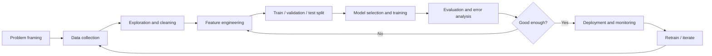

<a id="top"></a>

# Introduction to Artificial Intelligence and Machine Learning

This module introduces core ideas in artificial intelligence (AI) and machine learning (ML): how systems learn from data, which families of algorithms exist, how models are evaluated, and how a trained model can move from experiment to a simple deployed service—with **Streamlit** as a practical choice for interactive visualization and lightweight apps.

---

## Table of contents

| # | Section | Jump |
|---|---------|------|
| 1 | [What is Artificial Intelligence?](#what-is-artificial-intelligence) | [↑](#what-is-artificial-intelligence) |
| 2 | [What is Machine Learning?](#what-is-machine-learning) | [↑](#what-is-machine-learning) |
| 3 | [Types of Learning](#types-of-learning-supervised-unsupervised-reinforcement) | [↑](#types-of-learning-supervised-unsupervised-reinforcement) |
| 4 | [Classic ML Algorithms](#classic-ml-algorithms) | [↑](#classic-ml-algorithms) |
| 5 | [The ML Pipeline from A to Z](#the-ml-pipeline-from-a-to-z) | [↑](#the-ml-pipeline-from-a-to-z) |
| 6 | [Evaluation Metrics](#evaluation-metrics-accuracy-precision-recall-f1-confusion-matrix) | [↑](#evaluation-metrics-accuracy-precision-recall-f1-confusion-matrix) |
| 7 | [Overfitting vs Underfitting](#overfitting-vs-underfitting) | [↑](#overfitting-vs-underfitting) |
| 8 | [Python Libraries for ML](#python-libraries-for-ml) | [↑](#python-libraries-for-ml) |
| 9 | [Concrete Example: Iris Classification](#concrete-example-iris-classification) | [↑](#concrete-example-iris-classification) |
| 10 | [From Model to Deployment](#from-model-to-deployment-joblib-fastapi-streamlit) | [↑](#from-model-to-deployment-joblib-fastapi-streamlit) |
| 11 | [ML Glossary](#ml-glossary) | [↑](#ml-glossary) |
| 12 | [Conclusion](#conclusion) | [↑](#conclusion) |

[Back to top](#top)

---

<a id="what-is-artificial-intelligence"></a>

## 1. What is Artificial Intelligence?

**Artificial Intelligence (AI)** is the field of computing focused on building systems that perform tasks that typically require human-like judgment: perception, reasoning, planning, language understanding, and decision-making under uncertainty.

Modern AI spans:

| Area | Typical tasks |
|------|----------------|
| **Symbolic / rule-based AI** | Expert systems, planners, knowledge bases |
| **Machine learning** | Predict labels, cluster data, recommend items |
| **Deep learning** | Images, speech, text at scale (neural networks) |
| **Generative AI** | Text, images, code synthesis from learned patterns |

AI does not imply “consciousness”; it means **automating useful behavior** using data, algorithms, and compute.

<details>
<summary>Why ML became central to AI</summary>

Many real-world problems are too messy for hand-written rules. **Machine learning** lets systems **infer patterns from examples** (data) instead of encoding every case explicitly. That shift made AI practical for spam filters, fraud detection, medical imaging aids, recommendation engines, and more.

</details>

[Back to top](#top)

---

<a id="what-is-machine-learning"></a>

## 2. What is Machine Learning?

**Machine learning** is a subset of AI where a **model** is built or adjusted using **data** so that it can make **predictions or decisions** on new, unseen inputs.

Key ingredients:

| Ingredient | Role |
|------------|------|
| **Data** | Examples the system learns from |
| **Features** | Measurable inputs (columns, pixels, tokens) |
| **Model** | Mathematical mapping from inputs to outputs |
| **Training** | Adjusting model parameters to reduce error |
| **Evaluation** | Measuring quality on held-out data |
| **Deployment** | Using the model in production (API, app, batch job) |

The goal is **generalization**: good performance on **new** data, not memorizing the training set.

[Back to top](#top)

---

<a id="types-of-learning-supervised-unsupervised-reinforcement"></a>

## 3. Types of Learning (Supervised, Unsupervised, Reinforcement)

### 3.1 Supervised learning

You have **input–output pairs** $(x, y)$. The model learns to predict $y$ from $x$.

| Task type | Output $y$ | Example |
|-----------|--------------|---------|
| **Classification** | Discrete label | Spam / not spam |
| **Regression** | Continuous value | House price |

### 3.2 Unsupervised learning

You have **inputs only** (no labels). The model finds **structure**: groups, low-dimensional representations, or anomalies.

| Task type | Goal | Example |
|-----------|------|---------|
| **Clustering** | Group similar points | Customer segments |
| **Dimensionality reduction** | Compress features | Visualization (2D projections) |

### 3.3 Reinforcement learning

An **agent** acts in an **environment**, receives **rewards** or penalties, and learns a **policy** (what action to take in each state) to maximize long-term reward. Common in games, robotics, and some recommendation/control settings.

```text
Supervised:     (x, y) pairs  →  learn f(x) ≈ y
Unsupervised:   x only        →  learn structure in x
Reinforcement:  states, actions, rewards  →  learn policy π(state) → action
```

[Back to top](#top)

---

<a id="classic-ml-algorithms"></a>

## 4. Classic ML Algorithms

The table below summarizes seven widely taught algorithms, typical problem types, and intuition.

| Algorithm | Learning type | Typical use | Core idea |
|-----------|---------------|-------------|-----------|
| **Linear regression** | Supervised (regression) | Predict continuous values | Fit a linear relationship between features and target |
| **Logistic regression** | Supervised (classification) | Binary / multiclass labels | Model class probabilities with a sigmoid / softmax |
| **k-Nearest Neighbors (k-NN)** | Supervised | Classification / regression | Predict from the $k$ closest training examples |
| **Decision tree** | Supervised | Classification / regression | Recursive splits on features (if–else rules) |
| **Random forest** | Supervised | Classification / regression | Ensemble of trees; reduces variance vs single tree |
| **Support Vector Machine (SVM)** | Supervised | Classification (often binary) | Find a margin-maximizing boundary (with kernels for non-linear data) |
| **k-Means** | Unsupervised | Clustering | Assign points to $k$ centroids; iterate until stable |

<details>
<summary>How to choose among them (high level)</summary>

- **Interpretability**: Trees and linear/logistic models are often easier to explain than deep nets or opaque ensembles.
- **Data size**: k-NN can be slow at prediction time on large datasets; linear models scale well.
- **Non-linearity**: Kernels (SVM), tree ensembles, or neural networks handle non-linear patterns; linear models need feature engineering.
- **No labels**: Use **k-Means** or other clustering when you only have $x$.

</details>

[Back to top](#top)

---

<a id="the-ml-pipeline-from-a-to-z"></a>

## 5. The ML Pipeline from A to Z

An end-to-end ML workflow connects business goals, data work, modeling, validation, and release.



| Stage | What you do |
|-------|-------------|
| **Problem framing** | Define the target, constraints, and success metrics |
| **Data** | Collect, document, clean, handle missing values and outliers |
| **Features** | Scale, encode categories, create derived variables |
| **Split** | Hold out test data; use validation for tuning |
| **Training** | Fit models; tune hyperparameters |
| **Evaluation** | Metrics, confusion matrix, calibration, fairness checks as needed |
| **Deployment** | Package model, expose API or UI, log predictions, monitor drift |

[Back to top](#top)

---

<a id="evaluation-metrics-accuracy-precision-recall-f1-confusion-matrix"></a>

## 6. Evaluation Metrics (Accuracy, Precision, Recall, F1, Confusion Matrix)

For **binary classification**, start from the **confusion matrix**:

| | Predicted positive | Predicted negative |
|--|-------------------|-------------------|
| **Actual positive** | True Positive (TP) | False Negative (FN) |
| **Actual negative** | False Positive (FP) | True Negative (TN) |

Definitions (binary case):

| Metric | Formula | Meaning |
|--------|---------|---------|
| **Accuracy** | $\frac{TP + TN}{TP + TN + FP + FN}$ | Fraction of all correct predictions |
| **Precision** | $\frac{TP}{TP + FP}$ | Of predicted positives, how many were correct |
| **Recall** (sensitivity) | $\frac{TP}{TP + FN}$ | Of actual positives, how many were found |
| **F1-score** | $2 \cdot \frac{\text{Precision} \cdot \text{Recall}}{\text{Precision} + \text{Recall}}$ | Harmonic mean of precision and recall |

**When accuracy misleads**: Imbalanced classes (e.g., 99% negatives) can yield high accuracy with a useless model. Prefer **precision/recall/F1** or **ROC-AUC / PR-AUC**, and always inspect the **confusion matrix**.

For **multiclass** problems, metrics are often averaged per class (**macro**), weighted by support (**weighted**), or computed **per class** then summarized.

[Back to top](#top)

---

<a id="overfitting-vs-underfitting"></a>

## 7. Overfitting vs Underfitting

| Concept | What happens | Typical signals | Mitigations |
|---------|--------------|-----------------|-------------|
| **Underfitting** | Model too simple to capture patterns | High error on train and test | Richer model, better features, train longer (if under-trained) |
| **Overfitting** | Model memorizes noise in training data | Low train error, high test error | More data, regularization, simpler model, cross-validation, early stopping |

```text
Underfitting:  high bias  — oversimplified
Overfitting:   high variance — too sensitive to training noise
```

**Bias–variance tradeoff**: Reducing bias often increases variance and vice versa; the aim is a model that **generalizes**.

<details>
<summary>Practical checks</summary>

- Compare **train vs validation** curves.
- Use **cross-validation** for more stable estimates than a single split.
- Keep a **held-out test set** untouched until final reporting.

</details>

[Back to top](#top)

---

<a id="python-libraries-for-ml"></a>

## 8. Python Libraries for ML

| Library | Role |
|---------|------|
| **NumPy** | N-dimensional arrays, linear algebra |
| **pandas** | Tabular data, cleaning, aggregation |
| **scikit-learn** | Classical ML algorithms, preprocessing, pipelines, metrics |
| **matplotlib / seaborn** | Static plots and statistical visuals |
| **Streamlit** | **Rapid interactive web apps** for dashboards, model demos, and **visual exploration of data and predictions** without building a full front-end |
| **joblib** | Efficient serialization of Python objects (common for saving sklearn models) |
| **FastAPI** | Modern API framework to serve predictions behind HTTP |

**Streamlit** is especially useful when you want stakeholders to **upload a CSV, tweak a threshold, or see metrics and charts** in the browser while your model logic stays in Python.

[Back to top](#top)

---

<a id="concrete-example-iris-classification"></a>

## 9. Concrete Example: Iris Classification

The **Iris** dataset predicts one of three flower species from four numeric measurements (sepal/petal length and width). It is the standard teaching example for multiclass classification.

```python
from sklearn.datasets import load_iris
from sklearn.model_selection import train_test_split
from sklearn.preprocessing import StandardScaler
from sklearn.pipeline import Pipeline
from sklearn.linear_model import LogisticRegression
from sklearn.metrics import classification_report, confusion_matrix

X, y = load_iris(return_X_y=True)
X_train, X_test, y_train, y_test = train_test_split(
    X, y, test_size=0.2, random_state=42, stratify=y
)

clf = Pipeline(
    steps=[
        ("scaler", StandardScaler()),
        ("model", LogisticRegression(max_iter=200)),
    ]
)
clf.fit(X_train, y_train)
y_pred = clf.predict(X_test)

print(confusion_matrix(y_test, y_pred))
print(classification_report(y_test, y_pred))
```

This pattern—**split → pipeline (preprocess + model) → fit → predict → report**—applies to many real projects.

[Back to top](#top)

---

<a id="from-model-to-deployment-joblib-fastapi-streamlit"></a>

## 10. From Model to Deployment (joblib, FastAPI, Streamlit)

### 10.1 Saving the model with joblib

```python
import joblib

joblib.dump(clf, "iris_model.joblib")
loaded = joblib.load("iris_model.joblib")
```

### 10.2 Serving predictions with FastAPI (sketch)

```python
from fastapi import FastAPI
import joblib
import numpy as np

app = FastAPI()
model = joblib.load("iris_model.joblib")

@app.post("/predict")
def predict(features: list[float]):
    x = np.array(features, dtype=float).reshape(1, -1)
    pred = int(model.predict(x)[0])
    return {"species_id": pred}
```

### 10.3 Streamlit for a simple UI

**Streamlit** can call the same loaded model (or call your FastAPI endpoint) and display inputs, predictions, and charts in a few dozen lines—ideal for **prototypes, teaching, and internal tools**.

```python
import streamlit as st
import joblib
import numpy as np

st.title("Iris classifier demo")
model = joblib.load("iris_model.joblib")

sepal_l = st.number_input("Sepal length (cm)", value=5.1)
sepal_w = st.number_input("Sepal width (cm)", value=3.5)
petal_l = st.number_input("Petal length (cm)", value=1.4)
petal_w = st.number_input("Petal width (cm)", value=0.2)

if st.button("Predict"):
    x = np.array([[sepal_l, sepal_w, petal_l, petal_w]])
    pred = model.predict(x)[0]
    st.success(f"Predicted class index: {pred}")
```

| Layer | Tool | Purpose |
|-------|------|---------|
| Artifact | **joblib** | Persist trained pipeline |
| API | **FastAPI** | Machine-to-machine predictions |
| UI / viz | **Streamlit** | Human-friendly exploration and demos |

[Back to top](#top)

---

<a id="ml-glossary"></a>

## 11. ML Glossary

<details>
<summary>Expand glossary (A–Z selection)</summary>

| Term | Short definition |
|------|------------------|
| **Algorithm** | Procedure used to train or optimize a model |
| **Batch inference** | Running the model on many inputs at once (offline) |
| **Cross-validation** | Repeated train/validate splits to estimate performance |
| **Feature** | One measurable input to the model |
| **Generalization** | Performance on new data not used in training |
| **Hyperparameter** | Setting chosen before training (e.g., $k$ in k-NN) |
| **Inference** | Using a trained model to make predictions |
| **Label** | Target output in supervised learning |
| **Loss function** | Quantity minimized during training |
| **Model** | Learned mapping from inputs to outputs |
| **Overfitting** | Memorizing training noise; poor test performance |
| **Parameter** | Values learned during training (e.g., weights) |
| **Pipeline** | Chained preprocessing + model steps |
| **Regularization** | Penalty that discourages overly complex fits |
| **Train / validation / test** | Splits for fitting, tuning, and final evaluation |

</details>

[Back to top](#top)

---

<a id="conclusion"></a>

## 12. Conclusion

You now have a map of **AI vs ML**, the three major **learning paradigms**, a set of **classic algorithms**, a full **ML pipeline** mindset, core **evaluation metrics** including the **confusion matrix**, intuition for **overfitting and underfitting**, and a practical Python stack where **Streamlit** complements libraries like **scikit-learn** for **visualization and lightweight deployment**.

Next steps in a course track: dive deeper into **preprocessing and pipelines**, **model selection and cross-validation**, **imbalanced data**, and **responsible ML** (privacy, fairness, monitoring).

[Back to top](#top)

---

_End of module: Introduction to Artificial Intelligence and Machine Learning._
