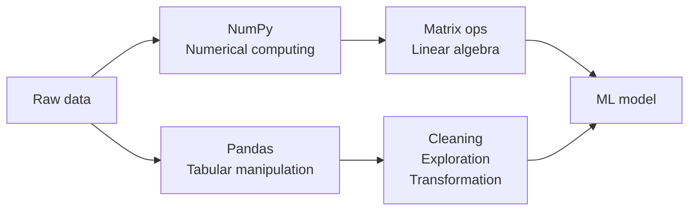
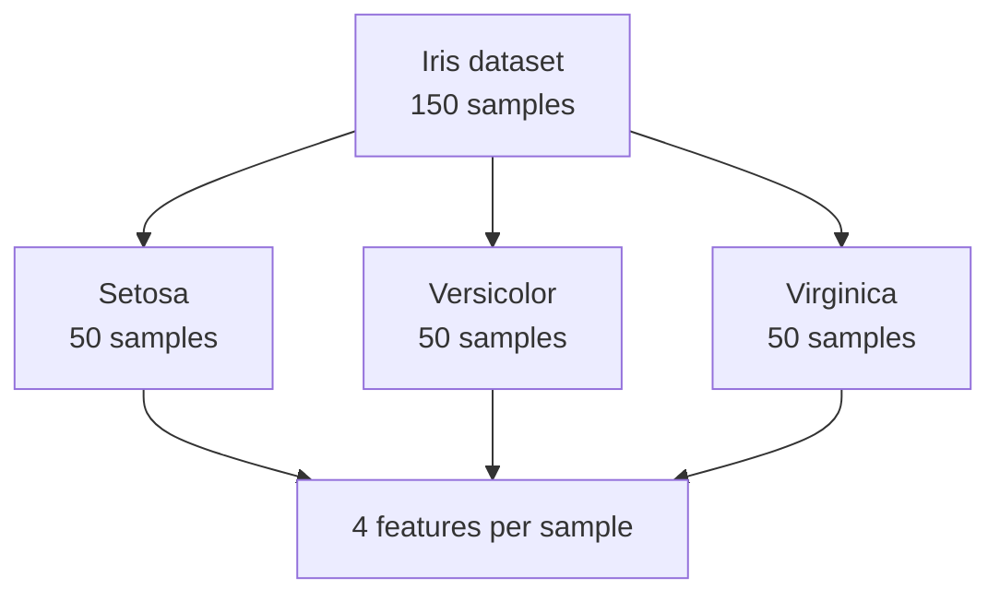
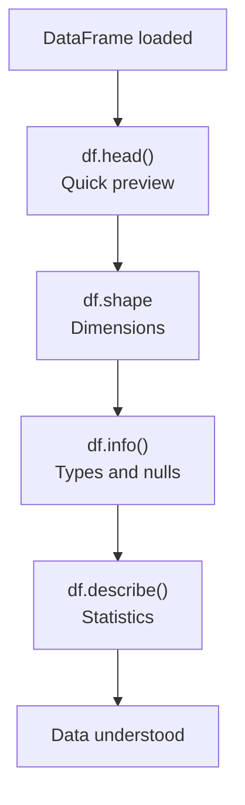
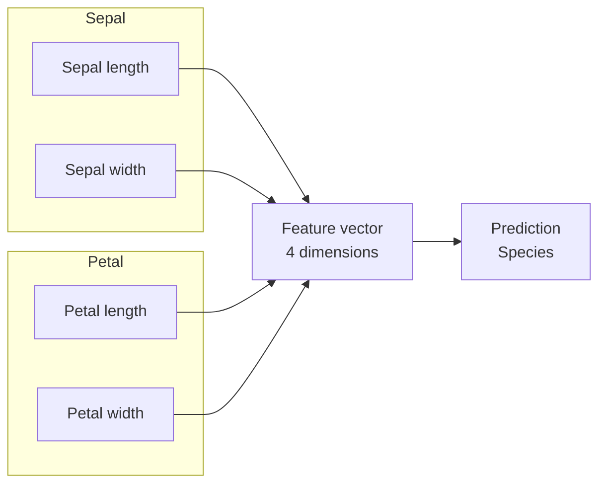
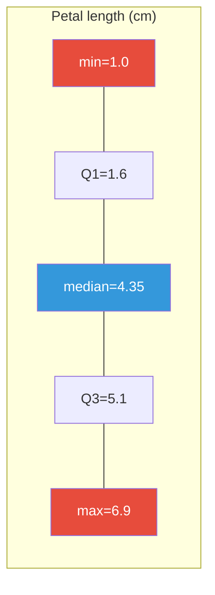
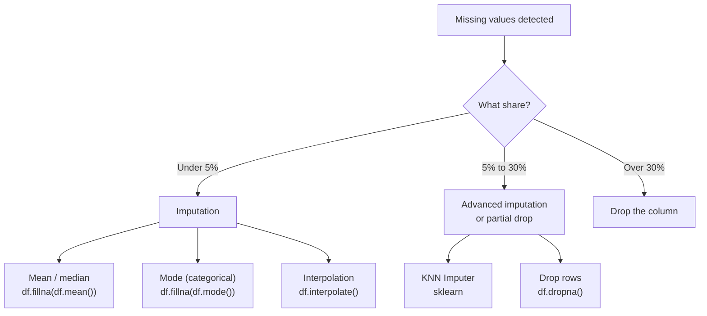
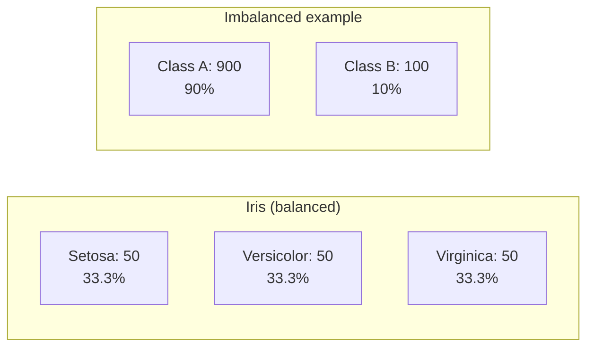
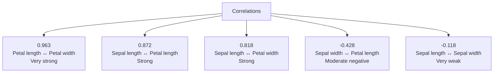
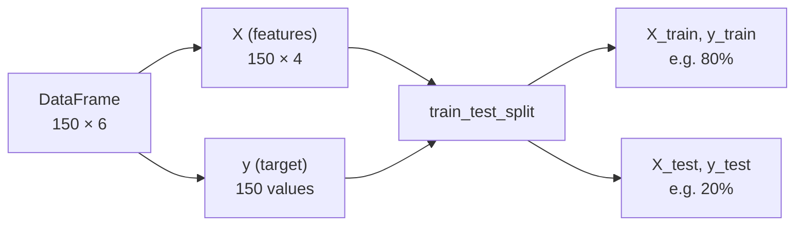
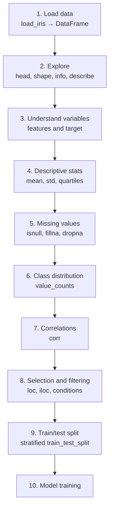

<a id="top"></a>

# 02 — Iris Dataset Exploration with Pandas and NumPy

> **Project**: Iris ML Demo — Full Stack App (Streamlit / Flutter + FastAPI + Jupyter)
>
> **Goal**: Master data exploration, analysis, and preparation with Pandas and NumPy using the Iris dataset.
>
> **Note**: This workflow is **identical regardless of frontend** (Streamlit, Flutter, or any other UI). Only the presentation layer changes; the data science steps stay the same.

---

## Table of contents

| No. | Section | Link |
|-----|---------|------|
| 1 | Introduction to Pandas and NumPy | [Go](#section-1) |
| 2 | Loading the Iris Dataset | [Go](#section-2) |
| 3 | Exploring the Data (head, shape, info, describe) | [Go](#section-3) |
| 4 | Understanding Features and Target | [Go](#section-4) |
| 5 | Descriptive Statistics | [Go](#section-5) |
| 6 | Checking for Missing Values | [Go](#section-6) |
| 7 | Class Distribution | [Go](#section-7) |
| 8 | Feature Correlations | [Go](#section-8) |
| 9 | Selection and Filtering with Pandas | [Go](#section-9) |
| 10 | Preparing for Training (train_test_split) | [Go](#section-10) |
| 11 | Summary and Best Practices | [Go](#section-11) |

---

<a id="section-1"></a>

<details>
<summary><strong>1 — Introduction to Pandas and NumPy</strong></summary>

### What is NumPy?

**NumPy** (Numerical Python) is the foundational library for scientific computing in Python. It provides a high-performance multidimensional array object (`ndarray`) and optimized mathematical tools.

```python
import numpy as np

# Create a NumPy array
arr = np.array([1, 2, 3, 4, 5])
print(arr.mean())   # 3.0
print(arr.std())    # 1.4142135623730951
```

### What is Pandas?

**Pandas** is a library built on top of NumPy that offers tabular data structures (`DataFrame`, `Series`) ideal for manipulating and analyzing structured data.

```python
import pandas as pd

# Create a simple DataFrame
data = {"name": ["Alice", "Bob"], "age": [25, 30]}
df = pd.DataFrame(data)
print(df)
```

| Sample output: |
|----------------|
| `   name  age` |
| `0  Alice   25` |
| `1    Bob   30` |

### Why are they essential in data science?



| Library | Primary role | Key structure |
|-----------|--------------|---------------|
| **NumPy** | High-performance numerical computing | `ndarray` |
| **Pandas** | Data manipulation and analysis | `DataFrame`, `Series` |
| **scikit-learn** | Machine learning algorithms | Estimators |

> **In short**: NumPy handles raw numerical computation, Pandas structures and manipulates tabular data, and scikit-learn builds models. Together they form the backbone of most Python data science projects.

### Installation

In this project, dependencies are listed in `requirements.txt`:

```bash
# Activate your virtual environment, then:
pip install -r requirements.txt
```

Standard imports used throughout this course:

```python
import numpy as np
import pandas as pd
from sklearn.datasets import load_iris
```

</details>

<p align="right"><a href="#top">↑ Back to top</a></p>

---

<a id="section-2"></a>

<details>
<summary><strong>2 — Loading the Iris Dataset</strong></summary>

### The Iris dataset

The Iris dataset is one of the most famous benchmarks in machine learning. Created by biologist Ronald Fisher in 1936, it contains 150 samples of iris flowers across 3 species.



### Loading with scikit-learn

```python
from sklearn.datasets import load_iris
import pandas as pd

iris = load_iris()

print(type(iris))          # <class 'sklearn.utils._bunch.Bunch'>
print(iris.keys())         # dict_keys(['data', 'target', 'frame', 'target_names', ...])
```

The returned object is a `Bunch` (dictionary-like) containing:

| Attribute | Type | Description |
|-----------|------|-------------|
| `iris.data` | `ndarray (150, 4)` | The 4 features for each sample |
| `iris.target` | `ndarray (150,)` | Class label (0, 1, or 2) |
| `iris.feature_names` | `list` | Names of the 4 feature columns |
| `iris.target_names` | `ndarray` | Names of the 3 species |
| `iris.DESCR` | `str` | Full textual description of the dataset |

### Converting to a Pandas DataFrame

```python
df = pd.DataFrame(data=iris.data, columns=iris.feature_names)

df["target"] = iris.target

df["species"] = df["target"].map({
    0: "setosa",
    1: "versicolor",
    2: "virginica",
})

print(df.head())
```

**Output:**

```
   sepal length (cm)  sepal width (cm)  petal length (cm)  petal width (cm)  target species
0                5.1               3.5                1.4               0.2       0  setosa
1                4.9               3.0                1.4               0.2       0  setosa
2                4.7               3.2                1.3               0.2       0  setosa
3                4.6               3.1                1.5               0.2       0  setosa
4                5.0               3.6                1.4               0.2       0  setosa
```

> **Tip**: Keep both numeric `target` (for ML algorithms) and string `species` (for readability).

</details>

<p align="right"><a href="#top">↑ Back to top</a></p>

---

<a id="section-3"></a>

<details>
<summary><strong>3 — Exploring the Data (head, shape, info, describe)</strong></summary>

Once the DataFrame exists, the first step is always to explore structure, size, and content.

### 3.1 — `df.head()` and `df.tail()`

```python
df.head()

df.tail(3)
```

`head()` and `tail()` quickly confirm that data loaded as expected.

### 3.2 — `df.shape`

```python
print(df.shape)  # (150, 6)
```

| Dimension | Value | Meaning |
|-----------|-------|---------|
| Rows | 150 | Number of samples (observations) |
| Columns | 6 | 4 features + `target` + `species` |

### 3.3 — `df.info()`

```python
df.info()
```

**Output:**

```
<class 'pandas.core.frame.DataFrame'>
RangeIndex: 150 entries, 0 to 149
Data columns (total 6 columns):
 #   Column             Non-Null Count  Dtype  
---  ------             --------------  -----  
 0   sepal length (cm)  150 non-null    float64
 1   sepal width (cm)   150 non-null    float64
 2   petal length (cm)  150 non-null    float64
 3   petal width (cm)   150 non-null    float64
 4   target             150 non-null    int64  
 5   species            150 non-null    object 
dtypes: float64(4), int64(1), object(1)
memory usage: 7.2+ KB
```

**What `info()` tells you:**

- Index type (`RangeIndex` → simple 0–149 integer index)
- Non-null counts per column (here 150 everywhere → no missing values in this view)
- dtypes (`float64`, `int64`, `object`)
- Approximate memory usage

### 3.4 — `df.describe()`

```python
df.describe()
```

**Output:**

```
       sepal length (cm)  sepal width (cm)  petal length (cm)  petal width (cm)      target
count         150.000000        150.000000         150.000000        150.000000  150.000000
mean            5.843333          3.057333           3.758000          1.199333    1.000000
std             0.828066          0.435866           1.765298          0.762238    0.819232
min             4.300000          2.000000           1.000000          0.100000    0.000000
25%             5.100000          2.800000           1.600000          0.300000    0.000000
50%             5.800000          3.000000           4.350000          1.300000    1.000000
75%             6.400000          3.300000           5.100000          1.800000    2.000000
max             7.900000          4.400000           6.900000          2.500000    2.000000
```

> **`describe()`** summarizes numeric columns automatically. Section 5 explains each statistic in depth.

### 3.5 — `df.dtypes` and `df.columns`

```python
print(df.dtypes)

print(df.columns.tolist())
# ['sepal length (cm)', 'sepal width (cm)', 'petal length (cm)', 'petal width (cm)', 'target', 'species']
```

### Exploration workflow



</details>

<p align="right"><a href="#top">↑ Back to top</a></p>

---

<a id="section-4"></a>

<details>
<summary><strong>4 — Understanding Features and Target</strong></summary>

### Iris flower anatomy

The dataset records four physical measurements per flower:



> **Sepal**: outer part of the flower that protects the bud before bloom.
>
> **Petal**: inner, often colored part of the flower.

### Feature reference

| Feature | Unit | Approx. min | Approx. max | Approx. mean | Description |
|---------|------|-------------|-------------|--------------|-------------|
| `sepal length (cm)` | cm | 4.3 | 7.9 | 5.84 | Length of the sepal |
| `sepal width (cm)` | cm | 2.0 | 4.4 | 3.06 | Width of the sepal |
| `petal length (cm)` | cm | 1.0 | 6.9 | 3.76 | Length of the petal |
| `petal width (cm)` | cm | 0.1 | 2.5 | 1.20 | Width of the petal |

### The target (label)

The target is the **species**, encoded as an integer:

| Code | Species | Latin name | Distinctive trait |
|------|---------|------------|-------------------|
| 0 | **Setosa** | *Iris setosa* | Small petals; often easy to separate |
| 1 | **Versicolor** | *Iris versicolor* | Medium size; overlaps with virginica |
| 2 | **Virginica** | *Iris virginica* | Largest petals among the three |

### Verify names in code

```python
print("Features:", iris.feature_names)
# ['sepal length (cm)', 'sepal width (cm)', 'petal length (cm)', 'petal width (cm)']

print("Classes:", iris.target_names)
# ['setosa' 'versicolor' 'virginica']

print("Number of features:", len(iris.feature_names))  # 4
print("Number of classes:", len(iris.target_names))     # 3
```

### Means by species

```python
print(df.groupby("species").mean(numeric_only=True))
```

**Output:**

```
            sepal length (cm)  sepal width (cm)  petal length (cm)  petal width (cm)  target
species                                                                                      
setosa                  5.006             3.428              1.462             0.246       0
versicolor              5.936             2.770              4.260             1.326       1
virginica               6.588             2.974              5.552             2.026       2
```

> **Key observation**: Setosa stands out with much smaller petals on average (about 1.46 cm length vs. 4.26 and 5.55 for the other two), which makes it easier to classify.

</details>

<p align="right"><a href="#top">↑ Back to top</a></p>

---

<a id="section-5"></a>

<details>
<summary><strong>5 — Descriptive Statistics</strong></summary>

### Recap: `df.describe()`

```python
stats = df.describe()
print(stats)
```

### What each statistic means

| Statistic | Formula / idea | What it tells you |
|-----------|----------------|-------------------|
| **count** | Number of non-null values | Detects missing data |
| **mean** | $\bar{x} = \frac{1}{n}\sum_{i=1}^{n} x_i$ | Central tendency |
| **std** | $s = \sqrt{\frac{1}{n-1}\sum(x_i - \bar{x})^2}$ | Spread around the mean |
| **min** | Smallest value | Lower bound |
| **25%** | First quartile (Q1) | 25% of values fall below |
| **50%** | Median (Q2) | Middle value; robust to outliers |
| **75%** | Third quartile (Q3) | 75% of values fall below |
| **max** | Largest value | Upper bound |

### Interpreting Iris



**Notable patterns:**

| Feature | Std | Interpretation |
|---------|-----|----------------|
| `sepal length` | 0.83 | Moderate spread |
| `sepal width` | 0.44 | Lower spread → similar sepal widths |
| `petal length` | 1.77 | **High spread** → strong variation across species |
| `petal width` | 0.76 | Moderate to strong spread |

> **Takeaway**: High standard deviation on `petal length` suggests the feature varies a lot between species and is likely **discriminative** for classification.

### Manual computation with NumPy

```python
import numpy as np

petal_length = df["petal length (cm)"].values

print(f"Mean   : {np.mean(petal_length):.4f}")       # 3.7580
print(f"Std    : {np.std(petal_length, ddof=1):.4f}")  # 1.7653
print(f"Median : {np.median(petal_length):.4f}")    # 4.3500
print(f"Q1     : {np.percentile(petal_length, 25):.4f}")  # 1.6000
print(f"Q3     : {np.percentile(petal_length, 75):.4f}")  # 5.1000
print(f"IQR    : {np.percentile(petal_length, 75) - np.percentile(petal_length, 25):.4f}")  # 3.5000
```

> **Note**: `ddof=1` uses Bessel’s correction (divide by $n-1$) for the sample standard deviation, matching Pandas `std()`.

### Interquartile range (IQR)

**IQR** = Q3 − Q1 measures spread of the middle 50% of the data and helps flag **outliers**:

```python
Q1 = df["sepal width (cm)"].quantile(0.25)
Q3 = df["sepal width (cm)"].quantile(0.75)
IQR = Q3 - Q1

lower = Q1 - 1.5 * IQR
upper = Q3 + 1.5 * IQR

outliers = df[(df["sepal width (cm)"] < lower) | (df["sepal width (cm)"] > upper)]
print(f"Potential outliers: {len(outliers)}")
```

</details>

<p align="right"><a href="#top">↑ Back to top</a></p>

---

<a id="section-6"></a>

<details>
<summary><strong>6 — Checking for Missing Values</strong></summary>

### Why check for missing values?

Missing values (`NaN`) are among the most common issues in data science. They can:

- **Bias statistics** (e.g., distorted means)
- **Break many ML algorithms** (most estimators do not accept NaNs)
- **Shrink effective sample size** if rows are dropped

### Checking with Pandas

```python
print(df.isnull().sum())
```

**Output:**

```
sepal length (cm)    0
sepal width (cm)     0
petal length (cm)    0
petal width (cm)     0
target               0
species              0
dtype: int64
```

> **Result**: The Iris dataset has **no missing values**. It is clean and complete, which is uncommon in real-world data.

### Additional checks

```python
print(f"Total NaNs: {df.isnull().sum().sum()}")  # 0

print((df.isnull().sum() / len(df) * 100).round(2))

print(f"Any NaNs? {df.isnull().any().any()}")  # False
```

### If values were missing

In production projects, common strategies include:



**Code sketches:**

```python
df_filled = df.fillna(df.mean(numeric_only=True))

df_filled = df.fillna(df.median(numeric_only=True))

df_clean = df.dropna()

# Advanced: KNN imputation (example; pick numeric columns in real use)
from sklearn.impute import KNNImputer
# imputer = KNNImputer(n_neighbors=5)
# df_imputed = pd.DataFrame(imputer.fit_transform(df[numeric_cols]), columns=numeric_cols)
```

> **Best practice**: Always check missing values **before** analysis or training—even when the dataset “looks” clean.

</details>

<p align="right"><a href="#top">↑ Back to top</a></p>

---

<a id="section-7"></a>

<details>
<summary><strong>7 — Class Distribution</strong></summary>

### Count samples per class

```python
print(df["species"].value_counts())
```

**Output:**

```
setosa        50
versicolor    50
virginica     50
Name: species, dtype: int64
```

### Balanced vs. imbalanced data



| Aspect | Balanced dataset | Imbalanced dataset |
|--------|------------------|---------------------|
| Distribution | Similar class proportions | One class dominates |
| Accuracy alone reliable? | Often yes | Often no (misleading) |
| Example | Iris (50/50/50) | Fraud detection (~99% “normal”) |
| Typical ML response | Standard pipeline | Class weights, resampling, etc. |

### Programmatic balance check

```python
print(df["species"].value_counts(normalize=True))
```

**Output:**

```
setosa        0.333333
versicolor    0.333333
virginica     0.333333
Name: species, dtype: float64
```

```python
counts = df["species"].value_counts()
is_balanced = counts.nunique() == 1
print(f"Perfectly balanced: {is_balanced}")  # True
```

### Why it matters

**Imbalanced** data causes:

1. **Model bias** toward the majority class
2. **Misleading accuracy** (e.g., 90% accuracy when 90% is one class)
3. Need for **precision, recall, F1**, not accuracy alone

> **Good news**: Iris is **perfectly balanced** (50 samples per class, ~33.3% each). No rebalancing is required here.

### Using numeric `target`

```python
print(df["target"].value_counts().sort_index())
```

**Output:**

```
0    50
1    50
2    50
Name: target, dtype: int64
```

</details>

<p align="right"><a href="#top">↑ Back to top</a></p>

---

<a id="section-8"></a>

<details>
<summary><strong>8 — Feature Correlations</strong></summary>

### Correlation matrix

**Correlation** measures linear association between two variables. It ranges from **−1** (perfect negative) to **+1** (perfect positive).

```python
feature_cols = [
    "sepal length (cm)",
    "sepal width (cm)",
    "petal length (cm)",
    "petal width (cm)",
]
correlation_matrix = df[feature_cols].corr()
print(correlation_matrix.round(3))
```

**Output:**

```
                   sepal length (cm)  sepal width (cm)  petal length (cm)  petal width (cm)
sepal length (cm)              1.000            -0.118              0.872             0.818
sepal width (cm)              -0.118             1.000             -0.428            -0.366
petal length (cm)              0.872            -0.428              1.000             0.963
petal width (cm)               0.818            -0.366              0.963             1.000
```

### Reading the correlations



| Pair | Correlation | Interpretation |
|------|-------------|----------------|
| Petal length ↔ Petal width | **0.963** | Near-linear: long petals tend to be wide |
| Sepal length ↔ Petal length | **0.872** | Strong: longer sepals with longer petals |
| Sepal length ↔ Petal width | **0.818** | Strong: overall size consistency |
| Sepal width ↔ Petal length | **−0.428** | Moderate negative |
| Sepal length ↔ Sepal width | **−0.118** | Very weak; nearly independent |

### Rule-of-thumb scale

| Absolute value | Strength |
|----------------|----------|
| 0.00 – 0.19 | Very weak |
| 0.20 – 0.39 | Weak |
| 0.40 – 0.59 | Moderate |
| 0.60 – 0.79 | Strong |
| 0.80 – 1.00 | Very strong |

### Implications for machine learning

```python
import numpy as np
import pandas as pd

corr = df[feature_cols].corr()
high_corr = []

for i in range(len(corr.columns)):
    for j in range(i + 1, len(corr.columns)):
        if abs(corr.iloc[i, j]) > 0.8:
            high_corr.append({
                "feature_1": corr.columns[i],
                "feature_2": corr.columns[j],
                "correlation": round(corr.iloc[i, j], 3),
            })

print(pd.DataFrame(high_corr))
```

**Output:**

```
           feature_1          feature_2  correlation
0  sepal length (cm)  petal length (cm)        0.872
1  sepal length (cm)   petal width (cm)        0.818
2  petal length (cm)   petal width (cm)        0.963
```

> **Takeaway**: `petal length` and `petal width` are highly correlated (0.963). In some projects you might drop one to reduce redundancy; with only four features, keeping both is usually fine for Iris.

</details>

<p align="right"><a href="#top">↑ Back to top</a></p>

---

<a id="section-9"></a>

<details>
<summary><strong>9 — Selection and Filtering with Pandas</strong></summary>

### 9.1 — Boolean filtering

```python
setosa = df[df["species"] == "setosa"]
print(f"Setosa count: {len(setosa)}")  # 50
print(setosa.head())
```

```python
result = df[(df["species"] == "versicolor") & (df["petal length (cm)"] > 4.5)]
print(f"Versicolor with large petals: {len(result)}")
```

```python
subset = df[df["species"].isin(["setosa", "virginica"])]
print(f"Setosa + Virginica: {len(subset)}")  # 100
```

### 9.2 — `loc`: label-based selection

`loc` uses **row labels (index)** and **column names**:

```python
print(df.loc[0, "species"])  # 'setosa'

print(df.loc[0:4, ["sepal length (cm)", "species"]])

print(df.loc[:, "sepal length (cm)":"petal width (cm)"].head())
```

### 9.3 — `iloc`: position-based selection

`iloc` uses **integer positions** (NumPy-like):

```python
print(df.iloc[0, 0])  # 5.1

print(df.iloc[0:5, 0:4])

print(df.iloc[-1])
```

### `loc` vs. `iloc`

| Aspect | `loc` | `iloc` |
|--------|-------|--------|
| Indexing | Labels (names) | Integer positions |
| End of slice | Inclusive | Exclusive (Python style) |
| Typical use | Columns by name | Array-style slicing |
| Example | `df.loc[0:4, "species"]` | `df.iloc[0:5, -1]` |

### 9.4 — Slicing

```python
print(df[:10])

print(df[50:60])

print(df[::2].head())
```

### 9.5 — Selecting columns

```python
sepal_length = df["sepal length (cm)"]
print(type(sepal_length))  # <class 'pandas.core.series.Series'>

features_df = df[["sepal length (cm)", "petal length (cm)"]]
print(type(features_df))   # <class 'pandas.core.frame.DataFrame'>
```

### 9.6 — Combined practical examples

```python
top_sepal = df.nlargest(5, "sepal length (cm)")
print(top_sepal[["sepal length (cm)", "species"]])

small_petal = df.nsmallest(3, "petal width (cm)")
print(small_petal[["petal width (cm)", "species"]])

big_flowers = df[df["petal length (cm)"] > 5.0]
print(big_flowers["species"].value_counts())
```

**Last example output:**

```
virginica     41
versicolor     5
Name: species, dtype: int64
```

> **Observation**: 41 of 46 flowers with petal length > 5 cm are Virginica—another sign that `petal length` is highly discriminative.

</details>

<p align="right"><a href="#top">↑ Back to top</a></p>

---

<a id="section-10"></a>

<details>
<summary><strong>10 — Preparing for Training (train_test_split)</strong></summary>

### 10.1 — Splitting X (features) and y (target)

```python
X = df[
    [
        "sepal length (cm)",
        "sepal width (cm)",
        "petal length (cm)",
        "petal width (cm)",
    ]
]

y = df["target"]

print(f"X shape: {X.shape}")  # (150, 4)
print(f"y shape: {y.shape}")  # (150,)
```



### 10.2 — `train_test_split`

```python
from sklearn.model_selection import train_test_split

X_train, X_test, y_train, y_test = train_test_split(
    X,
    y,
    test_size=0.2,
    random_state=42,
    stratify=y,
)

print(f"X_train: {X_train.shape}")  # (120, 4)
print(f"X_test : {X_test.shape}")   # (30, 4)
print(f"y_train: {y_train.shape}")   # (120,)
print(f"y_test : {y_test.shape}")   # (30,)
```

### 10.3 — Parameter choices

#### `test_size=0.2`

| Split | Share | Samples (typical) | Role |
|-------|-------|-------------------|------|
| **Train** | 80% | 120 | Model learns from this |
| **Test** | 20% | 30 | Held-out evaluation |

> **Convention**: 80/20 is common. Very small datasets might use 70/30; very large ones might use 90/10 or 95/5.

#### `random_state=42`

Fixing the seed makes the split **reproducible** across runs and teammates. Any integer works; 42 is a widespread convention.

```python
X_train_a, _, _, _ = train_test_split(X, y, test_size=0.2, random_state=42)
X_train_b, _, _, _ = train_test_split(X, y, test_size=0.2, random_state=42)
print(X_train_a.iloc[0].equals(X_train_b.iloc[0]))  # True
```

#### `stratify=y`

Preserves **class proportions** in train and test:

```python
print("y_train distribution:")
print(y_train.value_counts().sort_index())
# 0    40
# 1    40
# 2    40

print("\ny_test distribution:")
print(y_test.value_counts().sort_index())
# 0    10
# 1    10
# 2    10
```

> **Without `stratify`**, you might randomly end up with no setosa in the test set, which skews evaluation.

### 10.4 — Pre-training checklist

```python
print("=== Pre-training checks ===")
print(f"1. No NaN in X_train: {not X_train.isnull().any().any()}")
print(f"2. No NaN in X_test : {not X_test.isnull().any().any()}")
print(f"3. Same row count X_train / y_train: {len(X_train) == len(y_train)}")
print(f"4. All classes in train: {sorted(y_train.unique()) == [0, 1, 2]}")
print(f"5. All classes in test : {sorted(y_test.unique()) == [0, 1, 2]}")
print(f"6. Disjoint train/test indices: {len(set(X_train.index) & set(X_test.index)) == 0}")
```

**Expected output:**

```
=== Pre-training checks ===
1. No NaN in X_train: True
2. No NaN in X_test : True
3. Same row count X_train / y_train: True
4. All classes in train: True
5. All classes in test : True
6. Disjoint train/test indices: True
```

</details>

<p align="right"><a href="#top">↑ Back to top</a></p>

---

<a id="section-11"></a>

<details>
<summary><strong>11 — Summary and Best Practices</strong></summary>

### End-to-end exploration workflow



### Essential Pandas commands

| Goal | Command |
|------|---------|
| Load CSV | `pd.read_csv("file.csv")` |
| Quick preview | `df.head()`, `df.tail()` |
| Dimensions | `df.shape` |
| Types and non-nulls | `df.info()` |
| Numeric summary | `df.describe()` |
| Missing counts | `df.isnull().sum()` |
| Value counts | `df["col"].value_counts()` |
| Correlations | `df.corr()` |
| Filter | `df[df["col"] > value]` |
| Label selection | `df.loc[rows, cols]` |
| Position selection | `df.iloc[rows, cols]` |
| Group and aggregate | `df.groupby("col").mean()` |
| Sort | `df.sort_values("col", ascending=False)` |
| Drop column | `df.drop("col", axis=1)` |

### Best practices

1. **Explore before modeling**: `head()`, `info()`, and `describe()` should be automatic first steps.
2. **Check missing values** with `isnull().sum()` on every new dataset.
3. **Inspect class balance** with `value_counts()` before choosing metrics.
4. **Use `stratify=y`** in classification splits when classes are small or balanced.
5. **Set `random_state`** for reproducible experiments.
6. **Review correlations** to understand redundancy and relationships.
7. **Document steps** in a Jupyter notebook for traceability.
8. **Never tune on the test set**—keep test data untouched until final evaluation.

### Next step in this project

The data is now ready for a classification model. In this repository, `notebook/train_model.ipynb` trains a **Random Forest** model, which is then served by the FastAPI backend and consumed by Streamlit or Flutter—**the Pandas exploration above is the same for both frontends**.

```python
from sklearn.ensemble import RandomForestClassifier

model = RandomForestClassifier(n_estimators=100, random_state=42)
model.fit(X_train, y_train)

accuracy = model.score(X_test, y_test)
print(f"Accuracy: {accuracy:.2%}")
```

</details>

<p align="right"><a href="#top">↑ Back to top</a></p>

---

> **Course**: English module for the *Iris ML Demo — Full Stack App* project
>
> **Libraries**: Pandas, NumPy, scikit-learn
>
> **Dataset**: Iris — 150 samples, 4 features, 3 classes
