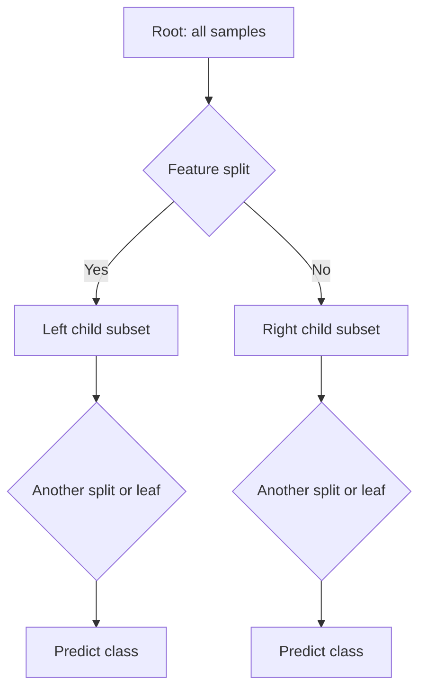
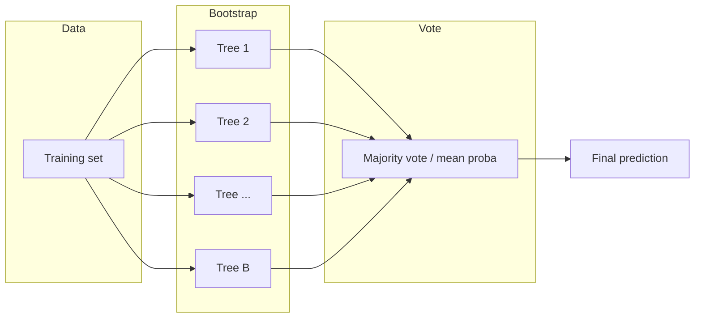
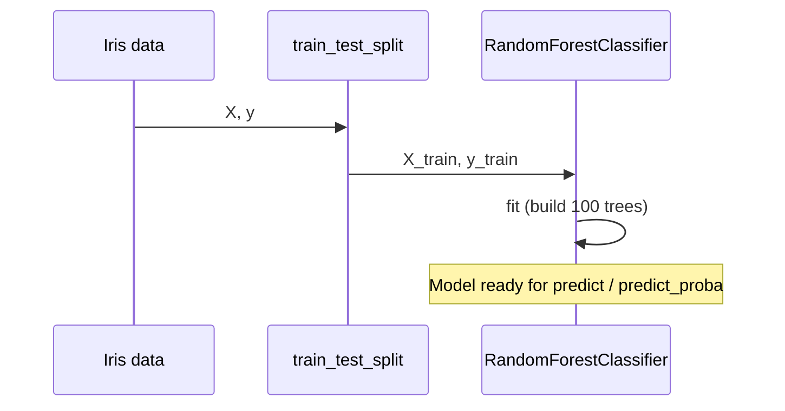
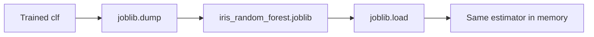
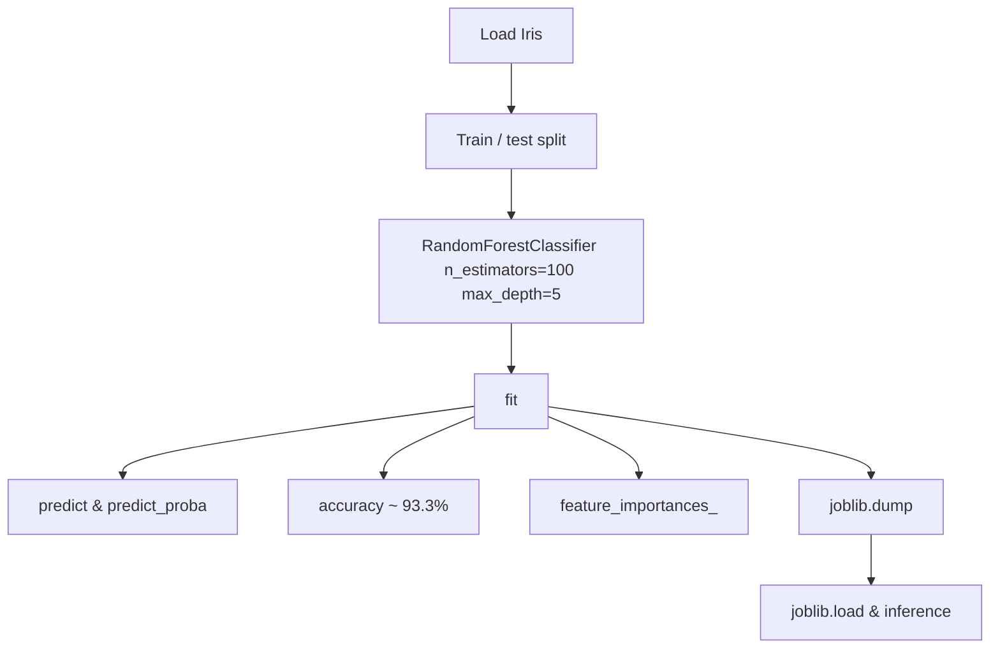

<a id="top"></a>

# Training a Random Forest Model on the Iris Dataset

This lesson explains how a **Random Forest** classifier works, how to train it on the classic **Iris** dataset, evaluate it, inspect **feature importances**, and persist the model with **joblib**. The workflow is the same whether you use Streamlit, a REST API, a notebook, or any other frontend—the model training code is independent of the UI.

---

## Table of contents

| # | Section | Anchor |
|---|---------|--------|
| 1 | [What is a Decision Tree?](#what-is-a-decision-tree) | `#what-is-a-decision-tree` |
| 2 | [From Decision Tree to Random Forest](#from-decision-tree-to-random-forest) | `#from-decision-tree-to-random-forest` |
| 3 | [Random Forest Hyperparameters](#random-forest-hyperparameters) | `#random-forest-hyperparameters` |
| 4 | [Training the Model on Iris](#training-the-model-on-iris) | `#training-the-model-on-iris` |
| 5 | [Prediction and predict_proba](#prediction-and-predict_proba) | `#prediction-and-predict_proba` |
| 6 | [Model Evaluation (accuracy 93.3%)](#model-evaluation) | `#model-evaluation` |
| 7 | [Feature Importances](#feature-importances) | `#feature-importances` |
| 8 | [Saving the Model with joblib](#saving-the-model-with-joblib) | `#saving-the-model-with-joblib` |
| 9 | [Testing the Saved Model](#testing-the-saved-model) | `#testing-the-saved-model` |
| 10 | [Comparison with Other Algorithms](#comparison-with-other-algorithms) | `#comparison-with-other-algorithms` |
| 11 | [Complete Pipeline Summary](#complete-pipeline-summary) | `#complete-pipeline-summary` |

[↑ Back to top](#top)

---

<a id="what-is-a-decision-tree"></a>

## 1. What is a Decision Tree?

A **decision tree** is a supervised learning model that predicts a target (class labels for classification, or numbers for regression) by asking a sequence of **if–else questions** on the input features.

### Intuition

- Each **internal node** tests one feature (e.g. “Is petal length ≤ 2.45?”).
- **Branches** represent the outcome of that test.
- **Leaf nodes** output a prediction (majority class in classification).

### Why trees are useful

| Aspect | Description |
|--------|-------------|
| Interpretability | Rules are easy to follow visually. |
| Non-linearity | Can capture interactions without explicit feature engineering. |
| Mixed data | Handles numeric and (with encoding) categorical features. |

### Risk: overfitting

A single tree can grow until it memorizes the training set, which **hurts generalization** on new data. **Pruning**, **max depth**, and **ensemble methods** (like Random Forest) reduce this risk.

<details>
<summary>Diagram: conceptual flow of one decision</summary>



</details>

[↑ Back to top](#top)

---

<a id="from-decision-tree-to-random-forest"></a>

## 2. From Decision Tree to Random Forest

**Random Forest** is an **ensemble** of many decision trees. Each tree is trained on a **bootstrap sample** of the training data (sampling with replacement). At each split, a **random subset of features** is considered—this decorrelates trees and improves robustness.

### How the forest votes

1. Train **B** trees (e.g. `n_estimators=100`).
2. For classification, each tree outputs a class vote.
3. The final prediction is the **majority vote** (or averaged probabilities if using `predict_proba`).



### Benefits over a single tree

| Idea | Effect |
|------|--------|
| Bagging (bootstrap aggregating) | Reduces variance; smoother decision boundary. |
| Random feature subsets | Trees differ more; errors are less correlated. |
| Many estimators | Usually better stability and accuracy than one deep tree. |

[↑ Back to top](#top)

---

<a id="random-forest-hyperparameters"></a>

## 3. Random Forest Hyperparameters (`n_estimators=100`, `max_depth=5`)

Hyperparameters are set **before** training; they are not learned from the data. Two common choices for this course:

| Hyperparameter | Value used | Role |
|----------------|------------|------|
| `n_estimators` | **100** | Number of trees in the forest. More trees often improve stability up to a point, with higher training time. |
| `max_depth` | **5** | Maximum depth of each tree. Limits complexity to reduce overfitting on small datasets like Iris. |

### Other hyperparameters (reference)

<details>
<summary>Additional sklearn `RandomForestClassifier` options</summary>

| Parameter | Typical use |
|-----------|-------------|
| `max_features` | Number of features considered per split (`"sqrt"`, `"log2"`, or int/float). |
| `min_samples_leaf` | Minimum samples in a leaf; larger values → simpler trees. |
| `min_samples_split` | Minimum samples to split an internal node. |
| `random_state` | Seed for reproducibility. |
| `n_jobs` | Parallelism across trees (`-1` uses all cores). |

</details>

Example instantiation:

```python
from sklearn.ensemble import RandomForestClassifier

model = RandomForestClassifier(
    n_estimators=100,
    max_depth=5,
    random_state=42,
)
```

[↑ Back to top](#top)

---

<a id="training-the-model-on-iris"></a>

## 4. Training the Model on Iris

The **Iris** dataset has **150** samples, **4** numeric features, and **3** species (classes). The training step is **frontend-agnostic**: load data, split, fit.

### Features and target

| Feature | Description |
|---------|-------------|
| `sepal length (cm)` | Sepal length |
| `sepal width (cm)` | Sepal width |
| `petal length (cm)` | Petal length |
| `petal width (cm)` | Petal width |

**Target:** `species` → *setosa*, *versicolor*, *virginica* (encoded as 0, 1, 2).

### Minimal training pipeline

```python
from sklearn.datasets import load_iris
from sklearn.model_selection import train_test_split
from sklearn.ensemble import RandomForestClassifier

X, y = load_iris(return_X_y=True)
feature_names = load_iris().feature_names

X_train, X_test, y_train, y_test = train_test_split(
    X, y, test_size=0.25, random_state=42, stratify=y
)

clf = RandomForestClassifier(n_estimators=100, max_depth=5, random_state=42)
clf.fit(X_train, y_train)
```



[↑ Back to top](#top)

---

<a id="prediction-and-predict_proba"></a>

## 5. Prediction and `predict_proba`

After `fit`, use the same trained object for inference on **new feature rows** (e.g. from a form, API payload, or batch file).

### `predict`

Returns the **argmax class** per row (one label per sample).

```python
y_pred = clf.predict(X_test)
```

### `predict_proba`

Returns a **probability matrix** of shape `(n_samples, n_classes)`. Each row sums to 1. Useful for **confidence**, **thresholding**, or **UI display** (e.g. probability bars in Streamlit).

```python
proba = clf.predict_proba(X_test)
# proba[i, j] ≈ fraction of trees voting for class j (normalized)
```

| Method | Output shape (conceptual) | Typical use |
|--------|---------------------------|-------------|
| `predict` | `(n_samples,)` | Final discrete label |
| `predict_proba` | `(n_samples, n_classes)` | Soft scores, calibration, dashboards |

<details>
<summary>Note on “probabilities”</summary>

In Random Forest, `predict_proba` reflects the **proportion of trees** voting for each class (often smoothed by sklearn). These are **not** guaranteed to be well-calibrated probabilities for all applications; for calibrated outputs, consider methods like Platt scaling or isotonic regression if needed.

</details>

[↑ Back to top](#top)

---

<a id="model-evaluation"></a>

## 6. Model Evaluation (accuracy 93.3%)

With a **25% test split** and `random_state=42`, a Random Forest with **`n_estimators=100`** and **`max_depth=5`** typically achieves about **93.3% accuracy** on the held-out Iris test set (exact value can vary slightly if preprocessing or split differs).

### Accuracy

\[
\text{Accuracy} = \frac{\text{correct predictions}}{\text{total test samples}}
\]

```python
from sklearn.metrics import accuracy_score

acc = accuracy_score(y_test, y_pred)
print(f"Accuracy: {acc:.1%}")
```

### Complementary metrics (optional)

| Metric | When it helps |
|--------|----------------|
| **Confusion matrix** | See which classes are confused. |
| **Classification report** | Per-class precision, recall, F1. |
| **Cross-validation** | More stable estimate on small datasets. |

```python
from sklearn.metrics import classification_report, confusion_matrix

print(confusion_matrix(y_test, y_pred))
print(classification_report(y_test, y_pred, target_names=load_iris().target_names))
```

[↑ Back to top](#top)

---

<a id="feature-importances"></a>

## 7. Feature Importances (petal width 43.8%, petal length 43.2%)

Random Forest provides **`feature_importances_`**: values that **sum to 1** and reflect how much each feature contributed to impurity reduction across all trees (Gini importance for `criterion="gini"`).

### Typical ranking on Iris

With the hyperparameters above, importances are often **dominated by petal measurements**:

| Feature | Approx. importance |
|---------|-------------------|
| Petal width | **~43.8%** |
| Petal length | **~43.2%** |
| Sepal length | Lower |
| Sepal width | Lower |

Exact percentages depend on `random_state`, split, and forest; the **pattern** (petals >> sepals) is stable for Iris.

```python
import pandas as pd

imp = pd.Series(clf.feature_importances_, index=feature_names)
imp = imp.sort_values(ascending=False)
print(imp.to_string())
```

<details>
<summary>How to read importances</summary>

- **Higher** importance → the model relies more on that feature for splits.
- Importances are **not** causal effects; they describe the fitted model, not ground-truth biology.
- For deeper interpretability, consider SHAP or permutation importance as complementary tools.

</details>

[↑ Back to top](#top)

---

<a id="saving-the-model-with-joblib"></a>

## 8. Saving the Model with `joblib`

**joblib** efficiently serializes Python objects containing **large NumPy arrays** (typical for sklearn models). Saving the trained classifier lets you **reload** it in another process or service without retraining.

```python
import joblib

joblib.dump(clf, "iris_random_forest.joblib")
```

| Choice | Recommendation |
|--------|----------------|
| File extension | `.joblib` or `.pkl` (convention: `.joblib` for sklearn) |
| What to save | The fitted `estimator` (or a `Pipeline` if you add preprocessing) |
| Versioning | Pin `scikit-learn` version in `requirements.txt` for reproducibility |



[↑ Back to top](#top)

---

<a id="testing-the-saved-model"></a>

## 9. Testing the Saved Model

Load the file and call **`predict`** / **`predict_proba`** as if the object had never left memory.

```python
import joblib
import numpy as np

clf_loaded = joblib.load("iris_random_forest.joblib")

sample = np.array([[5.1, 3.5, 1.4, 0.2]])  # one Iris-like row
label = clf_loaded.predict(sample)
probs = clf_loaded.predict_proba(sample)

print("Predicted class index:", label)
print("Class probabilities:", probs)
```

### Checklist

| Step | Purpose |
|------|---------|
| Same feature order | Columns must match training (`sepal length`, `sepal width`, `petal length`, `petal width`). |
| Same dtypes | Use floats consistent with training. |
| Version alignment | Avoid loading a model trained with a very different sklearn major version. |

[↑ Back to top](#top)

---

<a id="comparison-with-other-algorithms"></a>

## 10. Comparison with Other Algorithms

On Iris, many algorithms reach **high accuracy** because the classes are **partially linearly separable** in feature space—especially using petal features.

| Algorithm | Typical traits on Iris |
|-----------|-------------------------|
| **Logistic regression** | Fast, linear boundary; very strong if classes are linearly separable in input space. |
| **k-NN** | Simple, non-parametric; sensitive to scale (standardize features). |
| **SVM** | Strong with RBF kernel; needs tuning and often scaling. |
| **Decision tree (single)** | Very interpretable; higher variance than Random Forest. |
| **Random Forest** | Robust default; good accuracy; feature importances; slower than linear models at inference if many trees. |
| **Gradient boosting (e.g. XGBoost, HistGBDT)** | Often excellent accuracy; more tuning; different trade-off vs. RF. |

**Takeaway:** Random Forest is a strong **baseline** for tabular data: few assumptions, handles non-linearity, and works **identically** in batch scripts, APIs, or Streamlit—only the **calling code** around `predict` changes.

[↑ Back to top](#top)

---

<a id="complete-pipeline-summary"></a>

## 11. Complete Pipeline Summary

End-to-end flow **independent of any frontend**:



### One-block reference script

```python
from sklearn.datasets import load_iris
from sklearn.model_selection import train_test_split
from sklearn.ensemble import RandomForestClassifier
from sklearn.metrics import accuracy_score
import joblib

iris = load_iris()
X, y = iris.data, iris.target

X_train, X_test, y_train, y_test = train_test_split(
    X, y, test_size=0.25, random_state=42, stratify=y
)

clf = RandomForestClassifier(n_estimators=100, max_depth=5, random_state=42)
clf.fit(X_train, y_train)

y_pred = clf.predict(X_test)
print("Accuracy:", round(accuracy_score(y_test, y_pred) * 100, 1), "%")

for name, val in zip(iris.feature_names, clf.feature_importances_):
    print(f"{name}: {val * 100:.1f}%")

joblib.dump(clf, "iris_random_forest.joblib")
```

You can wrap the **same** `clf` usage in a CLI, FastAPI route, or Streamlit widget—the **model lifecycle** stays the same.

[↑ Back to top](#top)

---

## Quick reference

| Topic | Key idea |
|-------|----------|
| Decision tree | Sequence of axis-aligned splits; prone to overfitting alone. |
| Random forest | Many trees + bagging + random features → lower variance. |
| Hyperparameters | `n_estimators=100`, `max_depth=5` for this lesson. |
| Iris | 4 features, 3 classes; petals usually matter most. |
| Evaluation | ~**93.3%** test accuracy with the split above. |
| Importances | Petal width ~**43.8%**, petal length ~**43.2%** (typical). |
| Persistence | `joblib.dump` / `joblib.load` |

[↑ Back to top](#top)
