<a id="top"></a>

# Deploying an ML Model with FastAPI

> **Project**: Iris Flower Prediction API  
> **Stack**: Python · scikit-learn · joblib · FastAPI · Uvicorn  
> **Frontend**: Streamlit (calls the API from Python with `requests`)  
> **Level**: Intermediate  

---

## Table of contents

| # | Section | Link |
|---|---------|------|
| 1 | Introduction — Why Expose an ML Model via an API? | [Go →](#section-1) |
| 2 | FastAPI in 5 Minutes | [Go →](#section-2) |
| 3 | Backend Structure | [Go →](#section-3) |
| 4 | Loading the Model at Startup | [Go →](#section-4) |
| 5 | Input Validation with Pydantic | [Go →](#section-5) |
| 6 | The POST /predict Endpoint in Detail | [Go →](#section-6) |
| 7 | Informational Endpoints | [Go →](#section-7) |
| 8 | CORS (Streamlit uses server-side HTTP calls) | [Go →](#section-8) |
| 9 | Swagger UI | [Go →](#section-9) |
| 10 | Testing the API with curl and PowerShell | [Go →](#section-10) |
| 11 | Error Handling | [Go →](#section-11) |
| 12 | Summary and Best Practices | [Go →](#section-12) |

---

<a id="section-1"></a>

<details>
<summary>1 — Introduction — Why Expose an ML Model via an API?</summary>

### The problem

A model trained in a Jupyter notebook is just a `.joblib` file on disk. It cannot be used directly by a Streamlit app, a mobile client, or another service without loading that artifact in the same process—or sharing it through a contract everyone can speak: **HTTP**.

### The solution: a REST API

Putting the model behind an HTTP API gives you:

| Benefit | Description |
|---------|-------------|
| **Separation of concerns** | ML code and UI code evolve independently |
| **Scalability** | You can run multiple API workers behind a load balancer |
| **Multi-client access** | Streamlit, scripts, curl, or other frontends share one backend |
| **Versioning** | Swap the model file without redeploying every client |
| **Observability** | Log predictions, measure latency, watch for drift |

### Why not load the model directly inside Streamlit?

Streamlit *can* call `joblib.load()` in the same Python process. That is fine for quick demos. For anything closer to production, an API is usually better:

| Approach | Pros | Cons |
|----------|------|------|
| **Model inside Streamlit** | Simple, single process | Tight coupling, harder reuse, limited scaling |
| **Model behind an API** | Decoupled, reusable, scalable | One more service to run and operate |

The **FastAPI backend in this project is the same** regardless of frontend; Streamlit is one consumer among many.

### High-level architecture

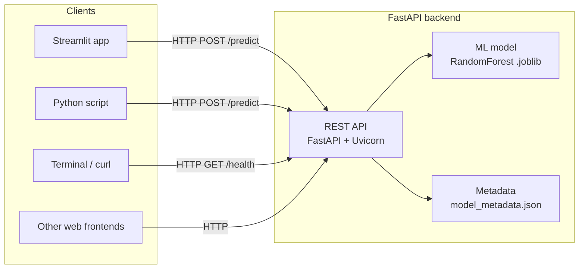

### Prediction flow (Streamlit → API)

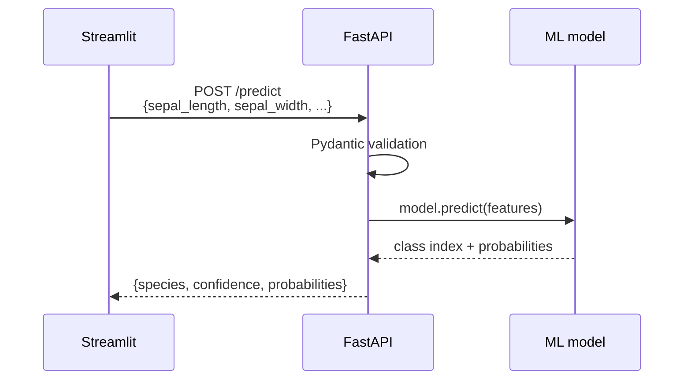

</details>

<p align="right"><a href="#top">↑ Back to top</a></p>

---

<a id="section-2"></a>

<details>
<summary>2 — FastAPI in 5 Minutes</summary>

### What is FastAPI?

**FastAPI** is a modern Python web framework for building APIs quickly. Highlights:

| Feature | Description |
|---------|-------------|
| **Performance** | Built on Starlette (ASGI); very fast for Python |
| **Async-first** | Native `async` / `await` support |
| **Auto docs** | OpenAPI → **Swagger UI** at `/docs` and **ReDoc** at `/redoc` |
| **Validation** | Request and response bodies validated with **Pydantic** |
| **Type hints** | Uses standard Python 3.10+ annotations |

### Flask vs FastAPI (short comparison)

| Aspect | Flask | FastAPI |
|--------|-------|---------|
| Server interface | WSGI (sync) | ASGI (async-capable) |
| Validation | Manual or extensions | Built-in via Pydantic |
| API docs | Third-party tools | Built-in OpenAPI |
| Typical throughput | Lower | Higher (same hardware, typical JSON APIs) |

### WSGI vs ASGI (intuition)

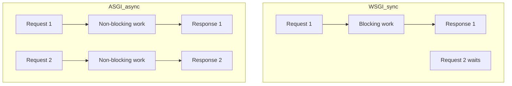

FastAPI runs on an **ASGI** server such as **Uvicorn**, which fits concurrent I/O-heavy workloads well.

### Install and run

```bash
pip install fastapi uvicorn
```

Minimal app:

```python
from fastapi import FastAPI

app = FastAPI()

@app.get("/")
async def root():
    return {"message": "Hello, world!"}
```

```bash
uvicorn main:app --reload
```

Open `http://127.0.0.1:8000` and interactive docs at `http://127.0.0.1:8000/docs`.

</details>

<p align="right"><a href="#top">↑ Back to top</a></p>

---

<a id="section-3"></a>

<details>
<summary>3 — Backend Structure</summary>

### Repository layout (this project)

```
full-app-pandas/
├── backend/
│   ├── main.py                 # FastAPI entrypoint
│   └── models/
│       ├── iris_model.joblib   # Serialized RandomForest (from training)
│       └── model_metadata.json # Model metadata
├── frontend-streamlit/
│   └── app.py                  # Streamlit UI (calls the API)
├── notebook/
│   └── train_model.ipynb       # Training notebook (produces .joblib + JSON)
├── requirements.txt
└── README.md
```

### Role of each artifact

| Path | Role |
|------|------|
| `backend/main.py` | FastAPI app: routes, Pydantic models, startup loading |
| `backend/models/iris_model.joblib` | Trained `RandomForestClassifier` serialized with `joblib` |
| `backend/models/model_metadata.json` | Type, accuracy, feature names, importances, sample counts |

### Example `model_metadata.json`

```json
{
  "model_type": "RandomForestClassifier",
  "n_estimators": 100,
  "max_depth": 5,
  "accuracy": 0.9333333333333333,
  "feature_names": [
    "sepal length (cm)",
    "sepal width (cm)",
    "petal length (cm)",
    "petal width (cm)"
  ],
  "target_names": ["setosa", "versicolor", "virginica"],
  "feature_importances": {
    "sepal length (cm)": 0.11597202747414688,
    "sepal width (cm)": 0.014245784901421163,
    "petal length (cm)": 0.43164136172170253,
    "petal width (cm)": 0.4381408259027294
  },
  "training_samples": 120,
  "test_samples": 30
}
```

### Components diagram

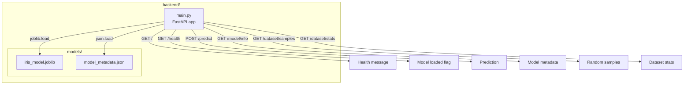

### Streamlit ↔ FastAPI (ports)

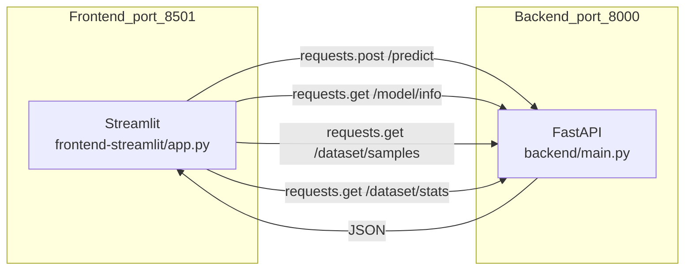

</details>

<p align="right"><a href="#top">↑ Back to top</a></p>

---

<a id="section-4"></a>

<details>
<summary>4 — Loading the Model at Startup</summary>

### Why load once at startup?

Loading an ML model costs time (disk I/O, deserialization). Doing that on **every** request wastes CPU and adds latency.

**Best practice:** load **once** when the server starts, keep the object in memory, reuse it for all requests.

### Paths and module-level state

```python
MODEL_DIR = os.path.join(os.path.dirname(__file__), "models")
MODEL_PATH = os.path.join(MODEL_DIR, "iris_model.joblib")
METADATA_PATH = os.path.join(MODEL_DIR, "model_metadata.json")

model = None
metadata = None
```

| Symbol | Purpose |
|--------|---------|
| `MODEL_DIR` | Resolves `models/` next to `main.py` (portable) |
| `model` / `metadata` | Filled during startup; `None` until loaded |

### `load_model()`

```python
def load_model():
    global model, metadata
    if not os.path.exists(MODEL_PATH):
        raise RuntimeError(
            f"Modèle non trouvé à {MODEL_PATH}. "
            "Exécutez d'abord le notebook train_model.ipynb"
        )
    model = joblib.load(MODEL_PATH)
    with open(METADATA_PATH, "r") as f:
        metadata = json.load(f)
```

| Step | Action |
|------|--------|
| 1 | `global` so the function updates module-level variables |
| 2 | Ensure `.joblib` exists |
| 3 | If missing → `RuntimeError` (fail-fast message; run `notebook/train_model.ipynb` first) |
| 4 | `joblib.load()` restores the scikit-learn estimator |
| 5 | `json.load()` reads metadata |

### Startup hook

```python
@app.on_event("startup")
async def startup_event():
    load_model()
```

FastAPI runs this **before** accepting traffic: one shared `model` in memory, or the process fails to start if loading raises.

### `joblib` vs plain `pickle`

| Criterion | `pickle` | `joblib` |
|-----------|----------|----------|
| Large NumPy arrays | Less efficient | Efficient (scikit-learn default) |
| sklearn compatibility | Works | **Recommended** |

**Security:** never `load` artifacts from untrusted sources—same risks as pickle.

### Lifecycle

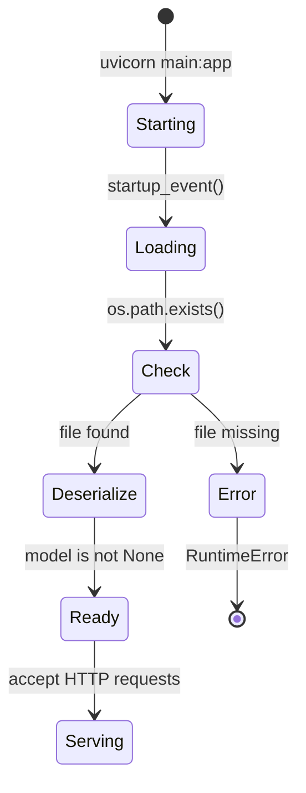

</details>

<p align="right"><a href="#top">↑ Back to top</a></p>

---

<a id="section-5"></a>

<details>
<summary>5 — Input Validation with Pydantic</summary>

### Why validate inputs?

Without validation, clients could send:

- Strings instead of numbers  
- Negative or absurdly large measurements  
- Missing fields  

**Pydantic** models define a strict schema; FastAPI returns **422** automatically when validation fails.

### `PredictionRequest`

```python
class PredictionRequest(BaseModel):
    sepal_length: float = Field(..., ge=0, le=10, description="Longueur du sépale (cm)")
    sepal_width: float = Field(..., ge=0, le=10, description="Largeur du sépale (cm)")
    petal_length: float = Field(..., ge=0, le=10, description="Longueur du pétale (cm)")
    petal_width: float = Field(..., ge=0, le=10, description="Largeur du pétale (cm)")

    model_config = {
        "json_schema_extra": {
            "examples": [
                {
                    "sepal_length": 5.1,
                    "sepal_width": 3.5,
                    "petal_length": 1.4,
                    "petal_width": 0.2,
                }
            ]
        }
    }
```

### `Field` parameters

| Parameter | Meaning |
|-----------|---------|
| `...` | Required field (no default) |
| `ge=0` | Value must be **≥ 0** |
| `le=10` | Value must be **≤ 10** |
| `description` | Shown in OpenAPI / Swagger |

### Why 0–10 cm?

Iris measurements in the dataset are positive and below 10 cm. Bounds reduce nonsense inputs that could yield misleading predictions.

| Feature | Dataset min | Dataset max | Constraint |
|---------|-------------|-------------|------------|
| sepal_length | 4.3 | 7.9 | 0 ≤ x ≤ 10 |
| sepal_width | 2.0 | 4.4 | 0 ≤ x ≤ 10 |
| petal_length | 1.0 | 6.9 | 0 ≤ x ≤ 10 |
| petal_width | 0.1 | 2.5 | 0 ≤ x ≤ 10 |

### `PredictionResponse`

```python
class PredictionResponse(BaseModel):
    species: str
    confidence: float
    probabilities: dict[str, float]
```

| Field | Type | Role |
|-------|------|------|
| `species` | `str` | Predicted label (`setosa`, `versicolor`, `virginica`) |
| `confidence` | `float` | Probability of the predicted class |
| `probabilities` | `dict[str, float]` | Per-class probabilities |

### When validation fails (422)

```json
{
  "detail": [
    {
      "type": "greater_than_equal",
      "loc": ["body", "sepal_length"],
      "msg": "Input should be greater than or equal to 0",
      "input": -5.0,
      "ctx": {"ge": 0}
    }
  ]
}
```

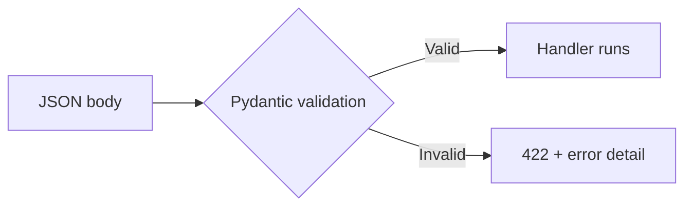

### Streamlit client

If Streamlit uses `requests.post(..., json=payload)` and the API returns **422**, handle it in the UI:

```python
response = requests.post(f"{API_URL}/predict", json=payload)
if response.status_code == 422:
    st.error("Invalid input — check the values.")
elif response.status_code == 200:
    result = response.json()
```

</details>

<p align="right"><a href="#top">↑ Back to top</a></p>

---

<a id="section-6"></a>

<details>
<summary>6 — The POST /predict Endpoint in Detail</summary>

### Full handler

```python
@app.post("/predict", response_model=PredictionResponse, tags=["Prediction"])
async def predict(request: PredictionRequest):
    if model is None:
        raise HTTPException(status_code=503, detail="Le modèle n'est pas chargé")

    features = np.array(
        [[request.sepal_length, request.sepal_width, request.petal_length, request.petal_width]]
    )

    prediction = model.predict(features)[0]
    probabilities = model.predict_proba(features)[0]

    target_names = metadata["target_names"]
    species = target_names[prediction]
    confidence = float(probabilities[prediction])

    prob_dict = {name: round(float(p), 4) for name, p in zip(target_names, probabilities)}

    return PredictionResponse(
        species=species,
        confidence=round(confidence, 4),
        probabilities=prob_dict,
    )
```

### Step-by-step flow

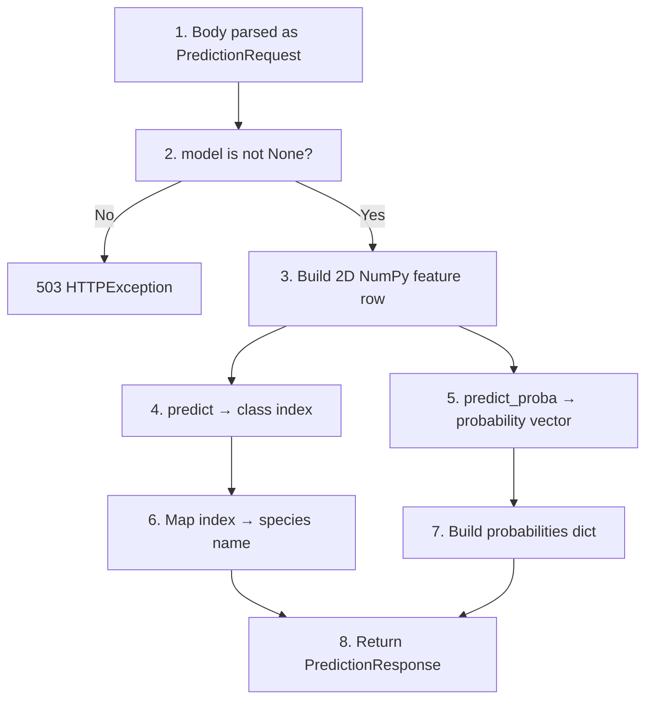

### Notes

| Step | Detail |
|------|--------|
| Validation | Happens **before** your function body if types match `PredictionRequest` |
| `503` | Defensive check if `model` were still `None` |
| Feature shape | scikit-learn expects shape `(n_samples, n_features)` → here `(1, 4)` |
| `target_names` | Comes from `metadata` so labels stay in sync with training |

### Example JSON response

```json
{
  "species": "setosa",
  "confidence": 0.97,
  "probabilities": {
    "setosa": 0.97,
    "versicolor": 0.02,
    "virginica": 0.01
  }
}
```

### Calling from Streamlit (`requests`)

```python
import requests

API_URL = "http://localhost:8000"

payload = {
    "sepal_length": 5.1,
    "sepal_width": 3.5,
    "petal_length": 1.4,
    "petal_width": 0.2,
}

response = requests.post(f"{API_URL}/predict", json=payload)
data = response.json()

print(data["species"])
print(data["confidence"])
print(data["probabilities"])
```

</details>

<p align="right"><a href="#top">↑ Back to top</a></p>

---

<a id="section-7"></a>

<details>
<summary>7 — Informational Endpoints</summary>

### Overview

| Endpoint | Method | Description |
|----------|--------|-------------|
| `/` | GET | Simple “API is running” payload |
| `/health` | GET | Health + whether `model` is loaded |
| `/model/info` | GET | Model metadata (type, accuracy, features, importances, counts) |
| `/dataset/samples` | GET | 10 random Iris rows |
| `/dataset/stats` | GET | Descriptive stats for the Iris dataset |

### `GET /` and `GET /health`

```python
@app.get("/", tags=["Health"])
async def root():
    return {"status": "ok", "message": "Iris Prediction API is running"}


@app.get("/health", tags=["Health"])
async def health_check():
    return {
        "status": "healthy",
        "model_loaded": model is not None,
    }
```

Use `/health` from Streamlit or a load balancer to verify the process and model state.

### `GET /model/info`

```python
class ModelInfoResponse(BaseModel):
    model_config = {"protected_namespaces": ()}

    model_type: str
    accuracy: float
    feature_names: list[str]
    target_names: list[str]
    feature_importances: dict[str, float]
    training_samples: int
    test_samples: int


@app.get("/model/info", response_model=ModelInfoResponse, tags=["Model"])
async def model_info():
    if metadata is None:
        raise HTTPException(status_code=503, detail="Les métadonnées ne sont pas chargées")
    return ModelInfoResponse(**metadata)
```

| Note | Explanation |
|------|-------------|
| `protected_namespaces = ()` | Pydantic v2 reserves `model_*` by default; this avoids warnings for `model_type` |
| `**metadata` | Builds the response from the JSON dict (extra keys in JSON are ignored for the response schema) |

### `GET /dataset/samples`

```python
class DatasetSample(BaseModel):
    sepal_length: float
    sepal_width: float
    petal_length: float
    petal_width: float
    species: str


@app.get("/dataset/samples", response_model=list[DatasetSample], tags=["Dataset"])
async def dataset_samples():
    from sklearn.datasets import load_iris
    import pandas as pd

    iris = load_iris()
    df = pd.DataFrame(data=iris.data, columns=iris.feature_names)
    df["species"] = [iris.target_names[t] for t in iris.target]

    samples = df.sample(n=10, random_state=None).reset_index(drop=True)

    return [
        DatasetSample(
            sepal_length=row["sepal length (cm)"],
            sepal_width=row["sepal width (cm)"],
            petal_length=row["petal length (cm)"],
            petal_width=row["petal width (cm)"],
            species=row["species"],
        )
        for _, row in samples.iterrows()
    ]
```

- `random_state=None` → different rows on each call (good for demos).  
- Data comes from `sklearn.datasets.load_iris()` (no CSV file required).

### `GET /dataset/stats`

Returns counts, species distribution, and per-feature min / max / mean / std (see example below).

### Example `/dataset/stats` response

```json
{
  "total_samples": 150,
  "features_count": 4,
  "species_count": 3,
  "species_distribution": {
    "setosa": 50,
    "versicolor": 50,
    "virginica": 50
  },
  "feature_stats": {
    "sepal length (cm)": {"min": 4.3, "max": 7.9, "mean": 5.84, "std": 0.83},
    "sepal width (cm)":  {"min": 2.0, "max": 4.4, "mean": 3.06, "std": 0.44},
    "petal length (cm)": {"min": 1.0, "max": 6.9, "mean": 3.76, "std": 1.77},
    "petal width (cm)":  {"min": 0.1, "max": 2.5, "mean": 1.2,  "std": 0.76}
  }
}
```

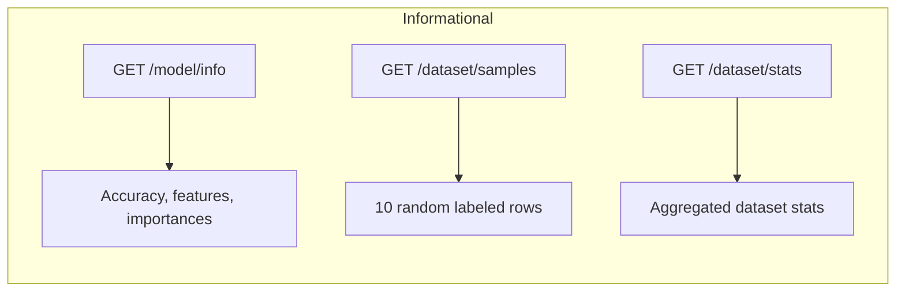

### Using these endpoints in Streamlit

```python
import requests
import pandas as pd
import streamlit as st

API_URL = "http://localhost:8000"

info = requests.get(f"{API_URL}/model/info").json()
st.metric("Accuracy", f"{info['accuracy']:.1%}")
st.metric("Model type", info["model_type"])

samples = requests.get(f"{API_URL}/dataset/samples").json()
st.dataframe(pd.DataFrame(samples))

stats = requests.get(f"{API_URL}/dataset/stats").json()
st.json(stats["species_distribution"])
```

</details>

<p align="right"><a href="#top">↑ Back to top</a></p>

---

<a id="section-8"></a>

<details>
<summary>8 — CORS (Streamlit makes server-side calls)</summary>

### The browser same-origin policy

Browsers **block** many cross-origin HTTP calls unless the server explicitly allows them via **CORS** headers.

Example origins:

- Streamlit UI: `http://localhost:8501`  
- API: `http://localhost:8000`  

These are **different origins** (port matters).

### Streamlit and CORS: important nuance

Streamlit runs a **Python server**. Typical API calls from your `app.py` use **`requests`** (or `httpx`) **on the server**. Those are **server-side** HTTP clients—the browser’s CORS rules **do not apply** to them.

CORS still matters when:

- Browser JavaScript calls the API directly (e.g. custom components, iframes, SPAs)  
- Another web app on a different origin uses `fetch`  
- You open Swagger UI from a different host/port setup  

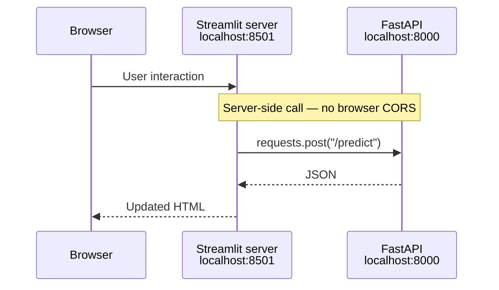

### Middleware in this project

```python
from fastapi.middleware.cors import CORSMiddleware

app.add_middleware(
    CORSMiddleware,
    allow_origins=["*"],
    allow_credentials=True,
    allow_methods=["*"],
    allow_headers=["*"],
)
```

| Setting | Value | Meaning |
|---------|-------|---------|
| `allow_origins` | `["*"]` | Allow any origin (dev-friendly) |
| `allow_credentials` | `True` | Cookies / auth headers allowed per CORS rules |
| `allow_methods` | `["*"]` | All HTTP methods |
| `allow_headers` | `["*"]` | All request headers |

### Preflight (browser)

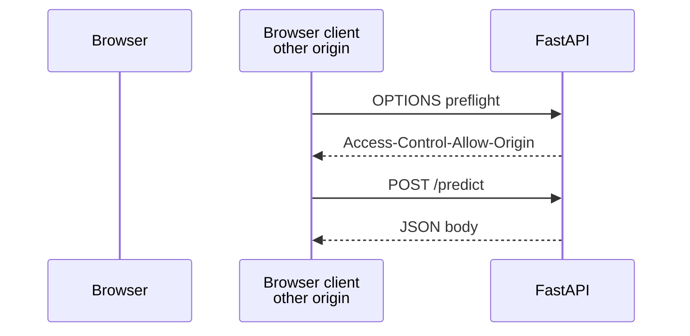

### Production

`allow_origins=["*"]` is convenient locally but **too permissive** for production. Restrict to known hosts, for example:

```python
allow_origins=[
    "https://your-streamlit-app.example.com",
    "https://your-company.example.com",
]
```

</details>

<p align="right"><a href="#top">↑ Back to top</a></p>

---

<a id="section-9"></a>

<details>
<summary>9 — Swagger UI</summary>

### Auto-generated OpenAPI

FastAPI publishes:

| URL | UI | Purpose |
|-----|-----|---------|
| `http://localhost:8000/docs` | **Swagger UI** | Try endpoints interactively |
| `http://localhost:8000/redoc` | **ReDoc** | Readable reference docs |
| `http://localhost:8000/openapi.json` | Raw JSON | Spec for codegen / gateways |

### How the spec is built

FastAPI inspects:

1. Route decorators (`@app.get`, `@app.post`, …)  
2. Parameter and body types (`PredictionRequest`, …)  
3. `response_model`  
4. `Field(...)` constraints and descriptions  
5. `model_config` examples  
6. `tags` for grouping  

### Using Swagger UI

1. Expand a tag (Health, Prediction, Model, Dataset).  
2. **Try it out** → edit JSON → **Execute**.  
3. Inspect schemas at the bottom.  
4. Copy generated **curl** commands.

### App metadata in code

```python
app = FastAPI(
    title="Iris Flower Prediction API",
    description="API de prédiction d'espèces de fleurs Iris basée sur un modèle Random Forest",
    version="1.0.0",
)
```

These fields appear at the top of `/docs`.

### Tags used in this API

| Tag | Endpoints |
|-----|-----------|
| **Health** | `GET /`, `GET /health` |
| **Prediction** | `POST /predict` |
| **Model** | `GET /model/info` |
| **Dataset** | `GET /dataset/samples`, `GET /dataset/stats` |

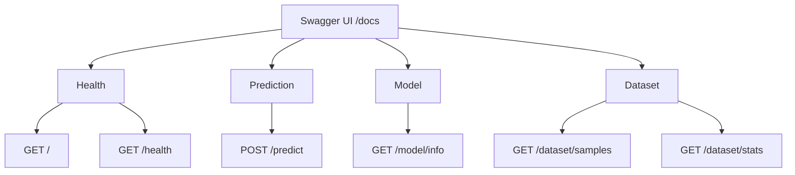

### Swagger while building Streamlit

- Prove the backend before wiring the UI.  
- Confirm exact JSON keys and types.  
- Debug: if Streamlit fails, compare with a working `/docs` call.

</details>

<p align="right"><a href="#top">↑ Back to top</a></p>

---

<a id="section-10"></a>

<details>
<summary>10 — Testing the API with curl and PowerShell</summary>

### Start the server

```bash
cd backend
uvicorn main:app --reload --host 0.0.0.0 --port 8000
```

### curl (Linux / macOS / Git Bash on Windows)

**Root**

```bash
curl http://localhost:8000/
```

```json
{"status":"ok","message":"Iris Prediction API is running"}
```

**Health**

```bash
curl http://localhost:8000/health
```

```json
{"status":"healthy","model_loaded":true}
```

**Predict**

```bash
curl -X POST http://localhost:8000/predict \
  -H "Content-Type: application/json" \
  -d '{"sepal_length":5.1,"sepal_width":3.5,"petal_length":1.4,"petal_width":0.2}'
```

**Model info / samples / stats**

```bash
curl http://localhost:8000/model/info
curl http://localhost:8000/dataset/samples
curl http://localhost:8000/dataset/stats
```

### PowerShell (Windows)

**Root**

```powershell
Invoke-RestMethod -Uri http://localhost:8000/
```

**Health**

```powershell
Invoke-RestMethod -Uri http://localhost:8000/health
```

**Predict**

```powershell
$body = @{
    sepal_length = 5.1
    sepal_width  = 3.5
    petal_length = 1.4
    petal_width  = 0.2
} | ConvertTo-Json

Invoke-RestMethod -Uri http://localhost:8000/predict `
    -Method POST `
    -ContentType "application/json" `
    -Body $body
```

**Other GETs**

```powershell
Invoke-RestMethod -Uri http://localhost:8000/model/info
Invoke-RestMethod -Uri http://localhost:8000/dataset/samples
Invoke-RestMethod -Uri http://localhost:8000/dataset/stats
```

### Python `requests` (same style as Streamlit)

```python
import requests

API_URL = "http://localhost:8000"

print(requests.get(f"{API_URL}/").json())

payload = {
    "sepal_length": 5.1,
    "sepal_width": 3.5,
    "petal_length": 1.4,
    "petal_width": 0.2,
}
print(requests.post(f"{API_URL}/predict", json=payload).json())

print(requests.get(f"{API_URL}/model/info").json())
print(requests.get(f"{API_URL}/dataset/samples").json())
print(requests.get(f"{API_URL}/dataset/stats").json())
```

### Endpoint cheat sheet

| Endpoint | Method | Body | Success | Purpose |
|----------|--------|------|---------|---------|
| `/` | GET | — | 200 | Welcome JSON |
| `/health` | GET | — | 200 | Liveness + `model_loaded` |
| `/predict` | POST | JSON features | 200 | Prediction |
| `/model/info` | GET | — | 200 | Model metadata |
| `/dataset/samples` | GET | — | 200 | 10 random rows |
| `/dataset/stats` | GET | — | 200 | Dataset statistics |

</details>

<p align="right"><a href="#top">↑ Back to top</a></p>

---

<a id="section-11"></a>

<details>
<summary>11 — Error Handling</summary>

### Errors you will see

| HTTP code | Situation | Detail |
|-----------|-----------|--------|
| **422** | Pydantic validation failed | Automatic `detail` list with field locations |
| **503** | Model not in memory | `"Le modèle n'est pas chargé"` |
| **503** | Metadata missing | `"Les métadonnées ne sont pas chargées"` |

### Raising `HTTPException`

```python
from fastapi import HTTPException

if model is None:
    raise HTTPException(status_code=503, detail="Le modèle n'est pas chargé")
```

Response body:

```json
{
  "detail": "Le modèle n'est pas chargé"
}
```

### 422 example (value too large)

Request:

```json
{
  "sepal_length": 50.0,
  "sepal_width": 3.5,
  "petal_length": 1.4,
  "petal_width": 0.2
}
```

Response (shape may vary slightly by Pydantic version):

```json
{
  "detail": [
    {
      "type": "less_than_equal",
      "loc": ["body", "sepal_length"],
      "msg": "Input should be less than or equal to 10",
      "input": 50.0,
      "ctx": {"le": 10}
    }
  ]
}
```

### Decision flow

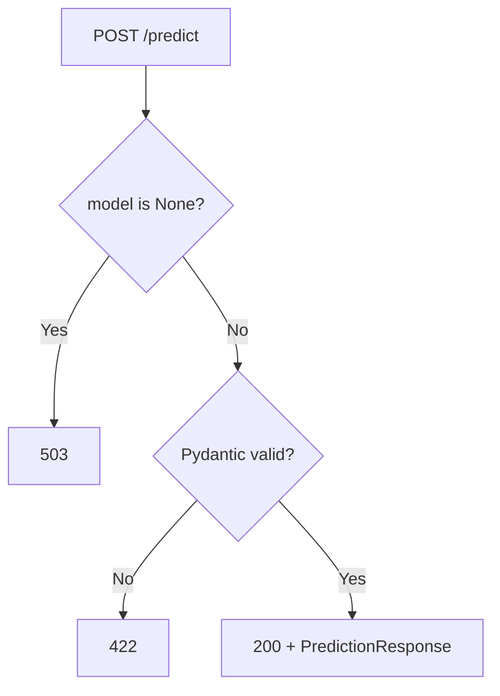

### Missing `.joblib` at startup

`load_model()` raises `RuntimeError` if the file is absent. Because that runs in the startup event, **Uvicorn should fail to start**—fail-fast is preferable to serving a broken API.

### Handling errors in Streamlit

```python
import requests
import streamlit as st

API_URL = "http://localhost:8000"

try:
    response = requests.post(f"{API_URL}/predict", json=payload, timeout=10)

    if response.status_code == 200:
        result = response.json()
        st.success(f"Predicted species: {result['species']}")

    elif response.status_code == 422:
        errors = response.json()["detail"]
        for err in errors:
            st.error(f"Field {err['loc'][-1]}: {err['msg']}")

    elif response.status_code == 503:
        st.error("Model unavailable — check the FastAPI backend.")

    else:
        st.error(f"Unexpected error: {response.status_code}")

except requests.ConnectionError:
    st.error("Cannot reach the API. Is Uvicorn running on port 8000?")

except requests.Timeout:
    st.error("The API took too long to respond.")
```

### Who handles what?

| Scenario | HTTP / exception | Layer |
|----------|------------------|--------|
| Wrong types, missing fields, out-of-range values | 422 | FastAPI + Pydantic |
| `model is None` at runtime | 503 | Your handler |
| Missing artifact at startup | `RuntimeError` | Startup → process exit |
| Network down, wrong host | `ConnectionError` | `requests` in Streamlit |

</details>

<p align="right"><a href="#top">↑ Back to top</a></p>

---

<a id="section-12"></a>

<details>
<summary>12 — Summary and Best Practices</summary>

### Mind map — what this module covered

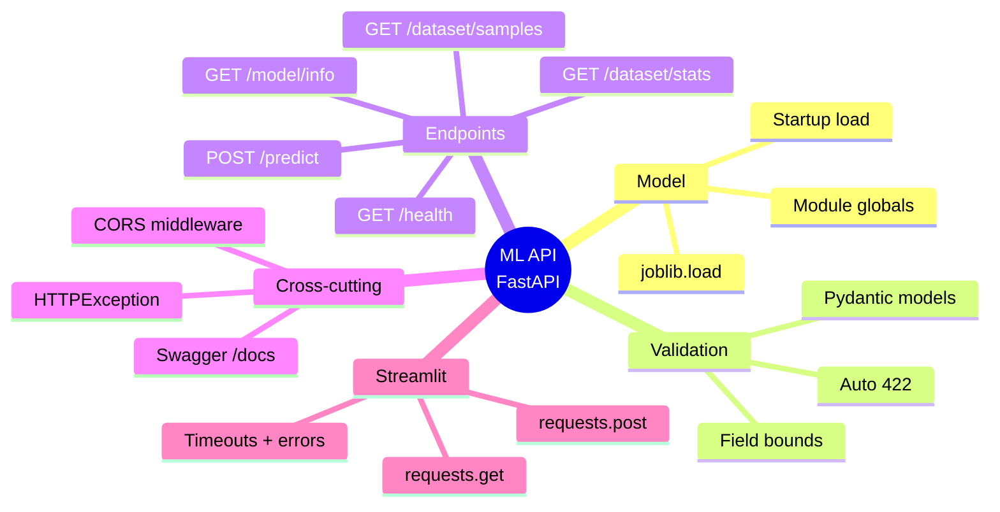

### Best practices

#### 1. Reliability

| Practice | Why |
|----------|-----|
| Check `model is not None` before predicting | Avoids runtime surprises |
| Use meaningful HTTP status codes | Clients (and Streamlit) can branch cleanly |
| Validate inputs with `Field` | Keeps nonsense away from sklearn |
| Fail startup if artifacts are missing | Do not serve a half-working API |
| Use `timeout=` in Streamlit `requests` | Prevents hung UIs |

#### 2. Logging (production)

```python
import logging

logger = logging.getLogger(__name__)

@app.post("/predict")
async def predict(request: PredictionRequest):
    logger.info("predict request: %s", request.model_dump())
    # ... predict ...
    return response
```

#### 3. Model versioning

| Approach | Idea |
|----------|------|
| Metadata field | `"model_version": "1.0.0"` in JSON |
| URL prefix | `/v1/predict` |
| Response header | `X-Model-Version: 1.0.0` |

#### 4. Deployment checklist

- [ ] Replace `allow_origins=["*"]` with explicit origins  
- [ ] Structured logging and log shipping  
- [ ] Health route wired to your orchestrator  
- [ ] Model file mounted or baked reproducibly (e.g. Docker volume)  
- [ ] Tests for each route  
- [ ] Timeouts on both server and Streamlit client  

### Target production shape (conceptual)

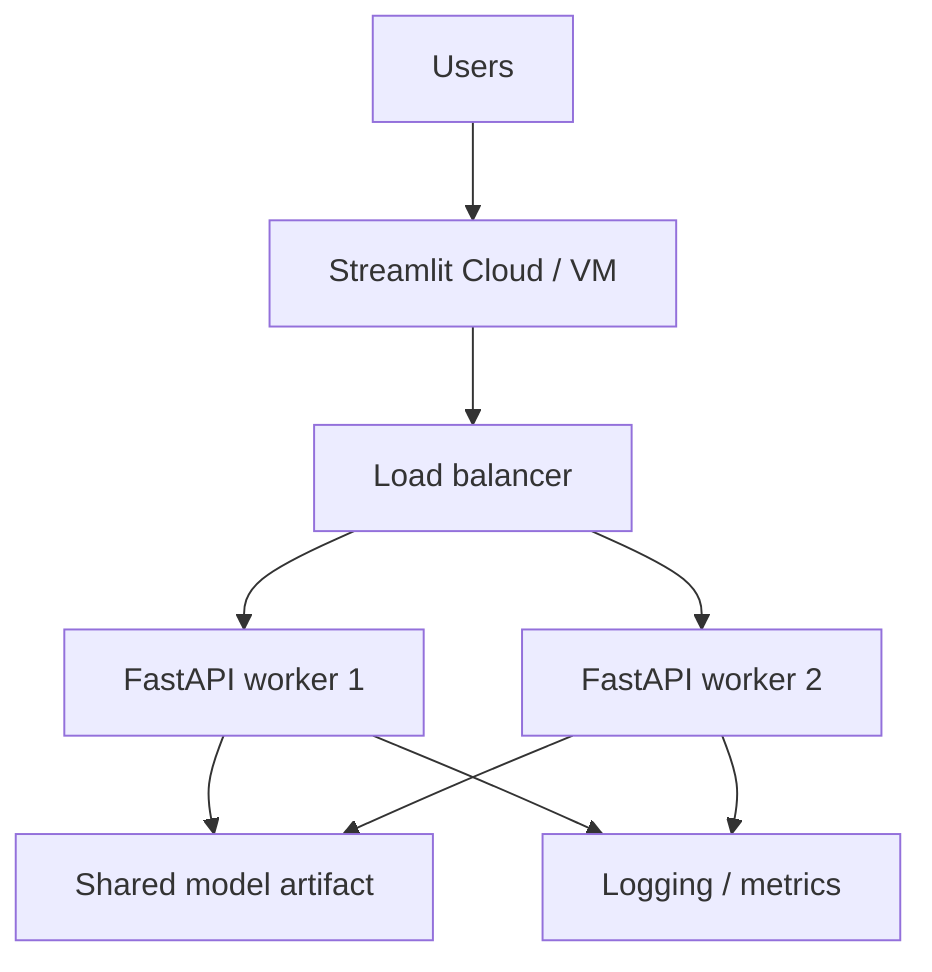

### Run the stack locally

**Terminal 1 — backend**

```bash
cd backend
uvicorn main:app --reload --host 0.0.0.0 --port 8000
```

**Terminal 2 — Streamlit**

```bash
cd frontend-streamlit
streamlit run app.py
```

Then open:

- `http://localhost:8501` — Streamlit  
- `http://localhost:8000/docs` — Swagger UI  

</details>

<p align="right"><a href="#top">↑ Back to top</a></p>

---

> **Course**: *Full App Pandas — Iris Prediction* (Streamlit track)  
> **Last updated**: April 2026  
