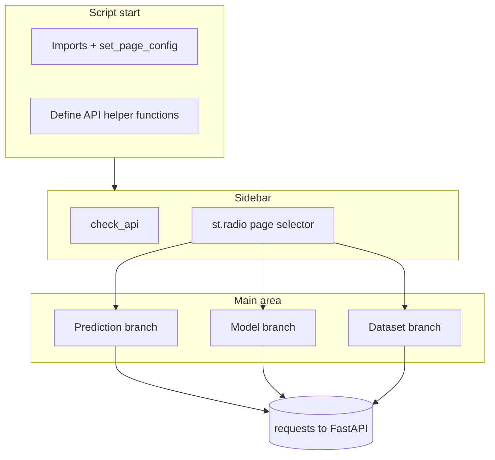
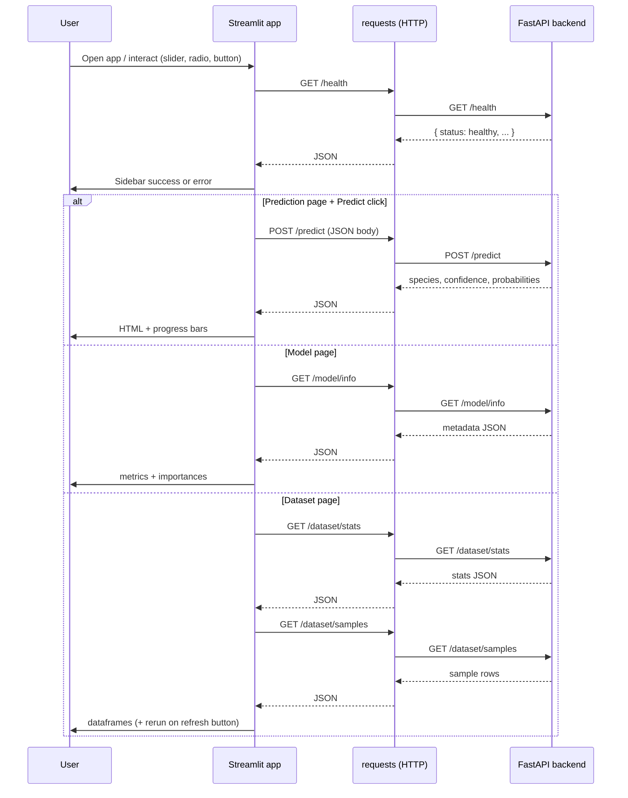

<a id="top"></a>

# Building a Streamlit App That Consumes a FastAPI Backend

This course walks through a **full-stack ML demo**: a Streamlit frontend (`frontend-streamlit/app.py`) that talks to a **FastAPI** Iris classification API (`backend/main.py`) using the **`requests`** library. You will learn how to structure pages, call REST endpoints, show metrics and tables, and handle loading and errors.

---

## Table of contents

| # | Section | Anchor |
|---|---------|--------|
| 1 | [Introduction — Streamlit for ML Prototyping](#1-introduction--streamlit-for-ml-prototyping) | `#1-introduction--streamlit-for-ml-prototyping` |
| 2 | [Installation and Configuration](#2-installation-and-configuration) | `#2-installation-and-configuration` |
| 3 | [Application Structure](#3-application-structure) | `#3-application-structure` |
| 4 | [API Call Functions](#4-api-call-functions) | `#4-api-call-functions` |
| 5 | [Sidebar — Navigation and API Status](#5-sidebar--navigation-and-api-status) | `#5-sidebar--navigation-and-api-status` |
| 6 | [Prediction Page](#6-prediction-page) | `#6-prediction-page` |
| 7 | [Model Info Page](#7-model-info-page) | `#7-model-info-page` |
| 8 | [Dataset Page](#8-dataset-page) | `#8-dataset-page` |
| 9 | [Essential Streamlit Widgets](#9-essential-streamlit-widgets) | `#9-essential-streamlit-widgets` |
| 10 | [Layout and Columns](#10-layout-and-columns) | `#10-layout-and-columns` |
| 11 | [Error Handling and Loading States](#11-error-handling-and-loading-states) | `#11-error-handling-and-loading-states` |
| 12 | [Streamlit vs Flutter for API Consumption](#12-streamlit-vs-flutter-for-api-consumption) | `#12-streamlit-vs-flutter-for-api-consumption` |
| 13 | [Conclusion — The Complete Flow](#13-conclusion--the-complete-flow) | `#13-conclusion--the-complete-flow` |

---

<a id="1-introduction--streamlit-for-ml-prototyping"></a>

## 1. Introduction — Streamlit for ML Prototyping

**What is Streamlit?**  
[Streamlit](https://streamlit.io/) is a Python framework for building interactive web apps from scripts. You write plain Python; Streamlit **re-runs the script** when users interact with widgets and updates the UI.

**Why use it for ML prototyping?**

| Benefit | Explanation |
|--------|-------------|
| **Speed** | Sliders, buttons, and charts in minutes—no separate frontend build step. |
| **Python-native** | Same language as training notebooks, `pandas`, and `scikit-learn`. |
| **Sharing** | Easy to demo models to stakeholders before investing in a production UI. |
| **HTTP-friendly** | Works well with REST APIs (e.g. FastAPI) so the model can live in a separate service. |

**Comparison with Flask, Django, and Flutter**

| Tool | Role | Typical use with ML / APIs |
|------|------|----------------------------|
| **Flask** | Minimal Python web framework | Custom routes, templates, or JSON APIs; you build HTML/JS yourself or serve SPAs. |
| **Django** | Full-stack web framework | Admin, ORM, auth, multi-page sites; heavier setup for a simple model demo. |
| **Streamlit** | App framework for data/ML UIs | Rapid dashboards and forms; less control over low-level routing than Flask/Django. |
| **Flutter** | Cross-platform UI toolkit (Dart) | Native-feeling mobile/desktop apps; compile-time UI, not Python; stronger for app stores than a quick lab demo. |

For **consuming a REST API**, Streamlit is ideal when the team is Python-centric and the goal is a **fast, maintainable prototype**. Flutter shines when you need a **compiled client** with offline UX, deep navigation, or platform-specific polish.

[Back to top](#top)

---

<a id="2-installation-and-configuration"></a>

## 2. Installation and Configuration

### Install dependencies

Use a virtual environment, then install Streamlit and HTTP client libraries (this project uses **`requests`**):

```bash
pip install streamlit requests pandas
```

If your backend is in the same repo, install its requirements separately (e.g. `pip install -r requirements.txt` from the backend folder).

### `st.set_page_config`

Call **`st.set_page_config`** once, at the top of the script, **before** other Streamlit commands. It sets the browser tab title, favicon, layout, and default sidebar state:

```python
import streamlit as st

st.set_page_config(
    page_title="Iris ML Demo",
    page_icon="🌸",
    layout="wide",
    initial_sidebar_state="expanded",
)
```

| Parameter | Effect |
|-----------|--------|
| `page_title` | Document title in the browser tab. |
| `page_icon` | Emoji or path to an image (`.png`). |
| `layout` | `"centered"` (default) or `"wide"` for more horizontal space. |
| `initial_sidebar_state` | `"auto"`, `"expanded"`, or `"collapsed"`. |

### Run the app

From the directory that contains `app.py`:

```bash
streamlit run app.py
```

By default Streamlit serves on **http://localhost:8501**. Keep the **FastAPI** backend running (e.g. on **http://localhost:8000**) so health checks and predictions succeed.

<details>
<summary><strong>Tip: aligning ports with the backend</strong></summary>

The demo uses `API_BASE_URL = "http://localhost:8000"`. If you change the API host or port, update this constant (or read it from environment variables for deployment).

</details>

[Back to top](#top)

---

<a id="3-application-structure"></a>

## 3. Application Structure

The reference app **`frontend-streamlit/app.py`** is organized in a **linear, top-to-bottom** flow that matches Streamlit’s execution model:

| Block | Purpose |
|-------|---------|
| **Imports & config** | `streamlit`, `requests`, `json`; `API_BASE_URL`; `st.set_page_config`. |
| **API helpers** | `check_api()`, `predict()`, `get_model_info()`, `get_dataset_samples()`, `get_dataset_stats()`. |
| **Constants** | Colors and emojis keyed by species (presentation only). |
| **Sidebar** | Title, API status, `st.radio` for the active “page”. |
| **Page branches** | `if` / `elif` on the radio value: Prediction, Model, Dataset. |

Conceptually:



There is no separate router file: **the selected page is just a string** from the sidebar radio widget, and the main script branches on it.

[Back to top](#top)

---

<a id="4-api-call-functions"></a>

## 4. API Call Functions

The FastAPI backend exposes endpoints such as **`GET /health`**, **`POST /predict`**, **`GET /model/info`**, **`GET /dataset/samples`**, and **`GET /dataset/stats`**. The Streamlit app wraps them in small functions for clarity and reuse.

### Health check

```python
def check_api():
    try:
        r = requests.get(f"{API_BASE_URL}/health", timeout=3)
        return r.status_code == 200 and r.json().get("status") == "healthy"
    except Exception:
        return False
```

A **short timeout** avoids hanging the UI if the server is down.

### Prediction

```python
def predict(sepal_length, sepal_width, petal_length, petal_width):
    payload = {
        "sepal_length": sepal_length,
        "sepal_width": sepal_width,
        "petal_length": petal_length,
        "petal_width": petal_width,
    }
    r = requests.post(f"{API_BASE_URL}/predict", json=payload)
    r.raise_for_status()
    return r.json()
```

The JSON body matches the Pydantic `PredictionRequest` model on the server.

### Model metadata

```python
def get_model_info():
    r = requests.get(f"{API_BASE_URL}/model/info")
    r.raise_for_status()
    return r.json()
```

### Dataset samples and stats

```python
def get_dataset_samples():
    r = requests.get(f"{API_BASE_URL}/dataset/samples")
    r.raise_for_status()
    return r.json()


def get_dataset_stats():
    r = requests.get(f"{API_BASE_URL}/dataset/stats")
    r.raise_for_status()
    return r.json()
```

| Function | HTTP | Typical response usage in UI |
|----------|------|--------------------------------|
| `check_api()` | `GET /health` | Boolean gate for sidebar + pages |
| `predict(...)` | `POST /predict` | Species, confidence, probabilities |
| `get_model_info()` | `GET /model/info` | Metrics, feature importances, class names |
| `get_dataset_samples()` | `GET /dataset/samples` | Rows for `st.dataframe` |
| `get_dataset_stats()` | `GET /dataset/stats` | Aggregates for metrics and summary tables |

[Back to top](#top)

---

<a id="5-sidebar--navigation-and-api-status"></a>

## 5. Sidebar — Navigation and API Status

The sidebar groups **branding**, **API connectivity**, and **navigation** in one place using `st.sidebar` (or `with st.sidebar:`).

```python
with st.sidebar:
    st.title("🌸 Iris ML Demo")
    st.caption("Application Full-Stack de classification de fleurs Iris")

    api_ok = check_api()
    if api_ok:
        st.success("✅ API connectée")
    else:
        st.error("❌ API hors ligne — Lancez le backend FastAPI sur le port 8000")

    st.divider()
    page = st.radio(
        "Navigation",
        ["🔬 Prédiction", "🧠 Modèle", "📊 Dataset"],
        label_visibility="collapsed",
    )
```

| Element | Role |
|---------|------|
| `check_api()` | Drives `st.success` / `st.error` so users know if the backend is up. |
| `st.radio` | Chooses one of **three pages**; `label_visibility="collapsed"` hides the visible label while keeping accessibility. |
| `st.divider()` | Visual separation between status and navigation. |

The variable **`api_ok`** is computed on every script run, so the status stays in sync whenever the user interacts with the app.

[Back to top](#top)

---

<a id="6-prediction-page"></a>

## 6. Prediction Page

The prediction view uses **two columns** for sepal vs petal sliders, a **primary button** to trigger inference, and **`st.spinner`** during the request. Results combine **`st.markdown(..., unsafe_allow_html=True)`** for a large emoji and colored label, plus **`st.progress`** for per-class probabilities.

Typical flow in code:

```python
if page == "🔬 Prédiction":
    st.header("🔬 Prédiction d'espèce")
    col1, col2 = st.columns(2)
    with col1:
        sepal_length = st.slider("Longueur du sépale (cm)", 4.0, 8.0, 5.1, 0.1)
        # ... more sliders
    with col2:
        petal_length = st.slider("Longueur du pétale (cm)", 1.0, 7.0, 1.4, 0.1)
        # ...

    if st.button("🔮 Prédire l'espèce", type="primary", use_container_width=True):
        if not api_ok:
            st.error("L'API n'est pas accessible. Lancez d'abord le backend.")
        else:
            with st.spinner("Prédiction en cours..."):
                result = predict(sepal_length, sepal_width, petal_length, petal_width)
                # Display species, confidence, HTML block, st.progress per probability
```

| Widget | Use on this page |
|--------|------------------|
| `st.slider` | Numeric features sent in the JSON payload. |
| `st.button` | Triggers POST `/predict` only when clicked. |
| `st.spinner` | Shows activity while `requests` is waiting. |
| `st.markdown` + HTML | Rich result layout (emoji, colors). |
| `st.progress` | Visual bars for `probabilities` dict values. |

[Back to top](#top)

---

<a id="7-model-info-page"></a>

## 7. Model Info Page

This page calls **`get_model_info()`** and presents high-level numbers with **`st.metric`**, then lists **feature importances** with **`st.progress`**.

```python
info = get_model_info()
col1, col2, col3 = st.columns(3)
with col1:
    st.metric("Type de modèle", info["model_type"].replace("Classifier", ""))
with col2:
    st.metric("Précision", f"{info['accuracy']*100:.1f}%")
with col3:
    st.metric(
        "Données",
        f"{info['training_samples'] + info['test_samples']} total",
        f"{info['training_samples']} train / {info['test_samples']} test",
    )

for feat, imp in sorted_features:
    st.markdown(f"**{feat}** — `{imp*100:.1f}%`")
    st.progress(imp)
```

| Widget | Purpose |
|--------|---------|
| `st.metric` | Large label + value + optional delta (here, train/test breakdown). |
| `st.progress` | Normalized bar; values should be in **[0.0, 1.0]** (importance fractions). |

[Back to top](#top)

---

<a id="8-dataset-page"></a>

## 8. Dataset Page

The dataset page combines **aggregated stats** from **`GET /dataset/stats`** with **random rows** from **`GET /dataset/samples`**. It uses **`st.dataframe`** twice: once for a plain stats table, once for styled sample rows.

```python
stats = get_dataset_stats()
# ... st.metric columns from stats ...

df_stats = pd.DataFrame(feat_stats).T
df_stats.columns = ["Min", "Max", "Moyenne", "Écart-type"]
st.dataframe(df_stats, use_container_width=True)

if st.button("🔄 Charger de nouveaux échantillons", use_container_width=True):
    st.rerun()

samples = get_dataset_samples()
df_samples = pd.DataFrame(samples)
df_samples.columns = ["Sép. Longueur", "Sép. Largeur", "Pét. Longueur", "Pét. Largeur", "Espèce"]

st.dataframe(
    df_samples.style.apply(
        lambda row: [
            f"color: {SPECIES_COLORS.get(row['Espèce'], '#666')}"
        ] * len(row),
        axis=1,
    ),
    use_container_width=True,
    hide_index=True,
)
```

| Technique | Role |
|-----------|------|
| `pd.DataFrame(...).style.apply` | Row-wise CSS (here, text color by species). |
| `st.rerun()` | Forces a full script rerun so **`get_dataset_samples()`** fetches a new random batch after the button click. |
| `use_container_width=True` | Lets tables use horizontal space in wide layout. |

[Back to top](#top)

---

<a id="9-essential-streamlit-widgets"></a>

## 9. Essential Streamlit Widgets

Streamlit widgets **return values** and **trigger reruns** when their state changes. Below is a broad reference table (API evolves; check the [official docs](https://docs.streamlit.io/) for the latest).

| Category | Widget | Returns / behavior |
|----------|--------|---------------------|
| **Text** | `st.text_input` | Single-line string |
| | `st.text_area` | Multi-line string |
| | `st.number_input` | int or float |
| **Selection** | `st.selectbox` | One chosen option |
| | `st.multiselect` | List of options |
| | `st.radio` | One of mutually exclusive options |
| | `st.checkbox` | Boolean |
| | `st.toggle` | Boolean (on/off control) |
| **Range** | `st.slider` | Numeric or range |
| | `st.select_slider` | Discrete/categorical slider |
| **Buttons** | `st.button` | `True` only on the run where clicked |
| | `st.download_button` | File download |
| **Date/time** | `st.date_input` | `date` or range |
| | `st.time_input` | `time` |
| **Files** | `st.file_uploader` | Uploaded bytes / file-like object |
| **Forms** | `st.form` + `st.form_submit_button` | Batch inputs; submit triggers one rerun |
| **Display** | `st.write` / `st.markdown` | Generic rendering |
| | `st.code` | Syntax-highlighted block |
| | `st.json` | Pretty JSON |
| **Data** | `st.dataframe` | Interactive table |
| | `st.table` | Static table |
| **Charts** | `st.line_chart`, `st.bar_chart`, `st.map`, etc. | Built-in chart shortcuts |
| **Media** | `st.image`, `st.audio`, `st.video` | Binary or URL media |
| **Status** | `st.spinner`, `st.progress`, `st.status` | Loading and long-running task UI |
| **Layout** | `st.columns`, `st.tabs`, `st.expander`, `st.container` | Structure (see [Section 10](#10-layout-and-columns)) |

<details>
<summary><strong>Note on widget state</strong></summary>

For more complex apps, use **`st.session_state`** to persist values across reruns and to coordinate multiple widgets. This demo keeps state implicit (slider values and radio selection are enough).

</details>

[Back to top](#top)

---

<a id="10-layout-and-columns"></a>

## 10. Layout and Columns

| API | Typical use |
|-----|-------------|
| **`st.sidebar`** | Navigation, filters, global settings (always visible on the side). |
| **`st.columns(n)`** | Horizontal splits; use `with col:` for each column. |
| **`st.container`** | Logical grouping; can help readability without visual borders. |
| **`st.expander`** | Collapsible sections for advanced options or long text. |
| **`st.tabs`** | Multiple views at the same level (alternative to radio-based pages). |

Example pattern from the prediction page:

```python
col1, col2 = st.columns(2)
with col1:
    st.subheader("Sépales")
    # widgets
with col2:
    st.subheader("Pétales")
    # widgets
```

**Radio vs tabs:** This project uses **sidebar radio** as a lightweight “router.” **`st.tabs`** would keep all tab bodies in the same script block; both are valid—choose based on UX and how much code you want to load per view.

[Back to top](#top)

---

<a id="11-error-handling-and-loading-states"></a>

## 11. Error Handling and Loading States

### Patterns used in the demo

| Concern | Approach |
|---------|----------|
| **Backend down** | `check_api()` + `st.error` in sidebar and before actions. |
| **HTTP errors** | `r.raise_for_status()` in helpers; `try/except` around UI blocks with `st.error(str(e))`. |
| **User feedback while waiting** | `with st.spinner("..."):` around network calls. |
| **Timeouts** | `timeout=3` on health check only; consider adding timeouts to other calls in production. |

### Hardening ideas (beyond the lab)

```python
# Example: explicit timeout and status handling
def predict_safe(sepal_length, sepal_width, petal_length, petal_width):
    payload = { ... }
    r = requests.post(f"{API_BASE_URL}/predict", json=payload, timeout=10)
    r.raise_for_status()
    return r.json()
```

For production, you might add **retry with backoff**, **structured logging**, and **user-friendly messages** mapped from HTTP status codes (400 vs 503).

[Back to top](#top)

---

<a id="12-streamlit-vs-flutter-for-api-consumption"></a>

## 12. Streamlit vs Flutter for API Consumption

| Dimension | Streamlit (Python) | Flutter (Dart) |
|-----------|--------------------|----------------|
| **Language** | Python | Dart |
| **Deployment** | Server-side app; browser client | Compiled app; can target mobile, web, desktop |
| **UI model** | Rerun script; declarative widgets in Python | Widget tree; reactive state (`setState`, `Provider`, etc.) |
| **API consumption** | `requests`, `httpx`, `aiohttp` | `http`, `dio`, `retrofit`-style clients |
| **Ideal for** | Internal tools, ML demos, notebooks-adjacent UIs | Consumer apps, offline-capable clients, strict branding |
| **Iteration speed** | Very fast for data/ML dashboards | Faster than native dual-platform, slower than Streamlit for a Python team |
| **Auth / deep linking** | Possible; often simpler patterns | Rich ecosystem for OAuth, deep links, biometrics |

**Rule of thumb:** Use **Streamlit** when the audience is technical or the goal is a **quick, API-backed ML interface**. Choose **Flutter** when you need a **product-grade client** distributed through app stores or with heavy client-side logic.

[Back to top](#top)

---

<a id="13-conclusion--the-complete-flow"></a>

## 13. Conclusion — The Complete Flow

End-to-end, the Iris demo follows a clear sequence: the user opens Streamlit, the script checks the API, the sidebar selects a page, and each page issues HTTP calls to FastAPI. The diagram below summarizes the interaction.



You now have a mental model for:

- Configuring Streamlit and running the dev server  
- Organizing a **multi-page** feel with **sidebar navigation**  
- Encapsulating **REST calls** with `requests`  
- Building **prediction**, **model info**, and **dataset** views with **sliders**, **metrics**, **dataframes**, and **progress** indicators  

[Back to top](#top)
