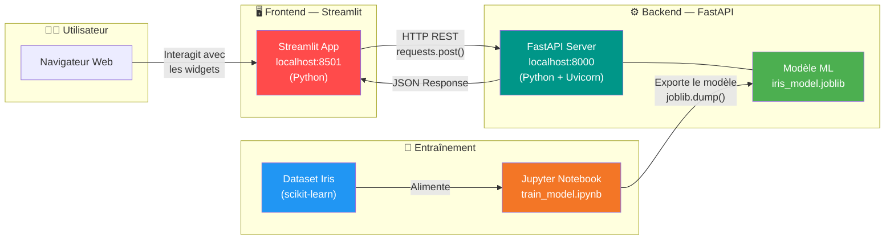
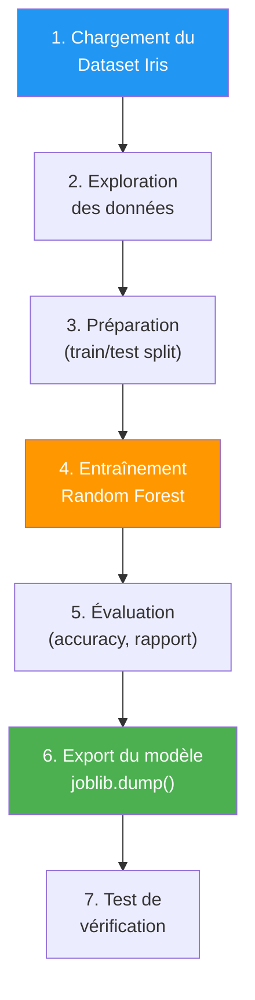
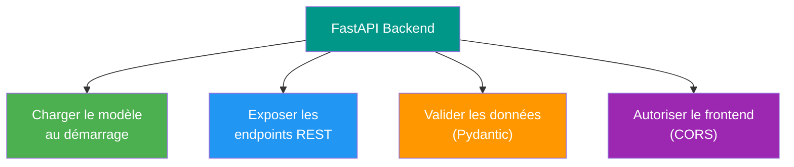
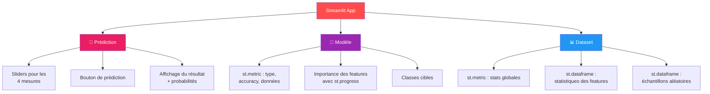
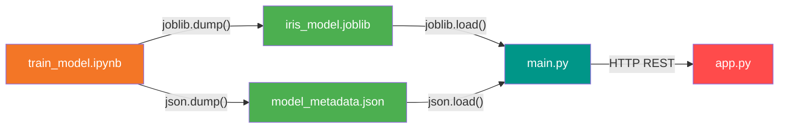
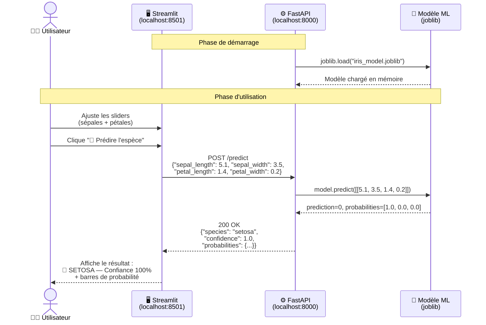
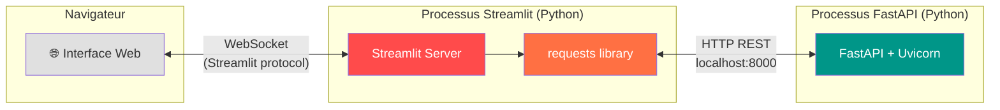
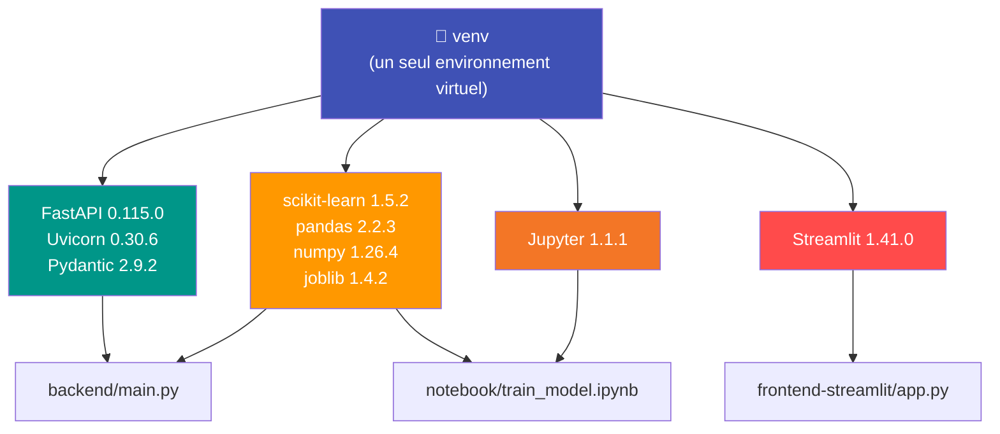
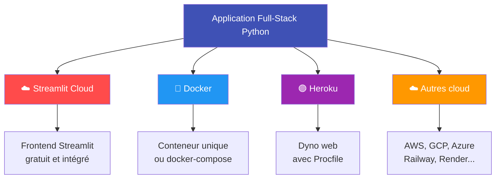
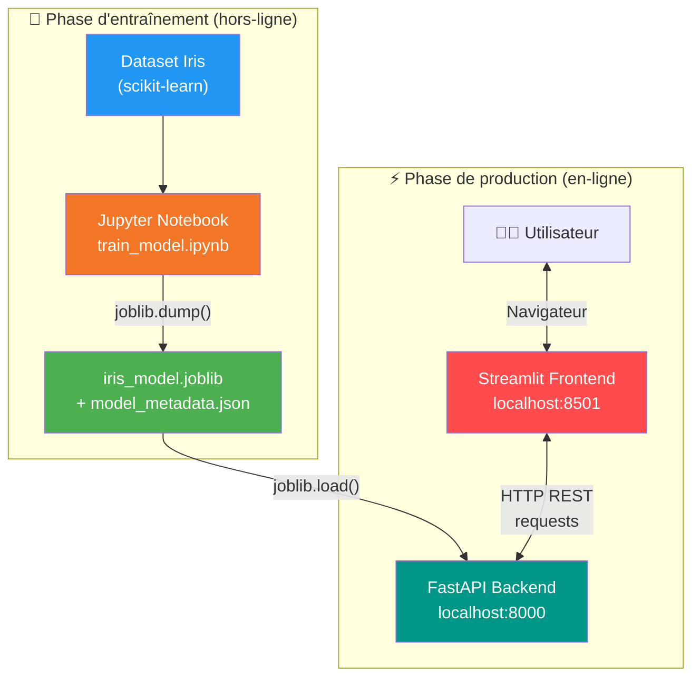

<a id="top"></a>

# Architecture d'une Application Full-Stack Python pour le Machine Learning — Streamlit + FastAPI + Jupyter Notebook

> **Projet** : Classification de fleurs Iris avec un pipeline 100 % Python
> **Stack** : Streamlit · FastAPI · Jupyter Notebook · scikit-learn

---

## Table des matières

| #  | Section |
|----|---------|
| 1  | [Introduction — Pourquoi une architecture Full-Stack Python pour le ML ?](#section-1) |
| 2  | [Vue d'ensemble de l'architecture](#section-2) |
| 3  | [Le rôle du Notebook Jupyter](#section-3) |
| 4  | [Le rôle du Backend FastAPI](#section-4) |
| 5  | [Le rôle du Frontend Streamlit](#section-5) |
| 6  | [Structure du projet](#section-6) |
| 7  | [Flux de données de bout en bout](#section-7) |
| 8  | [Communication Frontend ↔ Backend](#section-8) |
| 9  | [L'environnement virtuel Python — Tout en un seul venv](#section-9) |
| 10 | [Déploiement et perspectives](#section-10) |
| 11 | [Conclusion](#section-11) |

---

<a id="section-1"></a>

<details>
<summary><strong>1 — Introduction — Pourquoi une architecture Full-Stack Python pour le ML ?</strong></summary>

### Le problème des stacks hétérogènes

Dans une architecture classique de Machine Learning, on trouve souvent plusieurs langages et écosystèmes :

- **Python** pour l'entraînement du modèle (Jupyter, scikit-learn, TensorFlow…)
- **Python** pour le backend API (FastAPI, Flask, Django…)
- **JavaScript / Dart / autre** pour le frontend (React, Angular, Flutter…)

Cette diversité impose de gérer **plusieurs environnements**, plusieurs systèmes de dépendances, et augmente la complexité du projet.

### La solution : un stack 100 % Python

Avec **Streamlit** comme frontend, on obtient un stack entièrement en Python :

| Couche | Technologie | Langage |
|--------|-------------|---------|
| Frontend | Streamlit | Python |
| Backend API | FastAPI | Python |
| Entraînement ML | Jupyter Notebook | Python |

### Les avantages concrets

1. **Un seul langage** — Tout le monde dans l'équipe parle Python, du Data Scientist au développeur backend, jusqu'à l'interface utilisateur.

2. **Un seul environnement virtuel** — Un unique `venv` et un unique `requirements.txt` contiennent toutes les dépendances du projet (Streamlit, FastAPI, scikit-learn, Jupyter…).

3. **Courbe d'apprentissage réduite** — Un Data Scientist qui connaît Python et Jupyter peut construire une interface complète avec Streamlit sans apprendre un nouveau framework frontend.

4. **Prototypage ultra-rapide** — En quelques lignes de Python, on passe d'un modèle entraîné dans un notebook à une application web interactive avec prédictions en temps réel.

5. **Partage de code natif** — Les modèles Pydantic, les utilitaires, les transformations de données peuvent être partagés directement entre les couches sans sérialisation ni adaptation.

### Quand choisir cette architecture ?

| Cas d'usage | Recommandé ? |
|---|---|
| Démo ou prototype ML rapide | ✅ Idéal |
| Application interne / outil de Data Science | ✅ Très adapté |
| Dashboard de monitoring ML | ✅ Parfait |
| Application grand public avec UI complexe | ⚠️ Préférer Flutter, React… |
| Besoin de composants UI très personnalisés | ⚠️ Limité par les widgets Streamlit |

</details>

<p align="right"><a href="#top">↑ Back to top</a></p>

---

<a id="section-2"></a>

<details>
<summary><strong>2 — Vue d'ensemble de l'architecture</strong></summary>

### Schéma global

L'architecture repose sur trois composants indépendants qui communiquent de manière claire et découplée :



### Les trois composants

| Composant | Technologie | Port | Rôle |
|-----------|-------------|------|------|
| **Frontend** | Streamlit | `localhost:8501` | Interface utilisateur interactive (sliders, boutons, métriques, tableaux) |
| **Backend** | FastAPI + Uvicorn | `localhost:8000` | API REST : reçoit les données, exécute le modèle, retourne les prédictions |
| **Notebook** | Jupyter Notebook | — | Pipeline ML : charge les données, entraîne le modèle, l'exporte en `.joblib` |

### Principe de communication

```
Streamlit  ──── HTTP POST /predict ────►  FastAPI
           ◄──── JSON Response ─────────
```

- Le frontend **Streamlit** envoie des requêtes HTTP au backend via la bibliothèque `requests`.
- Le backend **FastAPI** charge le modèle `.joblib`, effectue la prédiction, et retourne un JSON.
- Le **Notebook Jupyter** n'est pas un serveur : c'est un outil utilisé **en amont** pour entraîner et exporter le modèle.

</details>

<p align="right"><a href="#top">↑ Back to top</a></p>

---

<a id="section-3"></a>

<details>
<summary><strong>3 — Le rôle du Notebook Jupyter</strong></summary>

### Pipeline complet de Machine Learning

Le notebook `train_model.ipynb` réalise l'ensemble du pipeline ML en 7 étapes :



### Étape 1 — Chargement du dataset

Le dataset Iris est chargé directement depuis scikit-learn et transformé en DataFrame pandas :

```python
from sklearn.datasets import load_iris
import pandas as pd

iris = load_iris()
df = pd.DataFrame(data=iris.data, columns=iris.feature_names)
df['species'] = pd.Categorical.from_codes(iris.target, iris.target_names)
```

**Le dataset Iris** contient :
- **150 échantillons** répartis en 3 espèces (50 par espèce)
- **4 features** : longueur/largeur du sépale, longueur/largeur du pétale
- **3 classes** : setosa, versicolor, virginica

### Étape 2 — Exploration des données

On analyse les statistiques descriptives, la distribution par espèce et la présence éventuelle de valeurs manquantes :

```python
df.describe()
df['species'].value_counts()
df.isnull().sum()
```

### Étape 3 — Préparation des données

Séparation en ensembles d'entraînement (80 %) et de test (20 %) avec stratification :

```python
from sklearn.model_selection import train_test_split

X = df[iris.feature_names].values
y = iris.target

X_train, X_test, y_train, y_test = train_test_split(
    X, y, test_size=0.2, random_state=42, stratify=y
)
```

- **120 échantillons** pour l'entraînement
- **30 échantillons** pour le test
- `stratify=y` garantit que chaque espèce est représentée proportionnellement dans les deux ensembles

### Étape 4 — Entraînement du modèle

Un **Random Forest Classifier** avec 100 arbres et une profondeur maximale de 5 :

```python
from sklearn.ensemble import RandomForestClassifier

model = RandomForestClassifier(
    n_estimators=100,
    max_depth=5,
    random_state=42
)
model.fit(X_train, y_train)
```

### Étape 5 — Évaluation

Le modèle atteint une **accuracy de ~93 %** sur l'ensemble de test :

```python
from sklearn.metrics import classification_report, accuracy_score

y_pred = model.predict(X_test)
accuracy = accuracy_score(y_test, y_pred)
print(classification_report(y_test, y_pred, target_names=iris.target_names))
```

On examine également l'**importance des features** :

| Feature | Importance |
|---------|-----------|
| petal width (cm) | ~43.8 % |
| petal length (cm) | ~43.2 % |
| sepal length (cm) | ~11.6 % |
| sepal width (cm) | ~1.4 % |

Les dimensions du **pétale** sont de loin les plus discriminantes pour distinguer les espèces.

### Étape 6 — Export du modèle

Le modèle entraîné et ses métadonnées sont sauvegardés dans le dossier `backend/models/` :

```python
import joblib
import json

joblib.dump(model, '../backend/models/iris_model.joblib')

metadata = {
    'model_type': 'RandomForestClassifier',
    'accuracy': float(accuracy),
    'feature_names': list(iris.feature_names),
    'target_names': list(iris.target_names),
    'feature_importances': {
        name: float(imp)
        for name, imp in zip(iris.feature_names, importances)
    },
    'training_samples': int(X_train.shape[0]),
    'test_samples': int(X_test.shape[0])
}

with open('../backend/models/model_metadata.json', 'w') as f:
    json.dump(metadata, f, indent=2)
```

**Deux fichiers sont produits :**

| Fichier | Format | Contenu |
|---------|--------|---------|
| `iris_model.joblib` | binaire (joblib) | Le modèle Random Forest sérialisé |
| `model_metadata.json` | JSON | Accuracy, noms des features/classes, importances |

### Étape 7 — Test de vérification

On recharge le modèle pour vérifier qu'il fonctionne correctement :

```python
loaded_model = joblib.load('../backend/models/iris_model.joblib')
sample = np.array([[5.1, 3.5, 1.4, 0.2]])
prediction = loaded_model.predict(sample)
# → "setosa" avec confiance ~100 %
```

</details>

<p align="right"><a href="#top">↑ Back to top</a></p>

---

<a id="section-4"></a>

<details>
<summary><strong>4 — Le rôle du Backend FastAPI</strong></summary>

### Responsabilités du backend

Le backend FastAPI est le **cerveau** de l'application. Il a quatre responsabilités principales :



### 1. Chargement du modèle au démarrage

Au lancement du serveur, le modèle `.joblib` et les métadonnées JSON sont chargés en mémoire :

```python
import joblib
import json

@app.on_event("startup")
async def startup_event():
    global model, metadata
    model = joblib.load("models/iris_model.joblib")
    with open("models/model_metadata.json", "r") as f:
        metadata = json.load(f)
```

Le modèle est chargé **une seule fois** et reste en mémoire pour toutes les requêtes.

### 2. Les endpoints REST

| Méthode | Endpoint | Description |
|---------|----------|-------------|
| `GET` | `/` | Health check basique |
| `GET` | `/health` | État de santé de l'API (modèle chargé ?) |
| `POST` | `/predict` | Prédire l'espèce d'une fleur |
| `GET` | `/model/info` | Informations sur le modèle (type, accuracy, features) |
| `GET` | `/dataset/samples` | 10 échantillons aléatoires du dataset |
| `GET` | `/dataset/stats` | Statistiques descriptives du dataset |

### 3. L'endpoint de prédiction — `/predict`

C'est l'endpoint principal. Il reçoit les 4 mesures de la fleur et retourne l'espèce prédite :

**Requête (POST) :**

```json
{
  "sepal_length": 5.1,
  "sepal_width": 3.5,
  "petal_length": 1.4,
  "petal_width": 0.2
}
```

**Réponse :**

```json
{
  "species": "setosa",
  "confidence": 1.0,
  "probabilities": {
    "setosa": 1.0,
    "versicolor": 0.0,
    "virginica": 0.0
  }
}
```

**Implémentation :**

```python
@app.post("/predict", response_model=PredictionResponse)
async def predict(request: PredictionRequest):
    features = np.array([[
        request.sepal_length, request.sepal_width,
        request.petal_length, request.petal_width
    ]])

    prediction = model.predict(features)[0]
    probabilities = model.predict_proba(features)[0]

    target_names = metadata["target_names"]
    species = target_names[prediction]
    confidence = float(probabilities[prediction])

    prob_dict = {
        name: round(float(p), 4)
        for name, p in zip(target_names, probabilities)
    }

    return PredictionResponse(
        species=species,
        confidence=round(confidence, 4),
        probabilities=prob_dict,
    )
```

### 4. Validation avec Pydantic

Chaque requête est automatiquement validée grâce aux modèles Pydantic :

```python
class PredictionRequest(BaseModel):
    sepal_length: float = Field(..., ge=0, le=10,
                                description="Longueur du sépale (cm)")
    sepal_width:  float = Field(..., ge=0, le=10,
                                description="Largeur du sépale (cm)")
    petal_length: float = Field(..., ge=0, le=10,
                                description="Longueur du pétale (cm)")
    petal_width:  float = Field(..., ge=0, le=10,
                                description="Largeur du pétale (cm)")
```

- `ge=0` → La valeur doit être ≥ 0
- `le=10` → La valeur doit être ≤ 10
- Si les contraintes ne sont pas respectées, FastAPI retourne automatiquement une erreur `422 Unprocessable Entity`

### 5. CORS — Autoriser le frontend

Le middleware CORS permet à Streamlit (sur `localhost:8501`) de communiquer avec FastAPI (sur `localhost:8000`) :

```python
from fastapi.middleware.cors import CORSMiddleware

app.add_middleware(
    CORSMiddleware,
    allow_origins=["*"],
    allow_credentials=True,
    allow_methods=["*"],
    allow_headers=["*"],
)
```

> **Note** : Dans notre cas, Streamlit utilise la bibliothèque `requests` côté serveur (pas côté navigateur), donc le CORS est moins critique que dans un frontend JavaScript. Il reste utile si l'on souhaite aussi appeler l'API depuis un navigateur ou un autre client.

### 6. Documentation automatique (Swagger)

FastAPI génère automatiquement une documentation interactive accessible à :

- **Swagger UI** : `http://localhost:8000/docs`
- **ReDoc** : `http://localhost:8000/redoc`

</details>

<p align="right"><a href="#top">↑ Back to top</a></p>

---

<a id="section-5"></a>

<details>
<summary><strong>5 — Le rôle du Frontend Streamlit</strong></summary>

### Qu'est-ce que Streamlit ?

**Streamlit** est un framework Python qui transforme des scripts Python en applications web interactives. Pas de HTML, pas de CSS, pas de JavaScript — tout se fait en Python.

```python
import streamlit as st

st.title("Ma première app")
x = st.slider("Valeur", 0, 100, 50)
st.write(f"Vous avez choisi : {x}")
```

En 3 lignes, on obtient une page web avec un slider et un affichage dynamique.

### L'application Iris ML Demo

Notre application Streamlit (`frontend-streamlit/app.py`) est une interface multi-pages composée de trois vues :



### Communication avec l'API via `requests`

Streamlit consomme l'API FastAPI grâce à la bibliothèque standard `requests` :

```python
import requests

API_BASE_URL = "http://localhost:8000"

def predict(sepal_length, sepal_width, petal_length, petal_width):
    payload = {
        "sepal_length": sepal_length,
        "sepal_width": sepal_width,
        "petal_length": petal_length,
        "petal_width": petal_width,
    }
    r = requests.post(f"{API_BASE_URL}/predict", json=payload)
    r.raise_for_status()
    return r.json()
```

### Les widgets Streamlit utilisés

| Widget | Usage dans l'app |
|--------|-----------------|
| `st.slider()` | Ajuster les 4 mesures de la fleur |
| `st.button()` | Déclencher la prédiction |
| `st.columns()` | Disposer les éléments côte à côte (2 colonnes : sépales / pétales) |
| `st.metric()` | Afficher les KPIs (accuracy, nombre d'échantillons, features) |
| `st.progress()` | Barres de progression pour les probabilités et importances |
| `st.dataframe()` | Tableau interactif des échantillons et statistiques |
| `st.spinner()` | Indicateur de chargement pendant la prédiction |
| `st.success()` / `st.error()` | Messages de statut de l'API |
| `st.sidebar` | Navigation entre les pages |
| `st.radio()` | Sélection de la page active |
| `st.markdown()` | Contenu HTML personnalisé (résultats colorés) |

### Page 1 — Prédiction

L'utilisateur ajuste les sliders et clique sur **"Prédire l'espèce"** :

```python
col1, col2 = st.columns(2)

with col1:
    st.subheader("Sépales")
    sepal_length = st.slider("Longueur du sépale (cm)", 4.0, 8.0, 5.1, 0.1)
    sepal_width  = st.slider("Largeur du sépale (cm)",  2.0, 4.5, 3.5, 0.1)

with col2:
    st.subheader("Pétales")
    petal_length = st.slider("Longueur du pétale (cm)", 1.0, 7.0, 1.4, 0.1)
    petal_width  = st.slider("Largeur du pétale (cm)",  0.1, 2.5, 0.2, 0.1)

if st.button("🔮 Prédire l'espèce", type="primary", use_container_width=True):
    result = predict(sepal_length, sepal_width, petal_length, petal_width)
    # Affichage du résultat...
```

Le résultat est affiché avec :
- Un **emoji** et le **nom de l'espèce** en grand
- Un **badge de confiance** coloré
- Des **barres de progression** pour les probabilités de chaque espèce

### Page 2 — Modèle

Affichage des informations du modèle via `GET /model/info` :

```python
info = get_model_info()

col1, col2, col3 = st.columns(3)
with col1:
    st.metric("Type de modèle", info["model_type"])
with col2:
    st.metric("Précision", f"{info['accuracy']*100:.1f}%")
with col3:
    st.metric("Données", f"{info['training_samples'] + info['test_samples']} total")
```

### Page 3 — Dataset

Exploration interactive du dataset avec statistiques et échantillons aléatoires :

```python
stats = get_dataset_stats()
st.metric("Échantillons", stats["total_samples"])

import pandas as pd
df_stats = pd.DataFrame(stats["feature_stats"]).T
st.dataframe(df_stats, use_container_width=True)

samples = get_dataset_samples()
df_samples = pd.DataFrame(samples)
st.dataframe(df_samples, use_container_width=True, hide_index=True)
```

### Configuration de la page

```python
st.set_page_config(
    page_title="Iris ML Demo",
    page_icon="🌸",
    layout="wide",
    initial_sidebar_state="expanded",
)
```

- `layout="wide"` → Utilise toute la largeur de l'écran
- `initial_sidebar_state="expanded"` → La barre latérale est ouverte au chargement

</details>

<p align="right"><a href="#top">↑ Back to top</a></p>

---

<a id="section-6"></a>

<details>
<summary><strong>6 — Structure du projet</strong></summary>

### Arborescence complète

```
full-app-pandas/
├── venv/                          # Environnement virtuel Python (partagé)
├── requirements.txt               # Dépendances Python (backend + notebook + streamlit)
├── .gitignore
│
├── notebook/                      # 📓 Jupyter Notebook — Entraînement du modèle
│   └── train_model.ipynb          #    Pipeline ML complet
│
├── backend/                       # ⚙️ FastAPI — API REST de prédiction
│   ├── main.py                    #    Serveur FastAPI + endpoints
│   └── models/
│       ├── iris_model.joblib      #    Modèle entraîné (généré par le notebook)
│       └── model_metadata.json    #    Métadonnées (généré par le notebook)
│
├── frontend-streamlit/            # 🖥️ Streamlit — Interface utilisateur
│   └── app.py                     #    Application Streamlit multi-pages
│
└── cours-streamlit/               # 📚 Documentation et cours
    └── 00-Architecture-Application-Full-Stack.md
```

### Rôle de chaque dossier

| Dossier | Contenu | Exécution |
|---------|---------|-----------|
| `venv/` | Environnement virtuel Python partagé | Créé une fois avec `python -m venv venv` |
| `notebook/` | Notebook Jupyter d'entraînement | `jupyter notebook train_model.ipynb` |
| `backend/` | Serveur FastAPI + modèle sérialisé | `python main.py` → port 8000 |
| `frontend-streamlit/` | Application Streamlit | `streamlit run app.py` → port 8501 |
| `cours-streamlit/` | Documentation pédagogique | Fichiers Markdown |

### Rôle de chaque fichier clé

| Fichier | Rôle |
|---------|------|
| `requirements.txt` | Liste toutes les dépendances : FastAPI, scikit-learn, Streamlit, Jupyter… |
| `train_model.ipynb` | Pipeline ML : chargement → exploration → entraînement → évaluation → export |
| `main.py` | Serveur FastAPI : charge le modèle, expose 6 endpoints REST |
| `iris_model.joblib` | Modèle Random Forest sérialisé (binaire, ~300 Ko) |
| `model_metadata.json` | Accuracy, noms des features/classes, importances (JSON lisible) |
| `app.py` | Application Streamlit : 3 pages (Prédiction, Modèle, Dataset) |

### Flux de génération des artefacts



</details>

<p align="right"><a href="#top">↑ Back to top</a></p>

---

<a id="section-7"></a>

<details>
<summary><strong>7 — Flux de données de bout en bout</strong></summary>

### Diagramme de séquence complet



### Détail de chaque étape

#### 1. L'utilisateur interagit avec Streamlit

L'utilisateur manipule les **4 sliders** dans le navigateur :

```python
sepal_length = st.slider("Longueur du sépale (cm)", 4.0, 8.0, 5.1, 0.1)
sepal_width  = st.slider("Largeur du sépale (cm)",  2.0, 4.5, 3.5, 0.1)
petal_length = st.slider("Longueur du pétale (cm)", 1.0, 7.0, 1.4, 0.1)
petal_width  = st.slider("Largeur du pétale (cm)",  0.1, 2.5, 0.2, 0.1)
```

#### 2. Streamlit envoie une requête HTTP

Quand l'utilisateur clique sur le bouton, Streamlit envoie un `POST` au backend :

```python
payload = {
    "sepal_length": sepal_length,
    "sepal_width": sepal_width,
    "petal_length": petal_length,
    "petal_width": petal_width,
}
r = requests.post("http://localhost:8000/predict", json=payload)
result = r.json()
```

> **Point clé** : `requests.post()` est exécuté **côté serveur Streamlit** (en Python), pas côté navigateur. Le navigateur ne communique jamais directement avec FastAPI.

#### 3. FastAPI reçoit et valide la requête

FastAPI désérialise automatiquement le JSON en un objet `PredictionRequest` Pydantic. Si les valeurs sont hors limites (< 0 ou > 10), une erreur 422 est retournée immédiatement.

#### 4. Le modèle effectue la prédiction

```python
features = np.array([[5.1, 3.5, 1.4, 0.2]])
prediction = model.predict(features)[0]        # → 0 (index de "setosa")
probabilities = model.predict_proba(features)[0] # → [1.0, 0.0, 0.0]
```

#### 5. FastAPI retourne le JSON

```json
{
  "species": "setosa",
  "confidence": 1.0,
  "probabilities": {
    "setosa": 1.0,
    "versicolor": 0.0,
    "virginica": 0.0
  }
}
```

#### 6. Streamlit affiche le résultat

Le résultat est décomposé et affiché avec des composants visuels :

```python
species = result["species"]
confidence = result["confidence"]
probabilities = result["probabilities"]

st.markdown(f"<span style='font-size:32px;'>{species.upper()}</span>",
            unsafe_allow_html=True)

for name, prob in probabilities.items():
    st.progress(prob)
```

</details>

<p align="right"><a href="#top">↑ Back to top</a></p>

---

<a id="section-8"></a>

<details>
<summary><strong>8 — Communication Frontend ↔ Backend</strong></summary>

### Architecture de communication



### Comment Streamlit communique-t-il avec FastAPI ?

Contrairement à un frontend JavaScript (React, Angular…) qui envoie des requêtes HTTP **depuis le navigateur**, Streamlit envoie les requêtes **depuis le serveur Python**.

| Aspect | Frontend JavaScript | Frontend Streamlit |
|--------|--------------------|--------------------|
| Requêtes HTTP envoyées depuis | Le navigateur (client) | Le serveur Streamlit (Python) |
| Bibliothèque utilisée | `fetch()` / `axios` | `requests` |
| CORS nécessaire ? | Oui (obligatoire) | Non (serveur → serveur) |
| Format des données | JSON | JSON |

### La bibliothèque `requests`

`requests` est la bibliothèque HTTP standard de Python. Elle est utilisée dans `app.py` pour tous les appels API :

```python
import requests

API_BASE_URL = "http://localhost:8000"

# GET simple
r = requests.get(f"{API_BASE_URL}/health", timeout=3)
data = r.json()

# POST avec payload JSON
r = requests.post(f"{API_BASE_URL}/predict", json=payload)
r.raise_for_status()  # Lève une exception si erreur HTTP
result = r.json()
```

### Format des échanges : JSON

Toutes les communications utilisent le format **JSON** :

```
Streamlit                          FastAPI
   │                                  │
   │  POST /predict                   │
   │  Content-Type: application/json  │
   │  ────────────────────────────►   │
   │  {                               │
   │    "sepal_length": 5.1,          │
   │    "sepal_width": 3.5,           │
   │    "petal_length": 1.4,          │
   │    "petal_width": 0.2            │
   │  }                               │
   │                                  │
   │  200 OK                          │
   │  Content-Type: application/json  │
   │  ◄────────────────────────────   │
   │  {                               │
   │    "species": "setosa",          │
   │    "confidence": 1.0,            │
   │    "probabilities": { ... }      │
   │  }                               │
   │                                  │
```

### Gestion des erreurs

L'application Streamlit vérifie d'abord la disponibilité de l'API, puis gère les erreurs :

```python
def check_api():
    try:
        r = requests.get(f"{API_BASE_URL}/health", timeout=3)
        return r.status_code == 200 and r.json().get("status") == "healthy"
    except Exception:
        return False

api_ok = check_api()
if api_ok:
    st.success("✅ API connectée")
else:
    st.error("❌ API hors ligne — Lancez le backend FastAPI sur le port 8000")
```

### Les deux processus sur localhost

Les deux serveurs tournent sur la **même machine** mais sur des **ports différents** :

| Serveur | Commande de lancement | URL |
|---------|----------------------|-----|
| FastAPI | `python main.py` | `http://localhost:8000` |
| Streamlit | `streamlit run app.py` | `http://localhost:8501` |

Le fait que tout soit en **localhost** simplifie la communication : pas de HTTPS, pas de réseau, latence quasi nulle.

</details>

<p align="right"><a href="#top">↑ Back to top</a></p>

---

<a id="section-9"></a>

<details>
<summary><strong>9 — L'environnement virtuel Python — Tout en un seul venv</strong></summary>

### L'avantage majeur du stack 100 % Python

Le point fort de cette architecture est que **toutes les dépendances** — backend, notebook et frontend — vivent dans un **unique environnement virtuel** Python.



### Le fichier `requirements.txt`

Un seul fichier pour tout le projet :

```txt
# Backend (FastAPI)
fastapi==0.115.0
uvicorn==0.30.6
pydantic==2.9.2
python-multipart==0.0.12

# Machine Learning
scikit-learn==1.5.2
pandas==2.2.3
numpy==1.26.4
joblib==1.4.2

# Jupyter Notebook
jupyter==1.1.1

# Frontend Streamlit
streamlit==1.41.0
```

### Création et utilisation du venv

#### Étape 1 — Créer l'environnement virtuel

```bash
python -m venv venv
```

#### Étape 2 — Activer le venv

```bash
# Windows (PowerShell)
.\venv\Scripts\Activate.ps1

# Windows (CMD)
.\venv\Scripts\activate.bat

# Linux / macOS
source venv/bin/activate
```

> Vous verrez `(venv)` apparaître au début de votre invite de commande.

#### Étape 3 — Installer toutes les dépendances

```bash
pip install -r requirements.txt
```

Cette unique commande installe **tout** : FastAPI, scikit-learn, Streamlit, Jupyter…

### Comparaison avec un stack hétérogène

| Aspect | Stack hétérogène (Flutter + FastAPI) | Stack 100 % Python (Streamlit + FastAPI) |
|--------|--------------------------------------|------------------------------------------|
| Environnements | 1 venv Python + 1 SDK Flutter | 1 seul venv Python |
| Fichiers de dépendances | `requirements.txt` + `pubspec.yaml` | `requirements.txt` uniquement |
| Installation | `pip install -r …` + `flutter pub get` | `pip install -r …` uniquement |
| Langages | Python + Dart | Python uniquement |
| Terminaux nécessaires | 2+ (backend + frontend) | 2 (backend + frontend Streamlit) |

### Un venv partagé signifie aussi :

- **Pas de conflit de versions** entre les couches (même version de `numpy`, `pandas`…)
- **Import direct** de modules partagés si nécessaire
- **Un seul `pip freeze`** pour capturer l'état complet de l'environnement
- **Docker simplifié** : un seul `Dockerfile` avec un seul `pip install`

### Lancer les trois composants

Avec le même venv activé, dans trois terminaux :

```bash
# Terminal 1 — Notebook (optionnel, pour réentraîner)
cd notebook
jupyter notebook train_model.ipynb

# Terminal 2 — Backend
cd backend
python main.py

# Terminal 3 — Frontend Streamlit
cd frontend-streamlit
streamlit run app.py
```

Les trois commandes utilisent le même interpréteur Python du même venv.

</details>

<p align="right"><a href="#top">↑ Back to top</a></p>

---

<a id="section-10"></a>

<details>
<summary><strong>10 — Déploiement et perspectives</strong></summary>

### Options de déploiement



### 1. Streamlit Cloud

**Streamlit Community Cloud** est la solution la plus simple pour les applications Streamlit :

- **Gratuit** pour les projets publics
- Déploiement direct depuis un dépôt GitHub
- Gestion automatique des dépendances via `requirements.txt`

**Limitation** : Streamlit Cloud déploie uniquement le frontend Streamlit. Le backend FastAPI doit être hébergé séparément (ou intégré directement dans l'app Streamlit pour les cas simples).

### 2. Docker

Docker permet de conteneuriser l'ensemble de l'application :

**Dockerfile unique (approche simplifiée) :**

```dockerfile
FROM python:3.11-slim

WORKDIR /app
COPY requirements.txt .
RUN pip install --no-cache-dir -r requirements.txt

COPY backend/ ./backend/
COPY frontend-streamlit/ ./frontend-streamlit/

EXPOSE 8000 8501

CMD ["sh", "-c", "cd backend && python main.py & cd frontend-streamlit && streamlit run app.py --server.port 8501"]
```

**docker-compose (approche recommandée) :**

```yaml
version: '3.8'
services:
  backend:
    build: .
    command: python backend/main.py
    ports:
      - "8000:8000"

  frontend:
    build: .
    command: streamlit run frontend-streamlit/app.py --server.port 8501
    ports:
      - "8501:8501"
    depends_on:
      - backend
    environment:
      - API_BASE_URL=http://backend:8000
```

### 3. Heroku

Heroku supporte les applications Python. Avec un `Procfile` :

```
web: sh -c "cd backend && uvicorn main:app --host 0.0.0.0 --port $PORT"
```

Pour Streamlit sur Heroku, un second dyno est nécessaire, ou bien on fusionne les deux processus.

### Perspectives d'amélioration

| Amélioration | Description |
|---|---|
| **Authentification** | Ajouter un système de login (Streamlit Authenticator ou OAuth) |
| **Base de données** | Stocker les prédictions dans PostgreSQL ou SQLite |
| **Monitoring** | Logger les requêtes, temps de réponse, drift du modèle |
| **CI/CD** | Pipeline GitHub Actions pour réentraîner automatiquement le modèle |
| **Plusieurs modèles** | Permettre de choisir entre Random Forest, SVM, XGBoost… |
| **Upload de données** | Permettre à l'utilisateur de charger son propre CSV |
| **Visualisations** | Ajouter des graphiques Plotly (nuages de points, confusion matrix…) |
| **Cache Streamlit** | Utiliser `@st.cache_data` pour optimiser les appels API |

</details>

<p align="right"><a href="#top">↑ Back to top</a></p>

---

<a id="section-11"></a>

<details>
<summary><strong>11 — Conclusion</strong></summary>

### Ce que nous avons appris

Cette architecture **Streamlit + FastAPI + Jupyter Notebook** démontre qu'il est possible de construire une application Full-Stack de Machine Learning **entièrement en Python**, de l'entraînement du modèle jusqu'à l'interface utilisateur.

### Récapitulatif de l'architecture



### Les points clés à retenir

1. **Un seul langage (Python)** pour les trois couches : entraînement, backend et frontend.

2. **Un seul environnement virtuel (`venv`)** et un seul `requirements.txt` pour gérer toutes les dépendances.

3. **Séparation des responsabilités** claire :
   - Le **Notebook** entraîne et exporte le modèle
   - **FastAPI** expose le modèle via une API REST
   - **Streamlit** fournit l'interface utilisateur interactive

4. **Communication standard** via HTTP REST et JSON — les mêmes principes que toute architecture web moderne.

5. **Prototypage rapide** — De l'idée à l'application fonctionnelle en quelques heures, idéal pour les Data Scientists.

### Commandes de lancement

```bash
# 1. Activer le venv
.\venv\Scripts\Activate.ps1    # Windows PowerShell

# 2. Installer les dépendances
pip install -r requirements.txt

# 3. Lancer le backend (Terminal 1)
cd backend
python main.py                  # → http://localhost:8000

# 4. Lancer le frontend (Terminal 2)
cd frontend-streamlit
streamlit run app.py            # → http://localhost:8501
```

> **Deux terminaux, un seul venv, un seul langage — c'est la force d'un stack 100 % Python.**

</details>

<p align="right"><a href="#top">↑ Back to top</a></p>

---

> **Document rédigé dans le cadre du projet Iris ML Demo — Full Stack Python (Streamlit + FastAPI + Jupyter Notebook)**
