<a id="top"></a>

# Introduction à l'Intelligence Artificielle et au Machine Learning de A à Z

> **Cours complet** — De la théorie aux applications pratiques avec Python, Scikit-learn et Streamlit.

---

## Table des matières

| N°  | Section                                              | Lien                        |
| --- | ---------------------------------------------------- | --------------------------- |
| 1   | Qu'est-ce que l'Intelligence Artificielle ?          | [Aller →](#section-1)      |
| 2   | Qu'est-ce que le Machine Learning ?                  | [Aller →](#section-2)      |
| 3   | Les types d'apprentissage                            | [Aller →](#section-3)      |
| 4   | Les algorithmes classiques du ML                     | [Aller →](#section-4)      |
| 5   | Le pipeline Machine Learning de A à Z                | [Aller →](#section-5)      |
| 6   | Les métriques d'évaluation                           | [Aller →](#section-6)      |
| 7   | Overfitting vs Underfitting                          | [Aller →](#section-7)      |
| 8   | Les bibliothèques Python pour le ML                  | [Aller →](#section-8)      |
| 9   | Exemple concret : Classification Iris                | [Aller →](#section-9)      |
| 10  | Du modèle au déploiement                             | [Aller →](#section-10)     |
| 11  | Glossaire des termes ML                              | [Aller →](#section-11)     |
| 12  | Conclusion et prochaines étapes                      | [Aller →](#section-12)     |

---

<!-- ============================================================ -->
<!-- SECTION 1 -->
<!-- ============================================================ -->

<a id="section-1"></a>

<details>
<summary><strong>1 — Qu'est-ce que l'Intelligence Artificielle ?</strong></summary>

### 1.1 Définition

L'**Intelligence Artificielle (IA)** est une branche de l'informatique qui vise à créer des systèmes capables de réaliser des tâches qui nécessiteraient normalement l'intelligence humaine : comprendre le langage naturel, reconnaître des images, prendre des décisions, etc.

> *« L'IA est la science et l'ingénierie de la fabrication de machines intelligentes. »* — John McCarthy, 1956

### 1.2 Bref historique

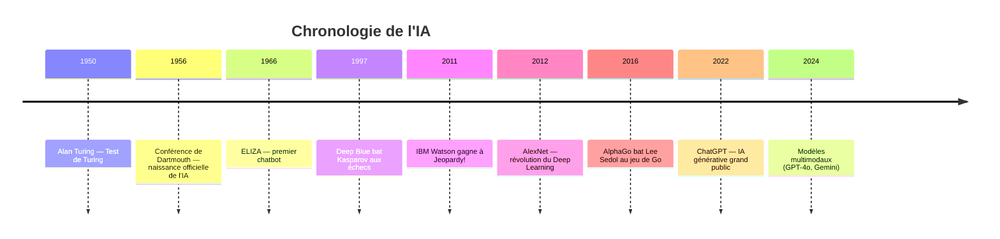

### 1.3 Les types d'IA

| Type                              | Description                                                        | Exemple                          |
| --------------------------------- | ------------------------------------------------------------------ | -------------------------------- |
| **IA étroite (Narrow AI)**        | Spécialisée dans une seule tâche                                   | Reconnaissance faciale, Siri     |
| **IA générale (General AI / AGI)**| Capable de comprendre et apprendre n'importe quelle tâche humaine | N'existe pas encore              |
| **Super IA (Super AI)**           | Surpasserait l'intelligence humaine dans tous les domaines         | Concept théorique / science-fiction |

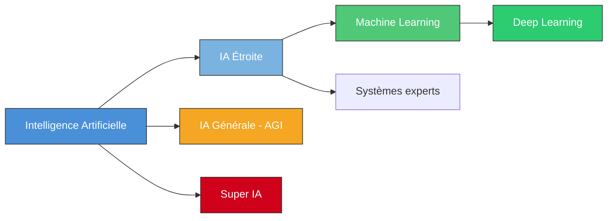

### 1.4 Exemples concrets d'IA au quotidien

- **Assistants vocaux** : Siri, Alexa, Google Assistant
- **Recommandations** : Netflix, Spotify, YouTube
- **Navigation** : Google Maps (trafic en temps réel)
- **Santé** : Détection de tumeurs par imagerie médicale
- **Finance** : Détection de fraudes bancaires
- **Automobile** : Véhicules autonomes (Tesla, Waymo)

</details>

<p align="right"><a href="#top">↑ Retour en haut</a></p>

---

<!-- ============================================================ -->
<!-- SECTION 2 -->
<!-- ============================================================ -->

<a id="section-2"></a>

<details>
<summary><strong>2 — Qu'est-ce que le Machine Learning ?</strong></summary>

### 2.1 Définition

Le **Machine Learning (ML)** — ou apprentissage automatique — est un sous-domaine de l'IA où les machines apprennent à partir de **données** sans être explicitement programmées pour chaque cas.

> *« Un programme informatique apprend de l'expérience E par rapport à une classe de tâches T et une mesure de performance P, si sa performance sur T, mesurée par P, s'améliore avec l'expérience E. »* — Tom Mitchell, 1997

### 2.2 Programmation traditionnelle vs Machine Learning

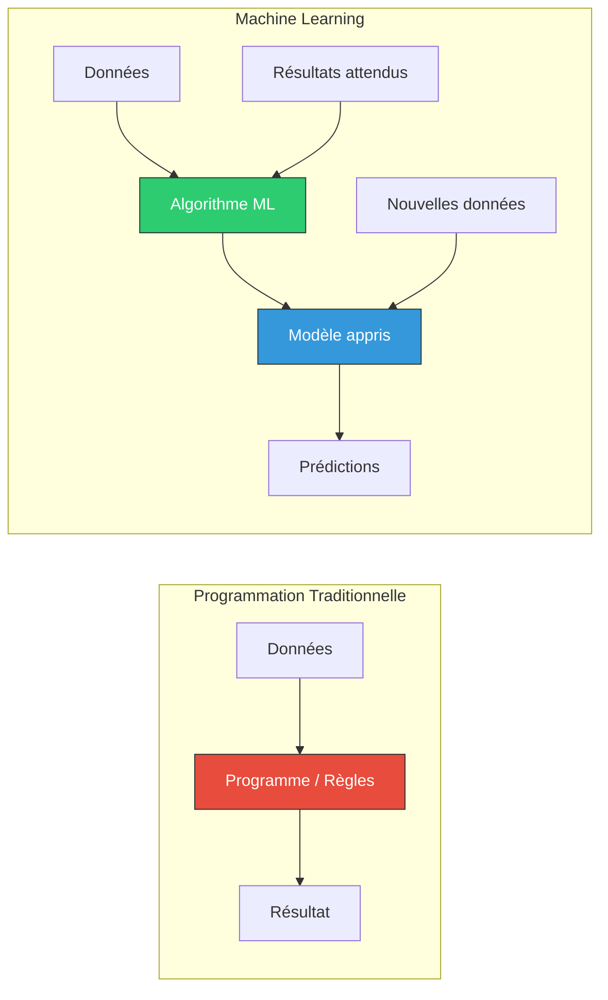

| Aspect                     | Programmation traditionnelle        | Machine Learning                      |
| -------------------------- | ----------------------------------- | ------------------------------------- |
| **Approche**               | Règles écrites manuellement         | Règles apprises automatiquement       |
| **Adaptabilité**           | Rigide                              | S'adapte aux nouvelles données        |
| **Données**                | Peu utilisées                       | Essentielles                          |
| **Maintenance**            | Mise à jour manuelle des règles     | Ré-entraînement avec nouvelles données|
| **Complexité des problèmes** | Limité aux problèmes bien définis | Gère les problèmes complexes          |

### 2.3 Quand utiliser le ML ?

Le ML est pertinent quand :
- Les règles sont trop complexes à coder manuellement
- Les données évoluent et les règles doivent s'adapter
- Le volume de données est élevé
- On cherche à découvrir des patterns cachés

</details>

<p align="right"><a href="#top">↑ Retour en haut</a></p>

---

<!-- ============================================================ -->
<!-- SECTION 3 -->
<!-- ============================================================ -->

<a id="section-3"></a>

<details>
<summary><strong>3 — Les types d'apprentissage</strong></summary>

### 3.1 Vue d'ensemble

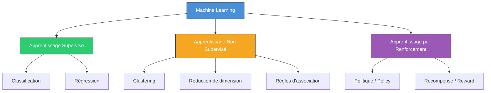

### 3.2 Apprentissage Supervisé

L'algorithme apprend à partir de **données étiquetées** (entrées + sorties attendues).

**Objectif** : Apprendre une fonction `f(x) → y` qui associe les entrées aux sorties.

**Sous-catégories** :
- **Classification** : la sortie est une catégorie (spam / pas spam, chat / chien)
- **Régression** : la sortie est une valeur continue (prix, température)

**Exemples** :
- Prédire le prix d'une maison à partir de sa surface, nombre de pièces, localisation
- Classifier un email comme spam ou non-spam
- Diagnostiquer une maladie à partir de symptômes

### 3.3 Apprentissage Non Supervisé

L'algorithme travaille avec des **données non étiquetées** et cherche à découvrir des structures cachées.

**Objectif** : Trouver des patterns, regroupements ou relations dans les données.

**Sous-catégories** :
- **Clustering** : regrouper les données similaires (K-Means, DBSCAN)
- **Réduction de dimension** : simplifier les données (PCA, t-SNE)
- **Règles d'association** : découvrir des relations (Apriori)

**Exemples** :
- Segmenter des clients en groupes marketing
- Détecter des anomalies dans les transactions bancaires
- Réduire le nombre de features avant entraînement

### 3.4 Apprentissage par Renforcement

Un **agent** apprend en interagissant avec un **environnement** et en recevant des **récompenses** ou **pénalités**.

**Objectif** : Maximiser la récompense cumulative au fil du temps.

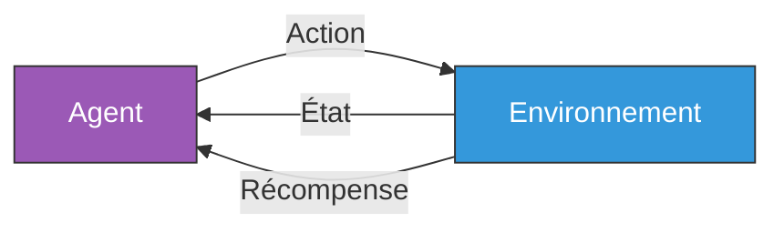

**Exemples** :
- AlphaGo (jeu de Go)
- Robots qui apprennent à marcher
- Optimisation de portefeuilles financiers
- Conduite autonome

### 3.5 Tableau comparatif

| Critère                | Supervisé                       | Non supervisé                   | Par renforcement                  |
| ---------------------- | ------------------------------- | ------------------------------- | --------------------------------- |
| **Données**            | Étiquetées                      | Non étiquetées                  | Interactions avec l'environnement |
| **Objectif**           | Prédire une sortie              | Trouver des structures          | Maximiser une récompense          |
| **Feedback**           | Direct (label correct)          | Aucun                           | Récompense différée               |
| **Exemples d'algo**    | Régression, SVM, Random Forest  | K-Means, PCA, DBSCAN           | Q-Learning, DQN, PPO             |
| **Cas d'usage**        | Prédiction, classification      | Segmentation, détection anomal. | Jeux, robotique, contrôle         |
| **Complexité**         | Moyenne                         | Variable                        | Élevée                            |

</details>

<p align="right"><a href="#top">↑ Retour en haut</a></p>

---

<!-- ============================================================ -->
<!-- SECTION 4 -->
<!-- ============================================================ -->

<a id="section-4"></a>

<details>
<summary><strong>4 — Les algorithmes classiques du Machine Learning</strong></summary>

### 4.1 Vue d'ensemble des algorithmes

| Algorithme               | Type                | Cas d'usage principal                           | Complexité     |
| ------------------------ | ------------------- | ----------------------------------------------- | -------------- |
| **Régression Linéaire**  | Supervisé (Régr.)   | Prédiction de valeurs continues (prix, salaire) | ⭐ Faible       |
| **Régression Logistique**| Supervisé (Classif.)| Classification binaire (oui/non, spam/pas spam) | ⭐ Faible       |
| **Arbre de Décision**    | Supervisé (les deux)| Décisions interprétables, données tabulaires     | ⭐⭐ Moyenne    |
| **Random Forest**        | Supervisé (les deux)| Problèmes complexes, réduction du sur-apprentissage | ⭐⭐ Moyenne |
| **KNN (K-Nearest Neighbors)** | Supervisé (les deux) | Classification et régression simples       | ⭐⭐ Moyenne    |
| **SVM (Support Vector Machine)** | Supervisé (Classif.) | Classification avec marge maximale, texte | ⭐⭐⭐ Élevée |
| **Réseaux de Neurones**  | Supervisé / Non sup.| Images, texte, séries temporelles, NLP           | ⭐⭐⭐ Élevée  |

<details>
<summary><strong>C'est quoi l'apprentissage supervisé ? (explication pour débutants)</strong></summary>

Imaginez un enfant qui apprend à reconnaître les animaux. Son parent lui **montre des photos** et lui dit : « ça c'est un chat », « ça c'est un chien ». Avec le temps, l'enfant apprend à les reconnaître tout seul. C'est exactement ça l'**apprentissage supervisé** &mdash; la machine apprend à partir d'**exemples étiquetés** (des données dont on connaît déjà la réponse).

**Analogie** : Un étudiant qui révise avec un corrigé. Il voit la question, vérifie la réponse, et ajuste sa compréhension.

Le contraire &mdash; l'**apprentissage non supervisé** &mdash; c'est comme trier un tas de jouets en groupes sans que personne ne vous dise quels groupes faire. La machine découvre les patterns toute seule.

</details>

<details>
<summary><strong>Chaque algorithme expliqué comme si vous aviez 10 ans</strong></summary>

#### Régression Linéaire &mdash; Tracer la meilleure droite

Vous êtes dans une foire. Vous remarquez : plus une personne est grande, plus elle pèse (en gros). La **régression linéaire** trace la **meilleure droite** à travers ces points pour deviner le poids de quelqu'un juste en connaissant sa taille.

> Vie réelle : Prédire le prix d'un appartement selon les mètres carrés, estimer une facture d'électricité selon la consommation.

#### Régression Logistique &mdash; Oui ou non ?

Malgré le mot « régression », cet algorithme **répond à des questions oui/non**. Cet email est-il un spam ou pas ? Cette tumeur est-elle bénigne ou maligne ?

Il donne une **probabilité** (ex : 87 % de chance que c'est un spam) puis choisit un camp.

> Vie réelle : Approbation de carte de crédit (oui/non), dépistage de maladie (positif/négatif).

#### Arbre de Décision &mdash; Jouer aux 20 questions

Vous connaissez le jeu des « 20 questions » ? On pose des questions oui/non pour trouver la réponse. Un arbre de décision fait exactement ça :

- Le pétale fait-il plus de 2,5 cm ? &rarr; **Non** &rarr; C'est une **Setosa**
- **Oui** &rarr; Le pétale fait-il plus de 4,8 cm ? &rarr; **Oui** &rarr; C'est une **Virginica**, etc.

> Vie réelle : L'arbre diagnostique d'un médecin, le processus d'approbation de prêt d'une banque.

#### Random Forest &mdash; Demander à 100 amis et voter

Un seul ami peut vous donner un mauvais conseil. Mais si vous demandez à **100 amis** la même question et prenez le **vote majoritaire**, vous aurez presque toujours la bonne réponse. Un **Random Forest** c'est exactement ça : plusieurs arbres de décision qui votent ensemble.

> Vie réelle : Détection de fraude, systèmes de recommandation, diagnostic médical.

#### KNN (K-Nearest Neighbors) &mdash; Regarder ses voisins

Vous déménagez dans un nouveau quartier. Vous ne savez pas si c'est calme. Alors vous **regardez les 5 maisons les plus proches** &mdash; si 4 sur 5 sont des familles tranquilles, vous concluez que c'est probablement un quartier calme. KNN fait pareil : il classe les nouvelles données en regardant les **K exemples connus les plus proches**.

> Vie réelle : « Les clients qui ont acheté ceci ont aussi acheté&hellip; », reconnaissance d'écriture manuscrite.

#### SVM (Support Vector Machine) &mdash; Tracer la route la plus large possible

Imaginez des points rouges et des points bleus sur une table. Vous voulez tracer une ligne pour les séparer. SVM trace la ligne qui laisse le **plus grand espace** (marge) entre les deux groupes, ce qui en fait le séparateur le plus robuste.

> Vie réelle : Classification de texte (avis positifs vs négatifs), classification d'images.

#### Réseaux de Neurones &mdash; Un cerveau fait de maths

Inspirés du cerveau humain. Des milliers de petits « neurones » connectés en **couches**. Chaque neurone fait un calcul simple, mais ensemble ils peuvent apprendre des choses incroyablement complexes : reconnaître des visages, traduire des langues, conduire des voitures.

> Vie réelle : Assistants vocaux (Siri, Alexa), voitures autonomes, ChatGPT.

</details>

### 4.2 Régression Linéaire

Modélise la relation entre une variable dépendante `y` et une ou plusieurs variables indépendantes `x`.

**Formule** : `y = β₀ + β₁x₁ + β₂x₂ + ... + βₙxₙ + ε`

```python
from sklearn.linear_model import LinearRegression

model = LinearRegression()
model.fit(X_train, y_train)
predictions = model.predict(X_test)
```

### 4.3 Régression Logistique

Malgré son nom, c'est un algorithme de **classification**. Utilise la fonction sigmoïde pour prédire une probabilité entre 0 et 1.

**Formule** : `P(y=1) = 1 / (1 + e^(-(β₀ + β₁x₁ + ... + βₙxₙ)))`

```python
from sklearn.linear_model import LogisticRegression

model = LogisticRegression()
model.fit(X_train, y_train)
predictions = model.predict(X_test)
```

### 4.4 Arbre de Décision

Modèle en arbre qui divise les données en sous-ensembles de plus en plus homogènes.

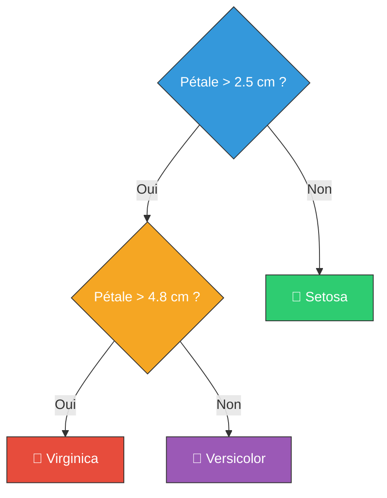

### 4.5 Random Forest

Ensemble de **plusieurs arbres de décision** qui votent pour la prédiction finale. Réduit le sur-apprentissage par rapport à un arbre unique.

```python
from sklearn.ensemble import RandomForestClassifier

model = RandomForestClassifier(n_estimators=100, random_state=42)
model.fit(X_train, y_train)
predictions = model.predict(X_test)
```

### 4.6 KNN (K-Nearest Neighbors)

Classe un point en fonction des `K` voisins les plus proches. Pas d'apprentissage explicite — « lazy learner ».

```python
from sklearn.neighbors import KNeighborsClassifier

model = KNeighborsClassifier(n_neighbors=5)
model.fit(X_train, y_train)
predictions = model.predict(X_test)
```

### 4.7 SVM (Support Vector Machine)

Trouve l'hyperplan qui sépare les classes avec la **marge maximale**.

```python
from sklearn.svm import SVC

model = SVC(kernel='rbf', C=1.0)
model.fit(X_train, y_train)
predictions = model.predict(X_test)
```

### 4.8 Réseaux de Neurones

Inspirés du cerveau humain, composés de couches de neurones interconnectés. Base du **Deep Learning**.

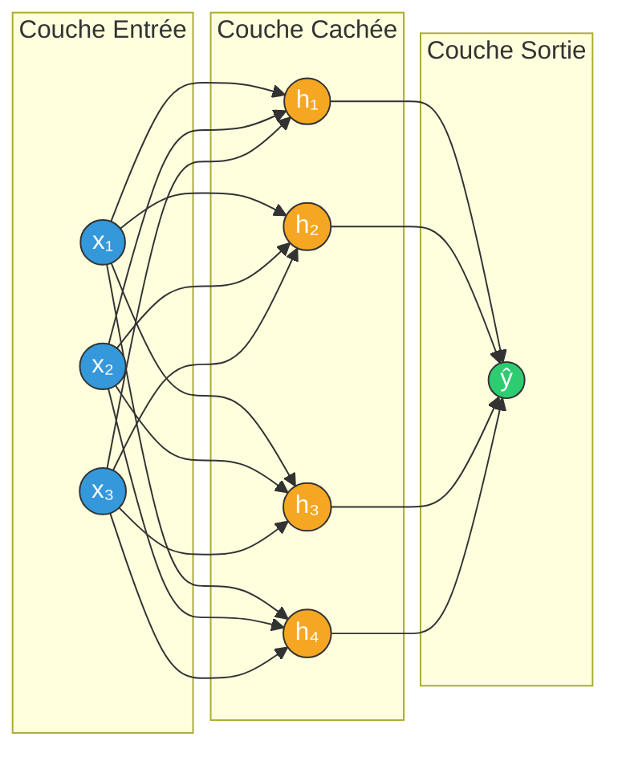

</details>

<p align="right"><a href="#top">↑ Retour en haut</a></p>

---

<!-- ============================================================ -->
<!-- SECTION 5 -->
<!-- ============================================================ -->

<a id="section-5"></a>

<details>
<summary><strong>5 — Le pipeline Machine Learning de A à Z</strong></summary>

### 5.1 Vue d'ensemble du pipeline


### 5.2 Étape 1 : Collecte des données

Les données peuvent provenir de :
- **Fichiers** : CSV, Excel, JSON, bases de données
- **APIs** : REST, GraphQL
- **Web Scraping** : extraction depuis des sites web
- **Capteurs** : IoT, images, sons
- **Datasets publics** : Kaggle, UCI ML Repository, data.gouv.fr

```python
import pandas as pd

df = pd.read_csv("data/dataset.csv")
print(f"Shape : {df.shape}")
print(df.head())
```

### 5.3 Étape 2 : Nettoyage des données

- Gestion des **valeurs manquantes** (suppression, imputation)
- Suppression des **doublons**
- Correction des **types de données**
- Détection et traitement des **outliers**

```python
df.dropna(inplace=True)
df.drop_duplicates(inplace=True)
df['age'] = df['age'].astype(int)
```

### 5.4 Étape 3 : Exploration (EDA)

L'**Exploratory Data Analysis** permet de comprendre les données avant la modélisation.

```python
import matplotlib.pyplot as plt
import seaborn as sns

df.describe()
df.info()
sns.heatmap(df.corr(), annot=True, cmap='coolwarm')
plt.show()
```

### 5.5 Étape 4 : Feature Engineering

Transformer et créer des variables pour améliorer le modèle :
- **Encodage** des variables catégorielles (One-Hot, Label Encoding)
- **Normalisation / Standardisation** des variables numériques
- **Création** de nouvelles features
- **Sélection** des features les plus importantes

```python
from sklearn.preprocessing import StandardScaler, LabelEncoder

le = LabelEncoder()
df['categorie'] = le.fit_transform(df['categorie'])

scaler = StandardScaler()
X_scaled = scaler.fit_transform(X)
```

### 5.6 Étape 5 : Split Train / Test

Diviser les données en un jeu d'**entraînement** et un jeu de **test** (généralement 80/20 ou 70/30).

```python
from sklearn.model_selection import train_test_split

X_train, X_test, y_train, y_test = train_test_split(
    X, y, test_size=0.2, random_state=42
)
```

### 5.7 Étape 6 : Entraînement du modèle

```python
from sklearn.ensemble import RandomForestClassifier

model = RandomForestClassifier(n_estimators=100, random_state=42)
model.fit(X_train, y_train)
```

### 5.8 Étape 7 : Évaluation du modèle

```python
from sklearn.metrics import accuracy_score, classification_report

y_pred = model.predict(X_test)
print(f"Accuracy : {accuracy_score(y_test, y_pred):.2f}")
print(classification_report(y_test, y_pred))
```

### 5.9 Étape 8 : Déploiement

Mettre le modèle en production via :
- **API** (FastAPI, Flask)
- **Application web** (Streamlit, Gradio)
- **Service cloud** (AWS SageMaker, GCP Vertex AI, Azure ML)

</details>

<p align="right"><a href="#top">↑ Retour en haut</a></p>

---

<!-- ============================================================ -->
<!-- SECTION 6 -->
<!-- ============================================================ -->

<a id="section-6"></a>

<details>
<summary><strong>6 — Les métriques d'évaluation</strong></summary>

### 6.1 Matrice de confusion

La matrice de confusion est le point de départ pour comprendre les performances d'un classifieur.

|                        | **Prédit Positif** | **Prédit Négatif** |
| ---------------------- | ------------------ | ------------------ |
| **Réel Positif**       | TP (Vrai Positif)  | FN (Faux Négatif)  |
| **Réel Négatif**       | FP (Faux Positif)  | TN (Vrai Négatif)  |

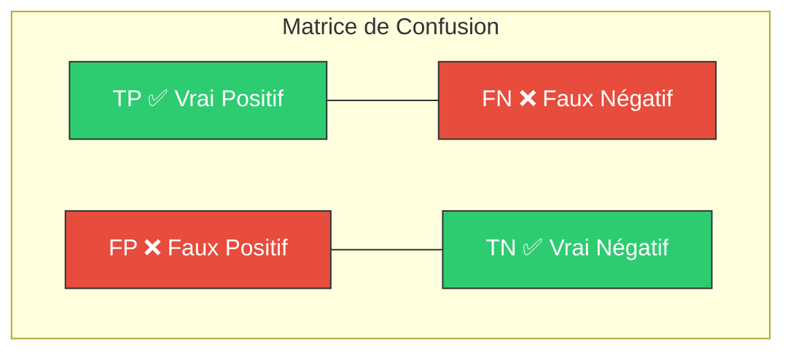

<details>
<summary><strong>Comprendre les métriques avec un exemple concret : test COVID sur 8 personnes</strong></summary>

Imaginez une clinique qui teste **8 personnes** pour le COVID. Voici la réalité et ce que dit le test :

| Personne | A vraiment le COVID ? | Résultat du test |
|----------|----------------------|------------------|
| Alice | **Oui** | **Positif** &check; |
| Bob | **Oui** | **Positif** &check; |
| Carole | **Oui** | **Négatif** &cross; |
| David | Non | Négatif &check; |
| Emma | Non | Négatif &check; |
| François | Non | Négatif &check; |
| Gisèle | Non | **Positif** &cross; |
| Hugo | Non | Négatif &check; |

À partir de ces 8 résultats :

| | Prédit Positif | Prédit Négatif |
|--|---|---|
| **Réellement Positif** | **VP = 2** (Alice, Bob) | **FN = 1** (Carole) |
| **Réellement Négatif** | **FP = 1** (Gisèle) | **VN = 4** (David, Emma, François, Hugo) |

**Que signifie chaque case en langage simple ?**

- **VP (Vrai Positif) = 2** &mdash; Alice et Bob ont vraiment le COVID et le test dit correctement « positif ». Le test **a bien fonctionné**.
- **VN (Vrai Négatif) = 4** &mdash; David, Emma, François et Hugo n'ont pas le COVID et le test dit correctement « négatif ». Le test **a encore bien fonctionné**.
- **FP (Faux Positif) = 1** &mdash; Gisèle n'a **PAS** le COVID, mais le test dit « positif » à tort. C'est une **fausse alarme**. C'est comme un test de grossesse qui dit « enceinte » alors que la femme **n'est pas** enceinte. Stressant pour rien !
- **FN (Faux Négatif) = 1** &mdash; Carole **A** le COVID, mais le test dit « négatif » à tort. C'est l'erreur **la plus dangereuse** : Carole pense qu'elle est en bonne santé, sort, et contamine les autres.

**Calculons maintenant les métriques :**

- **Accuracy** = (2 + 4) / 8 = **75 %** &mdash; 6 résultats sur 8 sont corrects. Ça semble OK, mais est-ce suffisant ?
- **Precision** = 2 / (2 + 1) = **66,7 %** &mdash; Sur les 3 personnes déclarées positives par le test, seulement 2 avaient vraiment le COVID. 1 résultat positif sur 3 est une fausse alarme.
- **Recall** = 2 / (2 + 1) = **66,7 %** &mdash; Sur les 3 personnes qui avaient vraiment le COVID, le test n'en a détecté que 2. Il a **raté** Carole.
- **F1-Score** = 2 &times; (0,667 &times; 0,667) / (0,667 + 0,667) = **66,7 %** &mdash; L'équilibre entre precision et recall.

**Pourquoi c'est important ?**

| Situation | Qu'est-ce qui est pire ? | Quelle métrique surveiller ? |
|-----------|--------------------------|------------------------------|
| **COVID / dépistage maladie** | Rater un malade (FN) | Le **Recall** doit être très élevé |
| **Filtre anti-spam** | Envoyer un email important dans les spams (FP) | La **Precision** doit être élevée |
| **Test de grossesse** | Dire « enceinte » alors que non (FP) = angoisse ; Dire « pas enceinte » alors que oui (FN) = suivi raté | Les deux comptent, utiliser le **F1** |
| **Sécurité aéroport** | Laisser passer une menace (FN) | Le **Recall** est critique |

> **Point clé** : Un modèle avec 99 % d'accuracy peut quand même être terrible. Si seulement 1 % des gens ont une maladie et que votre modèle dit toujours « sain », il est exact à 99 % mais **ne détecte aucun malade** (recall = 0 %).

</details>

### 6.2 Accuracy (Exactitude)

Proportion de prédictions correctes sur le total.

$$
\text{Accuracy} = \frac{TP + TN}{TP + TN + FP + FN}
$$

> ⚠️ L'accuracy peut être trompeuse avec des classes déséquilibrées. Si 95 % des emails sont non-spam, un modèle qui prédit toujours « non-spam » aura 95 % d'accuracy.

### 6.3 Precision (Précision)

Parmi les prédictions positives, combien sont réellement positives ?

$$
\text{Precision} = \frac{TP}{TP + FP}
$$

> Utile quand le **coût des faux positifs** est élevé (ex : diagnostic médical — dire qu'un patient est malade alors qu'il ne l'est pas).

### 6.4 Recall (Rappel / Sensibilité)

Parmi les réels positifs, combien ont été correctement identifiés ?

$$
\text{Recall} = \frac{TP}{TP + FN}
$$

> Utile quand le **coût des faux négatifs** est élevé (ex : ne pas détecter une fraude bancaire).

### 6.5 F1-Score

Moyenne harmonique de la Precision et du Recall. Équilibre entre les deux.

$$
F_1 = \frac{2 \cdot \text{Precision} \cdot \text{Recall}}{\text{Precision} + \text{Recall}}
$$

### 6.6 Tableau récapitulatif

| Métrique      | Formule                                                                    | Quand l'utiliser ?                              |
| ------------- | -------------------------------------------------------------------------- | ----------------------------------------------- |
| **Accuracy**  | $\frac{TP + TN}{TP + TN + FP + FN}$                                       | Classes équilibrées                             |
| **Precision** | $\frac{TP}{TP + FP}$                                                      | Coût FP élevé (spam, diagnostic)                |
| **Recall**    | $\frac{TP}{TP + FN}$                                                      | Coût FN élevé (fraude, maladie grave)           |
| **F1-Score**  | $2 \cdot \frac{\text{Precision} \cdot \text{Recall}}{\text{Precision} + \text{Recall}}$ | Compromis entre Precision et Recall  |

### 6.7 En code Python

```python
from sklearn.metrics import (
    accuracy_score, precision_score, recall_score,
    f1_score, confusion_matrix, ConfusionMatrixDisplay
)
import matplotlib.pyplot as plt

print(f"Accuracy  : {accuracy_score(y_test, y_pred):.4f}")
print(f"Precision : {precision_score(y_test, y_pred, average='weighted'):.4f}")
print(f"Recall    : {recall_score(y_test, y_pred, average='weighted'):.4f}")
print(f"F1-Score  : {f1_score(y_test, y_pred, average='weighted'):.4f}")

cm = confusion_matrix(y_test, y_pred)
disp = ConfusionMatrixDisplay(confusion_matrix=cm)
disp.plot(cmap='Blues')
plt.title("Matrice de Confusion")
plt.show()
```

</details>

<p align="right"><a href="#top">↑ Retour en haut</a></p>

---

<!-- ============================================================ -->
<!-- SECTION 7 -->
<!-- ============================================================ -->

<a id="section-7"></a>

<details>
<summary><strong>7 — Overfitting vs Underfitting</strong></summary>

### 7.1 Définitions

| Concept           | Définition                                                                 | Symptôme                                              |
| ----------------- | -------------------------------------------------------------------------- | ----------------------------------------------------- |
| **Overfitting**   | Le modèle apprend le **bruit** des données d'entraînement                  | Excellente performance sur train, mauvaise sur test    |
| **Underfitting**  | Le modèle est trop **simple** pour capturer les patterns des données       | Mauvaise performance sur train ET test                 |
| **Bon équilibre** | Le modèle généralise bien aux nouvelles données                            | Performances similaires sur train et test              |

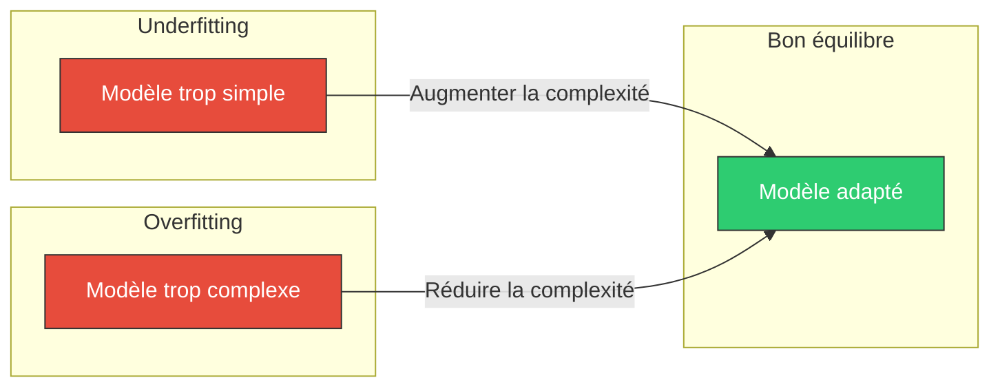

### 7.2 Comment détecter ?

```
Si score_train >> score_test  →  Overfitting
Si score_train ≈ score_test mais les deux sont bas  →  Underfitting
Si score_train ≈ score_test et les deux sont élevés  →  Bon modèle ✅
```

### 7.3 Solutions contre l'Overfitting

| Solution                         | Description                                                    |
| -------------------------------- | -------------------------------------------------------------- |
| **Plus de données**              | Augmenter la taille du dataset                                 |
| **Régularisation (L1, L2)**      | Pénaliser les poids trop grands                                |
| **Cross-validation**             | Évaluer sur plusieurs sous-ensembles                           |
| **Réduire la complexité**        | Moins de features, arbre moins profond                         |
| **Dropout (Deep Learning)**      | Désactiver aléatoirement des neurones pendant l'entraînement   |
| **Early Stopping**               | Arrêter l'entraînement quand la performance sur validation baisse |
| **Data Augmentation**            | Générer des variations des données existantes                  |

### 7.4 Solutions contre l'Underfitting

| Solution                         | Description                                                    |
| -------------------------------- | -------------------------------------------------------------- |
| **Augmenter la complexité**      | Plus de features, modèle plus puissant                         |
| **Feature Engineering**          | Créer de meilleures variables                                  |
| **Réduire la régularisation**    | Assouplir les contraintes du modèle                            |
| **Entraîner plus longtemps**     | Plus d'époques / itérations                                    |
| **Changer d'algorithme**         | Passer à un modèle plus expressif                              |

### 7.5 Cross-Validation

La **validation croisée** (K-Fold) est une technique clé pour évaluer la généralisation :

```python
from sklearn.model_selection import cross_val_score

scores = cross_val_score(model, X, y, cv=5, scoring='accuracy')
print(f"Accuracy moyenne : {scores.mean():.4f} (+/- {scores.std():.4f})")
```

</details>

<p align="right"><a href="#top">↑ Retour en haut</a></p>

---

<!-- ============================================================ -->
<!-- SECTION 8 -->
<!-- ============================================================ -->

<a id="section-8"></a>

<details>
<summary><strong>8 — Les bibliothèques Python pour le ML</strong></summary>

### 8.1 Écosystème Python pour le Machine Learning

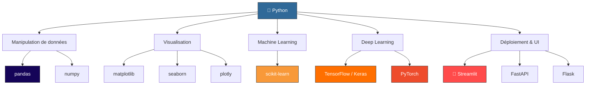

### 8.2 Tableau des bibliothèques

| Bibliothèque      | Rôle                              | Commande d'installation       | Usage principal                       |
| ------------------ | --------------------------------- | ----------------------------- | ------------------------------------- |
| **NumPy**          | Calcul numérique                  | `pip install numpy`           | Tableaux, algèbre linéaire            |
| **Pandas**         | Manipulation de données           | `pip install pandas`          | DataFrames, nettoyage, analyse        |
| **Matplotlib**     | Visualisation statique            | `pip install matplotlib`      | Graphiques, histogrammes              |
| **Seaborn**        | Visualisation statistique         | `pip install seaborn`         | Heatmaps, distributions              |
| **Scikit-learn**   | Machine Learning classique        | `pip install scikit-learn`    | Entraînement, évaluation, pipelines   |
| **TensorFlow**     | Deep Learning                     | `pip install tensorflow`      | Réseaux de neurones, CNN, RNN         |
| **PyTorch**        | Deep Learning (recherche)         | `pip install torch`           | Recherche, NLP, vision               |
| **Streamlit**      | UI interactive pour la data       | `pip install streamlit`       | Dashboards ML, démos, prototypage     |

### 8.3 Pourquoi Streamlit ?

**Streamlit** est particulièrement pertinent dans un projet ML car il permet de :

- Créer une **interface utilisateur** pour explorer les données et les prédictions
- Visualiser les résultats du modèle en **temps réel**
- Construire des **démos interactives** sans connaître HTML/CSS/JS
- Servir de **frontend** pour un modèle déployé via API (FastAPI)

```python
import streamlit as st
import pandas as pd

st.title("🤖 Mon application ML")
uploaded_file = st.file_uploader("Charger un CSV", type="csv")

if uploaded_file:
    df = pd.read_csv(uploaded_file)
    st.dataframe(df.head())
    st.line_chart(df.select_dtypes(include='number'))
```

### 8.4 Installation rapide de l'écosystème

```bash
pip install numpy pandas matplotlib seaborn scikit-learn streamlit joblib
```

</details>

<p align="right"><a href="#top">↑ Retour en haut</a></p>

---

<!-- ============================================================ -->
<!-- SECTION 9 -->
<!-- ============================================================ -->

<a id="section-9"></a>

<details>
<summary><strong>9 — Exemple concret : Classification Iris</strong></summary>

### 9.1 Le dataset Iris

Le dataset **Iris** est le « Hello World » du Machine Learning. Créé par Ronald Fisher en 1936.

| Caractéristique          | Détail                                         |
| ------------------------ | ---------------------------------------------- |
| **Nombre d'échantillons** | 150 (50 par classe)                            |
| **Nombre de features**    | 4                                              |
| **Features**              | Longueur sépale, Largeur sépale, Longueur pétale, Largeur pétale |
| **Classes (target)**      | Setosa, Versicolor, Virginica                  |
| **Type de problème**      | Classification multi-classes                   |

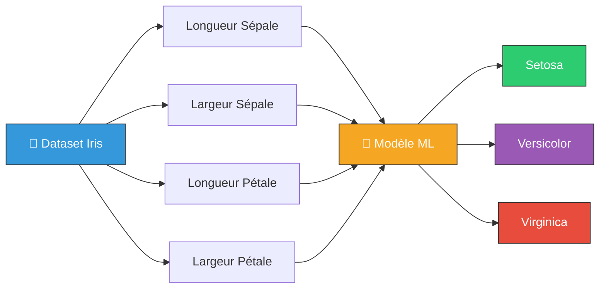

### 9.2 Code complet — Entraînement et évaluation

```python
# 1. Imports
from sklearn.datasets import load_iris
from sklearn.model_selection import train_test_split
from sklearn.ensemble import RandomForestClassifier
from sklearn.metrics import accuracy_score, classification_report, confusion_matrix
import pandas as pd
import matplotlib.pyplot as plt
import seaborn as sns

# 2. Charger les données
iris = load_iris()
X = pd.DataFrame(iris.data, columns=iris.feature_names)
y = iris.target

print(f"Shape des features : {X.shape}")
print(f"Classes : {iris.target_names}")
print(X.head())

# 3. Split train / test
X_train, X_test, y_train, y_test = train_test_split(
    X, y, test_size=0.2, random_state=42, stratify=y
)

# 4. Entraîner le modèle
model = RandomForestClassifier(n_estimators=100, random_state=42)
model.fit(X_train, y_train)

# 5. Prédictions
y_pred = model.predict(X_test)

# 6. Évaluation
print(f"\n✅ Accuracy : {accuracy_score(y_test, y_pred):.4f}")
print(f"\n📊 Rapport de classification :\n")
print(classification_report(y_test, y_pred, target_names=iris.target_names))

# 7. Matrice de confusion
cm = confusion_matrix(y_test, y_pred)
plt.figure(figsize=(8, 6))
sns.heatmap(cm, annot=True, fmt='d', cmap='Blues',
            xticklabels=iris.target_names,
            yticklabels=iris.target_names)
plt.xlabel('Prédit')
plt.ylabel('Réel')
plt.title('Matrice de Confusion — Iris')
plt.show()

# 8. Importance des features
importances = pd.Series(model.feature_importances_, index=iris.feature_names)
importances.sort_values(ascending=True).plot(kind='barh', color='steelblue')
plt.title("Importance des features")
plt.show()
```

### 9.3 Résultats attendus

Avec un Random Forest sur Iris, on obtient généralement :

| Métrique   | Valeur attendue |
| ---------- | --------------- |
| Accuracy   | ~96 % - 100 %  |
| Precision  | ~96 % - 100 %  |
| Recall     | ~96 % - 100 %  |
| F1-Score   | ~96 % - 100 %  |

### 9.4 Sauvegarder le modèle

```python
import joblib

joblib.dump(model, "models/iris_model.pkl")
print("✅ Modèle sauvegardé dans models/iris_model.pkl")
```

</details>

<p align="right"><a href="#top">↑ Retour en haut</a></p>

---

<!-- ============================================================ -->
<!-- SECTION 10 -->
<!-- ============================================================ -->

<a id="section-10"></a>

<details>
<summary><strong>10 — Du modèle au déploiement</strong></summary>

### 10.1 Pourquoi déployer un modèle ?

Un modèle qui reste dans un notebook Jupyter n'a **aucune valeur métier**. Le déploiement permet de le rendre accessible aux utilisateurs finaux.

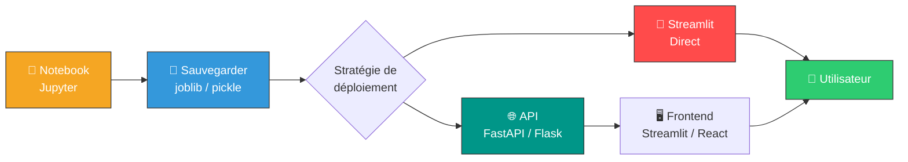

### 10.2 Étape 1 : Sauvegarder le modèle avec joblib

```python
import joblib

joblib.dump(model, "models/iris_model.pkl")
joblib.dump(scaler, "models/scaler.pkl")  # si vous avez un scaler
```

### 10.3 Étape 2 : Charger et servir via FastAPI

```python
from fastapi import FastAPI
from pydantic import BaseModel
import joblib
import numpy as np

app = FastAPI(title="Iris Prediction API")

model = joblib.load("models/iris_model.pkl")
class_names = ["Setosa", "Versicolor", "Virginica"]

class IrisInput(BaseModel):
    sepal_length: float
    sepal_width: float
    petal_length: float
    petal_width: float

@app.post("/predict")
def predict(data: IrisInput):
    features = np.array([[
        data.sepal_length, data.sepal_width,
        data.petal_length, data.petal_width
    ]])
    prediction = model.predict(features)[0]
    probability = model.predict_proba(features)[0]
    return {
        "prediction": class_names[prediction],
        "confidence": float(max(probability)),
        "probabilities": {
            name: float(prob) for name, prob in zip(class_names, probability)
        }
    }
```

### 10.4 Étape 3a : Frontend Streamlit (appel API)

```python
import streamlit as st
import requests

st.title("🌸 Prédiction Iris — via API")

col1, col2 = st.columns(2)
with col1:
    sepal_length = st.slider("Longueur sépale", 4.0, 8.0, 5.8)
    sepal_width = st.slider("Largeur sépale", 2.0, 4.5, 3.0)
with col2:
    petal_length = st.slider("Longueur pétale", 1.0, 7.0, 4.0)
    petal_width = st.slider("Largeur pétale", 0.1, 2.5, 1.2)

if st.button("🔮 Prédire"):
    response = requests.post("http://localhost:8000/predict", json={
        "sepal_length": sepal_length,
        "sepal_width": sepal_width,
        "petal_length": petal_length,
        "petal_width": petal_width
    })
    result = response.json()
    st.success(f"Classe prédite : **{result['prediction']}**")
    st.metric("Confiance", f"{result['confidence']:.1%}")
```

### 10.5 Étape 3b : Streamlit Direct (sans API)

```python
import streamlit as st
import joblib
import numpy as np

st.title("🌸 Prédiction Iris — Direct")

model = joblib.load("models/iris_model.pkl")
class_names = ["Setosa", "Versicolor", "Virginica"]

col1, col2 = st.columns(2)
with col1:
    sepal_length = st.slider("Longueur sépale", 4.0, 8.0, 5.8)
    sepal_width = st.slider("Largeur sépale", 2.0, 4.5, 3.0)
with col2:
    petal_length = st.slider("Longueur pétale", 1.0, 7.0, 4.0)
    petal_width = st.slider("Largeur pétale", 0.1, 2.5, 1.2)

if st.button("🔮 Prédire"):
    features = np.array([[sepal_length, sepal_width, petal_length, petal_width]])
    prediction = model.predict(features)[0]
    proba = model.predict_proba(features)[0]

    st.success(f"Classe prédite : **{class_names[prediction]}**")
    st.metric("Confiance", f"{max(proba):.1%}")

    st.bar_chart(dict(zip(class_names, proba)))
```

### 10.6 Comparaison des deux approches

| Critère              | Streamlit Direct                     | Streamlit + API (FastAPI)             |
| -------------------- | ------------------------------------ | ------------------------------------- |
| **Simplicité**       | ⭐⭐⭐ Très simple                   | ⭐⭐ Plus de code                     |
| **Séparation**       | Monolithique                         | Frontend / Backend séparés            |
| **Scalabilité**      | Limitée                              | Meilleure (API réutilisable)          |
| **Multi-clients**    | Streamlit seulement                  | N'importe quel client (mobile, web)   |
| **Recommandé pour**  | Prototypage, démos, projets perso    | Production, équipes, multi-plateformes|

</details>

<p align="right"><a href="#top">↑ Retour en haut</a></p>

---

<!-- ============================================================ -->
<!-- SECTION 11 -->
<!-- ============================================================ -->

<a id="section-11"></a>

<details>
<summary><strong>11 — Glossaire des termes ML</strong></summary>

| Terme                      | Définition                                                                                     |
| -------------------------- | ---------------------------------------------------------------------------------------------- |
| **Algorithme**             | Procédure mathématique utilisée pour entraîner un modèle                                        |
| **Batch**                  | Sous-ensemble de données utilisé pour une itération d'entraînement                              |
| **Biais (Bias)**           | Erreur due à des hypothèses trop simplistes du modèle                                           |
| **Classification**         | Prédiction d'une catégorie discrète                                                             |
| **Clustering**             | Regroupement non supervisé de données similaires                                                |
| **Cross-validation**       | Technique d'évaluation par découpage multiple des données                                       |
| **Dataset**                | Ensemble de données utilisé pour l'entraînement ou le test                                      |
| **Deep Learning**          | Sous-domaine du ML utilisant des réseaux de neurones profonds                                   |
| **Epoch**                  | Passage complet sur l'ensemble des données d'entraînement                                       |
| **Feature**                | Variable d'entrée utilisée par le modèle                                                        |
| **Feature Engineering**    | Processus de création et transformation des features                                            |
| **Gradient Descent**       | Algorithme d'optimisation pour minimiser la fonction de coût                                    |
| **Hyperparamètre**         | Paramètre défini avant l'entraînement (ex : learning rate, n_estimators)                        |
| **Label**                  | Valeur de sortie attendue (étiquette) dans l'apprentissage supervisé                            |
| **Learning Rate**          | Taille du pas dans la descente de gradient                                                      |
| **Loss Function**          | Fonction mesurant l'erreur entre prédiction et réalité                                          |
| **Modèle**                 | Représentation mathématique apprise à partir des données                                        |
| **Normalisation**          | Mise à l'échelle des features entre 0 et 1                                                      |
| **Overfitting**            | Modèle trop ajusté aux données d'entraînement, mauvaise généralisation                         |
| **Pipeline**               | Enchaînement automatisé d'étapes de traitement et modélisation                                  |
| **Prédiction**             | Sortie produite par le modèle pour de nouvelles données                                         |
| **Régression**             | Prédiction d'une valeur continue                                                                |
| **Régularisation**         | Technique pour éviter le sur-apprentissage (L1, L2, Dropout)                                    |
| **Standardisation**        | Mise à l'échelle des features avec moyenne 0 et écart-type 1                                    |
| **Target**                 | Variable que le modèle cherche à prédire                                                        |
| **Test Set**               | Données réservées pour évaluer le modèle après entraînement                                     |
| **Training Set**           | Données utilisées pour entraîner le modèle                                                      |
| **Underfitting**           | Modèle trop simple, incapable de capturer les patterns                                          |
| **Variance**               | Erreur due à une sensibilité excessive aux fluctuations des données d'entraînement              |
| **Validation Set**         | Données utilisées pour ajuster les hyperparamètres pendant l'entraînement                       |

</details>

<p align="right"><a href="#top">↑ Retour en haut</a></p>

---

<!-- ============================================================ -->
<!-- SECTION 12 -->
<!-- ============================================================ -->

<a id="section-12"></a>

<details>
<summary><strong>12 — Conclusion et prochaines étapes</strong></summary>

### 12.1 Ce que nous avons couvert

Dans ce cours, nous avons exploré **l'Intelligence Artificielle et le Machine Learning de A à Z** :

- ✅ Les **fondamentaux** de l'IA et du ML
- ✅ Les **trois types** d'apprentissage (supervisé, non supervisé, par renforcement)
- ✅ Les **algorithmes classiques** (Régression, Arbres, SVM, Réseaux de neurones)
- ✅ Le **pipeline ML complet** de la collecte au déploiement
- ✅ Les **métriques d'évaluation** et la matrice de confusion
- ✅ Les problèmes d'**overfitting et underfitting**
- ✅ L'**écosystème Python** pour le ML
- ✅ Un **exemple concret** avec le dataset Iris
- ✅ Le **déploiement** avec joblib, FastAPI et Streamlit

### 12.2 Prochaines étapes recommandées

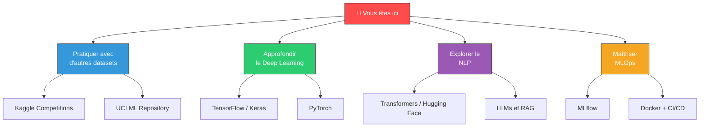

### 12.3 Ressources pour aller plus loin

| Ressource                                    | Type           | Lien                                          |
| -------------------------------------------- | -------------- | --------------------------------------------- |
| **Scikit-learn Documentation**               | Documentation  | https://scikit-learn.org/stable/               |
| **Kaggle Learn**                             | Cours gratuit  | https://www.kaggle.com/learn                   |
| **Fast.ai**                                  | Cours gratuit  | https://www.fast.ai/                           |
| **Streamlit Documentation**                  | Documentation  | https://docs.streamlit.io/                     |
| **Machine Learning Mastery**                 | Blog / Tutoriels | https://machinelearningmastery.com/           |
| **Hands-On ML (Aurélien Géron)**             | Livre          | O'Reilly                                       |
| **Deep Learning (Ian Goodfellow)**           | Livre          | https://www.deeplearningbook.org/              |

### 12.4 Conseil final

> *Le Machine Learning s'apprend en **pratiquant**. Choisissez un dataset qui vous intéresse, posez une question, et construisez un modèle pour y répondre. Déployez-le avec Streamlit pour le rendre interactif. Chaque projet vous rendra meilleur.*

---

**Bon apprentissage !** 🚀

</details>

<p align="right"><a href="#top">↑ Retour en haut</a></p>

---

> **Auteur** : Cours généré dans le cadre du projet `full-app-pandas`
> **Stack** : Python · Scikit-learn · Pandas · Streamlit · FastAPI
