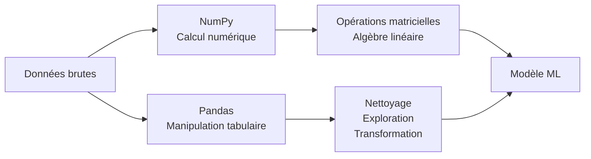
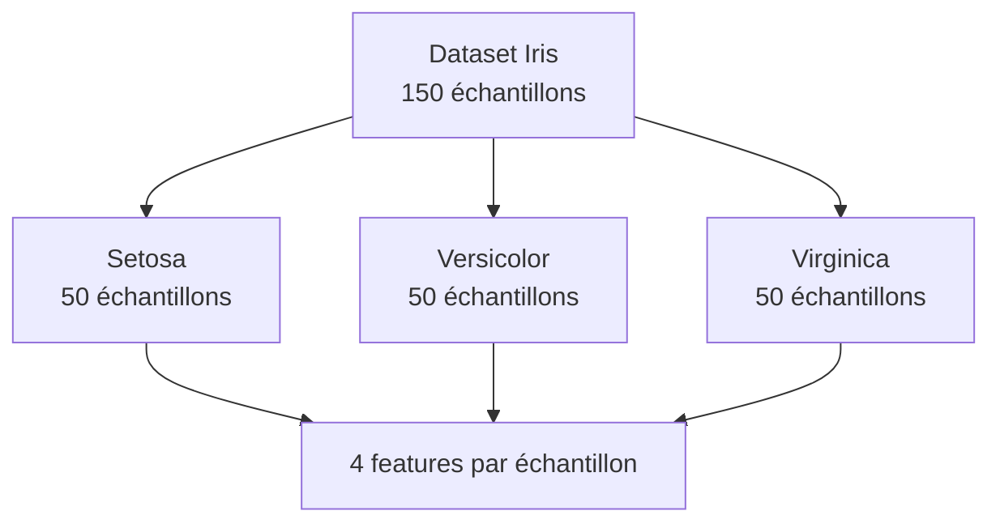
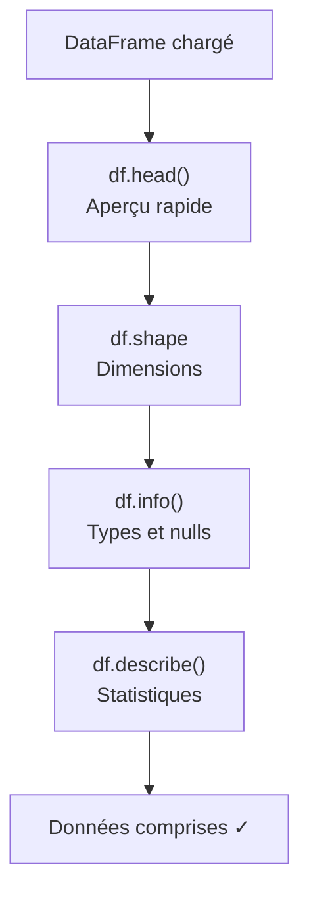
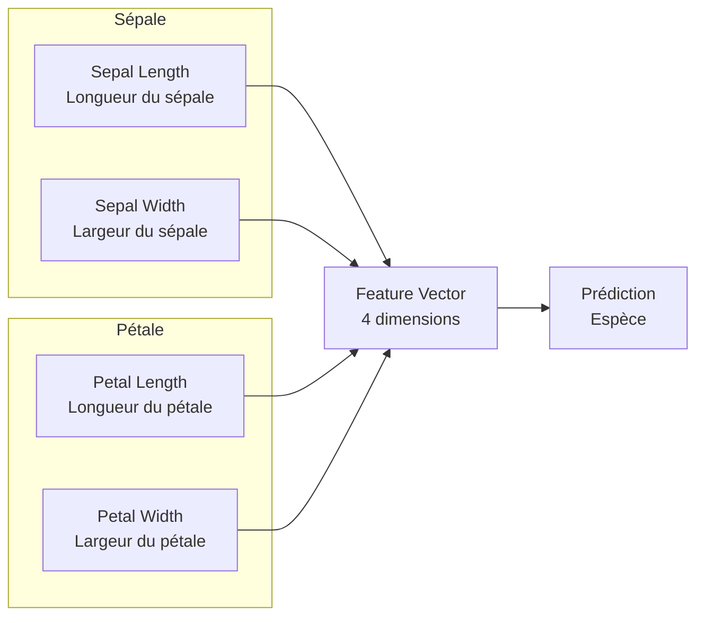
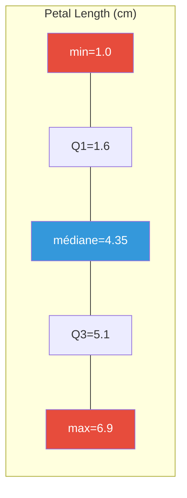
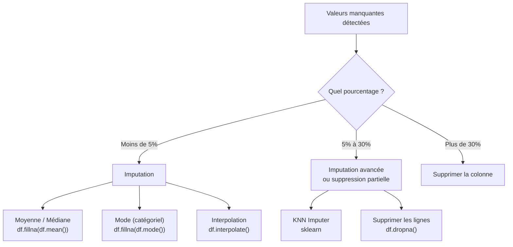
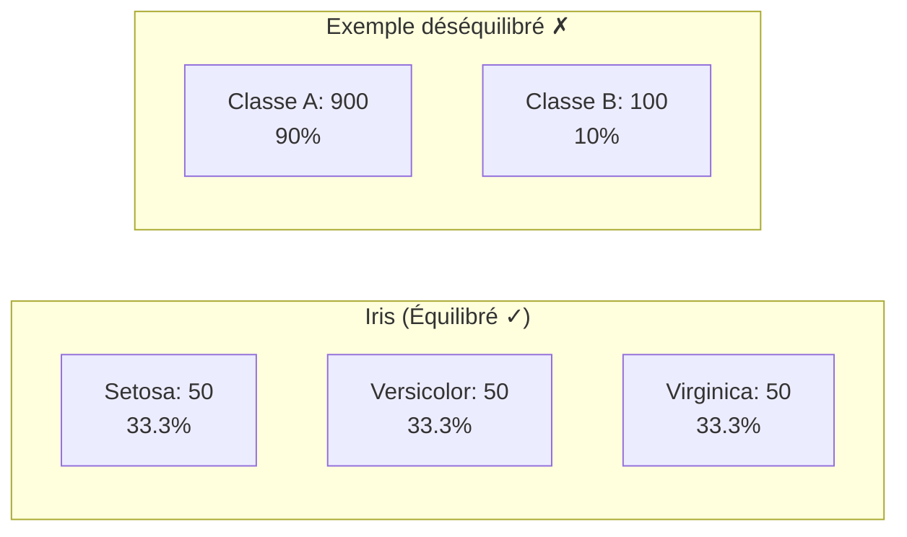
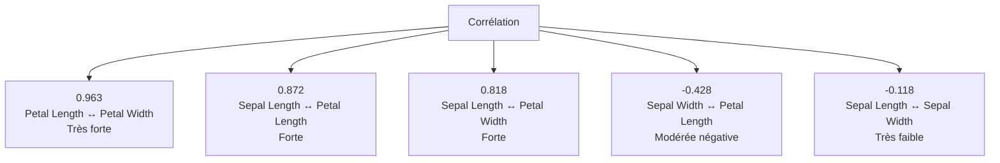
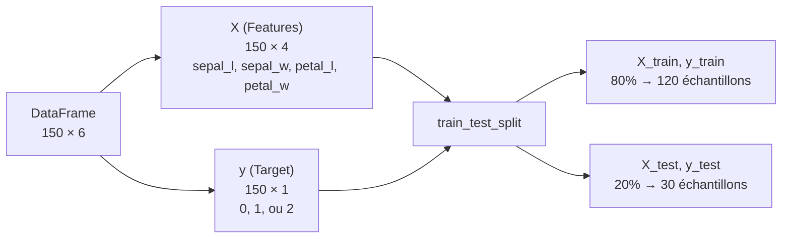
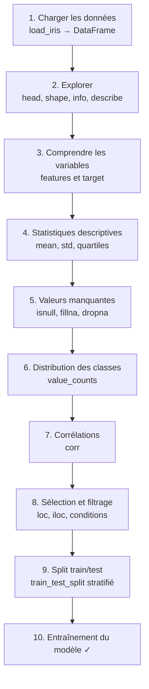

<a id="top"></a>

# 02 - Exploration et Prétraitement du Dataset Iris avec Pandas et NumPy

> **Projet** : Iris ML Demo — Full Stack App (Streamlit + FastAPI + Jupyter)
>
> **Objectif** : Maîtriser l'exploration, l'analyse et la préparation des données avec Pandas et NumPy à travers le dataset Iris.

---

## Table des matières

| N°  | Section                                      | Lien                        |
|-----|----------------------------------------------|-----------------------------|
| 1   | Introduction à Pandas et NumPy               | [Voir](#section-1)          |
| 2   | Charger le dataset Iris                       | [Voir](#section-2)          |
| 3   | Explorer les données                          | [Voir](#section-3)          |
| 4   | Comprendre les features et le target          | [Voir](#section-4)          |
| 5   | Statistiques descriptives                     | [Voir](#section-5)          |
| 6   | Vérifier les valeurs manquantes               | [Voir](#section-6)          |
| 7   | Distribution par classe                       | [Voir](#section-7)          |
| 8   | Corrélations entre features                   | [Voir](#section-8)          |
| 9   | Sélection et filtrage avec Pandas             | [Voir](#section-9)          |
| 10  | Préparation pour l'entraînement               | [Voir](#section-10)         |
| 11  | Résumé et bonnes pratiques                    | [Voir](#section-11)         |

---

<a id="section-1"></a>

<details>
<summary><strong>1 - Introduction à Pandas et NumPy</strong></summary>

### Qu'est-ce que NumPy ?

**NumPy** (Numerical Python) est la bibliothèque fondamentale pour le calcul scientifique en Python. Elle fournit un objet tableau multidimensionnel performant (`ndarray`) et des outils mathématiques optimisés.

```python
import numpy as np

# Créer un tableau NumPy
arr = np.array([1, 2, 3, 4, 5])
print(arr.mean())   # 3.0
print(arr.std())    # 1.4142135623730951
```

### Qu'est-ce que Pandas ?

**Pandas** est une bibliothèque construite au-dessus de NumPy qui offre des structures de données tabulaires (`DataFrame`, `Series`) idéales pour manipuler et analyser des données structurées.

```python
import pandas as pd

# Créer un DataFrame simple
data = {'nom': ['Alice', 'Bob'], 'age': [25, 30]}
df = pd.DataFrame(data)
print(df)
```

| Sortie :             |
|----------------------|
| `  nom  age`         |
| `0  Alice   25`      |
| `1    Bob   30`      |

### Pourquoi sont-ils essentiels en Data Science ?



| Bibliothèque | Rôle principal                          | Structure clé        |
|---------------|-----------------------------------------|----------------------|
| **NumPy**     | Calcul numérique haute performance      | `ndarray`            |
| **Pandas**    | Manipulation et analyse de données      | `DataFrame`, `Series`|
| **scikit-learn** | Algorithmes de Machine Learning      | Estimateurs          |

> **En résumé** : NumPy gère les calculs numériques bruts, Pandas structure et manipule les données tabulaires, et scikit-learn construit les modèles. Les trois forment le socle de tout projet de Data Science en Python.

### Installation

Dans notre projet, toutes les dépendances sont déjà dans `requirements.txt` :

```bash
# Activer l'environnement virtuel puis :
pip install -r requirements.txt
```

Les imports standards que nous utiliserons tout au long de ce cours :

```python
import numpy as np
import pandas as pd
from sklearn.datasets import load_iris
```

</details>

<p align="right"><a href="#top">↑ Retour en haut</a></p>

---

<a id="section-2"></a>

<details>
<summary><strong>2 - Charger le dataset Iris</strong></summary>

### Le dataset Iris

Le dataset Iris est l'un des jeux de données les plus célèbres en Machine Learning. Créé par le biologiste Ronald Fisher en 1936, il contient 150 échantillons de fleurs d'iris répartis en 3 espèces.



### Charger avec scikit-learn

```python
from sklearn.datasets import load_iris
import pandas as pd

# Charger le dataset
iris = load_iris()

# Examiner ce que retourne load_iris()
print(type(iris))          # <class 'sklearn.utils._bunch.Bunch'>
print(iris.keys())         # dict_keys(['data', 'target', 'frame', 'target_names', ...])
```

L'objet retourné est un `Bunch` (similaire à un dictionnaire) contenant :

| Attribut            | Type              | Description                                  |
|---------------------|-------------------|----------------------------------------------|
| `iris.data`         | `ndarray (150,4)` | Les 4 features pour chaque échantillon       |
| `iris.target`       | `ndarray (150,)`  | L'étiquette de classe (0, 1 ou 2)            |
| `iris.feature_names`| `list`            | Noms des 4 colonnes de features              |
| `iris.target_names` | `ndarray`         | Noms des 3 espèces                           |
| `iris.DESCR`        | `str`             | Description complète du dataset              |

### Convertir en DataFrame Pandas

```python
# Créer le DataFrame avec les features
df = pd.DataFrame(data=iris.data, columns=iris.feature_names)

# Ajouter la colonne target (numérique)
df['target'] = iris.target

# Ajouter le nom de l'espèce (lisible)
df['species'] = df['target'].map({
    0: 'setosa',
    1: 'versicolor',
    2: 'virginica'
})

print(df.head())
```

**Sortie :**

```
   sepal length (cm)  sepal width (cm)  petal length (cm)  petal width (cm)  target species
0                5.1               3.5                1.4               0.2       0  setosa
1                4.9               3.0                1.4               0.2       0  setosa
2                4.7               3.2                1.3               0.2       0  setosa
3                4.6               3.1                1.5               0.2       0  setosa
4                5.0               3.6                1.4               0.2       0  setosa
```

> **Astuce** : On garde à la fois le `target` numérique (pour les algorithmes ML) et le `species` en texte (pour la lisibilité).

</details>

<p align="right"><a href="#top">↑ Retour en haut</a></p>

---

<a id="section-3"></a>

<details>
<summary><strong>3 - Explorer les données</strong></summary>

Une fois le DataFrame créé, la première étape est toujours d'explorer les données pour comprendre leur structure, leur taille et leur contenu.

### 3.1 — `df.head()` et `df.tail()`

```python
# Les 5 premières lignes (par défaut)
df.head()

# Les 3 dernières lignes
df.tail(3)
```

`head()` et `tail()` permettent de vérifier rapidement que les données ont été chargées correctement.

### 3.2 — `df.shape`

```python
print(df.shape)  # (150, 6)
```

| Dimension | Valeur | Signification                                    |
|-----------|--------|--------------------------------------------------|
| Lignes    | 150    | Nombre d'échantillons (observations)             |
| Colonnes  | 6      | 4 features + target + species                    |

### 3.3 — `df.info()`

```python
df.info()
```

**Sortie :**

```
<class 'pandas.core.frame.DataFrame'>
RangeIndex: 150 entries, 0 to 149
Data columns (total 6 columns):
 #   Column             Non-Null Count  Dtype  
---  ------             --------------  -----  
 0   sepal length (cm)  150 non-null    float64
 1   sepal width (cm)   150 non-null    float64
 2   petal length (cm)  150 non-null    float64
 3   petal width (cm)   150 non-null    float64
 4   target             150 non-null    int64  
 5   species            150 non-null    object 
dtypes: float64(4), int64(1), object(1)
memory usage: 7.2+ KB
```

**Ce que `info()` nous apprend :**

- Le type d'index (`RangeIndex` → index numérique simple de 0 à 149)
- Le nombre de valeurs non-nulles par colonne (ici 150 partout → aucune valeur manquante)
- Le type de données de chaque colonne (`float64`, `int64`, `object`)
- La mémoire utilisée (~7.2 KB)

### 3.4 — `df.describe()`

```python
df.describe()
```

**Sortie :**

```
       sepal length (cm)  sepal width (cm)  petal length (cm)  petal width (cm)      target
count         150.000000        150.000000         150.000000        150.000000  150.000000
mean            5.843333          3.057333           3.758000          1.199333    1.000000
std             0.828066          0.435866           1.765298          0.762238    0.819232
min             4.300000          2.000000           1.000000          0.100000    0.000000
25%             5.100000          2.800000           1.600000          0.300000    0.000000
50%             5.800000          3.000000           4.350000          1.300000    1.000000
75%             6.400000          3.300000           5.100000          1.800000    2.000000
max             7.900000          4.400000           6.900000          2.500000    2.000000
```

> **`describe()`** génère automatiquement les statistiques descriptives pour toutes les colonnes numériques. Nous détaillerons chaque statistique dans la section 5.

### 3.5 — `df.dtypes` et `df.columns`

```python
# Types de chaque colonne
print(df.dtypes)

# Noms des colonnes
print(df.columns.tolist())
# ['sepal length (cm)', 'sepal width (cm)', 'petal length (cm)', 'petal width (cm)', 'target', 'species']
```

### Résumé du workflow d'exploration



</details>

<p align="right"><a href="#top">↑ Retour en haut</a></p>

---

<a id="section-4"></a>

<details>
<summary><strong>4 - Comprendre les features et le target</strong></summary>

### Anatomie d'une fleur d'Iris

Le dataset mesure 4 caractéristiques physiques de chaque fleur :



> **Sépale** : partie extérieure de la fleur qui protège le bouton avant l'éclosion.
>
> **Pétale** : partie intérieure colorée de la fleur.

### Tableau détaillé des features

| Feature               | Nom français           | Unité | Min  | Max  | Moyenne | Description                                   |
|-----------------------|------------------------|-------|------|------|---------|-----------------------------------------------|
| `sepal length (cm)`   | Longueur du sépale     | cm    | 4.3  | 7.9  | 5.84    | Mesure de la longueur du sépale               |
| `sepal width (cm)`    | Largeur du sépale      | cm    | 2.0  | 4.4  | 3.06    | Mesure de la largeur du sépale                |
| `petal length (cm)`   | Longueur du pétale     | cm    | 1.0  | 6.9  | 3.76    | Mesure de la longueur du pétale               |
| `petal width (cm)`    | Largeur du pétale      | cm    | 0.1  | 2.5  | 1.20    | Mesure de la largeur du pétale                |

### Le target (variable cible)

La variable cible est l'**espèce** de la fleur, encodée en entier :

| Code | Espèce          | Nom latin           | Caractéristique distinctive                     |
|------|-----------------|---------------------|-------------------------------------------------|
| 0    | **Setosa**      | *Iris setosa*       | Petits pétales, facilement séparable            |
| 1    | **Versicolor**  | *Iris versicolor*   | Taille intermédiaire, chevauchement avec virginica |
| 2    | **Virginica**   | *Iris virginica*    | Grands pétales, la plus grande des trois        |

### Vérifier les noms dans le code

```python
print("Features :", iris.feature_names)
# ['sepal length (cm)', 'sepal width (cm)', 'petal length (cm)', 'petal width (cm)']

print("Classes :", iris.target_names)
# ['setosa' 'versicolor' 'virginica']

print("Nombre de features :", len(iris.feature_names))  # 4
print("Nombre de classes :", len(iris.target_names))     # 3
```

### Valeurs par espèce

```python
# Moyennes par espèce
print(df.groupby('species').mean(numeric_only=True))
```

**Sortie :**

```
            sepal length (cm)  sepal width (cm)  petal length (cm)  petal width (cm)  target
species                                                                                      
setosa                  5.006             3.428              1.462             0.246       0
versicolor              5.936             2.770              4.260             1.326       1
virginica               6.588             2.974              5.552             2.026       2
```

> **Observation clé** : Setosa se distingue nettement par ses petits pétales (1.46 cm de long en moyenne vs 4.26 et 5.55 pour les deux autres). C'est pourquoi setosa est facilement classifiable.

</details>

<p align="right"><a href="#top">↑ Retour en haut</a></p>

---

<a id="section-5"></a>

<details>
<summary><strong>5 - Statistiques descriptives</strong></summary>

### Rappel : `df.describe()`

```python
stats = df.describe()
print(stats)
```

### Comprendre chaque statistique

| Statistique | Formule / Explication                          | Ce qu'elle nous apprend                                    |
|-------------|------------------------------------------------|------------------------------------------------------------|
| **count**   | Nombre de valeurs non-nulles                   | Détecte les données manquantes                             |
| **mean**    | $\bar{x} = \frac{1}{n}\sum_{i=1}^{n} x_i$    | Tendance centrale des données                              |
| **std**     | $s = \sqrt{\frac{1}{n-1}\sum(x_i - \bar{x})^2}$ | Dispersion autour de la moyenne                         |
| **min**     | Plus petite valeur                             | Borne inférieure des données                               |
| **25%**     | 1er quartile (Q1)                              | 25% des valeurs sont en dessous                            |
| **50%**     | Médiane (Q2)                                   | Valeur centrale — robuste aux outliers                     |
| **75%**     | 3ème quartile (Q3)                             | 75% des valeurs sont en dessous                            |
| **max**     | Plus grande valeur                             | Borne supérieure des données                               |

### Interprétation pour le dataset Iris



**Observations importantes :**

| Feature            | Std   | Interprétation                                                   |
|--------------------|-------|------------------------------------------------------------------|
| `sepal length`     | 0.83  | Dispersion modérée                                               |
| `sepal width`      | 0.44  | Faible dispersion → les sépales ont des largeurs assez similaires|
| `petal length`     | 1.77  | **Forte dispersion** → grande variabilité entre espèces          |
| `petal width`      | 0.76  | Dispersion modérée à forte                                       |

> **Point clé** : La forte dispersion de `petal length` (std = 1.77) indique que cette feature varie beaucoup entre les espèces. C'est un bon indicateur que cette feature sera **discriminante** pour la classification.

### Calcul manuel avec NumPy

```python
import numpy as np

petal_length = df['petal length (cm)'].values

print(f"Moyenne  : {np.mean(petal_length):.4f}")      # 3.7580
print(f"Écart-type: {np.std(petal_length, ddof=1):.4f}")  # 1.7653
print(f"Médiane  : {np.median(petal_length):.4f}")     # 4.3500
print(f"Q1       : {np.percentile(petal_length, 25):.4f}") # 1.6000
print(f"Q3       : {np.percentile(petal_length, 75):.4f}") # 5.1000
print(f"IQR      : {np.percentile(petal_length, 75) - np.percentile(petal_length, 25):.4f}") # 3.5000
```

> **Note** : `ddof=1` utilise la correction de Bessel (division par n-1) pour l'écart-type échantillonnal, ce qui correspond au `std` de Pandas.

### L'Interquartile Range (IQR)

L'**IQR** = Q3 - Q1 mesure la dispersion des 50% centraux des données. Il est utile pour détecter les **outliers** :

```python
Q1 = df['sepal width (cm)'].quantile(0.25)
Q3 = df['sepal width (cm)'].quantile(0.75)
IQR = Q3 - Q1

borne_inf = Q1 - 1.5 * IQR
borne_sup = Q3 + 1.5 * IQR

outliers = df[(df['sepal width (cm)'] < borne_inf) | (df['sepal width (cm)'] > borne_sup)]
print(f"Nombre d'outliers potentiels : {len(outliers)}")
```

</details>

<p align="right"><a href="#top">↑ Retour en haut</a></p>

---

<a id="section-6"></a>

<details>
<summary><strong>6 - Vérifier les valeurs manquantes</strong></summary>

### Pourquoi vérifier les valeurs manquantes ?

Les valeurs manquantes (`NaN` — Not a Number) sont l'un des problèmes les plus courants en Data Science. Elles peuvent :

- **Fausser les statistiques** (moyennes biaisées)
- **Faire planter les algorithmes ML** (la plupart ne tolèrent pas les NaN)
- **Réduire la taille effective** du dataset si on supprime les lignes incomplètes

### Vérification avec Pandas

```python
# Nombre de valeurs manquantes par colonne
print(df.isnull().sum())
```

**Sortie :**

```
sepal length (cm)    0
sepal width (cm)     0
petal length (cm)    0
petal width (cm)     0
target               0
species              0
dtype: int64
```

> **Résultat** : Le dataset Iris n'a **aucune valeur manquante**. C'est un dataset propre et complet, ce qui est rare dans la pratique.

### Vérification complémentaire

```python
# Nombre total de NaN dans tout le DataFrame
print(f"Total NaN : {df.isnull().sum().sum()}")  # 0

# Pourcentage de valeurs manquantes par colonne
print((df.isnull().sum() / len(df) * 100).round(2))

# Vérification booléenne rapide
print(f"Le dataset contient-il des NaN ? {df.isnull().any().any()}")  # False
```

### Que faire si des valeurs sont manquantes ?

Dans un projet réel, voici les stratégies courantes :



**Exemples de code pour chaque stratégie :**

```python
# Stratégie 1 : Remplir par la moyenne
df_filled = df.fillna(df.mean(numeric_only=True))

# Stratégie 2 : Remplir par la médiane (robuste aux outliers)
df_filled = df.fillna(df.median(numeric_only=True))

# Stratégie 3 : Supprimer les lignes avec des NaN
df_clean = df.dropna()

# Stratégie 4 : Imputation avancée avec KNN
from sklearn.impute import KNNImputer
imputer = KNNImputer(n_neighbors=5)
df_imputed = pd.DataFrame(imputer.fit_transform(df[numeric_cols]), columns=numeric_cols)
```

> **Bonne pratique** : Toujours vérifier les valeurs manquantes **avant** toute analyse ou entraînement de modèle. Même si le dataset semble propre, cette vérification doit devenir un réflexe.

</details>

<p align="right"><a href="#top">↑ Retour en haut</a></p>

---

<a id="section-7"></a>

<details>
<summary><strong>7 - Distribution par classe</strong></summary>

### Compter les échantillons par classe

```python
print(df['species'].value_counts())
```

**Sortie :**

```
setosa        50
versicolor    50
virginica     50
Name: species, dtype: int64
```

### Dataset équilibré vs déséquilibré



| Caractéristique        | Dataset équilibré           | Dataset déséquilibré                |
|------------------------|-----------------------------|-------------------------------------|
| Distribution           | Classes à proportions égales| Une classe domine les autres        |
| Accuracy fiable ?      | Oui                         | Non (métrique trompeuse)            |
| Exemple                | Iris (50/50/50)             | Détection de fraude (99% normal)    |
| Stratégie ML           | Standard                    | SMOTE, pondération, sous-échantillonnage |

### Vérification programmatique

```python
# Proportions
print(df['species'].value_counts(normalize=True))
```

**Sortie :**

```
setosa        0.333333
versicolor    0.333333
virginica     0.333333
Name: species, dtype: float64
```

```python
# Vérifier si le dataset est parfaitement équilibré
counts = df['species'].value_counts()
is_balanced = counts.nunique() == 1
print(f"Dataset parfaitement équilibré : {is_balanced}")  # True
```

### Pourquoi c'est important ?

Un dataset **déséquilibré** pose des problèmes majeurs :

1. **Biais du modèle** : le modèle prédit toujours la classe majoritaire
2. **Accuracy trompeuse** : 90% d'accuracy sur un dataset 90/10 → le modèle ne fait rien d'utile
3. **Métriques à utiliser** : précision, rappel, F1-score plutôt qu'accuracy seule

> **Bonne nouvelle** : Le dataset Iris est **parfaitement équilibré** (50 échantillons par classe, soit 33.3% chacune). Nous n'avons pas besoin de techniques de rééquilibrage.

### Vérification avec `target` numérique

```python
print(df['target'].value_counts().sort_index())
```

**Sortie :**

```
0    50
1    50
2    50
Name: target, dtype: int64
```

</details>

<p align="right"><a href="#top">↑ Retour en haut</a></p>

---

<a id="section-8"></a>

<details>
<summary><strong>8 - Corrélations entre features</strong></summary>

### Matrice de corrélation

La **corrélation** mesure la relation linéaire entre deux variables. Elle varie de **-1** (corrélation négative parfaite) à **+1** (corrélation positive parfaite).

```python
# Sélectionner uniquement les colonnes numériques des features
feature_cols = ['sepal length (cm)', 'sepal width (cm)', 'petal length (cm)', 'petal width (cm)']
correlation_matrix = df[feature_cols].corr()
print(correlation_matrix.round(3))
```

**Sortie :**

```
                   sepal length  sepal width  petal length  petal width
sepal length (cm)        1.000       -0.118         0.872        0.818
sepal width (cm)        -0.118        1.000        -0.428       -0.366
petal length (cm)        0.872       -0.428         1.000        0.963
petal width (cm)         0.818       -0.366         0.963        1.000
```

### Interprétation des corrélations



| Paire de features                         | Corrélation | Interprétation                                                 |
|-------------------------------------------|-------------|----------------------------------------------------------------|
| Petal Length ↔ Petal Width                 | **0.963**   | Quasi-parfaite : les grands pétales sont aussi les plus larges |
| Sepal Length ↔ Petal Length                | **0.872**   | Forte : les longs sépales accompagnent les longs pétales       |
| Sepal Length ↔ Petal Width                 | **0.818**   | Forte : cohérence de taille globale de la fleur                |
| Sepal Width ↔ Petal Length                 | **-0.428**  | Modérée négative : sépales larges → pétales plus courts        |
| Sepal Length ↔ Sepal Width                 | **-0.118**  | Très faible : quasi-indépendants                               |

### Échelle de corrélation

| Valeur absolue | Interprétation       |
|----------------|----------------------|
| 0.00 – 0.19    | Très faible          |
| 0.20 – 0.39    | Faible               |
| 0.40 – 0.59    | Modérée              |
| 0.60 – 0.79    | Forte                |
| 0.80 – 1.00    | Très forte           |

### Implications pour le Machine Learning

```python
# Identifier les paires fortement corrélées (> 0.8)
import numpy as np

corr = df[feature_cols].corr()
high_corr = []

for i in range(len(corr.columns)):
    for j in range(i + 1, len(corr.columns)):
        if abs(corr.iloc[i, j]) > 0.8:
            high_corr.append({
                'feature_1': corr.columns[i],
                'feature_2': corr.columns[j],
                'correlation': round(corr.iloc[i, j], 3)
            })

print(pd.DataFrame(high_corr))
```

**Sortie :**

```
           feature_1          feature_2  correlation
0  sepal length (cm)  petal length (cm)        0.872
1  sepal length (cm)   petal width (cm)        0.818
2  petal length (cm)   petal width (cm)        0.963
```

> **Point clé** : `petal length` et `petal width` sont très fortement corrélées (0.963). Dans certains cas, on pourrait envisager de supprimer l'une des deux pour réduire la redondance (réduction de dimensionnalité). Cependant, avec seulement 4 features, ce n'est pas nécessaire ici.

</details>

<p align="right"><a href="#top">↑ Retour en haut</a></p>

---

<a id="section-9"></a>

<details>
<summary><strong>9 - Sélection et filtrage avec Pandas</strong></summary>

### 9.1 — Filtrer par condition

```python
# Tous les échantillons de l'espèce Setosa
setosa = df[df['species'] == 'setosa']
print(f"Nombre de Setosa : {len(setosa)}")  # 50
print(setosa.head())
```

```python
# Filtres multiples : Versicolor avec petal length > 4.5
result = df[(df['species'] == 'versicolor') & (df['petal length (cm)'] > 4.5)]
print(f"Versicolor avec grands pétales : {len(result)}")
```

```python
# Filtrer avec isin() pour plusieurs espèces
subset = df[df['species'].isin(['setosa', 'virginica'])]
print(f"Setosa + Virginica : {len(subset)}")  # 100
```

### 9.2 — `loc` : sélection par étiquettes

`loc` utilise les **noms de lignes (index)** et les **noms de colonnes** :

```python
# Ligne 0, colonne 'species'
print(df.loc[0, 'species'])  # 'setosa'

# Lignes 0 à 4, colonnes spécifiques
print(df.loc[0:4, ['sepal length (cm)', 'species']])

# Toutes les lignes, certaines colonnes
print(df.loc[:, 'sepal length (cm)':'petal width (cm)'].head())
```

### 9.3 — `iloc` : sélection par position

`iloc` utilise les **indices numériques** (comme un tableau) :

```python
# Première ligne, première colonne
print(df.iloc[0, 0])  # 5.1

# Lignes 0 à 4, colonnes 0 à 3
print(df.iloc[0:5, 0:4])

# Dernière ligne
print(df.iloc[-1])
```

### Comparaison `loc` vs `iloc`

| Critère          | `loc`                      | `iloc`                        |
|------------------|----------------------------|-------------------------------|
| Indexation       | Par étiquettes (noms)      | Par position (entiers)        |
| Bornes incluses  | Oui (début ET fin)         | Non (fin exclue)              |
| Usage typique    | Colonnes par nom           | Découpage de tableau classique|
| Exemple          | `df.loc[0:4, 'species']`  | `df.iloc[0:5, -1]`           |

### 9.4 — Slicing

```python
# Les 10 premiers échantillons
print(df[:10])

# De l'index 50 à 59 (versicolor)
print(df[50:60])

# Échantillons pairs
print(df[::2].head())
```

### 9.5 — Sélectionner des colonnes

```python
# Une seule colonne (retourne une Series)
sepal_length = df['sepal length (cm)']
print(type(sepal_length))  # <class 'pandas.core.series.Series'>

# Plusieurs colonnes (retourne un DataFrame)
features_df = df[['sepal length (cm)', 'petal length (cm)']]
print(type(features_df))   # <class 'pandas.core.frame.DataFrame'>
```

### 9.6 — Exemples pratiques combinés

```python
# Trouver les échantillons avec la plus grande longueur de sépale
top_sepal = df.nlargest(5, 'sepal length (cm)')
print(top_sepal[['sepal length (cm)', 'species']])

# Trouver les échantillons avec la plus petite largeur de pétale
small_petal = df.nsmallest(3, 'petal width (cm)')
print(small_petal[['petal width (cm)', 'species']])

# Compter par espèce après un filtre
big_flowers = df[df['petal length (cm)'] > 5.0]
print(big_flowers['species'].value_counts())
```

**Sortie du dernier exemple :**

```
virginica     41
versicolor     5
Name: species, dtype: int64
```

> **Observation** : 41 des 46 fleurs avec un pétale > 5 cm sont des Virginica. Cela confirme que `petal length` est une feature très discriminante.

</details>

<p align="right"><a href="#top">↑ Retour en haut</a></p>

---

<a id="section-10"></a>

<details>
<summary><strong>10 - Préparation pour l'entraînement</strong></summary>

### 10.1 — Séparer X (features) et y (target)

```python
# Features (variables indépendantes)
X = df[['sepal length (cm)', 'sepal width (cm)', 'petal length (cm)', 'petal width (cm)']]

# Target (variable à prédire)
y = df['target']

print(f"X shape : {X.shape}")  # (150, 4)
print(f"y shape : {y.shape}")  # (150,)
```



### 10.2 — `train_test_split`

```python
from sklearn.model_selection import train_test_split

X_train, X_test, y_train, y_test = train_test_split(
    X, y,
    test_size=0.2,       # 20% pour le test
    random_state=42,     # Reproductibilité
    stratify=y           # Préserve la distribution des classes
)

print(f"X_train : {X_train.shape}")  # (120, 4)
print(f"X_test  : {X_test.shape}")   # (30, 4)
print(f"y_train : {y_train.shape}")  # (120,)
print(f"y_test  : {y_test.shape}")   # (30,)
```

### 10.3 — Pourquoi ces paramètres ?

#### `test_size=0.2`

| Split       | Proportion | Échantillons | Rôle                                    |
|-------------|------------|--------------|------------------------------------------|
| **Train**   | 80%        | 120          | Le modèle apprend sur ces données        |
| **Test**    | 20%        | 30           | Évaluation sur des données jamais vues   |

> **Convention** : 80/20 est le split le plus courant. Pour de très petits datasets, on peut utiliser 70/30. Pour de très grands, 90/10 ou 95/5.

#### `random_state=42`

Le `random_state` fixe la graine du générateur aléatoire. Cela garantit que :
- Le split est **identique** à chaque exécution
- Les résultats sont **reproductibles** entre collègues
- La valeur 42 est une convention populaire (référence au *Guide du voyageur galactique*)

```python
# Sans random_state : résultats différents à chaque exécution
X_train1, _, _, _ = train_test_split(X, y, test_size=0.2)
X_train2, _, _, _ = train_test_split(X, y, test_size=0.2)
print(X_train1.iloc[0].equals(X_train2.iloc[0]))  # Probablement False

# Avec random_state : résultats identiques
X_train3, _, _, _ = train_test_split(X, y, test_size=0.2, random_state=42)
X_train4, _, _, _ = train_test_split(X, y, test_size=0.2, random_state=42)
print(X_train3.iloc[0].equals(X_train4.iloc[0]))  # True
```

#### `stratify=y`

Le paramètre `stratify` garantit que la **proportion des classes** est identique dans train et test :

```python
# Vérifier la distribution après le split stratifié
print("Distribution dans y_train :")
print(y_train.value_counts().sort_index())
# 0    40
# 1    40
# 2    40

print("\nDistribution dans y_test :")
print(y_test.value_counts().sort_index())
# 0    10
# 1    10
# 2    10
```

> **Sans stratify** : on pourrait par hasard avoir 0 échantillons de setosa dans le test, ce qui fausserait l'évaluation.

### 10.4 — Vérification finale avant entraînement

```python
# Checklist pré-entraînement
print("=== Vérification pré-entraînement ===")
print(f"1. Pas de NaN dans X_train : {not X_train.isnull().any().any()}")
print(f"2. Pas de NaN dans X_test  : {not X_test.isnull().any().any()}")
print(f"3. X et y ont le même nombre de lignes : {len(X_train) == len(y_train)}")
print(f"4. Toutes les classes présentes dans train : {sorted(y_train.unique()) == [0, 1, 2]}")
print(f"5. Toutes les classes présentes dans test  : {sorted(y_test.unique()) == [0, 1, 2]}")
print(f"6. Pas de fuite de données (indices disjoints) : {len(set(X_train.index) & set(X_test.index)) == 0}")
```

**Sortie attendue :**

```
=== Vérification pré-entraînement ===
1. Pas de NaN dans X_train : True
2. Pas de NaN dans X_test  : True
3. X et y ont le même nombre de lignes : True
4. Toutes les classes présentes dans train : True
5. Toutes les classes présentes dans test  : True
6. Pas de fuite de données (indices disjoints) : True
```

</details>

<p align="right"><a href="#top">↑ Retour en haut</a></p>

---

<a id="section-11"></a>

<details>
<summary><strong>11 - Résumé et bonnes pratiques</strong></summary>

### Workflow complet d'exploration de données



### Récapitulatif des commandes essentielles

| Objectif                        | Commande Pandas                              |
|---------------------------------|----------------------------------------------|
| Charger un CSV                  | `pd.read_csv('fichier.csv')`                 |
| Aperçu rapide                   | `df.head()`, `df.tail()`                     |
| Dimensions                      | `df.shape`                                   |
| Informations sur les types      | `df.info()`                                  |
| Statistiques descriptives       | `df.describe()`                              |
| Valeurs manquantes              | `df.isnull().sum()`                          |
| Distribution d'une colonne      | `df['col'].value_counts()`                   |
| Corrélations                    | `df.corr()`                                  |
| Filtrer par condition            | `df[df['col'] > valeur]`                     |
| Sélection par nom               | `df.loc[lignes, colonnes]`                   |
| Sélection par position           | `df.iloc[lignes, colonnes]`                  |
| Grouper et agréger              | `df.groupby('col').mean()`                   |
| Trier                           | `df.sort_values('col', ascending=False)`     |
| Supprimer une colonne           | `df.drop('col', axis=1)`                     |

### Bonnes pratiques

1. **Toujours explorer avant de modéliser** : `head()`, `info()`, `describe()` sont vos premiers réflexes
2. **Vérifier les valeurs manquantes** systématiquement avec `isnull().sum()`
3. **Vérifier l'équilibre des classes** avec `value_counts()` avant de choisir vos métriques
4. **Utiliser `stratify`** dans `train_test_split` pour les datasets de classification
5. **Fixer `random_state`** pour garantir la reproductibilité de vos expériences
6. **Examiner les corrélations** pour comprendre les relations entre variables
7. **Documenter chaque étape** dans un notebook Jupyter pour la traçabilité
8. **Ne jamais toucher aux données de test** pendant l'exploration et la préparation

### Prochaine étape

Ce dataset est maintenant prêt pour l'entraînement d'un modèle de classification. Dans notre projet, le notebook `notebook/train_model.ipynb` utilise un **Random Forest Classifier** pour entraîner le modèle qui est ensuite exposé via l'API FastAPI et consommé par l'interface Streamlit.

```python
from sklearn.ensemble import RandomForestClassifier

model = RandomForestClassifier(n_estimators=100, random_state=42)
model.fit(X_train, y_train)

accuracy = model.score(X_test, y_test)
print(f"Accuracy : {accuracy:.2%}")
```

</details>

<p align="right"><a href="#top">↑ Retour en haut</a></p>

---

> **Auteur** : Cours généré pour le projet *Iris ML Demo — Full Stack App*
>
> **Bibliothèques utilisées** : Pandas, NumPy, scikit-learn
>
> **Dataset** : Iris (150 échantillons, 4 features, 3 classes)
