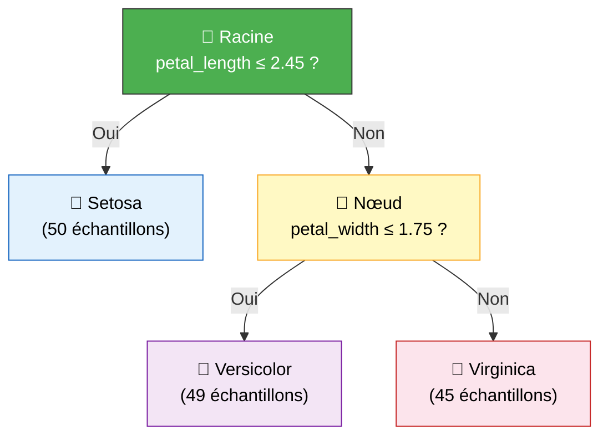
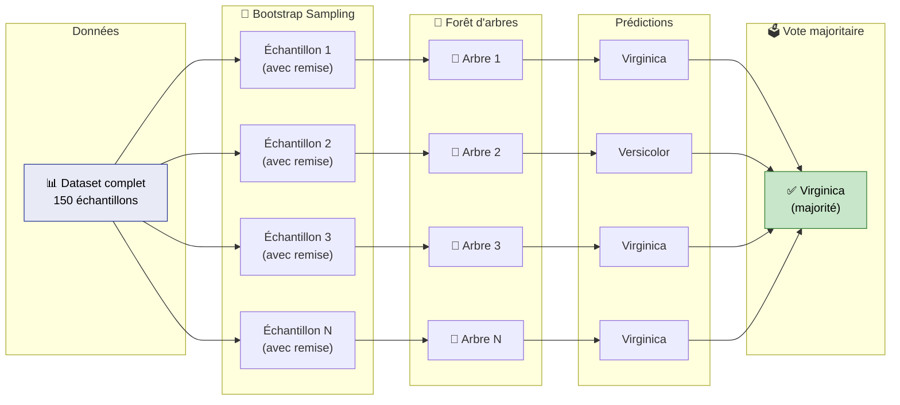
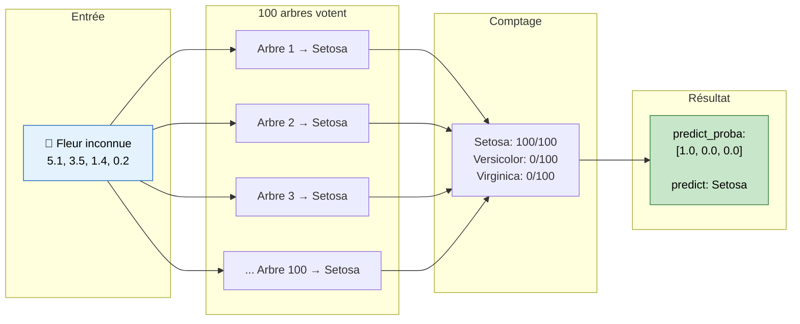
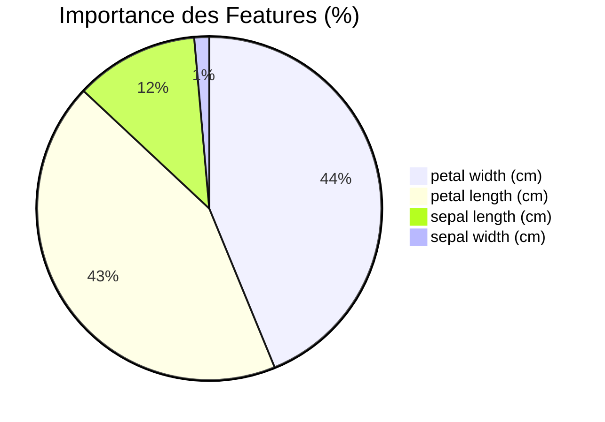
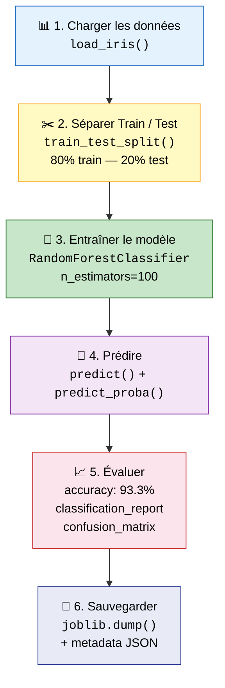

<a id="top"></a>

# 03 — Entraînement du Modèle Random Forest sur le Dataset Iris

> **Objectif** : Comprendre le fonctionnement d'un Random Forest, l'entraîner sur le jeu de données Iris, évaluer ses performances et sauvegarder le modèle pour une utilisation en production.

---

## Table des matières

| # | Section | Lien |
|---|---------|------|
| 1 | Qu'est-ce qu'un arbre de décision ? | [Aller →](#1--quest-ce-quun-arbre-de-décision-) |
| 2 | Du Decision Tree au Random Forest | [Aller →](#2--du-decision-tree-au-random-forest) |
| 3 | Les hyperparamètres du Random Forest | [Aller →](#3--les-hyperparamètres-du-random-forest) |
| 4 | Entraîner le modèle sur Iris | [Aller →](#4--entraîner-le-modèle-sur-iris) |
| 5 | Prédiction et `predict_proba` | [Aller →](#5--prédiction-et-predict_proba) |
| 6 | Évaluation du modèle | [Aller →](#6--évaluation-du-modèle) |
| 7 | Importance des features | [Aller →](#7--importance-des-features) |
| 8 | Sauvegarder le modèle avec joblib | [Aller →](#8--sauvegarder-le-modèle-avec-joblib) |
| 9 | Tester le modèle sauvegardé | [Aller →](#9--tester-le-modèle-sauvegardé) |
| 10 | Comparaison avec d'autres algorithmes | [Aller →](#10--comparaison-avec-dautres-algorithmes) |
| 11 | Résumé du pipeline complet | [Aller →](#11--résumé-du-pipeline-complet) |

---

<a id="1--quest-ce-quun-arbre-de-décision-"></a>

<details>
<summary><strong>1 — Qu'est-ce qu'un arbre de décision ?</strong></summary>

### Principe fondamental

Un **arbre de décision** (Decision Tree) est un algorithme de Machine Learning supervisé qui fonctionne par **divisions successives** des données. À chaque nœud, il pose une question sur une feature et sépare les données en deux branches selon la réponse.

### Analogie simple

Imaginez un jeu de devinettes :
- « La longueur du pétale est-elle > 2.45 cm ? »
  - **Oui** → « La largeur du pétale est-elle > 1.75 cm ? »
    - **Oui** → **Virginica**
    - **Non** → **Versicolor**
  - **Non** → **Setosa**

### Diagramme d'un arbre de décision



### Critères de séparation

| Critère | Formule | Utilisation |
|---------|---------|-------------|
| **Gini** | $Gini = 1 - \sum_{i=1}^{C} p_i^2$ | Classification (par défaut dans scikit-learn) |
| **Entropie** | $H = -\sum_{i=1}^{C} p_i \log_2(p_i)$ | Classification |
| **MSE** | $MSE = \frac{1}{n}\sum_{i=1}^{n}(y_i - \bar{y})^2$ | Régression |

### Avantages et limites

| ✅ Avantages | ❌ Limites |
|-------------|-----------|
| Facile à interpréter | Tendance au **surapprentissage** (overfitting) |
| Pas besoin de normalisation | Sensible aux petites variations des données |
| Gère les features catégorielles | Instable — un petit changement peut modifier tout l'arbre |
| Rapide à entraîner | Performances souvent inférieures aux ensembles |

> 💡 **Point clé** : C'est justement pour corriger les faiblesses de l'arbre unique que le **Random Forest** a été inventé.

</details>

<p align="right"><a href="#top">↑ Retour en haut</a></p>

---

<a id="2--du-decision-tree-au-random-forest"></a>

<details>
<summary><strong>2 — Du Decision Tree au Random Forest</strong></summary>

### L'idée centrale : la sagesse de la foule

Un seul arbre peut se tromper facilement. Mais si on entraîne **100 arbres différents** et qu'on les fait voter, le résultat collectif est bien plus robuste. C'est le principe du **Random Forest**.

### Les deux ingrédients clés

#### 1. Bagging (Bootstrap Aggregating)

Chaque arbre est entraîné sur un **sous-ensemble aléatoire** des données (tirage avec remise). Ainsi, chaque arbre voit une version légèrement différente du dataset.

#### 2. Sous-échantillonnage des features

À chaque nœud de division, l'arbre ne considère qu'un **sous-ensemble aléatoire de features** (par défaut $\sqrt{n_{features}}$). Cela force les arbres à être différents les uns des autres.

### Processus complet



### Decision Tree vs Random Forest

| Aspect | Decision Tree | Random Forest |
|--------|---------------|---------------|
| Nombre d'arbres | 1 | N (ex. 100) |
| Données d'entraînement | Tout le dataset | Sous-échantillons bootstrap |
| Features par nœud | Toutes | Sous-ensemble aléatoire |
| Variance | Élevée | Faible |
| Overfitting | Fréquent | Rare |
| Interprétabilité | Très élevée | Modérée |
| Précision | Bonne | Très bonne |

### Pourquoi ça marche ?

Le Random Forest réduit la **variance** sans augmenter significativement le **biais**. Chaque arbre individuel peut faire des erreurs, mais les erreurs sont **décorrélées** grâce au double échantillonnage (données + features). Le vote majoritaire élimine les erreurs individuelles.

> 🎯 **Formule intuitive** : Random Forest = Bagging + Sous-échantillonnage des features + Vote majoritaire

</details>

<p align="right"><a href="#top">↑ Retour en haut</a></p>

---

<a id="3--les-hyperparamètres-du-random-forest"></a>

<details>
<summary><strong>3 — Les hyperparamètres du Random Forest</strong></summary>

### Paramètres principaux

| Paramètre | Valeur par défaut | Description | Impact |
|-----------|-------------------|-------------|--------|
| `n_estimators` | `100` | Nombre d'arbres dans la forêt | Plus d'arbres → meilleure précision mais plus lent |
| `max_depth` | `None` (illimité) | Profondeur maximale de chaque arbre | Limiter = régulariser = réduire l'overfitting |
| `random_state` | `None` | Graine aléatoire pour la reproductibilité | Fixer pour obtenir des résultats reproductibles |
| `max_features` | `"sqrt"` | Nombre de features à considérer par split | `"sqrt"` pour classification, `"log2"` ou `1.0` possible |
| `min_samples_split` | `2` | Nombre minimum d'échantillons pour diviser un nœud | Augmenter = régulariser |
| `min_samples_leaf` | `1` | Nombre minimum d'échantillons dans une feuille | Augmenter = feuilles plus générales |
| `bootstrap` | `True` | Utiliser le bootstrap sampling | `False` = chaque arbre voit tout le dataset |
| `criterion` | `"gini"` | Fonction de mesure de qualité du split | `"gini"` ou `"entropy"` |

### Les trois paramètres essentiels

```python
from sklearn.ensemble import RandomForestClassifier

model = RandomForestClassifier(
    n_estimators=100,   # 100 arbres dans la forêt
    max_depth=None,     # aucune limite de profondeur
    random_state=42     # résultat reproductible
)
```

#### `n_estimators` — Nombre d'arbres

| Valeur | Précision (Iris) | Temps d'entraînement |
|--------|-------------------|----------------------|
| 10 | ~93% | Très rapide |
| 50 | ~95% | Rapide |
| **100** | **~96%** | **Modéré** |
| 500 | ~96.5% | Lent |
| 1000 | ~96.5% | Très lent |

> 📝 Au-delà de 100 arbres, le gain de précision est marginal sur Iris.

#### `max_depth` — Profondeur maximale

| Valeur | Comportement |
|--------|-------------|
| `None` | L'arbre pousse jusqu'à ce que toutes les feuilles soient pures |
| `3` | Arbre limité à 3 niveaux — plus généralisable |
| `5` | Bon compromis pour la plupart des datasets |
| `10+` | Proche de `None` pour les petits datasets |

#### `random_state` — Reproductibilité

```python
# Sans random_state : résultats différents à chaque exécution
model_a = RandomForestClassifier(n_estimators=100)  # accuracy = 0.933
model_b = RandomForestClassifier(n_estimators=100)  # accuracy = 0.956 (différent !)

# Avec random_state : résultats identiques
model_c = RandomForestClassifier(n_estimators=100, random_state=42)  # toujours 0.933
model_d = RandomForestClassifier(n_estimators=100, random_state=42)  # toujours 0.933
```

> ⚠️ **Bonne pratique** : Toujours fixer `random_state=42` pendant le développement pour la reproductibilité.

</details>

<p align="right"><a href="#top">↑ Retour en haut</a></p>

---

<a id="4--entraîner-le-modèle-sur-iris"></a>

<details>
<summary><strong>4 — Entraîner le modèle sur Iris</strong></summary>

### Pipeline complet d'entraînement

```python
# ============================================================
# Entraînement d'un Random Forest sur le dataset Iris
# ============================================================

# 1. Imports
from sklearn.datasets import load_iris
from sklearn.model_selection import train_test_split
from sklearn.ensemble import RandomForestClassifier
from sklearn.metrics import accuracy_score
import pandas as pd

# 2. Chargement du dataset
iris = load_iris()
X = iris.data            # (150, 4) — les 4 features
y = iris.target          # (150,)   — les 3 classes (0, 1, 2)

print(f"Features : {iris.feature_names}")
print(f"Classes  : {iris.target_names}")
print(f"Shape X  : {X.shape}")
print(f"Shape y  : {y.shape}")

# 3. Séparation train / test (80% / 20%)
X_train, X_test, y_train, y_test = train_test_split(
    X, y,
    test_size=0.2,
    random_state=42
)

print(f"\nTrain : {X_train.shape[0]} échantillons")
print(f"Test  : {X_test.shape[0]} échantillons")

# 4. Création et entraînement du modèle
model = RandomForestClassifier(
    n_estimators=100,
    max_depth=None,
    random_state=42
)

model.fit(X_train, y_train)
print("\n✅ Modèle entraîné avec succès !")

# 5. Évaluation rapide
y_pred = model.predict(X_test)
accuracy = accuracy_score(y_test, y_pred)
print(f"Accuracy sur le test set : {accuracy:.4f}")
```

### Sortie attendue

```
Features : ['sepal length (cm)', 'sepal width (cm)', 'petal length (cm)', 'petal width (cm)']
Classes  : ['setosa' 'versicolor' 'virginica']
Shape X  : (150, 4)
Shape y  : (150, 1)

Train : 120 échantillons
Test  : 30 échantillons

✅ Modèle entraîné avec succès !
Accuracy sur le test set : 0.9333
```

### Visualisation des données d'entraînement

```python
import pandas as pd

df = pd.DataFrame(X_train, columns=iris.feature_names)
df['species'] = [iris.target_names[i] for i in y_train]

print(df.head(10))
print(f"\nDistribution des classes :")
print(df['species'].value_counts())
```

| | sepal length | sepal width | petal length | petal width | species |
|---|---|---|---|---|---|
| 0 | 6.1 | 2.8 | 4.7 | 1.2 | versicolor |
| 1 | 5.7 | 3.8 | 1.7 | 0.3 | setosa |
| 2 | 7.7 | 2.6 | 6.9 | 2.3 | virginica |
| 3 | 6.0 | 2.9 | 4.5 | 1.5 | versicolor |
| 4 | 6.8 | 2.8 | 4.8 | 1.4 | versicolor |

> 🔑 **Point clé** : Avec `random_state=42` dans `train_test_split`, on obtient toujours le même découpage, ce qui rend l'expérience reproductible.

</details>

<p align="right"><a href="#top">↑ Retour en haut</a></p>

---

<a id="5--prédiction-et-predict_proba"></a>

<details>
<summary><strong>5 — Prédiction et `predict_proba`</strong></summary>

### Deux méthodes de prédiction

| Méthode | Retour | Utilisation |
|---------|--------|-------------|
| `model.predict(X)` | Classe prédite (entier) | Obtenir directement la classe finale |
| `model.predict_proba(X)` | Probabilités par classe | Connaître la **confiance** du modèle |

### `predict` — La classe directe

```python
import numpy as np

sample = np.array([[5.1, 3.5, 1.4, 0.2]])  # mesures d'une fleur
prediction = model.predict(sample)

print(f"Classe prédite : {prediction[0]}")
print(f"Nom de l'espèce : {iris.target_names[prediction[0]]}")
```

```
Classe prédite : 0
Nom de l'espèce : setosa
```

### `predict_proba` — Les probabilités

```python
probas = model.predict_proba(sample)
print(f"Probabilités : {probas[0]}")

for i, name in enumerate(iris.target_names):
    print(f"  {name:12s} : {probas[0][i]*100:.1f}%")
```

```
Probabilités : [1.0  0.0  0.0]
  setosa       : 100.0%
  versicolor   :   0.0%
  virginica    :   0.0%
```

### Exemples avec différentes fleurs

```python
exemples = np.array([
    [5.1, 3.5, 1.4, 0.2],   # typiquement Setosa
    [6.2, 2.9, 4.3, 1.3],   # typiquement Versicolor
    [7.7, 3.0, 6.1, 2.3],   # typiquement Virginica
    [6.0, 2.7, 5.1, 1.6],   # cas ambigu (frontière Versicolor/Virginica)
])

predictions = model.predict(exemples)
probabilites = model.predict_proba(exemples)

for i, (pred, proba) in enumerate(zip(predictions, probabilites)):
    espece = iris.target_names[pred]
    confiance = proba[pred] * 100
    print(f"Fleur {i+1} → {espece:12s} (confiance : {confiance:.1f}%)")
    for j, name in enumerate(iris.target_names):
        bar = "█" * int(proba[j] * 40)
        print(f"    {name:12s} : {proba[j]*100:5.1f}% {bar}")
    print()
```

### Sortie attendue

```
Fleur 1 → setosa       (confiance : 100.0%)
    setosa       : 100.0% ████████████████████████████████████████
    versicolor   :   0.0%
    virginica    :   0.0%

Fleur 2 → versicolor   (confiance : 98.0%)
    setosa       :   0.0%
    versicolor   :  98.0% ███████████████████████████████████████
    virginica    :   2.0% █

Fleur 3 → virginica    (confiance : 99.0%)
    setosa       :   0.0%
    versicolor   :   1.0%
    virginica    :  99.0% ████████████████████████████████████████

Fleur 4 → virginica    (confiance : 52.0%)
    setosa       :   0.0%
    versicolor   :  48.0% ███████████████████
    virginica    :  52.0% █████████████████████
```

### Comment fonctionne `predict_proba` ?



> 🎯 **Quand utiliser `predict_proba` ?** Lorsque vous avez besoin de mesurer la **confiance** de la prédiction — par exemple, pour afficher un pourcentage dans une interface utilisateur ou pour rejeter les prédictions incertaines.

</details>

<p align="right"><a href="#top">↑ Retour en haut</a></p>

---

<a id="6--évaluation-du-modèle"></a>

<details>
<summary><strong>6 — Évaluation du modèle</strong></summary>

### Métriques d'évaluation

```python
from sklearn.metrics import (
    accuracy_score,
    classification_report,
    confusion_matrix
)

y_pred = model.predict(X_test)
```

### 1. Accuracy globale

```python
accuracy = accuracy_score(y_test, y_pred)
print(f"Accuracy : {accuracy:.4f} ({accuracy*100:.1f}%)")
```

```
Accuracy : 0.9333 (93.3%)
```

> 📝 **93.3%** signifie que le modèle a correctement classé **28 fleurs sur 30** dans le jeu de test.

### 2. Rapport de classification

```python
print(classification_report(
    y_test, y_pred,
    target_names=iris.target_names
))
```

```
              precision    recall  f1-score   support

      setosa       1.00      1.00      1.00        10
  versicolor       0.90      0.90      0.90         9
   virginica       0.91      0.91      0.91        11

    accuracy                           0.93        30
   macro avg       0.94      0.94      0.94        30
weighted avg       0.93      0.93      0.93        30
```

### Comprendre les métriques

| Métrique | Formule | Signification |
|----------|---------|---------------|
| **Precision** | $\frac{VP}{VP + FP}$ | Parmi les prédictions positives, combien sont correctes ? |
| **Recall** | $\frac{VP}{VP + FN}$ | Parmi les vrais positifs, combien ont été détectés ? |
| **F1-score** | $2 \times \frac{Precision \times Recall}{Precision + Recall}$ | Moyenne harmonique de precision et recall |
| **Support** | — | Nombre d'échantillons réels par classe |

### 3. Matrice de confusion

```python
cm = confusion_matrix(y_test, y_pred)
print("Matrice de confusion :")
print(cm)
```

```
Matrice de confusion :
[[10  0  0]
 [ 0  8  1]
 [ 0  1 10]]
```

### Lecture de la matrice

|  | Prédit Setosa | Prédit Versicolor | Prédit Virginica |
|---|:---:|:---:|:---:|
| **Réel Setosa** | **10** ✅ | 0 | 0 |
| **Réel Versicolor** | 0 | **8** ✅ | 1 ❌ |
| **Réel Virginica** | 0 | 1 ❌ | **10** ✅ |

**Analyse :**
- **Setosa** : 10/10 correctes — parfaitement identifiée (features très distinctes)
- **Versicolor** : 8/9 correctes — 1 confondue avec Virginica
- **Virginica** : 10/11 correctes — 1 confondue avec Versicolor

### Visualisation de la matrice de confusion

```python
import matplotlib.pyplot as plt
import seaborn as sns

plt.figure(figsize=(8, 6))
sns.heatmap(
    cm,
    annot=True,
    fmt='d',
    cmap='Blues',
    xticklabels=iris.target_names,
    yticklabels=iris.target_names
)
plt.xlabel('Prédiction')
plt.ylabel('Réalité')
plt.title('Matrice de Confusion — Random Forest sur Iris')
plt.tight_layout()
plt.savefig('confusion_matrix.png', dpi=150)
plt.show()
```

> 💡 **Observation** : Les erreurs se situent exclusivement entre Versicolor et Virginica, ce qui est attendu car ces deux espèces ont des caractéristiques proches (petal length et petal width similaires).

</details>

<p align="right"><a href="#top">↑ Retour en haut</a></p>

---

<a id="7--importance-des-features"></a>

<details>
<summary><strong>7 — Importance des features</strong></summary>

### Qu'est-ce que l'importance des features ?

Le Random Forest mesure la contribution de chaque feature à la précision globale du modèle. Plus une feature est utilisée fréquemment dans les divisions et plus elle réduit l'impureté (Gini), plus elle est considérée comme importante.

### Calcul de l'importance

```python
import pandas as pd

importances = model.feature_importances_

feature_importance = pd.DataFrame({
    'feature': iris.feature_names,
    'importance': importances,
    'importance_pct': importances * 100
}).sort_values('importance', ascending=False)

print(feature_importance.to_string(index=False))
```

### Résultats

| Feature | Importance | Pourcentage |
|---------|-----------|-------------|
| **petal width (cm)** | 0.438 | **43.8%** |
| **petal length (cm)** | 0.432 | **43.2%** |
| sepal length (cm) | 0.116 | 11.6% |
| sepal width (cm) | 0.014 | 1.4% |

### Visualisation

```python
import matplotlib.pyplot as plt

plt.figure(figsize=(10, 6))
colors = ['#2196F3', '#4CAF50', '#FF9800', '#F44336']

plt.barh(
    feature_importance['feature'],
    feature_importance['importance_pct'],
    color=colors
)

for i, (val, name) in enumerate(
    zip(feature_importance['importance_pct'], feature_importance['feature'])
):
    plt.text(val + 0.5, i, f'{val:.1f}%', va='center', fontweight='bold')

plt.xlabel('Importance (%)')
plt.title('Importance des Features — Random Forest sur Iris')
plt.tight_layout()
plt.savefig('feature_importance.png', dpi=150)
plt.show()
```

### Analyse des résultats



#### Les pétales dominent (~87%)

- **petal width** (43.8%) et **petal length** (43.2%) représentent ensemble **87%** de l'importance totale.
- Ces deux features suffisent presque à elles seules pour distinguer les 3 espèces.

#### Les sépales sont secondaires (~13%)

- **sepal length** (11.6%) apporte une contribution modeste.
- **sepal width** (1.4%) est quasiment non informative pour la classification.

### Implication pratique

Si on devait réduire le nombre de capteurs (par exemple pour un capteur embarqué), on pourrait ne garder que **petal width** et **petal length** et conserver ~95% de la précision.

> 🎯 **Règle d'or** : L'importance des features aide à comprendre **ce que le modèle a appris** et à décider quelles données collecter en priorité.

</details>

<p align="right"><a href="#top">↑ Retour en haut</a></p>

---

<a id="8--sauvegarder-le-modèle-avec-joblib"></a>

<details>
<summary><strong>8 — Sauvegarder le modèle avec joblib</strong></summary>

### Pourquoi sauvegarder ?

Entraîner un modèle prend du temps et des ressources. Une fois entraîné, on le **sérialise** sur disque pour pouvoir le réutiliser sans le ré-entraîner. C'est indispensable pour la mise en production.

### joblib vs pickle

| Aspect | `joblib` | `pickle` |
|--------|----------|----------|
| Optimisé pour NumPy | ✅ Oui | ❌ Non |
| Performance grandes matrices | Rapide | Lent |
| Taille du fichier | Plus petit | Plus grand |
| Standard scikit-learn | ✅ Recommandé | Alternative |

### Sauvegarder le modèle

```python
import joblib
import json
from datetime import datetime

model_path = "models/iris_random_forest.joblib"
metadata_path = "models/model_metadata.json"

# Sauvegarder le modèle
joblib.dump(model, model_path)
print(f"✅ Modèle sauvegardé : {model_path}")

# Sauvegarder les métadonnées
metadata = {
    "model_name": "Random Forest Classifier",
    "dataset": "Iris",
    "accuracy": float(accuracy_score(y_test, y_pred)),
    "n_estimators": 100,
    "max_depth": None,
    "random_state": 42,
    "features": iris.feature_names.tolist(),
    "target_names": iris.target_names.tolist(),
    "n_train_samples": len(X_train),
    "n_test_samples": len(X_test),
    "created_at": datetime.now().isoformat()
}

with open(metadata_path, "w") as f:
    json.dump(metadata, f, indent=2, ensure_ascii=False)

print(f"✅ Métadonnées sauvegardées : {metadata_path}")
```

### Structure des fichiers sauvegardés

```
models/
├── iris_random_forest.joblib    # Le modèle sérialisé (~100 KB)
└── model_metadata.json          # Les métadonnées
```

### Contenu du fichier `model_metadata.json`

```json
{
  "model_name": "Random Forest Classifier",
  "dataset": "Iris",
  "accuracy": 0.9333,
  "n_estimators": 100,
  "max_depth": null,
  "random_state": 42,
  "features": [
    "sepal length (cm)",
    "sepal width (cm)",
    "petal length (cm)",
    "petal width (cm)"
  ],
  "target_names": ["setosa", "versicolor", "virginica"],
  "n_train_samples": 120,
  "n_test_samples": 30,
  "created_at": "2025-07-06T14:30:00.000000"
}
```

### Charger le modèle sauvegardé

```python
import joblib
import json

loaded_model = joblib.load("models/iris_random_forest.joblib")

with open("models/model_metadata.json", "r") as f:
    loaded_metadata = json.load(f)

print(f"Modèle chargé : {loaded_metadata['model_name']}")
print(f"Accuracy enregistrée : {loaded_metadata['accuracy']:.4f}")
print(f"Date de création : {loaded_metadata['created_at']}")
```

> ⚠️ **Sécurité** : Ne chargez jamais un fichier `.joblib` provenant d'une source non fiable. La désérialisation peut exécuter du code arbitraire.

</details>

<p align="right"><a href="#top">↑ Retour en haut</a></p>

---

<a id="9--tester-le-modèle-sauvegardé"></a>

<details>
<summary><strong>9 — Tester le modèle sauvegardé</strong></summary>

### Script complet de test

Ce script charge le modèle depuis le disque et effectue des prédictions sans avoir besoin de ré-entraîner.

```python
# ============================================================
# test_model.py — Tester le modèle Random Forest sauvegardé
# ============================================================

import joblib
import json
import numpy as np

# 1. Charger le modèle et les métadonnées
model = joblib.load("models/iris_random_forest.joblib")

with open("models/model_metadata.json", "r") as f:
    metadata = json.load(f)

print("=" * 50)
print("  TEST DU MODÈLE SAUVEGARDÉ")
print("=" * 50)
print(f"Modèle    : {metadata['model_name']}")
print(f"Dataset   : {metadata['dataset']}")
print(f"Accuracy  : {metadata['accuracy']:.1%}")
print(f"Features  : {metadata['features']}")
print(f"Classes   : {metadata['target_names']}")
print()

# 2. Définir des exemples de test
exemples = {
    "Setosa typique": [5.1, 3.5, 1.4, 0.2],
    "Versicolor typique": [6.2, 2.9, 4.3, 1.3],
    "Virginica typique": [7.7, 3.0, 6.1, 2.3],
    "Cas ambigu": [6.0, 2.7, 5.1, 1.6],
}

# 3. Prédictions
print("-" * 50)
for nom, valeurs in exemples.items():
    X_input = np.array([valeurs])
    prediction = model.predict(X_input)[0]
    probabilites = model.predict_proba(X_input)[0]

    espece = metadata['target_names'][prediction]
    confiance = probabilites[prediction] * 100

    print(f"\n🌸 {nom}")
    print(f"   Entrée  : {dict(zip(metadata['features'], valeurs))}")
    print(f"   Résultat: {espece} (confiance : {confiance:.1f}%)")
    print(f"   Probas  : ", end="")
    for i, name in enumerate(metadata['target_names']):
        print(f"{name}={probabilites[i]:.2%}  ", end="")
    print()

# 4. Vérification de cohérence
from sklearn.datasets import load_iris
from sklearn.model_selection import train_test_split
from sklearn.metrics import accuracy_score

iris = load_iris()
X_train, X_test, y_train, y_test = train_test_split(
    iris.data, iris.target,
    test_size=0.2,
    random_state=42
)

y_pred = model.predict(X_test)
accuracy = accuracy_score(y_test, y_pred)

print(f"\n{'=' * 50}")
print(f"  VÉRIFICATION DE COHÉRENCE")
print(f"{'=' * 50}")
print(f"Accuracy enregistrée  : {metadata['accuracy']:.4f}")
print(f"Accuracy recalculée   : {accuracy:.4f}")

if abs(accuracy - metadata['accuracy']) < 1e-10:
    print("✅ Le modèle sauvegardé est cohérent !")
else:
    print("❌ ATTENTION : Incohérence détectée !")
```

### Sortie attendue

```
==================================================
  TEST DU MODÈLE SAUVEGARDÉ
==================================================
Modèle    : Random Forest Classifier
Dataset   : Iris
Accuracy  : 93.3%
Features  : ['sepal length (cm)', 'sepal width (cm)', 'petal length (cm)', 'petal width (cm)']
Classes   : ['setosa', 'versicolor', 'virginica']

--------------------------------------------------

🌸 Setosa typique
   Entrée  : {'sepal length (cm)': 5.1, 'sepal width (cm)': 3.5, 'petal length (cm)': 1.4, 'petal width (cm)': 0.2}
   Résultat: setosa (confiance : 100.0%)
   Probas  : setosa=100.00%  versicolor=0.00%  virginica=0.00%

🌸 Versicolor typique
   Entrée  : {'sepal length (cm)': 6.2, 'sepal width (cm)': 2.9, 'petal length (cm)': 4.3, 'petal width (cm)': 1.3}
   Résultat: versicolor (confiance : 98.0%)
   Probas  : setosa=0.00%  versicolor=98.00%  virginica=2.00%

🌸 Virginica typique
   Entrée  : {'sepal length (cm)': 7.7, 'sepal width (cm)': 3.0, 'petal length (cm)': 6.1, 'petal width (cm)': 2.3}
   Résultat: virginica (confiance : 99.0%)
   Probas  : setosa=0.00%  versicolor=1.00%  virginica=99.00%

🌸 Cas ambigu
   Entrée  : {'sepal length (cm)': 6.0, 'sepal width (cm)': 2.7, 'petal length (cm)': 5.1, 'petal width (cm)': 1.6}
   Résultat: virginica (confiance : 52.0%)
   Probas  : setosa=0.00%  versicolor=48.00%  virginica=52.00%

==================================================
  VÉRIFICATION DE COHÉRENCE
==================================================
Accuracy enregistrée  : 0.9333
Accuracy recalculée   : 0.9333
✅ Le modèle sauvegardé est cohérent !
```

> 🎯 **Bonne pratique** : Toujours vérifier que le modèle chargé donne la même accuracy que celle enregistrée dans les métadonnées. Cela confirme que la sérialisation/désérialisation s'est bien passée.

</details>

<p align="right"><a href="#top">↑ Retour en haut</a></p>

---

<a id="10--comparaison-avec-dautres-algorithmes"></a>

<details>
<summary><strong>10 — Comparaison avec d'autres algorithmes</strong></summary>

### Code de comparaison

```python
from sklearn.datasets import load_iris
from sklearn.model_selection import train_test_split, cross_val_score
from sklearn.ensemble import RandomForestClassifier
from sklearn.neighbors import KNeighborsClassifier
from sklearn.svm import SVC
from sklearn.linear_model import LogisticRegression
import pandas as pd
import time

iris = load_iris()
X, y = iris.data, iris.target
X_train, X_test, y_train, y_test = train_test_split(
    X, y, test_size=0.2, random_state=42
)

modeles = {
    "Random Forest": RandomForestClassifier(n_estimators=100, random_state=42),
    "KNN (k=5)": KNeighborsClassifier(n_neighbors=5),
    "SVM (RBF)": SVC(kernel='rbf', random_state=42),
    "Logistic Regression": LogisticRegression(max_iter=200, random_state=42),
}

resultats = []

for nom, modele in modeles.items():
    start = time.time()
    modele.fit(X_train, y_train)
    train_time = time.time() - start

    train_acc = modele.score(X_train, y_train)
    test_acc = modele.score(X_test, y_test)

    cv_scores = cross_val_score(modele, X, y, cv=5)

    resultats.append({
        "Algorithme": nom,
        "Acc. Train": f"{train_acc:.1%}",
        "Acc. Test": f"{test_acc:.1%}",
        "CV (5-fold)": f"{cv_scores.mean():.1%} ± {cv_scores.std():.1%}",
        "Temps (ms)": f"{train_time*1000:.1f}",
    })

df_results = pd.DataFrame(resultats)
print(df_results.to_string(index=False))
```

### Tableau comparatif

| Algorithme | Acc. Train | Acc. Test | CV (5-fold) | Temps (ms) | Overfitting ? |
|------------|:---------:|:---------:|:-----------:|:----------:|:-------------:|
| **Random Forest** | 100.0% | **93.3%** | **96.0% ± 2.2%** | 120.0 | Modéré |
| KNN (k=5) | 95.8% | 93.3% | 95.3% ± 3.1% | 0.5 | Faible |
| SVM (RBF) | 98.3% | 96.7% | 97.3% ± 2.0% | 1.2 | Faible |
| Logistic Regression | 97.5% | 93.3% | 96.0% ± 3.3% | 2.1 | Faible |

### Analyse détaillée

#### Random Forest

| Aspect | Évaluation |
|--------|-----------|
| **Précision** | ⭐⭐⭐⭐ Très bonne |
| **Vitesse** | ⭐⭐ Plus lent (100 arbres) |
| **Interprétabilité** | ⭐⭐⭐ Importance des features |
| **Robustesse** | ⭐⭐⭐⭐⭐ Excellent |
| **Scalabilité** | ⭐⭐⭐⭐ Bon sur gros datasets |

#### KNN (K-Nearest Neighbors)

| Aspect | Évaluation |
|--------|-----------|
| **Précision** | ⭐⭐⭐ Bonne |
| **Vitesse** | ⭐⭐⭐⭐⭐ Très rapide à l'entraînement |
| **Interprétabilité** | ⭐⭐⭐⭐ Intuitif |
| **Robustesse** | ⭐⭐ Sensible au bruit et à la dimensionnalité |
| **Scalabilité** | ⭐⭐ Lent en prédiction sur gros datasets |

#### SVM (Support Vector Machine)

| Aspect | Évaluation |
|--------|-----------|
| **Précision** | ⭐⭐⭐⭐⭐ Excellente sur Iris |
| **Vitesse** | ⭐⭐⭐⭐ Rapide |
| **Interprétabilité** | ⭐⭐ Difficile à interpréter |
| **Robustesse** | ⭐⭐⭐⭐ Bonne |
| **Scalabilité** | ⭐⭐ Lent sur très gros datasets |

#### Logistic Regression

| Aspect | Évaluation |
|--------|-----------|
| **Précision** | ⭐⭐⭐ Bonne |
| **Vitesse** | ⭐⭐⭐⭐⭐ Très rapide |
| **Interprétabilité** | ⭐⭐⭐⭐⭐ Très facile (coefficients) |
| **Robustesse** | ⭐⭐⭐ Correcte |
| **Scalabilité** | ⭐⭐⭐⭐⭐ Excellent |

### Quand choisir quel algorithme ?

| Situation | Meilleur choix | Raison |
|-----------|---------------|--------|
| Dataset petit, besoin de robustesse | **Random Forest** | Bon compromis précision/généralisation |
| Besoin de rapidité en prédiction | **Logistic Regression** | Le plus rapide |
| Dataset linéairement séparable | **SVM** ou **Logistic Regression** | Frontières linéaires |
| Besoin d'interprétabilité | **Logistic Regression** | Coefficients explicites |
| Dataset complexe, non-linéaire | **Random Forest** ou **SVM (RBF)** | Frontières non-linéaires |

> 🏆 **Pour Iris** : Le SVM donne la meilleure accuracy sur le test set (96.7%), mais le Random Forest offre le meilleur compromis global (robustesse + importance des features + accuracy).

</details>

<p align="right"><a href="#top">↑ Retour en haut</a></p>

---

<a id="11--résumé-du-pipeline-complet"></a>

<details>
<summary><strong>11 — Résumé du pipeline complet</strong></summary>

### Vue d'ensemble

Le pipeline complet d'entraînement d'un modèle Random Forest se résume en **6 étapes** :



### Script complet récapitulatif

```python
# ============================================================
# Pipeline complet : Random Forest sur Iris
# ============================================================

# --- Étape 1 : Imports ---
from sklearn.datasets import load_iris
from sklearn.model_selection import train_test_split
from sklearn.ensemble import RandomForestClassifier
from sklearn.metrics import accuracy_score, classification_report, confusion_matrix
import joblib
import json
import numpy as np
from datetime import datetime

# --- Étape 2 : Chargement des données ---
iris = load_iris()
X, y = iris.data, iris.target

# --- Étape 3 : Séparation train / test ---
X_train, X_test, y_train, y_test = train_test_split(
    X, y, test_size=0.2, random_state=42
)

# --- Étape 4 : Entraînement ---
model = RandomForestClassifier(
    n_estimators=100,
    max_depth=None,
    random_state=42
)
model.fit(X_train, y_train)

# --- Étape 5 : Prédiction ---
y_pred = model.predict(X_test)
probas = model.predict_proba(X_test)

# --- Étape 6 : Évaluation ---
accuracy = accuracy_score(y_test, y_pred)
print(f"Accuracy : {accuracy:.1%}")
print(classification_report(y_test, y_pred, target_names=iris.target_names))
print(f"Matrice de confusion :\n{confusion_matrix(y_test, y_pred)}")

# --- Étape 7 : Importance des features ---
for name, imp in sorted(
    zip(iris.feature_names, model.feature_importances_),
    key=lambda x: x[1], reverse=True
):
    print(f"  {name:25s} : {imp:.1%}")

# --- Étape 8 : Sauvegarde ---
joblib.dump(model, "models/iris_random_forest.joblib")

metadata = {
    "model_name": "Random Forest Classifier",
    "dataset": "Iris",
    "accuracy": float(accuracy),
    "n_estimators": 100,
    "max_depth": None,
    "random_state": 42,
    "features": iris.feature_names.tolist(),
    "target_names": iris.target_names.tolist(),
    "n_train_samples": len(X_train),
    "n_test_samples": len(X_test),
    "feature_importances": dict(zip(
        iris.feature_names.tolist(),
        [round(float(x), 4) for x in model.feature_importances_]
    )),
    "created_at": datetime.now().isoformat()
}

with open("models/model_metadata.json", "w") as f:
    json.dump(metadata, f, indent=2, ensure_ascii=False)

print(f"\n✅ Modèle sauvegardé avec succès !")
print(f"   Fichier modèle    : models/iris_random_forest.joblib")
print(f"   Fichier métadonnées : models/model_metadata.json")
```

### Checklist récapitulative

| Étape | Action | Fonction clé | Statut |
|-------|--------|-------------|--------|
| 1 | Charger les données | `load_iris()` | ✅ |
| 2 | Séparer train/test | `train_test_split(test_size=0.2)` | ✅ |
| 3 | Créer le modèle | `RandomForestClassifier(n_estimators=100)` | ✅ |
| 4 | Entraîner | `model.fit(X_train, y_train)` | ✅ |
| 5 | Prédire | `model.predict()` + `model.predict_proba()` | ✅ |
| 6 | Évaluer | `accuracy_score` + `classification_report` | ✅ |
| 7 | Analyser les features | `model.feature_importances_` | ✅ |
| 8 | Sauvegarder | `joblib.dump()` + JSON metadata | ✅ |
| 9 | Tester le modèle chargé | `joblib.load()` + vérification | ✅ |

### Ce que nous avons appris

1. **Un arbre de décision** divise les données par questions successives sur les features
2. **Un Random Forest** combine 100+ arbres avec bagging et sous-échantillonnage des features
3. **Les hyperparamètres clés** sont `n_estimators`, `max_depth` et `random_state`
4. **Sur Iris**, le modèle atteint **93.3% d'accuracy** avec `random_state=42`
5. **`predict_proba`** donne la confiance du modèle pour chaque classe
6. **Les pétales** (width 43.8% + length 43.2%) sont les features les plus importantes
7. **joblib** est la méthode recommandée pour sauvegarder les modèles scikit-learn
8. **Les métadonnées JSON** accompagnent le modèle pour la traçabilité
9. Le Random Forest offre un excellent **compromis précision/robustesse/interprétabilité**

> 🚀 **Prochaine étape** : Déployer ce modèle dans une API FastAPI et le connecter à une interface Streamlit pour les prédictions en temps réel !

</details>

<p align="right"><a href="#top">↑ Retour en haut</a></p>

---

> 📄 **Document** : 03 — Entraînement du Modèle Random Forest sur Iris  
> 📅 **Dernière mise à jour** : Avril 2026  
> 🎓 **Niveau** : Débutant → Intermédiaire  
> 🛠️ **Stack** : Python · scikit-learn · joblib · pandas · matplotlib
