<a id="top"></a>

# 06 — Streamlit : Consommer une API REST FastAPI

> **Objectif** : Construire une application Streamlit interactive qui consomme une API REST FastAPI pour classifier des fleurs Iris à l'aide d'un modèle de Machine Learning.

---

## Table des matières

| #  | Section | Description |
|----|---------|-------------|
| 1  | [Introduction](#section-1) | Streamlit pour le prototypage ML |
| 2  | [Installation et configuration](#section-2) | Installer et configurer Streamlit |
| 3  | [Structure de l'application](#section-3) | Organisation du fichier `app.py` |
| 4  | [Les fonctions d'appel API](#section-4) | `predict()`, `get_model_info()`, `get_dataset_*()` |
| 5  | [La sidebar — Navigation et état de l'API](#section-5) | `st.sidebar`, `st.radio`, health check |
| 6  | [Page Prédiction](#section-6) | Sliders, bouton, résultat stylisé |
| 7  | [Page Modèle](#section-7) | `st.metric`, importances, classes cibles |
| 8  | [Page Dataset](#section-8) | Statistiques, distribution, `st.dataframe` |
| 9  | [Les widgets Streamlit essentiels](#section-9) | Référence complète des widgets utilisés |
| 10 | [Mise en page et colonnes](#section-10) | `st.columns`, `st.sidebar`, layout |
| 11 | [Gestion des erreurs et états de chargement](#section-11) | `try/except`, `st.spinner`, `st.error` |
| 12 | [Streamlit vs Flutter pour consommer une API](#section-12) | Tableau comparatif détaillé |
| 13 | [Conclusion — Le flux complet](#section-13) | Diagramme de séquence Mermaid |

---

<a id="section-1"></a>

<details>
<summary><strong>1 — Introduction : Streamlit pour le prototypage ML</strong></summary>

### Qu'est-ce que Streamlit ?

**Streamlit** est un framework Python open-source qui permet de créer des applications web interactives en quelques lignes de code. Contrairement aux frameworks web traditionnels, Streamlit est conçu **par et pour les data scientists** : pas de HTML, CSS ou JavaScript nécessaire.

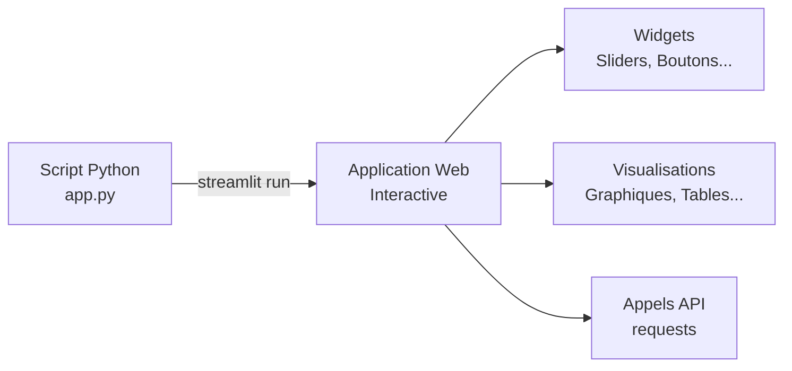

### Pourquoi Streamlit est idéal pour les démos ML

| Critère | Streamlit | Flask / Django | Flutter |
|---------|-----------|----------------|---------|
| **Langage** | Python uniquement | Python (+ HTML/JS) | Dart |
| **Courbe d'apprentissage** | ~1 heure | ~1 semaine | ~1 mois |
| **Widgets interactifs** | Intégrés (`st.slider`, `st.button`) | Manuels (formulaires HTML) | Manuels (Material widgets) |
| **Réactivité** | Automatique (re-exécution du script) | Manuelle (routes/callbacks) | Manuelle (setState) |
| **Déploiement** | Streamlit Cloud (gratuit) | Serveur web requis | Build mobile/web |
| **Cas d'usage principal** | Prototypage rapide, démos ML | Applications web complètes | Applications mobiles/web |

### Le modèle de réactivité de Streamlit

Streamlit utilise un modèle **top-to-bottom** : à chaque interaction utilisateur (clic, slider...), le script entier est ré-exécuté du début à la fin. C'est ce qui rend le framework si simple — pas de callbacks, pas de gestion d'état complexe.

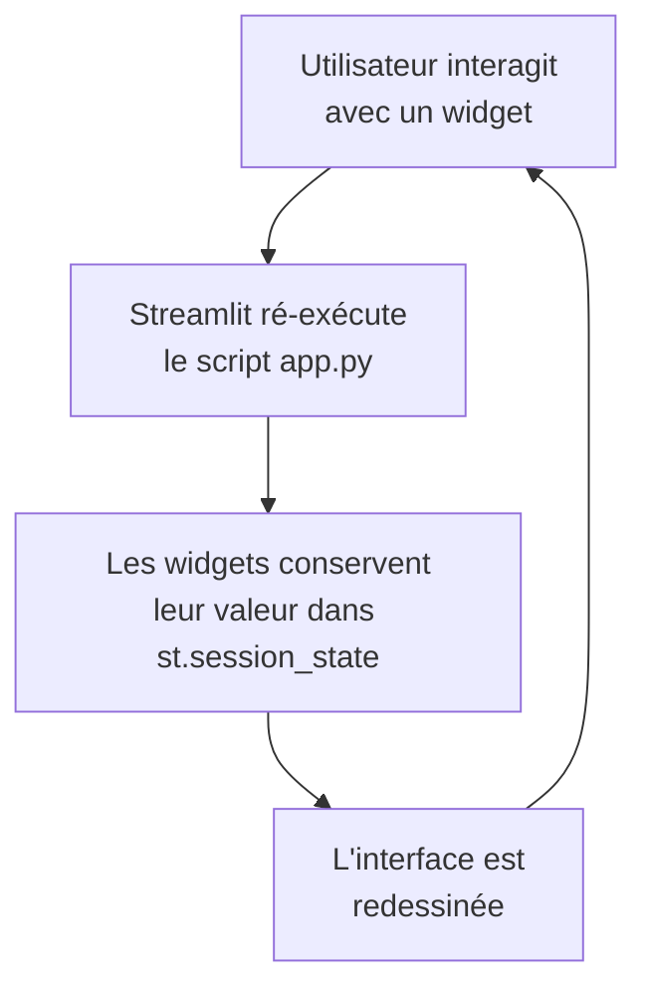

### Notre projet : Iris ML Demo

Nous allons construire une application Streamlit à **3 pages** qui consomme notre API FastAPI :

| Page | Fonctionnalité | Endpoints API utilisés |
|------|---------------|----------------------|
| 🔬 Prédiction | Prédire l'espèce d'une fleur Iris | `POST /predict` |
| 🧠 Modèle | Afficher les informations du modèle ML | `GET /model/info` |
| 📊 Dataset | Explorer le dataset Iris | `GET /dataset/samples`, `GET /dataset/stats` |

</details>

<p align="right"><a href="#top">↑ Retour en haut</a></p>

---

<a id="section-2"></a>

<details>
<summary><strong>2 — Installation et configuration</strong></summary>

### Installation des dépendances

```bash
pip install streamlit requests pandas
```

Vérifiez l'installation :

```bash
streamlit --version
# Ex: Streamlit, version 1.45.0
```

### Configuration de l'application avec `st.set_page_config`

La toute première commande Streamlit dans votre script doit être `st.set_page_config`. Elle configure les métadonnées de la page web :

```python
import streamlit as st

st.set_page_config(
    page_title="Iris ML Demo",
    page_icon="🌸",
    layout="wide",
    initial_sidebar_state="expanded",
)
```

| Paramètre | Description | Valeur utilisée |
|-----------|-------------|-----------------|
| `page_title` | Titre affiché dans l'onglet du navigateur | `"Iris ML Demo"` |
| `page_icon` | Favicon de la page | `"🌸"` |
| `layout` | `"centered"` (défaut) ou `"wide"` | `"wide"` — utilise toute la largeur |
| `initial_sidebar_state` | `"auto"`, `"expanded"` ou `"collapsed"` | `"expanded"` |

> ⚠️ `st.set_page_config` **doit** être la première commande Streamlit du script, avant tout autre appel `st.*`.

### Lancement de l'application

```bash
streamlit run frontend-streamlit/app.py
```

L'application sera accessible à l'adresse `http://localhost:8501`.

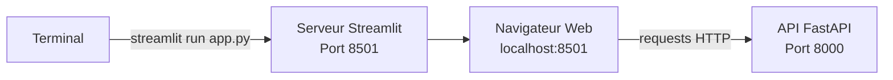

### Structure du projet

```
full-app-pandas/
├── backend/
│   ├── main.py              # API FastAPI
│   └── models/
│       ├── iris_model.joblib # Modèle entraîné
│       └── model_metadata.json
├── frontend-streamlit/
│   └── app.py               # ← Notre application Streamlit
├── notebooks/
│   └── train_model.ipynb
└── requirements.txt
```

</details>

<p align="right"><a href="#top">↑ Retour en haut</a></p>

---

<a id="section-3"></a>

<details>
<summary><strong>3 — Structure de l'application</strong></summary>

### Vue d'ensemble de `app.py`

Le fichier `app.py` suit une organisation logique en 5 blocs :

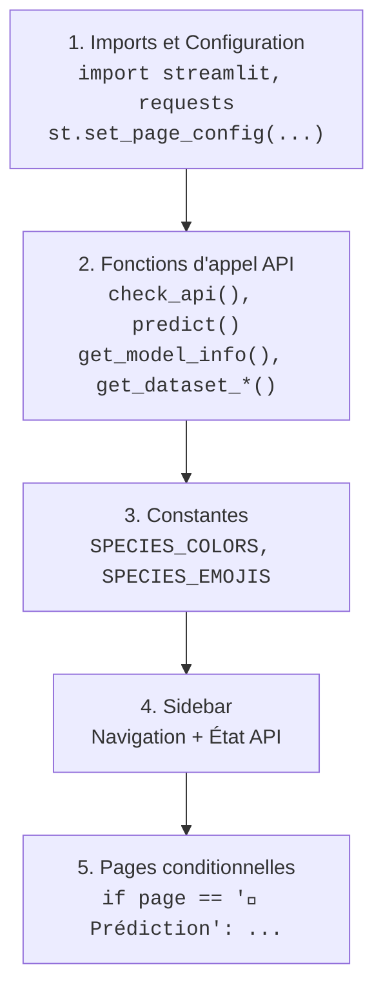

### Bloc 1 : Imports et configuration

```python
import streamlit as st
import requests
import json

API_BASE_URL = "http://localhost:8000"

st.set_page_config(
    page_title="Iris ML Demo",
    page_icon="🌸",
    layout="wide",
    initial_sidebar_state="expanded",
)
```

Trois bibliothèques suffisent :

| Bibliothèque | Rôle |
|--------------|------|
| `streamlit` | Framework UI — tous les widgets et la mise en page |
| `requests` | Client HTTP — appels vers l'API FastAPI |
| `json` | Sérialisation JSON (importé par habitude, `requests` gère déjà le JSON) |

### Bloc 2 : Fonctions d'appel API

Quatre fonctions encapsulent les appels HTTP vers le backend (détaillées en section 4).

### Bloc 3 : Constantes de style

```python
SPECIES_COLORS = {
    "setosa": "#4CAF50",
    "versicolor": "#2196F3",
    "virginica": "#9C27B0",
}

SPECIES_EMOJIS = {
    "setosa": "🌸",
    "versicolor": "🌺",
    "virginica": "🌷",
}
```

Ces dictionnaires associent chaque espèce à une couleur et un emoji pour un affichage cohérent sur toutes les pages.

### Bloc 4 : Sidebar (détaillée en section 5)

### Bloc 5 : Pages conditionnelles

Le routage entre les pages est un simple `if/elif` basé sur la valeur du `st.radio` de la sidebar :

```python
if page == "🔬 Prédiction":
    # ... code de la page Prédiction
elif page == "🧠 Modèle":
    # ... code de la page Modèle
elif page == "📊 Dataset":
    # ... code de la page Dataset
```

> **Astuce** : Dans Streamlit, il n'y a pas de système de routage complexe. Une simple condition `if/elif` suffit pour créer un système de navigation multi-pages.

</details>

<p align="right"><a href="#top">↑ Retour en haut</a></p>

---

<a id="section-4"></a>

<details>
<summary><strong>4 — Les fonctions d'appel API</strong></summary>

### Vue d'ensemble des appels

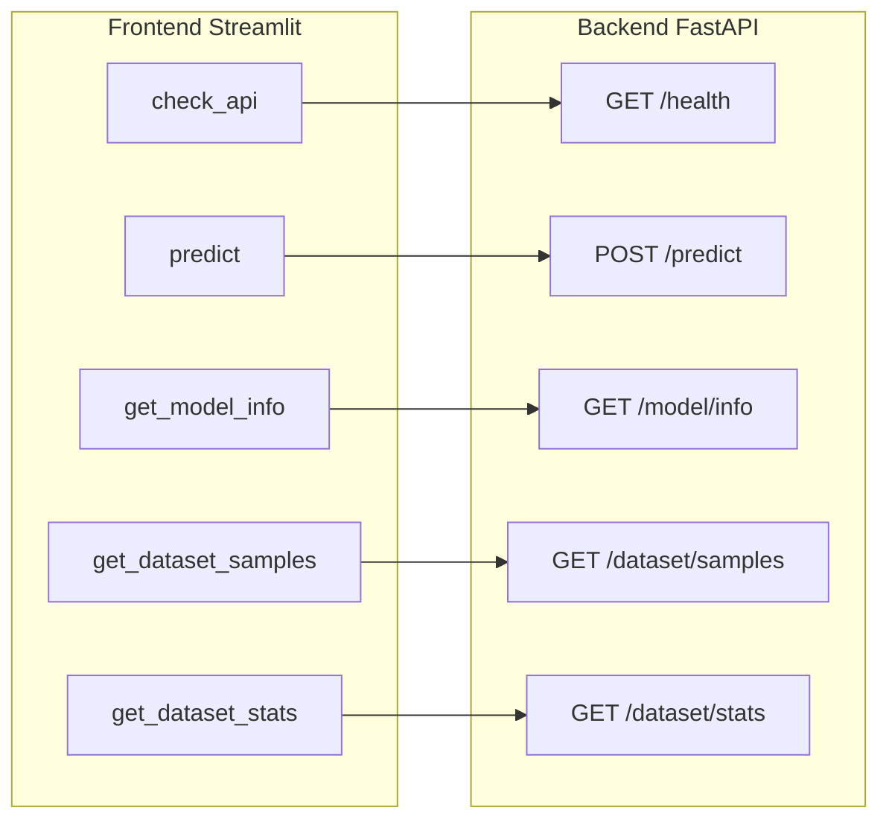

### 4.1 — `check_api()` : Vérification de santé

```python
def check_api():
    try:
        r = requests.get(f"{API_BASE_URL}/health", timeout=3)
        return r.status_code == 200 and r.json().get("status") == "healthy"
    except Exception:
        return False
```

| Aspect | Détail |
|--------|--------|
| **Méthode HTTP** | `GET` |
| **Endpoint** | `/health` |
| **Timeout** | 3 secondes — évite un blocage si l'API est hors ligne |
| **Retour** | `True` si l'API répond avec `{"status": "healthy"}`, `False` sinon |
| **Gestion d'erreur** | `try/except` global — toute exception retourne `False` |

Le `timeout=3` est crucial : sans lui, `requests.get` pourrait bloquer indéfiniment si le serveur ne répond pas, gelant l'interface Streamlit.

### 4.2 — `predict()` : Prédiction

```python
def predict(sepal_length, sepal_width, petal_length, petal_width):
    payload = {
        "sepal_length": sepal_length,
        "sepal_width": sepal_width,
        "petal_length": petal_length,
        "petal_width": petal_width,
    }
    r = requests.post(f"{API_BASE_URL}/predict", json=payload)
    r.raise_for_status()
    return r.json()
```

| Aspect | Détail |
|--------|--------|
| **Méthode HTTP** | `POST` |
| **Endpoint** | `/predict` |
| **Paramètre `json=`** | Sérialise automatiquement le dictionnaire en JSON et ajoute le header `Content-Type: application/json` |
| **`raise_for_status()`** | Lève une `HTTPError` si le code de statut est 4xx ou 5xx |
| **Réponse attendue** | `{"species": "setosa", "confidence": 0.97, "probabilities": {...}}` |

> **`json=payload`** vs **`data=json.dumps(payload)`** : Utilisez toujours `json=` avec `requests`. C'est plus propre et gère automatiquement l'en-tête `Content-Type`.

### 4.3 — `get_model_info()` : Informations du modèle

```python
def get_model_info():
    r = requests.get(f"{API_BASE_URL}/model/info")
    r.raise_for_status()
    return r.json()
```

Réponse attendue :

```json
{
  "model_type": "RandomForestClassifier",
  "accuracy": 0.9667,
  "feature_names": ["sepal length (cm)", "sepal width (cm)", ...],
  "target_names": ["setosa", "versicolor", "virginica"],
  "feature_importances": {"petal length (cm)": 0.45, ...},
  "training_samples": 120,
  "test_samples": 30
}
```

### 4.4 — `get_dataset_samples()` et `get_dataset_stats()`

```python
def get_dataset_samples():
    r = requests.get(f"{API_BASE_URL}/dataset/samples")
    r.raise_for_status()
    return r.json()


def get_dataset_stats():
    r = requests.get(f"{API_BASE_URL}/dataset/stats")
    r.raise_for_status()
    return r.json()
```

Ces deux fonctions suivent le même patron : `GET` → `raise_for_status()` → `r.json()`.

### Récapitulatif du patron d'appel API

Toutes les fonctions suivent le même patron en 3 étapes :

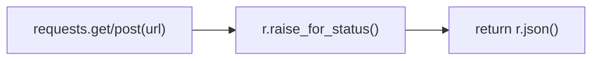

| Étape | Rôle |
|-------|------|
| `requests.get/post(url)` | Envoie la requête HTTP |
| `r.raise_for_status()` | Lève une exception si erreur HTTP |
| `return r.json()` | Désérialise la réponse JSON en dictionnaire Python |

</details>

<p align="right"><a href="#top">↑ Retour en haut</a></p>

---

<a id="section-5"></a>

<details>
<summary><strong>5 — La sidebar — Navigation et état de l'API</strong></summary>

### Code complet de la sidebar

```python
with st.sidebar:
    st.title("🌸 Iris ML Demo")
    st.caption("Application Full-Stack de classification de fleurs Iris")

    api_ok = check_api()
    if api_ok:
        st.success("✅ API connectée")
    else:
        st.error("❌ API hors ligne — Lancez le backend FastAPI sur le port 8000")

    st.divider()
    page = st.radio(
        "Navigation",
        ["🔬 Prédiction", "🧠 Modèle", "📊 Dataset"],
        label_visibility="collapsed",
    )
```

### Analyse détaillée

#### Le bloc `with st.sidebar:`

Le context manager `with st.sidebar:` redirige tous les widgets `st.*` vers la barre latérale au lieu du contenu principal :

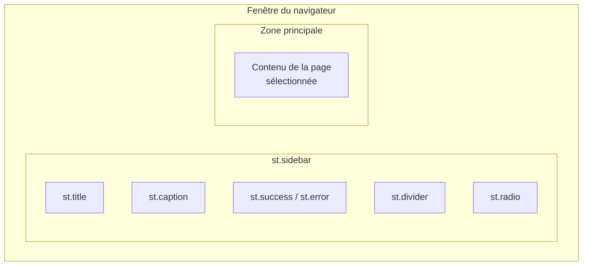

#### L'indicateur d'état de l'API

```python
api_ok = check_api()
if api_ok:
    st.success("✅ API connectée")
else:
    st.error("❌ API hors ligne — Lancez le backend FastAPI sur le port 8000")
```

| Widget | Apparence | Utilisation |
|--------|-----------|-------------|
| `st.success(msg)` | Bannière verte ✅ | API accessible |
| `st.error(msg)` | Bannière rouge ❌ | API hors ligne |

La variable `api_ok` est réutilisée dans chaque page pour conditionner les appels API.

#### La navigation avec `st.radio`

```python
page = st.radio(
    "Navigation",
    ["🔬 Prédiction", "🧠 Modèle", "📊 Dataset"],
    label_visibility="collapsed",
)
```

| Paramètre | Valeur | Description |
|-----------|--------|-------------|
| Premier argument | `"Navigation"` | Label du widget (masqué grâce à `label_visibility`) |
| Deuxième argument | `[...]` | Liste des options |
| `label_visibility` | `"collapsed"` | Masque le label tout en conservant l'accessibilité |

Le `st.radio` retourne la valeur sélectionnée sous forme de `str`. C'est cette valeur qui sert de routeur dans le `if/elif` principal.

#### `st.divider()`

Insère une ligne horizontale de séparation visuelle. Équivalent de `st.markdown("---")` mais sémantiquement plus clair.

</details>

<p align="right"><a href="#top">↑ Retour en haut</a></p>

---

<a id="section-6"></a>

<details>
<summary><strong>6 — Page Prédiction</strong></summary>

### Aperçu de la page

La page Prédiction permet à l'utilisateur d'ajuster 4 mesures de fleur via des sliders et d'obtenir une prédiction d'espèce en temps réel.

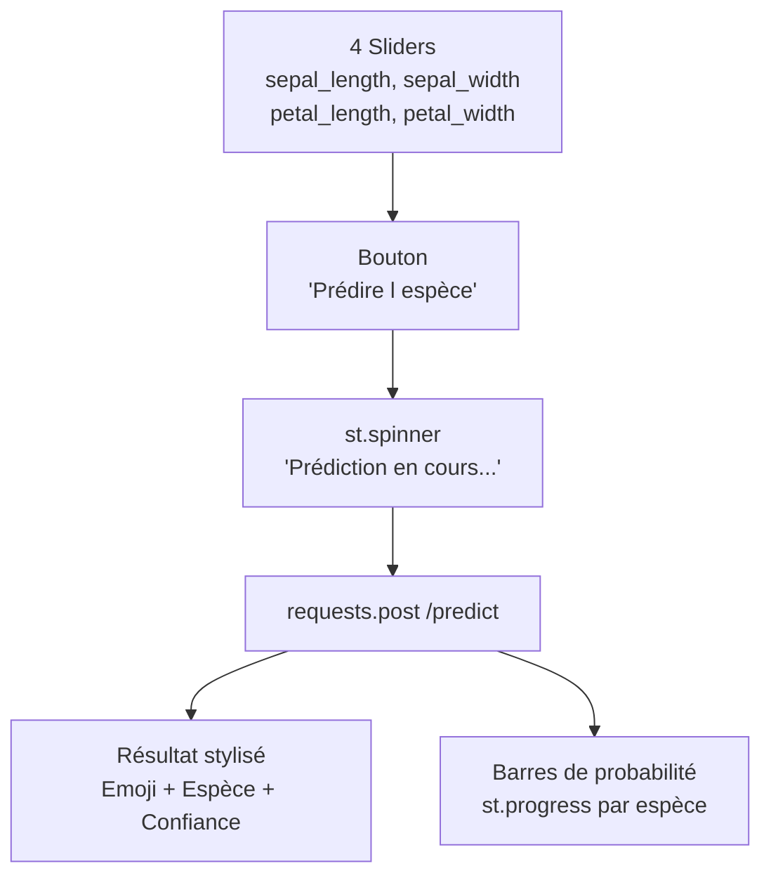

### Les sliders d'entrée

```python
col1, col2 = st.columns(2)

with col1:
    st.subheader("Sépales")
    sepal_length = st.slider("Longueur du sépale (cm)", 4.0, 8.0, 5.1, 0.1)
    sepal_width = st.slider("Largeur du sépale (cm)", 2.0, 4.5, 3.5, 0.1)

with col2:
    st.subheader("Pétales")
    petal_length = st.slider("Longueur du pétale (cm)", 1.0, 7.0, 1.4, 0.1)
    petal_width = st.slider("Largeur du pétale (cm)", 0.1, 2.5, 0.2, 0.1)
```

La signature de `st.slider` :

```python
st.slider(label, min_value, max_value, value, step)
```

| Paramètre | Description | Exemple |
|-----------|-------------|---------|
| `label` | Texte affiché au-dessus du slider | `"Longueur du sépale (cm)"` |
| `min_value` | Valeur minimale | `4.0` |
| `max_value` | Valeur maximale | `8.0` |
| `value` | Valeur par défaut | `5.1` |
| `step` | Pas d'incrémentation | `0.1` |

Les sliders sont répartis en 2 colonnes (`st.columns(2)`) : sépales à gauche, pétales à droite.

### Le bouton de prédiction

```python
if st.button("🔮 Prédire l'espèce", type="primary", use_container_width=True):
```

| Paramètre | Valeur | Effet |
|-----------|--------|-------|
| `type="primary"` | Bouton bleu (style principal) au lieu du bouton gris par défaut |
| `use_container_width=True` | Le bouton occupe toute la largeur de son conteneur |

`st.button` retourne `True` au moment du clic, puis `False` à la ré-exécution suivante. Tout le code de prédiction est dans le bloc `if`.

### Le spinner de chargement

```python
with st.spinner("Prédiction en cours..."):
    result = predict(sepal_length, sepal_width, petal_length, petal_width)
```

`st.spinner` affiche un indicateur de chargement pendant l'exécution du bloc `with`. Dès que l'appel API retourne, le spinner disparaît.

### Affichage du résultat avec HTML personnalisé

```python
species = result["species"]
confidence = result["confidence"]
probabilities = result["probabilities"]

emoji = SPECIES_EMOJIS.get(species, "🌼")
color = SPECIES_COLORS.get(species, "#666")

st.markdown(
    f"<div style='text-align:center;padding:20px;'>"
    f"<span style='font-size:80px;'>{emoji}</span><br/>"
    f"<span style='font-size:32px;font-weight:bold;color:{color};'>"
    f"{species.upper()}</span><br/>"
    f"<span style='background:{color}22;color:{color};"
    f"padding:6px 16px;border-radius:20px;font-weight:600;'>"
    f"Confiance : {confidence*100:.1f}%</span>"
    f"</div>",
    unsafe_allow_html=True,
)
```

> **`unsafe_allow_html=True`** : Par défaut, Streamlit échappe le HTML dans `st.markdown`. Ce paramètre permet d'injecter du HTML brut pour un style personnalisé (ici, un badge coloré avec l'emoji et le taux de confiance).

### Les barres de probabilité

```python
for name, prob in probabilities.items():
    st.markdown(f"**:{name}** — `{prob*100:.1f}%`")
    st.progress(prob)
```

`st.progress(value)` affiche une barre de progression où `value` est un `float` entre `0.0` et `1.0`. Chaque espèce obtient sa propre barre, permettant une comparaison visuelle immédiate.

| Widget | Entrée | Rendu |
|--------|--------|-------|
| `st.progress(0.97)` | Float 0-1 | Barre remplie à 97% |
| `st.progress(0.02)` | Float 0-1 | Barre remplie à 2% |

</details>

<p align="right"><a href="#top">↑ Retour en haut</a></p>

---

<a id="section-7"></a>

<details>
<summary><strong>7 — Page Modèle</strong></summary>

### Aperçu de la page

La page Modèle affiche les caractéristiques du modèle de Machine Learning entraîné : type, précision, importance des features et classes cibles.

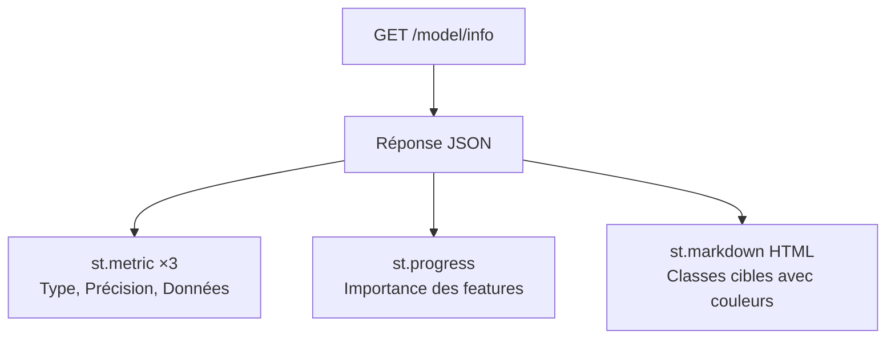

### Les métriques principales avec `st.metric`

```python
info = get_model_info()

col1, col2, col3 = st.columns(3)
with col1:
    st.metric("Type de modèle", info["model_type"].replace("Classifier", ""))
with col2:
    st.metric("Précision", f"{info['accuracy']*100:.1f}%")
with col3:
    st.metric(
        "Données",
        f"{info['training_samples'] + info['test_samples']} total",
        f"{info['training_samples']} train / {info['test_samples']} test",
    )
```

La signature de `st.metric` :

```python
st.metric(label, value, delta=None)
```

| Paramètre | Description | Exemple |
|-----------|-------------|---------|
| `label` | Titre de la métrique | `"Précision"` |
| `value` | Valeur principale (grand texte) | `"96.7%"` |
| `delta` | Texte secondaire (petit, en dessous) | `"120 train / 30 test"` |

`st.metric` est idéal pour afficher des KPIs : il rend la valeur très visible avec un style prédéfini.

### Importance des features avec `st.progress`

```python
sorted_features = sorted(
    info["feature_importances"].items(),
    key=lambda x: x[1],
    reverse=True,
)
for feat, imp in sorted_features:
    st.markdown(f"**{feat}** — `{imp*100:.1f}%`")
    st.progress(imp)
```

Les features sont triées par importance décroissante. Chaque feature est affichée avec son nom, son pourcentage et une barre de progression proportionnelle.

### Classes cibles avec HTML stylisé

```python
for name in info["target_names"]:
    emoji = SPECIES_EMOJIS.get(name, "🌼")
    color = SPECIES_COLORS.get(name, "#666")
    st.markdown(
        f"<span style='font-size:24px;'>{emoji}</span> "
        f"<span style='color:{color};font-weight:bold;font-size:18px;'>"
        f"{name.capitalize()}</span>",
        unsafe_allow_html=True,
    )
```

Chaque espèce est affichée avec son emoji et sa couleur distinctive, offrant une identification visuelle rapide.

### Liste des features utilisées

```python
st.subheader("Features utilisées")
for feat in info["feature_names"]:
    st.markdown(f"- `{feat}`")
```

Une simple liste à puces des noms de colonnes utilisées par le modèle.

### Disposition en colonnes

La page utilise un layout en 2 colonnes (`st.columns(2)`) :

| Colonne gauche | Colonne droite |
|---------------|----------------|
| Importance des features (barres) | Classes cibles (emoji + couleur) |
| | Features utilisées (liste) |

</details>

<p align="right"><a href="#top">↑ Retour en haut</a></p>

---

<a id="section-8"></a>

<details>
<summary><strong>8 — Page Dataset</strong></summary>

### Aperçu de la page

La page Dataset permet d'explorer le jeu de données Iris : statistiques globales, distribution par espèce, statistiques des features et échantillons aléatoires.

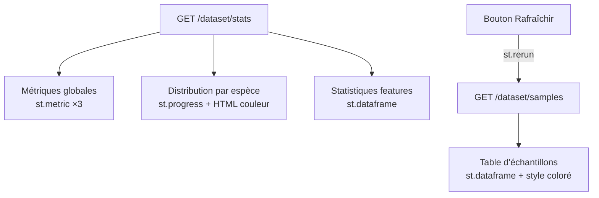

### Métriques globales

```python
stats = get_dataset_stats()

col1, col2, col3 = st.columns(3)
with col1:
    st.metric("Échantillons", stats["total_samples"])
with col2:
    st.metric("Features", stats["features_count"])
with col3:
    st.metric("Espèces", stats["species_count"])
```

Trois `st.metric` en colonnes résument le dataset en un coup d'œil.

### Distribution par espèce

```python
dist = stats["species_distribution"]
total = sum(dist.values())
for name, count in dist.items():
    color = SPECIES_COLORS.get(name, "#666")
    pct = count / total * 100
    st.markdown(
        f"<span style='color:{color};font-weight:bold;'>"
        f"● {name.capitalize()}</span> — {count} ({pct:.0f}%)",
        unsafe_allow_html=True,
    )
    st.progress(count / total)
```

Chaque espèce est affichée avec :
- Un point coloré (`●`) dans la couleur de l'espèce
- Le nombre d'échantillons et le pourcentage
- Une barre de progression proportionnelle

### Statistiques des features avec `st.dataframe`

```python
import pandas as pd

feat_stats = stats["feature_stats"]
df_stats = pd.DataFrame(feat_stats).T
df_stats.columns = ["Min", "Max", "Moyenne", "Écart-type"]
st.dataframe(df_stats, use_container_width=True)
```

| Étape | Description |
|-------|-------------|
| `pd.DataFrame(feat_stats).T` | Convertit le dictionnaire en DataFrame et le transpose (features en lignes) |
| `.columns = [...]` | Renomme les colonnes en français |
| `st.dataframe(..., use_container_width=True)` | Affiche le DataFrame dans un tableau interactif pleine largeur |

`st.dataframe` offre un tableau interactif : tri par colonne (clic sur l'en-tête), recherche, et redimensionnement.

### Échantillons aléatoires avec `st.rerun`

```python
st.subheader("Échantillons aléatoires")
if st.button("🔄 Charger de nouveaux échantillons", use_container_width=True):
    st.rerun()

samples = get_dataset_samples()
df_samples = pd.DataFrame(samples)
df_samples.columns = [
    "Sép. Longueur", "Sép. Largeur",
    "Pét. Longueur", "Pét. Largeur", "Espèce"
]
```

`st.rerun()` force la ré-exécution complète du script. Comme l'endpoint `/dataset/samples` retourne des échantillons aléatoires, chaque ré-exécution affiche de nouvelles données.

### Lignes colorées par espèce avec `DataFrame.style`

```python
st.dataframe(
    df_samples.style.apply(
        lambda row: [
            f"color: {SPECIES_COLORS.get(row['Espèce'], '#666')}"
        ] * len(row),
        axis=1,
    ),
    use_container_width=True,
    hide_index=True,
)
```

| Concept | Explication |
|---------|-------------|
| `df.style.apply(func, axis=1)` | Applique une fonction de style à chaque ligne |
| `lambda row: [css] * len(row)` | Retourne une liste de styles CSS, un par cellule de la ligne |
| `SPECIES_COLORS.get(row['Espèce'])` | Récupère la couleur associée à l'espèce de la ligne |
| `hide_index=True` | Masque la colonne d'index du DataFrame |

Le résultat : les lignes Setosa sont vertes, Versicolor bleues et Virginica violettes.

</details>

<p align="right"><a href="#top">↑ Retour en haut</a></p>

---

<a id="section-9"></a>

<details>
<summary><strong>9 — Les widgets Streamlit essentiels</strong></summary>

### Référence complète des widgets utilisés dans notre application

#### Widgets d'entrée

| Widget | Description | Exemple |
|--------|-------------|---------|
| `st.slider` | Curseur pour sélectionner une valeur numérique | `st.slider("Longueur", 4.0, 8.0, 5.1, 0.1)` |
| `st.button` | Bouton cliquable (retourne `True` au clic) | `st.button("Prédire", type="primary")` |
| `st.radio` | Sélection unique parmi une liste d'options | `st.radio("Nav", ["Page1", "Page2"])` |
| `st.text_input` | Champ de saisie texte libre | `st.text_input("Nom", "valeur par défaut")` |
| `st.selectbox` | Menu déroulant de sélection | `st.selectbox("Espèce", ["setosa", "versicolor"])` |
| `st.checkbox` | Case à cocher (retourne `True`/`False`) | `st.checkbox("Afficher les détails")` |
| `st.number_input` | Champ numérique avec boutons +/- | `st.number_input("Âge", 0, 120, 25)` |

#### Widgets d'affichage

| Widget | Description | Exemple |
|--------|-------------|---------|
| `st.metric` | Affiche un KPI avec label, valeur et delta | `st.metric("Précision", "96.7%", "↑ 2.1%")` |
| `st.progress` | Barre de progression (float 0.0 à 1.0) | `st.progress(0.97)` |
| `st.dataframe` | Tableau interactif (tri, recherche) | `st.dataframe(df, use_container_width=True)` |
| `st.markdown` | Texte Markdown (optionnel : HTML brut) | `st.markdown("**Gras**", unsafe_allow_html=True)` |

#### Widgets de mise en page

| Widget | Description | Exemple |
|--------|-------------|---------|
| `st.columns` | Crée des colonnes côte à côte | `c1, c2 = st.columns(2)` |
| `st.sidebar` | Barre latérale | `with st.sidebar: st.title("Menu")` |
| `st.divider` | Ligne horizontale de séparation | `st.divider()` |

#### Widgets d'état et feedback

| Widget | Description | Exemple |
|--------|-------------|---------|
| `st.spinner` | Indicateur de chargement | `with st.spinner("..."): appel_api()` |
| `st.success` | Bannière verte (succès) | `st.success("✅ Opération réussie")` |
| `st.error` | Bannière rouge (erreur) | `st.error("❌ Échec de connexion")` |
| `st.warning` | Bannière jaune (avertissement) | `st.warning("⚠️ Données manquantes")` |
| `st.info` | Bannière bleue (information) | `st.info("ℹ️ 150 échantillons chargés")` |

### Exemple complet combinant plusieurs widgets

```python
import streamlit as st

st.title("Démo des widgets")

col1, col2 = st.columns(2)

with col1:
    nom = st.text_input("Votre nom")
    age = st.number_input("Votre âge", 0, 120, 25)
    actif = st.checkbox("Actif ?")

with col2:
    score = st.slider("Score", 0.0, 1.0, 0.5, 0.01)
    categorie = st.selectbox("Catégorie", ["A", "B", "C"])

if st.button("Valider"):
    with st.spinner("Traitement..."):
        st.metric("Score final", f"{score*100:.0f}%")
        st.progress(score)
        st.success(f"Merci {nom} !")
```

</details>

<p align="right"><a href="#top">↑ Retour en haut</a></p>

---

<a id="section-10"></a>

<details>
<summary><strong>10 — Mise en page et colonnes</strong></summary>

### Les stratégies de layout dans Streamlit

Streamlit offre plusieurs conteneurs pour organiser le contenu de la page.

### `st.columns` — Colonnes côte à côte

```python
# Colonnes de largeur égale
col1, col2 = st.columns(2)

# Colonnes de largeur personnalisée (ratio 1:2)
col_petit, col_grand = st.columns([1, 2])

# 3 colonnes égales
c1, c2, c3 = st.columns(3)
```

Dans notre application, `st.columns` est utilisé partout :

| Page | Usage | Configuration |
|------|-------|--------------|
| Prédiction | Sliders sépales / pétales | `st.columns(2)` |
| Prédiction | Résultat emoji / probabilités | `st.columns([1, 2])` |
| Modèle | Métriques type / précision / données | `st.columns(3)` |
| Modèle | Importances / classes cibles | `st.columns(2)` |
| Dataset | Métriques échantillons / features / espèces | `st.columns(3)` |
| Dataset | Distribution / statistiques features | `st.columns(2)` |

### `st.sidebar` — Barre latérale

```python
with st.sidebar:
    st.title("Menu")
    page = st.radio("Navigation", ["Accueil", "Paramètres"])
```

La sidebar reste visible sur toutes les pages. Idéale pour la navigation et les contrôles globaux.

### `st.container` — Regrouper des éléments

```python
with st.container():
    st.header("Bloc regroupé")
    st.write("Ce contenu est dans un container.")
    st.button("Action")
```

`st.container` regroupe logiquement des widgets. Utile pour insérer du contenu à un endroit précis du layout.

### `st.expander` — Section repliable

```python
with st.expander("Voir les détails avancés"):
    st.write("Contenu masqué par défaut.")
    st.code("print('hello')")
```

L'expander est une section repliable avec un chevron `▶`. Parfait pour les informations secondaires.

### `st.tabs` — Onglets

```python
tab1, tab2 = st.tabs(["📈 Graphique", "📋 Données"])

with tab1:
    st.line_chart(data)

with tab2:
    st.dataframe(df)
```

Les onglets permettent de basculer entre différentes vues sans recharger la page.

### Combinaison de layouts

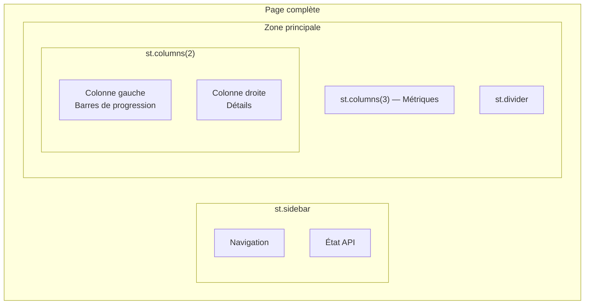

> **Conseil** : Commencez toujours par un wireframe mental : métriques en haut (3 colonnes), détails au milieu (2 colonnes), tableau en bas (pleine largeur). C'est le patron que notre application suit.

</details>

<p align="right"><a href="#top">↑ Retour en haut</a></p>

---

<a id="section-11"></a>

<details>
<summary><strong>11 — Gestion des erreurs et états de chargement</strong></summary>

### Le patron `check_api` → Condition → Appel

Chaque page vérifie d'abord si l'API est accessible avant de tenter un appel :

```python
if not api_ok:
    st.error("L'API n'est pas accessible.")
else:
    try:
        data = get_model_info()
        # ... afficher les données ...
    except Exception as e:
        st.error(f"Erreur : {e}")
```

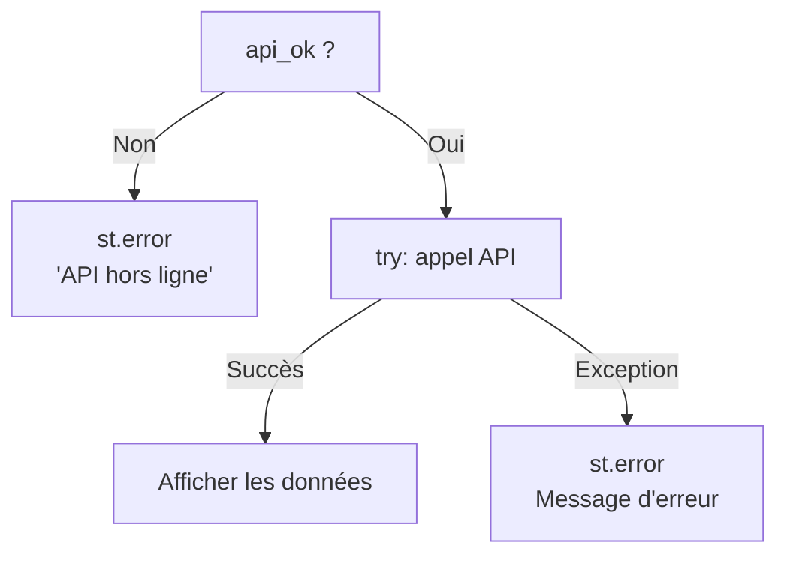

### Les 3 couches de protection

| Couche | Mécanisme | Où |
|--------|-----------|-----|
| **1. Health check** | `check_api()` avec timeout de 3s | Sidebar — exécuté à chaque ré-exécution |
| **2. Condition `api_ok`** | `if not api_ok: st.error(...)` | Début de chaque page |
| **3. try/except** | Capture les erreurs HTTP et réseau | Autour de chaque appel API |

### `st.spinner` — Feedback pendant le chargement

```python
with st.spinner("Prédiction en cours..."):
    result = predict(sepal_length, sepal_width, petal_length, petal_width)
```

Le spinner affiche une animation avec le message tant que le bloc `with` est en cours d'exécution. C'est essentiel pour l'UX : sans feedback, l'utilisateur pourrait croire que l'application est gelée.

### `raise_for_status()` — Convertir les erreurs HTTP en exceptions

```python
r = requests.post(f"{API_BASE_URL}/predict", json=payload)
r.raise_for_status()  # Lève HTTPError si status 4xx/5xx
return r.json()
```

| Code HTTP | Comportement sans `raise_for_status` | Comportement avec `raise_for_status` |
|-----------|--------------------------------------|--------------------------------------|
| 200 | `r.json()` fonctionne | `r.json()` fonctionne |
| 422 | `r.json()` retourne le détail d'erreur FastAPI | Lève `requests.exceptions.HTTPError` |
| 500 | `r.json()` peut échouer | Lève `requests.exceptions.HTTPError` |
| Timeout | `requests.exceptions.Timeout` | `requests.exceptions.Timeout` |

### Bonnes pratiques

1. **Toujours vérifier l'API avant d'appeler** — Un seul `check_api()` dans la sidebar suffit
2. **Toujours wraper les appels dans try/except** — Les erreurs réseau sont imprévisibles
3. **Utiliser `timeout` pour les health checks** — Évite de bloquer l'interface
4. **Afficher des messages d'erreur clairs** — L'utilisateur doit comprendre quoi faire (`"Lancez le backend FastAPI"`)
5. **Utiliser `st.spinner` pour les opérations longues** — Feedback visuel immédiat

</details>

<p align="right"><a href="#top">↑ Retour en haut</a></p>

---

<a id="section-12"></a>

<details>
<summary><strong>12 — Streamlit vs Flutter pour consommer une API</strong></summary>

### Tableau comparatif détaillé

| Critère | Streamlit | Flutter |
|---------|-----------|---------|
| **Langage** | Python | Dart |
| **Paradigme** | Script séquentiel (top-to-bottom) | Orienté objet (Widgets/State) |
| **Courbe d'apprentissage** | ~1h pour un développeur Python | ~1-2 semaines |
| **Lignes de code** (notre app) | ~270 lignes (1 fichier) | ~800+ lignes (multiples fichiers) |
| **Appel API** | `requests.post(url, json=data)` | `http.post(Uri.parse(url), body: jsonEncode(data))` |
| **Parsing JSON** | `r.json()` → `dict` natif | `jsonDecode(response.body)` → `Map` |
| **Widgets interactifs** | Intégrés (`st.slider`, `st.button`) | Material widgets (+ gestion d'état) |
| **Réactivité** | Automatique (ré-exécution du script) | Manuelle (`setState()`, `Provider`, `Bloc`) |
| **Gestion d'état** | Implicite (`st.session_state`) | Explicite (Provider, Riverpod, Bloc) |
| **Mise en page** | `st.columns`, `st.sidebar` (simple) | `Row`, `Column`, `Scaffold` (flexible) |
| **Style personnalisé** | Limité (`unsafe_allow_html`) | Complet (thèmes Material) |
| **Plateformes** | Web uniquement | iOS, Android, Web, Desktop |
| **Déploiement** | `streamlit run` / Streamlit Cloud | Build natif / Firebase Hosting |
| **Performance** | Suffisante pour prototypage | Optimisée pour production |
| **Hot reload** | Automatique (détection de changement) | Hot reload Dart VM |
| **Cas d'usage idéal** | Démos ML, dashboards, prototypes | Applications mobiles/web en production |

### Appel API : comparaison de code

**Streamlit (Python)** :

```python
def predict(sepal_length, sepal_width, petal_length, petal_width):
    payload = {
        "sepal_length": sepal_length,
        "sepal_width": sepal_width,
        "petal_length": petal_length,
        "petal_width": petal_width,
    }
    r = requests.post(f"{API_BASE_URL}/predict", json=payload)
    r.raise_for_status()
    return r.json()
```

**Flutter (Dart)** :

```dart
Future<Map<String, dynamic>> predict(
  double sepalLength, double sepalWidth,
  double petalLength, double petalWidth,
) async {
  final response = await http.post(
    Uri.parse('$apiBaseUrl/predict'),
    headers: {'Content-Type': 'application/json'},
    body: jsonEncode({
      'sepal_length': sepalLength,
      'sepal_width': sepalWidth,
      'petal_length': petalLength,
      'petal_width': petalWidth,
    }),
  );
  if (response.statusCode != 200) {
    throw Exception('Erreur: ${response.statusCode}');
  }
  return jsonDecode(response.body);
}
```

### Quand choisir quoi ?

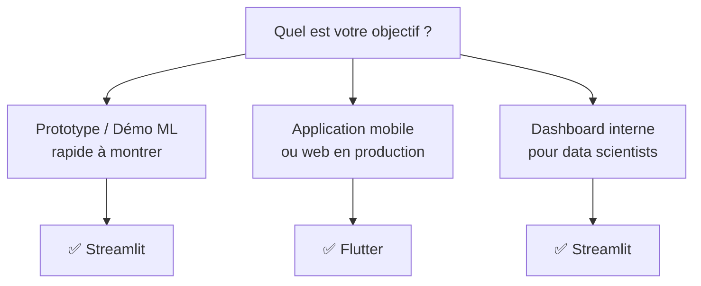

| Scénario | Choix recommandé | Raison |
|----------|-----------------|--------|
| Démo ML pour un client | **Streamlit** | Prêt en 1 heure, Python natif |
| Application mobile grand public | **Flutter** | Multi-plateforme, performance native |
| Dashboard d'analyse de données | **Streamlit** | Intégration Pandas/Matplotlib directe |
| Application web en production | **Flutter Web** ou **React** | Routage, état, tests, CI/CD |
| Hackathon / proof of concept | **Streamlit** | Vitesse de développement maximale |

</details>

<p align="right"><a href="#top">↑ Retour en haut</a></p>

---

<a id="section-13"></a>

<details>
<summary><strong>13 — Conclusion : Le flux complet</strong></summary>

### Diagramme de séquence complet

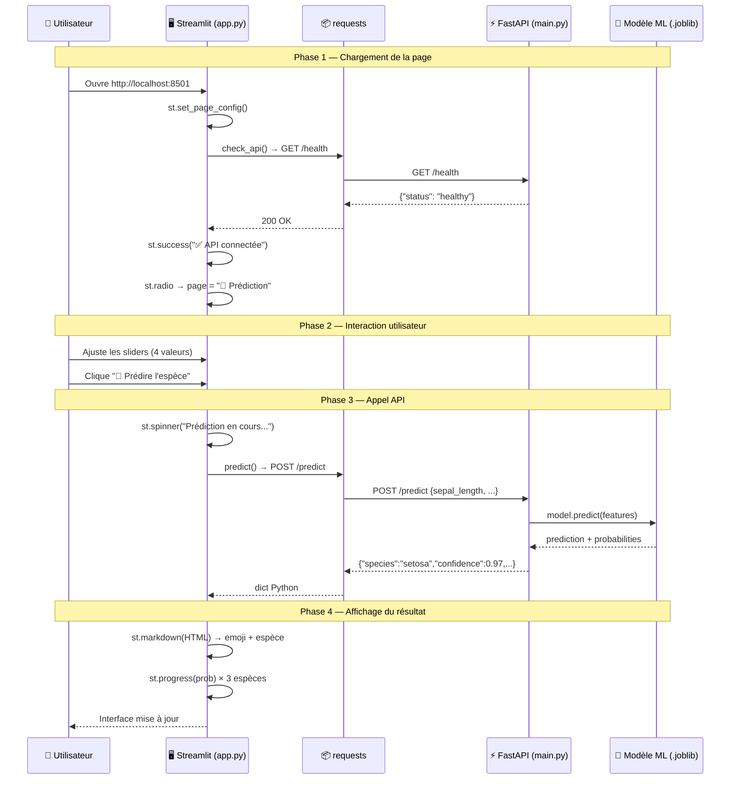

### Ce que nous avons appris

| # | Concept | Technologie |
|---|---------|-------------|
| 1 | Créer une application web interactive en Python pur | Streamlit |
| 2 | Configurer la page et le layout | `st.set_page_config`, `st.columns` |
| 3 | Construire une navigation multi-pages | `st.sidebar`, `st.radio`, `if/elif` |
| 4 | Appeler une API REST depuis Python | `requests.get/post`, `r.json()` |
| 5 | Afficher des métriques et KPIs | `st.metric`, `st.progress` |
| 6 | Afficher des tableaux interactifs | `st.dataframe`, `DataFrame.style` |
| 7 | Styliser avec du HTML personnalisé | `st.markdown(html, unsafe_allow_html=True)` |
| 8 | Gérer les erreurs et le chargement | `try/except`, `st.spinner`, `st.error` |
| 9 | Rafraîchir les données | `st.rerun()` |

### Architecture complète du projet

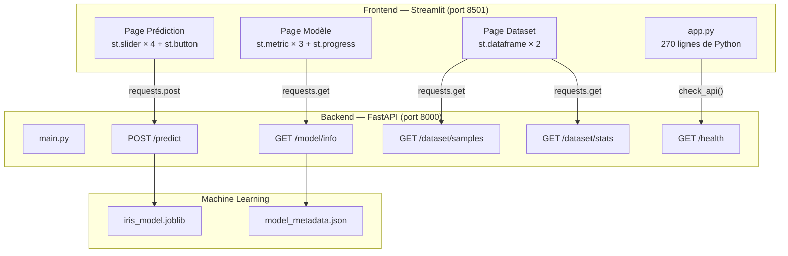

### Commandes pour lancer le projet complet

```bash
# Terminal 1 — Backend FastAPI
cd backend
uvicorn main:app --reload --port 8000

# Terminal 2 — Frontend Streamlit
cd frontend-streamlit
streamlit run app.py
```

> **Félicitations !** Vous savez maintenant construire une application Streamlit complète qui consomme une API REST FastAPI. Streamlit est l'outil idéal pour transformer un modèle de Machine Learning en une démo interactive en quelques minutes.

</details>

<p align="right"><a href="#top">↑ Retour en haut</a></p>

---

> **📚 Cours suivant** : Déploiement avec Docker et Docker Compose
